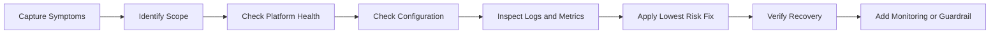
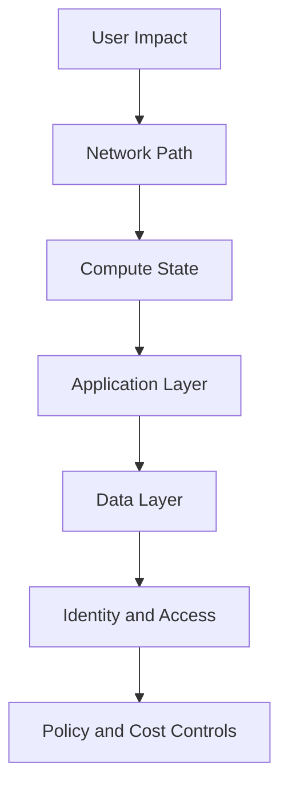

> **Screenshot Disclaimer:** Portal screenshots referenced in this guide are sourced from [Microsoft Learn](https://learn.microsoft.com/en-us/azure/) documentation. © Microsoft Corporation. All rights reserved. Used for educational reference only.

# 07 Azure Troubleshooting Guide

This guide is built for operational interview rounds where the interviewer wants to hear a structured diagnosis approach instead of random guesswork. For each issue, start with symptoms, narrow the failing layer, validate using Azure-native tools, then describe likely root causes and final resolution.

## Troubleshooting workflow



## Troubleshooting stack



### Scenario 1: VM Not Starting

**Symptoms:**
- VM shows `Stopped`, `Failed`, or provisioning issues.
- RDP and SSH are unavailable.
- Monitoring may show heartbeat loss.

**Troubleshooting Steps:**
1. Check VM instance view.
   ```bash
   az vm get-instance-view --resource-group myRG --name myVM --query instanceView.statuses --output table
   ```
2. Review Activity Log for failed operations.
3. Check Boot Diagnostics screenshot and serial output.
4. Use Serial Console if available.
5. Review extension failures and disk attachment status.
6. Consider redeploy or repair if guest OS corruption is suspected.

**Expected output:**
- Statuses such as `PowerState/running`, `ProvisioningState/failed`, or extension error messages.

**Root Causes:**
- OS update failure.
- Disk corruption.
- Extension hang.
- Quota or host maintenance issue.

**Resolution:**
Repair startup configuration, remove failing extensions, restore from backup, or redeploy the VM to a new host if platform placement is the issue.

**Portal Navigation:**
> **Portal View:** Navigate to `Virtual machines` → `myVM` → `Boot diagnostics` → `Screenshot` or `Serial console`.

### Scenario 2: Cannot RDP to Windows VM

**Symptoms:**
- RDP times out or is refused.
- VM appears running.
- Public or private reachability is uncertain.

**Troubleshooting Steps:**
1. Confirm VM is running and NIC is attached.
2. Check NSG effective rules for port 3389.
3. Validate route table and next hop.
4. Confirm Windows firewall permits RDP.
5. Reset RDP configuration if needed.
   ```bash
   az vm run-command invoke --resource-group myRG --name myVM --command-id RunPowerShellScript --scripts "Get-NetFirewallRule -DisplayGroup 'Remote Desktop'"
   ```
6. Try Bastion if public exposure is disabled.

**Root Causes:**
- NSG deny.
- Wrong public IP or no VPN path.
- Windows firewall blocking RDP.
- RDP service disabled.

**Resolution:**
Open the correct path, reset RDP settings, or use Bastion/private connectivity with proper rules.

**Portal Navigation:**
> `Virtual machines` → `myVM` → `Networking` → `Effective security rules`.

### Scenario 3: Cannot SSH to Linux VM

**Symptoms:**
- SSH timeout or connection refused.
- VM is up but unreachable.
- Bastion may or may not work.

**Troubleshooting Steps:**
1. Validate port 22 in NSG and route path.
2. Check host firewall and SSH daemon status.
   ```bash
   az vm run-command invoke --resource-group myRG --name myVM --command-id RunShellScript --scripts "systemctl status sshd || systemctl status ssh"
   ```
3. Use Serial Console for login recovery.
4. Confirm authorized keys and user permissions.
5. Check disk-full or boot issues affecting SSH service.

**Root Causes:**
- NSG or firewall block.
- Broken SSH service.
- Incorrect keys.
- Disk exhaustion.

**Resolution:**
Restart SSH, fix host firewall, correct keys, or repair the OS through console access.

**Portal Navigation:**
> `Virtual machines` → `Support + troubleshooting` → `Serial console`.

### Scenario 4: VM Performance Is Slow

**Symptoms:**
- High latency.
- CPU, memory, or disk queues elevated.
- Users report slowness or timeouts.

**Troubleshooting Steps:**
1. Review CPU, disk, and network metrics in Azure Monitor.
2. Check guest OS counters and processes.
3. Confirm VM size and disk SKU are appropriate.
4. Review recent deployments, patching, or backup activity.
5. Check dependency latency such as database calls.

```bash
az monitor metrics list --resource /subscriptions/<sub>/resourceGroups/myRG/providers/Microsoft.Compute/virtualMachines/myVM --metric "Percentage CPU" --interval PT1M
```

**Root Causes:**
- Undersized VM.
- Memory pressure or swap.
- Disk bottleneck.
- Noisy workload or application issue.

**Resolution:**
Right-size the VM, move to faster disks, tune the app, or scale out if the workload is horizontally scalable.

**Portal Navigation:**
> `Virtual machines` → `myVM` → `Metrics`.

### Scenario 5: NSG Is Blocking Traffic

**Symptoms:**
- Specific ports fail while others work.
- Connectivity works from some sources but not others.

**Troubleshooting Steps:**
1. Use IP flow verify.
   ```bash
   az network watcher test-ip-flow --resource-group myRG --vm myVM --direction Inbound --protocol TCP --local 10.0.1.4:443 --remote 203.0.113.10:50000
   ```
2. Check effective security rules.
3. Confirm subnet NSG and NIC NSG combinations.
4. Validate ASG references if used.
5. Confirm host firewall is not the real blocker.

**Expected output:**
- `Allow` or `Deny` and the matching NSG rule.

**Root Causes:**
- Rule priority issue.
- Missing allow from the correct source.
- Incorrect subnet or NIC association.

**Resolution:**
Correct rule priority, source scope, or NSG attachment and retest before broadening access further.

**Portal Navigation:**
> `Network Watcher` → `IP flow verify`.

### Scenario 6: Application Gateway Returns 502

**Symptoms:**
- Clients receive `502 Bad Gateway`.
- Backend health appears unhealthy or intermittent.

**Troubleshooting Steps:**
1. Check backend health in Application Gateway.
2. Validate health probe path, host header, and protocol.
3. Confirm backend NSG, routing, and TLS trust.
4. Review App Gateway access and performance logs.
5. Test backend directly from inside the VNet if possible.

```bash
az network application-gateway show-backend-health --resource-group myRG --name myAppGw --output json
```

**Root Causes:**
- Wrong probe configuration.
- Backend certificate mismatch.
- Unreachable backend.
- Application not listening on expected path or port.

**Resolution:**
Fix probe settings, backend certificates, routing, or application health endpoint.

**Portal Navigation:**
> `Application gateways` → `myAppGw` → `Backend health`.

### Scenario 7: Load Balancer Health Probe Fails

**Symptoms:**
- Backend instances are marked unhealthy.
- Traffic is not distributed.

**Troubleshooting Steps:**
1. Confirm probe port and protocol match the backend listener.
2. Check NSGs and host firewalls permit probe traffic.
3. Validate the backend process is running.
4. Review Standard Load Balancer requirements and NSG behavior.

**Root Causes:**
- Probe port mismatch.
- App process down.
- Probe blocked by NSG or firewall.

**Resolution:**
Fix the listener or probe settings, permit probe traffic, and verify the app responds consistently.

**Portal Navigation:**
> `Load balancers` → `myLB` → `Health probes`.

### Scenario 8: VNet Peering Is Not Working

**Symptoms:**
- Resources in peered VNets cannot communicate.
- Routes appear incomplete.

**Troubleshooting Steps:**
1. Confirm both peering objects show `Connected`.
2. Check address space overlap.
3. Validate NSG and UDR rules.
4. Verify gateway transit and remote gateway settings if required.
5. Use Connection troubleshoot or Next Hop.

```bash
az network vnet peering list --resource-group myRG --vnet-name myVnet --output table
```

**Root Causes:**
- Overlapping CIDRs.
- Missing reverse peering or bad settings.
- NSG or UDR blocking traffic.

**Resolution:**
Correct peering configuration, remove route conflicts, and fix filtering on both sides.

**Portal Navigation:**
> `Virtual networks` → `myVNet` → `Peerings`.

### Scenario 9: DNS Resolution Fails

**Symptoms:**
- Applications time out or resolve to wrong IPs.
- Private endpoint traffic goes to public endpoints.

**Troubleshooting Steps:**
1. Check client DNS server configuration.
2. Resolve the hostname from the workload.
3. Verify Private DNS zone records and VNet links.
4. Confirm forwarders and conditional forwarding in hybrid environments.

```bash
az network private-dns record-set a list --resource-group myRG --zone-name privatelink.database.windows.net --output table
```

**Root Causes:**
- Missing Private DNS zone link.
- Incorrect custom DNS forwarder.
- Stale records or wrong suffix.

**Resolution:**
Fix DNS zone linkage, forwarding rules, or host configuration and revalidate resolution end to end.

**Portal Navigation:**
> `Private DNS zones` → select zone → `Virtual network links`.

### Scenario 10: Storage Account Access Denied

**Symptoms:**
- Uploads or downloads fail with authorization errors.
- App worked previously or only some identities fail.

**Troubleshooting Steps:**
1. Confirm whether auth uses RBAC, SAS, or account keys.
2. Check data-plane role assignments.
3. Validate firewall, private endpoint, and public network access settings.
4. Review SAS expiry and scope if SAS is used.

```bash
az role assignment list --scope /subscriptions/<sub>/resourceGroups/myRG/providers/Microsoft.Storage/storageAccounts/mystorage --output table
```

**Root Causes:**
- Missing Blob Data role.
- Expired SAS.
- Network restrictions.
- Wrong tenant or identity context.

**Resolution:**
Assign correct data-plane roles, regenerate delegated access, or fix network path and DNS.

**Portal Navigation:**
> `Storage accounts` → `mystorage` → `Access control (IAM)` and `Networking`.

### Scenario 11: Azure SQL Connection Timeout

**Symptoms:**
- Application cannot connect to Azure SQL.
- Login may work in one subnet but not another.

**Troubleshooting Steps:**
1. Validate SQL server firewall or private endpoint design.
2. Resolve the SQL FQDN from the client.
3. Check NSG, route, and DNS path.
4. Confirm connection string and port 1433.
5. Review SQL diagnostics and connection failures.

```bash
az sql server firewall-rule list --resource-group myRG --server myserver --output table
```

**Root Causes:**
- Missing firewall rule.
- Private DNS misconfiguration.
- Route or NSG block.
- Wrong credentials or TLS settings.

**Resolution:**
Correct network access path, DNS resolution, or firewall settings and verify from the exact workload subnet.

**Portal Navigation:**
> `SQL servers` → `myserver` → `Networking`.

### Scenario 12: AKS Pod CrashLoopBackOff or ImagePullBackOff

**Symptoms:**
- Pods restart repeatedly.
- Images fail to pull.

**Troubleshooting Steps:**
1. Inspect pod events and logs.
   ```bash
   kubectl describe pod <pod-name> -n <namespace>
   kubectl logs <pod-name> -n <namespace> --previous
   ```
2. Validate image name, tag, and ACR permissions.
3. Check secrets, config maps, readiness probes, and resource limits.
4. Review node status and networking.

**Root Causes:**
- Bad image reference.
- Missing ACR pull rights.
- Application crash on startup.
- Failing probe or secret injection.

**Resolution:**
Fix image access, configuration, or application startup and redeploy with validated probes.

**Portal Navigation:**
> `Kubernetes services` → cluster → `Workloads`.

### Scenario 13: Pipeline Build Failure

**Symptoms:**
- CI pipeline fails on restore, test, build, or auth step.
- New commits are blocked from promotion.

**Troubleshooting Steps:**
1. Read the first real failure, not just the final job status.
2. Separate code failure from environment failure.
3. Check service connection, secret, and dependency availability.
4. Review recent pipeline template changes.
5. Reproduce locally where practical.

**Root Causes:**
- Dependency version drift.
- Bad credentials.
- Missing variables.
- Agent capability mismatch.

**Resolution:**
Fix the earliest failing step, pin dependencies, and improve pipeline validation to catch the class of issue earlier.

**Portal Navigation:**
> `Azure DevOps` → `Pipelines` → pipeline run → failed job → failed step logs.

### Scenario 14: Function App Cold Start or Timeout

**Symptoms:**
- First requests are slow.
- Executions time out under load.

**Troubleshooting Steps:**
1. Review Function execution logs and dependencies.
2. Check plan type and scaling behavior.
3. Optimize startup path and package size.
4. Validate downstream latency such as SQL or Storage.

**Root Causes:**
- Consumption plan cold start.
- Heavy initialization.
- Slow dependency calls.
- Timeout settings too low for workload pattern.

**Resolution:**
Move to Premium if needed, optimize code initialization, and refactor long-running work into durable or asynchronous patterns.

**Portal Navigation:**
> `Function App` → `Functions` → selected function → `Monitor`.

### Scenario 15: Entra Sign-In Failures

**Symptoms:**
- Users cannot sign in.
- MFA prompts behave unexpectedly.
- Only certain apps or locations are affected.

**Troubleshooting Steps:**
1. Review Entra sign-in logs.
2. Check Conditional Access results.
3. Validate account status, licensing, and group membership.
4. Confirm app registration redirect URIs or federation dependencies.

**Root Causes:**
- Conditional Access block.
- Expired password or account lockout.
- App registration misconfiguration.
- Token issuer or redirect mismatch.

**Resolution:**
Adjust policy safely, fix app configuration, or restore account state while maintaining least privilege.

**Portal Navigation:**
> `Microsoft Entra ID` → `Sign-in logs`.

### Scenario 16: Certificate Expiration Issues

**Symptoms:**
- TLS errors start appearing.
- Clients reject secure endpoints.
- App Gateway or web app listeners fail.

**Troubleshooting Steps:**
1. Check certificate expiry dates in Key Vault or service bindings.
2. Confirm automatic renewal workflow.
3. Validate thumbprint and chain installation.
4. Review listener configuration on App Gateway or App Service.

**Root Causes:**
- Missed renewal.
- Wrong certificate bound.
- Incomplete trust chain.

**Resolution:**
Renew and bind the correct certificate, validate chain trust, and add expiry alerts well before expiration.

**Portal Navigation:**
> `Key vaults` → `Certificates` or `Application Gateway` → `Listeners`.

### Scenario 17: Azure Policy Non-Compliance

**Symptoms:**
- Deployment is denied or compliance shows many noncompliant resources.
- Teams say changes suddenly stopped working.

**Troubleshooting Steps:**
1. Identify the matching policy assignment and effect.
2. Determine whether the issue is deny, audit, or missing remediation.
3. Review initiative scope and any exemptions.
4. Run remediation if supported.

```bash
az policy state list --resource-group myRG --output table
```

**Root Causes:**
- New guardrail not communicated.
- Missing required tag or setting.
- Existing resource drift without remediation.

**Resolution:**
Adjust deployment to match policy, create justified exemptions sparingly, or remediate resources at scale.

**Portal Navigation:**
> `Azure Policy` → `Compliance` → select assignment.

### Scenario 18: Cost Spike Investigation

**Symptoms:**
- Monthly spend jumps unexpectedly.
- Finance reports budget overrun.

**Troubleshooting Steps:**
1. Review Cost Analysis by subscription, resource group, and meter.
2. Compare against previous periods.
3. Check new resource deployments and scale events.
4. Review data egress, log ingestion, and premium SKU changes.
5. Use Advisor and budgets for follow-up controls.

```bash
az consumption budget list --output table
```

**Root Causes:**
- Overscaled compute.
- High log ingestion.
- Unused premium resources.
- Region or SKU drift.

**Resolution:**
Right-size, apply autoscale and budgets, clean idle resources, and tune diagnostics retention or sampling.

**Portal Navigation:**
> `Cost Management + Billing` → `Cost analysis`.

### Scenario 19: Private Endpoint Works from One Subnet but Not Another

**Symptoms:**
- Same service is reachable from one workload but not another.
- Intermittent success depending on DNS path.

**Troubleshooting Steps:**
1. Compare DNS resolution results from both subnets.
2. Check route and NSG differences.
3. Confirm VNet links to Private DNS zones.
4. Validate peering and custom DNS forwarding.

**Root Causes:**
- Missing VNet link.
- Wrong DNS server in one subnet path.
- UDR or firewall asymmetry.

**Resolution:**
Normalize DNS and route design across subnets and retest with exact workload hosts.

**Portal Navigation:**
> `Private DNS zones` → target zone → `Virtual network links`.

## Useful troubleshooting references

- `Azure Portal` → `Monitor` → `Metrics`, `Logs`, `Alerts`
- `Azure Portal` → `Network Watcher`
- `Azure Portal` → `Service Health`
- `Azure Portal` → `Resource Health`
- Microsoft Learn media base for network screenshots: `https://learn.microsoft.com/en-us/azure/virtual-network/media/`

## Official Microsoft References

- [Troubleshoot Azure virtual machines](https://learn.microsoft.com/troubleshoot/azure/virtual-machines/)
- [Network Watcher documentation](https://learn.microsoft.com/azure/network-watcher/)
- [Application Gateway troubleshooting](https://learn.microsoft.com/azure/application-gateway/application-gateway-troubleshooting-502)
- [Azure Load Balancer troubleshooting](https://learn.microsoft.com/azure/load-balancer/load-balancer-troubleshoot)
- [Azure SQL connectivity troubleshooting](https://learn.microsoft.com/azure/azure-sql/database/troubleshoot-common-connectivity-issues)
- [AKS troubleshooting](https://learn.microsoft.com/troubleshoot/azure/azure-kubernetes/)
- [Azure Functions troubleshooting](https://learn.microsoft.com/azure/azure-functions/functions-recover-storage-account)
- [Microsoft Entra troubleshooting](https://learn.microsoft.com/entra/identity/monitoring-health/overview-monitoring)
- [Azure Policy troubleshooting](https://learn.microsoft.com/azure/governance/policy/troubleshoot/general)
- [Cost Management documentation](https://learn.microsoft.com/azure/cost-management-billing/)
