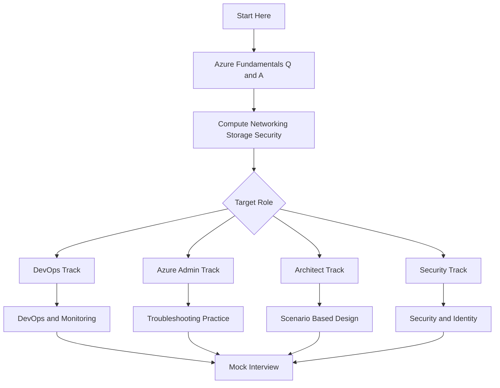
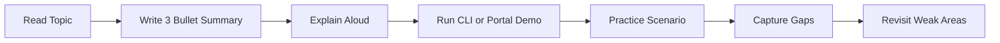

> **Screenshot Disclaimer:** Portal screenshots referenced in this guide are sourced from [Microsoft Learn](https://learn.microsoft.com/en-us/azure/) documentation. © Microsoft Corporation. All rights reserved. Used for educational reference only.

# Azure Interview Preparation Hub

This `InterviewPrep/` section is a practical interview workbook for Azure-focused roles. It combines fundamentals, service comparisons, architecture patterns, scenario responses, and troubleshooting playbooks in one place so you can revise quickly before an interview and also deepen your operational understanding with realistic examples.

## Why this section exists

- Convert broad Azure topics into interview-friendly answers.
- Help candidates move from memorized definitions to design thinking.
- Provide reusable examples for whiteboard, system design, and troubleshooting rounds.
- Offer CLI snippets, portal navigation, and Microsoft references for hands-on review.
- Bridge multiple role expectations across operations, architecture, security, and DevOps.

## Who this is for

| Role | What to focus on in this folder |
|---|---|
| Azure Administrator | Core platform services, identity, monitoring, troubleshooting, governance |
| Azure DevOps Engineer | CI/CD, IaC, observability, release strategies, platform automation |
| Azure Solutions Architect | Service tradeoffs, landing zones, HA/DR, hybrid networking, scenario design |
| Azure Security Engineer | Entra ID, RBAC, Key Vault, Zero Trust, Defender, policy, private access |

## How to use this folder

1. Start with fundamentals if you are early in your Azure journey.
2. Move to compute, networking, storage, database, and security comparisons.
3. Practice scenario-based answers aloud using the STAR method.
4. Use the troubleshooting guide for operational interview rounds.
5. Review official Microsoft references after each topic to validate current details.

## Table of contents

- [01-azure-fundamentals-qa.md](./01-azure-fundamentals-qa.md)
- [02-compute-networking-qa.md](./02-compute-networking-qa.md)
- [03-storage-database-qa.md](./03-storage-database-qa.md)
- [04-security-identity-qa.md](./04-security-identity-qa.md)
- [05-devops-monitoring-qa.md](./05-devops-monitoring-qa.md)
- [06-scenario-based-qa.md](./06-scenario-based-qa.md)
- [07-troubleshooting-guide.md](./07-troubleshooting-guide.md)

## File guide

| File | Primary theme | Best for |
|---|---|---|
| `README.md` | Learning map and interview strategy | Everyone |
| `01-azure-fundamentals-qa.md` | Core cloud and Azure basics | AZ-900, admin, entry to mid-level interviews |
| `02-compute-networking-qa.md` | Runtime, network, and connectivity design | Admin, DevOps, architect |
| `03-storage-database-qa.md` | Data platform and storage decisions | Admin, architect, data-aware platform roles |
| `04-security-identity-qa.md` | Identity, governance, security controls | Security, admin, architect |
| `05-devops-monitoring-qa.md` | Delivery pipelines and observability | DevOps, SRE, platform engineers |
| `06-scenario-based-qa.md` | Architecture and design responses | Architect, senior admin, DevOps |
| `07-troubleshooting-guide.md` | Incident response style questions | Admin, support, SRE, ops interviews |

## Recommended preparation path



## Interview preparation workflow



## Interview tips

### 1. Use the STAR method for behavioral and operational questions

- **Situation:** Briefly set the context.
- **Task:** Clarify your responsibility.
- **Action:** Explain what you designed, automated, or troubleshot.
- **Result:** Quantify uptime, deployment speed, risk reduction, or cost savings.

### 2. Use a whiteboard approach for architecture questions

- Start with requirements first: availability, scale, security, compliance, budget.
- Draw users, entry points, application tiers, data stores, and operations tooling.
- Call out regional design, identity boundaries, and failure domains.
- Explain why you chose one Azure service over alternatives.
- End with risks, assumptions, and tradeoffs.

### 3. Practice hands-on verification

- Create a VNet, NSG, and VM in a lab subscription.
- Deploy a storage account with private endpoint and test name resolution.
- Send logs to Log Analytics and query them with KQL.
- Build a simple YAML pipeline that deploys Bicep or Terraform.
- Simulate a broken NSG rule and walk through diagnosis.

### 4. Prepare short and long versions of answers

- A 30-second version for screening calls.
- A 2-minute version for technical panels.
- A design-deep-dive version for architecture rounds.

### 5. Expect follow-up questions

For almost every Azure answer, interviewers may ask:

- Why not choose another service?
- What is the cost impact?
- How do you secure it?
- How do you monitor it?
- What happens during a regional failure?
- How would you automate this?

## Quick revision checklist

- Can you explain Azure global infrastructure clearly?
- Can you compare subscriptions, management groups, and resource groups?
- Can you explain network traffic flow across VNet, subnet, NSG, and firewall?
- Can you compare App Service, Functions, AKS, and VMs?
- Can you compare Azure SQL, SQL MI, Cosmos DB, PostgreSQL, and MySQL?
- Can you explain RBAC, managed identities, PIM, Key Vault, and Policy?
- Can you describe CI/CD, Bicep, Terraform, monitoring, and KQL basics?
- Can you design HA, DR, security, and governance in one architecture?
- Can you troubleshoot common compute, network, and identity failures?

## Sample portal navigation patterns

- `Azure Portal` → `Virtual networks` → `Subnets` → `Network security group`
- `Azure Portal` → `Monitor` → `Alerts` → `Action groups`
- `Azure Portal` → `Microsoft Entra ID` → `Roles and administrators`
- `Azure Portal` → `Storage accounts` → `Networking` → `Private endpoint connections`
- `Azure Portal` → `Azure Policy` → `Assignments` → `Compliance`

## Sample CLI baseline

```bash
az login
az account show --output table
az group list --output table
az vm list -d --output table
az monitor log-analytics workspace list --output table
```

Expected output:

- `az account show` returns the active subscription and tenant.
- `az group list` returns resource groups in the current subscription.
- `az vm list -d` shows VM power state, IP addresses, and resource group.
- `az monitor log-analytics workspace list` lists workspace names and locations.

## Suggested mock interview plan

| Day | Focus |
|---|---|
| Day 1 | Fundamentals and cloud basics |
| Day 2 | Compute and networking |
| Day 3 | Storage and databases |
| Day 4 | Security and identity |
| Day 5 | DevOps and monitoring |
| Day 6 | Scenario design practice |
| Day 7 | Troubleshooting drill and mock panel |

## Final advice

- Keep answers structured.
- Use Azure-native examples.
- Mention tradeoffs, not just features.
- Show operational awareness with monitoring and security.
- Tie every design to business requirements.
- Use Microsoft terminology accurately.

## Official Microsoft References

- [Azure documentation](https://learn.microsoft.com/azure/)
- [Microsoft Learn Azure training](https://learn.microsoft.com/training/azure/)
- [Azure architecture center](https://learn.microsoft.com/azure/architecture/)
- [Azure Well-Architected Framework](https://learn.microsoft.com/azure/well-architected/)
- [Cloud Adoption Framework](https://learn.microsoft.com/azure/cloud-adoption-framework/)
