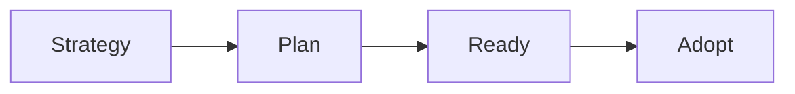
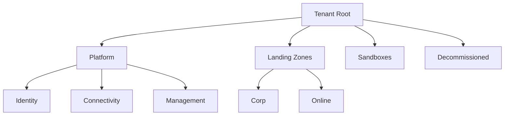
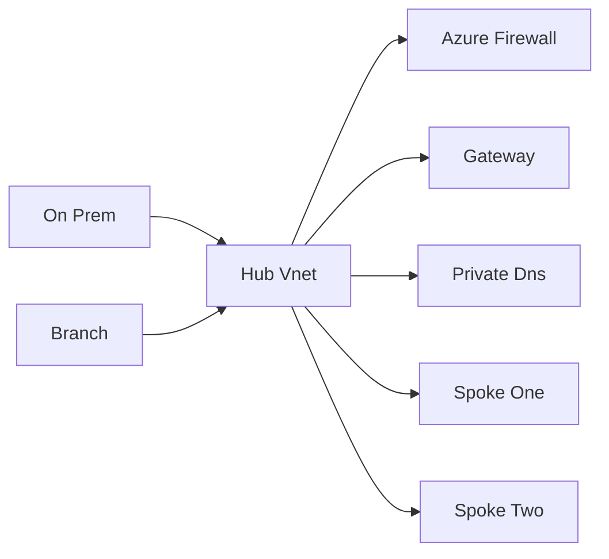
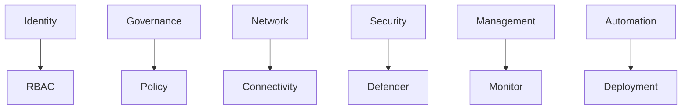

# 01 Azure Landing Zone

> Detailed Azure Landing Zone guide aligned to the Microsoft Cloud Adoption Framework and enterprise scale design patterns.
>
> Disclaimer: Terraform modules, partner firewalls, and third party automation tools are listed as example implementation options. Review vendor guidance, support scope, and internal security policy before adoption.

## 1. Overview

- Azure Landing Zones provide the platform foundation before application teams deploy workloads.
- The design should balance governance with team autonomy.
- Core design areas:
  - identity
  - network
  - governance
  - security
  - management
  - platform automation

## 1.1 Cloud Adoption Framework phases



## 1.2 Management group hierarchy



## 1.3 Hub and spoke network



## 1.4 Landing zone component map



## 2. Azure Landing Zone overview

### 2.1 CAF alignment

| Phase | Goal | Typical output |
|---|---|---|
| Strategy | Define business outcomes and cloud motivation | Business case, target operating model |
| Plan | Inventory, skills, and governance plan | Team plans, cloud governance, backlog |
| Ready | Build foundation and landing zones | Management groups, subscriptions, policies, connectivity |
| Adopt | Migrate or innovate workloads | Application onboarding and modernization |

### 2.2 Design areas

| Area | Questions to answer | Typical Azure services |
|---|---|---|
| Identity | Who can access what and how | Entra ID, RBAC, PIM, Conditional Access |
| Network | How workloads connect securely | VNets, Firewall, VPN, ExpressRoute, Private DNS |
| Governance | How to enforce standards | Management groups, Policy, tags, budgets |
| Security | How to reduce risk | Defender for Cloud, NSGs, Key Vault, DDoS |
| Management | How to monitor and operate | Azure Monitor, Log Analytics, Automation |
| Platform automation | How to deploy consistently | Bicep, ARM, Terraform, pipelines |

## 3. Management group hierarchy

### 3.1 Recommended structure

- `Tenant Root Group`
  - `Platform`
    - `Identity`
    - `Connectivity`
    - `Management`
  - `Landing Zones`
    - `Corp`
    - `Online`
  - `Sandboxes`
  - `Decommissioned`

### 3.2 Why this structure works

- Platform subscriptions inherit core controls separately from workloads.
- Application landing zones are grouped by operating model or business domain.
- Sandboxes can have lighter policy with clear boundaries.
- Decommissioned subscriptions remain visible but isolated during retirement.

### 3.3 Portal navigation and screen description

- Navigation: `Azure Portal` → search `Management groups`.
- What you see:
  - hierarchy tree on the left
  - selected management group summary on the right
  - tabs for details, subscriptions, role assignments, and policy assignments
  - action buttons for `Add management group`, `Move`, and `Delete`

### 3.4 CLI example

```bash
az account management-group create --name platform --display-name Platform
az account management-group create --name landingzones --display-name "Landing Zones"
az account management-group create --name sandbox --display-name Sandboxes
```

Expected output:
- Each command returns the management group id, display name, and parent linkage information.

## 4. Subscription design

### 4.1 Platform subscriptions

| Subscription | Primary purpose | Typical contents |
|---|---|---|
| Identity | Central identity services | Domain controllers where needed, identity tooling, privileged services |
| Connectivity | Shared network services | Hub VNet, Firewall, VPN Gateway, ExpressRoute Gateway, DNS |
| Management | Shared operations tooling | Log Analytics, Automation, backup coordination, monitoring artifacts |

### 4.2 Application landing zone subscriptions

- Separate production and non production where risk, billing, or compliance requires it.
- Prefer one or more subscriptions per major application domain or product area.
- Use workload subscriptions to isolate quotas, policies, and blast radius.

### 4.3 Subscription vending

- Subscription vending means creating and onboarding new subscriptions through a standard automated process.
- The vending workflow should apply:
  - management group placement
  - tags
  - policy inheritance
  - RBAC groups
  - initial budget and diagnostics settings

## 5. Identity and access

### 5.1 Entra ID integration

- Navigation: `Azure Portal` → `Microsoft Entra ID`.
- Create platform groups for subscription owners, network ops, security ops, and application teams.
- Prefer group based assignments over direct user grants.

### 5.2 RBAC role assignments at management group scope

- Use management group scope for inherited platform access.
- Keep `Owner` highly restricted.
- Use `Reader`, `Contributor`, `Network Contributor`, `Security Admin`, and custom roles where appropriate.

```bash
az role assignment create --assignee <groupObjectId> --role Reader --scope /providers/Microsoft.Management/managementGroups/landingzones
```

Expected output:
- Role assignment command returns role definition id, principal id, and scope.

### 5.3 Privileged Identity Management

- Use PIM for just in time elevation of highly privileged roles.
- Require approval, MFA, and justification for sensitive assignments.
- Review role activation logs regularly.

### 5.4 Conditional Access

- Enforce MFA for administrators.
- Restrict privileged access from unmanaged devices where possible.
- Align break glass accounts to documented exception policy.

## 6. Network topology

### 6.1 Hub and spoke vs Virtual WAN

| Option | Best fit | Strengths | Trade off |
|---|---|---|---|
| Hub and spoke | Enterprises needing granular routing and shared services | Strong control over firewall, DNS, and peering | More design and operations effort |
| Azure Virtual WAN | Global connectivity and branch heavy estates | Simplified managed transit at scale | Less granular customization in some patterns |

### 6.2 Hub VNet services

- Azure Firewall for central traffic inspection.
- VPN Gateway for site to site connectivity.
- ExpressRoute Gateway for private enterprise circuits.
- Bastion or jump services when required.
- Private DNS and DNS forwarders for private endpoint resolution.

### 6.3 Spoke design

- One or more spoke VNets per workload or environment.
- Apply workload specific NSGs and route tables.
- Keep address planning documented to avoid overlap across regions.

### 6.4 DNS guidance

- Use Azure Private DNS Zones for private endpoint aware services.
- Centralize DNS forwarding in hub or Virtual WAN design.
- Document split horizon and on prem forwarding behavior.

### 6.5 Portal navigation and UI description

- Navigation: `Azure Portal` → `Virtual networks` or `Virtual WAN`.
- What you see:
  - resource list with region and subscription columns
  - topology or peering screens with connected resources
  - tabs for address space, subnets, peerings, DNS servers, and diagnostics

## 7. Governance

### 7.1 Azure Policy

- Built in policies cover common rules such as allowed locations, tags, HTTPS only, and diagnostics.
- Custom policies handle organization specific guardrails.
- Apply policy initiatives to group related controls.

### 7.2 Policy initiatives

- Examples:
  - CIS aligned controls
  - NIST aligned baseline
  - internal platform baseline for tags, regions, and diagnostics

### 7.3 Blueprints to Deployment Stacks

- Azure Blueprints is deprecated.
- Use modern approaches with policy, IaC, and Deployment Stacks where suitable.
- Keep blueprint references only for legacy estates under transition.

### 7.4 Cost management

- Use tags for cost center, owner, environment, and application.
- Set budgets and alerts at subscription or management group scope where possible.
- Review Azure Advisor and Cost Management trends monthly.

## 8. Security

### 8.1 Defender for Cloud

- Navigation: `Azure Portal` → `Microsoft Defender for Cloud`.
- Review secure score, recommendations, and regulatory compliance dashboards.
- Enable plans based on actual workload services and requirements.

### 8.2 Network security

- Use NSGs at subnet or NIC scope where needed.
- Use Azure Firewall for central egress and east west controls.
- Consider DDoS Protection for internet exposed critical services.

### 8.3 Key Vault

- Centralize secrets, keys, and certificates.
- Prefer RBAC based access model where it aligns with standards.
- Enable soft delete and purge protection.

### 8.4 Activity logs and diagnostic settings

- Send logs to a central Log Analytics workspace.
- Capture platform resource diagnostics for network, policy, and security services.

## 9. Management and monitoring

### 9.1 Azure Monitor and Log Analytics

- Central workspace per platform or region depending on architecture.
- Use diagnostic settings to stream resource logs.
- Build workbooks for landing zone health and compliance.

### 9.2 Azure Automation and Update Management

- Use for operational runbooks and maintenance tasks where still applicable.
- Review current Microsoft guidance for Update Manager and successor services in your estate.

### 9.3 What the monitoring screens look like

- Monitor home shows alerts, metrics, logs, and workbooks.
- Log Analytics workspace page shows query editor, tables, and saved queries.
- Alert page shows severity, state, and action group history.

## 10. Deployment methods

### 10.1 Azure Landing Zone accelerator in the portal

- Navigation: `Azure Portal` → search for `Azure landing zones` or follow the deployment experience from Microsoft guidance.
- Step by step:
  1. Start the accelerator and review prerequisites.
  2. Select management group structure and deployment region.
  3. Choose connectivity model such as hub and spoke or Virtual WAN.
  4. Configure management, identity, and security options.
  5. Review generated resources and confirm deployment.
- What you see:
  - a guided wizard with progress steps on the left
  - choice cards for topology and governance options
  - review screen with subscription and management group targets

### 10.2 Deploy via Terraform

- Common module:

```hcl
module "enterprise_scale" {
  source  = "Azure/caf-enterprise-scale/azurerm"
  version = "~> 5.0"

  default_location = "eastus"
  root_parent_id   = data.azurerm_client_config.current.tenant_id
  deploy_core_landing_zones = true
  deploy_management_resources = true
  deploy_connectivity_resources = true
  deploy_identity_resources = true
}
```

- Typical workflow:
  1. Configure remote state in Azure Storage.
  2. Define management group and subscription mapping.
  3. Run `terraform init`.
  4. Run `terraform plan`.
  5. Review and approve.
  6. Run `terraform apply`.

```bash
terraform init
terraform plan -out tfplan
terraform apply tfplan
```

Expected output:
- `terraform init` downloads providers and configures backend.
- `terraform plan` lists adds, changes, and destroys.
- `terraform apply` reports created or updated resources and final outputs.

### 10.3 Bicep and ALZ modules

- Use Bicep when your platform team prefers Microsoft native IaC tooling.
- Keep modules modular by design area such as policy, network, and monitoring.
- Store templates in version controlled repos and deliver them through CI and CD.

## 11. Day 2 operations

### 11.1 Adding new landing zones

- Use subscription vending automation.
- Attach the subscription to the correct management group.
- Apply baseline tags, budget, RBAC groups, and diagnostics at creation time.

### 11.2 Policy compliance remediation

- Review non compliant resources regularly.
- Use remediation tasks for deploy if not exists policies.
- Track approved exemptions with expiration dates.

### 11.3 Network expansion

- Reserve IP space for future spokes and regions.
- Validate DNS and routing before peering new networks.
- Update firewall policy and monitoring rules as topology expands.

## 12. Portal checklist by design area

| Area | Navigation path | What you see | Primary action |
|---|---|---|---|
| Management groups | `Azure Portal` → `Management groups` | Hierarchy tree and scope details | Build hierarchy |
| Subscriptions | `Azure Portal` → `Subscriptions` | Subscription inventory and cost summary | Assign owners and tags |
| Policy | `Azure Portal` → `Policy` | Assignments, compliance, remediation | Enforce guardrails |
| Defender | `Azure Portal` → `Microsoft Defender for Cloud` | Secure score and recommendations | Improve security posture |
| Monitor | `Azure Portal` → `Monitor` | Alerts, metrics, logs, workbooks | Centralize operations |
| Entra ID | `Azure Portal` → `Microsoft Entra ID` | Users, groups, roles, PIM | Govern identity |
| Networking | `Azure Portal` → `Virtual networks` | VNets, peerings, address space | Build hub and spokes |

## 13. Official Microsoft references

- [Azure landing zones](https://learn.microsoft.com/azure/cloud-adoption-framework/ready/landing-zone/)
- [Cloud Adoption Framework overview](https://learn.microsoft.com/azure/cloud-adoption-framework/)
- [Enterprise scale landing zones](https://learn.microsoft.com/azure/cloud-adoption-framework/ready/enterprise-scale/)
- [Management groups](https://learn.microsoft.com/azure/governance/management-groups/overview)
- [Azure Policy](https://learn.microsoft.com/azure/governance/policy/overview)
- [Hub and spoke architecture](https://learn.microsoft.com/azure/architecture/networking/architecture/hub-spoke)
- [Azure Virtual WAN](https://learn.microsoft.com/azure/virtual-wan/virtual-wan-about)
- [Defender for Cloud](https://learn.microsoft.com/azure/defender-for-cloud/defender-for-cloud-introduction)
