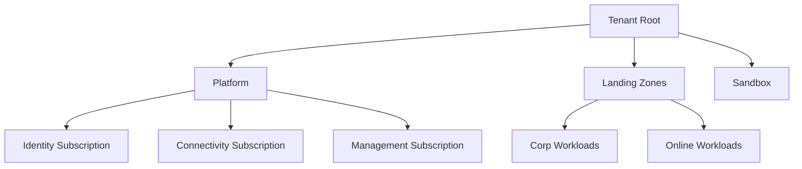
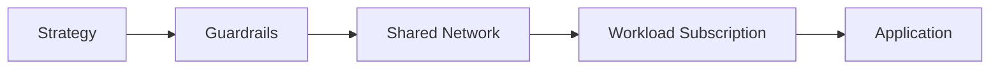
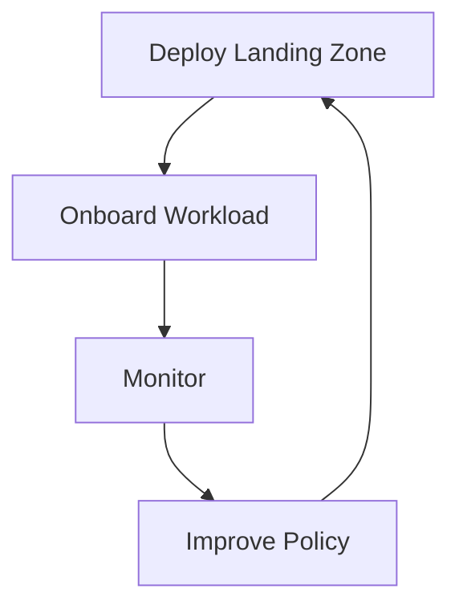

# Azure Landing Zones Guide

> Reference guide for planning, deploying, and operating Azure Landing Zones.
>
> Disclaimer: Third party Terraform modules, partner network appliances, and external governance tools may appear as examples. Confirm support boundaries and licensing with the official vendor documentation before production use.

## What is a cloud landing zone

- A cloud landing zone is a pre built target operating model for cloud resources.
- It provides identity, network, governance, security, management, and automation foundations before workloads arrive.
- In Azure, landing zones align strongly to the Microsoft Cloud Adoption Framework and Azure governance services.

## Why landing zones matter

- Standardize subscription design and management group hierarchy.
- Apply policy and security controls early.
- Reduce rework when new teams or workloads onboard.
- Centralize monitoring, connectivity, and identity controls.
- Support scale, compliance, and cost management.

## Conceptual architecture



## Governance to workload flow



## Operations loop



## Navigation model

- Azure planning path: `Azure Portal` → `Management groups` → `Subscriptions` → `Policy` → `Defender for Cloud` → `Monitor`.
- Identity path: `Azure Portal` → `Microsoft Entra ID` → `Roles and administrators` → `Groups` → `Privileged Identity Management`.
- Network path: `Azure Portal` → `Virtual networks` → hub resources such as Firewall, VPN Gateway, or Virtual WAN.
- Accelerator path: `Azure Portal` → search for `Azure landing zones` or use the deployment experience exposed from Microsoft guidance.

## What the user sees in the Azure portal

- Management groups page with a hierarchy tree on the left and selected node details on the right.
- Policy page with assignments, compliance percentages, and remediation actions.
- Defender for Cloud page showing secure score, recommendations, and regulatory standards coverage.
- Monitor page with alerts, workbooks, and Log Analytics entry points.

## Table of contents

- [What is a cloud landing zone](#what-is-a-cloud-landing-zone)
- [Why landing zones matter](#why-landing-zones-matter)
- [Conceptual architecture](#conceptual-architecture)
- [Navigation model](#navigation-model)
- [What the user sees in the Azure portal](#what-the-user-sees-in-the-azure-portal)
- [Reading order](#reading-order)
- [Official Microsoft references](#official-microsoft-references)

## Reading order

1. [01 Azure Landing Zone](./01-azure-landing-zone.md)

## File map

| File | Focus |
|---|---|
| `README.md` | Conceptual overview and navigation |
| `01-azure-landing-zone.md` | Detailed CAF aligned landing zone design and deployment guide |

## Quick start commands

```bash
az account management-group list --output table
az policy assignment list --scope /providers/Microsoft.Management/managementGroups/<mgId> --output table
az monitor log-analytics workspace list --output table
```

Expected output:
- Management group command lists display names and ids.
- Policy assignment list returns assignment names and enforcement state.
- Log Analytics workspace list shows workspace names and resource groups.


## Design principles

- Standardize first, customize only with a clear business reason.
- Separate platform concerns from workload concerns.
- Apply security and governance before application onboarding.
- Automate subscription creation and baseline controls.
- Design for scale across regions, teams, and compliance boundaries.

## Shared service examples

| Platform area | Common shared services |
|---|---|
| Identity | Entra groups, PIM, Conditional Access |
| Connectivity | Hub VNet, Firewall, VPN Gateway, ExpressRoute Gateway |
| Management | Log Analytics, action groups, workbooks, automation |
| Governance | Policy initiatives, tags, budgets, exemptions |
| Security | Defender for Cloud, Key Vault, DDoS Protection |

## Deployment approaches

- Portal accelerator for guided first deployments.
- Bicep for Microsoft native infrastructure as code.
- Terraform for module driven multi environment automation.
- CI and CD pipelines for repeatable updates and change control.


## Landing zone outcomes

- Faster workload onboarding.
- Consistent security controls.
- Better subscription level cost visibility.
- Standard network and DNS behavior.
- Easier compliance reporting and operations handoff.

## Recommended audience

- Cloud architects
- Platform engineers
- Security and governance teams
- Network engineers
- Operations teams
- Application onboarding teams

## Official Microsoft references

- [Azure landing zones](https://learn.microsoft.com/azure/cloud-adoption-framework/ready/landing-zone/)
- [Cloud Adoption Framework](https://learn.microsoft.com/azure/cloud-adoption-framework/)
- [Management groups](https://learn.microsoft.com/azure/governance/management-groups/overview)
- [Azure Policy](https://learn.microsoft.com/azure/governance/policy/overview)
- [Defender for Cloud](https://learn.microsoft.com/azure/defender-for-cloud/defender-for-cloud-introduction)
