# Azure Migration Playbook

> Comprehensive Azure migration reference covering framework, tooling, landing zones, workload migration paths, cross-cloud mappings, and post-migration operations.

**Document path:** `/Users/shasidharreddy_mallu/Git-Infoblox/REPOS/Azure-Cloud-Engineer/Migration/README.md`

<!-- workflow-diagram:start -->
## Workflow Snapshot

```mermaid
%%{init: {'theme':'base','themeVariables': {'primaryColor':'#0078D4','primaryTextColor':'#ffffff','primaryBorderColor':'#005A9E','lineColor':'#0078D4','secondaryColor':'#50E6FF','tertiaryColor':'#E6F4FF'}}}%%
flowchart LR
  subgraph Discover[Assess & Prepare]
    A[Inventory Estate] --> B[Azure Migrate Assessment]
    B --> C[Dependency Discovery]
    C --> D{Landing zone ready?}
  end
  subgraph Plan[Migration Planning]
    D -- No --> E[Fix Identity, Network, Policy]
    E --> D
    D -- Yes --> F[Wave Planning]
    F --> G[Pilot Group]
  end
  subgraph Execute[Move & Cutover]
    G --> H[Replicate Servers / DBs / Files]
    H --> I[Test in Azure]
    I --> J{Business sign-off?}
    J -- No --> K[Remediate & Retest]
    J -- Yes --> L[Cutover Window]
  end
  subgraph Optimize[Post-Migration]
    L --> M[Validate Apps, Backup, Monitoring]
    M --> N[Optimize Cost & Performance]
    N --> O[Decommission Legacy Estate]
  end
  K --> I
  classDef migrate fill:#0078D4,stroke:#005A9E,color:#ffffff,stroke-width:2px;
  classDef ready fill:#50E6FF,stroke:#0078D4,color:#002050,stroke-width:2px;
  classDef decision fill:#FFF4CE,stroke:#FFB900,color:#5C2D00,stroke-width:2px;
  classDef ops fill:#107C10,stroke:#0B5A0B,color:#ffffff,stroke-width:2px;
  class A,B,C,F,G,H migrate;
  class E,I,L,M,N,O ready;
  class D,J decision;
  class K ops;
```

This migration workflow follows the Azure journey from assessment and landing-zone readiness through replication, cutover, and post-migration optimization.
<!-- workflow-diagram:end -->

## Table of Contents

1. [Cloud Adoption Framework](#cloud-adoption-framework)
2. [Azure Migrate](#azure-migrate)
3. [Server Migration](#server-migration)
4. [Database Migration](#database-migration)
5. [App Migration](#app-migration)
6. [Azure Data Box](#azure-data-box)
7. [Azure Site Recovery](#azure-site-recovery)
8. [Azure File Migration](#azure-file-migration)
9. [Landing Zone](#landing-zone)
10. [AWS to Azure Migration](#aws-to-azure-migration)
11. [GCP to Azure Migration](#gcp-to-azure-migration)
12. [On-Premises to Azure](#on-premises-to-azure)
13. [Migration Waves](#migration-waves)
14. [Post-Migration](#post-migration)
15. [Appendix A. Common Azure CLI Bootstrap](#appendix-a-common-azure-cli-bootstrap)
16. [Appendix B. End-to-End Migration Checklist](#appendix-b-end-to-end-migration-checklist)

## How to Use This Guide

- Use the Cloud Adoption Framework and Landing Zone sections to establish governance and platform foundations first.
- Use Azure Migrate, Server Migration, Database Migration, App Migration, Azure File Migration, and Azure Data Box sections for execution patterns.
- Use Azure Site Recovery to design disaster recovery in parallel with migration, not after it.
- Use the AWS to Azure and GCP to Azure sections when transforming from another public cloud into Azure.
- Use the Migration Waves section to sequence delivery and the Post-Migration section to capture value after cutover.
- Replace placeholders such as `<subscription-id>`, `<Password>`, `<policy-definition-id>`, and `<resource-id>` before executing commands.

## Companion deep-dive guides

- [`disaster-recovery-prod-scenarios.md`](./disaster-recovery-prod-scenarios.md) — production DR, Azure Site Recovery, backup, multi-region HA, incident response, monitoring, maintenance, and compliance runbooks.

## Mermaid Theme Notes

- All Mermaid diagrams in this document use Azure brand-inspired colors.
- Primary Azure blue: `#0078D4`
- Azure dark blue border: `#005A9E`
- Azure accent cyan: `#50E6FF`
- Light support fill: `#E6F4FF`

---

## 1. Cloud Adoption Framework

### Mermaid Diagram

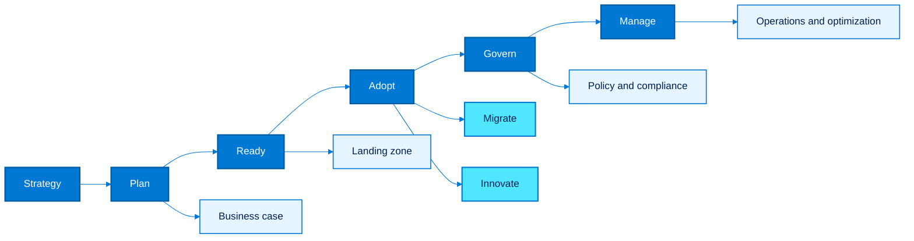

### Explanation

- The Cloud Adoption Framework (CAF) provides the operating model for migration, not just the technical sequence.
- Strategy defines business outcomes, application rationalization goals, financial constraints, and executive sponsorship.
- Plan converts business intent into a backlog, digital estate inventory, skills plan, and measurable migration milestones.
- Ready establishes the landing zone foundation: identity, networking, platform management, security baselines, and governance guardrails.
- Adopt splits into Migrate and Innovate so that workloads can be rehosted quickly while strategic platforms are modernized where justified.
- Govern enforces consistency with Azure Policy, management groups, tagging, RBAC, resource consistency, and cost controls.
- Manage operationalizes the environment with monitoring, backup, update management, incident response, and service health processes.
- CAF is iterative; each wave can loop back into plan and ready as new application archetypes appear.
- A migration program succeeds when CAF deliverables are owned by business, security, networking, platform, and application teams together.
- Use CAF artifacts to align technical decisions with risk posture, data residency, RTO/RPO, and cost optimization.

### Recommended Workflow

1. Capture the migration mandate and define quantifiable business outcomes such as exit date, savings target, resiliency target, or modernization goal.
2. Baseline the estate with applications, servers, databases, data stores, integrations, owners, environments, and criticality ratings.
3. Create a wave plan that respects dependencies, change windows, and platform constraints.
4. Deploy a production-grade landing zone before moving critical workloads.
5. Migrate representative pilot workloads first, then scale by pattern.
6. Continuously govern, monitor, and optimize after each wave.

### Azure CLI Commands

```bash
az login
az account set --subscription <subscription-id>
az group create --name rg-platform-core --location eastus
az account management-group create --name mg-landingzones --display-name "Landing Zones"
az account management-group create --name mg-platform --display-name "Platform"
az account management-group create --name mg-workloads --display-name "Workloads"
az account management-group subscription add --name mg-workloads --subscription <subscription-id>
az policy assignment create --name enforce-tags --scope /providers/Microsoft.Management/managementGroups/mg-workloads --policy <policy-definition-id>
az monitor log-analytics workspace create --resource-group rg-platform-core --workspace-name law-platform-eastus --location eastus
az monitor action-group create --resource-group rg-platform-core --name ag-ops-email --short-name opsmail
az resource tag --tags Environment=Platform Owner=CloudTeam CostCenter=Shared --ids /subscriptions/<subscription-id>/resourceGroups/rg-platform-core
```

### Best Practices

- Treat strategy inputs as mandatory design constraints rather than presentation material.
- Separate platform subscriptions from workload subscriptions early to simplify blast-radius control.
- Define policy exemptions with expiration dates and explicit owner approval.
- Align CAF phases to governance boards, CAB windows, and risk sign-off processes.
- Standardize naming, tags, regions, and RBAC patterns before large-scale migration starts.
- Measure success by business outcomes, migration velocity, security posture, and operational quality—not only server counts.

### Common Risks

- Skipping strategy often causes oversized landing zones or rushed rehosting without value tracking.
- Underfunding ready activities usually creates later blockers in DNS, identity, routing, or firewall approval.
- Governance added after migration causes resource drift, inconsistent tags, and cost leakage.
- Manage processes that are not tested before cutover increase incident duration during the first wave.

### Validation Checklist

- [ ] CAF deliverables have named owners.
- [ ] Wave backlog exists and is prioritized.
- [ ] Landing zone controls are deployed and tested.
- [ ] Governance policies are assigned at management-group scope.
- [ ] Operational monitoring and incident routing are validated.
- [ ] Executive sponsors review migration KPIs regularly.

### Notes

- This section should be adapted to the organization's identity, network, security, and change-management standards before production execution.
- Pilot the cloud adoption framework pattern with a representative workload before broad rollout.
- Keep architecture diagrams, cutover runbooks, and owner contacts aligned with the guidance in this cloud adoption framework section.

---

## 2. Azure Migrate

### Mermaid Diagram

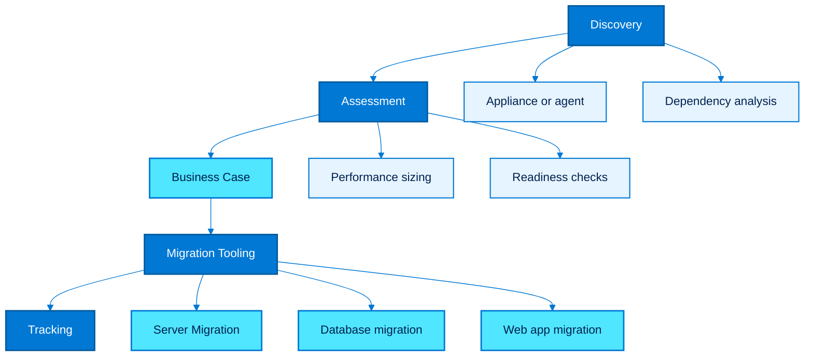

### Explanation

- Azure Migrate is the central hub for discovery, assessment, business-case generation, migration tracking, and integration with workload-specific migration tools.
- Discovery uses an appliance for VMware, Hyper-V, physical servers, and other environments to collect configuration and performance telemetry.
- Assessment converts raw inventory into readiness findings, sizing recommendations, cost estimates, and right-sized target architecture proposals.
- Dependency analysis identifies communication flows between servers so that application groups migrate together instead of breaking upstream/downstream integrations.
- The business case compares on-premises total cost of ownership with Azure estimates, reserved instances, Azure Hybrid Benefit, and software assurance impacts.
- Azure Migrate supports multiple migration tools through a project model, allowing server, database, web-app, and data migration activities to be tracked centrally.
- The service helps build migration waves from real application groupings rather than generic CMDB data.
- Use Azure Migrate for continuous refresh during the discovery phase because estates change during long programs.
- Assessment reports should be treated as design inputs, not one-time exports.
- Azure Migrate is strongest when its outputs are integrated with landing-zone design, financial planning, and wave scheduling.

### Recommended Workflow

1. Register resource providers and create a dedicated migration resource group.
2. Deploy the Azure Migrate project and configure the appliance for the relevant source environment.
3. Collect performance history long enough to represent seasonal and weekly patterns.
4. Group machines by application dependency and business criticality.
5. Generate readiness, cost, and sizing assessments.
6. Use assessment outputs to choose rehost, refactor, replatform, or retire actions.

### Azure CLI Commands

```bash
az provider register --namespace Microsoft.Migrate
az group create --name rg-azure-migrate --location eastus
az resource create --resource-group rg-azure-migrate --name amproj-eastus --resource-type Microsoft.Migrate/migrateProjects --api-version 2023-10-01 --properties '{"location":"eastus"}'
az monitor log-analytics workspace create --resource-group rg-azure-migrate --workspace-name law-azure-migrate --location eastus
az storage account create --name stmigrateeastus01 --resource-group rg-azure-migrate --location eastus --sku Standard_LRS --kind StorageV2
az resource show --resource-group rg-azure-migrate --name amproj-eastus --resource-type Microsoft.Migrate/migrateProjects --api-version 2023-10-01
az graph query -q "Resources | where type =~ "microsoft.migrate/migrateprojects" | project name, location, resourceGroup"
az resource tag --resource-group rg-azure-migrate --name amproj-eastus --resource-type Microsoft.Migrate/migrateProjects --tags Purpose=Discovery Wave=Foundation
az monitor diagnostic-settings create --name diag-amproj --resource /subscriptions/<subscription-id>/resourceGroups/rg-azure-migrate/providers/Microsoft.Migrate/migrateProjects/amproj-eastus --workspace /subscriptions/<subscription-id>/resourceGroups/rg-azure-migrate/providers/Microsoft.OperationalInsights/workspaces/law-azure-migrate
```

### Best Practices

- Run discovery for enough time to capture CPU, memory, IO, and network peaks; one day is rarely enough.
- Validate appliance network reachability to vCenter, Hyper-V, Windows, Linux, and dependency-analysis endpoints before a large rollout.
- Use tags or custom metadata in your CMDB to enrich business-case grouping before import or grouping.
- Review unsupported operating systems and end-of-support software early to avoid false rehost assumptions.
- Refresh assessments after significant source-side changes such as version upgrades or peak season load tests.
- Use dependency visualization to define migration waves rather than migrating by server team ownership alone.

### Common Risks

- Incomplete credentials lead to partial discovery and misleading readiness scores.
- Oversized Azure targets can result from short discovery windows or stale performance data.
- Business-case outputs can be misread if licensing benefits and SQL entitlements are not validated with finance and licensing teams.
- Ignoring dependency analysis can cause application outages even when single-server cutovers succeed.

### Validation Checklist

- [ ] Project resource exists and is monitored.
- [ ] Appliance health is green.
- [ ] Inventory coverage is close to the authoritative estate baseline.
- [ ] Assessments are current and approved.
- [ ] Dependency groups are documented for wave planning.
- [ ] Business case assumptions are reviewed by finance.

### Notes

- This section should be adapted to the organization's identity, network, security, and change-management standards before production execution.
- Pilot the azure migrate pattern with a representative workload before broad rollout.
- Keep architecture diagrams, cutover runbooks, and owner contacts aligned with the guidance in this azure migrate section.

---

## 3. Server Migration

### Mermaid Diagram

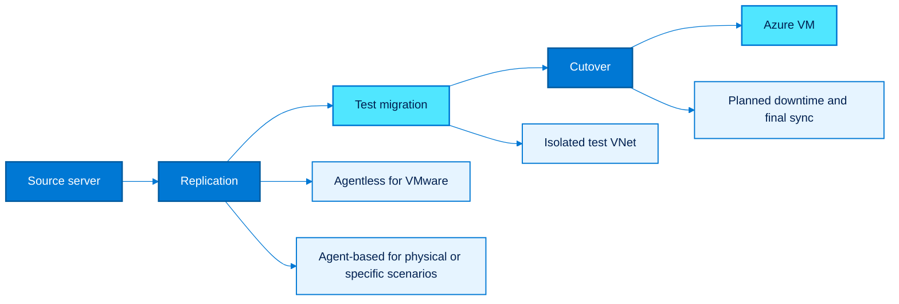

### Explanation

- Azure Migrate: Server Migration replicates source server disks into Azure and creates Azure VMs during test migration or final cutover.
- Agentless replication is common for VMware because it integrates through the appliance and hypervisor APIs without installing an in-guest replication agent.
- Agent-based replication is used for physical servers, some cloud sources, and scenarios that require in-guest replication control.
- Test migration creates an isolated Azure VM using replicated data so that boot validation, application smoke tests, and network verification can happen safely.
- Cutover performs the final replication sync, shuts down or freezes the source, and promotes the replicated VM to production.
- Server migration decisions must account for boot type, disk layout, OS supportability, drivers, static IP requirements, and application licensing.
- Sizing should come from Azure Migrate assessments rather than a like-for-like on-prem vCPU and RAM conversion.
- VM extensions, backup, Defender, update management, monitoring, and RBAC should be attached immediately after cutover.
- Planned cutovers minimize data loss, while unplanned cutovers are used when the source is no longer available.
- Post-cutover validation must include performance, logging, DNS, certificates, backup jobs, and monitoring alerts.

### Recommended Workflow

1. Select the source environment and replication method.
2. Prepare Azure landing-zone prerequisites such as target VNet, subnets, NSGs, vaults, and RBAC.
3. Enable replication for pilot servers and watch initial seeding throughput.
4. Run a test migration into an isolated subnet or sandbox VNet.
5. Validate operating-system boot, application services, and dependent connectivity.
6. Schedule final cutover, stop source writes, sync, cut over, and validate production traffic.

### Azure CLI Commands

```bash
az group create --name rg-server-migration --location eastus
az network vnet create --resource-group rg-server-migration --name vnet-migrate-eastus --address-prefix 10.40.0.0/16 --subnet-name subnet-prod --subnet-prefix 10.40.1.0/24
az network vnet subnet create --resource-group rg-server-migration --vnet-name vnet-migrate-eastus --name subnet-test-migration --address-prefixes 10.40.10.0/24
az network nsg create --resource-group rg-server-migration --name nsg-migrate-eastus
az recoveryservices vault create --resource-group rg-server-migration --name rsv-server-migrate-eastus --location eastus
az vm list-skus --location eastus --size Standard_D --all --output table
az disk create --resource-group rg-server-migration --name placeholder-replicated-osdisk --source /subscriptions/<subscription-id>/resourceGroups/<replica-rg>/providers/Microsoft.Compute/disks/<replicated-os-disk-name>
az vm create --resource-group rg-server-migration --name vm-cutover-app01 --attach-os-disk /subscriptions/<subscription-id>/resourceGroups/<replica-rg>/providers/Microsoft.Compute/disks/<replicated-os-disk-name> --os-type linux --size Standard_D4s_v5 --vnet-name vnet-migrate-eastus --subnet subnet-test-migration
az vm boot-diagnostics get-boot-log --resource-group rg-server-migration --name vm-cutover-app01
az vm run-command invoke --resource-group rg-server-migration --name vm-cutover-app01 --command-id RunShellScript --scripts "systemctl status <service-name>"
az network nic show-effective-route-table --resource-group rg-server-migration --name <nic-name>
```

### Best Practices

- Use agentless replication where supported because it reduces guest changes and operational overhead.
- Reserve agent-based replication for physical servers, unsupported hypervisor patterns, or granular control scenarios.
- Always perform test migration in an isolated network to prevent duplicate hostname or IP conflicts.
- Pre-stage DNS, firewall rules, load balancer membership, and certificates before cutover night.
- Document rollback criteria and how long the source will remain powered off but recoverable.
- Enable backup, Defender for Cloud, monitoring agents, and patch baselines as part of cutover automation.

### Common Risks

- Cutting over before application owners sign off on smoke tests increases rollback probability.
- Ignoring application dependency order can leave databases or middleware unavailable when front-end servers come online.
- Assuming the source static IP can be reused without DNS or routing review frequently causes extended outages.
- Failing to test driver, kernel, and bootloader compatibility may create boot failures after migration.

### Validation Checklist

- [ ] Replication health is green.
- [ ] Test migration has been executed successfully.
- [ ] Network security and routing are approved.
- [ ] Cutover runbook includes rollback steps.
- [ ] Business owner validates application health post-cutover.
- [ ] Source decommission timing is documented.

### Notes

- This section should be adapted to the organization's identity, network, security, and change-management standards before production execution.
- Pilot the server migration pattern with a representative workload before broad rollout.
- Keep architecture diagrams, cutover runbooks, and owner contacts aligned with the guidance in this server migration section.

---

## 4. Database Migration

### Mermaid Diagram

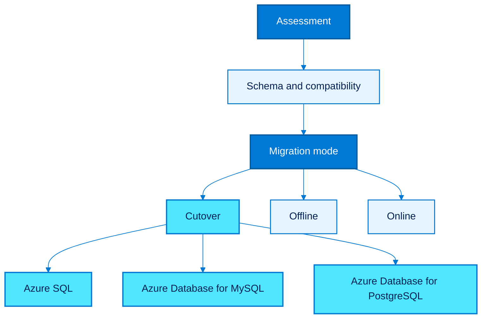

### Explanation

- Azure Database Migration Service (DMS) orchestrates database moves into Azure targets with offline or online migration patterns depending on engine support and downtime tolerance.
- Assessment is the first step: identify unsupported features, compatibility-level gaps, authentication changes, HA/DR implications, and maintenance-window limitations.
- Offline migration is simpler and usually faster for smaller databases because the source is stopped during final copy.
- Online migration minimizes downtime by continuously replicating changes until cutover, but it requires more preparation and compatibility support.
- SQL Server commonly targets Azure SQL Database, Azure SQL Managed Instance, or SQL Server on Azure VM depending on feature requirements.
- MySQL and PostgreSQL typically target Azure Database for MySQL Flexible Server or Azure Database for PostgreSQL Flexible Server.
- DMS planning must include network connectivity, firewall rules, TLS settings, authentication model, and throughput testing.
- Schema assessment should be completed before data movement so that remediation items are not discovered at the last minute.
- Application connection-string cutover must be rehearsed alongside the database cutover.
- Performance validation after migration is mandatory because target tiers, storage characteristics, and auto-scaling behavior differ from on-prem platforms.

### Recommended Workflow

1. Assess source databases and document blockers.
2. Create target database platform sized for pilot workloads.
3. Select online or offline migration mode.
4. Migrate schema, then seed data.
5. Synchronize changes until cutover window.
6. Switch application connectivity and validate consistency, performance, and backup posture.

### Azure CLI Commands

```bash
az group create --name rg-data-migration --location eastus
az sql server create --resource-group rg-data-migration --name sqlmigserver01 --location eastus --admin-user sqladmin --admin-password <Password>
az sql db create --resource-group rg-data-migration --server sqlmigserver01 --name appdb01 --service-objective GP_S_Gen5_2
az mysql flexible-server create --resource-group rg-data-migration --name mysqlmig01 --location eastus --admin-user mysqladmin --admin-password <Password> --sku-name Standard_D2ds_v4
az postgres flexible-server create --resource-group rg-data-migration --name pgmig01 --location eastus --admin-user pgadmin --admin-password <Password> --sku-name Standard_D2ds_v4
az sql server firewall-rule create --resource-group rg-data-migration --server sqlmigserver01 --name allow-migration-subnet --start-ip-address 10.40.1.4 --end-ip-address 10.40.1.254
az resource create --resource-group rg-data-migration --name dms-eastus --resource-type Microsoft.DataMigration/services --api-version 2022-03-30-preview --properties '{"location":"eastus","sku":{"name":"Premium_4vCores"}}'
az resource create --resource-group rg-data-migration --name dms-eastus/sql-to-azsql --resource-type Microsoft.DataMigration/services/projects --api-version 2022-03-30-preview --properties '{"sourcePlatform":"SQL","targetPlatform":"SQLDB"}'
az sql db show --resource-group rg-data-migration --server sqlmigserver01 --name appdb01
az mysql flexible-server show --resource-group rg-data-migration --name mysqlmig01
az postgres flexible-server show --resource-group rg-data-migration --name pgmig01
```

### Best Practices

- Choose SQL Managed Instance instead of Azure SQL Database when cross-database features or SQL Agent dependencies are significant.
- Run compatibility assessment early and fix blockers before the migration weekend.
- Use online migration only when the engine, source version, and business RPO justify the additional setup.
- Benchmark application performance after migration and tune DTUs/vCores, storage, and connection pooling.
- Standardize secrets, certificates, private endpoints, and DNS before application cutover.
- Validate backup retention, long-term retention, and geo-redundancy settings immediately after go-live.

### Common Risks

- Feature incompatibilities such as SQL CLR, linked servers, or unsupported extensions can delay cutover.
- Network throughput and latency limits can make initial loads far longer than estimated.
- Application teams may forget to rotate connection strings, DNS aliases, or secrets during cutover.
- Not validating character sets, collation, or timezone behavior may cause subtle data quality issues.

### Validation Checklist

- [ ] Assessment report is approved.
- [ ] Target service tier is benchmarked.
- [ ] Cutover mode is chosen and rehearsed.
- [ ] Firewall, private endpoint, and DNS paths are ready.
- [ ] Application connection changes are scripted.
- [ ] Backup, HA, and monitoring are enabled.

### Notes

- This section should be adapted to the organization's identity, network, security, and change-management standards before production execution.
- Pilot the database migration pattern with a representative workload before broad rollout.
- Keep architecture diagrams, cutover runbooks, and owner contacts aligned with the guidance in this database migration section.

---

## 5. App Migration

### Mermaid Diagram

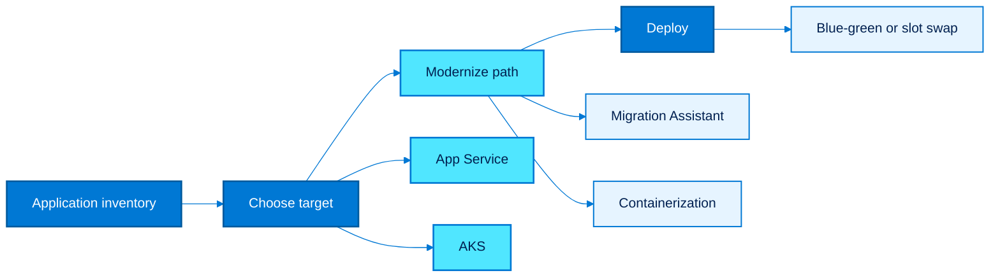

### Explanation

- Application migration focuses on moving code, runtime, configuration, and dependencies to a managed Azure platform.
- Azure App Service Migration Assistant helps assess and migrate compatible .NET and Java web applications into App Service with less infrastructure management.
- Applications that need custom runtimes, sidecars, advanced ingress control, or microservice orchestration often fit containerization and AKS better.
- App migration should evaluate runtime versions, OS dependencies, filesystem assumptions, session state, secrets handling, and integration endpoints.
- Migration is not only packaging; configuration, certificates, identity, observability, and deployment strategy must also be redesigned.
- Lift-and-shift into App Service works well for stateless web tiers that can externalize state and use managed backing services.
- Containerization helps standardize deployment artifacts across dev, test, and prod while improving portability and release consistency.
- AKS is appropriate when teams can operate Kubernetes responsibly; otherwise App Service or Container Apps may reduce operational overhead.
- App migration testing must include performance, warm-up behavior, TLS, outbound IP dependencies, and secret retrieval.
- A successful app migration often reduces patching, scaling complexity, and release risk compared with IaaS-only rehosting.

### Recommended Workflow

1. Classify each application as rehost, replatform, refactor, or retire.
2. Use the Migration Assistant for compatible web applications and identify blockers.
3. Externalize configuration, secrets, and stateful components.
4. Choose App Service, AKS, or another managed platform based on runtime and operating model.
5. Deploy into non-production first and validate synthetic and user-journey tests.
6. Use deployment slots, blue-green, or canary releases for production cutover.

### Azure CLI Commands

```bash
az group create --name rg-app-migration --location eastus
az appservice plan create --resource-group rg-app-migration --name asp-migrate-eastus --location eastus --sku P1v3 --is-linux
az webapp create --resource-group rg-app-migration --plan asp-migrate-eastus --name webapp-migrate-demo --runtime "DOTNET|8.0"
az webapp deployment slot create --resource-group rg-app-migration --name webapp-migrate-demo --slot staging
az webapp config appsettings set --resource-group rg-app-migration --name webapp-migrate-demo --settings ASPNETCORE_ENVIRONMENT=Production KEYVAULT_URI=https://<kv-name>.vault.azure.net/
az acr create --resource-group rg-app-migration --name acrmigdemo01 --sku Standard --location eastus
az aks create --resource-group rg-app-migration --name aks-migrate-eastus --location eastus --node-count 3 --generate-ssh-keys --network-plugin azure
az aks get-credentials --resource-group rg-app-migration --name aks-migrate-eastus
az webapp deployment source config-zip --resource-group rg-app-migration --name webapp-migrate-demo --src <artifact.zip>
az webapp deployment slot swap --resource-group rg-app-migration --name webapp-migrate-demo --slot staging --target-slot production
```

### Best Practices

- Prefer managed PaaS services when application architecture permits; operational simplicity is part of migration value.
- Remove local disk assumptions and write persistent data to managed storage or databases.
- Externalize secrets into Azure Key Vault and use managed identities whenever possible.
- Use deployment slots or progressive delivery to reduce cutover risk.
- Package container images consistently and scan them before pushing to production registries.
- Document runbooks for scale, rollback, certificate renewal, and dependency outages.

### Common Risks

- Hard-coded machine names, IPs, or filesystem paths are common hidden blockers in app migrations.
- AKS adoption without platform operating maturity can increase risk compared with App Service.
- Stateful session handling may fail after migration if sticky sessions or distributed cache are not designed.
- Ignoring outbound connectivity requirements can break third-party integrations after go-live.

### Validation Checklist

- [ ] Target platform decision is documented.
- [ ] Secrets and configuration are externalized.
- [ ] Health probes and monitoring are configured.
- [ ] Blue-green or slot-based deployment is tested.
- [ ] Scaling and rollback procedures are rehearsed.
- [ ] Application owner signs off on functional parity.

### Notes

- This section should be adapted to the organization's identity, network, security, and change-management standards before production execution.
- Pilot the app migration pattern with a representative workload before broad rollout.
- Keep architecture diagrams, cutover runbooks, and owner contacts aligned with the guidance in this app migration section.

---

## 6. Azure Data Box

### Mermaid Diagram

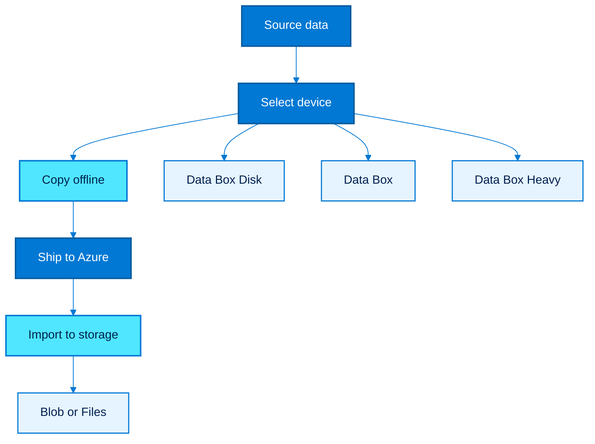

### Explanation

- Azure Data Box is the offline transfer option for large datasets when network bandwidth, transfer windows, or remote-site conditions make online copying impractical.
- Data Box Disk is suited to smaller volumes and distributed edge collection scenarios.
- Data Box is the standard appliance for large-scale imports and exports.
- Data Box Heavy is designed for very large datasets where maximizing throughput per shipment matters.
- Import moves data into Azure Storage; export ships Azure data back out to encrypted devices when required.
- Offline transfer planning should include data classification, chain of custody, shipping approval, tamper handling, and encryption key protection.
- Data Box is often paired with Azure Blob Storage, Azure Files, backup archives, media repositories, and initial data seeding for migration programs.
- Use Data Box when the first bulk load is offline and then switch to network-based delta synchronization for final cutover.
- Device selection depends on capacity, region availability, data type, and desired import speed.
- Operations teams must coordinate logistics, receiving, copying, return shipping, and post-import verification.

### Recommended Workflow

1. Estimate dataset size, change rate, and transport timeline.
2. Choose the correct Data Box device based on capacity and geography.
3. Create the target storage account and containers or file shares.
4. Order the Data Box job, receive the device, and copy data using SMB or NFS as supported.
5. Return the device and monitor Azure import status.
6. Validate imported data and perform any delta sync before production cutover.

### Azure CLI Commands

```bash
az group create --name rg-databox --location eastus
az storage account create --name stdataboxseed01 --resource-group rg-databox --location eastus --sku Standard_GRS --kind StorageV2
az storage container create --account-name stdataboxseed01 --name landing-zone-seed --auth-mode login
az resource create --resource-group rg-databox --name databox-import-01 --resource-type Microsoft.DataBox/jobs --api-version 2023-04-01 --properties '{"location":"eastus","sku":{"name":"DataBox"},"transferType":"ImportToAzure","details":{"contactDetails":{"contactName":"Migration Team","phone":"+1-555-0100","emailList":["cloudops@example.com"]}}}'
az resource show --resource-group rg-databox --name databox-import-01 --resource-type Microsoft.DataBox/jobs --api-version 2023-04-01
az storage blob upload-batch --destination landing-zone-seed --account-name stdataboxseed01 --source <local-export-path> --pattern "*.bak"
az storage blob list --account-name stdataboxseed01 --container-name landing-zone-seed --output table
az resource tag --resource-group rg-databox --name databox-import-01 --resource-type Microsoft.DataBox/jobs --tags Transfer=Offline DataClass=MigrationSeed
```

### Best Practices

- Use Data Box for bulk seeding and use online synchronization for final deltas.
- Protect unlock passcodes and encryption keys with the same rigor as production credentials.
- Pre-create container and folder structures so imported data lands in the correct namespace.
- Track chain of custody and involve security/compliance teams for regulated datasets.
- Checksum or sample-verify imported data before deleting the source copies.
- Document how exports or returns are approved and monitored.

### Common Risks

- Underestimating data change rate between appliance ship date and cutover can create large delta windows.
- Poor labeling or folder design during copy can complicate ingestion into downstream applications.
- Logistics delays can affect migration schedules if customs or site access approvals are not prepared.
- Sensitive data handling procedures must be explicit to avoid audit findings.

### Validation Checklist

- [ ] Device type matches dataset size.
- [ ] Storage target is ready and access tested.
- [ ] Security and shipping approvals are complete.
- [ ] Import status is tracked through completion.
- [ ] Data verification is performed after ingest.
- [ ] Delta sync plan exists before go-live.

### Notes

- This section should be adapted to the organization's identity, network, security, and change-management standards before production execution.
- Pilot the azure data box pattern with a representative workload before broad rollout.
- Keep architecture diagrams, cutover runbooks, and owner contacts aligned with the guidance in this azure data box section.

---

## 7. Azure Site Recovery

### Mermaid Diagram

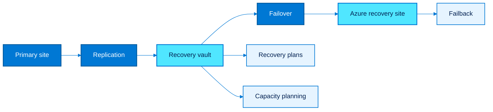

### Explanation

- Azure Site Recovery (ASR) provides disaster recovery through replication, orchestrated failover, test failover, and failback workflows.
- Replication copies workload changes from the primary site to Azure or between regions depending on the scenario.
- Recovery plans sequence failover for multi-tier applications so that dependencies, manual actions, and automation are preserved.
- Failover can be planned for controlled events or unplanned for disaster scenarios.
- Failback returns workloads to the original site or alternative site after the primary environment is restored.
- Capacity planning is essential because a DR event concentrates workload startup, network use, and operator activity into a short time window.
- ASR should be considered separately from migration; although both replicate workloads, DR design optimizes recovery objectives rather than one-time movement.
- Network mapping, IP retention strategy, DNS failover, and runbook automation determine how smooth recovery will be.
- Regular test failovers are required to prove RTO, RPO, and runbook quality.
- ASR is especially valuable for business-critical apps that need Azure as a recovery site before or after migration.

### Recommended Workflow

1. Create the Recovery Services vault and define replication policies.
2. Prepare source and target networking, storage, and capacity reservations.
3. Enable replication for workloads and group them into recovery plans.
4. Run non-disruptive test failovers into isolated networks.
5. Perform planned failover when needed and validate application recovery.
6. Fail back after the primary site is healthy and data is resynchronized.

### Azure CLI Commands

```bash
az group create --name rg-asr --location eastus
az recoveryservices vault create --resource-group rg-asr --name rsv-asr-eastus --location eastus
az network vnet create --resource-group rg-asr --name vnet-asr-recovery --address-prefix 10.60.0.0/16 --subnet-name subnet-recovery --subnet-prefix 10.60.1.0/24
az resource create --resource-group rg-asr --name rsv-asr-eastus/asr-policy-01 --resource-type Microsoft.RecoveryServices/vaults/replicationPolicies --api-version 2023-02-01 --properties '{"recoveryPointHistoryInMinutes":1440,"applicationConsistentSnapshotFrequencyInHours":4}'
az resource create --resource-group rg-asr --name rsv-asr-eastus/rp-tier1-app --resource-type Microsoft.RecoveryServices/vaults/replicationRecoveryPlans --api-version 2023-02-01 --properties '{"groups":[],"primaryFabricFriendlyName":"OnPrem"}'
az resource show --resource-group rg-asr --name rsv-asr-eastus/asr-policy-01 --resource-type Microsoft.RecoveryServices/vaults/replicationPolicies --api-version 2023-02-01
az vm create --resource-group rg-asr --name dr-capacity-check-vm --image Ubuntu2204 --size Standard_D2s_v5 --vnet-name vnet-asr-recovery --subnet subnet-recovery --admin-username azureuser --generate-ssh-keys
az monitor metrics list --resource /subscriptions/<subscription-id>/resourceGroups/rg-asr/providers/Microsoft.RecoveryServices/vaults/rsv-asr-eastus --metric SuccessfulFailoverJobs --interval PT1H
```

### Best Practices

- Design recovery plans by application, not by server team, so failover sequence matches business reality.
- Run test failovers on a calendar and treat failures as production risks.
- Size target subnets, quotas, and reserved capacity for realistic DR concurrency.
- Automate post-failover tasks such as DNS updates, load balancer registration, and smoke tests.
- Keep runbooks for failback and reverse replication just as detailed as failover runbooks.
- Align ASR policy settings with business RPO/RTO requirements rather than defaults.

### Common Risks

- Recovery plans that are not tested often drift away from current application design.
- Insufficient Azure quota or networking can block failover during a real incident.
- Manual DNS and certificate actions frequently extend recovery time beyond target RTO.
- Operators unfamiliar with failback procedures may create prolonged dual-site risk.

### Validation Checklist

- [ ] Vault and policies exist.
- [ ] Target network and quota are validated.
- [ ] Recovery plans are documented.
- [ ] Test failover evidence is current.
- [ ] Runbooks cover failover and failback.
- [ ] DR monitoring and alerting are configured.

### Notes

- This section should be adapted to the organization's identity, network, security, and change-management standards before production execution.
- Pilot the azure site recovery pattern with a representative workload before broad rollout.
- Keep architecture diagrams, cutover runbooks, and owner contacts aligned with the guidance in this azure site recovery section.

---

## 8. Azure File Migration

### Mermaid Diagram

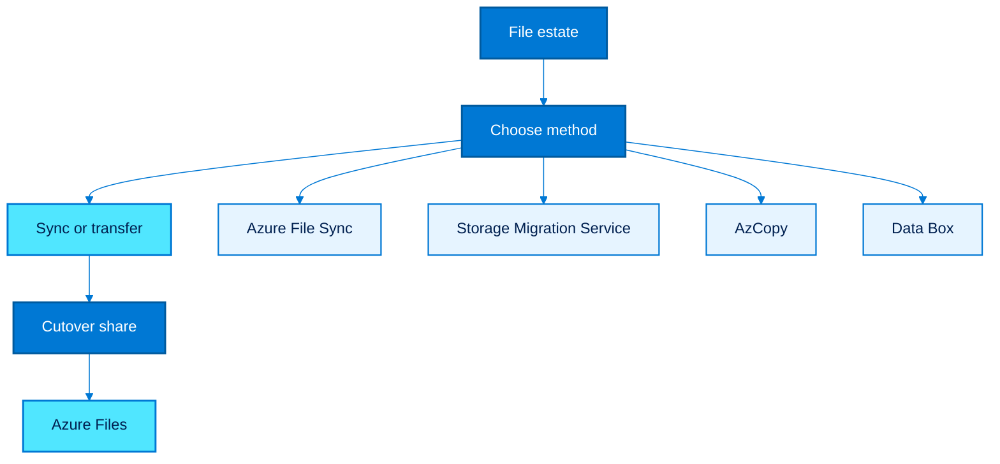

### Explanation

- File migration into Azure commonly targets Azure Files for SMB access and shared application storage.
- Azure File Sync extends Azure Files to Windows Servers and supports tiering and staged migration patterns.
- Storage Migration Service can orchestrate file-server migration from Windows sources, preserving shares and security metadata where supported.
- AzCopy is effective for straightforward copy operations into Azure Storage when metadata handling and namespace design are well understood.
- Data Box is useful for very large file datasets or remote sites with limited bandwidth.
- File migration design must include ACL preservation, identity integration, DFS namespace behavior, path length issues, application locking, and cutover downtime.
- Azure Files supports standard and premium tiers; target selection should match IOPS and latency requirements.
- Hybrid patterns are common: seed with Data Box or AzCopy, then use File Sync for staged adoption.
- Cutover often involves namespace changes, user profile updates, drive mappings, or application configuration updates.
- Validation must include ACLs, open file behavior, backup, snapshots, and restore testing.

### Recommended Workflow

1. Inventory file servers, share sizes, ACL complexity, and application lock behavior.
2. Choose Azure Files tier and access pattern.
3. Select migration tooling based on change rate and metadata requirements.
4. Perform bulk copy or initial sync.
5. Freeze writes, run final delta sync, and update namespace mappings.
6. Validate access, performance, backups, and snapshots.

### Azure CLI Commands

```bash
az group create --name rg-file-migration --location eastus
az storage account create --name stfilesmig01 --resource-group rg-file-migration --location eastus --sku Premium_LRS --kind FileStorage
az storage share-rm create --resource-group rg-file-migration --storage-account stfilesmig01 --name apps-share --quota 1024 --enabled-protocols SMB
az storage share-rm create --resource-group rg-file-migration --storage-account stfilesmig01 --name profiles-share --quota 5120 --enabled-protocols SMB
az resource create --resource-group rg-file-migration --name filesync-eastus --resource-type Microsoft.StorageSync/storageSyncServices --api-version 2022-09-01 --properties '{"location":"eastus"}'
az resource create --resource-group rg-file-migration --name filesync-eastus/syncgroup-apps --resource-type Microsoft.StorageSync/storageSyncServices/syncGroups --api-version 2022-09-01 --properties '{}'
az storage file upload-batch --account-name stfilesmig01 --destination apps-share --source <local-folder> --pattern "*"
az storage file list --account-name stfilesmig01 --share-name apps-share --output table
az storage account show-connection-string --resource-group rg-file-migration --name stfilesmig01
```

### Best Practices

- Test ACL preservation and identity authentication before migrating user-facing shares.
- Use Premium Azure Files for latency-sensitive line-of-business applications.
- Stage large migrations with File Sync when clients must continue using on-prem file servers during transition.
- Model DFS and namespace dependencies before changing UNC paths.
- Take snapshots before large ACL or namespace changes.
- Validate backup and restore procedures on Azure Files before production cutover.

### Common Risks

- Applications may rely on file locking, short latency, or legacy UNC conventions that are not obvious during inventory.
- ACL mismatches can create silent permission escalations or access denials.
- Cutover communications are critical because mapped drives and scripts may need updates.
- Namespace sprawl can make phased migration harder than a big-bang cutover if not planned carefully.

### Validation Checklist

- [ ] Shares are created and accessible.
- [ ] Migration method is chosen per share type.
- [ ] ACL validation is completed.
- [ ] Cutover script for mappings exists.
- [ ] Snapshots and backups are enabled.
- [ ] Business users validate file access and performance.

### Notes

- This section should be adapted to the organization's identity, network, security, and change-management standards before production execution.
- Pilot the azure file migration pattern with a representative workload before broad rollout.
- Keep architecture diagrams, cutover runbooks, and owner contacts aligned with the guidance in this azure file migration section.

---

## 9. Landing Zone

### Mermaid Diagram

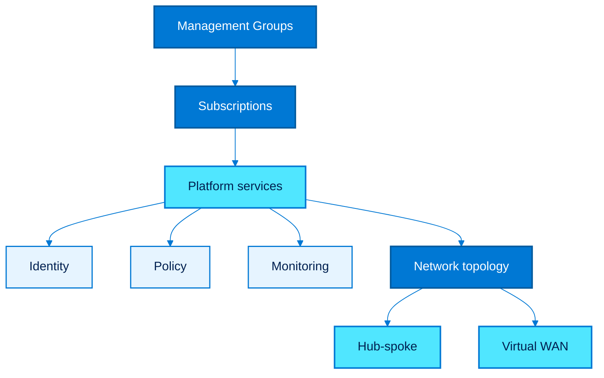

### Explanation

- An Azure Landing Zone is the target operating environment that hosts migrated workloads with secure, repeatable, and governable patterns.
- Management groups establish hierarchy for policy inheritance, access delegation, and subscription organization.
- Subscriptions separate platform, production, non-production, and business domains to reduce blast radius and simplify financial accountability.
- Policies, RBAC, diagnostic settings, and tagging standards must be in place before critical migrations begin.
- Hub-spoke topology is common when central services such as firewalls, DNS, shared egress, and inspection are concentrated in a hub VNet.
- Virtual WAN is useful for global branch connectivity, large-scale SD-WAN integration, and simplified transit operations.
- The landing zone should include identity integration, DNS strategy, key management, backup, monitoring, and patch governance.
- A well-designed landing zone reduces per-wave engineering effort because each workload adopts approved patterns instead of inventing new ones.
- Network topology choice must reflect latency paths, scale, security inspection, and operational model—not only diagram preference.
- Landing zones should be delivered as code and continuously validated.

### Recommended Workflow

1. Define management-group hierarchy and subscription model.
2. Deploy baseline policy, RBAC, diagnostic settings, and naming standards.
3. Implement the chosen network topology and shared platform services.
4. Create workload subscription templates and onboarding automation.
5. Validate with pilot workloads.
6. Evolve controls as new workload patterns arrive.

### Azure CLI Commands

```bash
az account management-group create --name mg-platform --display-name "Platform"
az account management-group create --name mg-landingzones --display-name "Landing Zones"
az account management-group create --name mg-corp-prod --display-name "Corporate Production" --parent mg-landingzones
az policy assignment create --name deny-public-ip --scope /providers/Microsoft.Management/managementGroups/mg-corp-prod --policy <policy-definition-id>
az network vnet create --resource-group rg-platform-core --name vnet-hub-eastus --address-prefix 10.0.0.0/16 --subnet-name AzureFirewallSubnet --subnet-prefix 10.0.1.0/24
az network vnet create --resource-group rg-platform-core --name vnet-spoke-apps --address-prefix 10.10.0.0/16 --subnet-name subnet-apps --subnet-prefix 10.10.1.0/24
az network vnet peering create --resource-group rg-platform-core --name peer-hub-to-spoke --vnet-name vnet-hub-eastus --remote-vnet /subscriptions/<subscription-id>/resourceGroups/rg-platform-core/providers/Microsoft.Network/virtualNetworks/vnet-spoke-apps --allow-vnet-access
az network vwan create --resource-group rg-platform-core --name vwan-global --location eastus --type Standard
az network vhub create --resource-group rg-platform-core --name vhub-eastus --location eastus --address-prefix 10.200.0.0/24 --vwan vwan-global
az monitor diagnostic-settings create --name diag-subscription --resource /subscriptions/<subscription-id> --workspace /subscriptions/<subscription-id>/resourceGroups/rg-platform-core/providers/Microsoft.OperationalInsights/workspaces/law-platform-eastus
```

### Best Practices

- Design the landing zone before migrating business-critical workloads.
- Use management groups for policy inheritance instead of repeating assignments manually per subscription.
- Choose hub-spoke when you want deterministic central inspection and established network operations patterns.
- Choose Virtual WAN when branch transit scale and global connectivity simplification dominate.
- Standardize logging, DNS, private endpoints, and egress controls across all landing zones.
- Deploy the landing zone through infrastructure as code and peer review changes.

### Common Risks

- Migrating into ad hoc subscriptions without a landing zone leads to governance debt and inconsistent operations.
- Over-centralized network design can create bottlenecks or long approval cycles if platform teams are undersized.
- Under-specified DNS and private connectivity designs frequently block PaaS adoption later.
- Policy deployed without exception management can slow migrations unless ownership and process are defined.

### Validation Checklist

- [ ] Hierarchy and subscriptions are approved.
- [ ] Baseline policies are assigned.
- [ ] Hub-spoke or Virtual WAN design is documented.
- [ ] Shared services are reachable from workload subscriptions.
- [ ] Diagnostics and logging are enabled.
- [ ] Onboarding pattern is automated.

### Notes

- This section should be adapted to the organization's identity, network, security, and change-management standards before production execution.
- Pilot the landing zone pattern with a representative workload before broad rollout.
- Keep architecture diagrams, cutover runbooks, and owner contacts aligned with the guidance in this landing zone section.

---

## 10. AWS to Azure Migration

### Mermaid Diagram

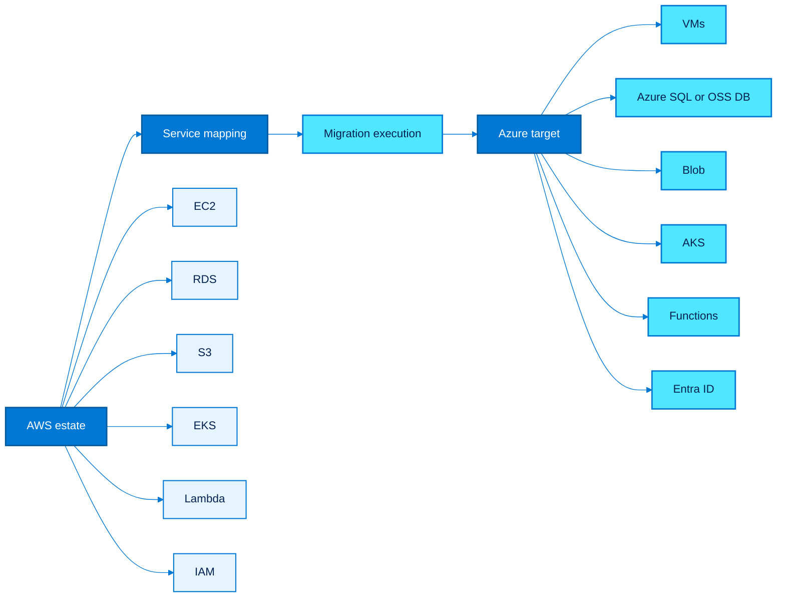

### Service Mapping

| AWS service | Azure target | Notes |
| --- | --- | --- |
| EC2 | Azure Virtual Machines / VM Scale Sets | Rehost or replatform with managed disks and Azure Backup. |
| RDS for SQL Server | Azure SQL Managed Instance / SQL Server on Azure VM | Choose based on feature parity and control needs. |
| RDS for MySQL/PostgreSQL | Azure Database for MySQL/PostgreSQL Flexible Server | Use managed PaaS where possible. |
| S3 | Azure Blob Storage | Review lifecycle, tiering, and application SDK behavior. |
| EKS | AKS | Rework identity, ingress, and cluster operations. |
| Lambda | Azure Functions | Rebuild event bindings and deployment pipelines. |
| IAM | Microsoft Entra ID + Azure RBAC | Use groups, roles, managed identities, and PIM. |

### Explanation

- AWS to Azure migration requires service-by-service mapping plus operational-model translation.
- EC2 commonly maps to Azure VMs, VM Scale Sets, or managed platforms if modernization is desired.
- RDS maps to Azure SQL Database, Azure SQL Managed Instance, or Azure Database for MySQL/PostgreSQL depending on engine and feature needs.
- S3 maps to Azure Blob Storage, though application semantics around eventual consistency, object naming, and lifecycle policies should be reviewed.
- EKS maps to AKS, but ingress, IAM integration, network policy, storage classes, and observability patterns must be redesigned for Azure conventions.
- Lambda maps to Azure Functions, with special attention to triggers, bindings, packaging, and cold-start behavior.
- AWS IAM concepts map to Microsoft Entra ID, RBAC, managed identities, groups, and service principals rather than a one-to-one technical clone.
- Migration planning should account for different quota models, networking concepts, monitoring, logging, and tag governance.
- Use Azure Migrate for server discovery when workloads are being rehosted from AWS into Azure IaaS.
- Cross-cloud migration succeeds faster when teams standardize target patterns rather than trying to recreate every AWS construct exactly.

### Recommended Workflow

1. Map each AWS service to an Azure target with clear reasons.
2. Decide which workloads are rehosted and which are modernized.
3. Build Azure landing-zone equivalents for identity, networking, logging, and security.
4. Migrate data and compute with pilot waves first.
5. Update CI/CD, identity, secrets, and monitoring integrations.
6. Validate performance, security posture, and operational ownership post-cutover.

### Azure CLI Commands

```bash
az vm create --resource-group rg-aws-migrate --name vm-from-ec2-01 --image Ubuntu2204 --size Standard_D4s_v5 --admin-username azureuser --generate-ssh-keys
az sql server create --resource-group rg-aws-migrate --name sql-from-rds-01 --location eastus --admin-user sqladmin --admin-password <Password>
az sql db create --resource-group rg-aws-migrate --server sql-from-rds-01 --name appdb --service-objective GP_S_Gen5_2
az storage account create --name stfroms301 --resource-group rg-aws-migrate --location eastus --sku Standard_LRS --kind StorageV2
az storage container create --account-name stfroms301 --name app-data --auth-mode login
az aks create --resource-group rg-aws-migrate --name aks-from-eks --node-count 3 --network-plugin azure --generate-ssh-keys
az functionapp plan create --resource-group rg-aws-migrate --name plan-func-aws --location eastus --sku EP1 --is-linux
az functionapp create --resource-group rg-aws-migrate --name func-from-lambda-01 --storage-account stfroms301 --plan plan-func-aws --runtime python --functions-version 4
az ad group create --display-name aws-migrated-app-admins --mail-nickname aws-migrated-app-admins
az role assignment create --assignee-object-id <group-object-id> --role Contributor --scope /subscriptions/<subscription-id>/resourceGroups/rg-aws-migrate
```

### Best Practices

- Avoid translating every AWS construct literally; optimize for Azure native operations.
- Review identity and secret flows carefully because IAM roles and Azure managed identities differ.
- Retest networking assumptions such as NAT, security groups, and service endpoints.
- Plan for differences in managed database maintenance behavior and backup configuration.
- Use AKS only when container operations justify it; otherwise consider App Service or Container Apps.
- Revisit cost models because Azure discounts, licensing benefits, and reservation strategies differ from AWS.

### Common Risks

- One-to-one mapping without architectural review can carry unnecessary complexity into Azure.
- Container images, Helm charts, and CI/CD pipelines may assume AWS-native services.
- Identity changes are often underestimated and can block user or workload access after cutover.
- Object storage API assumptions may need adapter logic when moving from S3-centric code.

### Validation Checklist

- [ ] Service mapping is approved per workload.
- [ ] Identity and RBAC model is tested.
- [ ] Data and object migration paths are validated.
- [ ] AKS or App Service platform runbooks exist.
- [ ] Monitoring and cost controls are configured.
- [ ] Application owners sign off on Azure behavior.

### Notes

- This section should be adapted to the organization's identity, network, security, and change-management standards before production execution.
- Pilot the aws to azure migration pattern with a representative workload before broad rollout.
- Keep architecture diagrams, cutover runbooks, and owner contacts aligned with the guidance in this aws to azure migration section.

---

## 11. GCP to Azure Migration

### Mermaid Diagram

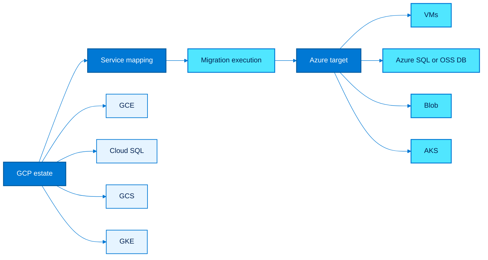

### Service Mapping

| GCP service | Azure target | Notes |
| --- | --- | --- |
| Compute Engine | Azure Virtual Machines | Re-evaluate sizing and premium storage choices. |
| Cloud SQL | Azure SQL / Azure Database for MySQL / PostgreSQL | Target depends on engine and feature parity. |
| Cloud Storage | Azure Blob Storage | Revisit lifecycle and SDK semantics. |
| GKE | AKS | Redesign cluster operations, identity, and ingress. |

### Explanation

- GCP to Azure migration requires mapping compute, database, storage, and container services to Azure-native equivalents while adjusting operations and identity.
- Google Compute Engine maps naturally to Azure VMs, but machine-family and disk-performance assumptions should be re-evaluated rather than copied blindly.
- Cloud SQL targets depend on engine and feature requirements, commonly Azure SQL, Azure Database for MySQL, or Azure Database for PostgreSQL.
- Google Cloud Storage maps to Azure Blob Storage, but storage classes, lifecycle behavior, and client-library expectations must be reviewed.
- GKE maps to AKS, with attention to ingress controllers, Workload Identity differences, and networking choices.
- GCP IAM differs significantly from Microsoft Entra ID and Azure RBAC, so group structure and least-privilege design should be remapped.
- Monitoring, logging, and policy controls need translation into Azure Monitor, Log Analytics, Azure Policy, and Defender for Cloud.
- Quota models, regional availability, and private connectivity patterns should be baselined early.
- Pilot migrations should prove data integrity, connectivity, and performance before broad execution.
- Standardizing the Azure target operating model is more important than reproducing every GCP implementation detail.

### Recommended Workflow

1. Create a service mapping between GCP and Azure.
2. Identify where modernization is better than rehost.
3. Prepare Azure landing-zone controls and connectivity.
4. Migrate storage and databases before application cutover where possible.
5. Move compute or containers and update deployment pipelines.
6. Validate operations, IAM, and performance after go-live.

### Azure CLI Commands

```bash
az group create --name rg-gcp-migrate --location eastus
az vm create --resource-group rg-gcp-migrate --name vm-from-gce-01 --image Ubuntu2204 --size Standard_D4s_v5 --admin-username azureuser --generate-ssh-keys
az sql server create --resource-group rg-gcp-migrate --name sql-from-cloudsql-01 --location eastus --admin-user sqladmin --admin-password <Password>
az sql db create --resource-group rg-gcp-migrate --server sql-from-cloudsql-01 --name appdb --service-objective GP_S_Gen5_2
az storage account create --name stfromgcs01 --resource-group rg-gcp-migrate --location eastus --sku Standard_LRS --kind StorageV2
az storage container create --account-name stfromgcs01 --name data-lake --auth-mode login
az aks create --resource-group rg-gcp-migrate --name aks-from-gke --node-count 3 --generate-ssh-keys --network-plugin azure
az aks get-credentials --resource-group rg-gcp-migrate --name aks-from-gke
az role assignment create --assignee <user-or-sp-object-id> --role Reader --scope /subscriptions/<subscription-id>/resourceGroups/rg-gcp-migrate
```

### Best Practices

- Check quota and region parity before committing to a cutover timeline.
- Redesign IAM using Entra ID groups, Azure RBAC, and managed identities.
- Retest application code that assumes GCS or GCP metadata-service behaviors.
- Treat GKE-to-AKS as an operating-model migration, not only a cluster import exercise.
- Use Azure Monitor and Log Analytics to rebuild dashboards and alerts before production cutover.
- Optimize VM sizing and storage after the first month with observed Azure telemetry.

### Common Risks

- GCP-specific service accounts and metadata patterns can break quietly if not redesigned.
- Object and database cutovers may require dual-write or read-only windows depending on change rates.
- Cluster add-ons from GKE may need Azure-native alternatives.
- Regional service availability differences can require architecture changes.

### Validation Checklist

- [ ] Service mapping is complete.
- [ ] Target resources are deployed.
- [ ] Identity model is tested.
- [ ] Data migration is validated.
- [ ] Operational dashboards are rebuilt.
- [ ] Application owners approve performance and functionality.

### Notes

- This section should be adapted to the organization's identity, network, security, and change-management standards before production execution.
- Pilot the gcp to azure migration pattern with a representative workload before broad rollout.
- Keep architecture diagrams, cutover runbooks, and owner contacts aligned with the guidance in this gcp to azure migration section.

---

## 12. On-Premises to Azure

### Mermaid Diagram

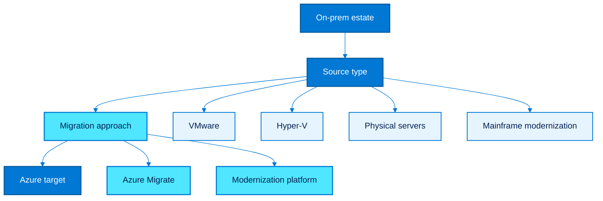

### Explanation

- On-premises to Azure migration includes virtualized estates, physical servers, legacy applications, and modernization pathways for mainframe-adjacent systems.
- VMware migrations often use Azure Migrate agentless discovery and replication, while Hyper-V and physical servers may rely more heavily on agent-based methods.
- Physical-server migration requires careful planning for drivers, boot compatibility, bandwidth, and downtime because there is no hypervisor abstraction layer.
- Legacy application modernization may involve decomposing monoliths, rehosting middleware on IaaS first, or refactoring into PaaS and container platforms.
- Mainframe modernization is usually a portfolio strategy rather than a single tooling step; options include API enablement, data replication, code transformation, and strangler-pattern decomposition.
- Connectivity, DNS, identity federation, and data residency are central concerns when integrating Azure with remaining on-prem systems.
- Azure Arc can help provide visibility and governance for servers that remain on-prem during phased migration.
- Migration planning should identify which workloads will remain hybrid for an extended period and design for that reality.
- Not every mainframe workload should be immediately rewritten; sometimes the best first step is interface extraction and data domain decoupling.
- The end-state architecture should balance speed, risk, and business value rather than aiming for universal refactoring on day one.

### Recommended Workflow

1. Discover and assess VMware, Hyper-V, and physical servers.
2. Group workloads by application dependency and modernization target.
3. Design hybrid connectivity and identity for the coexistence period.
4. Migrate lift-and-shift candidates first.
5. Modernize legacy or mainframe-connected workloads incrementally.
6. Retire old hardware and collapse technical debt after stabilization.

### Azure CLI Commands

```bash
az group create --name rg-onprem-migrate --location eastus
az resource create --resource-group rg-onprem-migrate --name amproj-onprem --resource-type Microsoft.Migrate/migrateProjects --api-version 2023-10-01 --properties '{"location":"eastus"}'
az network vpn-gateway create --resource-group rg-onprem-migrate --name vpngw-hybrid-eastus --public-ip-addresses pip-vpngw-eastus --vnet vnet-hub-eastus --gateway-type Vpn --sku VpnGw2
az vm create --resource-group rg-onprem-migrate --name vm-legacy-app01 --image Win2022Datacenter --size Standard_D4s_v5 --admin-username azureadmin --admin-password <Password>
az disk create --resource-group rg-onprem-migrate --name disk-imported-data01 --size-gb 1024 --sku Premium_LRS
az webapp create --resource-group rg-onprem-migrate --plan asp-migrate-eastus --name modernized-web-front --runtime "DOTNET|8.0"
az servicebus namespace create --resource-group rg-onprem-migrate --name sb-mainframe-integration-01 --location eastus --sku Standard
az arcdata dc create --resource-group rg-onprem-migrate --name arcdata-hybrid-01 --location eastus
```

### Best Practices

- Use Azure Migrate for estate-wide visibility even when not every workload will move immediately.
- Treat hybrid connectivity and DNS as first-class design items for phased migration.
- Migrate stable infrastructure services early only if dependencies are well understood and rollback is clear.
- For physical servers, rehearse agent deployment, throttling, and cutover windows carefully.
- Approach mainframe modernization through domain decomposition, API exposure, and incremental data separation.
- Use Azure Arc for governance during long coexistence periods.

### Common Risks

- Hybrid identity and DNS gaps often create more outage risk than the VM move itself.
- Legacy middleware licensing and support policies may change when moving off original hardware.
- Mainframe modernization projects can sprawl without a bounded domain and milestone structure.
- Physical migrations can overrun windows if bandwidth and delta-sync volume are underestimated.

### Validation Checklist

- [ ] Source inventory is complete.
- [ ] Hybrid connectivity is tested.
- [ ] Migration method is assigned per workload type.
- [ ] Modernization scope is phased.
- [ ] Operational ownership for hybrid state is clear.
- [ ] Decommission plan exists for retired systems.

### Notes

- This section should be adapted to the organization's identity, network, security, and change-management standards before production execution.
- Pilot the on-premises to azure pattern with a representative workload before broad rollout.
- Keep architecture diagrams, cutover runbooks, and owner contacts aligned with the guidance in this on-premises to azure section.

---

## 13. Migration Waves

### Mermaid Diagram

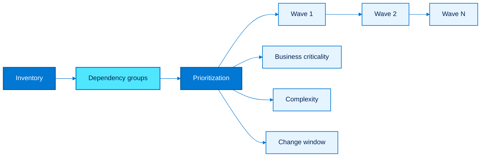

### Explanation

- Migration waves are the practical execution model that converts a large portfolio into manageable delivery increments.
- A wave should contain workloads that can be prepared, tested, cut over, and stabilized with available team capacity and change windows.
- Dependency groups are essential because moving a front-end alone rarely works if databases, authentication, file shares, or middleware remain behind.
- Prioritization should balance business value, risk reduction, technical complexity, and opportunity to reuse patterns in later waves.
- Early waves should include representative but manageable workloads so teams learn without jeopardizing the most critical systems.
- Later waves benefit from reusable automation, proven network patterns, and refined cutover runbooks.
- Wave planning must account for blackout periods, release calendars, quarter-end freezes, and audit windows.
- Each wave needs explicit entry criteria, exit criteria, rollback conditions, and stabilization periods.
- Wave governance works best when technical readiness and business readiness are reviewed together.
- Successful wave planning increases throughput by reducing surprises rather than by overloading cutover weekends.

### Recommended Workflow

1. Build application dependency groups from discovery data and owner interviews.
2. Score workloads by business criticality, complexity, and readiness.
3. Create pilot, medium-complexity, and high-criticality wave patterns.
4. Prepare shared prerequisites before each wave.
5. Execute cutover and stabilization.
6. Feed lessons learned into the next wave backlog.

### Azure CLI Commands

```bash
az group create --name rg-wave-ops --location eastus
az tag create --name Wave --resource-id /subscriptions/<subscription-id>/resourceGroups/rg-wave-ops
az resource tag --ids /subscriptions/<subscription-id>/resourceGroups/rg-app-migration --tags Wave=1 ApplicationGroup=CustomerPortal
az resource tag --ids /subscriptions/<subscription-id>/resourceGroups/rg-data-migration --tags Wave=1 ApplicationGroup=CustomerPortal
az graph query -q "Resources | where tags.Wave !=  | project name, resourceGroup, wave=tostring(tags.Wave), app=tostring(tags.ApplicationGroup) | order by wave asc"
az monitor action-group create --resource-group rg-wave-ops --name ag-wave-bridge --short-name waveops
az deployment group create --resource-group rg-wave-ops --template-file <wave-checklist-template.bicep> --parameters waveNumber=1
az monitor metrics alert create --resource-group rg-wave-ops --name alert-wave1-cpu --scopes /subscriptions/<subscription-id>/resourceGroups/rg-app-migration/providers/Microsoft.Web/sites/webapp-migrate-demo --condition "avg CpuPercentage > 80" --action ag-wave-bridge
```

### Best Practices

- Define waves by application dependency, not by infrastructure silo.
- Keep the first wave small enough to learn but broad enough to validate your end-to-end process.
- Use tags, dashboards, and shared runbooks so everyone understands wave scope and status.
- Schedule stabilization time after each wave instead of stacking cutovers back to back.
- Carry forward reusable patterns and automation aggressively.
- Include business validation owners in wave planning and cutover sign-off.

### Common Risks

- Oversized waves create coordination failure even when the technical migration steps are sound.
- Dependencies discovered too late can force partial cutovers or emergency rollback.
- Not reserving stabilization time makes issue resolution compete with the next wave preparation.
- Wave metrics that count only server numbers can hide business-impacting defects.

### Validation Checklist

- [ ] Wave scope is tagged and approved.
- [ ] Dependencies are documented.
- [ ] Entry and exit criteria exist.
- [ ] Rollback is rehearsed.
- [ ] Bridge communications and monitoring are ready.
- [ ] Lessons learned are captured after the wave.

### Notes

- This section should be adapted to the organization's identity, network, security, and change-management standards before production execution.
- Pilot the migration waves pattern with a representative workload before broad rollout.
- Keep architecture diagrams, cutover runbooks, and owner contacts aligned with the guidance in this migration waves section.

---

## 14. Post-Migration

### Mermaid Diagram

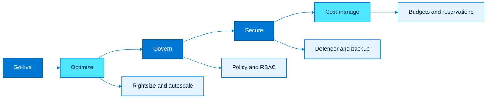

### Explanation

- Migration is not complete at cutover; the post-migration phase converts a stable workload into an optimized, governed, secure, and cost-efficient service.
- Optimization includes rightsizing, autoscaling, storage-tier review, SQL tuning, and reserved-capacity decisions based on observed telemetry.
- Governance ensures policy compliance, tag accuracy, RBAC hygiene, backup enforcement, and drift control.
- Security hardening includes Defender for Cloud, vulnerability management, patching, private endpoints, secret rotation, and least-privilege access review.
- Cost management uses budgets, anomaly review, commitment discounts, shutdown automation, and ownership reporting.
- Operational maturity includes backup validation, DR updates, alert tuning, runbook updates, and decommissioning the legacy environment safely.
- Teams should compare post-migration performance and cost against the original business case.
- The first 30 to 90 days are the best window to correct oversizing and close governance gaps.
- Security controls should be validated under production traffic, not assumed from templates alone.
- A disciplined post-migration process turns a technical move into durable business value.

### Recommended Workflow

1. Enable monitoring, backup, Defender, and policy controls immediately after cutover.
2. Observe workload behavior under production load.
3. Rightsize compute, storage, and database tiers.
4. Tune security posture and close policy gaps.
5. Review costs, reservations, and budgets.
6. Decommission source systems after retention and rollback windows expire.

### Azure CLI Commands

```bash
az advisor recommendation list --category Cost --output table
az advisor recommendation list --category HighAvailability --output table
az security pricing create --name VirtualMachines --tier standard
az policy assignment create --name enforce-backup --scope /subscriptions/<subscription-id>/resourceGroups/rg-server-migration --policy <policy-definition-id>
az monitor autoscale create --resource-group rg-app-migration --resource webapp-migrate-demo --resource-type Microsoft.Web/sites --name autoscale-webapp --min-count 2 --max-count 10 --count 2
az monitor autoscale rule create --resource-group rg-app-migration --autoscale-name autoscale-webapp --condition "CpuPercentage > 70 avg 10m" --scale out 1
az consumption budget create --amount 5000 --budget-name migration-prod-budget --category cost --resource-group rg-server-migration --time-grain monthly --start-date 2025-01-01 --end-date 2025-12-31
az backup protection enable-for-vm --resource-group rg-server-migration --vault-name rsv-server-migrate-eastus --vm vm-cutover-app01 --policy-name DefaultPolicy
az monitor metrics list --resource /subscriptions/<subscription-id>/resourceGroups/rg-app-migration/providers/Microsoft.Web/sites/webapp-migrate-demo --metric CpuPercentage Http5xx --interval PT1H
```

### Best Practices

- Perform rightsizing from real telemetry rather than guesswork from pre-migration estimates.
- Assign workload owners to budget, security, and compliance reviews within the first month.
- Validate backup restore and DR plans, not just backup job success.
- Close temporary migration exceptions quickly and track them as debt items.
- Use Azure Advisor, Policy, and Defender findings to drive stabilization work.
- Do not decommission the source until rollback risk, legal retention, and audit requirements are satisfied.

### Common Risks

- Post-migration neglect leaves workloads oversized, under-monitored, and security-light even if cutover was successful.
- Temporary firewall, privileged access, or policy exceptions can persist indefinitely without review.
- Cost spikes often occur when legacy systems remain running longer than planned.
- Backup jobs that were enabled but never restore-tested can create a false sense of resilience.

### Validation Checklist

- [ ] Telemetry is flowing to Azure Monitor.
- [ ] Backup and restore are tested.
- [ ] Rightsizing review is completed.
- [ ] Security hardening tasks are tracked.
- [ ] Budgets and cost reports are active.
- [ ] Legacy decommission milestones are approved.

### Notes

- This section should be adapted to the organization's identity, network, security, and change-management standards before production execution.
- Pilot the post-migration pattern with a representative workload before broad rollout.
- Keep architecture diagrams, cutover runbooks, and owner contacts aligned with the guidance in this post-migration section.

---

## Appendix A. Common Azure CLI Bootstrap

Use the following bootstrap sequence before executing migration commands in any section.

```bash
az login
az account list --output table
az account set --subscription <subscription-id>
az configure --defaults group=rg-migration-default location=eastus
az provider register --namespace Microsoft.Compute
az provider register --namespace Microsoft.Network
az provider register --namespace Microsoft.Storage
az provider register --namespace Microsoft.Web
az provider register --namespace Microsoft.Sql
az provider register --namespace Microsoft.OperationalInsights
az provider register --namespace Microsoft.RecoveryServices
az provider register --namespace Microsoft.Migrate
```

### Bootstrap best practices

- Store secrets in Azure Key Vault or secure pipeline variables, not in shell history.
- Use service principals or federated workload identities for automation.
- Standardize region, naming, and tags in CLI defaults or templates.
- Test permissions with non-production resource groups first.
- Prefer infrastructure as code for repeatable landing-zone and workload deployment.

---

## Appendix B. End-to-End Migration Checklist

- Strategy is approved with measurable outcomes.
- Landing zone is deployed and governed.
- Discovery coverage is complete.
- Dependency groups are reviewed by application owners.
- Wave plan is published.
- Pilot migration results are documented.
- Server migration test cutovers are complete.
- Database migration compatibility blockers are resolved.
- App migration target platform decisions are signed off.
- Data transfer method is selected for large datasets.
- DR and ASR design is updated for migrated workloads.
- File shares, ACLs, and namespace mappings are validated.
- Cross-cloud service mappings are approved where applicable.
- Hybrid connectivity and DNS are tested.
- Go-live bridge, rollback, and communications are prepared.
- Post-migration optimization backlog is funded.
- Security hardening and policy compliance are tracked.
- Budget, cost alerts, and ownership reporting are active.
- Backup restore testing is complete.
- Legacy environment decommission plan is approved.

## Closing Guidance

- Start with a governed landing zone, not with the first server move.
- Use assessments and dependencies to build waves grounded in evidence.
- Prefer managed Azure services when they reduce operational toil without violating requirements.
- Treat cutover, rollback, security, and post-migration optimization as one continuous program.
- Revisit business-case assumptions after each wave and use telemetry to improve the next one.
