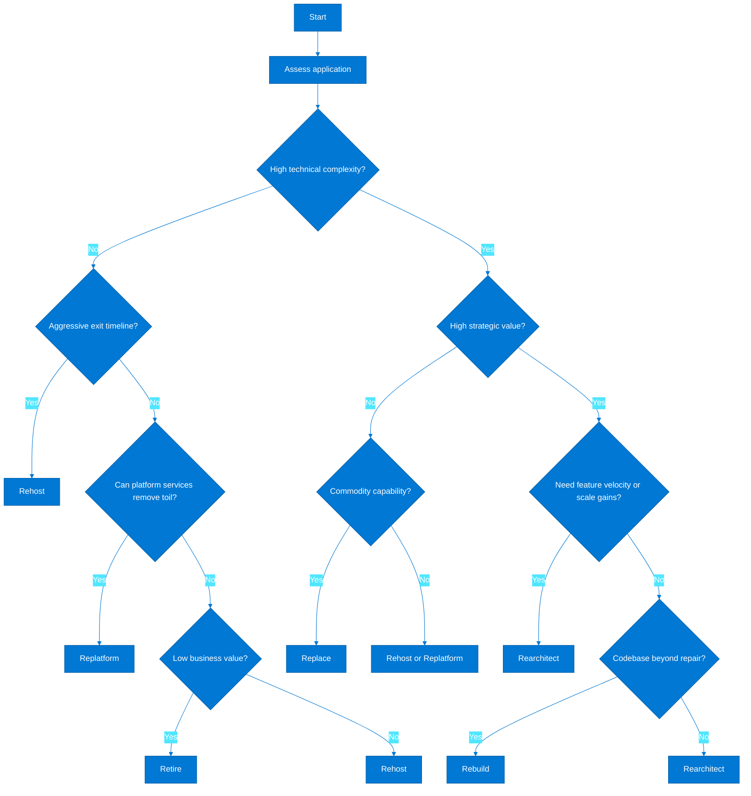
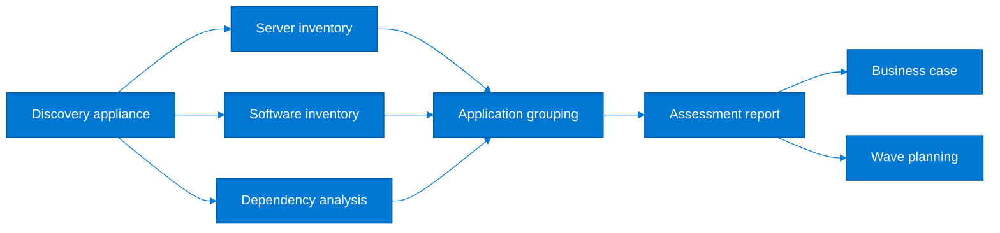
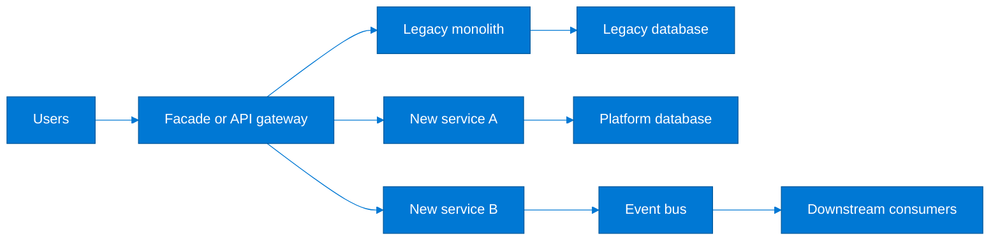
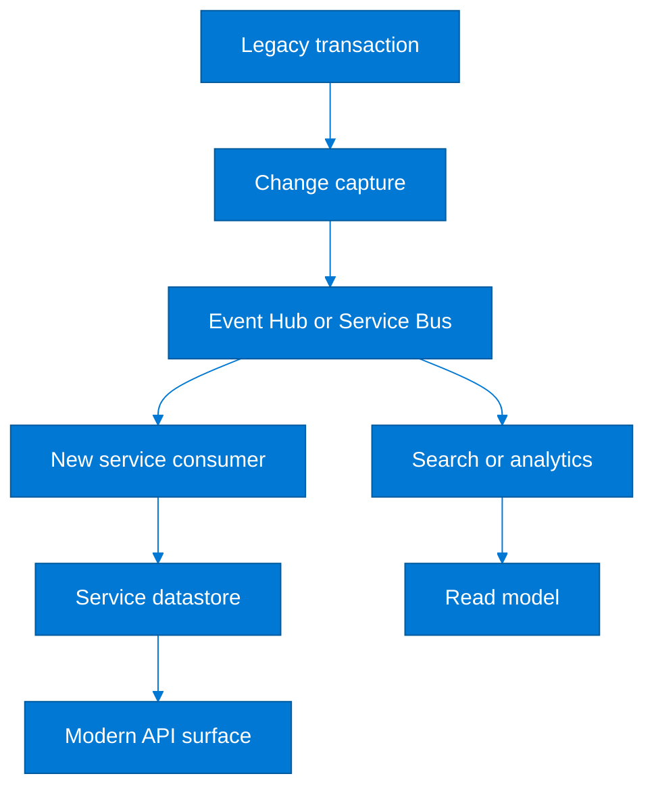
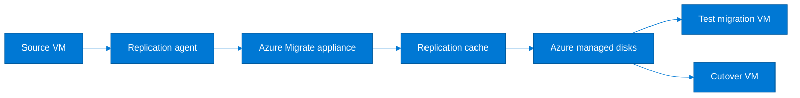
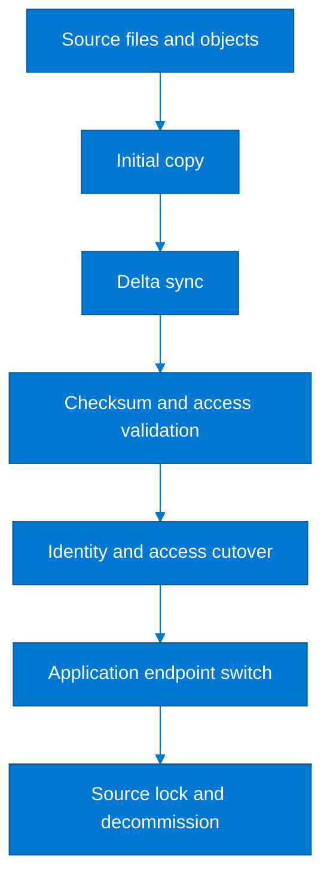
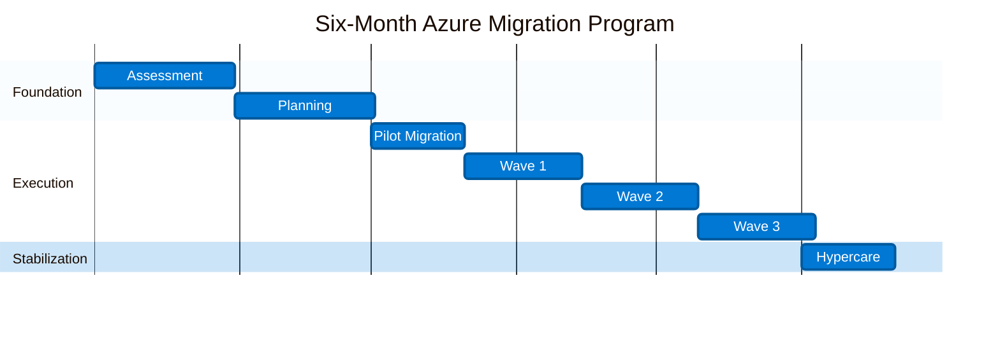
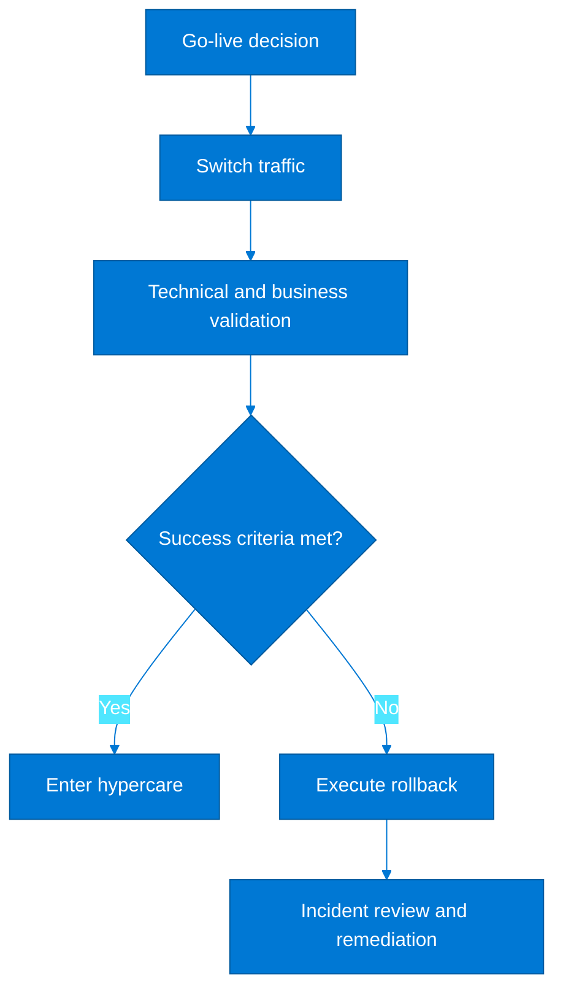
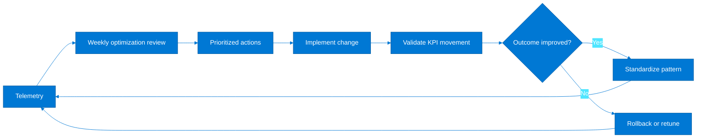
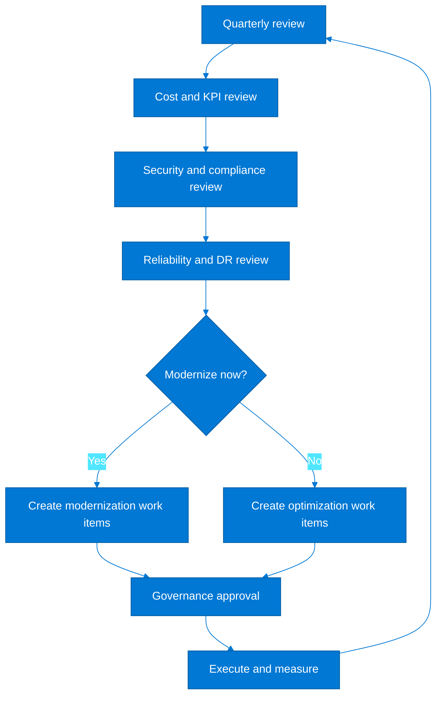

# Comprehensive Migration Guide: On-Premises to Azure & Cloud-to-Cloud
> Architect-level Azure migration guidance for enterprise programs moving from on-premises estates or other clouds into Azure, with decision frameworks, landing-zone considerations, migration runbooks, cutover controls, rollback patterns, and post-migration optimization practices.

**Audience:** Enterprise architects, cloud architects, platform engineers, migration factory leads, security teams, DBAs, operations teams, and delivery managers.
**Scope:** Strategy, assessment, migration patterns, cross-cloud mappings, cutover governance, and optimization for workloads moving into Azure.
**Execution principle:** Establish a secure landing zone, rationalize the application estate, migrate in dependency-aware waves, and optimize after each cutover rather than waiting for a final stabilization phase.

## Table of Contents
1. [Migration Strategy Overview](#1-migration-strategy-overview)
2. [On-Premises Assessment](#2-on-premises-assessment)
3. [Rehost (Lift and Shift)](#3-rehost-lift-and-shift)
4. [Replatform](#4-replatform)
5. [Rearchitect](#5-rearchitect)
6. [VM Migration Deep Dive](#6-vm-migration-deep-dive)
7. [Database Migration Deep Dive](#7-database-migration-deep-dive)
8. [Application & Data Migration](#8-application--data-migration)
9. [Network & Identity Migration](#9-network--identity-migration)
10. [Migration Timeline & Gantt Chart](#10-migration-timeline--gantt-chart)
11. [AWS to Azure Migration](#11-aws-to-azure-migration)
12. [GCP to Azure Migration](#12-gcp-to-azure-migration)
13. [Cutover & Rollback Procedures](#13-cutover--rollback-procedures)
14. [Post-Migration Optimization](#14-post-migration-optimization)

---

## 1. Migration Strategy Overview

**Microsoft Learn:** [Cloud Adoption Framework migrate methodology](https://learn.microsoft.com/en-us/azure/cloud-adoption-framework/migrate/)

### Why migration strategy matters
- A migration strategy aligns executive outcomes, operating-model constraints, and workload-specific engineering choices before technical execution begins.
- The strategy phase must decide whether the program is driven by datacenter exit, cost reduction, resilience improvement, regulatory realignment, modernization, acquisition integration, or a combination of those drivers.
- Architects should treat landing-zone readiness, identity integration, and network connectivity as schedule-critical path items rather than technical prerequisites that can be handled later.
- The right migration strategy accepts that not every application deserves the same treatment; low-value workloads can be retired while strategic systems may justify replatforming or rearchitecture.
- A defensible migration strategy creates a repeatable decision model so business sponsors can understand why one workload is rehosted and another is rebuilt.
- Program-level governance should define architecture standards, cutover approval checkpoints, risk acceptance criteria, and evidence requirements for each migration wave.
- The strategy must include decommissioning and benefit realization; otherwise organizations often complete technical moves but continue paying for legacy hosting, licenses, and support contracts.

### Migration phases
1. Assess the estate by discovering servers, applications, databases, identities, data flows, compliance needs, and business criticality.
2. Plan the target architecture by defining the landing zone, target services, networking, identity design, security baselines, and wave sequencing.
3. Migrate workloads by pattern using repeatable runbooks, test cycles, pilot waves, dependency-aware execution, and controlled cutovers.
4. Optimize each migrated workload for cost, reliability, security, observability, backup, and operational ownership after production stabilization.

| Phase | Primary question | Core deliverables | Exit criteria |
|---|---|---|---|
| Assess | What do we have and what constrains movement? | Inventory, dependency map, readiness report, business case inputs | Application groups and source baselines are trusted |
| Plan | What is the right Azure target and sequence? | Landing zone design, migration waves, runbooks, ownership matrix | Governance and platform controls are approved |
| Migrate | How do we move with acceptable risk? | Replication patterns, cutover procedures, rollback plans, validation evidence | Wave sign-off completed and source freeze is controlled |
| Optimize | How do we realize value after landing? | Rightsizing backlog, RI plan, security remediation, operations handoff | KPIs meet business and technical targets |

### 6 Rs decision framework
| R | Description | Effort | Risk | When to use |
|---|---|---|---|---|
| Rehost | Move the workload largely unchanged onto Azure IaaS. | Low | Low to medium | Datacenter exit deadlines, limited engineering capacity, legacy package constraints |
| Replatform | Move to managed platform services with minimal code change. | Medium | Medium | Database, web, and middleware tiers can benefit from managed PaaS operations |
| Rearchitect | Refactor the solution structure to improve scalability, resilience, or delivery speed. | High | Medium to high | Strategic digital products with strong business sponsorship and recurring change demand |
| Rebuild | Rewrite the application on a cloud-native architecture. | Very high | High | Technology reset is mandatory because the current codebase blocks required outcomes |
| Replace | Adopt SaaS instead of retaining a custom workload. | Medium | Medium | Commodity business functions such as ITSM, CRM, or collaboration are not strategic differentiators |
| Retire | Decommission the workload and remove operational burden. | Low | Low | No active owner, duplicated capability, negligible usage, or obsolete business process |

### Strategy decision tree


### Building the business case
- Separate one-time migration cost from steady-state Azure operating cost so sponsors understand the transition profile rather than only the destination profile.
- Include network circuits, security tooling, backup retention, observability, platform engineering, and application remediation in the model.
- Quantify avoided costs such as hardware refresh, storage expansion, software renewal, co-location, and third-party support contracts.
- Evaluate resilience gains, recovery-time improvements, and time-to-deliver improvements as business value components rather than treating cost as the only driver.
- Where modernization is planned, represent the value of reduced deployment friction, environment standardization, and improved lead time in the investment narrative.
- Model the cost effect of Azure Hybrid Benefit, Reserved Instances, Savings Plans, and SQL licensing decisions separately to avoid false assumptions during assessment.
- Track decommission milestones in the business case; many programs miss savings because on-premises assets remain active after workloads are cut over.

| Business case element | Questions to answer | Evidence source |
|---|---|---|
| Infrastructure cost | What hardware, hosting, energy, and maintenance costs disappear? | CMDB, finance records, hosting invoices |
| Software cost | Which licenses are retired, transferred, or optimized with Azure benefits? | License inventory, procurement contracts |
| Transformation cost | What engineering, testing, consulting, and project costs are required? | Program estimates, vendor SOWs |
| Risk reduction | How does Azure improve DR, patching, security, and supportability? | Risk register, audit findings, DR metrics |
| Agility gain | How much faster can new environments and releases be delivered? | Delivery metrics, stakeholder interviews |
| Exit urgency | What cost or operational risk exists if the current estate is retained? | Datacenter notices, support lifecycle, contract expiries |

### Architecture principles for migration
- Design a landing zone once and reuse it across waves rather than inventing network, policy, and monitoring designs per workload.
- Prefer managed services where they materially reduce patching, backup, availability, and platform maintenance burden.
- Preserve source-state behavior during early waves unless a documented modernization objective justifies additional change risk.
- Migrate by application boundary and dependency group, not by infrastructure team ownership or hypervisor cluster.
- Use test migrations to prove operational readiness, security controls, and performance assumptions before scheduling production cutover.
- Treat rollback as a first-class architecture concern with measurable trigger thresholds, owner approvals, and time limits.
- Instrument workloads on day one in Azure with Monitor, Log Analytics, activity logs, and alerting rather than waiting for an optimization phase.
- Close out legacy interfaces, DNS records, firewall rules, and backup jobs after cutover to reduce long-tail operational complexity.

### Strategy workshop outputs
1. Application rationalization matrix with business owner, lifecycle status, compliance sensitivity, and chosen migration disposition.
2. Migration wave plan showing pilot, low-risk production, medium-complexity, and high-criticality groupings.
3. Landing-zone readiness checklist covering identity, network, security, policy, monitoring, backup, and service management integration.
4. Runbook standards for assessment, pre-cutover validation, cutover execution, hypercare, rollback, and decommissioning.
5. Decision log documenting assumptions, accepted technical debt, and exceptions granted by architecture governance.
6. Program KPI set including migration velocity, wave success rate, outage minutes, defect escape rate, cost variance, and realized savings.

### Azure CLI bootstrap for strategy governance
```bash
export SUBSCRIPTION_ID=<subscription-id>
export PLATFORM_RG=rg-migration-platform
export LOCATION=eastus

az login
az account set --subscription $SUBSCRIPTION_ID
az group create --name $PLATFORM_RG --location $LOCATION
az monitor log-analytics workspace create   --resource-group $PLATFORM_RG   --workspace-name law-migration-core   --location $LOCATION
az monitor action-group create   --resource-group $PLATFORM_RG   --name ag-migration-ops   --short-name migops
az resource tag   --tags Program=Migration Environment=Shared Owner=CloudArchitecture   --ids /subscriptions/$SUBSCRIPTION_ID/resourceGroups/$PLATFORM_RG
```

### PowerShell governance example
```powershell
$subscriptionId = "<subscription-id>"
$resourceGroup = "rg-migration-platform"
$location = "East US"

Connect-AzAccount
Set-AzContext -SubscriptionId $subscriptionId
New-AzResourceGroup -Name $resourceGroup -Location $location
New-AzOperationalInsightsWorkspace -ResourceGroupName $resourceGroup -Name "law-migration-core" -Location $location -Sku PerGB2018
```

### Executive checkpoints
- Confirm that each wave has named business approvers and outage communication owners.
- Confirm that retirement candidates have validated decommission plans and archived data retention decisions.
- Confirm that rearchitect and rebuild candidates have funding models separate from the baseline datacenter-exit scope.
- Confirm that landing-zone controls are tested with representative workloads before the first production move.
- Confirm that success criteria define both technical outcomes and commercial outcomes.

---

## 2. On-Premises Assessment

**Microsoft Learn:** [Azure Migrate services overview](https://learn.microsoft.com/en-us/azure/migrate/migrate-services-overview)

### Azure Migrate overview
- Azure Migrate provides a central control plane for discovery, assessment, business-case generation, server migration, database migration integration, and application grouping.
- Assessment quality depends on the fidelity of source telemetry, so architects should plan for enough performance history to capture daily and weekly usage peaks.
- Discovery should include virtual machines, physical servers, databases, file shares, application dependencies, network flows, and outbound integrations.
- Inventory from CMDBs alone is rarely sufficient; appliance-based discovery exposes real utilization, software inventory, and traffic dependencies.
- Assessment outputs should be refreshed before each migration wave because source environments change during long-running programs.
- Azure Migrate is most valuable when its data is reconciled with application ownership, financial allocation, and operational criticality rather than treated as a server-only tool.

### Discovery and assessment steps
1. Create an Azure Migrate project in the target subscription and place it in a migration-specific resource group.
2. Deploy the Azure Migrate appliance in the source environment with connectivity to vCenter, Hyper-V, physical servers, or imported metadata sources as appropriate.
3. Grant least-privilege discovery permissions for hypervisors, guest discovery, and dependency analysis.
4. Start appliance registration and validate data ingestion into the Azure Migrate project.
5. Enable software inventory and dependency analysis for representative workloads early in the program.
6. Group servers into business applications and service chains based on observed connections, known integration points, and owner interviews.
7. Run readiness assessments for Azure VM, App Service, Azure SQL, and relevant target services where supported.
8. Generate cost estimates with performance-based sizing, Azure Hybrid Benefit assumptions, and reserved capacity options.
9. Review blockers such as unsupported operating systems, BIOS versus UEFI concerns, unsupported databases, agent deployment gaps, and outbound firewall restrictions.
10. Publish an assessment pack with architecture recommendations, wave candidates, dependency diagrams, and remediation backlog items.

### Assessment output interpretation
| Metric | Threshold example | Architect action |
|---|---|---|
| CPU utilization | Average below 40% with predictable peaks | Rightsize aggressively and validate with burst tolerance requirements |
| Memory utilization | Average above 75% or sustained paging | Preserve or increase sizing and evaluate application memory leaks before migration |
| Disk IOPS | Peaks exceed target VM disk tier limits | Map to Premium SSD v2, Ultra Disk, or redesign storage pattern |
| Network throughput | Sustained transfer above expected cutover path | Review ExpressRoute, VPN, acceleration, and replication concurrency |
| Operating system readiness | Unsupported or nearing end of support | Plan OS upgrade, isolate risk, or use Azure Extended Security Updates where applicable |
| Latency sensitivity | Application fails above regional latency budget | Keep tightly coupled workloads together or redesign synchronous call patterns |
| Dependency density | Large east-west chatty traffic across many servers | Migrate as an application wave or use temporary coexistence architecture |
| License posture | Eligible for Azure Hybrid Benefit | Apply benefit in cost model and deployment standards |

### Dependency mapping guidance
- Model north-south traffic such as user access, external partner feeds, and internet-exposed APIs separately from east-west service dependencies.
- Prioritize dependencies that cross security zones, datacenters, domains, and change-controlled network boundaries.
- Interview application owners to validate which connections are business-critical and which are only administrative or telemetry flows.
- Use dependency mapping to identify hidden shared services such as license servers, SMTP relays, NTP, print services, batch schedulers, and report engines.
- Create visual dependency groups for pilot waves so engineering teams can test representative communication patterns in Azure before broad rollout.
- Where discovery cannot inspect encrypted traffic details, corroborate with firewall logs, packet captures, and application configuration reviews.



### TCO calculator guidance
- Use the Azure pricing calculator and TCO inputs to compare source-state infrastructure, storage, networking, backup, and software cost against Azure equivalents.
- Do not compare only server shapes; include shared storage arrays, backup appliances, hypervisor licensing, datacenter floor space, and third-party management tools.
- Model reserved capacity and Azure Hybrid Benefit separately so leadership can understand the effect of commitment assumptions.
- Create at least three scenarios: conservative rehost, optimized replatform, and target-state modernization for strategic systems.
- Use the TCO result as a planning tool, not a guarantee; real costs depend on rightsizing discipline, shutdown controls, and decommission completion.

| TCO input area | What to capture | Common miss |
|---|---|---|
| Compute | Core count, utilization, virtualization ratios, host refresh cycle | Ignoring dormant but still licensed DR environments |
| Storage | Capacity, performance tier, replication, backup retention | Missing archive and compliance retention costs |
| Network | WAN circuits, internet egress, firewall licensing, load balancers | Ignoring inter-region or inter-cloud data transfer |
| Operations | Patch tooling, backup administration, monitoring, incident coverage | Assuming managed services require zero operational effort |
| Software | Windows, SQL, middleware, third-party agents | Overlooking BYOL eligibility and unsupported versions |
| Facilities | Power, rack space, support contracts, remote hands | Leaving out datacenter exit penalties or early termination fees |

### Azure CLI assessment commands
```bash
export SUBSCRIPTION_ID=<subscription-id>
export MIGRATE_RG=rg-migrate-assess
export MIGRATE_PROJECT=amg-enterprise-assess
export LOCATION=eastus

az account set --subscription $SUBSCRIPTION_ID
az group create --name $MIGRATE_RG --location $LOCATION
az migrate project create   --resource-group $MIGRATE_RG   --name $MIGRATE_PROJECT   --location $LOCATION
az migrate project show --resource-group $MIGRATE_RG --name $MIGRATE_PROJECT
az migrate assessment list --resource-group $MIGRATE_RG --project-name $MIGRATE_PROJECT
```

### PowerShell assessment example
```powershell
$subscriptionId = "<subscription-id>"
$resourceGroup = "rg-migrate-assess"
$projectName = "amg-enterprise-assess"
$location = "East US"

Set-AzContext -SubscriptionId $subscriptionId
New-AzResourceGroup -Name $resourceGroup -Location $location
Get-AzResource -ResourceGroupName $resourceGroup | Format-Table Name, ResourceType, Location
```

### Assessment design review questions
- Which workloads require zero or near-zero downtime and therefore need online migration tooling or blue-green cutover patterns?
- Which systems have license constraints that favor Azure Dedicated Host, Azure VMware Solution, or replatform options?
- Which applications depend on physical appliances, USB dongles, proprietary multicast, or unsupported kernel modules?
- Which databases exceed single-server targets and require sharding, managed instance, hyperscale, or distributed redesign?
- Which applications have unsupported operating systems or middleware that force remediation before any migration pattern can proceed?
- Which discovery gaps are acceptable for pilot waves and which gaps block movement of regulated or mission-critical systems?

### Assessment exit criteria
- At least one full business cycle of performance telemetry is available for critical workloads unless urgency justifies assumption-based sizing.
- Application groups have validated owners and named approvers.
- Networking and identity dependencies are documented for every production wave candidate.
- Blockers are categorized into pre-wave remediation, in-wave workaround, and post-wave debt.
- Cost assumptions are reviewed by finance or cloud economics stakeholders.

---

## 3. Rehost (Lift and Shift)

**Microsoft Learn:** [Migrate servers with Azure Migrate and Azure Site Recovery](https://learn.microsoft.com/en-us/azure/migrate/tutorial-migrate-vmware)

### When to use rehost
- Choose rehost when the business needs a fast platform exit with minimal application change and the workload is supported on Azure infrastructure services.
- Rehost is appropriate when the application is stable, well-understood, and not currently prioritized for functional enhancement.
- It is also suitable when dependencies on proprietary middleware, legacy binaries, or certification constraints make near-term code changes unattractive.
- Architects should still use rehost as an opportunity to standardize monitoring, backup, identity integration, and network segmentation rather than copying unmanaged sprawl into Azure.
- Rehost is not a substitute for rationalization; retiring or replacing low-value applications can create more value than moving them unchanged.

### Step 1: Install Azure Migrate appliance
1. Download the correct appliance for VMware, Hyper-V, or physical server discovery and deploy it into a management network with line of sight to the source estate.
2. Validate DNS resolution, outbound HTTPS access to Azure endpoints, time synchronization, and service account permissions.
3. Register the appliance to the Azure Migrate project and verify successful heartbeat and metadata upload.
4. Document the appliance owner, patching approach, and backup plan because discovery often runs for months.

```bash
export MIGRATE_RG=rg-migrate-rehost
export MIGRATE_PROJECT=amg-rehost-prod
export LOCATION=eastus

az group create --name $MIGRATE_RG --location $LOCATION
az migrate project create --resource-group $MIGRATE_RG --name $MIGRATE_PROJECT --location $LOCATION
az migrate project show --resource-group $MIGRATE_RG --name $MIGRATE_PROJECT
```

### Step 2: Discovery and dependency analysis
- Enable discovery for all in-scope servers and wait until the appliance has collected enough inventory and performance data to support sizing.
- Turn on dependency analysis for pilot applications so cross-tier communications are visible before replication begins.
- Review discovered software to identify antivirus, backup agents, EDR agents, and licensing tools that must continue working in Azure.
- Record unsupported guest configurations, unusual boot modes, and source storage layouts that may complicate migration.

### Step 3: Assessment and right-sizing
- Use performance-based assessments instead of as-is host sizing wherever possible.
- Map source availability expectations to Azure Availability Sets, Availability Zones, or VM Scale Sets as appropriate.
- Select disk tiers based on measured latency and throughput requirements rather than source LUN size alone.
- Apply Azure Hybrid Benefit if licensing conditions are met and standardize SKU choices for operational simplicity.

```bash
az migrate machine list   --resource-group $MIGRATE_RG   --project-name $MIGRATE_PROJECT
az migrate assessment create   --resource-group $MIGRATE_RG   --project-name $MIGRATE_PROJECT   --name assess-wave1
```

### Step 4: Replication setup
1. Create or confirm the target resource group, virtual network, subnet layout, NSGs, route tables, and recovery services resources required for replication.
2. Choose the target VM naming standard, availability model, disk type, and boot diagnostics settings.
3. Configure replication policies with appropriate RPO and retention settings for test failover and cutover needs.
4. Validate that source change rate, network bandwidth, and target storage throughput can sustain replication windows.

```bash
export TARGET_RG=rg-wave1-prod
export TARGET_VNET=vnet-wave1-prod

az group create --name $TARGET_RG --location $LOCATION
az network vnet create   --resource-group $TARGET_RG   --name $TARGET_VNET   --address-prefixes 10.40.0.0/16   --subnet-name snet-app   --subnet-prefixes 10.40.1.0/24
az site-recovery fabric list --resource-group $MIGRATE_RG --vault-name rsv-wave1-migrate
```

### Step 5: Test migration
- Run test migration into an isolated Azure network so replica VMs can boot without conflicting with production IP space.
- Validate boot behavior, service start order, local admin access, monitoring agents, backup registration, and application health.
- Capture timing for reboot cycles, recovery scripts, and operator activities to refine the cutover runbook.
- Ensure the business owner signs off on test migration evidence before scheduling production migration.

```bash
az migrate server-replication test-migration   --resource-group $MIGRATE_RG   --project-name $MIGRATE_PROJECT   --machine-name app01   --network-id /subscriptions/<subscription-id>/resourceGroups/rg-wave1-prod/providers/Microsoft.Network/virtualNetworks/vnet-wave1-test
```

### Step 6: Production cutover
1. Freeze source-side changes in line with the application runbook and confirm the final replication point is healthy.
2. Stop application services gracefully where supported to reduce data divergence and transaction loss.
3. Execute the migration cutover, bring up the Azure VM, and run validation scripts in the planned order.
4. Switch DNS, load balancer targets, firewall rules, monitoring, backup, and operational ownership to the Azure endpoint.
5. Start hypercare and keep the rollback window open until business validation is complete.

```bash
az migrate server-replication migrate   --resource-group $MIGRATE_RG   --project-name $MIGRATE_PROJECT   --machine-name app01   --perform-shutdown true
az vm show --resource-group $TARGET_RG --name app01 --show-details
```

### Cutover checklist
| Control area | Verification item | Owner |
|---|---|---|
| Replication | Latest recovery point is within tolerated RPO | Migration engineer |
| Identity | Service accounts, domain join, and local admin access are validated | Identity team |
| Network | Routes, NSGs, firewalls, and load balancer probes are approved | Network team |
| Observability | Azure Monitor agent, log forwarding, and alert rules are active | Operations |
| Backup | Azure Backup or workload-native backup is enabled | Backup team |
| Security | EDR, patch baseline, vulnerability scan, and secret rotation are completed | Security team |
| Application | Smoke tests and business transaction tests pass | Application owner |
| Business | Formal cutover acceptance is recorded | Business owner |

### Rollback procedure
| Trigger | Rollback action | Time limit | Notes |
|---|---|---|---|
| Azure VM fails critical health checks | Shut down Azure endpoint, restore source routing, restart source services | Within agreed rollback window | Keep source synchronized until final commit |
| Data validation fails | Reverse traffic and resume source as system of record | Before irreversible data writes | Requires transaction reconciliation plan |
| External integrations fail | Point integrations back to source endpoint and delay cutover | Before partner SLA breach | Pre-stage firewall rollback changes |
| Severe performance regression | Re-enable source system while root cause is investigated | Before business process deadline | Capture diagnostics for sizing correction |

### Rehost reference commands
```powershell
$rg = "rg-wave1-prod"
$vmName = "app01"

Get-AzVM -ResourceGroupName $rg -Name $vmName -Status
Get-AzNetworkInterface -ResourceGroupName $rg | Where-Object { $_.VirtualMachine -like "*$vmName*" }
Get-AzDisk -ResourceGroupName $rg | Where-Object { $_.ManagedBy -like "*$vmName*" }
```

### Rehost success criteria
- No unmanaged configuration drift exists between the runbook and the deployed Azure VM.
- Monitoring and backup evidence exist before the cutover bridge is closed.
- Business transaction latency is within the agreed acceptance range.
- Source system shutdown or decommission date is planned and approved.
- Technical debt captured during migration is prioritized for the first post-cutover sprint.

---

## 4. Replatform

**Microsoft Learn:** [Azure Database Migration Service](https://learn.microsoft.com/en-us/azure/dms/)

### When to replatform
- Replatform when managed Azure services can materially reduce operational burden without requiring full application decomposition.
- Typical triggers include moving SQL Server to Azure SQL Managed Instance, IIS workloads to App Service, Java middleware to Azure Spring Apps or container platforms, and file-hosted integration patterns to managed messaging services.
- Replatform balances delivery speed and modernization benefit; it is often the best option for workloads that need better resilience and patching posture but do not justify a full redesign.
- Architects should verify feature compatibility and hidden dependencies before replatforming because operational simplification can be offset by unsupported edge cases.

### VM-to-PaaS migration paths
| Source workload | Azure target | Primary tool | Effort |
|---|---|---|---|
| Windows IIS VM | Azure App Service | App Service Migration Assistant | Medium |
| SQL Server VM | Azure SQL Managed Instance | Azure Database Migration Service | Medium |
| SQL Server VM | Azure SQL Database | DMA + DMS | Medium to high |
| File server | Azure Files | AzCopy / Azure File Sync / Storage Migration Service | Medium |
| Batch VM | Azure Container Apps Jobs or Azure Batch | Containerization / application packaging | Medium to high |
| Java app server VM | AKS / Azure Container Apps / App Service | Containerization and CI/CD | Medium to high |
| Messaging server | Service Bus / Event Grid | Integration redesign | High |

### SQL Server to Azure SQL migration steps
1. Run Data Migration Assistant or equivalent assessment to identify compatibility blockers, unsupported features, and schema remediation needs.
2. Choose Azure SQL Database, Azure SQL Managed Instance, or SQL Server on Azure VM based on feature parity, isolation needs, and operational model.
3. Design network connectivity, private endpoints, DNS, and firewall rules for application access from Azure or hybrid locations.
4. Create the target SQL service with the required performance tier, backup retention, geo-redundancy, and maintenance window settings.
5. Prepare the source database by reviewing recovery model, log growth, orphaned users, SQL Agent jobs, linked servers, and CLR usage.
6. Use Azure Database Migration Service for offline or online transfer depending on downtime tolerance.
7. Migrate schema, then validate data objects, permissions, jobs, alerts, and application connection strings.
8. Run integration tests, performance tests, and DR checks before production cutover.
9. Switch application traffic during the approved window and monitor blocking, DTU or vCore usage, and query performance.
10. Retire or repurpose the source SQL Server only after backup retention and audit requirements are met.

```bash
export DATA_RG=rg-data-platform
export DMS_NAME=dms-wave1
export SQL_SERVER=azsql-wave1-mi
export LOCATION=eastus

az dms create   --resource-group $DATA_RG   --name $DMS_NAME   --location $LOCATION   --sku-name Premium_4vCores
az sql server create   --resource-group $DATA_RG   --name $SQL_SERVER   --location $LOCATION   --admin-user sqladmin   --admin-password <Password>
```

### IIS to App Service migration
- Inventory .NET Framework version, IIS modules, local file dependencies, Windows authentication usage, and scheduled tasks before assuming App Service compatibility.
- Externalize configuration to App Settings, Azure Key Vault references, and deployment slots.
- Review session-state handling and local-cache usage because App Service instances are ephemeral by design.
- Move file uploads and shared content to Azure Blob Storage or Azure Files instead of relying on the local web root.
- Use deployment slots to reduce cutover risk and support warm-up and swap validation.

### Step-by-step App Service migration
1. Assess the web application with App Service Migration Assistant or a manual compatibility review.
2. Create the App Service plan with the correct OS, SKU, regional availability, and scaling profile.
3. Create the target web app, configure networking, TLS settings, managed identity, and custom domains.
4. Package the application using Web Deploy, GitHub Actions, Azure DevOps, or ZIP deployment.
5. Move secrets to Key Vault and replace local machine dependencies with managed identities or service principals.
6. Configure staging slot, health checks, diagnostic logs, autoscale, and alerts.
7. Run synthetic and user-journey tests against the slot before swap.
8. Swap slots or update the production hostname during the approved cutover window.

```bash
export WEB_RG=rg-appservice-wave1
export PLAN=asp-wave1-prod
export APP=app-wave1-portal

az appservice plan create   --resource-group $WEB_RG   --name $PLAN   --sku P1v3   --is-linux false
az webapp create   --resource-group $WEB_RG   --plan $PLAN   --name $APP   --runtime "DOTNET|8.0"
az webapp config appsettings set   --resource-group $WEB_RG   --name $APP   --settings ASPNETCORE_ENVIRONMENT=Production WEBSITE_HEALTHCHECK_MAXPINGFAILURES=5
```

### Database Migration Service commands
```powershell
$resourceGroup = "rg-data-platform"
$dmsName = "dms-wave1"
$location = "East US"

New-AzDataMigrationService -ResourceGroupName $resourceGroup -ServiceName $dmsName -Location $location -Sku Premium_4vCores
Get-AzDataMigrationService -ResourceGroupName $resourceGroup -ServiceName $dmsName
```

### Replatform design controls
- Preserve network isolation by using private endpoints, VNet integration, and outbound control instead of leaving managed services internet-facing by default.
- Map old operational tasks to new platform-native services; for example, SQL patching disappears but query tuning, failover groups, and access governance remain.
- Update runbooks for platform events such as App Service scale-out, database failover, connection resiliency, and slot swaps.
- Use platform diagnostics from the start, including query store, App Insights, access logs, and platform metrics.
- Confirm supportability with vendors if the workload was previously certified only on specific VM shapes or Windows versions.

### Replatform exit criteria
- Operational ownership has shifted from VM care-and-feeding to platform configuration and application performance management.
- Backup, DR, and security controls are aligned to the target managed service model.
- Application teams understand configuration, deployment, and troubleshooting changes introduced by the new platform.
- Legacy infrastructure dependencies are removed or explicitly documented as temporary.

---

## 5. Rearchitect

**Microsoft Learn:** [Azure Well-Architected Framework](https://learn.microsoft.com/en-us/azure/well-architected/)

### Microservices decomposition patterns
- Use domain-driven design to identify bounded contexts and avoid extracting services along technical layers such as controller, service, and repository alone.
- Start with seams that reduce coupling, such as customer profile, pricing, catalog, notification, or reporting capabilities, rather than trying to decompose the most entangled transaction first.
- Introduce APIs, events, and anti-corruption layers so new services do not depend directly on legacy schemas or stored procedures.
- Accept that some shared data will persist temporarily; the target is controlled coupling with clear ownership, not immediate perfect isolation.
- Establish platform capabilities for secrets, observability, service discovery, ingress, policy enforcement, and CI/CD before pushing many teams into microservices.
- Rearchitecture should improve release safety, scalability, and resilience, not simply increase the number of deployable units.

### Strangler fig migration pattern


### Event-driven migration pattern


### Step-by-step container migration
1. Assess the application for process model, statefulness, file-system dependencies, startup sequence, and external configuration requirements.
2. Containerize the workload with a minimal runtime image, explicit health probes, non-root execution where possible, and environment-based configuration.
3. Externalize state to managed databases, caches, message brokers, and object storage.
4. Store images in Azure Container Registry and implement vulnerability scanning and signed image policies.
5. Deploy to AKS or Azure Container Apps with autoscaling, ingress, secrets, workload identity, and observability.
6. Build progressive delivery controls such as canary, blue-green, or ring-based releases.
7. Retire the legacy path incrementally as traffic shifts to the new service surface.

```bash
export ACR_NAME=acrmigrationwave1
export AKS_RG=rg-aks-platform
export AKS_NAME=aks-wave1

az acr create --resource-group $AKS_RG --name $ACR_NAME --sku Premium
az aks create   --resource-group $AKS_RG   --name $AKS_NAME   --node-count 3   --enable-managed-identity   --attach-acr $ACR_NAME   --network-plugin azure   --enable-oidc-issuer   --enable-workload-identity
az aks get-credentials --resource-group $AKS_RG --name $AKS_NAME
```

### AKS target architecture
- Use separate node pools for system workloads, general application workloads, and specialized compute profiles such as GPU or high-memory needs.
- Standardize ingress with Application Gateway Ingress Controller or an approved ingress controller and keep TLS termination patterns consistent.
- Use Azure CNI or validated overlay networking according to IP planning, network policy, and east-west inspection requirements.
- Adopt managed identities and workload identity instead of long-lived Kubernetes secrets for Azure resource access.
- Collect logs, metrics, traces, and audit data centrally so service teams can troubleshoot without SSH access to nodes.
- Define pod disruption budgets, topology spread constraints, and autoscaler settings to protect service availability during maintenance and scale events.

### CI/CD pipeline setup for rearchitected apps
```yaml
name: build-and-deploy
on:
  push:
    branches: [ main ]
jobs:
  build:
    runs-on: ubuntu-latest
    steps:
      - uses: actions/checkout@v4
      - uses: azure/login@v2
        with:
          creds: ${{ secrets.AZURE_CREDENTIALS }}
      - uses: azure/docker-login@v2
        with:
          login-server: acrmigrationwave1.azurecr.io
          username: ${{ secrets.ACR_USERNAME }}
          password: ${{ secrets.ACR_PASSWORD }}
      - run: docker build -t acrmigrationwave1.azurecr.io/orders:${{ github.sha }} .
      - run: docker push acrmigrationwave1.azurecr.io/orders:${{ github.sha }}
      - run: az aks command invoke --resource-group rg-aks-platform --name aks-wave1 --command "kubectl set image deployment/orders orders=acrmigrationwave1.azurecr.io/orders:${{ github.sha }}"
```

### Rearchitecture governance
- Define service ownership boundaries, support expectations, and SLOs before decomposing a monolith into multiple runtime components.
- Use API versioning and compatibility contracts so the migration does not force simultaneous consumer changes.
- Plan data ownership carefully; shared databases create hidden coupling that undermines the expected benefit of decomposition.
- Instrument all services with correlation IDs and distributed tracing from the first release.
- Ensure platform teams provide paved-road templates for repositories, pipelines, security controls, and runtime baselines.

### Risks to control
- Premature decomposition can delay datacenter exit without delivering meaningful user value.
- Microservices without product ownership often create more operational overhead than the original monolith.
- Event-driven patterns require strong data-contract governance and replay strategy planning.
- Containerization alone is not rearchitecture; state, deployment, and operating model changes must also be addressed.

### Exit criteria for rearchitected workloads
- New services meet availability, security, and performance targets in Azure.
- Observability, release automation, and on-call runbooks are production-ready.
- Legacy functionality is retired in controlled increments with business sign-off.
- Data flows and operational support processes are documented for the new architecture.

---

## 6. VM Migration Deep Dive

**Microsoft Learn:** [Azure Migrate server migration support matrix](https://learn.microsoft.com/en-us/azure/migrate/migrate-support-matrix-physical-migration)

### Supported operating systems
| OS family | Typical versions | Migration notes | Recommended action |
|---|---|---|---|
| Windows Server | 2012 R2, 2016, 2019, 2022 | Check support lifecycle, VM generation, and driver compatibility | Use supported images and apply post-migration baseline |
| RHEL | 7.x, 8.x, 9.x | Validate RHUI, subscription model, and agents | Use Azure-supported images and repositories |
| CentOS | 7.x | Lifecycle constraints may affect supportability | Plan conversion to RHEL, AlmaLinux, or another supported target |
| Ubuntu | 18.04, 20.04, 22.04 | Review kernel, waagent, and package mirror behavior | Update cloud-init and monitoring agents |
| SUSE | 12, 15 | Validate registration and extension support | Use Azure-specific guidance for repository access |
| Oracle Linux | 7, 8 | Check UEK kernel behavior and vendor support position | Test application and driver compatibility thoroughly |

### Network configuration for migration
- Create dedicated migration subnets or clearly governed shared subnets to avoid IP conflicts and simplify temporary routing.
- Plan DNS resolution for both coexistence and final cutover, including forward records, reverse lookups, private DNS zones, and application-specific aliases.
- Design ingress, egress, and east-west controls with NSGs, Azure Firewall, route tables, and load balancers before replication begins.
- Validate line-of-sight from Azure to domain controllers, package repositories, license servers, jump hosts, and management services.
- Use ExpressRoute or VPN capacity planning that accounts for replication traffic, testing, and normal user or application connectivity during coexistence.

### Azure Migrate replication agent setup
1. Prepare source machines with required ports, supported credentials, and sufficient disk space for replication components.
2. Install or push the mobility service or relevant replication agent using the supported method for the source platform.
3. Verify process server or appliance communication, certificate trust, and firewall allowances.
4. Monitor initial replication duration and bandwidth impact before scheduling many machines concurrently.
5. Document update procedures for the agent during long-running migration programs.



### Pre-migration validation checklist
| Validation area | Question | Expected evidence |
|---|---|---|
| Boot mode | Is BIOS or UEFI supported by the target approach? | Assessment output and test migration result |
| Security agents | Will EDR, AV, and vulnerability scanning work in Azure? | Vendor validation and test VM logs |
| Identity | Can the server reach domain controllers and required authentication endpoints? | Connectivity test and authentication log |
| Storage | Do disk performance tiers meet measured workload demand? | Benchmark comparison and target design |
| Networking | Are routes, NSGs, and firewalls approved for the application ports? | Change record and packet validation |
| Backup | Is target backup protection defined before cutover? | Policy assignment or backup registration |
| Observability | Will logs, metrics, and alerts appear in the central platform? | Workspace connection and alert test |
| Operations | Are support teams ready for the Azure support model? | Runbook sign-off and RACI |

### Performance baseline collection
- Collect CPU, memory, storage latency, disk queue depth, and network throughput under both normal and peak business conditions.
- Capture batch windows, month-end peaks, backup interference, antivirus scan effects, and scheduled-task spikes.
- Establish user transaction timing, not only infrastructure metrics, because some bottlenecks appear at the application tier.
- Preserve source baselines for comparison during test migration and hypercare so teams can distinguish platform issues from pre-existing performance problems.
- Store baseline evidence with the migration wave artifacts to support audit and incident review.

### Post-migration validation steps
1. Confirm the Azure VM boots successfully and all required services start automatically.
2. Validate hostname, IP configuration, DNS registration, time sync, and domain trust.
3. Check application endpoints, middleware connections, scheduled jobs, file shares, and outbound integrations.
4. Confirm Azure Monitor Agent, backup agent, endpoint protection, and patch management are operational.
5. Compare application and infrastructure performance against the recorded baseline.
6. Review cost and SKU alignment after the first business cycle and adjust rightsizing as needed.

### Azure Site Recovery for VMs
- Use Azure Site Recovery when a workload needs ongoing replication, planned failover, test failover, or DR alignment in addition to migration capability.
- For larger migration waves, align replication policies with network capacity and cutover scheduling to avoid cache saturation.
- Recovery plans can sequence domain controllers, middleware, and application servers in an orchestrated order.
- ASR evidence from test failovers also improves confidence in future DR readiness once the workload is running in Azure.

```bash
export RSV=rsv-vm-migrate
export VM_RG=rg-vm-wave2
export LOCATION=eastus

az backup vault create --resource-group $VM_RG --name $RSV --location $LOCATION
az site-recovery fabric list --resource-group $VM_RG --vault-name $RSV
az vm list --resource-group $VM_RG --show-details --output table
```

### Azure CLI VM validation commands
```powershell
$vm = Get-AzVM -ResourceGroupName "rg-vm-wave2" -Name "erp-app-01" -Status
$vm.Statuses | Format-Table Code, DisplayStatus
Get-AzNetworkInterface -ResourceGroupName "rg-vm-wave2"
Get-AzVMSize -Location "East US" | Where-Object { $_.Name -eq "Standard_D8s_v5" }
```

### VM migration design lessons
- Do not wait until the cutover window to discover that local firewall policies block required east-west traffic in Azure.
- Treat application-consistent shutdown and final sync timing as business decisions that require owner agreement.
- Keep source VMs recoverable until the rollback window closes and data integrity is confirmed.
- Use standardized naming, tagging, backup policy, and monitoring onboarding to avoid operational sprawl after wave completion.

---

## 7. Database Migration Deep Dive

**Microsoft Learn:** [Azure Database Migration Service overview](https://learn.microsoft.com/en-us/azure/dms/dms-overview)

### Database migration paths
| Source database | Azure target options | Preferred tool | Architect note |
|---|---|---|---|
| SQL Server | Azure SQL Database, Azure SQL Managed Instance, SQL Server on Azure VM | DMA, DMS, native backup/restore | Choose based on feature compatibility and operational target state |
| MySQL | Azure Database for MySQL Flexible Server | DMS, MySQL dump, replication | Validate version support and character set handling |
| PostgreSQL | Azure Database for PostgreSQL Flexible Server | pg_dump/pg_restore, DMS where supported | Review extensions, logical replication, and HA design |
| Oracle | Oracle on Azure VM or partner-managed approach | SSMA, Oracle native tools | Feature parity and licensing require careful design |
| MongoDB | Azure Cosmos DB for MongoDB or self-managed MongoDB on Azure VM | mongodump/mongorestore, application-level migration | Assess API compatibility and operational expectations |

### Azure Database Migration Service setup
1. Create the DMS instance in a subnet with reachability to both source and target databases.
2. Prepare source credentials with the least privileges required for schema and data movement.
3. Prepare target databases with firewall rules, private access, admin accounts, and baseline performance settings.
4. Validate backup, log, and replication prerequisites for the chosen migration pattern.
5. Create migration projects by workload group and schedule trial runs before production cutover.
6. Monitor migration throughput, errors, and latency during initial data load and delta sync.

```bash
export DATA_RG=rg-db-wave2
export DMS_NAME=dms-db-wave2
export VNET_SUBNET=/subscriptions/<subscription-id>/resourceGroups/rg-db-wave2/providers/Microsoft.Network/virtualNetworks/vnet-data/subnets/snet-dms

az dms create   --resource-group $DATA_RG   --name $DMS_NAME   --location eastus   --subnet $VNET_SUBNET   --sku-name Premium_4vCores
az dms show --resource-group $DATA_RG --name $DMS_NAME
```

### Offline vs online migration
| Method | Downtime profile | Use case | Trade-offs |
|---|---|---|---|
| Offline | Application outage for full cutover window | Small databases, tolerant business windows, simple dependencies | Simpler runbook but longer unavailability |
| Online | Brief final switchover outage after continuous sync | High-availability requirements and larger databases | More setup complexity and replication monitoring |
| Hybrid | Phased by schema, data domain, or application component | Complex modernization with partial coexistence | Operationally demanding and requires data ownership clarity |

### SQL Server to Azure SQL step-by-step
1. Run compatibility assessment and collect unsupported SQL features, SQL Agent job dependencies, linked servers, and CLR usage.
2. Select Azure SQL Database or Managed Instance based on instance-level features, networking, and compatibility needs.
3. Create the target service with private connectivity, backup retention, auditing, and failover design.
4. Migrate schema with DMA or DACPAC where appropriate and remediate incompatibilities.
5. Seed data using DMS, backup/restore, or transactional replication depending on size and downtime tolerance.
6. Validate logins, users, permissions, encryption settings, and connection strings.
7. Benchmark critical queries and review Query Store recommendations after migration.
8. Cut over applications, monitor connection pooling, retry logic, and blocking behavior.
9. Finalize source read-only state and archive backup evidence before decommissioning.

### MySQL to Azure Database for MySQL
- Review MySQL engine version, storage engine use, replication topology, and character sets before choosing the target Flexible Server version.
- Normalize authentication plugins and TLS settings to match Azure Database for MySQL support.
- Use online migration where business downtime is constrained, and validate application behavior with lower-privilege service accounts after cutover.
- Tune connection limits, buffer sizes, and high-availability settings after the first production cycle rather than assuming source defaults translate directly.

### Schema conversion with SSMA
- Use SQL Server Migration Assistant for Oracle, MySQL, PostgreSQL, or other supported sources when schema translation to SQL Server-based targets is required.
- Review conversion reports carefully; automated translation may compile but still fail operationally due to semantics, data types, or performance patterns.
- Treat converted code as a starting point for testing, not as production-ready output.

```sql
SELECT COUNT(*) AS row_count FROM dbo.Orders;
SELECT TOP 10 OrderId, CustomerId, OrderDate FROM dbo.Orders ORDER BY OrderDate DESC;
SELECT name, compatibility_level FROM sys.databases;
SELECT wait_type, wait_time_ms FROM sys.dm_os_wait_stats ORDER BY wait_time_ms DESC;
```

### Post-migration validation queries
```sql
SELECT TABLE_SCHEMA, TABLE_NAME, TABLE_ROWS
FROM INFORMATION_SCHEMA.TABLES
WHERE TABLE_SCHEMA NOT IN ('mysql', 'information_schema', 'performance_schema', 'sys');

SELECT COUNT(*) AS active_customers FROM Customers WHERE IsActive = 1;
SELECT COUNT(*) AS open_orders FROM Orders WHERE Status IN ('New', 'Processing');
```

### Database cutover controls
- Document authoritative source of truth during the cutover window and define whether writes are frozen, queued, dual-written, or replayed.
- Validate backup and restore from the target before production cutover so rollback options are real rather than assumed.
- Review application retry logic and command timeout settings because managed services may expose different transient-failure patterns.
- Ensure database performance baselines include workload concurrency and locking behavior, not only raw throughput.

### Common database migration risks
- Unsupported features such as SQL Server cross-instance references or agent jobs may block PaaS adoption.
- Character set and collation mismatches can create subtle data corruption or sorting differences.
- Network path or DNS errors often surface only when applications, not DBAs, test the new environment.
- Online migration tools still require careful final cutover discipline to avoid split-brain writes.

---

## 8. Application & Data Migration

**Microsoft Learn:** [Migrate storage to Azure](https://learn.microsoft.com/en-us/azure/storage/common/storage-use-azcopy-v10)

### File share migration to Azure Files
- Use Azure Files when applications need SMB semantics, central shares, and integration with Windows-centric workloads.
- Evaluate whether the target requires standard HDD, standard SSD, or premium file shares based on IOPS and latency requirements.
- For hybrid coexistence, Azure File Sync can keep on-premises Windows Servers synchronized with Azure Files while users are transitioned gradually.
- Plan identity carefully for SMB access, including AD DS, Microsoft Entra Kerberos, or storage account key usage depending on the scenario.
- Review path length, DFS-N, ACL inheritance, and application locking behavior before cutover.

1. Create the storage account and file share with the correct redundancy, network restrictions, and private endpoint design.
2. Stage initial copy with AzCopy, Storage Migration Service, robocopy, or Azure File Sync based on source and downtime constraints.
3. Validate NTFS ACLs, hidden files, alternate data streams, and long path behavior.
4. Run user acceptance testing from both Azure-hosted and on-premises client locations.
5. Execute final delta sync and switch the application or user namespace to the Azure path.

### Azure Data Box for large datasets
- Use Azure Data Box when network transfer would take too long or compete with business-critical bandwidth.
- Segment shipments by data classification and chain-of-custody requirements if sensitive information is involved.
- Plan import order, manifest validation, and final delta synchronization because Data Box is best for bulk seeding rather than the final incremental cutover.
- Combine Data Box for initial bulk transfer with AzCopy or application-native sync for final deltas.

### Azure Storage migration tools
| Use case | Recommended tool | Best fit | Notes |
|---|---|---|---|
| Blob/object data transfer | AzCopy | Large-scale parallel transfer | Supports resume, sync, and detailed logs |
| Windows file server to Azure Files | Azure File Sync / Storage Migration Service | Hybrid file workloads | Preserves familiar namespace and staged cutover |
| Offline bulk data load | Azure Data Box | Petabyte-scale or limited WAN bandwidth | Physical appliance logistics required |
| S3-compatible object move | AzCopy or custom pipelines | Cross-cloud storage migration | Validate metadata and ACL translation |
| Application-specific export/import | Native product tools | Complex packaged apps | Often needed for consistency and validation |

### Blob storage migration steps
1. Create destination storage accounts with the appropriate redundancy, lifecycle policies, private endpoints, and access control model.
2. Map metadata, blob tiers, legal hold, immutability, and container naming conventions from the source.
3. Run pilot copy jobs to validate performance, throttling, and object namespace behavior.
4. Use checksum validation and inventory reconciliation to prove copy completeness.
5. Switch application endpoints or DNS aliases to the Azure destination during the planned cutover.

```bash
export STORAGE_ACCOUNT=stgdatamigration01
export CONTAINER=archive

az storage account create   --name $STORAGE_ACCOUNT   --resource-group rg-data-move   --location eastus   --sku Standard_RAGRS   --kind StorageV2
az storage container create --name $CONTAINER --account-name $STORAGE_ACCOUNT --auth-mode login
azcopy copy "https://source.example.com/archive" "https://$STORAGE_ACCOUNT.blob.core.windows.net/$CONTAINER?<sas-token>" --recursive=true
```

### Active Directory to Entra ID migration
- Treat identity migration as a program workstream, not a side task owned only by infrastructure teams.
- Map user lifecycle, MFA, conditional access, group-based authorization, privileged access, and application dependencies before changing authentication models.
- Use Microsoft Entra Connect or cloud sync for hybrid scenarios and test password hash sync, pass-through authentication, or federation changes carefully.
- Review legacy protocols, service accounts, and line-of-business apps that depend on Kerberos, LDAP, or hard-coded domain assumptions.

### Application registration migration
1. Inventory current application registrations, enterprise applications, secrets, certificates, and consent scopes.
2. Recreate or update app registrations in the target tenant with managed identities where possible.
3. Rotate secrets and certificates during migration so old credentials are not preserved unnecessarily.
4. Validate redirect URIs, reply URLs, service principal assignments, and API permissions in each environment.
5. Coordinate application cutover with identity team change windows because token issuance issues can block otherwise successful workloads.



### Data migration controls
- Define the system of record during coexistence and avoid unmanaged dual-write patterns.
- Classify data by sensitivity and apply encryption, key management, and private connectivity from the first transfer.
- Preserve chain-of-custody evidence when regulated data is moved via offline or third-party processes.
- Track migration completeness with inventories and reconciliation reports, not only tool success messages.
- Document data retention, legal hold, and archival responsibilities before decommissioning source repositories.

---

## 9. Network & Identity Migration

**Microsoft Learn:** [ExpressRoute overview](https://learn.microsoft.com/en-us/azure/expressroute/expressroute-introduction)

### ExpressRoute setup for migration
- Use ExpressRoute when migration waves require predictable bandwidth, private connectivity, and reduced internet exposure between on-premises and Azure.
- Order circuits early because provider lead times often exceed server or database migration preparation timelines.
- Design for primary and secondary peering locations, route advertisement, MTU considerations, and coexistence with VPN-based fallback where appropriate.
- Validate whether the migration program also needs Microsoft peering, private peering, or ExpressRoute Global Reach based on hybrid traffic patterns.

### VPN connectivity during migration
- Site-to-site VPN is suitable for pilot waves, smaller estates, and temporary coexistence where ExpressRoute is not justified or not yet available.
- VPN throughput and latency are often the limiting factors for replication-heavy migrations, so test realistic concurrency before scheduling production waves.
- Keep routing intent clear when both ExpressRoute and VPN are present to avoid asymmetric paths and troubleshooting complexity.

### DNS migration strategy
1. Inventory authoritative zones, conditional forwarders, split-brain DNS patterns, and application-specific aliases.
2. Lower TTLs only when the cutover window approaches and document the rollback TTL plan as well.
3. Decide whether Azure DNS, private DNS zones, or retained on-premises DNS servers will own each namespace after migration.
4. Validate name resolution from Azure workloads to on-premises services and from on-premises users to Azure endpoints during coexistence.
5. Automate DNS changes where possible and require dual verification for high-impact records.

### Hybrid identity with Entra Connect
- Use Microsoft Entra Connect when the organization needs synchronized identities and a staged path from on-premises authentication to cloud-first identity.
- Define OU scoping, attribute hygiene, password writeback requirements, and device registration strategy before synchronization starts.
- Coordinate identity changes with security teams because MFA, Conditional Access, and privileged role governance often change during migration.
- Validate service accounts and legacy applications that may not support modern authentication or tenant restrictions.

### ADFS to cloud authentication
- Moving from ADFS to cloud authentication reduces operational overhead and can improve resilience, but it requires careful validation of claims rules, integrated authentication assumptions, and application sign-in behavior.
- Pilot groups should include representative legacy applications and remote access scenarios before broad authentication cutover.
- Retire federation infrastructure only after sign-in telemetry and incident rates confirm stability.

### Network cutover procedure
1. Freeze network changes unrelated to the migration wave and confirm the approved route, firewall, and DNS configuration package.
2. Validate application reachability from test clients and synthetic monitors before switching user traffic.
3. Execute load balancer, DNS, or route changes in the documented order with timestamped evidence capture.
4. Watch live telemetry for failed connections, authentication errors, and latency changes during the cutover window.
5. Keep rollback routes, old DNS records, and source load balancer members available until the rollback window closes.

| Network migration checklist | Control question | Owner |
|---|---|---|
| Connectivity | Is hybrid connectivity sized and tested for replication and application traffic? | Network architect |
| Security | Are NSGs, firewalls, and proxy rules approved and implemented? | Security/network team |
| Name resolution | Do forward and reverse DNS records resolve correctly from all required zones? | DNS team |
| Identity path | Can Azure-hosted workloads reach domain controllers or Entra endpoints as required? | Identity team |
| Monitoring | Are flow logs, firewall logs, and synthetic probes enabled? | Operations |
| Rollback | Are previous records and routes recoverable within the rollback SLA? | Migration lead |

### Network and identity command examples
```bash
export NET_RG=rg-network-core
export VNET_NAME=vnet-hub-eastus

az network vnet create   --resource-group $NET_RG   --name $VNET_NAME   --address-prefixes 10.10.0.0/16   --subnet-name GatewaySubnet   --subnet-prefixes 10.10.255.0/27
az network vpn-gateway list --resource-group $NET_RG
az network private-dns zone create --resource-group $NET_RG --name corp.internal
```

### Identity readiness signals
- Sign-in logs show expected policy evaluation and no unexplained MFA failures.
- Privileged access procedures are updated for the new tenant and Azure subscriptions.
- Service principals and managed identities are documented with ownership and secret rotation policy.
- Legacy authentication fallback paths are disabled only after monitoring confirms no dependency remains.

---

## 10. Migration Timeline & Gantt Chart

**Microsoft Learn:** [Plan migration waves with the Cloud Adoption Framework](https://learn.microsoft.com/en-us/azure/cloud-adoption-framework/migrate/plan-migration)

### Six-month migration timeline


### Wave migration strategy
- Start with a pilot wave that exercises the chosen landing-zone pattern, identity model, networking, monitoring, and rollback approach.
- Group wave candidates by shared dependencies and similar migration pattern so the factory can reuse tooling and runbooks.
- Avoid mixing high-criticality workloads with first-time engineering patterns in the same wave.
- Reserve buffer time between waves for issue resolution, template hardening, and stakeholder review rather than scheduling back-to-back cutovers with no learning loop.
- Treat each wave as a product increment with retrospective actions feeding the next wave.

### Migration factory concept
- A migration factory standardizes discovery, design, build, test, cutover, validation, and reporting across many workload teams.
- Factory teams usually include platform engineering, migration engineering, network, identity, security, DBA, PMO, and application SMEs.
- The factory should maintain golden runbooks, automation templates, evidence collection standards, and wave dashboards.
- Capacity planning for the factory matters; too many concurrent waves dilute expert attention and increase escape defects.

### Risk matrix
| Risk | Probability | Impact | Mitigation |
|---|---|---|---|
| Landing-zone delay | Medium | High | Finish identity, policy, and network work before production scheduling |
| Bandwidth saturation during replication | Medium | High | Throttle waves, stage bulk data, and validate circuit capacity |
| Application owner unavailability | Medium | Medium | Secure ownership commitments and backup approvers early |
| Unexpected license restrictions | Low to medium | High | Run legal and vendor review during assessment |
| DNS or routing error during cutover | Medium | High | Use rehearsed changes, low TTLs, and rollback-tested automation |
| Cost overrun after migration | Medium | Medium | Apply rightsizing, shutdown schedules, RI plan, and budget alerts |

### Communication plan template
| Audience | Message content | Timing | Channel |
|---|---|---|---|
| Executive sponsors | Wave status, risks, decisions required, KPI summary | Weekly and pre-cutover | Steering meeting and summary email |
| Application users | Planned outage, expected impact, support contacts, rollback posture | T-7 days, T-1 day, live cutover | Email, Teams, service portal |
| Operations teams | Monitoring changes, escalation paths, validation checklist | T-3 days and cutover bridge | Ops bridge and runbook |
| Security and compliance | Control evidence, exception requests, incident triggers | Before go-live and post-cutover | Review meeting and evidence repository |
| Help desk | Known issues, scripts, expected user symptoms | T-1 day and hypercare | Knowledge article and shift handoff |

### Planning cadence
1. Run weekly wave-readiness reviews with engineering leads and business owners.
2. Run daily stand-ups for active cutover weeks to track blockers and evidence status.
3. Hold a formal go/no-go meeting with sign-off from application, network, identity, and operations owners.
4. Publish a post-wave review within five business days and assign corrective actions before the next wave begins.

### Timeline design principles
- Sequence low-risk patterns first to validate factory assumptions.
- Do not compress hypercare so tightly that support teams cannot observe a full business cycle.
- Account for fiscal close, seasonal business peaks, and blackout periods in the schedule.
- Track prerequisite programs such as network modernization, PKI changes, and identity cleanup because they often determine migration readiness more than server engineering effort.

---

## 11. AWS to Azure Migration

**Microsoft Learn:** [Azure architecture guidance for AWS professionals](https://learn.microsoft.com/en-us/azure/architecture/aws-professional/)

### AWS to Azure service mapping
| AWS | Azure | Migration consideration |
|---|---|---|
| EC2 | Azure Virtual Machines | Map instance families, placement, disk tiers, and autoscaling behavior |
| S3 | Azure Blob Storage | Validate object metadata, lifecycle policies, and access model differences |
| RDS | Azure SQL / Azure Database services | Choose engine-specific target and compare HA behavior |
| Lambda | Azure Functions | Review timeout model, bindings, and packaging differences |
| EKS | AKS | Compare IAM, ingress, CNI, and node management patterns |
| VPC | Virtual Network | Translate subnetting, route tables, security boundaries, and NAT design |
| IAM | Microsoft Entra ID + Azure RBAC | Separate identity authentication from resource authorization |
| CloudWatch | Azure Monitor | Rebuild metrics, logs, dashboards, and alerts with Azure-native tooling |
| Route53 | Azure DNS | Review public/private zone patterns and health-check differences |
| ELB | Azure Load Balancer / Application Gateway / Front Door | Choose the right layer 4 or layer 7 equivalent |

### AWS networking to Azure networking
- AWS VPCs and Azure VNets are conceptually similar, but Azure architects should pay close attention to peering behavior, transitivity expectations, and default routing assumptions.
- Azure often centralizes shared services through hub-and-spoke designs with Azure Firewall, whereas many AWS estates rely heavily on distributed VPC-local controls or Transit Gateway.
- Network security groups are stateful like security groups, but Azure route tables and subnet associations require careful translation from AWS constructs.
- Plan how internet egress, NAT, DNS forwarding, and private endpoint access will be implemented in Azure before migrating applications.

### IAM to RBAC mapping
| AWS concept | Azure equivalent | Architect note |
|---|---|---|
| IAM user | Entra user | Prefer group-based role assignment and privileged identity workflows |
| IAM role | Azure RBAC role assignment / managed identity | Managed identities often replace workload roles |
| IAM policy | RBAC role definition + Policy | Authorization and compliance are separate concerns in Azure |
| Organizations SCP | Management groups + Azure Policy | Guardrails are typically enforced via policy at hierarchy scope |
| KMS key policy | Key Vault access policy / RBAC | Review encryption ownership and rotation patterns |

### AWS to Azure migration workflow


### Key differences and gotchas
| Area | AWS behavior | Azure behavior | Gotcha |
|---|---|---|---|
| Identity | IAM often tightly coupled to services | Entra ID plus RBAC and managed identities | Teams must separate directory design from resource authorization |
| Private access | Interface and gateway endpoints | Private Endpoints and service endpoints | DNS behavior differs and needs explicit design |
| Logging | CloudWatch Logs and metrics default patterns | Azure Monitor + Log Analytics + Activity Log | Alert and retention models are not identical |
| Load balancing | ELB family in one mental model | Front Door, Application Gateway, and Load Balancer split responsibilities | Wrong service choice can create feature gaps |
| Networking | Transit Gateway is common for central routing | Hub-and-spoke with firewall or virtual WAN is common | Route scale and inspection patterns differ |
| Storage | S3 semantics drive many app patterns | Blob Storage has different ACL and namespace options | Metadata and application assumptions need testing |

### Tool recommendations for AWS to Azure
- Use Azure Migrate for discovered servers when moving compute hosted in AWS into Azure VMs or managed targets.
- Use AzCopy and engine-native database tools for data movement, especially when object storage or database cutovers are the main scope.
- Use Infrastructure as Code to recreate networking, policies, and shared services rather than translating console state manually.
- Pilot identity and networking first because service-to-service trust assumptions are often the biggest cross-cloud blocker.
- Validate CloudWatch alarm equivalents, tagging, and cost-allocation design early so operational visibility is not lost during the move.

### AWS migration checklist
- Map every shared service dependency including secrets, certificates, DNS, observability, and CI/CD integrations.
- Review encryption keys and data residency controls before exporting regulated datasets.
- Assess autoscaling and elasticity assumptions because Azure scale primitives differ across service families.
- Update support runbooks so teams know whether to look in Azure Monitor, Key Vault, Front Door, or Application Gateway after cutover.

---

## 12. GCP to Azure Migration

**Microsoft Learn:** [Azure architecture guidance for GCP professionals](https://learn.microsoft.com/en-us/azure/architecture/gcp-professional/)

### GCP to Azure service mapping
| GCP | Azure | Migration consideration |
|---|---|---|
| Compute Engine | Azure Virtual Machines | Compare machine families, sustained use assumptions, and image formats |
| Cloud Storage | Azure Blob Storage | Validate bucket layout, object retention, and access control mapping |
| Cloud SQL | Azure SQL / Azure Database services | Match database engine and managed feature set |
| Cloud Functions | Azure Functions | Compare trigger model, packaging, and runtime support |
| GKE | AKS | Review cluster identity, networking, and operational model differences |
| VPC | Virtual Network | Translate subnet scope, peering, DNS, and firewall design |
| Cloud IAM | Microsoft Entra ID + Azure RBAC | Separate principal lifecycle from resource roles |

### GCP networking differences
- GCP VPCs are global, whereas Azure VNets are regional, so architects must redesign some cross-region assumptions during migration.
- Firewall rules, subnet behavior, and routing constructs differ enough that direct one-to-one translation is usually misleading.
- Private Service Connect patterns should be mapped thoughtfully to Azure Private Endpoints and Private Link designs.
- Cloud DNS forwarding and hybrid resolution patterns need explicit validation when introducing Azure private DNS zones.

### GCP to Azure workflow


### Key differences table
| Area | GCP characteristic | Azure characteristic | Implication |
|---|---|---|---|
| Networking | Global VPC construct | Regional VNet construct | Subnets and route design often need refactoring |
| Identity | Cloud IAM roles across org/folder/project | Management groups, subscriptions, resource groups, RBAC | Hierarchy and guardrail models differ |
| Kubernetes | GKE defaults for node pools and identity | AKS with managed control plane and Azure integrations | Ingress, identity, and monitoring patterns must be revalidated |
| Serverless | Cloud Functions and event integrations | Azure Functions with bindings and hosting plans | Trigger and packaging behavior may change |
| Observability | Cloud Logging and Monitoring | Azure Monitor and Log Analytics | Dashboards, queries, and alerting rules must be rebuilt |

### Recommended approach
- Start with shared services and platform capabilities such as logging, DNS, identity, and secrets so application migrations have a stable landing environment.
- Reassess network assumptions carefully because the global nature of GCP VPCs often hides region-specific latency and dependency risks that surface in Azure.
- Use pilot migrations to validate service equivalence rather than assuming that similarly named services behave identically.
- Review quotas, default service limits, and regional availability during planning, especially for container and data platforms.

```bash
export RG=rg-gcp-azure-wave
export LOCATION=eastus

az group create --name $RG --location $LOCATION
az network vnet create   --resource-group $RG   --name vnet-gcp-wave   --address-prefixes 10.70.0.0/16   --subnet-name snet-app   --subnet-prefixes 10.70.1.0/24
az monitor log-analytics workspace create   --resource-group $RG   --workspace-name law-gcp-wave   --location $LOCATION
```

### GCP migration review questions
- Which applications depend on global load balancing behavior that must be re-created with Front Door or Traffic Manager?
- Which service accounts and IAM bindings need redesign rather than direct migration?
- Which data pipelines depend on Pub/Sub, Dataflow, or BigQuery and require broader platform redesign in Azure?
- Which private connectivity paths use producer-consumer patterns that must be reimplemented with Private Link and DNS controls?

---

## 13. Cutover & Rollback Procedures

**Microsoft Learn:** [Create a migration runbook with the Cloud Adoption Framework](https://learn.microsoft.com/en-us/azure/cloud-adoption-framework/migrate/migration-best-practices)

### Cutover planning checklist
- Validate change approvals, freeze windows, stakeholder contacts, and rollback authorization limits before the cutover bridge starts.
- Confirm that source backups, target backups, and final replication status meet the recovery requirement.
- Confirm that all technical validation scripts are prepared and mapped to named owners.
- Confirm that DNS, load balancer, firewall, identity, and observability changes are packaged as reversible steps.
- Confirm that business validation users are available during the cutover and hypercare window.

### Cutover runbook template
| Step | Action | Responsible | Time | Verification |
|---|---|---|---|---|
| 1 | Open bridge, review go/no-go evidence | Migration lead | T-30 min | Attendance and evidence confirmed |
| 2 | Freeze source changes and stop batch jobs | Application owner | T-20 min | Source in approved state |
| 3 | Perform final sync or replication checkpoint | Migration engineer | T-15 min | Recovery point validated |
| 4 | Execute platform switch or database cutover | Platform engineer / DBA | T-10 min | Target online |
| 5 | Apply DNS or load balancer changes | Network team | T-5 min | Resolution and probe checks pass |
| 6 | Run technical smoke tests | Operations | T+10 min | Health checks green |
| 7 | Run business transaction tests | Business owner | T+20 min | Business sign-off captured |
| 8 | Start hypercare and monitor | Operations lead | T+30 min | Incident thresholds active |

### Rollback triggers
| Condition | Rollback action | Time limit |
|---|---|---|
| Critical business transaction failure | Reverse traffic to source and re-enable source write path | Before source retirement action |
| Authentication or authorization failure at scale | Restore previous identity path or DNS entry | Within agreed rollback SLA |
| Severe data mismatch or corruption risk | Stop Azure writes and resume source as system of record | Immediately upon detection |
| Sustained performance breach | Return users to source platform and analyze sizing or architecture issue | Before business deadline |
| Security control failure | Isolate target endpoint and keep service on source until control is remediated | Immediately |

### DNS cutover procedure
1. Pre-stage DNS records and lower TTLs according to the approved timeline.
2. Validate target endpoints, certificates, and probe responses before changing records.
3. Change internal and external records in the documented dependency order.
4. Confirm propagation from representative clients, recursive resolvers, and synthetic monitors.
5. Keep old records documented and recoverable until the rollback window expires.

### Load balancer cutover
- For layer 7 cutovers, warm the target pool before adding it to Application Gateway or Front Door routing.
- For layer 4 cutovers, validate health probes, backend pool membership, SNAT expectations, and timeout behavior.
- Use weighted or canary routing where the application design and business tolerance support gradual traffic movement.
- Record the exact configuration delta so rollback can be executed without interpretation during an incident.

### Post-cutover validation checklist
- Application health endpoints return expected responses.
- Critical business workflows complete successfully end to end.
- Monitoring, alerting, logging, and ticket routing operate from the Azure environment.
- Backup and DR controls are active on the target platform.
- Users, partners, and scheduled integrations can access the service without new authentication or network errors.
- Cost and performance telemetry are visible for the first production cycle.

### Hypercare period activities
- Run elevated monitoring and staffed bridge coverage for the agreed hypercare period.
- Track incidents, workarounds, and tuning changes in a dedicated wave log.
- Review capacity, query plans, CPU saturation, and storage latency daily for the first week or business cycle.
- Close the rollback window only after business owners confirm stable operations and data integrity.



### Cutover governance notes
- Do not start destructive source decommission steps until the rollback window has closed and evidence is archived.
- Use a single timeline scribe during cutover so event sequencing is preserved for later review.
- Require explicit verbal and written confirmation before moving from technical validation to business validation closure.
- Separate incident handling from decision ownership; the bridge lead coordinates while technical leads execute their domain tasks.

---

## 14. Post-Migration Optimization

**Microsoft Learn:** [Optimize your Azure environment with Azure Advisor](https://learn.microsoft.com/en-us/azure/advisor/advisor-overview)

### Right-sizing assessment
- Perform rightsizing only after representative production telemetry is available in Azure; immediate downsizing at cutover can create avoidable incidents.
- Compare actual CPU, memory, storage, and network behavior against the original assessment to refine future-wave sizing assumptions.
- Identify idle or rarely used VMs, over-provisioned databases, and storage tiers that do not match measured demand.
- Use automation to enforce scheduled shutdown for non-production resources and ephemeral environments.

### Reserved Instance purchase strategy
- Acquire Reserved Instances or Savings Plans only after workload stability and expected retention in Azure are clear.
- Prioritize always-on production compute, SQL, and predictable platform services with steady consumption.
- Review scope, term, and flexibility options with finance and cloud economics teams before committing.
- Track RI coverage as a portfolio metric, not only at the individual application level.

### Azure Advisor recommendations
- Use Azure Advisor to identify cost, reliability, security, performance, and operational excellence opportunities after each wave.
- Treat Advisor findings as input to a prioritized optimization backlog rather than blindly applying all recommendations.
- Cross-check recommendations against business criticality and resilience requirements before changing SKU or redundancy settings.

### Performance tuning post-migration
- Tune based on observed workload behavior in Azure, including database query plans, caching effectiveness, JVM or CLR memory settings, and thread pool behavior.
- Revisit disk tiering, autoscale policies, and application connection reuse after the first high-traffic event.
- Investigate latency introduced by hybrid dependencies that remain on-premises and use the findings to prioritize additional migration or redesign work.

### Security posture review
- Review Defender for Cloud recommendations, identity hygiene, privileged access, NSG exposure, public endpoint usage, and encryption posture.
- Validate that secrets have been rotated, service principals are owned, and managed identities are used where possible.
- Ensure backup immutability, key management, and logging retention align with policy and regulatory obligations.

### Cost optimization quick wins
| Opportunity | Action | Expected benefit |
|---|---|---|
| Idle development VMs | Apply auto-shutdown and schedule-based start/stop | Immediate compute savings |
| Oversized production VMs | Reduce SKU after observing stable utilization | Lower recurring compute cost |
| Premium storage overuse | Move low-I/O data to cheaper tiers | Storage savings without app impact |
| Unattached disks and public IPs | Remove orphaned resources | Eliminate waste and reduce attack surface |
| Missed RI coverage | Purchase reservations for steady workloads | Lower long-term unit cost |
| Unoptimized egress paths | Consolidate routing and CDN/front-door patterns | Lower bandwidth and performance cost |

### 30-60-90 day optimization plan
| Window | Focus | Representative actions |
|---|---|---|
| 30 days | Stabilize | Close migration defects, validate backup and monitoring, baseline cost and performance |
| 60 days | Optimize | Rightsize compute, tune databases, improve autoscale and alert thresholds |
| 90 days | Modernize | Plan service substitutions, decommission legacy dependencies, expand platform automation |

### Optimization command examples
```bash
az advisor recommendation list --output table
az consumption budget create   --budget-name migration-prod-budget   --amount 25000   --category Cost   --time-grain Monthly   --resource-group rg-wave1-prod
az monitor metrics list   --resource /subscriptions/<subscription-id>/resourceGroups/rg-wave1-prod/providers/Microsoft.Compute/virtualMachines/app01   --metric Percentage CPU Network In Total
```

### Post-migration operating model
- Transition workloads from project-owned hypercare to steady-state service ownership with clear support tiers and escalation paths.
- Retire old monitoring dashboards and ticket queues that point to source systems so operational focus stays on Azure.
- Update CMDB, disaster recovery plans, continuity documents, and support knowledge articles to reflect the target state.
- Verify that source contracts, backup jobs, replication jobs, DNS records, and firewall policies are fully decommissioned.

### Optimization review questions
- Which migrated workloads should now move from IaaS to PaaS because the immediate exit objective has been achieved?
- Which services have enough telemetry to justify autoscaling or reserved capacity commitments?
- Which security exceptions granted during migration need to be closed within the first quarter?
- Which remaining on-premises dependencies create latency, cost, or resilience issues that should drive the next modernization backlog?
- Which teams need additional enablement to operate Azure-native services effectively?

### Continuous improvement backlog themes
- Platform standardization for tagging, backup, monitoring, and policy enforcement.
- Application modernization opportunities discovered during rehost or replatform waves.
- Data lifecycle optimization for archive, retention, and replication strategy.
- Security hardening for private endpoints, managed identities, and least-privilege access.
- FinOps practices for showback, budget controls, anomaly detection, and commitment management.
### Additional optimization control checklist

- Review every production workload for backup success, restore test evidence, and documented ownership for each protected item.
- Confirm budget alerts are routed to accountable service owners, finance partners, and cloud platform operations with agreed action thresholds.
- Measure business KPI improvement, not only infrastructure KPI improvement, so optimization decisions remain aligned to business outcomes.
- Track remaining technical debt from migration waves in the product backlog and classify it by risk, value, and remediation effort.
- Schedule quarterly architecture reviews for the migrated portfolio and include cost, resilience, security, and delivery metrics in the review pack.
- Retest DR and failover paths after major post-migration tuning changes, including SKU changes, topology changes, and platform substitutions.
- Validate that network diagrams, identity flow diagrams, and data flow diagrams match the live environment and operating model.
- Use tagging to attribute cost, ownership, compliance scope, environment, and business service for every billable Azure resource.
- Retire temporary coexistence services as soon as business dependencies are removed to avoid duplicate cost and duplicate operational paths.
- Confirm that operational documentation is stored in the enterprise knowledge repository and linked from service records or CMDB entries.
- Review privileged access assignments, break-glass ownership, PIM activation windows, and emergency access procedures after stabilization.
- Validate that monitoring dashboards distinguish production symptoms from optimization experiments so teams can correlate changes to outcomes.
- Check that Azure Policy exemptions granted during migration have target retirement dates and owners who will close them.
- Assess cross-region data transfer cost after migration, especially for analytics, backup, and application chatter across paired regions.
- Confirm that API limits, service quotas, and reserved capacity assumptions remain valid after seasonal peaks and quarter-end business events.
- Review source-system decommission gates with procurement, legal, backup, and security teams before terminating contracts or destroying media.
- Reconcile Azure cost allocation with financial systems so showback and chargeback can be trusted by application owners.
- Ensure vulnerability remediation SLAs are applied to newly migrated workloads and not deferred because the program is considered complete.
- Validate restore runbooks for databases, storage accounts, and key vault material rather than assuming service-level redundancy is sufficient.
- Confirm post-migration access patterns no longer depend on local admin workarounds, static secrets, or undocumented bastion paths.

| Optimization domain | Primary owner | Decision cadence | Evidence expected |
|---|---|---|---|
| Cost governance | FinOps lead | Weekly | Savings trend, anomaly log, recommendation backlog |
| Platform security | Security architect | Weekly | Defender posture, policy compliance, remediation plan |
| Application reliability | Service owner | Weekly | SLO report, incident themes, capacity risks |
| Database performance | DBA lead | Twice weekly | Wait stats, query regressions, capacity forecast |
| Network architecture | Network architect | Biweekly | Latency baseline, egress costs, route review |
| Identity governance | IAM lead | Biweekly | Privileged access review, app credential posture |
| Backup and DR | BCDR lead | Monthly | Restore tests, replication health, DR debt register |
| Automation backlog | Platform engineering manager | Weekly | Runbook coverage, manual effort reduction |
| Observability | SRE lead | Weekly | Alert quality, dashboard adoption, telemetry gaps |
| Decommissioning | Migration factory lead | Monthly | Asset retirement evidence, contract closure |

| Window | Workstream | Focus | Representative tasks |
|---|---|---|---|
| 0-30 days | Stability | Eliminate migration defects | Close cutover defects, confirm patch baselines, tune alerts |
| 0-30 days | Observability | Establish baseline telemetry | Create golden dashboards, log retention, SLO queries |
| 0-30 days | Identity | Remove temporary access | Replace emergency accounts, rotate secrets, review PIM |
| 0-30 days | Cost | Stop obvious waste | Remove orphaned disks, enforce schedules, clean duplicate backups |
| 31-60 days | Compute | Right-size and automate | Resize VMs, tune autoscale, improve image standards |
| 31-60 days | Database | Tune and protect | Adjust tiers, review HA settings, index tuning, restore drills |
| 31-60 days | Network | Reduce latency and exposure | Add private endpoints, review peering, tighten NSGs |
| 31-60 days | Operations | Complete handoff | Update support model, finalize on-call, close hypercare bridge |
| 61-90 days | Modernization | Identify next-wave improvements | Move IaaS databases to PaaS, replace jump hosts |
| 61-90 days | Financial | Commit strategically | Purchase reservations, evaluate savings plans, refine budgets |
| 61-90 days | Governance | Normalize controls | Close policy exceptions, standardize tags, enforce blueprints |
| 61-90 days | Decommissioning | Realize savings | Remove source jobs, terminate contracts, archive evidence |



### FinOps operating cadence

1. Collect daily spend, forecast variance, and service-level unit economics for every migrated business service.
2. Compare actual spend against assessment assumptions to identify where discovery, sizing, or usage estimates were inaccurate.
3. Triage anomalies by root cause category such as orphaned resources, SKU mismatch, unexpected egress, or duplicate environments.
4. Separate permanent optimization candidates from temporary investigation items so the backlog stays actionable.
5. Review recommendation quality with service owners before applying rightsizing or reservation purchases to production workloads.
6. Assess commitment options only after at least several weeks of stable telemetry and expected retention in Azure are clear.
7. Measure optimization impact in both monthly currency terms and workload-level unit metrics such as cost per transaction.
8. Track policy compliance for tags, budgets, and environment schedules so governance controls prevent regression.
9. Feed lessons learned back into future migration waves so each wave lands with fewer waste patterns than the last.
10. Present optimization outcomes to executive sponsors using business language such as avoided cost, resilience gain, and delivery speed.
11. Reconcile Azure invoice categories with enterprise cost centers to improve trust in showback and chargeback reporting.
12. Document every significant optimization decision in the architecture decision record so future teams understand trade-offs.

| Anomaly signal | Likely cause | Investigation path | Typical action |
|---|---|---|---|
| Daily spike in compute | Autoscale floor too high | Review autoscale history and deployment changes | Reduce minimum instance count or fix schedule |
| Unexpected storage growth | Snapshots or logs retained too long | Check lifecycle policies and diagnostic settings | Tighten retention and archive colder data |
| High network charge | Cross-region chatter | Inspect peering, CDN, and analytics traffic | Localize traffic path or redesign integration |
| RI underutilization | Workload moved or resized | Compare reservation scope to actual usage | Exchange or re-scope reservations |
| Database premium tier cost | Sizing inherited from peak estimates | Analyze DTU/vCore telemetry and wait stats | Downsize after controlled test |
| Persistent backup cost | Legacy backup overlap | Review vault items and source backup jobs | Retire duplicate backup paths |
| Monitoring ingestion surge | Verbose diagnostics enabled | Audit category settings and noisy resources | Reduce low-value logs or sample data |
| Idle VM cost | Project left running after cutover | Check shutdown schedules and ownership tags | Enable schedule or decommission |
| Load balancer cost drift | Temporary coexistence not retired | Map live traffic and source dependencies | Remove legacy listener or source path |
| AKS node spend increase | Cluster autoscaler guardrails missing | Inspect node pools and pod requests | Tune requests, pool size, and schedules |

### Security remediation backlog themes

- Migrate service principals with broad contributor rights to managed identities or narrowly scoped workload identities.
- Replace public ingress patterns with Application Gateway, Front Door, Private Link, or private endpoints where appropriate.
- Review NSG rules created during cutover and remove temporary wide-open ranges or any-any administrative allowances.
- Enable Defender plans aligned to workload type and verify alert routing reaches operational responders with response playbooks.
- Rotate secrets copied during migration and move certificate material to governed stores with renewal ownership.
- Validate that encryption-at-rest, customer-managed key requirements, and key rotation processes satisfy compliance controls.
- Enforce just-in-time administrative access, bastion patterns, and session recording where regulations require evidentiary logging.
- Check diagnostic settings for identity, networking, storage, and database services so security investigations have required telemetry.
- Align vulnerability management, patch SLAs, and maintenance windows to Azure delivery patterns rather than legacy datacenter cycles.
- Review delegated resource management, Lighthouse scopes, and partner access if third parties helped execute migration waves.
- Confirm backup immutability and soft-delete posture for critical data so ransomware recovery assumptions remain credible.
- Close Azure Policy exemptions that were approved to accelerate the migration but are no longer needed in steady state.
- Map each migrated application to data classification and verify that sensitive data paths use approved network isolation.
- Review break-glass procedures and test emergency access accounts against current conditional access policies.
- Assess whether Defender for Cloud secure score action plans map to business criticality and audit commitments.
- Harden PaaS firewall rules that may still allow broad corporate ranges rather than explicit application subnets or private endpoints.
- Ensure SIEM correlations reflect Azure-native resource identifiers, tags, and subscription topology after migration.
- Validate that application registration ownership is current and that expired credential alerts are operationalized.
- Review privileged identity management activation logs for patterns that indicate missing RBAC design or excessive standing access.
- Archive migration security evidence so internal audit can validate control continuity from source to target.

### Reliability hardening priorities

- Revisit availability zones, zone-redundant services, and region-pairing decisions after the initial landing has stabilized.
- Confirm all production services have tested backup and restore procedures rather than relying solely on platform replication claims.
- Tune health probes, autoscale rules, and instance warm-up timings using real production patterns instead of pre-migration assumptions.
- Review storage account resiliency choice against recovery objectives and cross-region read requirements.
- Create dependency-aware recovery plans for applications that span compute, data, identity, and messaging services.
- Remove single points of failure introduced by temporary coexistence tooling, manual DNS steps, or one-off certificates.
- Implement synthetic monitoring from user vantage points to validate actual experience rather than only component health.
- Refine alert thresholds to reduce noise while preserving rapid detection of meaningful degradation.
- Check service quotas and request limits in every production region to prevent silent scale ceilings during peak demand.
- Document graceful degradation behavior and fallback modes for non-critical integrations that remain hybrid.
- Test failover of load balancers, DNS changes, and application configuration toggles under timed conditions.
- Review patching orchestration and maintenance windows for clustered systems, scale sets, and AKS node pools.
- Use chaos or controlled failure exercises where organizational maturity allows to prove resilience patterns.
- Validate SLA alignment across all chosen Azure services and note where application-level design must compensate.
- Standardize blue-green or canary deployment options so future optimization releases do not recreate cutover risk.
- Confirm log retention and metric granularity are sufficient for post-incident forensic and trend analysis.
- Address hybrid latency by prioritizing migration of remaining upstream dependencies or introducing caching and asynchronous patterns.
- Ensure certificate renewal, domain ownership, and TLS policy management are automated and monitored.
- Refresh business continuity documentation so support teams can recover the Azure-hosted service without legacy assumptions.
- Link reliability backlog items to business impact language to keep executive support for hardening work.

| Service | Telemetry to review | Common optimization move | Architect caution |
|---|---|---|---|
| Virtual Machines | CPU, memory, disk IOPS, network throughput | Resize SKU or move to newer series | Validate application licensing and NUMA sensitivity |
| Azure SQL Database | DTU/vCore utilization, waits, IO latency | Change service objective or tune query/index design | Avoid masking poorly performing queries with bigger tiers |
| Managed Instance | Storage growth, backup retention, tempdb use | Review compute tier, storage headroom, job strategy | Check feature dependencies before downsizing |
| App Service | Worker memory, HTTP queue, cold start, scale-out | Enable autoscale, split noisy apps, optimize runtime | Coordinate with deployment slot and VNet integration design |
| AKS | Pod requests, node utilization, failed scheduling, egress | Tune requests/limits, autoscaler, node pools | Protect reliability when reducing headroom for spikes |
| Azure Files | Transaction count, IOPS, latency, SMB auth issues | Adjust premium or standard tier, optimize sync | Confirm client behavior and backup implications |
| Blob Storage | Access tier mix, lifecycle hits, replication cost | Use lifecycle management and archive colder data | Review retrieval penalties before aggressive archiving |
| Azure Firewall | SNAT ports, throughput, rule hit rate | Tune policy order or split traffic patterns | Do not optimize away inspection required by policy |
| Application Gateway | Probe failures, TLS handshake time, WAF blocks | Tune backend timeouts and autoscale settings | Validate security posture before whitelisting blocked patterns |
| Log Analytics | Data ingestion by table, query volume, retention | Reduce low-value logs or archive older data | Preserve security and audit logs with required retention |

### Service-specific optimization guidance for Azure Virtual Machines

- Compare current SKU to assessment assumptions and document why any deviation was required during migration.
- Move stable workloads to newer VM families where equivalent performance can be delivered at lower cost or better efficiency.
- Review Premium SSD versus Standard SSD selection using actual disk latency and queue depth rather than inherited standards.
- Use Azure Hybrid Benefit where licensing terms allow and maintain evidence of entitlement ownership.
- Enable Update Manager, guest configuration, and policy-based compliance instead of manual patch tracking.
- Reassess availability-set designs that can now move to zone-based patterns or scale sets for easier operations.
- Eliminate local admin drift by enforcing configuration through automation, DSC, or image pipelines.
- Adopt ephemeral or disposable patterns for non-persistent workloads to reduce drift and patch overhead.
- Use boot diagnostics and serial console readiness checks for faster incident recovery.
- Retire legacy jump hosts where Azure Bastion or private access patterns now satisfy operator needs.
- Validate backup policy tier and retention against application criticality rather than carrying one-size-fits-all settings.
- Review anti-malware, EDR, and extension footprint to prevent agent sprawl from harming performance.

### Service-specific optimization guidance for Azure SQL and Managed Instance

- Use Query Store, automatic tuning insights, and workload replay to validate that post-migration regressions are understood.
- Right-size compute only after measuring daytime peaks, end-of-month processing, and maintenance windows.
- Review tempdb, file growth, and backup retention settings for Managed Instance workloads that came from VM-hosted SQL.
- Move SQL Agent dependencies to supported PaaS equivalents where possible and document remaining blockers.
- Assess failover group configuration, geo-replication lag, and read-scale use against business continuity objectives.
- Tune retry logic and connection resiliency in applications to match Azure SQL transient fault behaviors.
- Review encryption, auditing, and data masking settings after cutover because PaaS defaults may differ from source deployments.
- Archive historical data or partition large tables when storage growth impacts cost and maintenance duration.
- Use Azure Monitor workbook dashboards that combine database waits, application latency, and business transaction volume.
- Establish DBA ownership for automatic tuning recommendations so changes are reviewed rather than blindly accepted.
- Coordinate maintenance policy and failover testing with application teams that still expect on-premises maintenance models.
- Check SSIS, linked server, CLR, and cross-database dependencies before additional tier or platform changes are approved.

### Service-specific optimization guidance for App Service and API workloads

- Review app service plan density to prevent noisy-neighbor effects when multiple migrated apps share a plan.
- Use deployment slots, health checks, and autoscale rules so future releases do not require disruptive maintenance windows.
- Tune worker process count, runtime version, and garbage collection settings for migrated .NET and Java workloads.
- Shift secrets to managed identity and Key Vault references instead of environment variables copied from source hosting.
- Validate VNet integration, DNS resolution, and outbound dependency paths for hybrid workloads still calling on-premises systems.
- Enable application insights sampling that preserves key traces without creating unnecessary ingestion cost.
- Review custom domain, TLS certificate renewal, and WAF integration to ensure operational ownership is explicit.
- Separate batch jobs or admin portals from latency-sensitive APIs if they contend for plan resources.
- Evaluate Azure Front Door or Application Gateway placement based on caching, TLS termination, and routing needs.
- Confirm scale-out tests include state management review so session behavior is not accidentally tied to instance affinity.
- Refactor heavy file-system or local-cache assumptions that do not align well with platform instances.
- Use availability and performance tests to validate that App Service migration actually improves delivery speed and operational toil.

### Service-specific optimization guidance for AKS and container platforms

- Reduce over-requested CPU and memory values because migrations from VMs often carry excessive safety margins into containers.
- Segment node pools by workload characteristics such as system, stateless API, batch, and GPU to improve scaling efficiency.
- Adopt workload identity, key vault CSI patterns, and managed ingress rather than retaining VM-era secret handling.
- Review image size, startup sequence, and readiness probes to reduce rollout time and scale latency.
- Use cluster autoscaler and pod disruption budgets together so cost optimization does not reduce service availability.
- Measure egress paths created by service mesh, telemetry agents, and external dependencies before finalizing cost decisions.
- Standardize GitOps or pipeline-driven configuration to prevent manual drift between clusters and environments.
- Tune horizontal pod autoscaler signals to business throughput where possible rather than CPU alone.
- Evaluate dedicated node pools or taints for workloads with strict compliance or noisy-neighbor risk.
- Review persistent volume classes, backup strategy, and disaster recovery pattern for stateful services.
- Ensure version upgrade strategy is rehearsed so the platform can stay supported without emergency projects.
- Map cluster ownership between platform and application teams to avoid ambiguous responsibility during incidents.

### Service-specific optimization guidance for storage and data services

- Apply lifecycle rules to blob data based on access patterns, retention requirements, and archive retrieval expectations.
- Validate Azure Files performance tier choice against actual transaction mix and identity integration behavior.
- Review Data Lake namespace, replication, and folder strategy for analytics workloads that changed cloud or region.
- Use AzCopy, Storage Mover, or Data Box evidence from migration to refine future transfer runbooks and throughput estimates.
- Check private endpoint DNS behavior so storage hardening does not break application name resolution.
- Tune object naming, partition keys, and batching behavior to align with Azure storage scalability guidance.
- Assess cross-region replication cost against real recovery objectives instead of defaulting every dataset to maximum redundancy.
- Review SAS token usage and replace broad shared-key access with Microsoft Entra authorization wherever supported.
- Implement immutability, legal hold, and archive policy where governance requires evidence preservation after source retirement.
- Measure restore duration from backup or archive tiers so incident expectations remain realistic.
- Separate hot operational data from cold compliance data to avoid paying premium rates for archival workloads.
- Document data owner approval before lifecycle changes that alter retention, deletion timing, or retrieval latency.

### Service-specific optimization guidance for networking and identity services

- Measure latency between users, applications, databases, and remaining hybrid dependencies to decide where further refactoring is justified.
- Review ExpressRoute, VPN, and peering topology after each migration wave so temporary coexistence does not become permanent complexity.
- Use NSG flow logs, firewall policy analytics, and connection monitor results to validate traffic assumptions.
- Retire temporary DNS forwarders, hosts-file workarounds, and dual-control-plane routing used only for transition periods.
- Reduce standing administrative access with PIM, access reviews, conditional access, and workload identity patterns.
- Audit enterprise applications and app registrations for stale secrets, ownerless principals, and duplicate integrations.
- Align private DNS zone ownership and change control with platform governance to avoid outages during service onboarding.
- Review WAF and DDoS settings using real traffic patterns rather than inherited defaults from the migration wave.
- Confirm network segmentation matches application boundaries, compliance zones, and shared-service patterns.
- Document how identity federation, B2B access, and external identities are supported in the target state.
- Use route analysis to identify unnecessary hairpinning through legacy datacenters that increases both latency and egress cost.
- Validate TLS policies, certificate stores, and domain ownership processes so security hardening can be sustained.

```bash
export SUBSCRIPTION_ID=<subscription-id>
export RG=rg-post-migration-ops
export WORKSPACE=law-migration-prod
export APP_VM_ID=/subscriptions/$SUBSCRIPTION_ID/resourceGroups/rg-wave1-prod/providers/Microsoft.Compute/virtualMachines/app01

az account set --subscription $SUBSCRIPTION_ID
az advisor recommendation list --output table
az monitor metrics list --resource $APP_VM_ID --metric "Percentage CPU" "Network In Total" --interval PT1H
az monitor log-analytics workspace show --resource-group $RG --workspace-name $WORKSPACE --output table
az consumption usage list --start-date 2025-06-01 --end-date 2025-06-30 --output table
az policy state summarize --management-group mg-platform --output table
az backup item list --resource-group rg-backup-prod --vault-name rsv-prod-core --output table
az network watcher test-connectivity --source-resource $APP_VM_ID --dest-address sqlprod.database.windows.net --dest-port 1433
```

```powershell
$subscriptionId = "<subscription-id>"
$resourceGroup = "rg-post-migration-ops"
$workspace = "law-migration-prod"
$vmName = "app01"

Set-AzContext -SubscriptionId $subscriptionId
Get-AzAdvisorRecommendation | Format-Table Category, Impact, ResourceGroup, ShortDescription
Get-AzVM -ResourceGroupName $resourceGroup -Name $vmName -Status
Get-AzMetric -ResourceId (Get-AzVM -ResourceGroupName $resourceGroup -Name $vmName).Id -MetricName "Percentage CPU"
Get-AzOperationalInsightsWorkspace -ResourceGroupName $resourceGroup -Name $workspace
Get-AzResourceGroupDeployment -ResourceGroupName $resourceGroup | Sort-Object Timestamp -Descending | Select-Object -First 5
Get-AzRecoveryServicesBackupJob -Status Completed -VaultId (Get-AzRecoveryServicesVault -ResourceGroupName "rg-backup-prod" -Name "rsv-prod-core").ID
```

| KPI | What it measures | Target example | Owner |
|---|---|---|---|
| Migration defect closure rate | How quickly post-cutover defects are resolved | 90 percent within agreed SLA | Program manager |
| Monthly cost variance | Difference between forecast and actual spend | Within +/- 5 percent | FinOps lead |
| SLO attainment | Service reliability after migration | >= 99.9 percent | Service owner |
| Security secure score trend | Progress against security posture baseline | Month-over-month improvement | Security architect |
| Policy compliance rate | Resources compliant with mandatory governance controls | >= 98 percent | Platform governance |
| Backup success rate | Protected items meeting backup schedule | >= 99 percent | BCDR lead |
| Restore test pass rate | Evidence that recovery procedures work | 100 percent for critical apps | BCDR lead |
| Alert actionability ratio | Share of alerts requiring operator action | Improving each month | SRE lead |
| Reservation coverage | Eligible spend covered by commitments | Portfolio target agreed with finance | FinOps lead |
| Orphaned resource count | Waste left from migration or operations drift | Trending to zero | Platform operations |
| Latency to critical dependency | User-to-service or service-to-service response path | Within app-specific budget | App architect |
| Deployment lead time | Speed to safely release change after migration | Improving vs source baseline | Engineering manager |
| Change failure rate | How often releases cause incidents | Below agreed SRE threshold | Engineering manager |
| Privileged access standing time | How much admin access remains permanent | Near zero for normal operations | IAM lead |
| Legacy asset retirement rate | Speed of decommissioning source estate | All retired to schedule | Migration lead |

| Role | Cost review | Security review | Performance review | Approve decommission |
|---|---|---|---|---|
| Service owner | A | C | A | A |
| Platform engineering | R | C | R | C |
| FinOps lead | R | I | C | C |
| Security architect | C | A | C | C |
| DBA lead | C | C | A | I |
| Network architect | C | C | R | I |
| Operations manager | C | R | R | C |
| Migration program manager | I | I | I | R |
| Business owner | C | I | C | A |
| Audit or compliance | I | C | I | C |

### Hypercare exit criteria

- All severity-1 and severity-2 migration defects are resolved or formally accepted with compensating controls.
- Monitoring coverage includes infrastructure, application, database, network, and identity telemetry with owned alert routes.
- Backup jobs are healthy and at least one restore exercise is completed for critical data paths.
- Operations teams have executed standard support tasks without project-team intervention.
- Business owners confirm that core journeys, reports, integrations, and peak processing windows are working in Azure.
- Runbooks are published, versioned, and linked to incident-management tooling or knowledge bases.
- Temporary firewall rules, broad access assignments, and migration-specific exceptions are removed or tracked with due dates.
- Cost and performance are within the approved stabilization envelope and no unknown regressions remain.
- Source-system write paths are disabled or retired according to rollback-window decisions.
- CMDB, service catalog, and disaster recovery documentation reflect the production target state.
- Decommission approvals are staged with procurement, security, backup, and legal teams where required.
- The service owner accepts normal operational ownership and confirms on-call coverage.
- Known technical debt items are transferred to the product or platform backlog with accountable owners.
- Compliance evidence for migration controls, validation, and approvals is archived.
- Executive sponsors agree the wave is closed and future improvements move to standard governance channels.

### Architecture review questions for compute

- Are VM sizes still justified by measured load or are they carrying datacenter-era safety factors?
- Which workloads can move from dedicated hosts or singleton VMs to scalable patterns?
- Where do image standards need improvement to reduce drift and patch effort?
- Do host-based licensing constraints prevent beneficial rightsizing choices?
- Are scale-out and maintenance patterns documented and tested?
- Which non-production systems can be scheduled, paused, or rebuilt on demand?
- Do resiliency choices match service criticality and zone availability requirements?
- Where would managed services eliminate routine operating burden?
- Are support teams dependent on local admin or RDP habits that should be retired?
- What telemetry gaps prevent confident performance and cost decisions?

### Architecture review questions for data

- Which databases are still oversized because cutover risk outweighed optimization timing?
- Can backup retention be segmented by data class and regulatory need?
- Where does cross-region replication exceed actual business recovery objectives?
- Which schemas or data models should now be modernized for platform fit?
- Are there linked-server or file-based integration patterns that still create fragility?
- How much data should move to archive or cold storage without harming access needs?
- Do restore tests cover the application-level validation needed after recovery?
- Which ETL or reporting jobs can be refactored to reduce contention on production databases?
- Have service limits, connection pool settings, and retry logic been validated?
- What data governance controls require stronger lineage or retention evidence in Azure?

### Architecture review questions for networking

- Which routes still hairpin through legacy sites and should be redesigned?
- Are private endpoints, DNS zones, and resolver paths standardized across subscriptions?
- Do firewall rules reflect application intent or only historical migrations and exceptions?
- Which ingress points require stronger DDoS, WAF, or TLS policy controls?
- Is connectivity to partners and branch sites optimized for latency and supportability?
- What coexistence circuits can be retired after remaining dependencies are removed?
- Are network monitoring tools sufficient to explain packet loss, latency, and failed flows?
- Do subnet boundaries align to application trust zones and policy expectations?
- Where can shared services be centralized without creating new blast radius?
- Has DNS ownership and change control been clarified for the steady-state platform?

### Architecture review questions for identity

- Which applications still use passwords or certificates where managed identity is possible?
- Are conditional access and MFA controls tuned to actual operator workflows?
- Which enterprise applications lack active owners or recurring access reviews?
- Do B2B and external identity patterns satisfy both collaboration and security policy?
- Are service principals scoped to least privilege and protected from secret sprawl?
- Which admin roles can be removed through better RBAC decomposition?
- Are break-glass accounts protected, tested, and monitored?
- What legacy federation components can be retired after authentication migration?
- How are app registrations governed across development, test, and production tenants?
- Do identity logs provide sufficient evidence for security investigations and audits?

### Architecture review questions for operations

- Do support teams have enough self-service telemetry to avoid unnecessary escalations?
- Which runbooks are still manual and should be automated next?
- Are alert thresholds aligned to user impact rather than infrastructure-only symptoms?
- What repeated operational tasks indicate poor platform fit or missing engineering investment?
- Can incident postmortems feed improvement work into product and platform backlogs?
- Are maintenance windows and change freezes still inherited from the source environment without justification?
- Do service owners understand Azure quota management and regional capacity planning?
- Where is documentation drift reappearing after handoff?
- Which metrics best demonstrate value realization to business sponsors?
- Is the support model clear enough to separate platform, application, and vendor responsibilities?

### Architecture review questions for financial management

- Which charges remain unattributed because tagging or ownership data is incomplete?
- Are reservation opportunities being missed due to indecision or insufficient telemetry?
- Where can unit economics be exposed to product teams to encourage better design choices?
- Do budget thresholds align to business seasonality and known event cycles?
- Which recommendations reduce cost but would undermine resilience or compliance?
- How quickly are anomalies detected and explained to stakeholders?
- What costs persist because decommissioning approvals are slow or unclear?
- Are monitoring, backup, and security services included in service-level cost models?
- How are shared platform costs allocated to maintain trust with application teams?
- Does forecast accuracy improve with each migration wave as assessment quality rises?

### Detailed optimization backlog candidates

1. Replace migration-era jump boxes with Azure Bastion or zero-trust administrative access.
2. Move file-based integration drop zones to managed messaging or API patterns where practical.
3. Retire duplicated monitoring agents that were temporarily required during coexistence.
4. Consolidate custom DNS workarounds into platform DNS standards and private resolver design.
5. Standardize subscription diagnostic settings deployment through policy or IaC.
6. Replace static IP allowlists for PaaS with private endpoints and private DNS where application patterns permit.
7. Review every storage account for lifecycle policies, versioning, and immutability requirements.
8. Enable schedule-based shutdown for non-production compute that supports office-hour workloads only.
9. Adopt standardized dashboard templates for executive, service-owner, and operator views.
10. Refine autoscale settings using real business load patterns and seasonality data.
11. Create golden images or base containers that include the approved agent set and security baseline.
12. Remove public IP addresses from workloads that can be fully private.
13. Move certificates and secrets into managed stores with automated rotation ownership.
14. Rationalize backup retention classes by business service and data classification.
15. Review ExpressRoute and VPN utilization to identify overprovisioned circuits after cutover.
16. Map every remaining on-premises dependency and prioritize those that cause the most latency or operational risk.
17. Refactor legacy batch jobs that rely on local file shares or single-server scheduling.
18. Convert manual failover or DNS cut steps into tested automation with approval gates.
19. Create standard service-level objectives for migrated application tiers.
20. Tune Log Analytics data collection to retain audit value while reducing low-signal ingestion.
21. Establish monthly cost review packs for each product or business service.
22. Review application connection pooling to prevent database resource spikes in Azure.
23. Replace bespoke monitoring scripts with Azure-native workbooks and alerts where feasible.
24. Set quota management ownership for services such as vCPU families, public IPs, and load balancers.
25. Document dependency owners for every cross-subscription or cross-tenant integration.
26. Validate traffic-manager, front-door, or gateway health probes against real application behavior.
27. Adopt managed identities for deployment automation and runtime access paths.
28. Eliminate shadow IT storage accounts or subscriptions created during urgent migration activities.
29. Reevaluate regional placement for workloads that still serve geographically concentrated users.
30. Move recurring admin tasks into GitHub Actions, Azure DevOps, or Automation accounts.
31. Create architecture review gates for future app changes so old patterns are not reintroduced.
32. Segment shared app service plans when service isolation or cost visibility is inadequate.
33. Review cluster pod requests and vertical scaling patterns for container workloads.
34. Design a service retirement calendar that tracks source shutdown tasks and evidence.
35. Link budget alert routing to incident-management channels with named responders.
36. Inventory all platform exceptions and convert them into dated remediation work items.
37. Apply immutable backup where ransomware or insider-risk requirements justify it.
38. Optimize SQL tempdb and storage settings for workloads moved from physical servers.
39. Align data retention, archive, and eDiscovery patterns with legal and compliance stakeholders.
40. Add user-experience monitoring to complement component-level telemetry.
41. Improve deployment rollback readiness for services that were rearchitected during migration.
42. Review contract and licensing obligations that can now be terminated or reduced.
43. Automate CMDB and service-catalog updates from infrastructure-as-code outputs where possible.
44. Use landing-zone policy to prevent unsupported SKUs or insecure network patterns from reappearing.
45. Baseline carbon impact or sustainability metrics if the enterprise tracks environmental goals.
46. Introduce platform scorecards that compare teams on security, reliability, and cost hygiene.
47. Move opportunistic scripts into governed repositories with ownership and review controls.
48. Build dependency heat maps that show where modernization will yield the highest future return.
49. Implement recurring access reviews for enterprise applications and privileged groups.
50. Review backup vault placement, redundancy, and isolation for critical services.

| Optimization opportunity | Typical trigger | Expected benefit | Key caution |
|---|---|---|---|
| Right-size steady VMs | Low sustained utilization for 30+ days | Reduced compute spend | Verify license and performance headroom |
| Purchase reservations | Stable always-on services | Lower unit cost | Avoid locking unstable workloads |
| Enable schedule shutdown | Office-hours non-production usage | Immediate savings | Ensure support windows still work |
| Archive cold blob data | Low read frequency | Lower storage cost | Retrieval delay and cost trade-off |
| Reduce monitoring noise | High ingestion from low-value logs | Lower observability cost | Keep security and audit logs |
| Use private endpoints | Public exposure not required | Improved security posture | Coordinate DNS and routing |
| Tune autoscale | Frequent overprovisioning or throttling | Better cost and performance balance | Test surge behavior |
| Consolidate app service plans | Underutilized dedicated plans | Improved density | Avoid noisy-neighbor issues |
| Modernize backup retention | Excessive long-term retention | Lower backup storage cost | Validate regulatory obligations |
| Retire source integrations | Azure target stable | Reduce complexity and egress | Confirm rollback window has closed |
| Switch to managed identity | Secret rotation burden | Lower credential risk | Review service support matrix |
| Tune AKS requests | Low node utilization | Lower node spend | Prevent pod eviction or performance loss |
| Refactor SQL workloads | High DTU/vCore usage caused by poor queries | Lower database tier cost | Coordinate app release timing |
| Optimize egress path | Cross-region or internet-heavy flows | Lower network cost and latency | Preserve resilience and compliance |
| Retire idle IPs and disks | Migration leftovers detected | Waste elimination | Check for hidden dependencies |

| Security scorecard control | Review question | Target evidence |
|---|---|---|
| Identity hygiene | Are privileged roles time-bound and reviewed? | PIM reports and access reviews |
| Workload identity | Have broad service principals been eliminated? | Managed identity adoption plan |
| Network exposure | Are critical workloads private by default? | Public endpoint exception register |
| Logging coverage | Do key services stream logs to the workspace? | Diagnostic settings inventory |
| Secret management | Are secrets rotated and centrally stored? | Key Vault ownership and rotation records |
| Policy enforcement | Are mandatory controls compliant? | Policy state summary by subscription |
| Patch governance | Do VMs and containers meet patch SLA? | Update reports and exception records |
| Backup resilience | Is immutability used where required? | Vault configuration evidence |
| Data protection | Are encryption and classification controls applied? | Platform config and data map |
| Incident readiness | Can teams investigate and respond rapidly? | Playbooks, alert routing, tabletop results |

| Incident pattern | Symptom | Likely root cause | Recommended response |
|---|---|---|---|
| Post-cutover latency | Users report slower response from Azure app | Hybrid dependency or DNS path issue | Use connection monitor, review routing, prioritize dependency migration |
| Unexpected DB throttling | Queries time out after migration | Incorrect service tier or retry logic | Review telemetry, tune queries, adjust tier |
| Authentication failures | Users see intermittent sign-in errors | Token audience, federation, or DNS mismatch | Review app registration and identity logs |
| Backup gaps | Recent restore point missing | Policy misalignment or item registration issue | Correct policy assignment and rerun validation |
| Cost shock | Daily spend exceeds forecast | Resources left on or duplicated | Investigate orphaned assets and schedules |
| Alert flood | Operations receives too many notifications | Thresholds copied from source estate | Tune alerts to user-impact signals |
| AKS scale lag | Pods pending during peak | Requests too high or autoscaler boundaries | Tune requests, add node pool headroom |
| Storage auth issue | Applications lose file access | Identity or DNS cutover incomplete | Validate SMB auth, DNS, and endpoint reachability |
| Firewall SNAT exhaustion | Outbound calls intermittently fail | Traffic concentration after migration | Review NAT design and scaling |
| Certificate outage | TLS trust failure after cutover | Renewal process not handed over | Restore certificate chain and automate renewal |

### Application modernization candidate signals after migration

- The workload still depends on multiple always-on VMs even though its business demand is highly variable.
- Release lead time remains slow because environment configuration is manual or fragile.
- Significant cost remains tied to standby capacity that could be replaced by platform elasticity.
- The service still has tight coupling to on-premises middleware, file shares, or database links.
- Frequent incidents trace back to stateful session handling, local disk assumptions, or monolithic deployment patterns.
- Security hardening is difficult because the application requires excessive privileges or public exposure.
- The product roadmap requires faster feature delivery than the current operational model can support.
- Disaster recovery objectives are expensive to meet without redesigning data and traffic flows.
- Observability remains limited because the application cannot expose meaningful health signals without code changes.
- A managed service alternative now exists that removes undifferentiated operational effort.
- The application has clear service boundaries that could be extracted incrementally using strangler patterns.
- Usage peaks are brief and intense, making serverless or event-driven components economically attractive.

### Operations handoff checklist

- Confirm service ownership, escalation paths, support hours, and vendor contacts are documented.
- Publish architecture diagrams for production, DR, identity, and network flows.
- Store cutover records, validation evidence, and rollback decisions in the service repository.
- Link dashboards and log queries from the support knowledge article.
- Validate access for first-line and second-line support teams.
- Confirm runbooks exist for restart, scale, certificate renewal, backup restore, and failover.
- Review patching, maintenance windows, and planned outage communication patterns.
- Document secrets ownership and renewal timing.
- Verify CMDB entries contain Azure resource identifiers and subscription context.
- Ensure capacity and quota ownership is assigned.
- Confirm budget alerts and cost reports reach the right distribution lists.
- Review SLA, SLO, and error budget targets with product owners.
- Check third-party monitoring or ticketing integrations after migration.
- Capture known constraints and non-standard configurations that need follow-up remediation.
- Archive the hypercare contact roster and transfer on-call responsibility to steady-state teams.

### Evidence catalog for audit, risk, and decommissioning

- Final assessment report showing the chosen migration disposition and target architecture rationale.
- Approved landing-zone design and policy baseline references for the target subscriptions.
- Wave plan, cutover approval, and rollback approval records.
- Pre-cutover validation outputs for identity, network, application, and data domains.
- Test migration results and defect closure records.
- Production cutover timeline with timestamps, approvals, and validation checkpoints.
- Business validation confirmation from named business representatives.
- Backup policy assignment and restore-test evidence for critical assets.
- Monitoring dashboard screenshots or query exports proving telemetry coverage.
- Security exception register with closure dates or compensating controls.
- Cost baseline, forecast, and first-month actual spend comparison.
- Source-system shutdown approvals and asset retirement tickets.
- License transfer or retirement evidence where Azure Hybrid Benefit or SaaS replacement was used.
- Contract closure evidence for hosting, hardware, or support agreements that are no longer required.
- DR plan updates and failover test results for migrated workloads.
- Access review and RBAC evidence showing least-privilege posture in the target environment.
- DNS, certificate, and domain ownership records after cutover.
- CMDB and service catalog updates reflecting the target state.
- Postmortem or lessons-learned records captured at wave close.
- Architecture decision records documenting major optimization choices.

### Final operating principles

- Optimize continuously in Azure rather than treating migration as the finish line.
- Use telemetry, not intuition, to justify rightsizing, commitment, and modernization decisions.
- Protect rollback and recovery readiness even while reducing cost and simplifying topology.
- Standardize platform controls so future workloads land with less variance and less manual effort.
- Retire temporary coexistence patterns quickly to realize savings and reduce attack surface.
- Align cost optimization with resilience, security, and compliance obligations rather than pursuing cost alone.
- Keep business owners engaged after cutover so optimization priorities reflect product outcomes.
- Document every non-obvious decision to make future audits, incidents, and modernization programs easier.
- Treat decommissioning as a governed workstream with evidence, not a casual clean-up task.
- Use lessons from each migration wave to improve the next wave and the long-term cloud operating model.
### Quarterly optimization and governance agenda

1. Review service-level KPI movement against the migration business case and confirm whether expected benefits are being realized.
2. Inspect spend variance, reservation coverage, and anomaly trends by application portfolio and business unit.
3. Validate open security exceptions, Defender findings, and policy exemptions with due dates and named owners.
4. Review recovery evidence, restore-test outcomes, and DR debt that emerged after topology or SKU changes.
5. Compare top incident themes against architecture backlog items to prioritize structural fixes over repeated operations work.
6. Assess application release speed after migration to confirm platform changes are improving delivery outcomes.
7. Check source-estate decommission status and remove blockers preventing cost realization.
8. Approve or reject modernization candidates identified by service owners and enterprise architects.
9. Review network egress, latency, and data-transfer trends for hybrid dependencies that still remain.
10. Confirm support ownership, on-call readiness, and documentation freshness across all production services.
11. Validate that compliance evidence remains complete after optimization changes and service substitutions.
12. Re-baseline the next quarter backlog so teams focus on changes that improve both business value and platform quality.



### Cost review prompts by service family

- Virtual Machines: compare P95 CPU, memory pressure, and disk queue depth before approving SKU changes or reservations.
- Scale Sets: review instance warm-up time, health probe quality, and autoscale floor settings before reducing capacity.
- Azure SQL Database: validate that query tuning, not just higher service tiers, is solving workload bottlenecks.
- Managed Instance: assess storage growth, agent-job behavior, and failover configuration before downsizing.
- App Service: measure plan density and isolate noisy apps if shared plans hide true unit economics.
- AKS: review pod requests, node fragmentation, and image pull delay before optimizing node counts.
- Container Apps: compare scale rules to business throughput metrics so consumption spend aligns to demand.
- Azure Functions: check cold start trade-offs, plan type, and concurrency settings before assuming serverless is cheapest.
- Blob Storage: analyze lifecycle hits, archive retrieval frequency, and replication cost before changing tiers.
- Azure Files: inspect transaction mix and SMB behavior before moving between standard and premium tiers.
- Log Analytics: identify top ingestion tables and preserve only data that operators, auditors, or defenders actually need.
- Azure Firewall: review rule hit rates and SNAT usage to determine whether architecture or policy tuning is needed.
- Application Gateway: evaluate WAF mode, backend response time, and autoscale settings together rather than in isolation.
- Front Door: correlate route patterns, caching policy, and egress destinations to optimize edge spend.
- ExpressRoute: compare actual throughput to provisioned capacity and re-check coexistence circuits after each wave.
- VPN Gateway: right-size after hybrid dependencies decline so the platform is not funding transition-era traffic forever.
- Recovery Services Vault: inspect retention classes and duplicate protection paths created during migration.
- Defender plans: ensure enabled plans align to business risk and do not reflect accidental blanket activation.
- Azure Monitor alerts: tune action groups and alert rules so operators pay for signal, not noise.
- Bastion and jump services: retire or consolidate access paths once zero-trust administrative patterns are in place.

### Security review prompts by workload family

- Virtual Machines: verify JIT, patch compliance, EDR health, and removal of broad administrative NSG rules.
- Databases: confirm private access, encryption posture, audit retention, and credential rotation standards.
- App Services: review public endpoint exposure, managed identity adoption, and TLS policy.
- AKS: validate workload identity, image provenance, admission controls, and node-pool isolation.
- Storage: check shared-key usage, SAS sprawl, private endpoints, and immutability policy where required.
- Networking: compare live firewall rules to approved intent and remove migration-era temporary openings.
- Identity: inspect enterprise applications for ownerless registrations, stale secrets, and over-scoped app roles.
- Key Vault: verify purge protection, private access, and monitored certificate renewal ownership.
- Monitoring: confirm security-relevant logs reach the SIEM with required retention and parsing.
- Backup: test restore permissions and protect vault operations with RBAC and resource locks where appropriate.
- Data analytics services: validate workspace isolation, private connectivity, and data governance tagging.
- Developer platforms: ensure build agents, deployment identities, and secret stores meet least-privilege requirements.
- Remote access patterns: replace ad hoc bastions, static allowlists, and shared admin credentials.
- Third-party appliances: review delegated access, update cadence, and configuration export control.
- Cross-tenant access: govern B2B, Lighthouse, and vendor support connections with recurring review.

### Reliability review prompts by workload family

- Virtual Machines: confirm zone placement, anti-affinity assumptions, and boot diagnostics readiness.
- Databases: validate failover groups, replica lag, and application retry behavior under controlled tests.
- App Service and APIs: review health checks, slot swap readiness, and dependency timeout configuration.
- AKS: inspect disruption budgets, node drain procedures, and upgrade rehearsal evidence.
- Storage services: measure restore duration and replication trade-offs against real recovery objectives.
- Network perimeter: test load balancer, gateway, and DNS cutover runbooks after every significant topology change.
- Identity: prove the service can operate through token refresh, federation, and emergency access scenarios.
- Messaging services: validate dead-letter handling, replay strategy, and failover ownership.
- Analytics platforms: confirm batch catch-up procedures and workspace restore expectations.
- Monitoring stack: ensure observability survives regional issues and not all alerting depends on one workspace.
- Automation services: test that runbooks and deployment pipelines can be used during incidents, not only during calm periods.
- Shared services: review blast radius and fallback plans for DNS, Key Vault, registries, and centralized firewalls.
- Hybrid dependencies: quantify the reliability penalty of remaining source dependencies and set retirement targets.
- Certificates and domains: monitor expiration, renewal, and ownership transfer evidence.
- Operational process: confirm incident bridges, duty rosters, and escalation paths align to the Azure target state.

| Reporting artifact | Audience | Cadence | Minimum content |
|---|---|---|---|
| Executive scorecard | CIO and program sponsor | Monthly | Benefit realization, risk, budget, decommission progress |
| Service owner pack | Application owner and ops lead | Biweekly | KPI trend, incidents, open debt, planned changes |
| FinOps workbook | Finance and cloud economics | Weekly | Spend by tag, forecast variance, commitment coverage |
| Security posture pack | Security council | Weekly | Secure score, policy drift, exceptions, critical findings |
| Reliability pack | SRE and platform teams | Weekly | SLO attainment, alert quality, capacity risks, DR tests |
| Decommission register | Migration factory | Monthly | Source assets pending retirement, blockers, target savings |
| Audit evidence bundle | Risk and compliance | Quarterly | Approvals, restores, access reviews, change records |
| Architecture review deck | Architecture board | Monthly | Patterns adopted, exceptions requested, modernization backlog |

| Service family | Key KPI | Leading indicator | Lagging indicator |
|---|---|---|---|
| Compute | Cost per business transaction | CPU saturation trend | Incident volume caused by capacity |
| Database | Query response budget | Wait-stat change | Business process delay or timeout |
| Web and API | Availability and latency | Health probe quality | User complaint or checkout abandonment |
| Containers | Node efficiency | Pending pod rate | Peak-time service degradation |
| Storage | Cost per TB and restore readiness | Tier drift | Restore failure or missed retention |
| Network | Latency and egress spend | Route drift | User-region performance complaints |
| Identity | Privileged standing time | Unowned apps | Access incident or audit issue |
| Observability | Actionable alert ratio | Noisy rule count | Missed incident detection |

| Decommission checkpoint | Question to answer | Approval source |
|---|---|---|
| Source writes disabled | Can data divergence no longer occur? | Application owner |
| Rollback window closed | Has the agreed fallback period elapsed? | Cutover lead |
| Backup overlap reviewed | Are duplicate source backups no longer needed? | BCDR lead |
| Audit evidence archived | Are migration and validation records stored? | Risk or compliance |
| License implications resolved | Can old licenses be retired or repurposed? | Procurement |
| Contract impact confirmed | Can hosting, support, or hardware contracts be terminated? | Vendor management |
| Security wipe approved | Is media or data disposal governed and recorded? | Security |
| CMDB updated | Is the source asset clearly marked retired? | Service management |

```bash
export SUBSCRIPTION_ID=<subscription-id>
export RG=rg-wave1-prod
export LAW=law-migration-prod
export STORAGE=stlandingzoneprod01

az account set --subscription $SUBSCRIPTION_ID
az monitor log-analytics query -w $LAW --analytics-query "AzureActivity | summarize count() by ResourceGroup, bin(TimeGenerated, 1d)"
az monitor log-analytics query -w $LAW --analytics-query "AzureDiagnostics | summarize GB = sum(_BilledSize) / 1024 / 1024 / 1024 by ResourceType"
az monitor app-insights metrics show --app mig-prod-insights --metric requests/duration --interval PT1H
az resource list --resource-group $RG --tag Service=Payments --output table
az disk list --query "[?managedBy==null].[name,resourceGroup]" -o table
az network watcher connection-monitor list --resource-group rg-network-observability --output table
az storage account show --name $STORAGE --resource-group rg-storage-prod --query "{name:name,sku:sku.name,kind:kind}"
```

```powershell
$sub = "<subscription-id>"
$resourceGroup = "rg-wave1-prod"
$workspace = "law-migration-prod"

Set-AzContext -SubscriptionId $sub
Get-AzOperationalInsightsWorkspace -ResourceGroupName "rg-monitoring-prod" -Name $workspace
Get-AzAdvisorRecommendation | Group-Object Category | Select-Object Name, Count
Get-AzMetric -ResourceId (Get-AzVM -ResourceGroupName $resourceGroup -Name "app01").Id -MetricName "Percentage CPU" -DetailedOutput
Get-AzResource -ResourceGroupName $resourceGroup | Group-Object ResourceType | Select-Object Name, Count
Search-AzGraph -Query "Resources | where resourceGroup == "rg-wave1-prod" | summarize count() by type"
Get-AzConsumptionUsageDetail -StartDate (Get-Date).AddDays(-30) -EndDate (Get-Date)
Get-AzRecoveryServicesBackupItem -WorkloadType AzureVM -VaultId (Get-AzRecoveryServicesVault -ResourceGroupName "rg-backup-prod" -Name "rsv-prod-core").ID
```

### Optimization backlog themes for the next modernization cycle

- Replace synchronous file drops with event-driven integration using Service Bus, Event Grid, or Logic Apps.
- Move reporting copies and ETL jobs away from primary OLTP databases to purpose-built analytical services.
- Convert monolithic release trains into independently deployable services where business domains are clear.
- Adopt Infrastructure as Code drift detection so platform changes remain reviewable and repeatable.
- Refactor applications to use managed identity and private connectivity as default patterns.
- Introduce progressive delivery and feature flags to reduce release risk for rearchitected services.
- Standardize application telemetry contracts so dashboards and SLOs are comparable across teams.
- Move hand-maintained certificate and secret rotation to automated, monitored pipelines.
- Retire VM-hosted utility services that only remain because no owner has funded replacement yet.
- Revisit data domain boundaries and retention strategy using lessons learned from the migration program.
- Design multi-region patterns only where justified by business continuity objectives and actual demand.
- Create reusable migration factory assets for future mergers, divestitures, or regional expansions.
- Align tagging and service catalog taxonomies so engineering, finance, and audit use the same service identifiers.
- Improve golden image and container base-image lifecycle management to reduce patch backlog.
- Expand chaos testing or game-day exercises where service maturity supports them.

### Post-migration question bank for architecture boards

- Which services are stable enough to justify commitment purchasing without locking in transitional designs?
- Which exceptions granted during migration are still necessary and which now represent unmanaged risk?
- Where has Azure enabled faster delivery and where are legacy processes still constraining value?
- Which hybrid links remain and what business case exists for keeping each one?
- Where are operators compensating for application design limitations with manual effort?
- Which workloads should be grouped into the next modernization wave based on shared dependencies?
- How accurate were original assessment assumptions and what must improve for future estimates?
- Which dashboards are used daily by operators and which should be retired as low-value views?
- What contract, licensing, or procurement assumptions changed after migration and need governance updates?
- Which operational KPIs best correlate with business impact for this service family?
- How should the landing zone evolve to reflect lessons from migrated production workloads?
- Where can managed services reduce risk without forcing disruptive application rewrites?
- Which risks are acceptable technical debt and which demand immediate remediation?
- How will future product growth affect region choice, quota planning, and resilience design?
- What evidence shows the migration created value beyond simple hosting relocation?

### Source estate retirement closure checklist

- Verify source monitoring alerts are disabled to avoid duplicate incident noise.
- Remove obsolete DNS records, conditional forwarders, and split-brain entries that point to retired endpoints.
- Delete or archive source backup schedules after legal and recovery requirements are confirmed.
- Update firewall objects and route tables to remove now-unused source endpoints.
- Retire hostnames from configuration management, vulnerability scanning, and inventory systems.
- Capture final asset disposition records for hardware, media, and virtual infrastructure objects.
- Notify finance when contract termination or asset retirement changes the expected savings profile.
- Close migration tickets only after dependent shared-service teams confirm their own clean-up tasks are complete.
- Ensure retained evidence is discoverable for audits, disputes, or future recovery investigations.
- Run one final dependency scan if uncertainty remains before destroying source-side artifacts.
- Document any services intentionally left behind and the risk or commercial reason for each exception.
- Review software license reassignment rules before reusing retired capacity elsewhere.
- Remove access for vendors or operators that only needed the source environment during transition.
- Confirm the business owner accepts final retirement of the source path and related runbooks.
- Update the enterprise architecture repository to reflect that the Azure target is now the system of record.
### Service-level KPI interpretation guide

- If availability improves but incident effort does not decline, inspect alert quality and operational toil rather than only uptime numbers.
- If spend drops sharply after rightsizing, confirm user-experience metrics and batch-window completion time did not regress.
- If secure score rises while exception count stays flat, review whether the program is only improving low-impact findings.
- If backup success remains high but restore testing lags, treat recoverability as unproven and keep the item open.
- If deployment lead time falls but change failure rate rises, focus on release safety mechanisms before pursuing more speed.
- If network latency improves for users but inter-service latency worsens, investigate new east-west paths or shared-service bottlenecks.
- If reservation coverage increases without cost benefit, inspect scope alignment and recent SKU changes.
- If database utilization appears low but waits remain high, query design and concurrency are likely masking real constraints.
- If monitoring ingestion is reduced, validate that audit and threat-detection scenarios are still fully supported.
- If decommission savings are delayed, escalate blockers in procurement, legal, or backup retention governance rather than only engineering.
- If autoscale actions increase while user experience remains unchanged, tune thresholds to business demand rather than resource spikes alone.
- If security findings repeat every quarter, improve landing-zone guardrails so projects cannot reintroduce the same issues.
- If post-migration incidents cluster around one dependency, treat that dependency as a modernization priority for the next wave.
- If support escalations stay high after hypercare exit, refresh runbooks, dashboards, and role clarity before adding more tooling.
- If business owners dispute savings, reconcile cost allocation tags and shared-service attribution before changing architecture.
- If DR metrics improve on paper but tests are slow, simplify the runbook and reduce manual approval points.
- If application teams resist managed services, quantify operational burden and resilience gaps in the current model.
- If technical debt backlog grows faster than closure, tighten the acceptance criteria for migration exceptions.

### Monthly executive questions for the migrated portfolio

1. Which workloads delivered the clearest business value after moving to Azure, and why?
2. Which applications are stable enough for longer-term financial commitments such as reservations or savings plans?
3. Which remaining hybrid dependencies create the most latency, risk, or support cost?
4. Where are policy exemptions or security exceptions growing instead of shrinking?
5. Which services are consuming a disproportionate share of incident effort?
6. What percentage of forecast savings is blocked by delayed decommissioning or contract exit?
7. Which modernization candidates now have enough telemetry and business sponsorship to proceed?
8. Are operations teams able to support the target state without project escalation?
9. Which dashboards and reports are actually used by decision-makers, and which should be retired?
10. Where did original assessment assumptions prove inaccurate, and how will the next wave improve?
11. Which controls need stronger landing-zone automation rather than repeated manual review?
12. What evidence shows the migration improved resilience, not only hosting location?

| Backlog item class | Prioritization trigger | Recommended treatment |
|---|---|---|
| Risk reduction | Repeated incidents or audit gap | Prioritize before discretionary cost work |
| Cost reduction | Stable workload with clear waste pattern | Bundle into FinOps sprint with validation gates |
| Modernization candidate | High manual effort or poor elasticity | Create discovery epic and architecture review |
| Operational automation | Repeated manual task > weekly | Automate with telemetry and approval controls |
| Decommission blocker | Savings delayed by non-technical dependency | Escalate through program governance |
| Observability gap | Troubleshooting takes too long | Add dashboards, queries, and alert redesign |
| Security debt | Policy exemption or open critical finding | Assign due date and owner with board visibility |
| Reliability hardening | DR or restore weakness | Treat as production readiness requirement |

```kusto
AzureActivity
| where TimeGenerated > ago(30d)
| summarize Deployments = countif(OperationNameValue contains "write"), Deletes = countif(OperationNameValue contains "delete") by ResourceGroup

AzureDiagnostics
| where TimeGenerated > ago(14d)
| summarize GB = sum(_BilledSize) / 1024 / 1024 / 1024 by ResourceType
| order by GB desc

Perf
| where TimeGenerated > ago(7d)
| where ObjectName == "LogicalDisk" and CounterName == "Avg. Disk sec/Read"
| summarize P95 = percentile(CounterValue, 95) by Computer

AppRequests
| where TimeGenerated > ago(7d)
| summarize P95DurationMs = percentile(DurationMs, 95), Failures = countif(Success == false) by AppRoleName
```

### Continuous improvement principles for enterprise migration programs

- Treat every migration wave as a source of reusable patterns, not a one-time project artifact.
- Preserve architecture decision records so optimization choices remain understandable when teams rotate.
- Use a common service taxonomy across engineering, finance, security, and audit functions.
- Prefer platform controls that prevent drift over after-the-fact manual correction.
- Tie optimization changes to measurable KPIs and a validation window before declaring success.
- Keep rollback considerations alive even after migration, especially during aggressive optimization work.
- Do not defer all modernization until after migration if a dependency clearly blocks value realization.
- Avoid cost-only decisions that increase operational fragility or weaken compliance posture.
- Make decommissioning evidence explicit so realized savings can survive audit and financial scrutiny.
- Invest in operator enablement; unsupported managed services can become the new source of incidents.
- Use portfolio-level reporting to spot systemic issues that single-service dashboards cannot reveal.
- Revisit landing-zone assumptions as production usage teaches lessons that lab designs could not expose.

### Final architect checklist

- Confirm each critical service has an accountable owner, executive sponsor, and steady-state support model.
- Validate that every production workload is represented in cost, security, reliability, and operations reporting.
- Ensure source retirement tasks are scheduled, approved, and linked to benefit-realization milestones.
- Check that application dependency maps have been updated to reflect the current Azure topology.
- Confirm capacity planning includes seasonal peaks, business events, and known growth assumptions.
- Review whether any temporary migration tooling or scripts became ungoverned production dependencies.
- Verify identity and certificate ownership so routine renewals do not become emergency incidents.
- Test at least one end-to-end recovery scenario that includes data, app, and DNS components.
- Confirm logging, tracing, and metrics support both troubleshooting and audit needs.
- Ensure Azure Policy, tagging, and naming standards are enforced consistently across subscriptions.
- Review budget thresholds and anomaly workflows with finance and service owners.
- Confirm support documentation includes step-by-step validation, rollback, and escalation instructions.
- Capture lessons learned from business validation, not only technical validation.
- Retire duplicate processes in monitoring, backup, and change control that still reference the source estate.
- Map unresolved technical debt to a funded backlog with dates and owners.
- Validate that performance tuning actions were tested under realistic business load patterns.
- Confirm data retention, archive, and deletion policies match regulatory obligations in the target state.
- Review whether the current architecture still fits future product direction or needs a modernization decision.
- Ensure every optimization action has a measured before-and-after baseline.
- Close the migration program only after value realization, not merely after the final cutover.

