# 🚨 Azure Disaster Recovery & Production Operations Scenarios
> Production-focused Azure DR guide covering RPO/RTO, Site Recovery, Azure Backup, multi-region HA, incident response, maintenance operations, monitoring, automation, and compliance evidence.

**Audience:** Platform engineers, SREs, cloud operations teams, DR coordinators, DBAs, and security responders.
**Goal:** Provide a practical production runbook that teams can use during drills and real incidents.

## Table of Contents
1. [Azure DR Overview](#1-azure-dr-overview)
2. [VM Disaster Recovery with Azure Site Recovery](#2-vm-disaster-recovery-with-azure-site-recovery)
3. [Azure Backup Setup](#3-azure-backup-setup)
4. [Multi-Region HA Architecture](#4-multi-region-ha-architecture)
5. [Production Incident Response Scenarios](#5-production-incident-response-scenarios-8)
6. [Production Maintenance Operations](#6-production-maintenance-operations)
7. [Monitoring & Alerting for Production](#7-monitoring--alerting-for-production)
8. [DR Testing & Compliance](#8-dr-testing--compliance)
9. [Appendix A. Common Variables](#appendix-a-common-variables)
10. [Appendix B. Runbook Templates](#appendix-b-runbook-templates)
11. [Appendix C. Verification Outputs](#appendix-c-verification-outputs)
12. [Appendix D. Quick FAQ](#appendix-d-quick-faq)

---

## 1. Azure DR Overview

### 🧠 RPO vs RTO
RPO is the amount of data loss the business can tolerate.
RTO is the time the business can tolerate being unavailable.
Those objectives determine replication frequency, backup cadence, automation depth, and standby design.

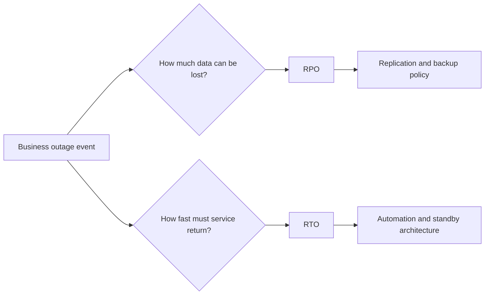

| Tier | Description | Typical RTO | Typical cost |
|---|---|---|---|
| Cold standby | Backups and templates only | Hours to days | Low |
| Warm standby | Replicated data and partial standby environment | Tens of minutes to hours | Medium |
| Hot standby | Fully ready secondary environment | Seconds to minutes | High |
| Active-active | Both regions serve traffic | Seconds | Highest |

- Azure Site Recovery protects VM-based workloads and orchestrates failover.
- Azure Backup protects VMs, databases, files, and selected storage data.
- Good DR requires DNS, certificates, secrets, and automation to be included in the design.
- Runbooks must include named owners and validation steps, not just architecture diagrams.

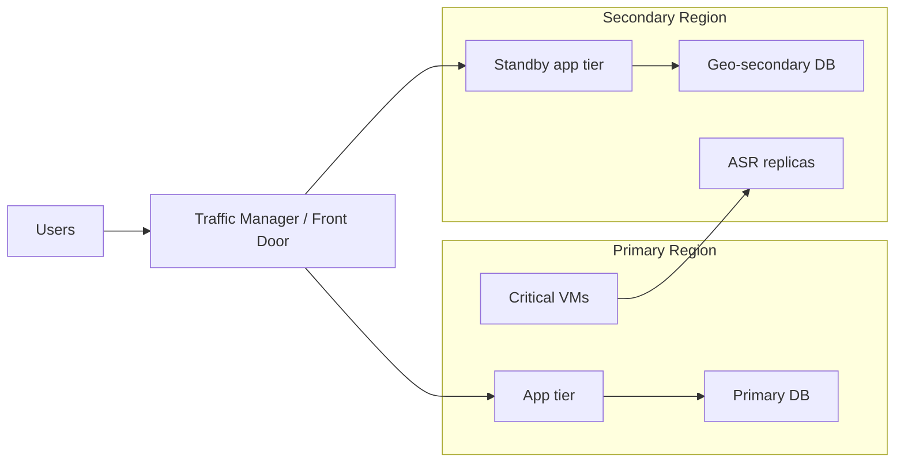

```hcl
resource "azurerm_resource_group" "dr" {
  name     = "rg-dr-core"
  location = "East US"
}

resource "azurerm_recovery_services_vault" "vault" {
  name                = "rsv-prod-dr-01"
  location            = azurerm_resource_group.dr.location
  resource_group_name = azurerm_resource_group.dr.name
  sku                 = "Standard"
  soft_delete_enabled = true
}
```

---

## 2. VM Disaster Recovery with Azure Site Recovery
1. Create a Recovery Services vault and choose the source/target regions.
2. Prepare source and target networking, including an isolated test-failover network.
3. Enable replication for each protected VM and verify replication health.
4. Create recovery plans that group boot order and automation actions.
5. Run test failover drills regularly and capture evidence.

```bash
export RG=rg-prod-dr
export VAULT=rsv-prod-dr-01
export LOCATION=eastus

az group create --name $RG --location $LOCATION
az backup vault create --resource-group $RG --name $VAULT --location $LOCATION
az backup vault backup-properties set       --name $VAULT       --resource-group $RG       --backup-storage-redundancy GeoRedundant
az site-recovery fabric list --resource-group $RG --vault-name $VAULT
```

### Recovery plans
- Group VMs by startup dependency order: identity, database, middleware, then web.
- Add manual approval and automation tasks where production traffic or DNS is affected.
- Keep separate plans for test failover and production failover if needed.

### Test failover (DR drill)
1. Declare the drill and open the bridge call.
2. Trigger test failover to the isolated DR network.
3. Validate boot, app health, DB reachability, and operator access.
4. Export evidence and clean up the test environment.

```bash
az site-recovery recovery-plan test-failover       --resource-group $RG       --vault-name $VAULT       --name rp-prod-app       --direction PrimaryToRecovery       --network-id /subscriptions/<subscription-id>/resourceGroups/rg-dr-network/providers/Microsoft.Network/virtualNetworks/vnet-dr-test
```

### Planned failover for maintenance
```bash
az site-recovery recovery-plan planned-failover       --resource-group $RG       --vault-name $VAULT       --name rp-prod-app       --direction PrimaryToRecovery
```

### Unplanned failover for actual disaster
```bash
az site-recovery recovery-plan unplanned-failover       --resource-group $RG       --vault-name $VAULT       --name rp-prod-app       --direction PrimaryToRecovery
```

### Failback after recovery
```bash
az site-recovery recovery-plan reprotect       --resource-group $RG       --vault-name $VAULT       --name rp-prod-app

az site-recovery recovery-plan planned-failover       --resource-group $RG       --vault-name $VAULT       --name rp-prod-app       --direction RecoveryToPrimary
```

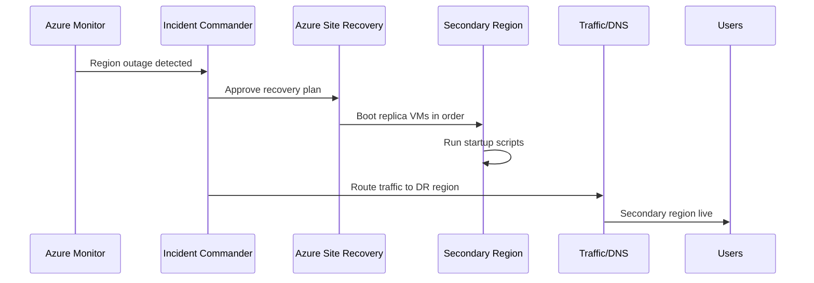

```text
$ az site-recovery recovery-plan test-failover --resource-group rg-prod-dr --vault-name rsv-prod-dr-01 --name rp-prod-app
{
  "name": "rp-prod-app",
  "properties": {
    "state": "Started"
  }
}
```

```hcl
resource "azurerm_site_recovery_fabric" "primary" {
  name                = "eastus-fabric"
  resource_group_name = azurerm_resource_group.dr.name
  recovery_vault_name = azurerm_recovery_services_vault.vault.name
  location            = azurerm_resource_group.dr.location
}
```

---

## 3. Azure Backup Setup
- Use policy-based backups for VMs so retention and schedules stay consistent.
- Enable long-term retention for Azure SQL where compliance requires it.
- Use MARS agent for file/folder backup when workload-level protection is needed on Windows servers.
- Protect storage with soft delete, versioning, and immutable controls where relevant.

```bash
az backup vault create --resource-group rg-prod-dr --name rsv-prod-dr-01 --location eastus
az backup protection enable-for-vm       --resource-group rg-app-prod       --vault-name rsv-prod-dr-01       --vm vm-app-prod-01       --policy-name DefaultPolicy
az sql db ltr-policy set       --resource-group rg-data-prod       --server azsql-sales-prod-01       --database salesdb       --weekly-retention P12W       --monthly-retention P12M       --yearly-retention P5Y       --week-of-year 16
```

| Restore type | Use case | Validation |
|---|---|---|
| Full VM restore | Critical VM loss or corruption | Boot VM and run app health checks |
| Individual file restore | Deleted config or script | Compare checksum and service behavior |
| SQL point-in-time restore | Logical corruption | Validate recovered rows before swap |
| Blob/object recovery | Accidental delete or ransomware rollback | Confirm version and access path |

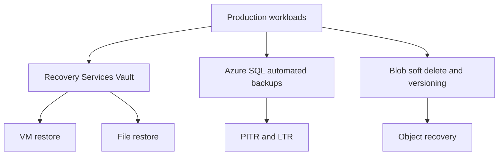

```hcl
resource "azurerm_backup_policy_vm" "critical" {
  name                = "vm-critical-daily"
  resource_group_name = azurerm_resource_group.dr.name
  recovery_vault_name = azurerm_recovery_services_vault.vault.name

  backup {
    frequency = "Daily"
    time      = "23:00"
  }

  retention_daily {
    count = 30
  }
}
```

```text
$ az backup protection enable-for-vm --resource-group rg-app-prod --vault-name rsv-prod-dr-01 --vm vm-app-prod-01 --policy-name DefaultPolicy
{
  "policyName": "DefaultPolicy",
  "protectionState": "Protected"
}
```

---

## 4. Multi-Region HA Architecture
- Use Traffic Manager for active-passive patterns when one region is primary and one is standby.
- Use Front Door for active-active global traffic distribution.
- Combine app failover with geo-replicated databases and geo-redundant storage.
- Remember that data replication alone is not equivalent to full application failover readiness.

```bash
az network traffic-manager profile create       --resource-group rg-network-prod       --name tm-app-prod       --routing-method Priority       --unique-dns-name app-prod-global       --ttl 30

az afd profile create       --resource-group rg-network-prod       --profile-name afd-app-prod       --sku Premium_AzureFrontDoor
```

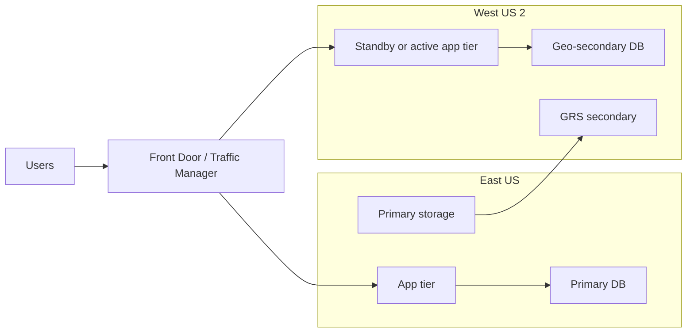

| Requirement | Pattern |
|---|---|
| Lower cost with longer failover | Active-passive |
| Fastest failover | Active-active |
| Global users at edge | Front Door |
| Simple priority failover | Traffic Manager |

---

## 5. Production Incident Response Scenarios (8+)

### Scenario 1: Primary region goes down — full region failover walkthrough
#### Impact
- Primary region unavailable.
- User traffic and control-plane operations impacted.

#### Detection
- Service Health alert fires.
- Synthetic probes fail from multiple geographies.

#### Response
1. Declare Sev1 and open DR bridge.
2. Run failover for app, database, and routing in the documented order.

#### Commands
```bash
az network traffic-manager endpoint update --resource-group rg-network-prod --profile-name tm-app-prod --name eastus-primary --type azureEndpoints --endpoint-status Disabled
az network traffic-manager endpoint update --resource-group rg-network-prod --profile-name tm-app-prod --name westus2-secondary --type azureEndpoints --endpoint-status Enabled
az site-recovery recovery-plan unplanned-failover --resource-group rg-prod-dr --vault-name rsv-prod-dr-01 --name rp-prod-app --direction PrimaryToRecovery
```

#### Recovery
- Validate app, login, payment, and DB writes in the secondary region.

#### Post-mortem
- Record actual RTO and improvement items.

#### Mermaid diagram
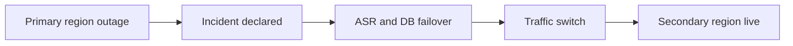

#### Evidence to capture
- Start time, declaration time, and service restoration time.
- CLI output, screenshots, incident IDs.
- Customer and business validation notes.

### Scenario 2: Database corruption — point-in-time restore
#### Impact
- Critical tables are corrupted or deleted.
- Application may still run but returns bad data.

#### Detection
- Application errors spike.
- DBA validation queries detect drift.

#### Response
1. Stop harmful writes.
2. Restore to a new database and validate before swap.

#### Commands
```bash
az sql db restore           --dest-name salesdb-restore-20250603           --edition GeneralPurpose           --name salesdb           --resource-group rg-data-prod           --server azsql-sales-prod-01           --time "2025-06-03T10:15:00Z"
```

#### Recovery
- Compare restored copy with business-validated good state.

#### Post-mortem
- Review access, controls, and alerting gaps.

#### Mermaid diagram
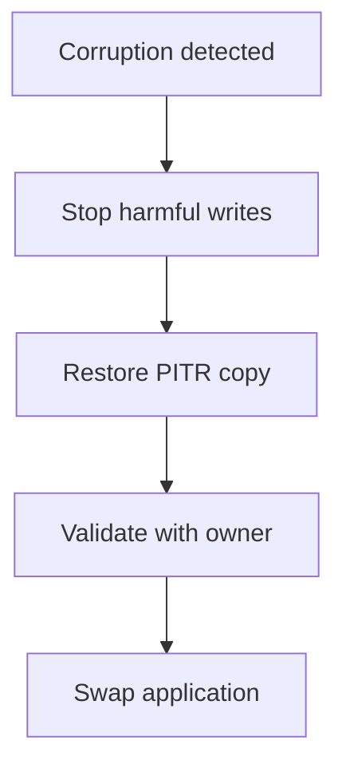

#### Evidence to capture
- Start time, declaration time, and service restoration time.
- CLI output, screenshots, incident IDs.
- Customer and business validation notes.

### Scenario 3: Ransomware attack — immutable backup restore
#### Impact
- Files or VMs may be encrypted.
- There is risk of backup tampering attempts.

#### Detection
- Security tooling flags ransomware patterns.
- Backup deletion attempts appear in logs.

#### Response
1. Quarantine affected systems.
2. Restore only from trusted immutable restore points in isolation.

#### Commands
```bash
az backup recoverypoint list --resource-group rg-prod-dr --vault-name rsv-prod-dr-01 --container-name IaasVMContainer;iaasvmcontainerv2;rg-app-prod;vm-app-prod-01 --item-name vm-app-prod-01
az vm nic update --resource-group rg-app-prod --vm-name vm-app-prod-01 --network-security-group nsg-quarantine
```

#### Recovery
- Restore to clean infrastructure and rotate secrets/certs.

#### Post-mortem
- Document attack path and control failures.

#### Mermaid diagram
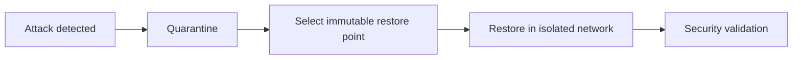

#### Evidence to capture
- Start time, declaration time, and service restoration time.
- CLI output, screenshots, incident IDs.
- Customer and business validation notes.

### Scenario 4: Accidental VM deletion — recovery from backup
#### Impact
- A production VM is deleted.
- Capacity or service availability drops.

#### Detection
- Activity Log alert on delete.
- Health probes fail.

#### Response
1. Determine whether the VM is stateless or stateful.
2. Restore from backup or recreate from image.

#### Commands
```bash
az monitor activity-log alert create --name vm-delete-alert --resource-group rg-monitoring --scopes /subscriptions/<subscription-id> --condition category=Administrative and operationName=Microsoft.Compute/virtualMachines/delete
az backup restore restore-disks --resource-group rg-prod-dr --vault-name rsv-prod-dr-01 --container-name IaasVMContainer;iaasvmcontainerv2;rg-app-prod;vm-app-prod-01 --item-name vm-app-prod-01 --rp-name <recovery-point-id> --storage-account strestoreprod01
```

#### Recovery
- Boot the VM and restore network attachments.

#### Post-mortem
- Add locks and tighten RBAC if needed.

#### Mermaid diagram
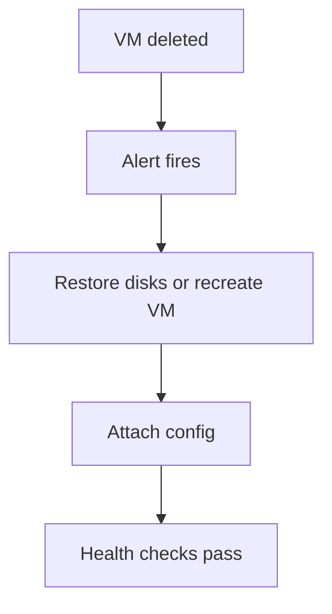

#### Evidence to capture
- Start time, declaration time, and service restoration time.
- CLI output, screenshots, incident IDs.
- Customer and business validation notes.

### Scenario 5: SSL certificate expiry — emergency renewal
#### Impact
- Clients cannot establish trusted TLS sessions.
- Service looks down even if compute is healthy.

#### Detection
- TLS probe failure alerts.
- Certificate-expiry alert or browser warnings.

#### Response
1. Import the renewed certificate.
2. Update gateway, ingress, or Key Vault references immediately.

#### Commands
```bash
az keyvault certificate import --vault-name kv-prod-shared --name app-prod-cert --file ./app-prod-renewed.pfx --password '<PfxPassword>'
az network application-gateway ssl-cert update --resource-group rg-network-prod --gateway-name agw-prod --name tls-app-prod --cert-file ./app-prod-renewed.pfx --cert-password '<PfxPassword>'
```

#### Recovery
- Validate full certificate chain and SNI bindings.

#### Post-mortem
- Add stronger rotation alerts and ownership checks.

#### Mermaid diagram
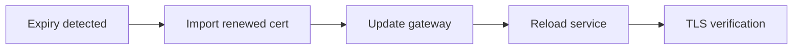

#### Evidence to capture
- Start time, declaration time, and service restoration time.
- CLI output, screenshots, incident IDs.
- Customer and business validation notes.

### Scenario 6: Storage account accidentally deleted — soft delete recovery
#### Impact
- Apps lose access to blobs, queues, or files.
- Dependent workloads degrade immediately.

#### Detection
- Deletion event in Activity Log.
- Application errors and storage alerts fire.

#### Response
1. Check deleted-account inventory.
2. Restore the storage account or recover data to a new account.

#### Commands
```bash
az storage account list-deleted
az storage account restore --deleted-account-name stappprod01 --resource-group rg-storage-prod
```

#### Recovery
- Validate ACLs, private endpoints, and app access after restore.

#### Post-mortem
- Review resource locks and soft-delete coverage.

#### Mermaid diagram
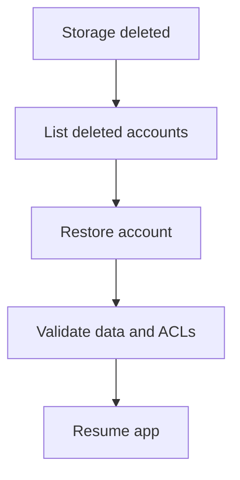

#### Evidence to capture
- Start time, declaration time, and service restoration time.
- CLI output, screenshots, incident IDs.
- Customer and business validation notes.

### Scenario 7: AKS cluster failure — pod rescheduling and node recovery
#### Impact
- Pods are unschedulable or unhealthy.
- APIs begin returning errors.

#### Detection
- Node NotReady alerts.
- Ingress and synthetic checks fail.

#### Response
1. Scale or repair node pools.
2. Fail over traffic to a secondary cluster if recovery exceeds RTO.

#### Commands
```bash
az aks nodepool scale --resource-group rg-aks-prod --cluster-name aks-prod --name systempool --node-count 6
kubectl get nodes
kubectl get pods -A
kubectl drain aks-nodepool1-12345678-vmss000001 --ignore-daemonsets --delete-emptydir-data
```

#### Recovery
- Validate replicas, ingress, and persistent volume health.

#### Post-mortem
- Review PDBs, autoscaling, and secondary-cluster readiness.

#### Mermaid diagram
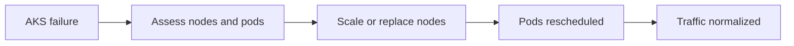

#### Evidence to capture
- Start time, declaration time, and service restoration time.
- CLI output, screenshots, incident IDs.
- Customer and business validation notes.

### Scenario 8: Network outage — failover to secondary region
#### Impact
- Primary path is degraded or unreachable.
- Services may be running but cannot be reached.

#### Detection
- Connection monitors fail.
- Resource Health shows networking degradation.

#### Response
1. Confirm scope and trigger edge failover if needed.
2. Preserve evidence for network post-mortem.

#### Commands
```bash
az network watcher connection-monitor show --resource-group rg-network-prod --location eastus --name cm-prod-edge
az afd endpoint enable --resource-group rg-network-prod --profile-name afd-app-prod --endpoint-name westus2-endpoint
az afd endpoint disable --resource-group rg-network-prod --profile-name afd-app-prod --endpoint-name eastus-endpoint
```

#### Recovery
- Validate north-south and east-west traffic paths in the DR region.

#### Post-mortem
- Improve probe fidelity and routing automation where needed.

#### Mermaid diagram
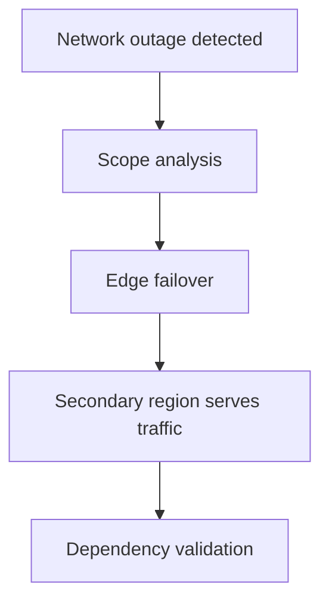

#### Evidence to capture
- Start time, declaration time, and service restoration time.
- CLI output, screenshots, incident IDs.
- Customer and business validation notes.

---

## 6. Production Maintenance Operations
1. Freeze unrelated changes and validate backups before the window opens.
2. Run pre-checks for app health, replication, and alerting.
3. Execute approved changes in order and record exact timestamps.
4. Run post-change smoke tests and obtain owner sign-off.

```bash
az maintenance configuration create       --resource-group rg-ops       --resource-name mc-prod-linux-weekly       --maintenance-scope InGuestPatch       --location eastus       --maintenance-window-duration "03:00"       --maintenance-window-recur-every "Week Saturday"

az keyvault secret set --vault-name kv-prod-shared --name sql-admin-password --value '<NewPassword>'
az vm auto-shutdown -g rg-dev --name vm-dev-01 --time 1900
```

- Track certificate rotation with Key Vault policies and alerts.
- Use vertical and horizontal scaling plans with rollback steps.
- Reduce off-hours cost with auto-shutdown and scale-in where safe.

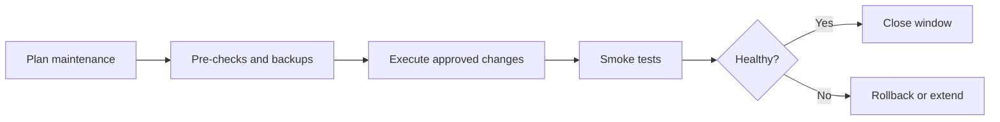

---

## 7. Monitoring & Alerting for Production
| Signal | Example threshold | Action |
|---|---|---|
| VM down | Heartbeat missing for 5 minutes | Page ops team |
| Disk full | Free space < 10% | Clean up or scale storage |
| High CPU | CPU > 85% for 15 minutes | Scale or investigate process |
| DB connection failures | App errors + DB login failures | Validate DB and secrets |
| Backup failure | Any critical backup job fails | Create priority incident |
| Certificate expiry | < 30 days | Start renewal workflow |
| ASR replication unhealthy | Protected item health degraded | Escalate DR readiness issue |

```bash
az monitor activity-log alert create       --name service-health-prod       --resource-group rg-monitoring       --scopes /subscriptions/<subscription-id>       --condition category=ServiceHealth
```

- Use Resource Health alongside application synthetic checks.
- Wire alerts to action groups and incident-management systems.
- Automate low-risk, repetitive remediation steps with runbooks.

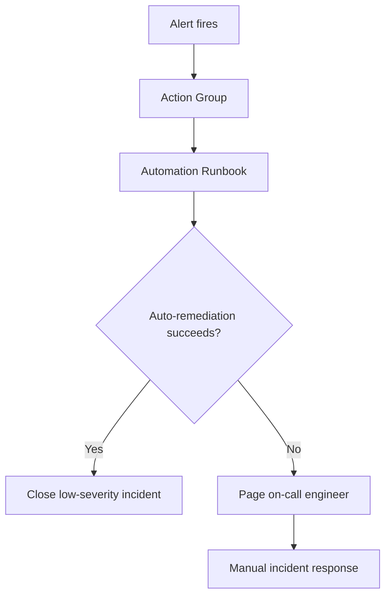

```text
$ az monitor activity-log alert create --name service-health-prod --resource-group rg-monitoring --scopes /subscriptions/00000000-0000-0000-0000-000000000000 --condition category=ServiceHealth
{
  "enabled": true,
  "name": "service-health-prod"
}
```

---

## 8. DR Testing & Compliance
- Run DR drills with realistic business validation steps, not just infrastructure boot checks.
- Capture RTO, RPO, automation gaps, and missing permissions during each exercise.
- Map the evidence to the compliance framework that governs the workload.

| Framework | Typical DR concern | Evidence example |
|---|---|---|
| SOC 2 | Availability and change control | Drill reports, backup logs, incident records |
| ISO 27001 | Business continuity controls | BCP/DR policy, test evidence, access review |
| HIPAA | Availability of regulated systems | Restore evidence, encryption and backup logs |
| PCI DSS | Payment system resilience | Segmentation evidence, failover records, access logs |

1. Document system overview and business criticality.
2. Record RPO/RTO approvals from business and technology owners.
3. Maintain failover and restore runbooks with command examples.
4. Run post-drill reviews and assign owners for all findings.

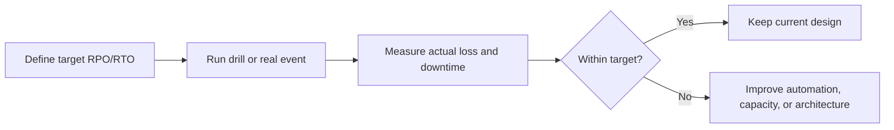

---

## Appendix A. Common Variables
```bash
export SUBSCRIPTION_ID=<subscription-id>
export RG=rg-prod-dr
export VAULT=rsv-prod-dr-01
export LOCATION=eastus
export RECOVERY_LOCATION=westus2
export TM_PROFILE=tm-app-prod
export FD_PROFILE=afd-app-prod
```

## Appendix B. Runbook Templates
1. Incident commander assigned.
2. Scribe assigned.
3. Business owner present.
4. Technical leads for app, DB, network, security, and platform are present.
5. Status-update cadence agreed.

- Customer impact summary: ____________________
- Actions in progress: ________________________
- Next update time: ___________________________
- Current service status: _____________________

## Appendix C. Verification Outputs
```text
$ az network traffic-manager profile create --resource-group rg-network-prod --name tm-app-prod --routing-method Priority --unique-dns-name app-prod-global --ttl 30
{
  "name": "tm-app-prod",
  "profileStatus": "Enabled",
  "trafficRoutingMethod": "Priority"
}
```

## Appendix D. Quick FAQ
### Q: How often should we run a DR drill?
Quarterly for mission-critical systems is a common operating target.

### Q: Is backup the same as DR?
No. Backup protects data; DR restores service availability across the whole stack.

### Q: What is the most common DR gap?
Untested dependencies such as DNS, secrets, certificates, or third-party integrations.

### Q: Should we fail back immediately?
Not automatically. Stabilize the original region first and pick a controlled window.

### Q: What should be automated first?
Detection, notification, health checks, and repetitive low-risk actions.

### Q: How do we prove compliance?
Retain drill evidence, backup logs, access records, and tracked remediation items.

## Appendix E. Drill Checklist Matrix
### People
- [ ] Incident commander ready
- [ ] Business approver ready
- [ ] Comms lead ready
- [ ] Vendor contact ready
- [ ] Security lead ready

### Platform
- [ ] Secondary quotas checked
- [ ] Secondary secrets current
- [ ] Certificates valid
- [ ] Backups healthy
- [ ] Dashboards current

### Traffic
- [ ] TTL lowered
- [ ] Health probes validated
- [ ] Traffic Manager ready
- [ ] Front Door ready
- [ ] DNS rollback documented

### Validation
- [ ] Synthetic tests ready
- [ ] DB validation scripts ready
- [ ] App smoke tests ready
- [ ] Monitoring queries ready
- [ ] Post-drill template ready

## Appendix F. Incident Command Master Checklist
### Declare
- [ ] Open bridge call.
- [ ] Assign incident commander.
- [ ] Assign scribe.
- [ ] Confirm severity level.
- [ ] Confirm affected workloads.
- [ ] Page application owner.
- [ ] Page database owner.
- [ ] Page network owner.
- [ ] Page security owner.
- [ ] Freeze unrelated changes.
- [ ] Create status page draft.
- [ ] Confirm next update cadence.

### Stabilize
- [ ] Collect service health data.
- [ ] Collect monitor alerts.
- [ ] Confirm blast radius.
- [ ] Stop harmful automation.
- [ ] Preserve evidence.
- [ ] Validate backup integrity.
- [ ] Validate replica health.
- [ ] Confirm DNS control access.
- [ ] Confirm Key Vault access.
- [ ] Review last successful deployment.
- [ ] Review recent change list.
- [ ] Confirm customer support briefing.

### Recover
- [ ] Choose failover or restore path.
- [ ] Validate dependencies in secondary region.
- [ ] Run approved commands only.
- [ ] Track exact timestamps.
- [ ] Validate health probes.
- [ ] Run synthetic tests.
- [ ] Validate database connectivity.
- [ ] Validate secret references.
- [ ] Validate certificates.
- [ ] Validate queue workers.
- [ ] Validate observability signals.
- [ ] Obtain business sign-off.

### Communicate
- [ ] Send internal update.
- [ ] Send customer update if required.
- [ ] Update incident record.
- [ ] Record ETA confidence.
- [ ] Document unknowns.
- [ ] Document workaround status.
- [ ] Record impacted regions.
- [ ] Record impacted products.
- [ ] Record support-desk instructions.
- [ ] Record next checkpoint.
- [ ] Record executive summary.
- [ ] Archive communication links.

### Close
- [ ] Confirm recovery complete.
- [ ] Capture actual RTO.
- [ ] Capture actual RPO.
- [ ] Confirm post-incident owner list.
- [ ] Schedule post-mortem.
- [ ] Assign remediation tasks.
- [ ] Link evidence pack.
- [ ] Update runbooks.
- [ ] Update dashboards if needed.
- [ ] Update on-call notes.
- [ ] Confirm support closure.
- [ ] Close incident formally.

## Appendix G. Scenario Drill Timeline Library
### Region failover
#### T-14 days
- Review owners and approvals for Region failover.
- Validate scripts and access required for Region failover.
- Capture evidence expectations for Region failover.
- Record communications needed at T-14 days for Region failover.

#### T-7 days
- Review owners and approvals for Region failover.
- Validate scripts and access required for Region failover.
- Capture evidence expectations for Region failover.
- Record communications needed at T-7 days for Region failover.

#### T-1 day
- Review owners and approvals for Region failover.
- Validate scripts and access required for Region failover.
- Capture evidence expectations for Region failover.
- Record communications needed at T-1 day for Region failover.

#### T-4 hours
- Review owners and approvals for Region failover.
- Validate scripts and access required for Region failover.
- Capture evidence expectations for Region failover.
- Record communications needed at T-4 hours for Region failover.

#### T-30 min
- Review owners and approvals for Region failover.
- Validate scripts and access required for Region failover.
- Capture evidence expectations for Region failover.
- Record communications needed at T-30 min for Region failover.

#### T-10 min
- Review owners and approvals for Region failover.
- Validate scripts and access required for Region failover.
- Capture evidence expectations for Region failover.
- Record communications needed at T-10 min for Region failover.

#### T+0
- Review owners and approvals for Region failover.
- Validate scripts and access required for Region failover.
- Capture evidence expectations for Region failover.
- Record communications needed at T+0 for Region failover.

#### T+15 min
- Review owners and approvals for Region failover.
- Validate scripts and access required for Region failover.
- Capture evidence expectations for Region failover.
- Record communications needed at T+15 min for Region failover.

#### T+1 hour
- Review owners and approvals for Region failover.
- Validate scripts and access required for Region failover.
- Capture evidence expectations for Region failover.
- Record communications needed at T+1 hour for Region failover.

#### T+4 hours
- Review owners and approvals for Region failover.
- Validate scripts and access required for Region failover.
- Capture evidence expectations for Region failover.
- Record communications needed at T+4 hours for Region failover.

#### T+1 day
- Review owners and approvals for Region failover.
- Validate scripts and access required for Region failover.
- Capture evidence expectations for Region failover.
- Record communications needed at T+1 day for Region failover.

#### T+1 week
- Review owners and approvals for Region failover.
- Validate scripts and access required for Region failover.
- Capture evidence expectations for Region failover.
- Record communications needed at T+1 week for Region failover.

### Database PITR
#### T-14 days
- Review owners and approvals for Database PITR.
- Validate scripts and access required for Database PITR.
- Capture evidence expectations for Database PITR.
- Record communications needed at T-14 days for Database PITR.

#### T-7 days
- Review owners and approvals for Database PITR.
- Validate scripts and access required for Database PITR.
- Capture evidence expectations for Database PITR.
- Record communications needed at T-7 days for Database PITR.

#### T-1 day
- Review owners and approvals for Database PITR.
- Validate scripts and access required for Database PITR.
- Capture evidence expectations for Database PITR.
- Record communications needed at T-1 day for Database PITR.

#### T-4 hours
- Review owners and approvals for Database PITR.
- Validate scripts and access required for Database PITR.
- Capture evidence expectations for Database PITR.
- Record communications needed at T-4 hours for Database PITR.

#### T-30 min
- Review owners and approvals for Database PITR.
- Validate scripts and access required for Database PITR.
- Capture evidence expectations for Database PITR.
- Record communications needed at T-30 min for Database PITR.

#### T-10 min
- Review owners and approvals for Database PITR.
- Validate scripts and access required for Database PITR.
- Capture evidence expectations for Database PITR.
- Record communications needed at T-10 min for Database PITR.

#### T+0
- Review owners and approvals for Database PITR.
- Validate scripts and access required for Database PITR.
- Capture evidence expectations for Database PITR.
- Record communications needed at T+0 for Database PITR.

#### T+15 min
- Review owners and approvals for Database PITR.
- Validate scripts and access required for Database PITR.
- Capture evidence expectations for Database PITR.
- Record communications needed at T+15 min for Database PITR.

#### T+1 hour
- Review owners and approvals for Database PITR.
- Validate scripts and access required for Database PITR.
- Capture evidence expectations for Database PITR.
- Record communications needed at T+1 hour for Database PITR.

#### T+4 hours
- Review owners and approvals for Database PITR.
- Validate scripts and access required for Database PITR.
- Capture evidence expectations for Database PITR.
- Record communications needed at T+4 hours for Database PITR.

#### T+1 day
- Review owners and approvals for Database PITR.
- Validate scripts and access required for Database PITR.
- Capture evidence expectations for Database PITR.
- Record communications needed at T+1 day for Database PITR.

#### T+1 week
- Review owners and approvals for Database PITR.
- Validate scripts and access required for Database PITR.
- Capture evidence expectations for Database PITR.
- Record communications needed at T+1 week for Database PITR.

### Ransomware restore
#### T-14 days
- Review owners and approvals for Ransomware restore.
- Validate scripts and access required for Ransomware restore.
- Capture evidence expectations for Ransomware restore.
- Record communications needed at T-14 days for Ransomware restore.

#### T-7 days
- Review owners and approvals for Ransomware restore.
- Validate scripts and access required for Ransomware restore.
- Capture evidence expectations for Ransomware restore.
- Record communications needed at T-7 days for Ransomware restore.

#### T-1 day
- Review owners and approvals for Ransomware restore.
- Validate scripts and access required for Ransomware restore.
- Capture evidence expectations for Ransomware restore.
- Record communications needed at T-1 day for Ransomware restore.

#### T-4 hours
- Review owners and approvals for Ransomware restore.
- Validate scripts and access required for Ransomware restore.
- Capture evidence expectations for Ransomware restore.
- Record communications needed at T-4 hours for Ransomware restore.

#### T-30 min
- Review owners and approvals for Ransomware restore.
- Validate scripts and access required for Ransomware restore.
- Capture evidence expectations for Ransomware restore.
- Record communications needed at T-30 min for Ransomware restore.

#### T-10 min
- Review owners and approvals for Ransomware restore.
- Validate scripts and access required for Ransomware restore.
- Capture evidence expectations for Ransomware restore.
- Record communications needed at T-10 min for Ransomware restore.

#### T+0
- Review owners and approvals for Ransomware restore.
- Validate scripts and access required for Ransomware restore.
- Capture evidence expectations for Ransomware restore.
- Record communications needed at T+0 for Ransomware restore.

#### T+15 min
- Review owners and approvals for Ransomware restore.
- Validate scripts and access required for Ransomware restore.
- Capture evidence expectations for Ransomware restore.
- Record communications needed at T+15 min for Ransomware restore.

#### T+1 hour
- Review owners and approvals for Ransomware restore.
- Validate scripts and access required for Ransomware restore.
- Capture evidence expectations for Ransomware restore.
- Record communications needed at T+1 hour for Ransomware restore.

#### T+4 hours
- Review owners and approvals for Ransomware restore.
- Validate scripts and access required for Ransomware restore.
- Capture evidence expectations for Ransomware restore.
- Record communications needed at T+4 hours for Ransomware restore.

#### T+1 day
- Review owners and approvals for Ransomware restore.
- Validate scripts and access required for Ransomware restore.
- Capture evidence expectations for Ransomware restore.
- Record communications needed at T+1 day for Ransomware restore.

#### T+1 week
- Review owners and approvals for Ransomware restore.
- Validate scripts and access required for Ransomware restore.
- Capture evidence expectations for Ransomware restore.
- Record communications needed at T+1 week for Ransomware restore.

### VM deletion recovery
#### T-14 days
- Review owners and approvals for VM deletion recovery.
- Validate scripts and access required for VM deletion recovery.
- Capture evidence expectations for VM deletion recovery.
- Record communications needed at T-14 days for VM deletion recovery.

#### T-7 days
- Review owners and approvals for VM deletion recovery.
- Validate scripts and access required for VM deletion recovery.
- Capture evidence expectations for VM deletion recovery.
- Record communications needed at T-7 days for VM deletion recovery.

#### T-1 day
- Review owners and approvals for VM deletion recovery.
- Validate scripts and access required for VM deletion recovery.
- Capture evidence expectations for VM deletion recovery.
- Record communications needed at T-1 day for VM deletion recovery.

#### T-4 hours
- Review owners and approvals for VM deletion recovery.
- Validate scripts and access required for VM deletion recovery.
- Capture evidence expectations for VM deletion recovery.
- Record communications needed at T-4 hours for VM deletion recovery.

#### T-30 min
- Review owners and approvals for VM deletion recovery.
- Validate scripts and access required for VM deletion recovery.
- Capture evidence expectations for VM deletion recovery.
- Record communications needed at T-30 min for VM deletion recovery.

#### T-10 min
- Review owners and approvals for VM deletion recovery.
- Validate scripts and access required for VM deletion recovery.
- Capture evidence expectations for VM deletion recovery.
- Record communications needed at T-10 min for VM deletion recovery.

#### T+0
- Review owners and approvals for VM deletion recovery.
- Validate scripts and access required for VM deletion recovery.
- Capture evidence expectations for VM deletion recovery.
- Record communications needed at T+0 for VM deletion recovery.

#### T+15 min
- Review owners and approvals for VM deletion recovery.
- Validate scripts and access required for VM deletion recovery.
- Capture evidence expectations for VM deletion recovery.
- Record communications needed at T+15 min for VM deletion recovery.

#### T+1 hour
- Review owners and approvals for VM deletion recovery.
- Validate scripts and access required for VM deletion recovery.
- Capture evidence expectations for VM deletion recovery.
- Record communications needed at T+1 hour for VM deletion recovery.

#### T+4 hours
- Review owners and approvals for VM deletion recovery.
- Validate scripts and access required for VM deletion recovery.
- Capture evidence expectations for VM deletion recovery.
- Record communications needed at T+4 hours for VM deletion recovery.

#### T+1 day
- Review owners and approvals for VM deletion recovery.
- Validate scripts and access required for VM deletion recovery.
- Capture evidence expectations for VM deletion recovery.
- Record communications needed at T+1 day for VM deletion recovery.

#### T+1 week
- Review owners and approvals for VM deletion recovery.
- Validate scripts and access required for VM deletion recovery.
- Capture evidence expectations for VM deletion recovery.
- Record communications needed at T+1 week for VM deletion recovery.

### Certificate emergency renewal
#### T-14 days
- Review owners and approvals for Certificate emergency renewal.
- Validate scripts and access required for Certificate emergency renewal.
- Capture evidence expectations for Certificate emergency renewal.
- Record communications needed at T-14 days for Certificate emergency renewal.

#### T-7 days
- Review owners and approvals for Certificate emergency renewal.
- Validate scripts and access required for Certificate emergency renewal.
- Capture evidence expectations for Certificate emergency renewal.
- Record communications needed at T-7 days for Certificate emergency renewal.

#### T-1 day
- Review owners and approvals for Certificate emergency renewal.
- Validate scripts and access required for Certificate emergency renewal.
- Capture evidence expectations for Certificate emergency renewal.
- Record communications needed at T-1 day for Certificate emergency renewal.

#### T-4 hours
- Review owners and approvals for Certificate emergency renewal.
- Validate scripts and access required for Certificate emergency renewal.
- Capture evidence expectations for Certificate emergency renewal.
- Record communications needed at T-4 hours for Certificate emergency renewal.

#### T-30 min
- Review owners and approvals for Certificate emergency renewal.
- Validate scripts and access required for Certificate emergency renewal.
- Capture evidence expectations for Certificate emergency renewal.
- Record communications needed at T-30 min for Certificate emergency renewal.

#### T-10 min
- Review owners and approvals for Certificate emergency renewal.
- Validate scripts and access required for Certificate emergency renewal.
- Capture evidence expectations for Certificate emergency renewal.
- Record communications needed at T-10 min for Certificate emergency renewal.

#### T+0
- Review owners and approvals for Certificate emergency renewal.
- Validate scripts and access required for Certificate emergency renewal.
- Capture evidence expectations for Certificate emergency renewal.
- Record communications needed at T+0 for Certificate emergency renewal.

#### T+15 min
- Review owners and approvals for Certificate emergency renewal.
- Validate scripts and access required for Certificate emergency renewal.
- Capture evidence expectations for Certificate emergency renewal.
- Record communications needed at T+15 min for Certificate emergency renewal.

#### T+1 hour
- Review owners and approvals for Certificate emergency renewal.
- Validate scripts and access required for Certificate emergency renewal.
- Capture evidence expectations for Certificate emergency renewal.
- Record communications needed at T+1 hour for Certificate emergency renewal.

#### T+4 hours
- Review owners and approvals for Certificate emergency renewal.
- Validate scripts and access required for Certificate emergency renewal.
- Capture evidence expectations for Certificate emergency renewal.
- Record communications needed at T+4 hours for Certificate emergency renewal.

#### T+1 day
- Review owners and approvals for Certificate emergency renewal.
- Validate scripts and access required for Certificate emergency renewal.
- Capture evidence expectations for Certificate emergency renewal.
- Record communications needed at T+1 day for Certificate emergency renewal.

#### T+1 week
- Review owners and approvals for Certificate emergency renewal.
- Validate scripts and access required for Certificate emergency renewal.
- Capture evidence expectations for Certificate emergency renewal.
- Record communications needed at T+1 week for Certificate emergency renewal.

### Storage recovery
#### T-14 days
- Review owners and approvals for Storage recovery.
- Validate scripts and access required for Storage recovery.
- Capture evidence expectations for Storage recovery.
- Record communications needed at T-14 days for Storage recovery.

#### T-7 days
- Review owners and approvals for Storage recovery.
- Validate scripts and access required for Storage recovery.
- Capture evidence expectations for Storage recovery.
- Record communications needed at T-7 days for Storage recovery.

#### T-1 day
- Review owners and approvals for Storage recovery.
- Validate scripts and access required for Storage recovery.
- Capture evidence expectations for Storage recovery.
- Record communications needed at T-1 day for Storage recovery.

#### T-4 hours
- Review owners and approvals for Storage recovery.
- Validate scripts and access required for Storage recovery.
- Capture evidence expectations for Storage recovery.
- Record communications needed at T-4 hours for Storage recovery.

#### T-30 min
- Review owners and approvals for Storage recovery.
- Validate scripts and access required for Storage recovery.
- Capture evidence expectations for Storage recovery.
- Record communications needed at T-30 min for Storage recovery.

#### T-10 min
- Review owners and approvals for Storage recovery.
- Validate scripts and access required for Storage recovery.
- Capture evidence expectations for Storage recovery.
- Record communications needed at T-10 min for Storage recovery.

#### T+0
- Review owners and approvals for Storage recovery.
- Validate scripts and access required for Storage recovery.
- Capture evidence expectations for Storage recovery.
- Record communications needed at T+0 for Storage recovery.

#### T+15 min
- Review owners and approvals for Storage recovery.
- Validate scripts and access required for Storage recovery.
- Capture evidence expectations for Storage recovery.
- Record communications needed at T+15 min for Storage recovery.

#### T+1 hour
- Review owners and approvals for Storage recovery.
- Validate scripts and access required for Storage recovery.
- Capture evidence expectations for Storage recovery.
- Record communications needed at T+1 hour for Storage recovery.

#### T+4 hours
- Review owners and approvals for Storage recovery.
- Validate scripts and access required for Storage recovery.
- Capture evidence expectations for Storage recovery.
- Record communications needed at T+4 hours for Storage recovery.

#### T+1 day
- Review owners and approvals for Storage recovery.
- Validate scripts and access required for Storage recovery.
- Capture evidence expectations for Storage recovery.
- Record communications needed at T+1 day for Storage recovery.

#### T+1 week
- Review owners and approvals for Storage recovery.
- Validate scripts and access required for Storage recovery.
- Capture evidence expectations for Storage recovery.
- Record communications needed at T+1 week for Storage recovery.

### AKS cluster recovery
#### T-14 days
- Review owners and approvals for AKS cluster recovery.
- Validate scripts and access required for AKS cluster recovery.
- Capture evidence expectations for AKS cluster recovery.
- Record communications needed at T-14 days for AKS cluster recovery.

#### T-7 days
- Review owners and approvals for AKS cluster recovery.
- Validate scripts and access required for AKS cluster recovery.
- Capture evidence expectations for AKS cluster recovery.
- Record communications needed at T-7 days for AKS cluster recovery.

#### T-1 day
- Review owners and approvals for AKS cluster recovery.
- Validate scripts and access required for AKS cluster recovery.
- Capture evidence expectations for AKS cluster recovery.
- Record communications needed at T-1 day for AKS cluster recovery.

#### T-4 hours
- Review owners and approvals for AKS cluster recovery.
- Validate scripts and access required for AKS cluster recovery.
- Capture evidence expectations for AKS cluster recovery.
- Record communications needed at T-4 hours for AKS cluster recovery.

#### T-30 min
- Review owners and approvals for AKS cluster recovery.
- Validate scripts and access required for AKS cluster recovery.
- Capture evidence expectations for AKS cluster recovery.
- Record communications needed at T-30 min for AKS cluster recovery.

#### T-10 min
- Review owners and approvals for AKS cluster recovery.
- Validate scripts and access required for AKS cluster recovery.
- Capture evidence expectations for AKS cluster recovery.
- Record communications needed at T-10 min for AKS cluster recovery.

#### T+0
- Review owners and approvals for AKS cluster recovery.
- Validate scripts and access required for AKS cluster recovery.
- Capture evidence expectations for AKS cluster recovery.
- Record communications needed at T+0 for AKS cluster recovery.

#### T+15 min
- Review owners and approvals for AKS cluster recovery.
- Validate scripts and access required for AKS cluster recovery.
- Capture evidence expectations for AKS cluster recovery.
- Record communications needed at T+15 min for AKS cluster recovery.

#### T+1 hour
- Review owners and approvals for AKS cluster recovery.
- Validate scripts and access required for AKS cluster recovery.
- Capture evidence expectations for AKS cluster recovery.
- Record communications needed at T+1 hour for AKS cluster recovery.

#### T+4 hours
- Review owners and approvals for AKS cluster recovery.
- Validate scripts and access required for AKS cluster recovery.
- Capture evidence expectations for AKS cluster recovery.
- Record communications needed at T+4 hours for AKS cluster recovery.

#### T+1 day
- Review owners and approvals for AKS cluster recovery.
- Validate scripts and access required for AKS cluster recovery.
- Capture evidence expectations for AKS cluster recovery.
- Record communications needed at T+1 day for AKS cluster recovery.

#### T+1 week
- Review owners and approvals for AKS cluster recovery.
- Validate scripts and access required for AKS cluster recovery.
- Capture evidence expectations for AKS cluster recovery.
- Record communications needed at T+1 week for AKS cluster recovery.

### Network failover
#### T-14 days
- Review owners and approvals for Network failover.
- Validate scripts and access required for Network failover.
- Capture evidence expectations for Network failover.
- Record communications needed at T-14 days for Network failover.

#### T-7 days
- Review owners and approvals for Network failover.
- Validate scripts and access required for Network failover.
- Capture evidence expectations for Network failover.
- Record communications needed at T-7 days for Network failover.

#### T-1 day
- Review owners and approvals for Network failover.
- Validate scripts and access required for Network failover.
- Capture evidence expectations for Network failover.
- Record communications needed at T-1 day for Network failover.

#### T-4 hours
- Review owners and approvals for Network failover.
- Validate scripts and access required for Network failover.
- Capture evidence expectations for Network failover.
- Record communications needed at T-4 hours for Network failover.

#### T-30 min
- Review owners and approvals for Network failover.
- Validate scripts and access required for Network failover.
- Capture evidence expectations for Network failover.
- Record communications needed at T-30 min for Network failover.

#### T-10 min
- Review owners and approvals for Network failover.
- Validate scripts and access required for Network failover.
- Capture evidence expectations for Network failover.
- Record communications needed at T-10 min for Network failover.

#### T+0
- Review owners and approvals for Network failover.
- Validate scripts and access required for Network failover.
- Capture evidence expectations for Network failover.
- Record communications needed at T+0 for Network failover.

#### T+15 min
- Review owners and approvals for Network failover.
- Validate scripts and access required for Network failover.
- Capture evidence expectations for Network failover.
- Record communications needed at T+15 min for Network failover.

#### T+1 hour
- Review owners and approvals for Network failover.
- Validate scripts and access required for Network failover.
- Capture evidence expectations for Network failover.
- Record communications needed at T+1 hour for Network failover.

#### T+4 hours
- Review owners and approvals for Network failover.
- Validate scripts and access required for Network failover.
- Capture evidence expectations for Network failover.
- Record communications needed at T+4 hours for Network failover.

#### T+1 day
- Review owners and approvals for Network failover.
- Validate scripts and access required for Network failover.
- Capture evidence expectations for Network failover.
- Record communications needed at T+1 day for Network failover.

#### T+1 week
- Review owners and approvals for Network failover.
- Validate scripts and access required for Network failover.
- Capture evidence expectations for Network failover.
- Record communications needed at T+1 week for Network failover.

## Appendix H. Service Alert Catalog
### Virtual Machines
- Virtual Machines: configure and test alert for Availability.
- Virtual Machines: configure and test alert for Latency.
- Virtual Machines: configure and test alert for Authentication failures.
- Virtual Machines: configure and test alert for Capacity.
- Virtual Machines: configure and test alert for Backup health.
- Virtual Machines: configure and test alert for Replication health.
- Virtual Machines: configure and test alert for Configuration drift.
- Virtual Machines: configure and test alert for Certificate expiry.
- Virtual Machines: configure and test alert for Cost anomaly.
- Virtual Machines: configure and test alert for Security anomaly.

### Azure SQL
- Azure SQL: configure and test alert for Availability.
- Azure SQL: configure and test alert for Latency.
- Azure SQL: configure and test alert for Authentication failures.
- Azure SQL: configure and test alert for Capacity.
- Azure SQL: configure and test alert for Backup health.
- Azure SQL: configure and test alert for Replication health.
- Azure SQL: configure and test alert for Configuration drift.
- Azure SQL: configure and test alert for Certificate expiry.
- Azure SQL: configure and test alert for Cost anomaly.
- Azure SQL: configure and test alert for Security anomaly.

### Managed Instance
- Managed Instance: configure and test alert for Availability.
- Managed Instance: configure and test alert for Latency.
- Managed Instance: configure and test alert for Authentication failures.
- Managed Instance: configure and test alert for Capacity.
- Managed Instance: configure and test alert for Backup health.
- Managed Instance: configure and test alert for Replication health.
- Managed Instance: configure and test alert for Configuration drift.
- Managed Instance: configure and test alert for Certificate expiry.
- Managed Instance: configure and test alert for Cost anomaly.
- Managed Instance: configure and test alert for Security anomaly.

### MySQL Flexible Server
- MySQL Flexible Server: configure and test alert for Availability.
- MySQL Flexible Server: configure and test alert for Latency.
- MySQL Flexible Server: configure and test alert for Authentication failures.
- MySQL Flexible Server: configure and test alert for Capacity.
- MySQL Flexible Server: configure and test alert for Backup health.
- MySQL Flexible Server: configure and test alert for Replication health.
- MySQL Flexible Server: configure and test alert for Configuration drift.
- MySQL Flexible Server: configure and test alert for Certificate expiry.
- MySQL Flexible Server: configure and test alert for Cost anomaly.
- MySQL Flexible Server: configure and test alert for Security anomaly.

### PostgreSQL Flexible Server
- PostgreSQL Flexible Server: configure and test alert for Availability.
- PostgreSQL Flexible Server: configure and test alert for Latency.
- PostgreSQL Flexible Server: configure and test alert for Authentication failures.
- PostgreSQL Flexible Server: configure and test alert for Capacity.
- PostgreSQL Flexible Server: configure and test alert for Backup health.
- PostgreSQL Flexible Server: configure and test alert for Replication health.
- PostgreSQL Flexible Server: configure and test alert for Configuration drift.
- PostgreSQL Flexible Server: configure and test alert for Certificate expiry.
- PostgreSQL Flexible Server: configure and test alert for Cost anomaly.
- PostgreSQL Flexible Server: configure and test alert for Security anomaly.

### Storage Accounts
- Storage Accounts: configure and test alert for Availability.
- Storage Accounts: configure and test alert for Latency.
- Storage Accounts: configure and test alert for Authentication failures.
- Storage Accounts: configure and test alert for Capacity.
- Storage Accounts: configure and test alert for Backup health.
- Storage Accounts: configure and test alert for Replication health.
- Storage Accounts: configure and test alert for Configuration drift.
- Storage Accounts: configure and test alert for Certificate expiry.
- Storage Accounts: configure and test alert for Cost anomaly.
- Storage Accounts: configure and test alert for Security anomaly.

### App Service
- App Service: configure and test alert for Availability.
- App Service: configure and test alert for Latency.
- App Service: configure and test alert for Authentication failures.
- App Service: configure and test alert for Capacity.
- App Service: configure and test alert for Backup health.
- App Service: configure and test alert for Replication health.
- App Service: configure and test alert for Configuration drift.
- App Service: configure and test alert for Certificate expiry.
- App Service: configure and test alert for Cost anomaly.
- App Service: configure and test alert for Security anomaly.

### Application Gateway
- Application Gateway: configure and test alert for Availability.
- Application Gateway: configure and test alert for Latency.
- Application Gateway: configure and test alert for Authentication failures.
- Application Gateway: configure and test alert for Capacity.
- Application Gateway: configure and test alert for Backup health.
- Application Gateway: configure and test alert for Replication health.
- Application Gateway: configure and test alert for Configuration drift.
- Application Gateway: configure and test alert for Certificate expiry.
- Application Gateway: configure and test alert for Cost anomaly.
- Application Gateway: configure and test alert for Security anomaly.

### Front Door
- Front Door: configure and test alert for Availability.
- Front Door: configure and test alert for Latency.
- Front Door: configure and test alert for Authentication failures.
- Front Door: configure and test alert for Capacity.
- Front Door: configure and test alert for Backup health.
- Front Door: configure and test alert for Replication health.
- Front Door: configure and test alert for Configuration drift.
- Front Door: configure and test alert for Certificate expiry.
- Front Door: configure and test alert for Cost anomaly.
- Front Door: configure and test alert for Security anomaly.

### Traffic Manager
- Traffic Manager: configure and test alert for Availability.
- Traffic Manager: configure and test alert for Latency.
- Traffic Manager: configure and test alert for Authentication failures.
- Traffic Manager: configure and test alert for Capacity.
- Traffic Manager: configure and test alert for Backup health.
- Traffic Manager: configure and test alert for Replication health.
- Traffic Manager: configure and test alert for Configuration drift.
- Traffic Manager: configure and test alert for Certificate expiry.
- Traffic Manager: configure and test alert for Cost anomaly.
- Traffic Manager: configure and test alert for Security anomaly.

### Key Vault
- Key Vault: configure and test alert for Availability.
- Key Vault: configure and test alert for Latency.
- Key Vault: configure and test alert for Authentication failures.
- Key Vault: configure and test alert for Capacity.
- Key Vault: configure and test alert for Backup health.
- Key Vault: configure and test alert for Replication health.
- Key Vault: configure and test alert for Configuration drift.
- Key Vault: configure and test alert for Certificate expiry.
- Key Vault: configure and test alert for Cost anomaly.
- Key Vault: configure and test alert for Security anomaly.

### Recovery Services Vault
- Recovery Services Vault: configure and test alert for Availability.
- Recovery Services Vault: configure and test alert for Latency.
- Recovery Services Vault: configure and test alert for Authentication failures.
- Recovery Services Vault: configure and test alert for Capacity.
- Recovery Services Vault: configure and test alert for Backup health.
- Recovery Services Vault: configure and test alert for Replication health.
- Recovery Services Vault: configure and test alert for Configuration drift.
- Recovery Services Vault: configure and test alert for Certificate expiry.
- Recovery Services Vault: configure and test alert for Cost anomaly.
- Recovery Services Vault: configure and test alert for Security anomaly.

### Azure Site Recovery
- Azure Site Recovery: configure and test alert for Availability.
- Azure Site Recovery: configure and test alert for Latency.
- Azure Site Recovery: configure and test alert for Authentication failures.
- Azure Site Recovery: configure and test alert for Capacity.
- Azure Site Recovery: configure and test alert for Backup health.
- Azure Site Recovery: configure and test alert for Replication health.
- Azure Site Recovery: configure and test alert for Configuration drift.
- Azure Site Recovery: configure and test alert for Certificate expiry.
- Azure Site Recovery: configure and test alert for Cost anomaly.
- Azure Site Recovery: configure and test alert for Security anomaly.

### AKS
- AKS: configure and test alert for Availability.
- AKS: configure and test alert for Latency.
- AKS: configure and test alert for Authentication failures.
- AKS: configure and test alert for Capacity.
- AKS: configure and test alert for Backup health.
- AKS: configure and test alert for Replication health.
- AKS: configure and test alert for Configuration drift.
- AKS: configure and test alert for Certificate expiry.
- AKS: configure and test alert for Cost anomaly.
- AKS: configure and test alert for Security anomaly.

### Log Analytics
- Log Analytics: configure and test alert for Availability.
- Log Analytics: configure and test alert for Latency.
- Log Analytics: configure and test alert for Authentication failures.
- Log Analytics: configure and test alert for Capacity.
- Log Analytics: configure and test alert for Backup health.
- Log Analytics: configure and test alert for Replication health.
- Log Analytics: configure and test alert for Configuration drift.
- Log Analytics: configure and test alert for Certificate expiry.
- Log Analytics: configure and test alert for Cost anomaly.
- Log Analytics: configure and test alert for Security anomaly.

## Appendix I. Recovery Evidence Checklist Library
### VM workloads
- [ ] Collect Timing evidence for VM workloads.
- [ ] Collect CLI output for VM workloads.
- [ ] Collect Portal screenshot for VM workloads.
- [ ] Collect Health probe result for VM workloads.
- [ ] Collect Synthetic transaction result for VM workloads.
- [ ] Collect Backup or restore evidence for VM workloads.
- [ ] Collect DB validation result for VM workloads.
- [ ] Collect Routing or DNS proof for VM workloads.
- [ ] Collect Communication record for VM workloads.
- [ ] Collect Post-mortem note for VM workloads.

### Database workloads
- [ ] Collect Timing evidence for Database workloads.
- [ ] Collect CLI output for Database workloads.
- [ ] Collect Portal screenshot for Database workloads.
- [ ] Collect Health probe result for Database workloads.
- [ ] Collect Synthetic transaction result for Database workloads.
- [ ] Collect Backup or restore evidence for Database workloads.
- [ ] Collect DB validation result for Database workloads.
- [ ] Collect Routing or DNS proof for Database workloads.
- [ ] Collect Communication record for Database workloads.
- [ ] Collect Post-mortem note for Database workloads.

### Web applications
- [ ] Collect Timing evidence for Web applications.
- [ ] Collect CLI output for Web applications.
- [ ] Collect Portal screenshot for Web applications.
- [ ] Collect Health probe result for Web applications.
- [ ] Collect Synthetic transaction result for Web applications.
- [ ] Collect Backup or restore evidence for Web applications.
- [ ] Collect DB validation result for Web applications.
- [ ] Collect Routing or DNS proof for Web applications.
- [ ] Collect Communication record for Web applications.
- [ ] Collect Post-mortem note for Web applications.

### Containers
- [ ] Collect Timing evidence for Containers.
- [ ] Collect CLI output for Containers.
- [ ] Collect Portal screenshot for Containers.
- [ ] Collect Health probe result for Containers.
- [ ] Collect Synthetic transaction result for Containers.
- [ ] Collect Backup or restore evidence for Containers.
- [ ] Collect DB validation result for Containers.
- [ ] Collect Routing or DNS proof for Containers.
- [ ] Collect Communication record for Containers.
- [ ] Collect Post-mortem note for Containers.

### Storage services
- [ ] Collect Timing evidence for Storage services.
- [ ] Collect CLI output for Storage services.
- [ ] Collect Portal screenshot for Storage services.
- [ ] Collect Health probe result for Storage services.
- [ ] Collect Synthetic transaction result for Storage services.
- [ ] Collect Backup or restore evidence for Storage services.
- [ ] Collect DB validation result for Storage services.
- [ ] Collect Routing or DNS proof for Storage services.
- [ ] Collect Communication record for Storage services.
- [ ] Collect Post-mortem note for Storage services.

### Identity dependencies
- [ ] Collect Timing evidence for Identity dependencies.
- [ ] Collect CLI output for Identity dependencies.
- [ ] Collect Portal screenshot for Identity dependencies.
- [ ] Collect Health probe result for Identity dependencies.
- [ ] Collect Synthetic transaction result for Identity dependencies.
- [ ] Collect Backup or restore evidence for Identity dependencies.
- [ ] Collect DB validation result for Identity dependencies.
- [ ] Collect Routing or DNS proof for Identity dependencies.
- [ ] Collect Communication record for Identity dependencies.
- [ ] Collect Post-mortem note for Identity dependencies.

### Network edge
- [ ] Collect Timing evidence for Network edge.
- [ ] Collect CLI output for Network edge.
- [ ] Collect Portal screenshot for Network edge.
- [ ] Collect Health probe result for Network edge.
- [ ] Collect Synthetic transaction result for Network edge.
- [ ] Collect Backup or restore evidence for Network edge.
- [ ] Collect DB validation result for Network edge.
- [ ] Collect Routing or DNS proof for Network edge.
- [ ] Collect Communication record for Network edge.
- [ ] Collect Post-mortem note for Network edge.

### Messaging and queues
- [ ] Collect Timing evidence for Messaging and queues.
- [ ] Collect CLI output for Messaging and queues.
- [ ] Collect Portal screenshot for Messaging and queues.
- [ ] Collect Health probe result for Messaging and queues.
- [ ] Collect Synthetic transaction result for Messaging and queues.
- [ ] Collect Backup or restore evidence for Messaging and queues.
- [ ] Collect DB validation result for Messaging and queues.
- [ ] Collect Routing or DNS proof for Messaging and queues.
- [ ] Collect Communication record for Messaging and queues.
- [ ] Collect Post-mortem note for Messaging and queues.

### Batch jobs
- [ ] Collect Timing evidence for Batch jobs.
- [ ] Collect CLI output for Batch jobs.
- [ ] Collect Portal screenshot for Batch jobs.
- [ ] Collect Health probe result for Batch jobs.
- [ ] Collect Synthetic transaction result for Batch jobs.
- [ ] Collect Backup or restore evidence for Batch jobs.
- [ ] Collect DB validation result for Batch jobs.
- [ ] Collect Routing or DNS proof for Batch jobs.
- [ ] Collect Communication record for Batch jobs.
- [ ] Collect Post-mortem note for Batch jobs.

### Support workflows
- [ ] Collect Timing evidence for Support workflows.
- [ ] Collect CLI output for Support workflows.
- [ ] Collect Portal screenshot for Support workflows.
- [ ] Collect Health probe result for Support workflows.
- [ ] Collect Synthetic transaction result for Support workflows.
- [ ] Collect Backup or restore evidence for Support workflows.
- [ ] Collect DB validation result for Support workflows.
- [ ] Collect Routing or DNS proof for Support workflows.
- [ ] Collect Communication record for Support workflows.
- [ ] Collect Post-mortem note for Support workflows.

## Appendix J. Auto-Remediation Runbook Patterns
### Restart unhealthy service
- [ ] Validate safe restart criteria.
- [ ] Notify on-call if repeated within 1 hour.
- [ ] Restart service or worker.
- [ ] Re-run health check.
- [ ] Escalate if still failing.
- [ ] Record automation outcome.

### Scale out stateless tier
- [ ] Validate load-based trigger.
- [ ] Check quota.
- [ ] Scale out nodes or instances.
- [ ] Confirm health probe recovery.
- [ ] Watch cost impact.
- [ ] Record scale event.

### Rotate edge routing
- [ ] Confirm probe failure threshold reached.
- [ ] Disable unhealthy endpoint.
- [ ] Enable healthy secondary endpoint.
- [ ] Run synthetic tests.
- [ ] Notify stakeholders.
- [ ] Record routing timestamps.

### Restore secret from known good version
- [ ] Confirm cause is secret corruption.
- [ ] Select last good secret version.
- [ ] Restore or re-set secret.
- [ ] Restart dependent services.
- [ ] Validate auth flow.
- [ ] Record access review.

### Quarantine compromised VM
- [ ] Apply quarantine NSG.
- [ ] Remove from load balancer.
- [ ] Capture disk and logs.
- [ ] Notify security team.
- [ ] Decide rebuild or restore path.
- [ ] Record chain of custody.

## Appendix K. Compliance Control Matrix
### SOC 2
- [ ] Availability objective documented.
- [ ] Backup evidence retained.
- [ ] DR drill evidence retained.
- [ ] Access review evidence retained.
- [ ] Change approval linked to incidents.

### ISO 27001
- [ ] Business continuity policy maintained.
- [ ] Recovery exercises documented.
- [ ] Roles and responsibilities documented.
- [ ] Information security controls reviewed.
- [ ] Corrective actions tracked.

### HIPAA
- [ ] Availability safeguards documented.
- [ ] Protected data backups encrypted.
- [ ] Restore access controlled.
- [ ] Recovery evidence retained.
- [ ] Operational review completed.

### PCI DSS
- [ ] Payment workloads segmented.
- [ ] Recovery logs retained.
- [ ] Access controls audited.
- [ ] Incident evidence protected.
- [ ] Quarterly reviews completed.

## Appendix L. Recovery Question Bank
### People
- Who declares DR mode?
- Who approves rollback?
- Who communicates externally?
- Who owns the database validation?
- Who owns DNS changes?
- Who owns certificate checks?
- Who closes the incident?
- Who tracks lessons learned?

### Process
- What is the exact failover order?
- What evidence is mandatory?
- What is the next update cadence?
- What is the rollback deadline?
- What is the re-entry criterion for customers?
- What is the failback criterion?
- What triggers executive escalation?
- What ends hypercare?

### Technology
- Which secret path changes?
- Which DNS alias changes?
- Which queues must be drained?
- Which jobs must be paused?
- Which dashboards prove health?
- Which synthetic tests prove readiness?
- Which regions hold standby state?
- Which services lack automation?

## Appendix M. Workload-Specific Restore Checklists
### Windows VM
- [ ] Confirm latest clean restore point. for Windows VM.
- [ ] Confirm owner approval. for Windows VM.
- [ ] Confirm restore target location. for Windows VM.
- [ ] Confirm network isolation or production target. for Windows VM.
- [ ] Restore data or workload. for Windows VM.
- [ ] Validate identity and secret access. for Windows VM.
- [ ] Validate DNS or endpoint path. for Windows VM.
- [ ] Run synthetic tests. for Windows VM.
- [ ] Validate monitoring and alerts. for Windows VM.
- [ ] Document actual RTO/RPO. for Windows VM.
- [ ] Retain evidence. for Windows VM.
- [ ] Update recovery record. for Windows VM.

### Linux VM
- [ ] Confirm latest clean restore point. for Linux VM.
- [ ] Confirm owner approval. for Linux VM.
- [ ] Confirm restore target location. for Linux VM.
- [ ] Confirm network isolation or production target. for Linux VM.
- [ ] Restore data or workload. for Linux VM.
- [ ] Validate identity and secret access. for Linux VM.
- [ ] Validate DNS or endpoint path. for Linux VM.
- [ ] Run synthetic tests. for Linux VM.
- [ ] Validate monitoring and alerts. for Linux VM.
- [ ] Document actual RTO/RPO. for Linux VM.
- [ ] Retain evidence. for Linux VM.
- [ ] Update recovery record. for Linux VM.

### Azure SQL Database
- [ ] Confirm latest clean restore point. for Azure SQL Database.
- [ ] Confirm owner approval. for Azure SQL Database.
- [ ] Confirm restore target location. for Azure SQL Database.
- [ ] Confirm network isolation or production target. for Azure SQL Database.
- [ ] Restore data or workload. for Azure SQL Database.
- [ ] Validate identity and secret access. for Azure SQL Database.
- [ ] Validate DNS or endpoint path. for Azure SQL Database.
- [ ] Run synthetic tests. for Azure SQL Database.
- [ ] Validate monitoring and alerts. for Azure SQL Database.
- [ ] Document actual RTO/RPO. for Azure SQL Database.
- [ ] Retain evidence. for Azure SQL Database.
- [ ] Update recovery record. for Azure SQL Database.

### Azure SQL Managed Instance
- [ ] Confirm latest clean restore point. for Azure SQL Managed Instance.
- [ ] Confirm owner approval. for Azure SQL Managed Instance.
- [ ] Confirm restore target location. for Azure SQL Managed Instance.
- [ ] Confirm network isolation or production target. for Azure SQL Managed Instance.
- [ ] Restore data or workload. for Azure SQL Managed Instance.
- [ ] Validate identity and secret access. for Azure SQL Managed Instance.
- [ ] Validate DNS or endpoint path. for Azure SQL Managed Instance.
- [ ] Run synthetic tests. for Azure SQL Managed Instance.
- [ ] Validate monitoring and alerts. for Azure SQL Managed Instance.
- [ ] Document actual RTO/RPO. for Azure SQL Managed Instance.
- [ ] Retain evidence. for Azure SQL Managed Instance.
- [ ] Update recovery record. for Azure SQL Managed Instance.

### MySQL Flexible Server
- [ ] Confirm latest clean restore point. for MySQL Flexible Server.
- [ ] Confirm owner approval. for MySQL Flexible Server.
- [ ] Confirm restore target location. for MySQL Flexible Server.
- [ ] Confirm network isolation or production target. for MySQL Flexible Server.
- [ ] Restore data or workload. for MySQL Flexible Server.
- [ ] Validate identity and secret access. for MySQL Flexible Server.
- [ ] Validate DNS or endpoint path. for MySQL Flexible Server.
- [ ] Run synthetic tests. for MySQL Flexible Server.
- [ ] Validate monitoring and alerts. for MySQL Flexible Server.
- [ ] Document actual RTO/RPO. for MySQL Flexible Server.
- [ ] Retain evidence. for MySQL Flexible Server.
- [ ] Update recovery record. for MySQL Flexible Server.

### PostgreSQL Flexible Server
- [ ] Confirm latest clean restore point. for PostgreSQL Flexible Server.
- [ ] Confirm owner approval. for PostgreSQL Flexible Server.
- [ ] Confirm restore target location. for PostgreSQL Flexible Server.
- [ ] Confirm network isolation or production target. for PostgreSQL Flexible Server.
- [ ] Restore data or workload. for PostgreSQL Flexible Server.
- [ ] Validate identity and secret access. for PostgreSQL Flexible Server.
- [ ] Validate DNS or endpoint path. for PostgreSQL Flexible Server.
- [ ] Run synthetic tests. for PostgreSQL Flexible Server.
- [ ] Validate monitoring and alerts. for PostgreSQL Flexible Server.
- [ ] Document actual RTO/RPO. for PostgreSQL Flexible Server.
- [ ] Retain evidence. for PostgreSQL Flexible Server.
- [ ] Update recovery record. for PostgreSQL Flexible Server.

### Storage account
- [ ] Confirm latest clean restore point. for Storage account.
- [ ] Confirm owner approval. for Storage account.
- [ ] Confirm restore target location. for Storage account.
- [ ] Confirm network isolation or production target. for Storage account.
- [ ] Restore data or workload. for Storage account.
- [ ] Validate identity and secret access. for Storage account.
- [ ] Validate DNS or endpoint path. for Storage account.
- [ ] Run synthetic tests. for Storage account.
- [ ] Validate monitoring and alerts. for Storage account.
- [ ] Document actual RTO/RPO. for Storage account.
- [ ] Retain evidence. for Storage account.
- [ ] Update recovery record. for Storage account.

### App Service
- [ ] Confirm latest clean restore point. for App Service.
- [ ] Confirm owner approval. for App Service.
- [ ] Confirm restore target location. for App Service.
- [ ] Confirm network isolation or production target. for App Service.
- [ ] Restore data or workload. for App Service.
- [ ] Validate identity and secret access. for App Service.
- [ ] Validate DNS or endpoint path. for App Service.
- [ ] Run synthetic tests. for App Service.
- [ ] Validate monitoring and alerts. for App Service.
- [ ] Document actual RTO/RPO. for App Service.
- [ ] Retain evidence. for App Service.
- [ ] Update recovery record. for App Service.

### AKS cluster
- [ ] Confirm latest clean restore point. for AKS cluster.
- [ ] Confirm owner approval. for AKS cluster.
- [ ] Confirm restore target location. for AKS cluster.
- [ ] Confirm network isolation or production target. for AKS cluster.
- [ ] Restore data or workload. for AKS cluster.
- [ ] Validate identity and secret access. for AKS cluster.
- [ ] Validate DNS or endpoint path. for AKS cluster.
- [ ] Run synthetic tests. for AKS cluster.
- [ ] Validate monitoring and alerts. for AKS cluster.
- [ ] Document actual RTO/RPO. for AKS cluster.
- [ ] Retain evidence. for AKS cluster.
- [ ] Update recovery record. for AKS cluster.

### Key Vault dependent app
- [ ] Confirm latest clean restore point. for Key Vault dependent app.
- [ ] Confirm owner approval. for Key Vault dependent app.
- [ ] Confirm restore target location. for Key Vault dependent app.
- [ ] Confirm network isolation or production target. for Key Vault dependent app.
- [ ] Restore data or workload. for Key Vault dependent app.
- [ ] Validate identity and secret access. for Key Vault dependent app.
- [ ] Validate DNS or endpoint path. for Key Vault dependent app.
- [ ] Run synthetic tests. for Key Vault dependent app.
- [ ] Validate monitoring and alerts. for Key Vault dependent app.
- [ ] Document actual RTO/RPO. for Key Vault dependent app.
- [ ] Retain evidence. for Key Vault dependent app.
- [ ] Update recovery record. for Key Vault dependent app.

## Appendix N. Maintenance Calendar Template
### January
- [ ] Review certificates.
- [ ] Review backups.
- [ ] Review ASR health.
- [ ] Run restore spot-check.
- [ ] Review alert noise.
- [ ] Review cost of standby resources.
- [ ] Review contact list.
- [ ] Review runbook changes.

### February
- [ ] Review certificates.
- [ ] Review backups.
- [ ] Review ASR health.
- [ ] Run restore spot-check.
- [ ] Review alert noise.
- [ ] Review cost of standby resources.
- [ ] Review contact list.
- [ ] Review runbook changes.

### March
- [ ] Review certificates.
- [ ] Review backups.
- [ ] Review ASR health.
- [ ] Run restore spot-check.
- [ ] Review alert noise.
- [ ] Review cost of standby resources.
- [ ] Review contact list.
- [ ] Review runbook changes.

### April
- [ ] Review certificates.
- [ ] Review backups.
- [ ] Review ASR health.
- [ ] Run restore spot-check.
- [ ] Review alert noise.
- [ ] Review cost of standby resources.
- [ ] Review contact list.
- [ ] Review runbook changes.

### May
- [ ] Review certificates.
- [ ] Review backups.
- [ ] Review ASR health.
- [ ] Run restore spot-check.
- [ ] Review alert noise.
- [ ] Review cost of standby resources.
- [ ] Review contact list.
- [ ] Review runbook changes.

### June
- [ ] Review certificates.
- [ ] Review backups.
- [ ] Review ASR health.
- [ ] Run restore spot-check.
- [ ] Review alert noise.
- [ ] Review cost of standby resources.
- [ ] Review contact list.
- [ ] Review runbook changes.

### July
- [ ] Review certificates.
- [ ] Review backups.
- [ ] Review ASR health.
- [ ] Run restore spot-check.
- [ ] Review alert noise.
- [ ] Review cost of standby resources.
- [ ] Review contact list.
- [ ] Review runbook changes.

### August
- [ ] Review certificates.
- [ ] Review backups.
- [ ] Review ASR health.
- [ ] Run restore spot-check.
- [ ] Review alert noise.
- [ ] Review cost of standby resources.
- [ ] Review contact list.
- [ ] Review runbook changes.

### September
- [ ] Review certificates.
- [ ] Review backups.
- [ ] Review ASR health.
- [ ] Run restore spot-check.
- [ ] Review alert noise.
- [ ] Review cost of standby resources.
- [ ] Review contact list.
- [ ] Review runbook changes.

### October
- [ ] Review certificates.
- [ ] Review backups.
- [ ] Review ASR health.
- [ ] Run restore spot-check.
- [ ] Review alert noise.
- [ ] Review cost of standby resources.
- [ ] Review contact list.
- [ ] Review runbook changes.

### November
- [ ] Review certificates.
- [ ] Review backups.
- [ ] Review ASR health.
- [ ] Run restore spot-check.
- [ ] Review alert noise.
- [ ] Review cost of standby resources.
- [ ] Review contact list.
- [ ] Review runbook changes.

### December
- [ ] Review certificates.
- [ ] Review backups.
- [ ] Review ASR health.
- [ ] Run restore spot-check.
- [ ] Review alert noise.
- [ ] Review cost of standby resources.
- [ ] Review contact list.
- [ ] Review runbook changes.

## Appendix O. Dependency Validation Matrix
### DNS
- [ ] DNS: Owner identified.
- [ ] DNS: Primary path documented.
- [ ] DNS: Secondary path documented.
- [ ] DNS: Credential or secret path validated.
- [ ] DNS: Health probe exists.
- [ ] DNS: Alert exists.
- [ ] DNS: Runbook references dependency.
- [ ] DNS: Failover tested.
- [ ] DNS: Rollback tested.
- [ ] DNS: Audit evidence retained.

### Certificates
- [ ] Certificates: Owner identified.
- [ ] Certificates: Primary path documented.
- [ ] Certificates: Secondary path documented.
- [ ] Certificates: Credential or secret path validated.
- [ ] Certificates: Health probe exists.
- [ ] Certificates: Alert exists.
- [ ] Certificates: Runbook references dependency.
- [ ] Certificates: Failover tested.
- [ ] Certificates: Rollback tested.
- [ ] Certificates: Audit evidence retained.

### Key Vault
- [ ] Key Vault: Owner identified.
- [ ] Key Vault: Primary path documented.
- [ ] Key Vault: Secondary path documented.
- [ ] Key Vault: Credential or secret path validated.
- [ ] Key Vault: Health probe exists.
- [ ] Key Vault: Alert exists.
- [ ] Key Vault: Runbook references dependency.
- [ ] Key Vault: Failover tested.
- [ ] Key Vault: Rollback tested.
- [ ] Key Vault: Audit evidence retained.

### Identity provider
- [ ] Identity provider: Owner identified.
- [ ] Identity provider: Primary path documented.
- [ ] Identity provider: Secondary path documented.
- [ ] Identity provider: Credential or secret path validated.
- [ ] Identity provider: Health probe exists.
- [ ] Identity provider: Alert exists.
- [ ] Identity provider: Runbook references dependency.
- [ ] Identity provider: Failover tested.
- [ ] Identity provider: Rollback tested.
- [ ] Identity provider: Audit evidence retained.

### Database
- [ ] Database: Owner identified.
- [ ] Database: Primary path documented.
- [ ] Database: Secondary path documented.
- [ ] Database: Credential or secret path validated.
- [ ] Database: Health probe exists.
- [ ] Database: Alert exists.
- [ ] Database: Runbook references dependency.
- [ ] Database: Failover tested.
- [ ] Database: Rollback tested.
- [ ] Database: Audit evidence retained.

### Storage
- [ ] Storage: Owner identified.
- [ ] Storage: Primary path documented.
- [ ] Storage: Secondary path documented.
- [ ] Storage: Credential or secret path validated.
- [ ] Storage: Health probe exists.
- [ ] Storage: Alert exists.
- [ ] Storage: Runbook references dependency.
- [ ] Storage: Failover tested.
- [ ] Storage: Rollback tested.
- [ ] Storage: Audit evidence retained.

### Queues
- [ ] Queues: Owner identified.
- [ ] Queues: Primary path documented.
- [ ] Queues: Secondary path documented.
- [ ] Queues: Credential or secret path validated.
- [ ] Queues: Health probe exists.
- [ ] Queues: Alert exists.
- [ ] Queues: Runbook references dependency.
- [ ] Queues: Failover tested.
- [ ] Queues: Rollback tested.
- [ ] Queues: Audit evidence retained.

### External APIs
- [ ] External APIs: Owner identified.
- [ ] External APIs: Primary path documented.
- [ ] External APIs: Secondary path documented.
- [ ] External APIs: Credential or secret path validated.
- [ ] External APIs: Health probe exists.
- [ ] External APIs: Alert exists.
- [ ] External APIs: Runbook references dependency.
- [ ] External APIs: Failover tested.
- [ ] External APIs: Rollback tested.
- [ ] External APIs: Audit evidence retained.

### Monitoring workspace
- [ ] Monitoring workspace: Owner identified.
- [ ] Monitoring workspace: Primary path documented.
- [ ] Monitoring workspace: Secondary path documented.
- [ ] Monitoring workspace: Credential or secret path validated.
- [ ] Monitoring workspace: Health probe exists.
- [ ] Monitoring workspace: Alert exists.
- [ ] Monitoring workspace: Runbook references dependency.
- [ ] Monitoring workspace: Failover tested.
- [ ] Monitoring workspace: Rollback tested.
- [ ] Monitoring workspace: Audit evidence retained.

### Action groups
- [ ] Action groups: Owner identified.
- [ ] Action groups: Primary path documented.
- [ ] Action groups: Secondary path documented.
- [ ] Action groups: Credential or secret path validated.
- [ ] Action groups: Health probe exists.
- [ ] Action groups: Alert exists.
- [ ] Action groups: Runbook references dependency.
- [ ] Action groups: Failover tested.
- [ ] Action groups: Rollback tested.
- [ ] Action groups: Audit evidence retained.

### VPN/ExpressRoute
- [ ] VPN/ExpressRoute: Owner identified.
- [ ] VPN/ExpressRoute: Primary path documented.
- [ ] VPN/ExpressRoute: Secondary path documented.
- [ ] VPN/ExpressRoute: Credential or secret path validated.
- [ ] VPN/ExpressRoute: Health probe exists.
- [ ] VPN/ExpressRoute: Alert exists.
- [ ] VPN/ExpressRoute: Runbook references dependency.
- [ ] VPN/ExpressRoute: Failover tested.
- [ ] VPN/ExpressRoute: Rollback tested.
- [ ] VPN/ExpressRoute: Audit evidence retained.

### Application Gateway
- [ ] Application Gateway: Owner identified.
- [ ] Application Gateway: Primary path documented.
- [ ] Application Gateway: Secondary path documented.
- [ ] Application Gateway: Credential or secret path validated.
- [ ] Application Gateway: Health probe exists.
- [ ] Application Gateway: Alert exists.
- [ ] Application Gateway: Runbook references dependency.
- [ ] Application Gateway: Failover tested.
- [ ] Application Gateway: Rollback tested.
- [ ] Application Gateway: Audit evidence retained.

### Front Door
- [ ] Front Door: Owner identified.
- [ ] Front Door: Primary path documented.
- [ ] Front Door: Secondary path documented.
- [ ] Front Door: Credential or secret path validated.
- [ ] Front Door: Health probe exists.
- [ ] Front Door: Alert exists.
- [ ] Front Door: Runbook references dependency.
- [ ] Front Door: Failover tested.
- [ ] Front Door: Rollback tested.
- [ ] Front Door: Audit evidence retained.

### Traffic Manager
- [ ] Traffic Manager: Owner identified.
- [ ] Traffic Manager: Primary path documented.
- [ ] Traffic Manager: Secondary path documented.
- [ ] Traffic Manager: Credential or secret path validated.
- [ ] Traffic Manager: Health probe exists.
- [ ] Traffic Manager: Alert exists.
- [ ] Traffic Manager: Runbook references dependency.
- [ ] Traffic Manager: Failover tested.
- [ ] Traffic Manager: Rollback tested.
- [ ] Traffic Manager: Audit evidence retained.

### Bastion/jump hosts
- [ ] Bastion/jump hosts: Owner identified.
- [ ] Bastion/jump hosts: Primary path documented.
- [ ] Bastion/jump hosts: Secondary path documented.
- [ ] Bastion/jump hosts: Credential or secret path validated.
- [ ] Bastion/jump hosts: Health probe exists.
- [ ] Bastion/jump hosts: Alert exists.
- [ ] Bastion/jump hosts: Runbook references dependency.
- [ ] Bastion/jump hosts: Failover tested.
- [ ] Bastion/jump hosts: Rollback tested.
- [ ] Bastion/jump hosts: Audit evidence retained.

## Appendix P. Scenario Execution Worksheets
### Region failover
#### Preparation
- Timestamp for Preparation: ____________________
- Owner for Preparation: ________________________
- Command or action for Preparation: _____________
- Evidence link for Preparation: _________________
- Notes for Preparation: _________________________

#### Bridge open
- Timestamp for Bridge open: ____________________
- Owner for Bridge open: ________________________
- Command or action for Bridge open: _____________
- Evidence link for Bridge open: _________________
- Notes for Bridge open: _________________________

#### Technical action
- Timestamp for Technical action: ____________________
- Owner for Technical action: ________________________
- Command or action for Technical action: _____________
- Evidence link for Technical action: _________________
- Notes for Technical action: _________________________

#### Validation
- Timestamp for Validation: ____________________
- Owner for Validation: ________________________
- Command or action for Validation: _____________
- Evidence link for Validation: _________________
- Notes for Validation: _________________________

#### Communication
- Timestamp for Communication: ____________________
- Owner for Communication: ________________________
- Command or action for Communication: _____________
- Evidence link for Communication: _________________
- Notes for Communication: _________________________

#### Owner sign-off
- Timestamp for Owner sign-off: ____________________
- Owner for Owner sign-off: ________________________
- Command or action for Owner sign-off: _____________
- Evidence link for Owner sign-off: _________________
- Notes for Owner sign-off: _________________________

#### Evidence capture
- Timestamp for Evidence capture: ____________________
- Owner for Evidence capture: ________________________
- Command or action for Evidence capture: _____________
- Evidence link for Evidence capture: _________________
- Notes for Evidence capture: _________________________

#### Closure
- Timestamp for Closure: ____________________
- Owner for Closure: ________________________
- Command or action for Closure: _____________
- Evidence link for Closure: _________________
- Notes for Closure: _________________________

### Database restore
#### Preparation
- Timestamp for Preparation: ____________________
- Owner for Preparation: ________________________
- Command or action for Preparation: _____________
- Evidence link for Preparation: _________________
- Notes for Preparation: _________________________

#### Bridge open
- Timestamp for Bridge open: ____________________
- Owner for Bridge open: ________________________
- Command or action for Bridge open: _____________
- Evidence link for Bridge open: _________________
- Notes for Bridge open: _________________________

#### Technical action
- Timestamp for Technical action: ____________________
- Owner for Technical action: ________________________
- Command or action for Technical action: _____________
- Evidence link for Technical action: _________________
- Notes for Technical action: _________________________

#### Validation
- Timestamp for Validation: ____________________
- Owner for Validation: ________________________
- Command or action for Validation: _____________
- Evidence link for Validation: _________________
- Notes for Validation: _________________________

#### Communication
- Timestamp for Communication: ____________________
- Owner for Communication: ________________________
- Command or action for Communication: _____________
- Evidence link for Communication: _________________
- Notes for Communication: _________________________

#### Owner sign-off
- Timestamp for Owner sign-off: ____________________
- Owner for Owner sign-off: ________________________
- Command or action for Owner sign-off: _____________
- Evidence link for Owner sign-off: _________________
- Notes for Owner sign-off: _________________________

#### Evidence capture
- Timestamp for Evidence capture: ____________________
- Owner for Evidence capture: ________________________
- Command or action for Evidence capture: _____________
- Evidence link for Evidence capture: _________________
- Notes for Evidence capture: _________________________

#### Closure
- Timestamp for Closure: ____________________
- Owner for Closure: ________________________
- Command or action for Closure: _____________
- Evidence link for Closure: _________________
- Notes for Closure: _________________________

### Ransomware recovery
#### Preparation
- Timestamp for Preparation: ____________________
- Owner for Preparation: ________________________
- Command or action for Preparation: _____________
- Evidence link for Preparation: _________________
- Notes for Preparation: _________________________

#### Bridge open
- Timestamp for Bridge open: ____________________
- Owner for Bridge open: ________________________
- Command or action for Bridge open: _____________
- Evidence link for Bridge open: _________________
- Notes for Bridge open: _________________________

#### Technical action
- Timestamp for Technical action: ____________________
- Owner for Technical action: ________________________
- Command or action for Technical action: _____________
- Evidence link for Technical action: _________________
- Notes for Technical action: _________________________

#### Validation
- Timestamp for Validation: ____________________
- Owner for Validation: ________________________
- Command or action for Validation: _____________
- Evidence link for Validation: _________________
- Notes for Validation: _________________________

#### Communication
- Timestamp for Communication: ____________________
- Owner for Communication: ________________________
- Command or action for Communication: _____________
- Evidence link for Communication: _________________
- Notes for Communication: _________________________

#### Owner sign-off
- Timestamp for Owner sign-off: ____________________
- Owner for Owner sign-off: ________________________
- Command or action for Owner sign-off: _____________
- Evidence link for Owner sign-off: _________________
- Notes for Owner sign-off: _________________________

#### Evidence capture
- Timestamp for Evidence capture: ____________________
- Owner for Evidence capture: ________________________
- Command or action for Evidence capture: _____________
- Evidence link for Evidence capture: _________________
- Notes for Evidence capture: _________________________

#### Closure
- Timestamp for Closure: ____________________
- Owner for Closure: ________________________
- Command or action for Closure: _____________
- Evidence link for Closure: _________________
- Notes for Closure: _________________________

### VM deletion recovery
#### Preparation
- Timestamp for Preparation: ____________________
- Owner for Preparation: ________________________
- Command or action for Preparation: _____________
- Evidence link for Preparation: _________________
- Notes for Preparation: _________________________

#### Bridge open
- Timestamp for Bridge open: ____________________
- Owner for Bridge open: ________________________
- Command or action for Bridge open: _____________
- Evidence link for Bridge open: _________________
- Notes for Bridge open: _________________________

#### Technical action
- Timestamp for Technical action: ____________________
- Owner for Technical action: ________________________
- Command or action for Technical action: _____________
- Evidence link for Technical action: _________________
- Notes for Technical action: _________________________

#### Validation
- Timestamp for Validation: ____________________
- Owner for Validation: ________________________
- Command or action for Validation: _____________
- Evidence link for Validation: _________________
- Notes for Validation: _________________________

#### Communication
- Timestamp for Communication: ____________________
- Owner for Communication: ________________________
- Command or action for Communication: _____________
- Evidence link for Communication: _________________
- Notes for Communication: _________________________

#### Owner sign-off
- Timestamp for Owner sign-off: ____________________
- Owner for Owner sign-off: ________________________
- Command or action for Owner sign-off: _____________
- Evidence link for Owner sign-off: _________________
- Notes for Owner sign-off: _________________________

#### Evidence capture
- Timestamp for Evidence capture: ____________________
- Owner for Evidence capture: ________________________
- Command or action for Evidence capture: _____________
- Evidence link for Evidence capture: _________________
- Notes for Evidence capture: _________________________

#### Closure
- Timestamp for Closure: ____________________
- Owner for Closure: ________________________
- Command or action for Closure: _____________
- Evidence link for Closure: _________________
- Notes for Closure: _________________________

### Certificate emergency renewal
#### Preparation
- Timestamp for Preparation: ____________________
- Owner for Preparation: ________________________
- Command or action for Preparation: _____________
- Evidence link for Preparation: _________________
- Notes for Preparation: _________________________

#### Bridge open
- Timestamp for Bridge open: ____________________
- Owner for Bridge open: ________________________
- Command or action for Bridge open: _____________
- Evidence link for Bridge open: _________________
- Notes for Bridge open: _________________________

#### Technical action
- Timestamp for Technical action: ____________________
- Owner for Technical action: ________________________
- Command or action for Technical action: _____________
- Evidence link for Technical action: _________________
- Notes for Technical action: _________________________

#### Validation
- Timestamp for Validation: ____________________
- Owner for Validation: ________________________
- Command or action for Validation: _____________
- Evidence link for Validation: _________________
- Notes for Validation: _________________________

#### Communication
- Timestamp for Communication: ____________________
- Owner for Communication: ________________________
- Command or action for Communication: _____________
- Evidence link for Communication: _________________
- Notes for Communication: _________________________

#### Owner sign-off
- Timestamp for Owner sign-off: ____________________
- Owner for Owner sign-off: ________________________
- Command or action for Owner sign-off: _____________
- Evidence link for Owner sign-off: _________________
- Notes for Owner sign-off: _________________________

#### Evidence capture
- Timestamp for Evidence capture: ____________________
- Owner for Evidence capture: ________________________
- Command or action for Evidence capture: _____________
- Evidence link for Evidence capture: _________________
- Notes for Evidence capture: _________________________

#### Closure
- Timestamp for Closure: ____________________
- Owner for Closure: ________________________
- Command or action for Closure: _____________
- Evidence link for Closure: _________________
- Notes for Closure: _________________________

### Storage account recovery
#### Preparation
- Timestamp for Preparation: ____________________
- Owner for Preparation: ________________________
- Command or action for Preparation: _____________
- Evidence link for Preparation: _________________
- Notes for Preparation: _________________________

#### Bridge open
- Timestamp for Bridge open: ____________________
- Owner for Bridge open: ________________________
- Command or action for Bridge open: _____________
- Evidence link for Bridge open: _________________
- Notes for Bridge open: _________________________

#### Technical action
- Timestamp for Technical action: ____________________
- Owner for Technical action: ________________________
- Command or action for Technical action: _____________
- Evidence link for Technical action: _________________
- Notes for Technical action: _________________________

#### Validation
- Timestamp for Validation: ____________________
- Owner for Validation: ________________________
- Command or action for Validation: _____________
- Evidence link for Validation: _________________
- Notes for Validation: _________________________

#### Communication
- Timestamp for Communication: ____________________
- Owner for Communication: ________________________
- Command or action for Communication: _____________
- Evidence link for Communication: _________________
- Notes for Communication: _________________________

#### Owner sign-off
- Timestamp for Owner sign-off: ____________________
- Owner for Owner sign-off: ________________________
- Command or action for Owner sign-off: _____________
- Evidence link for Owner sign-off: _________________
- Notes for Owner sign-off: _________________________

#### Evidence capture
- Timestamp for Evidence capture: ____________________
- Owner for Evidence capture: ________________________
- Command or action for Evidence capture: _____________
- Evidence link for Evidence capture: _________________
- Notes for Evidence capture: _________________________

#### Closure
- Timestamp for Closure: ____________________
- Owner for Closure: ________________________
- Command or action for Closure: _____________
- Evidence link for Closure: _________________
- Notes for Closure: _________________________

### AKS recovery
#### Preparation
- Timestamp for Preparation: ____________________
- Owner for Preparation: ________________________
- Command or action for Preparation: _____________
- Evidence link for Preparation: _________________
- Notes for Preparation: _________________________

#### Bridge open
- Timestamp for Bridge open: ____________________
- Owner for Bridge open: ________________________
- Command or action for Bridge open: _____________
- Evidence link for Bridge open: _________________
- Notes for Bridge open: _________________________

#### Technical action
- Timestamp for Technical action: ____________________
- Owner for Technical action: ________________________
- Command or action for Technical action: _____________
- Evidence link for Technical action: _________________
- Notes for Technical action: _________________________

#### Validation
- Timestamp for Validation: ____________________
- Owner for Validation: ________________________
- Command or action for Validation: _____________
- Evidence link for Validation: _________________
- Notes for Validation: _________________________

#### Communication
- Timestamp for Communication: ____________________
- Owner for Communication: ________________________
- Command or action for Communication: _____________
- Evidence link for Communication: _________________
- Notes for Communication: _________________________

#### Owner sign-off
- Timestamp for Owner sign-off: ____________________
- Owner for Owner sign-off: ________________________
- Command or action for Owner sign-off: _____________
- Evidence link for Owner sign-off: _________________
- Notes for Owner sign-off: _________________________

#### Evidence capture
- Timestamp for Evidence capture: ____________________
- Owner for Evidence capture: ________________________
- Command or action for Evidence capture: _____________
- Evidence link for Evidence capture: _________________
- Notes for Evidence capture: _________________________

#### Closure
- Timestamp for Closure: ____________________
- Owner for Closure: ________________________
- Command or action for Closure: _____________
- Evidence link for Closure: _________________
- Notes for Closure: _________________________

### Network failover
#### Preparation
- Timestamp for Preparation: ____________________
- Owner for Preparation: ________________________
- Command or action for Preparation: _____________
- Evidence link for Preparation: _________________
- Notes for Preparation: _________________________

#### Bridge open
- Timestamp for Bridge open: ____________________
- Owner for Bridge open: ________________________
- Command or action for Bridge open: _____________
- Evidence link for Bridge open: _________________
- Notes for Bridge open: _________________________

#### Technical action
- Timestamp for Technical action: ____________________
- Owner for Technical action: ________________________
- Command or action for Technical action: _____________
- Evidence link for Technical action: _________________
- Notes for Technical action: _________________________

#### Validation
- Timestamp for Validation: ____________________
- Owner for Validation: ________________________
- Command or action for Validation: _____________
- Evidence link for Validation: _________________
- Notes for Validation: _________________________

#### Communication
- Timestamp for Communication: ____________________
- Owner for Communication: ________________________
- Command or action for Communication: _____________
- Evidence link for Communication: _________________
- Notes for Communication: _________________________

#### Owner sign-off
- Timestamp for Owner sign-off: ____________________
- Owner for Owner sign-off: ________________________
- Command or action for Owner sign-off: _____________
- Evidence link for Owner sign-off: _________________
- Notes for Owner sign-off: _________________________

#### Evidence capture
- Timestamp for Evidence capture: ____________________
- Owner for Evidence capture: ________________________
- Command or action for Evidence capture: _____________
- Evidence link for Evidence capture: _________________
- Notes for Evidence capture: _________________________

#### Closure
- Timestamp for Closure: ____________________
- Owner for Closure: ________________________
- Command or action for Closure: _____________
- Evidence link for Closure: _________________
- Notes for Closure: _________________________

## Appendix Q. Operational Review Questions
### Architecture
- Does the standby pattern still match business RTO?
- Is the database failover path current?
- Are secrets replicated appropriately?
- Are certificates valid in both regions?
- Are quotas sufficient in the secondary region?

### Operations
- Are runbooks version-controlled?
- Are action groups still correct?
- Have recent incidents been folded into the runbook?
- Is the support desk trained?
- Is the bridge-call checklist current?

### Security
- Are break-glass accounts tested?
- Are restore actions protected by RBAC and approval?
- Are backup immutability settings reviewed?
- Are incident logs protected?
- Are forensic evidence paths documented?

### Validation
- Are synthetic tests meaningful?
- Do dashboards prove readiness?
- Do drills test real business transactions?
- Is rollback tested?
- Is failback tested?

