# Azure Monitoring & Observability

## Overview

Azure Monitoring & Observability is the combination of platform services, agents, data pipelines, alerting engines, visualization tools, and operational workflows that help cloud engineers detect issues, understand system behavior, optimize performance, and improve reliability across Azure estates.

This guide covers the core monitoring services used in Azure environments, with diagrams, Azure CLI commands, Kusto Query Language (KQL) examples, and best practices for production-grade observability.

---

## Table of Contents

1. [Azure Monitor](#azure-monitor)
2. [Log Analytics Workspace](#log-analytics-workspace)
3. [Azure Monitor Alerts](#azure-monitor-alerts)
4. [Application Insights](#application-insights)
5. [Azure Monitor Agent (AMA)](#azure-monitor-agent-ama)
6. [Azure Activity Log](#azure-activity-log)
7. [Azure Advisor](#azure-advisor)
8. [Azure Service Health](#azure-service-health)
9. [Network Watcher](#network-watcher)
10. [Azure Workbooks](#azure-workbooks)
11. [Azure Dashboards](#azure-dashboards)
12. [Container Insights](#container-insights)
13. [VM Insights](#vm-insights)
14. [Azure Managed Grafana](#azure-managed-grafana)
15. [Azure Managed Prometheus](#azure-managed-prometheus)
16. [Operational Patterns and Best Practices Summary](#operational-patterns-and-best-practices-summary)

---

## Azure Monitor

### Mermaid diagram

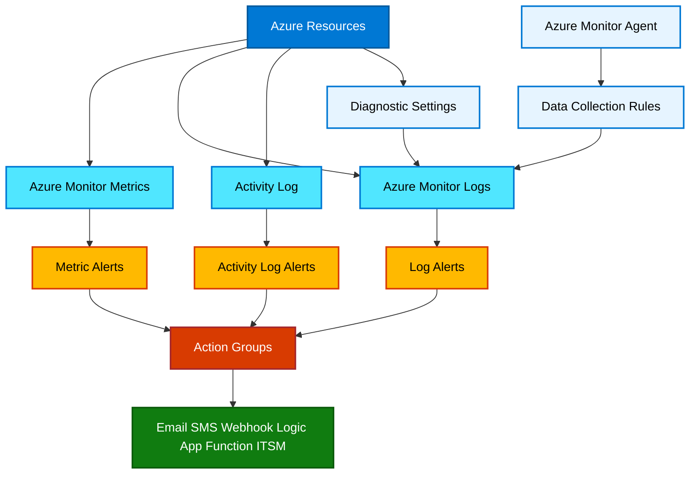

### Explanation

Azure Monitor is the primary observability platform for Azure. It brings together metrics, logs, traces, events, alerts, visualization, and automation. It can monitor native Azure resources, guest operating systems, containers, hybrid servers, and custom applications.

Key building blocks:

- **Metrics** provide near real-time numerical telemetry such as CPU usage, request count, latency, disk throughput, or queue depth.
- **Logs** provide rich event and state data stored in Log Analytics workspaces.
- **Alerts** evaluate metrics, logs, or platform events and notify responders through action groups.
- **Diagnostic settings** route platform logs and metrics from Azure resources to destinations such as Log Analytics, Event Hubs, or Storage Accounts.
- **Data collection rules (DCRs)** define what guest-level data AMA should collect and where it should go.
- **Action groups** centralize notification and remediation targets.

Azure Monitor is not a single pane with one data type; it is a coordinated ecosystem. Engineers typically use metrics for fast threshold detection, logs for investigation, traces for request flow analysis, and alerts for incident response.

### Azure CLI commands

```bash
# Create a resource group
az group create \
  --name rg-monitoring-prod \
  --location eastus

# Create a Log Analytics workspace
az monitor log-analytics workspace create \
  --resource-group rg-monitoring-prod \
  --workspace-name law-observability-prod \
  --location eastus

# Create an action group with email receiver
az monitor action-group create \
  --name ag-prod-ops \
  --resource-group rg-monitoring-prod \
  --short-name prodops \
  --action email OpsTeam ops-team@example.com

# List available metric definitions for a VM
az monitor metrics list-definitions \
  --resource /subscriptions/<subId>/resourceGroups/rg-app/providers/Microsoft.Compute/virtualMachines/vm01

# Query recent CPU metrics
az monitor metrics list \
  --resource /subscriptions/<subId>/resourceGroups/rg-app/providers/Microsoft.Compute/virtualMachines/vm01 \
  --metric "Percentage CPU" \
  --interval PT1M \
  --aggregation Average

# Create a diagnostic setting sending logs and metrics to Log Analytics
az monitor diagnostic-settings create \
  --name diag-to-law \
  --resource /subscriptions/<subId>/resourceGroups/rg-app/providers/Microsoft.KeyVault/vaults/kv-prod \
  --workspace /subscriptions/<subId>/resourceGroups/rg-monitoring-prod/providers/Microsoft.OperationalInsights/workspaces/law-observability-prod \
  --logs '[{"category":"AuditEvent","enabled":true}]' \
  --metrics '[{"category":"AllMetrics","enabled":true}]'

# Create a data collection rule
az monitor data-collection rule create \
  --resource-group rg-monitoring-prod \
  --location eastus \
  --name dcr-vm-perf-logs \
  --rule-file dcr-vm-perf-logs.json

# Associate a DCR with a VM
az monitor data-collection rule association create \
  --name assoc-vm01 \
  --resource /subscriptions/<subId>/resourceGroups/rg-app/providers/Microsoft.Compute/virtualMachines/vm01 \
  --rule-id /subscriptions/<subId>/resourceGroups/rg-monitoring-prod/providers/Microsoft.Insights/dataCollectionRules/dcr-vm-perf-logs
```

### Best practices

- Separate **platform telemetry** and **application telemetry** logically, but allow shared investigative workflows.
- Use **diagnostic settings** consistently through policy or landing zone automation.
- Prefer **metrics for fast SLO thresholding** and **logs for deep analysis**.
- Standardize **naming conventions** for action groups, workspaces, and DCRs.
- Use **infrastructure as code** for monitor configuration to avoid drift.
- Route critical alerts into **automation** and **ticketing**, not only email.
- Review ingestion and retention regularly to manage cost.

---

## Log Analytics Workspace

### Mermaid diagram

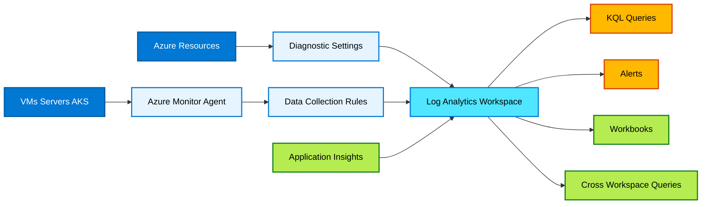

### Explanation

A Log Analytics workspace is the central data store for Azure Monitor logs. It uses a schema of tables, such as `Heartbeat`, `Perf`, `Syslog`, `AzureActivity`, `ContainerLogV2`, `InsightsMetrics`, and many service-specific tables. Workspaces enable central retention, KQL-based analysis, alerts, workbooks, and integrations.

Important concepts:

- **Workspace architecture** can be centralized, regional, per-environment, or per-business unit.
- **Tables** determine the shape of data and support different retention models.
- **Retention** controls how long data remains available for analytics and archive.
- **Cross-workspace queries** enable federated analysis across multiple workspaces.
- **RBAC** controls access to query and manage telemetry.
- **Data export and archive** support downstream analytics, compliance, and cost management.

A centralized workspace simplifies investigation but may increase blast radius and data governance complexity. Multiple workspaces improve segregation and regional control but make queries, alerts, and dashboards more complex.

### KQL examples

```kusto
// Recent agent heartbeats
Heartbeat
| where TimeGenerated > ago(1h)
| summarize LastSeen=max(TimeGenerated) by Computer, OSType
| order by LastSeen desc
```

```kusto
// CPU trend from Perf table
Perf
| where TimeGenerated > ago(24h)
| where ObjectName == "Processor" and CounterName == "% Processor Time" and InstanceName == "_Total"
| summarize AvgCPU=avg(CounterValue) by bin(TimeGenerated, 15m), Computer
| render timechart
```

```kusto
// Top error events
Event
| where TimeGenerated > ago(24h)
| where EventLevelName in ("Error", "Critical")
| summarize Count=count() by Computer, EventLog, EventID
| top 20 by Count desc
```

```kusto
// Cross-workspace query
union workspace("law-observability-prod").Heartbeat,
      workspace("law-observability-dr").Heartbeat
| where TimeGenerated > ago(30m)
| summarize LastSeen=max(TimeGenerated) by Computer, _ResourceId
```

```kusto
// Query AzureActivity failures
AzureActivity
| where TimeGenerated > ago(24h)
| where ActivityStatusValue !~ "Success"
| project TimeGenerated, Caller, ResourceGroup, OperationNameValue, ActivityStatusValue, ResultDescription
| order by TimeGenerated desc
```

### Azure CLI commands

```bash
# Create a workspace with retention
az monitor log-analytics workspace create \
  --resource-group rg-monitoring-prod \
  --workspace-name law-observability-prod \
  --location eastus \
  --retention-time 30

# Show workspace details
az monitor log-analytics workspace show \
  --resource-group rg-monitoring-prod \
  --workspace-name law-observability-prod

# Update workspace retention
az monitor log-analytics workspace update \
  --resource-group rg-monitoring-prod \
  --workspace-name law-observability-prod \
  --retention-time 90

# Run a workspace query
az monitor log-analytics query \
  --workspace law-observability-prod \
  --analytics-query "Heartbeat | summarize LastSeen=max(TimeGenerated) by Computer" \
  --timespan P1D
```

### Best practices

- Choose workspace topology based on **regulatory boundaries, operational model, and cost visibility**.
- Standardize on a **few workspace patterns**, not one-off designs.
- Use **table-level plans and retention settings** where supported.
- Implement **RBAC** and **resource-context access** deliberately.
- Use **cross-workspace queries sparingly** in latency-sensitive dashboards.
- Archive infrequently queried data and retain hot data only as needed.
- Tag and document ownership of each workspace.

---

## Azure Monitor Alerts

### Mermaid diagram

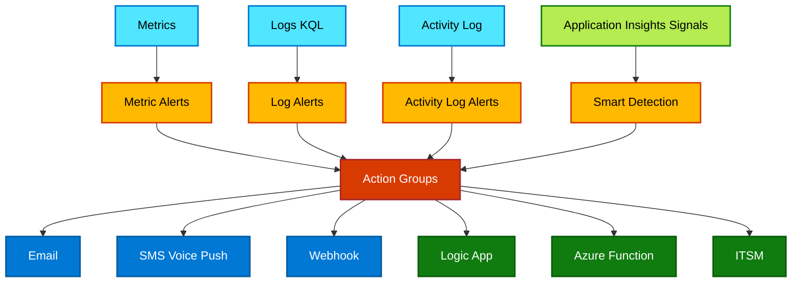

### Explanation

Azure Monitor Alerts evaluate telemetry and trigger notifications or automated remediation. Different alert types serve different use cases:

- **Metric alerts** evaluate platform or custom metrics at short intervals and are ideal for CPU, latency, availability, queue depth, or request rate thresholds.
- **Log alerts** run KQL queries against workspaces and alert on richer conditions, aggregations, joins, and patterns.
- **Activity log alerts** watch Azure control plane events such as delete operations, policy changes, resource health signals, or service health events.
- **Smart detection** in Application Insights uses machine learning to identify anomalies such as failure spikes or performance degradation.
- **Action groups** define who gets notified and what automated steps run.

Action groups can invoke:

- Email
- SMS
- Voice
- Push notifications
- Webhooks
- Logic Apps
- Azure Functions
- ITSM connectors
- Automation runbooks
- Event Hubs where applicable through integrations

Alert design should consider signal quality, severity, routing, suppression, remediation, and ownership. Poor alert hygiene leads to fatigue and missed incidents.

### Azure CLI commands

```bash
# Create an action group with multiple receivers
az monitor action-group create \
  --name ag-critical-prod \
  --resource-group rg-monitoring-prod \
  --short-name critprod \
  --action email SRE sre@example.com \
  --action sms PrimaryOnCall 1 4255550100 \
  --action webhook PagerDuty https://events.example.com/pagerduty \
  --action logicapp OpsLogicApp /subscriptions/<subId>/resourceGroups/rg-auto/providers/Microsoft.Logic/workflows/logicapp-ops callbackUrl=https://prod.example.logic.azure.com:443/workflows/... \
  --action azurefunction AutoHeal /subscriptions/<subId>/resourceGroups/rg-auto/providers/Microsoft.Web/sites/func-ops/functions/RestartApp \
  --action itsm ServiceNow workspaceId=<logAnalyticsWorkspaceId> connectionId=<itsmConnectionId> ticketConfiguration='{\"severity\":\"High\"}'

# Create a metric alert on CPU
az monitor metrics alert create \
  --name alert-vm-cpu-high \
  --resource-group rg-monitoring-prod \
  --scopes /subscriptions/<subId>/resourceGroups/rg-app/providers/Microsoft.Compute/virtualMachines/vm01 \
  --condition "avg Percentage CPU > 80" \
  --window-size 5m \
  --evaluation-frequency 1m \
  --severity 2 \
  --action ag-critical-prod

# Create a scheduled query rule (log alert)
az monitor scheduled-query create \
  --name alert-heartbeat-missing \
  --resource-group rg-monitoring-prod \
  --scopes /subscriptions/<subId>/resourceGroups/rg-monitoring-prod/providers/Microsoft.OperationalInsights/workspaces/law-observability-prod \
  --condition "count 'Heartbeat | where TimeGenerated < ago(10m)' > 0" \
  --description "Alert when heartbeat data is stale" \
  --evaluation-frequency 5m \
  --window-size 15m \
  --severity 1 \
  --action-groups /subscriptions/<subId>/resourceGroups/rg-monitoring-prod/providers/microsoft.insights/actionGroups/ag-critical-prod

# Create an activity log alert for resource deletion
az monitor activity-log alert create \
  --name alert-resource-delete \
  --resource-group rg-monitoring-prod \
  --condition category=Administrative and operationName=Microsoft.Resources/subscriptions/resourceGroups/resources/delete \
  --action-group /subscriptions/<subId>/resourceGroups/rg-monitoring-prod/providers/microsoft.insights/actionGroups/ag-critical-prod
```

### KQL examples

```kusto
// Failed requests above threshold
requests
| where timestamp > ago(15m)
| summarize Failed=countif(success == false), Total=count() by cloud_RoleName
| extend FailureRate = todouble(Failed) / todouble(Total)
| where Failed > 10 and FailureRate > 0.05
```

```kusto
// Heartbeat missing by computer
Heartbeat
| summarize LastSeen=max(TimeGenerated) by Computer
| where LastSeen < ago(10m)
```

```kusto
// Failed activity log operations
AzureActivity
| where TimeGenerated > ago(15m)
| where ActivityStatusValue =~ "Failure"
| summarize Failures=count() by OperationNameValue, Caller
```

### Best practices

- Route alerts by **severity and service ownership**.
- Use **dynamic thresholds** where stable static thresholds are hard to maintain.
- Keep **email-only alerts** for informational events; use automation or incident systems for high severity.
- Add **descriptions, runbook links, and responder context** in alert rules.
- Tune alerts to reduce duplicates and noise.
- Prefer **service-level alerts** over low-value infrastructure-only alert floods.
- Test action groups regularly.
- Use alert processing rules for maintenance windows and suppression.

---

## Application Insights

### Mermaid diagram

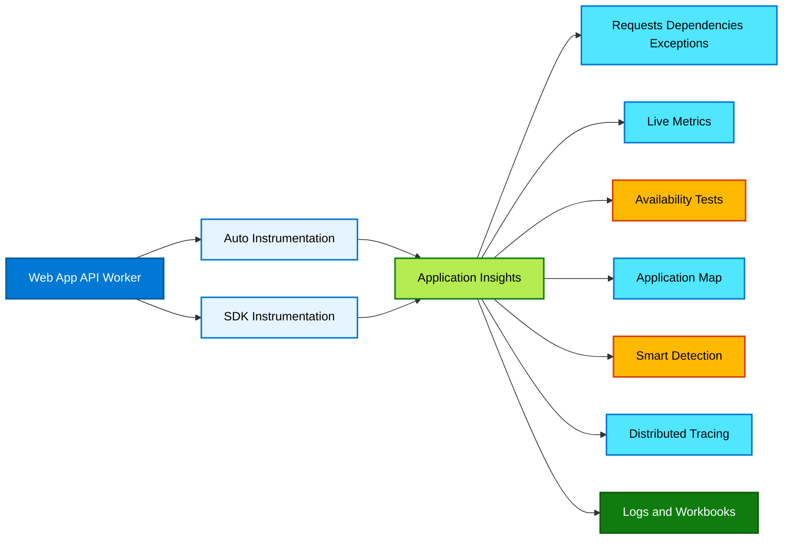

### Explanation

Application Insights provides application performance monitoring for web apps, APIs, background services, and distributed applications. It captures request rates, response times, dependency calls, exceptions, traces, custom events, page views, user behavior, and availability checks.

Capabilities include:

- **Auto-instrumentation** for supported Azure-hosted workloads with minimal code changes.
- **SDK-based instrumentation** for deeper control, enrichment, custom telemetry, and nonstandard scenarios.
- **Availability tests** for synthetic monitoring from multiple regions.
- **Live Metrics** for near real-time triage during active incidents.
- **Application Map** for topology and dependency flow visualization.
- **Smart Detection** for anomaly detection.
- **Distributed tracing** across microservices and dependencies using correlation identifiers.
- **Performance counters** and runtime signals depending on platform and agent.

Application Insights can run in workspace-based mode, which stores data in a Log Analytics workspace and aligns with broader Azure Monitor operations.

### Azure CLI commands

```bash
# Create Application Insights component
az monitor app-insights component create \
  --app appi-orders-prod \
  --location eastus \
  --resource-group rg-monitoring-prod \
  --workspace /subscriptions/<subId>/resourceGroups/rg-monitoring-prod/providers/Microsoft.OperationalInsights/workspaces/law-observability-prod \
  --application-type web

# Show Application Insights details
az monitor app-insights component show \
  --app appi-orders-prod \
  --resource-group rg-monitoring-prod

# Create a web availability test (command patterns vary by CLI extension/version; validate in your environment)
az monitor app-insights web-test create \
  --resource-group rg-monitoring-prod \
  --name wt-orders-homepage \
  --location eastus \
  --web-test-kind standard \
  --frequency 300 \
  --timeout 30 \
  --enabled true \
  --request-url https://orders.example.com/health \
  --app-insights appi-orders-prod
```

### KQL examples

```kusto
// Request success and latency by role
requests
| where timestamp > ago(1h)
| summarize Requests=count(), Failed=countif(success == false), P95=percentile(duration, 95) by cloud_RoleName
| order by P95 desc
```

```kusto
// Dependency failures
dependencies
| where timestamp > ago(1h)
| where success == false
| summarize Failures=count() by target, type, operation_Name
| top 20 by Failures desc
```

```kusto
// Exceptions by outer message
exceptions
| where timestamp > ago(24h)
| summarize Count=count() by outerMessage, type
| top 20 by Count desc
```

```kusto
// End-to-end trace drilldown
union requests, dependencies, exceptions, traces
| where operation_Id == "<operation-id>"
| project timestamp, itemType, name, operation_Name, cloud_RoleName, success, message, resultCode, duration
| order by timestamp asc
```

### Best practices

- Prefer **workspace-based Application Insights** for unified governance and querying.
- Use **OpenTelemetry or supported SDKs** where possible for future-proofing.
- Capture **business events** in addition to infrastructure metrics.
- Enable **distributed tracing** across services and queues.
- Monitor **availability from multiple regions**.
- Use **sampling** carefully to manage cost without losing incident fidelity.
- Enrich telemetry with **cloud role name, environment, tenant, and correlation IDs**.
- Protect sensitive data; avoid logging secrets and PII.

---

## Azure Monitor Agent (AMA)

### Mermaid diagram

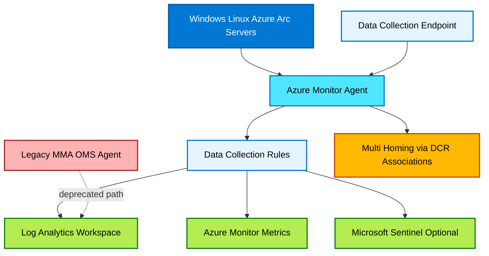

### Explanation

Azure Monitor Agent is the strategic guest telemetry agent for Azure VMs, Azure Arc-enabled servers, and hybrid environments. It replaces legacy agents such as the Microsoft Monitoring Agent (MMA) / OMS agent for most Azure Monitor scenarios.

Core concepts:

- **AMA** is lighter, more flexible, and driven by DCRs.
- **DCRs** define data sources, streams, transformations, and destinations.
- **Data Collection Endpoints (DCEs)** provide ingestion endpoints for certain scenarios, especially private link or specific collection architectures.
- **Multi-homing** is achieved by associating resources with multiple DCRs or routing multiple streams appropriately.
- **Legacy vs new model**: MMA relied heavily on workspace configuration and solution packs; AMA shifts control to reusable DCR resources.

Typical data collected:

- Windows event logs
- Syslog
- Performance counters
- Extensions-based metrics
- Custom text logs
- Dependency/insight data for VM Insights and Container Insights scenarios

### Azure CLI commands

```bash
# Create a data collection endpoint
az monitor data-collection endpoint create \
  --name dce-eastus-prod \
  --resource-group rg-monitoring-prod \
  --location eastus

# Create a DCR from JSON definition
az monitor data-collection rule create \
  --name dcr-linux-syslog-perf \
  --resource-group rg-monitoring-prod \
  --location eastus \
  --rule-file dcr-linux-syslog-perf.json

# Associate DCR with VM
az monitor data-collection rule association create \
  --name assoc-linuxvm01 \
  --resource /subscriptions/<subId>/resourceGroups/rg-app/providers/Microsoft.Compute/virtualMachines/linuxvm01 \
  --rule-id /subscriptions/<subId>/resourceGroups/rg-monitoring-prod/providers/Microsoft.Insights/dataCollectionRules/dcr-linux-syslog-perf

# List DCR associations on a VM
az monitor data-collection rule association list \
  --resource /subscriptions/<subId>/resourceGroups/rg-app/providers/Microsoft.Compute/virtualMachines/linuxvm01

# Install AMA extension on an Azure VM (Linux example)
az vm extension set \
  --resource-group rg-app \
  --vm-name linuxvm01 \
  --name AzureMonitorLinuxAgent \
  --publisher Microsoft.Azure.Monitor
```

### Best practices

- Standardize DCRs by **OS, workload type, and environment**.
- Avoid collecting every possible log category; ingest what supports clear use cases.
- Use **DCE + private connectivity** for regulated environments where required.
- Validate AMA health with heartbeat and agent-specific tables.
- Complete migrations away from **MMA/OMS** before deprecation deadlines.
- Use transformations to reduce noisy or low-value data where supported.
- Document DCR associations and ownership.

---

## Azure Activity Log

### Mermaid diagram

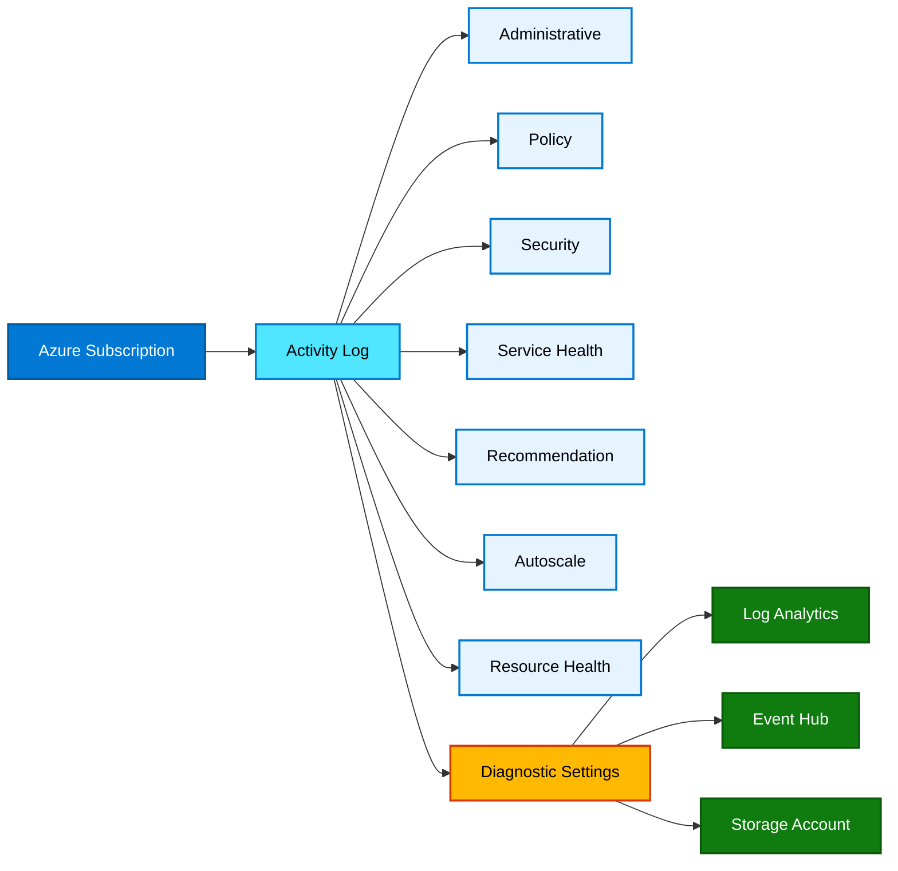

### Explanation

Azure Activity Log records subscription-level control plane operations. It tells you who performed an operation, when it happened, what resource was affected, and whether it succeeded or failed. This is distinct from guest OS logs and application logs.

Key categories include:

- **Administrative**: create, update, delete, start, stop, scale, and other ARM control plane changes.
- **Policy**: Azure Policy evaluation and enforcement events.
- **Security**: security-related records where available through integrated services.
- **Service Health**: service incidents and advisories affecting your subscription.
- **Resource Health**: platform-detected health changes for resources.
- **Recommendation**: Azure Advisor-related recommendation changes.
- **Autoscale**: autoscale operations.

By default, Activity Log retention in the platform is limited, so exporting via diagnostic settings is important for long-term investigations and compliance.

### Azure CLI commands

```bash
# Show activity log events for the last hour
az monitor activity-log list \
  --offset 1h \
  --status Failed

# List activity log for a specific resource group
az monitor activity-log list \
  --resource-group rg-app \
  --offset 24h

# Create diagnostic settings for subscription activity logs to Log Analytics
az monitor diagnostic-settings create \
  --name diag-sub-activity \
  --resource /subscriptions/<subId> \
  --workspace /subscriptions/<subId>/resourceGroups/rg-monitoring-prod/providers/Microsoft.OperationalInsights/workspaces/law-observability-prod \
  --logs '[
    {"category":"Administrative","enabled":true},
    {"category":"Security","enabled":true},
    {"category":"ServiceHealth","enabled":true},
    {"category":"Alert","enabled":true},
    {"category":"Recommendation","enabled":true},
    {"category":"Policy","enabled":true},
    {"category":"Autoscale","enabled":true},
    {"category":"ResourceHealth","enabled":true}
  ]'

# Export the same Activity Log stream to Event Hub
az monitor diagnostic-settings create \
  --name diag-sub-activity-evh \
  --resource /subscriptions/<subId> \
  --event-hub-rule /subscriptions/<subId>/resourceGroups/rg-monitoring-prod/providers/Microsoft.EventHub/namespaces/evhns-prod/authorizationRules/RootManageSharedAccessKey \
  --event-hub activitylogs \
  --logs '[
    {"category":"Administrative","enabled":true},
    {"category":"Policy","enabled":true},
    {"category":"ResourceHealth","enabled":true}
  ]'

# Export the same Activity Log stream to a Storage Account
az monitor diagnostic-settings create \
  --name diag-sub-activity-storage \
  --resource /subscriptions/<subId> \
  --storage-account /subscriptions/<subId>/resourceGroups/rg-monitoring-prod/providers/Microsoft.Storage/storageAccounts/stactivityarchiveprod \
  --logs '[
    {"category":"Administrative","enabled":true},
    {"category":"Security","enabled":true},
    {"category":"ServiceHealth","enabled":true}
  ]'
```

### KQL examples

```kusto
AzureActivity
| where TimeGenerated > ago(24h)
| summarize Count=count() by Category, ActivityStatusValue
| order by Count desc
```

```kusto
AzureActivity
| where TimeGenerated > ago(7d)
| where OperationNameValue contains "delete"
| project TimeGenerated, Caller, ResourceGroup, ResourceProviderValue, OperationNameValue, ActivityStatusValue
| order by TimeGenerated desc
```

```kusto
AzureActivity
| where TimeGenerated > ago(1d)
| where CategoryValue =~ "Policy"
| project TimeGenerated, ResourceGroup, Caller, OperationNameValue, ActivityStatusValue, Properties
```

### Best practices

- Export Activity Log to **Log Analytics** for search and alerting.
- Send long-term audit records to **Storage** or **Event Hub** for archival or SIEM.
- Create alerts for **delete operations, role assignments, policy changes, and network security changes**.
- Use Activity Log during incident timelines to correlate human and automation actions.
- Limit reliance on default platform retention.

---

## Azure Advisor

### Mermaid diagram

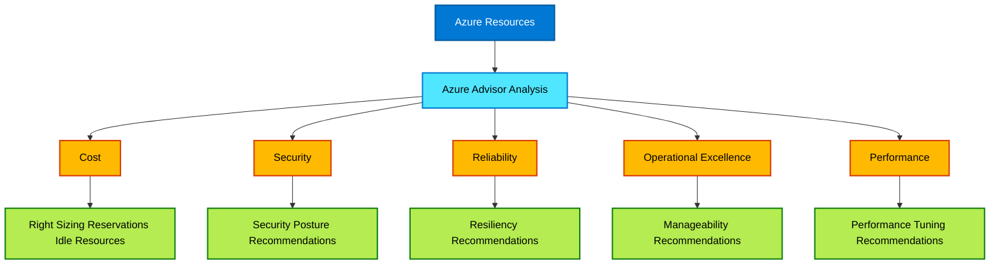

### Explanation

Azure Advisor analyzes deployed resources and generates recommendations across several pillars:

- **Cost**: identify idle resources, right-size SKUs, and optimize pricing models.
- **Security**: surface security posture improvements, often aligned with Defender and platform guidance.
- **Reliability**: highlight resilience gaps such as missing redundancy or backup patterns.
- **Operational Excellence**: improve manageability, monitoring, and process health.
- **Performance**: identify resource bottlenecks or inefficient configuration.

Advisor is not a full observability data plane, but it is operationally important because its recommendations often inform preventive monitoring and remediation backlogs.

### Azure CLI commands

```bash
# List Advisor recommendations
az advisor recommendation list

# List high impact recommendations only
az advisor recommendation list \
  --query "[?impact=='High']"

# List recommendations for a resource group
az advisor recommendation list \
  --resource-group rg-app

# Filter recommendations by category
az advisor recommendation list \
  --category Cost

az advisor recommendation list \
  --category Security

az advisor recommendation list \
  --category Reliability

az advisor recommendation list \
  --category OperationalExcellence

az advisor recommendation list \
  --category Performance
```

### Best practices

- Review Advisor recommendations in recurring **operations reviews**.
- Feed actionable recommendations into backlog or automation workflows.
- Validate recommendations against workload context before applying broadly.
- Combine Advisor findings with live telemetry to prioritize improvements.
- Track remediation status and exceptions.

---

## Azure Service Health

### Mermaid diagram

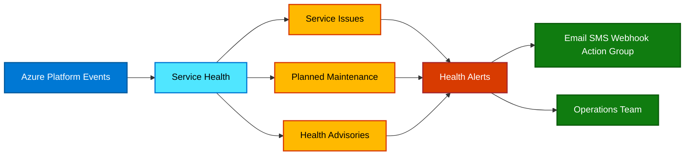

### Explanation

Azure Service Health provides personalized information about Azure incidents and planned maintenance affecting your subscriptions, services, and regions.

Primary event types:

- **Service issues**: active platform incidents affecting availability or performance.
- **Planned maintenance**: upcoming platform maintenance events that may require action or awareness.
- **Health advisories**: broader guidance such as retirements, required configuration changes, or transient platform concerns.

Health alerts can be routed through action groups so platform-impacting events become part of operational workflows.

### Azure CLI commands

```bash
# List service health events (availability depends on CLI modules and permissions)
az rest \
  --method get \
  --url "https://management.azure.com/subscriptions/<subId>/providers/Microsoft.ResourceHealth/events?api-version=2022-10-01"

# Create an activity log alert for Service Health
az monitor activity-log alert create \
  --name alert-service-health \
  --resource-group rg-monitoring-prod \
  --condition category=ServiceHealth \
  --action-group /subscriptions/<subId>/resourceGroups/rg-monitoring-prod/providers/microsoft.insights/actionGroups/ag-critical-prod
```

### Best practices

- Subscribe to Service Health alerts for all production subscriptions.
- Route planned maintenance notices to teams that manage stateful systems.
- Correlate Service Health events with internal incidents before escalating engineering action.
- Track retirements and advisories as change-management inputs.
- Ensure on-call responders understand the difference between provider-side and tenant-side issues.

---

## Network Watcher

### Mermaid diagram

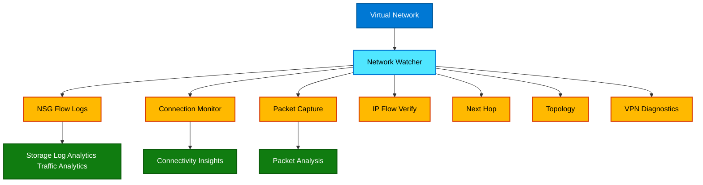

### Explanation

Network Watcher is Azure’s network diagnostics and monitoring service. It helps engineers troubleshoot connectivity, NSG decisions, routing, topology, and VPN health.

Capabilities:

- **NSG flow logs**: track allowed and denied traffic decisions for NSGs. Often paired with Traffic Analytics.
- **Connection Monitor**: perform synthetic connectivity checks between endpoints.
- **Packet Capture**: capture packets from Azure VMs for deeper protocol analysis.
- **IP Flow Verify**: determine whether a packet is allowed or denied and by which NSG rule.
- **Next Hop**: identify effective route forwarding.
- **Topology**: visualize network resources and relationships.
- **VPN Diagnostics**: troubleshoot gateway and tunnel issues.

### Azure CLI commands

```bash
# Enable Network Watcher in a region
az network watcher configure \
  --locations eastus \
  --resource-group NetworkWatcherRG \
  --enabled true

# Verify IP flow
az network watcher test-ip-flow \
  --resource-group rg-app \
  --vm vm01 \
  --direction Inbound \
  --protocol TCP \
  --local 10.0.0.4:443 \
  --remote 203.0.113.10:50000

# Get next hop
az network watcher show-next-hop \
  --resource-group rg-app \
  --vm vm01 \
  --source-ip 10.0.0.4 \
  --dest-ip 8.8.8.8

# Run connection troubleshoot
az network watcher test-connectivity \
  --resource-group rg-app \
  --source-resource vm01 \
  --dest-address orders.example.com \
  --dest-port 443

# Start packet capture
az network watcher packet-capture create \
  --resource-group rg-app \
  --vm vm01 \
  --name pc-vm01 \
  --storage-account stnetworkdiagprod

# Enable NSG flow logs for a Network Security Group
az network watcher flow-log create \
  --resource-group NetworkWatcherRG \
  --location eastus \
  --name fl-nsg-app \
  --nsg /subscriptions/<subId>/resourceGroups/rg-network/providers/Microsoft.Network/networkSecurityGroups/nsg-app \
  --storage-account stnetworkdiagprod \
  --enabled true \
  --traffic-analytics true \
  --workspace /subscriptions/<subId>/resourceGroups/rg-monitoring-prod/providers/Microsoft.OperationalInsights/workspaces/law-observability-prod

# Show virtual network topology
az network watcher show-topology \
  --resource-group rg-network \
  --location eastus \
  --target-resource-group rg-app

# Diagnose VPN gateway
az network watcher troubleshooting start \
  --resource-group rg-network \
  --resource /subscriptions/<subId>/resourceGroups/rg-network/providers/Microsoft.Network/virtualNetworkGateways/vpngw-prod \
  --storage-account /subscriptions/<subId>/resourceGroups/rg-monitoring-prod/providers/Microsoft.Storage/storageAccounts/stnetworkdiagprod
```

### Best practices

- Enable Network Watcher in all used regions.
- Use Connection Monitor for **continuous validation** of critical paths.
- Export NSG flow logs where needed for security and traffic analytics.
- Use packet capture selectively because it can generate large volumes.
- Validate effective routing and NSG decisions before escalating app issues.
- Keep a standard network troubleshooting runbook.

---

## Azure Workbooks

### Mermaid diagram

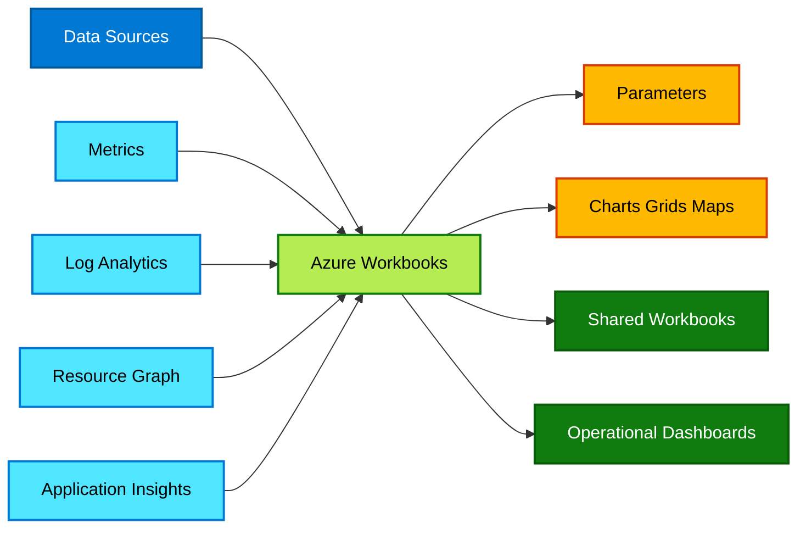

### Explanation

Azure Workbooks are interactive reporting and analysis canvases. They can combine metrics, log queries, text, links, parameters, and visuals in a single artifact. Workbooks are excellent for operational investigations, platform health views, service scorecards, and executive summaries.

Features:

- **Templates** for rapid reuse.
- **Parameters** such as subscription, environment, region, app, or time range.
- **Visualizations** including tables, time charts, heat maps, grids, bars, tiles, and markdown.
- **Shared workbooks** that teams can reuse across subscriptions and services.
- **Multiple data sources** such as Azure Monitor Logs, Metrics, Resource Graph, and Application Insights.

### Example KQL for workbooks

```kusto
Heartbeat
| where TimeGenerated > ago(24h)
| summarize Count=count() by bin(TimeGenerated, 1h), OSType
| render timechart
```

```kusto
InsightsMetrics
| where TimeGenerated > ago(6h)
| summarize AvgVal=avg(Val) by Namespace, Name, bin(TimeGenerated, 15m)
| render timechart
```

### Azure CLI commands

```bash
# Export a workbook definition using resource commands
az resource show \
  --resource-group rg-monitoring-prod \
  --name my-workbook \
  --resource-type Microsoft.Insights/workbooks

# List workbook resources in a resource group
az resource list \
  --resource-group rg-monitoring-prod \
  --resource-type Microsoft.Insights/workbooks
```

### Best practices

- Use parameters to make workbooks reusable across services.
- Design separate workbooks for **operations**, **engineering**, and **leadership** audiences.
- Keep expensive cross-workspace queries limited or cached through design.
- Store workbook JSON in source control when managing with IaC.
- Add context text, legends, and drill-down links.

---

## Azure Dashboards

### Mermaid diagram

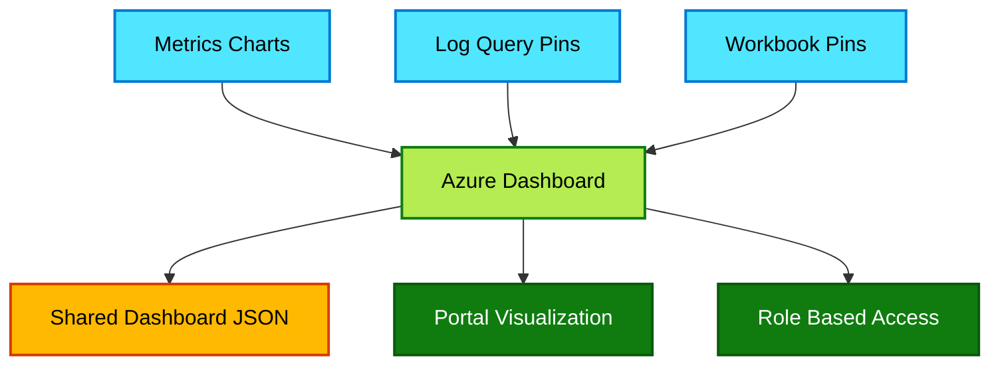

### Explanation

Azure Dashboards provide portal-based, tile-oriented visualization. They are useful for curated high-level views and NOC-style screens. Dashboards can include pinned metrics, pinned log charts, markdown, and resource tiles.

Important areas:

- **Dashboard JSON** defines layout and parts.
- **Shared dashboards** enable teams to consume a common portal view.
- **Pinning from metrics/logs** is a quick path to operational visibility.

### Azure CLI commands

```bash
# List portal dashboards
az portal dashboard list

# Show a dashboard
az portal dashboard show \
  --name prod-ops-dashboard \
  --resource-group rg-monitoring-prod

# Create or update a dashboard from JSON
az portal dashboard create \
  --name prod-ops-dashboard \
  --resource-group rg-monitoring-prod \
  --input-path dashboard.json
```

### Best practices

- Use dashboards for **summary views**, not deep analysis.
- Pin only high-value metrics and alerts to avoid clutter.
- Keep dashboard JSON in source control.
- Prefer Workbooks when interactivity and advanced querying are required.
- Align dashboard layout to incident workflows.

---

## Container Insights

### Mermaid diagram

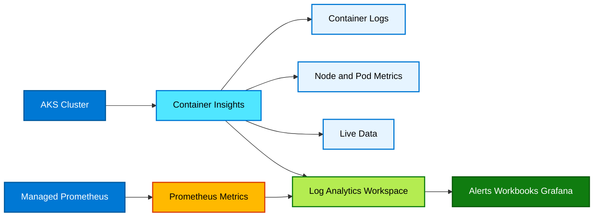

### Explanation

Container Insights monitors AKS and other supported Kubernetes environments in Azure Monitor. It collects node, pod, controller, and container telemetry, plus logs and inventory data.

Coverage areas:

- **AKS monitoring** for cluster performance and health.
- **Container logs** for stdout/stderr and platform log collection.
- **Prometheus metrics** for Kubernetes-native and app metrics when integrated with managed Prometheus.
- **Live data** for fast troubleshooting.

Container Insights is often paired with:

- Azure Managed Prometheus
- Azure Managed Grafana
- Log Analytics workspaces
- Alerts and Workbooks

### Azure CLI commands

```bash
# Enable monitoring add-on for AKS with Log Analytics
az aks enable-addons \
  --addons monitoring \
  --name aks-prod-eastus \
  --resource-group rg-aks-prod \
  --workspace-resource-id /subscriptions/<subId>/resourceGroups/rg-monitoring-prod/providers/Microsoft.OperationalInsights/workspaces/law-observability-prod

# Show AKS monitoring profile
az aks show \
  --name aks-prod-eastus \
  --resource-group rg-aks-prod \
  --query addonProfiles.omsagent

# Enable live data/monitoring experience through portal-integrated monitoring profile validation
az aks show \
  --name aks-prod-eastus \
  --resource-group rg-aks-prod \
  --query "{monitoring:addonProfiles.omsagent.enabled, azureMonitorMetrics:azureMonitorProfile.metrics.enabled}"
```

### KQL examples

```kusto
// Pod restart counts
KubePodInventory
| where TimeGenerated > ago(24h)
| summarize Restarts=max(ContainerRestartCount) by ClusterName, Namespace, PodName=Name
| top 20 by Restarts desc
```

```kusto
// Container log errors
ContainerLogV2
| where TimeGenerated > ago(1h)
| where LogMessage has_any ("error", "exception", "failed")
| project TimeGenerated, PodNamespace, PodName, ContainerName, LogMessage
| order by TimeGenerated desc
```

```kusto
// Node CPU by cluster
Perf
| where TimeGenerated > ago(6h)
| where ObjectName == "K8SNode" and CounterName == "cpuUsageNanoCores"
| summarize AvgCPU=avg(CounterValue) by bin(TimeGenerated, 15m), Computer
| render timechart
```

### Best practices

- Separate **platform cluster monitoring** from **application metrics strategy**.
- Use managed Prometheus for Kubernetes-native metrics and Grafana dashboards.
- Limit noisy container logs and apply filtering where possible.
- Alert on pod restarts, node pressure, control plane issues, and API latency.
- Monitor namespace and workload SLOs, not only cluster infrastructure.

---

## VM Insights

### Mermaid diagram

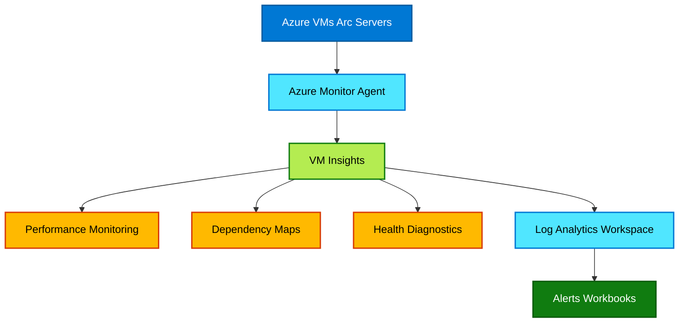

### Explanation

VM Insights provides a curated monitoring experience for Azure VMs and Arc-enabled servers. It focuses on infrastructure health and dependency visualization.

Capabilities:

- **Performance monitoring** for CPU, memory, disk, and network trends.
- **Dependency maps** to understand process-to-process and machine-to-machine connections.
- **Health diagnostics** and inventory signals.

VM Insights relies on AMA and associated collection rules. It reduces the need to manually assemble many baseline visualizations for compute fleets.

### Azure CLI commands

```bash
# Install AMA extension for Windows VM
az vm extension set \
  --resource-group rg-app \
  --vm-name winvm01 \
  --name AzureMonitorWindowsAgent \
  --publisher Microsoft.Azure.Monitor

# Install dependency agent where required by your scenario/region
az vm extension set \
  --resource-group rg-app \
  --vm-name winvm01 \
  --name DependencyAgentWindows \
  --publisher Microsoft.Azure.Monitoring.DependencyAgent
```

### KQL examples

```kusto
// VM heartbeat summary
Heartbeat
| where TimeGenerated > ago(1h)
| summarize LastSeen=max(TimeGenerated) by Computer, OSType, ResourceGroup
| order by LastSeen desc
```

```kusto
// Disk free space trend example
Perf
| where TimeGenerated > ago(24h)
| where CounterName == "% Free Space"
| summarize AvgFree=avg(CounterValue) by bin(TimeGenerated, 30m), Computer, InstanceName
| render timechart
```

### Best practices

- Enable VM Insights on critical compute tiers first.
- Use dependency mapping to validate undocumented dependencies before change windows.
- Alert on stale heartbeat, disk exhaustion, CPU saturation, and memory pressure.
- Standardize AMA deployment using policy or IaC.
- Use VM Insights with patching and backup operational views.

---

## Azure Managed Grafana

### Mermaid diagram

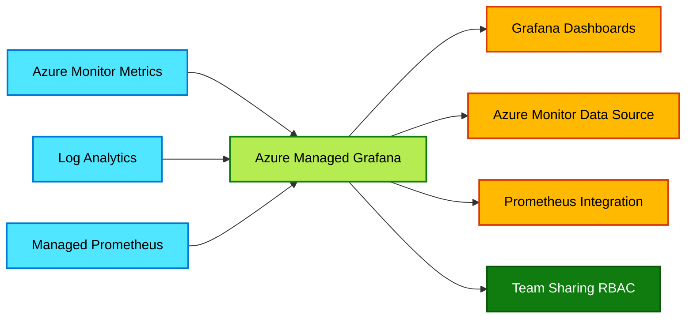

### Explanation

Azure Managed Grafana is a managed Grafana service integrated with Azure identity and data sources. It is commonly used for advanced dashboarding, especially for Prometheus and multi-source observability use cases.

Use cases:

- Build **Grafana dashboards** for platform, app, and Kubernetes metrics.
- Use the **Azure Monitor data source** for metrics and logs.
- Integrate **Managed Prometheus** for PromQL-based analysis.
- Share dashboards across engineering and operations teams with Azure RBAC and Grafana permissions.

### Azure CLI commands

```bash
# Create Azure Managed Grafana instance
az grafana create \
  --name grafana-observability-prod \
  --resource-group rg-monitoring-prod \
  --location eastus

# Show Managed Grafana details
az grafana show \
  --name grafana-observability-prod \
  --resource-group rg-monitoring-prod

# Update Managed Grafana integrations (example: deterministic outbound IP and API key settings vary by environment)
az grafana update \
  --name grafana-observability-prod \
  --resource-group rg-monitoring-prod \
  --api-key Enabled
```

### Best practices

- Use Grafana for **advanced metrics visualization**, especially Prometheus-heavy estates.
- Keep dashboard folders aligned to teams or services.
- Use managed identities and RBAC rather than shared credentials.
- Standardize dashboard provisioning and version control.
- Avoid duplicated dashboards with minor naming differences.

---

## Azure Managed Prometheus

### Mermaid diagram

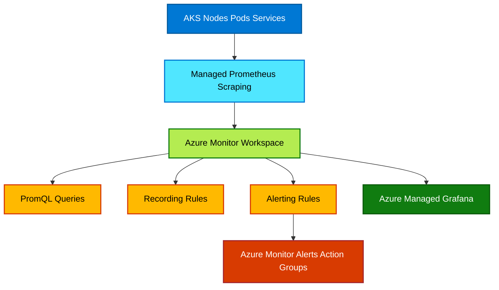

### Explanation

Azure Managed Prometheus provides managed collection and storage of Prometheus metrics integrated with Azure Monitor. It is especially valuable for AKS monitoring and Kubernetes-native metrics.

Core areas:

- **Metrics collection** from Kubernetes and Prometheus scrape targets.
- **Recording rules** to precompute commonly used aggregations.
- **Alerting rules** to turn PromQL expressions into actionable alerts.
- **Azure Monitor workspace** as the target metrics store.
- **Grafana integration** for PromQL dashboards.

Managed Prometheus complements, rather than replaces, Log Analytics. Use Prometheus for time-series metrics and logs for event-rich investigations.

### Azure CLI commands

```bash
# Create Azure Monitor workspace for Prometheus metrics
az monitor account create \
  --name amw-prometheus-prod \
  --resource-group rg-monitoring-prod \
  --location eastus

# Associate AKS cluster with Azure Monitor workspace (pattern may vary by CLI/API version)
az aks update \
  --name aks-prod-eastus \
  --resource-group rg-aks-prod \
  --enable-azure-monitor-metrics \
  --azure-monitor-workspace-resource-id /subscriptions/<subId>/resourceGroups/rg-monitoring-prod/providers/Microsoft.Monitor/accounts/amw-prometheus-prod

# Create Prometheus rule groups from YAML/ARM/Bicep-managed definitions as part of your platform pipeline
az resource create \
  --resource-group rg-monitoring-prod \
  --namespace Microsoft.AlertsManagement \
  --resource-type prometheusRuleGroups \
  --name aks-prod-rules \
  --location eastus \
  --properties @prometheus-rule-group.json
```

### PromQL examples

```promql
# Cluster CPU usage by node
sum(rate(container_cpu_usage_seconds_total{container!="",image!=""}[5m])) by (node)
```

```promql
# Pod restart rate
sum(increase(kube_pod_container_status_restarts_total[1h])) by (namespace, pod)
```

```promql
# API server latency P95
histogram_quantile(0.95, sum(rate(apiserver_request_duration_seconds_bucket[5m])) by (le))
```

### Best practices

- Use Prometheus for **high-cardinality time series metrics** and Kubernetes-native telemetry.
- Control label cardinality to contain cost and query performance issues.
- Define recording rules for frequently used aggregations.
- Route high-severity Prometheus alerts through action groups and incident tooling.
- Pair Prometheus dashboards with container logs and traces for triage.

---

## Operational Patterns and Best Practices Summary

### Mermaid diagram

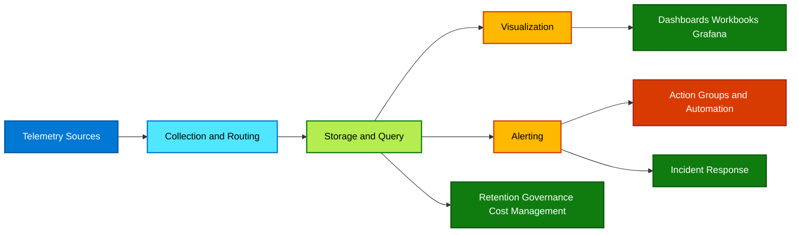

### Holistic explanation

A mature Azure observability program is built on a repeatable flow:

1. **Collect the right telemetry** from platform, network, operating system, containers, and applications.
2. **Route data intentionally** using diagnostic settings, Application Insights configuration, AMA, and DCRs.
3. **Store and query** logs, metrics, traces, and Prometheus data in the right backends.
4. **Visualize by audience** using dashboards, workbooks, and Grafana.
5. **Alert intelligently** on actionable signals only.
6. **Automate response** through action groups, Logic Apps, Functions, ITSM, and runbooks.
7. **Continuously optimize** retention, ingestion, data quality, and alert fidelity.

### Cross-cutting best practices

#### Architecture and governance

- Define an observability reference architecture for all subscriptions.
- Use Azure Policy to enforce diagnostic settings, AMA deployment, and workspace standards.
- Document workspace, AMW, Grafana, and alert ownership.
- Align monitoring design with landing zones and management groups.

#### Telemetry quality

- Monitor only what has operational value.
- Standardize tags, resource naming, environment labels, and role names.
- Correlate logs, metrics, and traces with consistent IDs.
- Prevent PII and secret leakage in telemetry.

#### Cost optimization

- Tune retention by data type and access frequency.
- Drop noisy logs and high-cardinality labels where unnecessary.
- Use archive or export for compliance data not needed in hot storage.
- Review ingestion costs monthly.

#### Alert maturity

- Every high-severity alert should map to a clear responder and runbook.
- Use dynamic thresholds and composite logic when static thresholds are noisy.
- Suppress alerts during planned maintenance.
- Measure alert volume, noise, MTTA, and false positive rate.

#### Visualization and operations

- Use dashboards for summary, workbooks for guided analysis, Grafana for advanced metrics.
- Create standard incident workbooks for compute, network, AKS, and app response.
- Keep all dashboard and workbook definitions version controlled.

#### Security and compliance

- Lock down who can query sensitive workspaces.
- Stream audit and security-relevant logs to durable storage or SIEM as needed.
- Validate retention and export against compliance needs.

---

## Quick Reference Command Catalog

### Workspace and query commands

```bash
az monitor log-analytics workspace create --resource-group rg-monitoring-prod --workspace-name law-observability-prod --location eastus
az monitor log-analytics workspace update --resource-group rg-monitoring-prod --workspace-name law-observability-prod --retention-time 90
az monitor log-analytics query --workspace law-observability-prod --analytics-query "Heartbeat | summarize LastSeen=max(TimeGenerated) by Computer" --timespan P1D
```

### Alerting commands

```bash
az monitor action-group create --name ag-prod-ops --resource-group rg-monitoring-prod --short-name prodops --action email OpsTeam ops-team@example.com
az monitor metrics alert create --name alert-vm-cpu-high --resource-group rg-monitoring-prod --scopes /subscriptions/<subId>/resourceGroups/rg-app/providers/Microsoft.Compute/virtualMachines/vm01 --condition "avg Percentage CPU > 80" --window-size 5m --evaluation-frequency 1m --severity 2 --action ag-prod-ops
az monitor activity-log alert create --name alert-service-health --resource-group rg-monitoring-prod --condition category=ServiceHealth --action-group /subscriptions/<subId>/resourceGroups/rg-monitoring-prod/providers/microsoft.insights/actionGroups/ag-prod-ops
```

### AMA and DCR commands

```bash
az monitor data-collection endpoint create --name dce-eastus-prod --resource-group rg-monitoring-prod --location eastus
az monitor data-collection rule create --name dcr-linux-syslog-perf --resource-group rg-monitoring-prod --location eastus --rule-file dcr-linux-syslog-perf.json
az monitor data-collection rule association create --name assoc-linuxvm01 --resource /subscriptions/<subId>/resourceGroups/rg-app/providers/Microsoft.Compute/virtualMachines/linuxvm01 --rule-id /subscriptions/<subId>/resourceGroups/rg-monitoring-prod/providers/Microsoft.Insights/dataCollectionRules/dcr-linux-syslog-perf
```

### Application Insights commands

```bash
az monitor app-insights component create --app appi-orders-prod --location eastus --resource-group rg-monitoring-prod --workspace /subscriptions/<subId>/resourceGroups/rg-monitoring-prod/providers/Microsoft.OperationalInsights/workspaces/law-observability-prod --application-type web
az monitor app-insights component show --app appi-orders-prod --resource-group rg-monitoring-prod
```

### Network Watcher commands

```bash
az network watcher configure --locations eastus --resource-group NetworkWatcherRG --enabled true
az network watcher test-ip-flow --resource-group rg-app --vm vm01 --direction Inbound --protocol TCP --local 10.0.0.4:443 --remote 203.0.113.10:50000
az network watcher test-connectivity --resource-group rg-app --source-resource vm01 --dest-address orders.example.com --dest-port 443
```

### AKS and Prometheus commands

```bash
az aks enable-addons --addons monitoring --name aks-prod-eastus --resource-group rg-aks-prod --workspace-resource-id /subscriptions/<subId>/resourceGroups/rg-monitoring-prod/providers/Microsoft.OperationalInsights/workspaces/law-observability-prod
az monitor account create --name amw-prometheus-prod --resource-group rg-monitoring-prod --location eastus
az aks update --name aks-prod-eastus --resource-group rg-aks-prod --enable-azure-monitor-metrics --azure-monitor-workspace-resource-id /subscriptions/<subId>/resourceGroups/rg-monitoring-prod/providers/Microsoft.Monitor/accounts/amw-prometheus-prod
```

---

## Extended Topic Notes

### Azure Monitor metrics design notes

- Metrics are stored as time series and optimized for fast numerical evaluation.
- Common aggregations include `Average`, `Total`, `Minimum`, `Maximum`, and `Count`.
- Dimensions allow slicing by instance, namespace, response code, or operation.
- Metric alerts can target resource groups, subscriptions, or multiple resources of the same type.
- Custom metrics are often used for business KPIs and app SLOs.

### Azure Monitor logs design notes

- Logs are best for detailed forensics and pattern analysis.
- Use KQL summarize, joins, parsing, and anomaly detection patterns.
- Logs can support alerting, workbooks, and export pipelines.
- Workspace ingestion should be reviewed for data volume and usefulness.

### Diagnostic settings design notes

- Most Azure services do not emit resource logs to Log Analytics until diagnostic settings are configured.
- Capture only required categories for noisy services such as firewalls, gateways, or security appliances.
- Standardize settings through policy or Terraform/Bicep modules.

### Data collection rules design notes

- Reuse DCRs for common server profiles.
- Separate performance counters, event logs, and custom text logs when lifecycle or ownership differs.
- Use transforms where supported to reduce unwanted ingestion.

### Action groups design notes

- Build action groups by severity and ownership domain.
- Prefer webhooks, Functions, Logic Apps, or ITSM for actionable incidents.
- Keep test action groups for nonproduction validation.

### Application Insights design notes

- For distributed systems, instrument all hops including API gateways, web apps, functions, workers, and message consumers.
- Track dependency calls to databases, storage, downstream APIs, and messaging systems.
- Use custom dimensions for tenant, environment, release version, and feature flags when needed.

### AMA migration notes

- Inventory servers still using MMA/OMS.
- Validate parity for required data sources before cutover.
- Migrate with pilot groups, then broad rollout.
- Ensure DCRs replace old workspace-based assumptions.

### Activity Log design notes

- Use Activity Log to answer “who changed what and when.”
- It is essential for change correlation during outages.
- Pair with RBAC reviews and Privileged Identity Management operations where relevant.

### Advisor design notes

- Use Advisor to detect optimization opportunities that may not be obvious from raw telemetry.
- Treat recommendations as inputs to governance and reliability programs.

### Service Health design notes

- Train responders to check Service Health early in broad incidents.
- Use health advisories to plan migrations for retirements and platform changes.

### Network Watcher design notes

- Combine topology, next hop, and IP flow verify before packet captures.
- Packet captures are powerful but should not be the first troubleshooting step.

### Workbooks design notes

- Create standard tabs for overview, compute, dependencies, errors, and alerts.
- Use workbook links to pivot into resource blades and incident runbooks.

### Dashboards design notes

- Dashboards are ideal for always-on portal views.
- They are less flexible than Workbooks for investigative workflows.

### Container Insights design notes

- Treat cluster health and workload health separately.
- Control log noise from sidecars and chatty workloads.
- Use Kubernetes labels carefully to prevent dimensional explosion.

### VM Insights design notes

- Use dependency mapping during app modernization and migration discovery.
- Baseline normal resource consumption to set meaningful alerts.

### Managed Grafana design notes

- Align dashboard ownership to services and teams.
- Store reusable panels and templates consistently.

### Managed Prometheus design notes

- Keep scrape scope intentional.
- Review recording and alerting rules alongside SLO definitions.
- Watch out for unbounded label sets.

---

## Sample KQL Library

```kusto
// CPU over 80% on average by VM over 15 minutes
Perf
| where TimeGenerated > ago(15m)
| where ObjectName == "Processor" and CounterName == "% Processor Time" and InstanceName == "_Total"
| summarize AvgCPU=avg(CounterValue) by Computer
| where AvgCPU > 80
```

```kusto
// Missing heartbeat over 10 minutes
Heartbeat
| summarize LastSeen=max(TimeGenerated) by Computer
| where LastSeen < ago(10m)
```

```kusto
// Top failing operations in Application Insights
requests
| where timestamp > ago(1h)
| where success == false
| summarize Failures=count() by name, operation_Name, cloud_RoleName
| top 20 by Failures desc
```

```kusto
// NSG-related activity log operations
AzureActivity
| where TimeGenerated > ago(7d)
| where OperationNameValue has "networkSecurityGroups"
| project TimeGenerated, Caller, ResourceGroup, OperationNameValue, ActivityStatusValue
```

```kusto
// AKS container error logs
ContainerLogV2
| where TimeGenerated > ago(30m)
| where LogMessage has_any ("error", "panic", "fail")
| summarize Count=count() by PodNamespace, PodName, ContainerName
| top 20 by Count desc
```

```kusto
// Advisor recommendations surfaced in AzureActivity when exported context exists
AzureActivity
| where TimeGenerated > ago(30d)
| where CategoryValue =~ "Recommendation"
| summarize Count=count() by ResourceProviderValue, ActivityStatusValue
```

---

## Sample PromQL Library

```promql
# Node memory usage percentage
100 * (1 - (node_memory_MemAvailable_bytes / node_memory_MemTotal_bytes))
```

```promql
# Pod CPU by namespace
sum(rate(container_cpu_usage_seconds_total{container!="",image!=""}[5m])) by (namespace)
```

```promql
# Cluster network receive bytes
sum(rate(container_network_receive_bytes_total[5m])) by (pod)
```

```promql
# Pod restarts in the last 6 hours
sum(increase(kube_pod_container_status_restarts_total[6h])) by (namespace, pod)
```

---

## Deployment Checklist

- [ ] Define workspace architecture.
- [ ] Create Log Analytics workspace(s).
- [ ] Create Azure Monitor workspace for managed Prometheus if needed.
- [ ] Create standard action groups.
- [ ] Enable diagnostic settings on critical resources.
- [ ] Deploy AMA to Azure and Arc servers.
- [ ] Associate DCRs with server groups.
- [ ] Enable Application Insights for critical applications.
- [ ] Enable Container Insights for AKS clusters.
- [ ] Enable VM Insights for critical compute.
- [ ] Enable Service Health and Activity Log alerts.
- [ ] Build operational workbooks and dashboards.
- [ ] Integrate Grafana where advanced metrics views are required.
- [ ] Review retention, sampling, and ingestion cost.
- [ ] Validate alert routing and on-call response.

---

## Frequently Used Azure Resource Types

- `Microsoft.Insights/components` for Application Insights
- `Microsoft.OperationalInsights/workspaces` for Log Analytics workspaces
- `Microsoft.Insights/actionGroups` for action groups
- `Microsoft.Insights/metricAlerts` for metric alerts
- `Microsoft.Insights/scheduledQueryRules` for log alerts
- `Microsoft.Insights/activityLogAlerts` for activity log alerts
- `Microsoft.Insights/dataCollectionRules` for DCRs
- `Microsoft.Insights/dataCollectionEndpoints` for DCEs
- `Microsoft.Dashboard/grafana` for Azure Managed Grafana
- `Microsoft.Monitor/accounts` for Azure Monitor workspaces used in managed Prometheus scenarios

---

## Section-by-Section Operational Deep Dive

### Azure Monitor operational checklist

1. Define monitoring standards for every landing zone.
2. Separate golden signals: latency, traffic, errors, saturation.
3. Use metrics for rapid evaluation and logs for context-rich queries.
4. Enable platform logs only where there is operational value.
5. Review action group ownership quarterly.
6. Validate diagnostic settings after new resource deployments.
7. Build baseline alerts before advanced anomaly detection.
8. Adopt tags like env, service, owner, criticality for filtering.
9. Use policy to enforce telemetry routing at scale.
10. Track ingestion cost trends per subscription or workload.

### Example operational questions

- How is azure monitor helping with: define monitoring standards for every landing zone?
- How is azure monitor helping with: separate golden signals: latency, traffic, errors, saturation?
- How is azure monitor helping with: use metrics for rapid evaluation and logs for context-rich queries?
- How is azure monitor helping with: enable platform logs only where there is operational value?
- How is azure monitor helping with: review action group ownership quarterly?
- How is azure monitor helping with: validate diagnostic settings after new resource deployments?
- How is azure monitor helping with: build baseline alerts before advanced anomaly detection?
- How is azure monitor helping with: adopt tags like env, service, owner, criticality for filtering?
- How is azure monitor helping with: use policy to enforce telemetry routing at scale?
- How is azure monitor helping with: track ingestion cost trends per subscription or workload?

### Notes

- Azure Monitor note 1: Define monitoring standards for every landing zone.
- Azure Monitor note 2: Separate golden signals: latency, traffic, errors, saturation.
- Azure Monitor note 3: Use metrics for rapid evaluation and logs for context-rich queries.
- Azure Monitor note 4: Enable platform logs only where there is operational value.
- Azure Monitor note 5: Review action group ownership quarterly.
- Azure Monitor note 6: Validate diagnostic settings after new resource deployments.
- Azure Monitor note 7: Build baseline alerts before advanced anomaly detection.
- Azure Monitor note 8: Adopt tags like env, service, owner, criticality for filtering.
- Azure Monitor note 9: Use policy to enforce telemetry routing at scale.
- Azure Monitor note 10: Track ingestion cost trends per subscription or workload.

### Log Analytics Workspace operational checklist

1. Choose between centralized and distributed workspace topology deliberately.
2. Use naming that encodes region, environment, and purpose.
3. Document retention and archive policies per workspace.
4. Control access through RBAC and least privilege.
5. Use saved queries and functions for reusable logic.
6. Avoid overly broad wildcard searches in expensive workbooks.
7. Use resource-context access where appropriate.
8. Retain hot data only as long as operationally needed.
9. Test cross-workspace queries for latency before operationalizing.
10. Tag workspaces with owner and support tier.

### Example operational questions

- How is log analytics workspace helping with: choose between centralized and distributed workspace topology deliberately?
- How is log analytics workspace helping with: use naming that encodes region, environment, and purpose?
- How is log analytics workspace helping with: document retention and archive policies per workspace?
- How is log analytics workspace helping with: control access through rbac and least privilege?
- How is log analytics workspace helping with: use saved queries and functions for reusable logic?
- How is log analytics workspace helping with: avoid overly broad wildcard searches in expensive workbooks?
- How is log analytics workspace helping with: use resource-context access where appropriate?
- How is log analytics workspace helping with: retain hot data only as long as operationally needed?
- How is log analytics workspace helping with: test cross-workspace queries for latency before operationalizing?
- How is log analytics workspace helping with: tag workspaces with owner and support tier?

### Notes

- Log Analytics Workspace note 1: Choose between centralized and distributed workspace topology deliberately.
- Log Analytics Workspace note 2: Use naming that encodes region, environment, and purpose.
- Log Analytics Workspace note 3: Document retention and archive policies per workspace.
- Log Analytics Workspace note 4: Control access through RBAC and least privilege.
- Log Analytics Workspace note 5: Use saved queries and functions for reusable logic.
- Log Analytics Workspace note 6: Avoid overly broad wildcard searches in expensive workbooks.
- Log Analytics Workspace note 7: Use resource-context access where appropriate.
- Log Analytics Workspace note 8: Retain hot data only as long as operationally needed.
- Log Analytics Workspace note 9: Test cross-workspace queries for latency before operationalizing.
- Log Analytics Workspace note 10: Tag workspaces with owner and support tier.

### Azure Monitor Alerts operational checklist

1. Design alerts around user impact and service objectives.
2. Avoid alerting on every single infrastructure fluctuation.
3. Document severity definitions clearly.
4. Use dynamic thresholds for cyclical workloads.
5. Tune log alert query windows to reduce duplicates.
6. Route critical alerts to incident platforms instead of inboxes alone.
7. Include runbook URLs and dashboard links in alert descriptions.
8. Suppress alerts during approved maintenance.
9. Continuously review noisy rules.
10. Measure alert quality as an engineering metric.

### Example operational questions

- How is azure monitor alerts helping with: design alerts around user impact and service objectives?
- How is azure monitor alerts helping with: avoid alerting on every single infrastructure fluctuation?
- How is azure monitor alerts helping with: document severity definitions clearly?
- How is azure monitor alerts helping with: use dynamic thresholds for cyclical workloads?
- How is azure monitor alerts helping with: tune log alert query windows to reduce duplicates?
- How is azure monitor alerts helping with: route critical alerts to incident platforms instead of inboxes alone?
- How is azure monitor alerts helping with: include runbook urls and dashboard links in alert descriptions?
- How is azure monitor alerts helping with: suppress alerts during approved maintenance?
- How is azure monitor alerts helping with: continuously review noisy rules?
- How is azure monitor alerts helping with: measure alert quality as an engineering metric?

### Notes

- Azure Monitor Alerts note 1: Design alerts around user impact and service objectives.
- Azure Monitor Alerts note 2: Avoid alerting on every single infrastructure fluctuation.
- Azure Monitor Alerts note 3: Document severity definitions clearly.
- Azure Monitor Alerts note 4: Use dynamic thresholds for cyclical workloads.
- Azure Monitor Alerts note 5: Tune log alert query windows to reduce duplicates.
- Azure Monitor Alerts note 6: Route critical alerts to incident platforms instead of inboxes alone.
- Azure Monitor Alerts note 7: Include runbook URLs and dashboard links in alert descriptions.
- Azure Monitor Alerts note 8: Suppress alerts during approved maintenance.
- Azure Monitor Alerts note 9: Continuously review noisy rules.
- Azure Monitor Alerts note 10: Measure alert quality as an engineering metric.

### Application Insights operational checklist

1. Instrument both synchronous and asynchronous paths.
2. Use dependency correlation across queues and APIs.
3. Capture meaningful custom events and metrics.
4. Protect secrets and personal data in logs and traces.
5. Use availability tests for public and private endpoints where possible.
6. Adopt sampling with care and validate incident visibility.
7. Track release versions in telemetry dimensions.
8. Monitor exception rate and p95 latency together.
9. Use live metrics during active incidents only.
10. Review smart detection suggestions but validate with domain context.

### Example operational questions

- How is application insights helping with: instrument both synchronous and asynchronous paths?
- How is application insights helping with: use dependency correlation across queues and apis?
- How is application insights helping with: capture meaningful custom events and metrics?
- How is application insights helping with: protect secrets and personal data in logs and traces?
- How is application insights helping with: use availability tests for public and private endpoints where possible?
- How is application insights helping with: adopt sampling with care and validate incident visibility?
- How is application insights helping with: track release versions in telemetry dimensions?
- How is application insights helping with: monitor exception rate and p95 latency together?
- How is application insights helping with: use live metrics during active incidents only?
- How is application insights helping with: review smart detection suggestions but validate with domain context?

### Notes

- Application Insights note 1: Instrument both synchronous and asynchronous paths.
- Application Insights note 2: Use dependency correlation across queues and APIs.
- Application Insights note 3: Capture meaningful custom events and metrics.
- Application Insights note 4: Protect secrets and personal data in logs and traces.
- Application Insights note 5: Use availability tests for public and private endpoints where possible.
- Application Insights note 6: Adopt sampling with care and validate incident visibility.
- Application Insights note 7: Track release versions in telemetry dimensions.
- Application Insights note 8: Monitor exception rate and p95 latency together.
- Application Insights note 9: Use live metrics during active incidents only.
- Application Insights note 10: Review smart detection suggestions but validate with domain context.

### Azure Monitor Agent (AMA) operational checklist

1. Standardize DCR profiles for Linux, Windows, and special workloads.
2. Avoid copy-paste DCR sprawl; build reusable standards.
3. Validate transformations before broad rollout.
4. Track agent versioning and deployment state.
5. Use Azure Policy or fleet automation for installation.
6. Test DCR updates in lower environments first.
7. Inventory all legacy MMA dependencies before migration.
8. Use DCE where private link or routing design requires it.
9. Monitor heartbeat and ingestion health after any DCR change.
10. Document multi-homing intent clearly.

### Example operational questions

- How is azure monitor agent (ama) helping with: standardize dcr profiles for linux, windows, and special workloads?
- How is azure monitor agent (ama) helping with: avoid copy-paste dcr sprawl; build reusable standards?
- How is azure monitor agent (ama) helping with: validate transformations before broad rollout?
- How is azure monitor agent (ama) helping with: track agent versioning and deployment state?
- How is azure monitor agent (ama) helping with: use azure policy or fleet automation for installation?
- How is azure monitor agent (ama) helping with: test dcr updates in lower environments first?
- How is azure monitor agent (ama) helping with: inventory all legacy mma dependencies before migration?
- How is azure monitor agent (ama) helping with: use dce where private link or routing design requires it?
- How is azure monitor agent (ama) helping with: monitor heartbeat and ingestion health after any dcr change?
- How is azure monitor agent (ama) helping with: document multi-homing intent clearly?

### Notes

- Azure Monitor Agent (AMA) note 1: Standardize DCR profiles for Linux, Windows, and special workloads.
- Azure Monitor Agent (AMA) note 2: Avoid copy-paste DCR sprawl; build reusable standards.
- Azure Monitor Agent (AMA) note 3: Validate transformations before broad rollout.
- Azure Monitor Agent (AMA) note 4: Track agent versioning and deployment state.
- Azure Monitor Agent (AMA) note 5: Use Azure Policy or fleet automation for installation.
- Azure Monitor Agent (AMA) note 6: Test DCR updates in lower environments first.
- Azure Monitor Agent (AMA) note 7: Inventory all legacy MMA dependencies before migration.
- Azure Monitor Agent (AMA) note 8: Use DCE where private link or routing design requires it.
- Azure Monitor Agent (AMA) note 9: Monitor heartbeat and ingestion health after any DCR change.
- Azure Monitor Agent (AMA) note 10: Document multi-homing intent clearly.

### Azure Activity Log operational checklist

1. Create alerts for deletes, writes to critical resources, and RBAC changes.
2. Export logs quickly because default retention is limited.
3. Correlate control plane events with incident timelines.
4. Store long-term audit trails in durable storage.
5. Use Activity Log to validate automation behavior.
6. Monitor policy compliance and remediation events.
7. Track service and resource health through exported logs.
8. Limit investigation blind spots by centralizing subscription exports.
9. Regularly review who is making changes in production.
10. Map high-risk operations to responder playbooks.

### Example operational questions

- How is azure activity log helping with: create alerts for deletes, writes to critical resources, and rbac changes?
- How is azure activity log helping with: export logs quickly because default retention is limited?
- How is azure activity log helping with: correlate control plane events with incident timelines?
- How is azure activity log helping with: store long-term audit trails in durable storage?
- How is azure activity log helping with: use activity log to validate automation behavior?
- How is azure activity log helping with: monitor policy compliance and remediation events?
- How is azure activity log helping with: track service and resource health through exported logs?
- How is azure activity log helping with: limit investigation blind spots by centralizing subscription exports?
- How is azure activity log helping with: regularly review who is making changes in production?
- How is azure activity log helping with: map high-risk operations to responder playbooks?

### Notes

- Azure Activity Log note 1: Create alerts for deletes, writes to critical resources, and RBAC changes.
- Azure Activity Log note 2: Export logs quickly because default retention is limited.
- Azure Activity Log note 3: Correlate control plane events with incident timelines.
- Azure Activity Log note 4: Store long-term audit trails in durable storage.
- Azure Activity Log note 5: Use Activity Log to validate automation behavior.
- Azure Activity Log note 6: Monitor policy compliance and remediation events.
- Azure Activity Log note 7: Track service and resource health through exported logs.
- Azure Activity Log note 8: Limit investigation blind spots by centralizing subscription exports.
- Azure Activity Log note 9: Regularly review who is making changes in production.
- Azure Activity Log note 10: Map high-risk operations to responder playbooks.

### Azure Advisor operational checklist

1. Treat Advisor as preventive operations input.
2. Review recommendations on a recurring cadence.
3. Separate quick wins from structural modernization work.
4. Validate cost recommendations against performance requirements.
5. Track exceptions with business justification.
6. Use recommendations to prioritize engineering backlog items.
7. Correlate with observability data before acting.
8. Assign ownership for remediation.
9. Measure closure rate over time.
10. Use reliability recommendations in resilience planning.

### Example operational questions

- How is azure advisor helping with: treat advisor as preventive operations input?
- How is azure advisor helping with: review recommendations on a recurring cadence?
- How is azure advisor helping with: separate quick wins from structural modernization work?
- How is azure advisor helping with: validate cost recommendations against performance requirements?
- How is azure advisor helping with: track exceptions with business justification?
- How is azure advisor helping with: use recommendations to prioritize engineering backlog items?
- How is azure advisor helping with: correlate with observability data before acting?
- How is azure advisor helping with: assign ownership for remediation?
- How is azure advisor helping with: measure closure rate over time?
- How is azure advisor helping with: use reliability recommendations in resilience planning?

### Notes

- Azure Advisor note 1: Treat Advisor as preventive operations input.
- Azure Advisor note 2: Review recommendations on a recurring cadence.
- Azure Advisor note 3: Separate quick wins from structural modernization work.
- Azure Advisor note 4: Validate cost recommendations against performance requirements.
- Azure Advisor note 5: Track exceptions with business justification.
- Azure Advisor note 6: Use recommendations to prioritize engineering backlog items.
- Azure Advisor note 7: Correlate with observability data before acting.
- Azure Advisor note 8: Assign ownership for remediation.
- Azure Advisor note 9: Measure closure rate over time.
- Azure Advisor note 10: Use reliability recommendations in resilience planning.

### Azure Service Health operational checklist

1. Subscribe all production subscriptions to health alerts.
2. Ensure alerts reach on-call and change managers.
3. Validate region and service filters carefully.
4. Use planned maintenance notices to prepare workload changes.
5. Check Service Health early during widespread incidents.
6. Document how teams distinguish provider issues from tenant issues.
7. Track health advisories related to retirement or platform changes.
8. Use action groups for standardized handling.
9. Avoid duplicate human escalation before provider-side validation.
10. Review past health events in postmortems.

### Example operational questions

- How is azure service health helping with: subscribe all production subscriptions to health alerts?
- How is azure service health helping with: ensure alerts reach on-call and change managers?
- How is azure service health helping with: validate region and service filters carefully?
- How is azure service health helping with: use planned maintenance notices to prepare workload changes?
- How is azure service health helping with: check service health early during widespread incidents?
- How is azure service health helping with: document how teams distinguish provider issues from tenant issues?
- How is azure service health helping with: track health advisories related to retirement or platform changes?
- How is azure service health helping with: use action groups for standardized handling?
- How is azure service health helping with: avoid duplicate human escalation before provider-side validation?
- How is azure service health helping with: review past health events in postmortems?

### Notes

- Azure Service Health note 1: Subscribe all production subscriptions to health alerts.
- Azure Service Health note 2: Ensure alerts reach on-call and change managers.
- Azure Service Health note 3: Validate region and service filters carefully.
- Azure Service Health note 4: Use planned maintenance notices to prepare workload changes.
- Azure Service Health note 5: Check Service Health early during widespread incidents.
- Azure Service Health note 6: Document how teams distinguish provider issues from tenant issues.
- Azure Service Health note 7: Track health advisories related to retirement or platform changes.
- Azure Service Health note 8: Use action groups for standardized handling.
- Azure Service Health note 9: Avoid duplicate human escalation before provider-side validation.
- Azure Service Health note 10: Review past health events in postmortems.

### Network Watcher operational checklist

1. Enable Network Watcher in all active regions.
2. Use connection monitor for critical dependencies.
3. Validate NSG decisions with IP flow verify before deeper capture.
4. Use next hop to confirm routing assumptions.
5. Limit packet captures to focused troubleshooting windows.
6. Review VPN diagnostics during hybrid incidents.
7. Export flow logs where security visibility requires it.
8. Maintain network troubleshooting runbooks.
9. Correlate network findings with app and VM telemetry.
10. Use topology views during migration and incident analysis.

### Example operational questions

- How is network watcher helping with: enable network watcher in all active regions?
- How is network watcher helping with: use connection monitor for critical dependencies?
- How is network watcher helping with: validate nsg decisions with ip flow verify before deeper capture?
- How is network watcher helping with: use next hop to confirm routing assumptions?
- How is network watcher helping with: limit packet captures to focused troubleshooting windows?
- How is network watcher helping with: review vpn diagnostics during hybrid incidents?
- How is network watcher helping with: export flow logs where security visibility requires it?
- How is network watcher helping with: maintain network troubleshooting runbooks?
- How is network watcher helping with: correlate network findings with app and vm telemetry?
- How is network watcher helping with: use topology views during migration and incident analysis?

### Notes

- Network Watcher note 1: Enable Network Watcher in all active regions.
- Network Watcher note 2: Use connection monitor for critical dependencies.
- Network Watcher note 3: Validate NSG decisions with IP flow verify before deeper capture.
- Network Watcher note 4: Use next hop to confirm routing assumptions.
- Network Watcher note 5: Limit packet captures to focused troubleshooting windows.
- Network Watcher note 6: Review VPN diagnostics during hybrid incidents.
- Network Watcher note 7: Export flow logs where security visibility requires it.
- Network Watcher note 8: Maintain network troubleshooting runbooks.
- Network Watcher note 9: Correlate network findings with app and VM telemetry.
- Network Watcher note 10: Use topology views during migration and incident analysis.

### Azure Workbooks operational checklist

1. Create standard workbook templates by service type.
2. Use parameters for region, app, cluster, and environment.
3. Provide summary tiles and drill-down tabs.
4. Keep long-running queries out of executive views.
5. Use markdown to explain how to read each chart.
6. Add links to alerts, dashboards, and runbooks.
7. Version workbook JSON in source control.
8. Review workbook performance as data volume grows.
9. Prefer workbooks over static dashboards for investigations.
10. Align workbook structure to incident workflows.

### Example operational questions

- How is azure workbooks helping with: create standard workbook templates by service type?
- How is azure workbooks helping with: use parameters for region, app, cluster, and environment?
- How is azure workbooks helping with: provide summary tiles and drill-down tabs?
- How is azure workbooks helping with: keep long-running queries out of executive views?
- How is azure workbooks helping with: use markdown to explain how to read each chart?
- How is azure workbooks helping with: add links to alerts, dashboards, and runbooks?
- How is azure workbooks helping with: version workbook json in source control?
- How is azure workbooks helping with: review workbook performance as data volume grows?
- How is azure workbooks helping with: prefer workbooks over static dashboards for investigations?
- How is azure workbooks helping with: align workbook structure to incident workflows?

### Notes

- Azure Workbooks note 1: Create standard workbook templates by service type.
- Azure Workbooks note 2: Use parameters for region, app, cluster, and environment.
- Azure Workbooks note 3: Provide summary tiles and drill-down tabs.
- Azure Workbooks note 4: Keep long-running queries out of executive views.
- Azure Workbooks note 5: Use markdown to explain how to read each chart.
- Azure Workbooks note 6: Add links to alerts, dashboards, and runbooks.
- Azure Workbooks note 7: Version workbook JSON in source control.
- Azure Workbooks note 8: Review workbook performance as data volume grows.
- Azure Workbooks note 9: Prefer workbooks over static dashboards for investigations.
- Azure Workbooks note 10: Align workbook structure to incident workflows.

### Azure Dashboards operational checklist

1. Keep dashboards concise and audience-specific.
2. Use shared dashboards for common NOC views.
3. Pin only high-value metrics and charts.
4. Version dashboard JSON.
5. Review stale tiles and remove dead panels.
6. Use dashboards for quick awareness, not root-cause analysis.
7. Align layout to operational priorities.
8. Restrict editing permissions.
9. Link dashboard tiles to deeper workbooks when possible.
10. Keep production and nonproduction views separate.

### Example operational questions

- How is azure dashboards helping with: keep dashboards concise and audience-specific?
- How is azure dashboards helping with: use shared dashboards for common noc views?
- How is azure dashboards helping with: pin only high-value metrics and charts?
- How is azure dashboards helping with: version dashboard json?
- How is azure dashboards helping with: review stale tiles and remove dead panels?
- How is azure dashboards helping with: use dashboards for quick awareness, not root-cause analysis?
- How is azure dashboards helping with: align layout to operational priorities?
- How is azure dashboards helping with: restrict editing permissions?
- How is azure dashboards helping with: link dashboard tiles to deeper workbooks when possible?
- How is azure dashboards helping with: keep production and nonproduction views separate?

### Notes

- Azure Dashboards note 1: Keep dashboards concise and audience-specific.
- Azure Dashboards note 2: Use shared dashboards for common NOC views.
- Azure Dashboards note 3: Pin only high-value metrics and charts.
- Azure Dashboards note 4: Version dashboard JSON.
- Azure Dashboards note 5: Review stale tiles and remove dead panels.
- Azure Dashboards note 6: Use dashboards for quick awareness, not root-cause analysis.
- Azure Dashboards note 7: Align layout to operational priorities.
- Azure Dashboards note 8: Restrict editing permissions.
- Azure Dashboards note 9: Link dashboard tiles to deeper workbooks when possible.
- Azure Dashboards note 10: Keep production and nonproduction views separate.

### Container Insights operational checklist

1. Monitor node, pod, and workload health separately.
2. Pair container logs with Prometheus metrics and traces.
3. Control noisy sidecar logging.
4. Track restart loops and crash patterns.
5. Use namespace-level ownership and dashboards.
6. Alert on control plane and node pressure conditions.
7. Review data volume from short-lived pods.
8. Standardize AKS monitoring configuration.
9. Validate monitoring during cluster upgrades.
10. Map key SLOs to workload-level views.

### Example operational questions

- How is container insights helping with: monitor node, pod, and workload health separately?
- How is container insights helping with: pair container logs with prometheus metrics and traces?
- How is container insights helping with: control noisy sidecar logging?
- How is container insights helping with: track restart loops and crash patterns?
- How is container insights helping with: use namespace-level ownership and dashboards?
- How is container insights helping with: alert on control plane and node pressure conditions?
- How is container insights helping with: review data volume from short-lived pods?
- How is container insights helping with: standardize aks monitoring configuration?
- How is container insights helping with: validate monitoring during cluster upgrades?
- How is container insights helping with: map key slos to workload-level views?

### Notes

- Container Insights note 1: Monitor node, pod, and workload health separately.
- Container Insights note 2: Pair container logs with Prometheus metrics and traces.
- Container Insights note 3: Control noisy sidecar logging.
- Container Insights note 4: Track restart loops and crash patterns.
- Container Insights note 5: Use namespace-level ownership and dashboards.
- Container Insights note 6: Alert on control plane and node pressure conditions.
- Container Insights note 7: Review data volume from short-lived pods.
- Container Insights note 8: Standardize AKS monitoring configuration.
- Container Insights note 9: Validate monitoring during cluster upgrades.
- Container Insights note 10: Map key SLOs to workload-level views.

### VM Insights operational checklist

1. Prioritize critical VM fleets first.
2. Track heartbeat, disk, CPU, memory, and network baselines.
3. Use dependency mapping before network or firewall changes.
4. Correlate VM health with patching and deployment schedules.
5. Apply standard alerts across compute tiers.
6. Investigate stale heartbeat quickly.
7. Use lower environments to validate collection changes.
8. Document critical inter-host dependencies.
9. Review oversubscribed or undersized systems regularly.
10. Use VM Insights as a baseline, not the only source of truth.

### Example operational questions

- How is vm insights helping with: prioritize critical vm fleets first?
- How is vm insights helping with: track heartbeat, disk, cpu, memory, and network baselines?
- How is vm insights helping with: use dependency mapping before network or firewall changes?
- How is vm insights helping with: correlate vm health with patching and deployment schedules?
- How is vm insights helping with: apply standard alerts across compute tiers?
- How is vm insights helping with: investigate stale heartbeat quickly?
- How is vm insights helping with: use lower environments to validate collection changes?
- How is vm insights helping with: document critical inter-host dependencies?
- How is vm insights helping with: review oversubscribed or undersized systems regularly?
- How is vm insights helping with: use vm insights as a baseline, not the only source of truth?

### Notes

- VM Insights note 1: Prioritize critical VM fleets first.
- VM Insights note 2: Track heartbeat, disk, CPU, memory, and network baselines.
- VM Insights note 3: Use dependency mapping before network or firewall changes.
- VM Insights note 4: Correlate VM health with patching and deployment schedules.
- VM Insights note 5: Apply standard alerts across compute tiers.
- VM Insights note 6: Investigate stale heartbeat quickly.
- VM Insights note 7: Use lower environments to validate collection changes.
- VM Insights note 8: Document critical inter-host dependencies.
- VM Insights note 9: Review oversubscribed or undersized systems regularly.
- VM Insights note 10: Use VM Insights as a baseline, not the only source of truth.

### Azure Managed Grafana operational checklist

1. Use folders and naming standards for dashboard organization.
2. Source-control dashboard definitions where possible.
3. Use Azure AD and RBAC for access.
4. Avoid duplicate teams creating competing dashboards.
5. Use Grafana for Prometheus-centric and mixed-source views.
6. Review dashboard load times and query efficiency.
7. Separate team workspaces or folders by domain.
8. Add annotations for incidents and deployments.
9. Align dashboards to SLO review and on-call use.
10. Document canonical dashboards per service.

### Example operational questions

- How is azure managed grafana helping with: use folders and naming standards for dashboard organization?
- How is azure managed grafana helping with: source-control dashboard definitions where possible?
- How is azure managed grafana helping with: use azure ad and rbac for access?
- How is azure managed grafana helping with: avoid duplicate teams creating competing dashboards?
- How is azure managed grafana helping with: use grafana for prometheus-centric and mixed-source views?
- How is azure managed grafana helping with: review dashboard load times and query efficiency?
- How is azure managed grafana helping with: separate team workspaces or folders by domain?
- How is azure managed grafana helping with: add annotations for incidents and deployments?
- How is azure managed grafana helping with: align dashboards to slo review and on-call use?
- How is azure managed grafana helping with: document canonical dashboards per service?

### Notes

- Azure Managed Grafana note 1: Use folders and naming standards for dashboard organization.
- Azure Managed Grafana note 2: Source-control dashboard definitions where possible.
- Azure Managed Grafana note 3: Use Azure AD and RBAC for access.
- Azure Managed Grafana note 4: Avoid duplicate teams creating competing dashboards.
- Azure Managed Grafana note 5: Use Grafana for Prometheus-centric and mixed-source views.
- Azure Managed Grafana note 6: Review dashboard load times and query efficiency.
- Azure Managed Grafana note 7: Separate team workspaces or folders by domain.
- Azure Managed Grafana note 8: Add annotations for incidents and deployments.
- Azure Managed Grafana note 9: Align dashboards to SLO review and on-call use.
- Azure Managed Grafana note 10: Document canonical dashboards per service.

### Azure Managed Prometheus operational checklist

1. Define scrape targets intentionally.
2. Control label cardinality and dimensional explosion.
3. Use recording rules for frequent SLI calculations.
4. Alert from meaningful service indicators.
5. Integrate alerts with action groups and incident systems.
6. Review query cost and performance in Grafana.
7. Keep app metrics and platform metrics organized clearly.
8. Correlate PromQL views with logs and traces.
9. Protect against accidental scraping of sensitive endpoints.
10. Treat metrics taxonomy as a product.

### Example operational questions

- How is azure managed prometheus helping with: define scrape targets intentionally?
- How is azure managed prometheus helping with: control label cardinality and dimensional explosion?
- How is azure managed prometheus helping with: use recording rules for frequent sli calculations?
- How is azure managed prometheus helping with: alert from meaningful service indicators?
- How is azure managed prometheus helping with: integrate alerts with action groups and incident systems?
- How is azure managed prometheus helping with: review query cost and performance in grafana?
- How is azure managed prometheus helping with: keep app metrics and platform metrics organized clearly?
- How is azure managed prometheus helping with: correlate promql views with logs and traces?
- How is azure managed prometheus helping with: protect against accidental scraping of sensitive endpoints?
- How is azure managed prometheus helping with: treat metrics taxonomy as a product?

### Notes

- Azure Managed Prometheus note 1: Define scrape targets intentionally.
- Azure Managed Prometheus note 2: Control label cardinality and dimensional explosion.
- Azure Managed Prometheus note 3: Use recording rules for frequent SLI calculations.
- Azure Managed Prometheus note 4: Alert from meaningful service indicators.
- Azure Managed Prometheus note 5: Integrate alerts with action groups and incident systems.
- Azure Managed Prometheus note 6: Review query cost and performance in Grafana.
- Azure Managed Prometheus note 7: Keep app metrics and platform metrics organized clearly.
- Azure Managed Prometheus note 8: Correlate PromQL views with logs and traces.
- Azure Managed Prometheus note 9: Protect against accidental scraping of sensitive endpoints.
- Azure Managed Prometheus note 10: Treat metrics taxonomy as a product.

---

## Final Recommendations

- Build a layered monitoring strategy across metrics, logs, traces, events, and synthetic tests.
- Standardize workspace, alert, and dashboard patterns early.
- Invest in alert quality as much as in telemetry quantity.
- Use Azure-native tools together rather than in isolation.
- Continuously review cost, retention, routing, and responder effectiveness.

