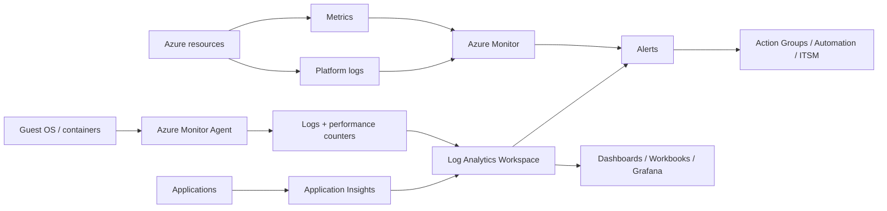
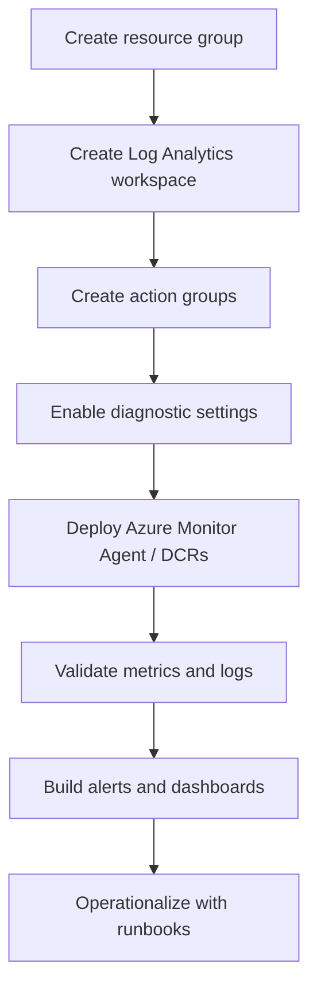
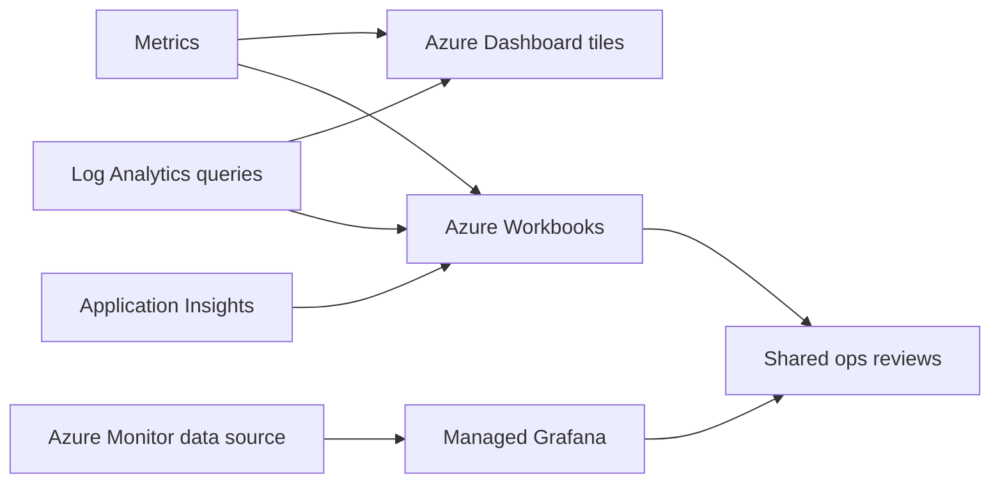
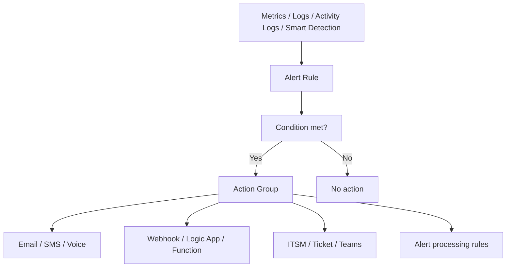
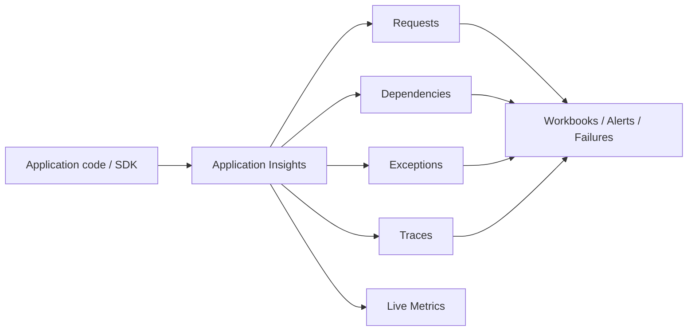
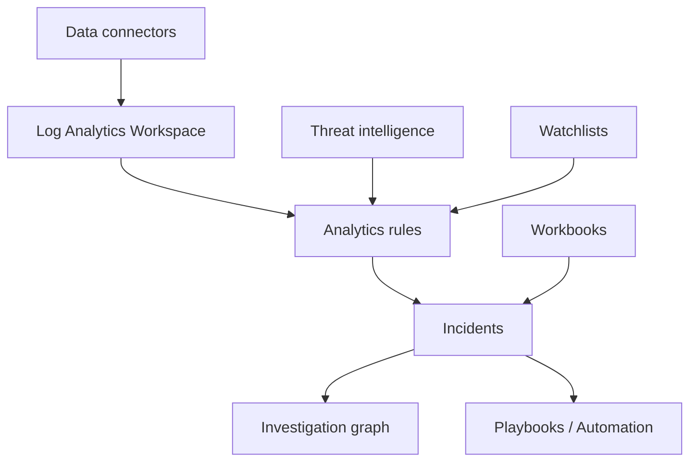
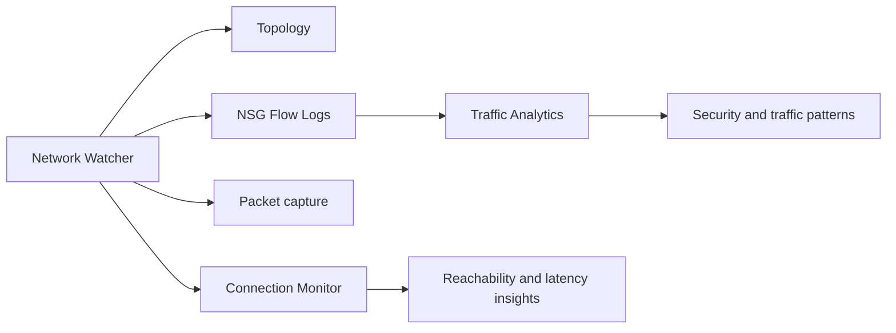
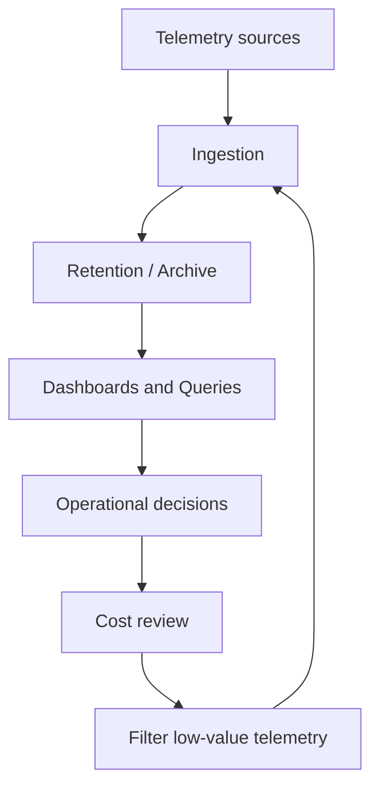

# 📈 Azure Logging, Monitoring, and Dashboard Setup

> A comprehensive guide to Azure Monitor, Log Analytics, dashboards, alerts, Application Insights, Sentinel, network monitoring, and cost visibility.

This document is designed for cloud engineers, SREs, platform teams, security operations teams, and FinOps practitioners building an observable Azure landing zone.

## 🧭 How to use this guide

- Start with the architecture overview to understand how Azure Monitor data flows.
- Use the setup sections when enabling diagnostics and workspaces in new subscriptions.
- Copy KQL queries and adapt table names to your environment.
- Use dashboard and workbook sections to standardize shared operational views.
- Use alerting and Sentinel sections to connect telemetry to action.

## 🔧 Common variables used in examples

```bash
export SUBSCRIPTION_ID=<subscription-id>
export LOCATION=eastus
export RG_MON=rg-monitoring-prod
export LAW=law-platform-prod
export ACTION_GROUP=ag-platform-ops
export VM_ID=/subscriptions/<subId>/resourceGroups/rg-app/providers/Microsoft.Compute/virtualMachines/vm01
export VNET_ID=/subscriptions/<subId>/resourceGroups/rg-net/providers/Microsoft.Network/virtualNetworks/vnet-hub-prod
export APPINSIGHTS=appi-orders-prod
export DASHBOARD_NAME=dashboard-platform-ops
```

## 🗂️ Table of contents

1. [Azure Monitoring Overview](#1-azure-monitoring-overview)
2. [Azure Monitor Setup (Basic to Advanced)](#2-azure-monitor-setup-basic-to-advanced)
3. [Azure Log Analytics & KQL](#3-azure-log-analytics--kql)
4. [Azure Dashboards](#4-azure-dashboards)
5. [Alerting](#5-alerting)
6. [Application Insights](#6-application-insights)
7. [Azure Sentinel (SIEM)](#7-azure-sentinel-siem)
8. [Network Monitoring](#8-network-monitoring)
9. [Cost Monitoring](#9-cost-monitoring)

## 1. Azure Monitoring Overview

Azure Monitor is the umbrella observability platform for metrics, logs, traces, events, and alerting across Azure resources, guest operating systems, containers, and applications. A mature Azure monitoring design combines fast signals, rich investigative data, automation, and clear ownership.



### Platform metrics

Near real-time numeric signals for resource health and capacity.

- Decide retention, ownership, and access model early.
- Avoid collecting everything blindly; align telemetry to operational decisions.
- Tag important resources so dashboards and alerts can be filtered meaningfully.

### Platform logs

Control-plane and resource-specific events emitted by Azure services.

- Decide retention, ownership, and access model early.
- Avoid collecting everything blindly; align telemetry to operational decisions.
- Tag important resources so dashboards and alerts can be filtered meaningfully.

### Guest logs and performance data

OS-level telemetry collected by Azure Monitor Agent or related integrations.

- Decide retention, ownership, and access model early.
- Avoid collecting everything blindly; align telemetry to operational decisions.
- Tag important resources so dashboards and alerts can be filtered meaningfully.

### Application telemetry

Requests, dependencies, exceptions, traces, and custom events from apps.

- Decide retention, ownership, and access model early.
- Avoid collecting everything blindly; align telemetry to operational decisions.
- Tag important resources so dashboards and alerts can be filtered meaningfully.

### Security telemetry

Signals from Defender, Sentinel, NSG flow logs, and identity services.

- Decide retention, ownership, and access model early.
- Avoid collecting everything blindly; align telemetry to operational decisions.
- Tag important resources so dashboards and alerts can be filtered meaningfully.

### Cost and governance data

Budget alerts, Advisor recommendations, activity logs, and policy-related telemetry.

- Decide retention, ownership, and access model early.
- Avoid collecting everything blindly; align telemetry to operational decisions.
- Tag important resources so dashboards and alerts can be filtered meaningfully.

### 🏗️ Core architecture design principles

- Centralize where investigation benefits from cross-platform correlation, but segment where legal, performance, or cost boundaries require it.
- Use metrics for rapid detection, logs for investigation, and traces for application-level causality.
- Automate diagnostic settings, DCRs, and alert rules through policy or infrastructure code.
- Treat dashboards as operational products with owners, review cycles, and versioning.

## 2. Azure Monitor Setup (Basic to Advanced)



### 2.1 Enabling diagnostic settings

1. Select the resource in Azure portal or identify its resource ID for automation.
2. Choose which platform logs and metrics to emit.
3. Send data to a Log Analytics workspace for investigation, a storage account for archival, or Event Hub for downstream streaming.
4. Document why each category is enabled so cost and operational value stay aligned.
5. Verify data arrival before assuming the setting is functional.

```bash
az monitor diagnostic-settings create   --name diag-vm01-to-law   --resource $VM_ID   --workspace $(az monitor log-analytics workspace show --resource-group $RG_MON --workspace-name $LAW --query id -o tsv)   --metrics '[{"category":"AllMetrics","enabled":true}]'   --logs '[{"categoryGroup":"allLogs","enabled":true}]'
```

### 2.2 Metrics vs Logs

| Aspect | Metrics | Logs |
| --- | --- | --- |
| Latency | Near real time | Usually slower ingestion |
| Shape | Numeric time series | Rich semi-structured records |
| Best use | Thresholds, SLOs, quick health checks | Investigations, joins, forensics, compliance |
| Retention economics | Often cheaper for basic trend retention | Can be more expensive depending on volume and retention |
| Visualization | Charts and alert thresholds | KQL, workbooks, dashboards, complex analysis |

### 2.3 Log Analytics Workspace setup

```bash
az group create --name $RG_MON --location $LOCATION

az monitor log-analytics workspace create   --resource-group $RG_MON   --workspace-name $LAW   --location $LOCATION   --sku PerGB2018

az monitor action-group create   --resource-group $RG_MON   --name $ACTION_GROUP   --short-name platops   --action email PlatformOps platform-ops@example.com
```

```powershell
New-AzResourceGroup -Name "rg-monitoring-prod" -Location "EastUS"
New-AzOperationalInsightsWorkspace -ResourceGroupName "rg-monitoring-prod" -Name "law-platform-prod" -Location "EastUS" -Sku "PerGB2018"
```

```hcl
resource "azurerm_log_analytics_workspace" "law" {
  name                = "law-platform-prod"
  location            = azurerm_resource_group.monitor.location
  resource_group_name = azurerm_resource_group.monitor.name
  sku                 = "PerGB2018"
  retention_in_days   = 30
}
```

### 2.4 Connecting resources to Log Analytics

#### Virtual Machines

- Enable diagnostic settings for Virtual Machines at the resource or policy level.
- Validate which categories are available for Virtual Machines; they differ by provider.
- Confirm operational owners understand how to query and alert on Virtual Machines data.

#### Azure Firewall

- Enable diagnostic settings for Azure Firewall at the resource or policy level.
- Validate which categories are available for Azure Firewall; they differ by provider.
- Confirm operational owners understand how to query and alert on Azure Firewall data.

#### Key Vault

- Enable diagnostic settings for Key Vault at the resource or policy level.
- Validate which categories are available for Key Vault; they differ by provider.
- Confirm operational owners understand how to query and alert on Key Vault data.

#### Application Gateway

- Enable diagnostic settings for Application Gateway at the resource or policy level.
- Validate which categories are available for Application Gateway; they differ by provider.
- Confirm operational owners understand how to query and alert on Application Gateway data.

#### AKS

- Enable diagnostic settings for AKS at the resource or policy level.
- Validate which categories are available for AKS; they differ by provider.
- Confirm operational owners understand how to query and alert on AKS data.

#### Storage Accounts

- Enable diagnostic settings for Storage Accounts at the resource or policy level.
- Validate which categories are available for Storage Accounts; they differ by provider.
- Confirm operational owners understand how to query and alert on Storage Accounts data.

#### Azure SQL

- Enable diagnostic settings for Azure SQL at the resource or policy level.
- Validate which categories are available for Azure SQL; they differ by provider.
- Confirm operational owners understand how to query and alert on Azure SQL data.

#### Azure Bastion

- Enable diagnostic settings for Azure Bastion at the resource or policy level.
- Validate which categories are available for Azure Bastion; they differ by provider.
- Confirm operational owners understand how to query and alert on Azure Bastion data.

#### Azure VPN Gateway

- Enable diagnostic settings for Azure VPN Gateway at the resource or policy level.
- Validate which categories are available for Azure VPN Gateway; they differ by provider.
- Confirm operational owners understand how to query and alert on Azure VPN Gateway data.

### 2.5 Setup workflow checks

- [ ] Workspace created in correct region and subscription.
- [ ] RBAC assigned to platform, security, and operations teams.
- [ ] Diagnostic settings deployed consistently.
- [ ] DCRs tested for guest telemetry collection.
- [ ] Alert action groups validated with real notifications.
- [ ] Dashboards and workbooks reference the intended workspace.

### 🌍 Scenario: Landing zone monitoring bootstrap

**Situation:** A new Azure subscription needs a standardized monitoring baseline before any application workloads are deployed.

**Recommended approach:** Create a central workspace, action groups, policy-driven diagnostic settings, and a starter workbook with platform health, security, and cost views.

**Validation checklist:**

- [ ] Workspace deployed by IaC
- [ ] Policy assignments cover target resource types
- [ ] Action group test delivered
- [ ] Starter dashboard shared with platform team

## 3. Azure Log Analytics & KQL

Log Analytics stores Azure Monitor logs and makes them queryable with Kusto Query Language (KQL). Strong KQL skills dramatically reduce time-to-diagnosis during incidents and help teams convert raw telemetry into operational decisions.

### 3.1 KQL basics

- Start with a table such as `Heartbeat`, `Perf`, `AzureActivity`, `AzureDiagnostics`, or `SecurityEvent`.
- Filter using `where` and project relevant columns early.
- Summarize data with `summarize`, `count`, `avg`, `max`, and `bin`.
- Join tables only when necessary and keep time filters tight for performance and cost awareness.
- Use `render` in the portal when visualizing query output.

### 3.2 Practical KQL queries

#### Query 1: Recent heartbeats

**Why use it:** Check agent connectivity and basic host presence.

```kusto
Heartbeat
| where TimeGenerated > ago(1h)
| summarize LastSeen=max(TimeGenerated) by Computer, OSType
| order by LastSeen desc
```

- Add stricter filters for large environments to reduce scan volume.
- Convert recurring queries into workbooks, alerts, or saved searches where useful.
- Validate table availability because some data appears only when specific agents or diagnostics are enabled.

#### Query 2: Average CPU by VM

**Why use it:** Find hot virtual machines over the last day.

```kusto
Perf
| where TimeGenerated > ago(24h)
| where ObjectName == "Processor" and CounterName == "% Processor Time" and InstanceName == "_Total"
| summarize AvgCPU=avg(CounterValue) by Computer
| order by AvgCPU desc
```

- Add stricter filters for large environments to reduce scan volume.
- Convert recurring queries into workbooks, alerts, or saved searches where useful.
- Validate table availability because some data appears only when specific agents or diagnostics are enabled.

#### Query 3: CPU trend chart

**Why use it:** Visualize CPU changes over time.

```kusto
Perf
| where TimeGenerated > ago(24h)
| where ObjectName == "Processor" and CounterName == "% Processor Time" and InstanceName == "_Total"
| summarize AvgCPU=avg(CounterValue) by bin(TimeGenerated, 15m), Computer
| render timechart
```

- Add stricter filters for large environments to reduce scan volume.
- Convert recurring queries into workbooks, alerts, or saved searches where useful.
- Validate table availability because some data appears only when specific agents or diagnostics are enabled.

#### Query 4: Available memory trend

**Why use it:** Track memory headroom for servers.

```kusto
Perf
| where TimeGenerated > ago(24h)
| where ObjectName == "Memory" and CounterName == "Available MBytes"
| summarize AvgMem=avg(CounterValue) by bin(TimeGenerated, 15m), Computer
| render timechart
```

- Add stricter filters for large environments to reduce scan volume.
- Convert recurring queries into workbooks, alerts, or saved searches where useful.
- Validate table availability because some data appears only when specific agents or diagnostics are enabled.

#### Query 5: Disk latency hotspots

**Why use it:** Highlight storage latency issues.

```kusto
Perf
| where TimeGenerated > ago(6h)
| where CounterName in ("Avg. Disk sec/Read", "Avg. Disk sec/Write")
| summarize AvgLatency=avg(CounterValue) by Computer, CounterName
| order by AvgLatency desc
```

- Add stricter filters for large environments to reduce scan volume.
- Convert recurring queries into workbooks, alerts, or saved searches where useful.
- Validate table availability because some data appears only when specific agents or diagnostics are enabled.

#### Query 6: Top Windows errors

**Why use it:** Investigate repeated Windows failures.

```kusto
Event
| where TimeGenerated > ago(24h)
| where EventLevelName in ("Error", "Critical")
| summarize Count=count() by Computer, EventID, RenderedDescription
| top 20 by Count desc
```

- Add stricter filters for large environments to reduce scan volume.
- Convert recurring queries into workbooks, alerts, or saved searches where useful.
- Validate table availability because some data appears only when specific agents or diagnostics are enabled.

#### Query 7: Linux syslog auth failures

**Why use it:** Detect repeated login failures on Linux.

```kusto
Syslog
| where TimeGenerated > ago(24h)
| where Facility =~ "authpriv"
| summarize Count=count() by Computer, ProcessName, SyslogMessage
| top 20 by Count desc
```

- Add stricter filters for large environments to reduce scan volume.
- Convert recurring queries into workbooks, alerts, or saved searches where useful.
- Validate table availability because some data appears only when specific agents or diagnostics are enabled.

#### Query 8: Azure Activity write operations

**Why use it:** Review recent control-plane changes.

```kusto
AzureActivity
| where TimeGenerated > ago(24h)
| where OperationNameValue has "write"
| project TimeGenerated, Caller, ResourceGroup, ResourceProviderValue, OperationNameValue, ActivityStatusValue
| order by TimeGenerated desc
```

- Add stricter filters for large environments to reduce scan volume.
- Convert recurring queries into workbooks, alerts, or saved searches where useful.
- Validate table availability because some data appears only when specific agents or diagnostics are enabled.

#### Query 9: Failed Azure Activity operations

**Why use it:** See failed platform operations.

```kusto
AzureActivity
| where TimeGenerated > ago(24h)
| where ActivityStatusValue == "Failure"
| project TimeGenerated, Caller, OperationNameValue, ResourceGroup, Properties
```

- Add stricter filters for large environments to reduce scan volume.
- Convert recurring queries into workbooks, alerts, or saved searches where useful.
- Validate table availability because some data appears only when specific agents or diagnostics are enabled.

#### Query 10: NSG deny flow summary

**Why use it:** Review denied traffic by port.

```kusto
AzureDiagnostics
| where TimeGenerated > ago(24h)
| where Category == "NetworkSecurityGroupFlowEvent"
| summarize Count=count() by Resource, SubType_s, DestPort_d
| order by Count desc
```

- Add stricter filters for large environments to reduce scan volume.
- Convert recurring queries into workbooks, alerts, or saved searches where useful.
- Validate table availability because some data appears only when specific agents or diagnostics are enabled.

#### Query 11: VM connection failures

**Why use it:** Identify unstable network paths from monitored VMs.

```kusto
VMConnection
| where TimeGenerated > ago(24h)
| where ConnectionStatus != "Connected"
| summarize Count=count() by Computer, RemoteIp, RemotePort
| order by Count desc
```

- Add stricter filters for large environments to reduce scan volume.
- Convert recurring queries into workbooks, alerts, or saved searches where useful.
- Validate table availability because some data appears only when specific agents or diagnostics are enabled.

#### Query 12: Azure Firewall denies

**Why use it:** Find blocked traffic through Azure Firewall.

```kusto
AzureDiagnostics
| where TimeGenerated > ago(24h)
| where Category == "AzureFirewallNetworkRule" and Action_s == "Deny"
| summarize Count=count() by SourceIp_s, DestinationIp_s, DestinationPort_s
| top 20 by Count desc
```

- Add stricter filters for large environments to reduce scan volume.
- Convert recurring queries into workbooks, alerts, or saved searches where useful.
- Validate table availability because some data appears only when specific agents or diagnostics are enabled.

#### Query 13: App exceptions by operation

**Why use it:** Find noisy application exception paths.

```kusto
exceptions
| where timestamp > ago(24h)
| summarize Count=count() by operation_Name, type
| order by Count desc
```

- Add stricter filters for large environments to reduce scan volume.
- Convert recurring queries into workbooks, alerts, or saved searches where useful.
- Validate table availability because some data appears only when specific agents or diagnostics are enabled.

#### Query 14: Slow application requests

**Why use it:** Identify high-latency operations.

```kusto
requests
| where timestamp > ago(24h)
| summarize P95=percentile(duration, 95) by operation_Name
| order by P95 desc
```

- Add stricter filters for large environments to reduce scan volume.
- Convert recurring queries into workbooks, alerts, or saved searches where useful.
- Validate table availability because some data appears only when specific agents or diagnostics are enabled.

#### Query 15: Dependency failures

**Why use it:** Spot failing downstream dependencies.

```kusto
dependencies
| where timestamp > ago(24h)
| where success == false
| summarize Count=count() by target, type
| order by Count desc
```

- Add stricter filters for large environments to reduce scan volume.
- Convert recurring queries into workbooks, alerts, or saved searches where useful.
- Validate table availability because some data appears only when specific agents or diagnostics are enabled.

#### Query 16: SQL DTU or CPU trend

**Why use it:** Trend Azure SQL pressure.

```kusto
AzureMetrics
| where TimeGenerated > ago(24h)
| where MetricName in ("cpu_percent", "dtu_consumption_percent")
| summarize AvgValue=avg(Average) by MetricName, bin(TimeGenerated, 15m), ResourceId
| render timechart
```

- Add stricter filters for large environments to reduce scan volume.
- Convert recurring queries into workbooks, alerts, or saved searches where useful.
- Validate table availability because some data appears only when specific agents or diagnostics are enabled.

#### Query 17: Key Vault secret access

**Why use it:** Review secret retrieval activity.

```kusto
AzureDiagnostics
| where TimeGenerated > ago(24h)
| where ResourceProvider == "MICROSOFT.KEYVAULT"
| project TimeGenerated, OperationName, CallerIPAddress, identity_claim_appid_g, ResultType
```

- Add stricter filters for large environments to reduce scan volume.
- Convert recurring queries into workbooks, alerts, or saved searches where useful.
- Validate table availability because some data appears only when specific agents or diagnostics are enabled.

#### Query 18: Container restarts

**Why use it:** Find unstable pods.

```kusto
KubePodInventory
| where TimeGenerated > ago(24h)
| summarize Restarts=max(ContainerRestartCount) by ClusterName, Namespace, PodName
| order by Restarts desc
```

- Add stricter filters for large environments to reduce scan volume.
- Convert recurring queries into workbooks, alerts, or saved searches where useful.
- Validate table availability because some data appears only when specific agents or diagnostics are enabled.

#### Query 19: AKS node CPU

**Why use it:** Watch AKS node CPU pressure.

```kusto
InsightsMetrics
| where TimeGenerated > ago(24h)
| where Namespace == "container.azm.ms/cpu"
| summarize AvgVal=avg(Val) by Computer, bin(TimeGenerated, 15m)
| render timechart
```

- Add stricter filters for large environments to reduce scan volume.
- Convert recurring queries into workbooks, alerts, or saved searches where useful.
- Validate table availability because some data appears only when specific agents or diagnostics are enabled.

#### Query 20: Security events by account

**Why use it:** Investigate account activity in collected Windows security logs.

```kusto
SecurityEvent
| where TimeGenerated > ago(24h)
| summarize Count=count() by Account, EventID
| top 20 by Count desc
```

- Add stricter filters for large environments to reduce scan volume.
- Convert recurring queries into workbooks, alerts, or saved searches where useful.
- Validate table availability because some data appears only when specific agents or diagnostics are enabled.

#### Query 21: High-cost ingestion tables

**Why use it:** See which tables drive ingestion cost.

```kusto
Usage
| where TimeGenerated > ago(7d)
| summarize GB=sum(Quantity)/1024 by DataType
| order by GB desc
```

- Add stricter filters for large environments to reduce scan volume.
- Convert recurring queries into workbooks, alerts, or saved searches where useful.
- Validate table availability because some data appears only when specific agents or diagnostics are enabled.

#### Query 22: Agents missing heartbeat

**Why use it:** Find machines that stopped sending telemetry.

```kusto
Heartbeat
| summarize LastSeen=max(TimeGenerated) by Computer
| where LastSeen < ago(30m)
```

- Add stricter filters for large environments to reduce scan volume.
- Convert recurring queries into workbooks, alerts, or saved searches where useful.
- Validate table availability because some data appears only when specific agents or diagnostics are enabled.

#### Query 23: Storage account failures

**Why use it:** Spot failing storage operations.

```kusto
AzureDiagnostics
| where TimeGenerated > ago(24h)
| where ResourceProvider == "MICROSOFT.STORAGE" and StatusText contains "Failed"
| summarize Count=count() by OperationName, AuthenticationType_s
```

- Add stricter filters for large environments to reduce scan volume.
- Convert recurring queries into workbooks, alerts, or saved searches where useful.
- Validate table availability because some data appears only when specific agents or diagnostics are enabled.

#### Query 24: Sign-in failures

**Why use it:** Investigate Entra sign-in issues.

```kusto
SigninLogs
| where TimeGenerated > ago(24h)
| where ResultType != 0
| summarize Count=count() by UserPrincipalName, AppDisplayName, ResultDescription
| top 20 by Count desc
```

- Add stricter filters for large environments to reduce scan volume.
- Convert recurring queries into workbooks, alerts, or saved searches where useful.
- Validate table availability because some data appears only when specific agents or diagnostics are enabled.

#### Query 25: Change correlation with incidents

**Why use it:** A contrived example showing correlation technique.

```kusto
AzureActivity
| where TimeGenerated > ago(6h)
| project TimeGenerated, Caller, OperationNameValue, ResourceGroup
| join kind=leftouter (Heartbeat | where TimeGenerated > ago(6h) | summarize LastSeen=max(TimeGenerated) by Computer) on $left.ResourceGroup == $right.Computer
```

- Add stricter filters for large environments to reduce scan volume.
- Convert recurring queries into workbooks, alerts, or saved searches where useful.
- Validate table availability because some data appears only when specific agents or diagnostics are enabled.

#### Query 26: Custom app log search

**Why use it:** Search ingested custom logs for timeout patterns.

```kusto
AppTraces_CL
| where TimeGenerated > ago(24h)
| where Message has "timeout"
| project TimeGenerated, Host_s, CorrelationId_g, Message
```

- Add stricter filters for large environments to reduce scan volume.
- Convert recurring queries into workbooks, alerts, or saved searches where useful.
- Validate table availability because some data appears only when specific agents or diagnostics are enabled.

### 3.3 Custom log ingestion

- Use Azure Monitor Agent with Data Collection Rules to collect text logs from servers.
- Use the HTTP Data Collector API or newer ingestion APIs for custom application data when appropriate.
- Normalize fields early so queries and dashboards stay reusable.
- Set retention intentionally because custom logs can grow quickly and become expensive.

### 3.4 Log retention and archiving

| Choice | When to use it | Notes |
| --- | --- | --- |
| 30-day interactive retention | Fast-moving operational troubleshooting | Common baseline for platform teams |
| 90-day or longer interactive retention | Audit-heavy or long investigation cycles | Higher cost but easier analysis |
| Archive | Compliance and infrequent searches | Cheaper long-term storage with rehydration/search considerations |
| Storage export | External analytics or legal retention | Useful when multiple toolchains consume the data |

### 🌍 Scenario: Incident review workspace design

**Situation:** A company needs one workspace for platform operations and another for security analytics, while still allowing joined investigations.

**Recommended approach:** Use separate workspaces with documented access models and cross-workspace queries or workbooks for shared investigations.

**Validation checklist:**

- [ ] Retention strategy approved
- [ ] Saved KQL library curated
- [ ] Ingestion-heavy tables reviewed monthly
- [ ] Security and platform RBAC separated

## 4. Azure Dashboards

Azure dashboards provide lightweight portal-native visualizations, while Azure Workbooks provide more advanced, parameterized, and interactive reporting. Managed Grafana extends visualization for teams preferring Grafana or multi-cloud observability patterns.



### 4.1 Creating dashboards in Azure Portal

1. Open Azure portal and select **Dashboard**.
2. Create a new dashboard and choose a blank canvas or start from an existing shared dashboard.
3. Add metric chart tiles, markdown tiles, and Log Analytics query results as tiles.
4. Adjust size, refresh, and scope of each tile to fit the audience.
5. Save as a shared dashboard if the view is meant for team operations.

### 4.2 Pinning metrics and log queries

- Pin CPU, memory, latency, request rate, error rate, and dependency health for core apps.
- Pin KQL-based summaries such as failed deployments, security anomalies, or cost spikes.
- Keep each dashboard audience-specific: platform, network, security, cost, or application owner.

### 4.3 Shared dashboards

- Use shared dashboards for NOC or operations-center views.
- Review RBAC so viewers can see the underlying resources or queries.
- Version dashboard JSON when the organization treats dashboards as governed assets.

### 📊 VM Performance Dashboard

**Recommended tiles:**

- CPU by VM
- Memory available trend
- Disk latency
- Heartbeat status
- Top error events

**Why it matters:**

- Gives teams a curated operational starting point.
- Reduces time spent navigating multiple blades during incidents.
- Supports handoffs between engineering, support, and management.

### 📊 Network Monitoring Dashboard

**Recommended tiles:**

- VPN/ER tunnel status
- NSG deny count
- Connection Monitor results
- Azure Firewall denies
- Latency by path

**Why it matters:**

- Gives teams a curated operational starting point.
- Reduces time spent navigating multiple blades during incidents.
- Supports handoffs between engineering, support, and management.

### 📊 Security Dashboard

**Recommended tiles:**

- Sign-in failures
- Defender recommendations
- Sentinel incidents
- Key Vault access anomalies
- Privilege changes

**Why it matters:**

- Gives teams a curated operational starting point.
- Reduces time spent navigating multiple blades during incidents.
- Supports handoffs between engineering, support, and management.

### 📊 Cost Dashboard

**Recommended tiles:**

- Daily spend trend
- Top resource groups by cost
- Budget burn rate
- Log ingestion cost
- Advisor savings opportunities

**Why it matters:**

- Gives teams a curated operational starting point.
- Reduces time spent navigating multiple blades during incidents.
- Supports handoffs between engineering, support, and management.

### 4.4 Azure Workbooks

- Use parameters for subscription, environment, application, and time range.
- Mix text, charts, grids, and ARM visualizations in one report.
- Create drill-down experiences for incident response and service reviews.
- Store workbook JSON in source control if you manage observability as code.

### 4.5 Grafana integration with Azure Monitor

- Use Azure Managed Grafana when teams prefer Grafana dashboards, alerting culture, or multi-source visualization.
- Connect Azure Monitor, Log Analytics, Prometheus, and other data sources as needed.
- Keep RBAC and service principal/managed identity permissions tightly scoped.

### 🌍 Scenario: Executive and engineer dashboard split

**Situation:** The organization wants one high-level dashboard for executives and a deeper workbook for engineers.

**Recommended approach:** Use a simple shared dashboard for KPIs and service health, then create engineer-focused workbooks with filters, detailed KQL, and drill-through links.

**Validation checklist:**

- [ ] Executive view limited to stable KPIs
- [ ] Engineer workbook tested in incident simulation
- [ ] Access controlled by RBAC
- [ ] Dashboard review cadence established

## 5. Alerting



### Metric alerts

Best for fast threshold-based or dynamic-threshold detection on numeric time-series data.

- Define owner, severity, escalation path, and remediation expectation.
- Review alert quality regularly to reduce noise and missed signals.
- Pair important alerts with dashboards or runbooks so responders know what to do next.

### Log alerts

Best for KQL-driven detection using rich logs and correlations.

- Define owner, severity, escalation path, and remediation expectation.
- Review alert quality regularly to reduce noise and missed signals.
- Pair important alerts with dashboards or runbooks so responders know what to do next.

### Activity log alerts

Best for control-plane changes such as resource deletions, policy changes, or service health events.

- Define owner, severity, escalation path, and remediation expectation.
- Review alert quality regularly to reduce noise and missed signals.
- Pair important alerts with dashboards or runbooks so responders know what to do next.

### Smart detection

Best for application anomaly detection in Application Insights or related services.

- Define owner, severity, escalation path, and remediation expectation.
- Review alert quality regularly to reduce noise and missed signals.
- Pair important alerts with dashboards or runbooks so responders know what to do next.

### Dynamic thresholds

Best when normal patterns vary by time and manual static thresholds create noise.

- Define owner, severity, escalation path, and remediation expectation.
- Review alert quality regularly to reduce noise and missed signals.
- Pair important alerts with dashboards or runbooks so responders know what to do next.

### 5.1 Action groups

```bash
az monitor action-group create   --resource-group $RG_MON   --name $ACTION_GROUP   --short-name platops   --action email PlatformOps platform-ops@example.com   --action webhook IncidentWebhook https://example.com/alerts
```

### 5.2 Alert processing rules

- Use processing rules to suppress or reroute alerts during maintenance windows.
- Avoid disabling alerts directly unless you want permanent behavior change.
- Document maintenance procedures so alert suppression is auditable.

### 5.3 Example alert rule patterns

- VM CPU above 85% for 15 minutes.
- Azure SQL DTU or CPU above threshold for 10 minutes.
- Application Insights exception rate spike over baseline.
- NSG deny volume spike indicating possible application reachability issue.
- Budget burn rate exceeding forecast midpoint.
- Sentinel incident of High severity created.

### 🌍 Scenario: Noisy alert cleanup

**Situation:** An operations team receives too many low-value alerts and starts ignoring notifications.

**Recommended approach:** Categorize alerts by actionability, tune thresholds, adopt dynamic thresholds where fit, and use processing rules for maintenance or known transient conditions.

**Validation checklist:**

- [ ] Every alert mapped to an owner
- [ ] Runbook linked in alert description
- [ ] False positive rate reviewed
- [ ] Escalation path tested quarterly

## 6. Application Insights

Application Insights captures request telemetry, dependencies, exceptions, traces, availability tests, and usage patterns for applications. It is essential for understanding the application-side story behind infrastructure symptoms.



### Setup for web applications

- Use auto-instrumentation where available or add SDKs directly in code.
- Capture connection strings or instrumentation settings securely.
- Verify sampling and dependency collection for high-volume apps.

### Live Metrics

- Use Live Metrics during deployments or incidents to confirm request volume and failures in near real time.
- Do not rely on Live Metrics as a long-term analytical store.
- Ensure responders understand the difference between transient live view and retained logs.

### Application Map

- Visualize dependencies and call paths between services.
- Use it to spot failing downstream services or hidden architecture complexity.
- Validate naming consistency so nodes remain understandable.

### Failure analysis

- Inspect exception groups, dependency failures, and failed request samples.
- Correlate failures with deployments and configuration changes.
- Pin frequent failure visuals to dashboards for service owners.

### Performance monitoring

- Track request percentiles, dependency latency, and server response trends.
- Use sampling carefully so performance diagnostics remain statistically useful.
- Compare application latency with infrastructure metrics to separate app and platform causes.

```bash
az monitor app-insights component create   --app $APPINSIGHTS   --location $LOCATION   --resource-group $RG_MON   --application-type web
```

### 🌍 Scenario: Web API degradation analysis

**Situation:** A customer-facing API shows slow responses after a release, but VM CPU is normal.

**Recommended approach:** Use Application Insights request, dependency, and exception views to find whether the issue is application code, database latency, or external dependency slowdown.

**Validation checklist:**

- [ ] Deployment markers visible
- [ ] Failure sample captured
- [ ] Dependency latency compared to baseline
- [ ] Live Metrics verified during rollback or mitigation

## 7. Azure Sentinel (SIEM)

Microsoft Sentinel (formerly Azure Sentinel) is the cloud-native SIEM and SOAR platform built on Azure. It layers threat detection, investigation, and automation on top of Log Analytics and connected data sources.



### Setup overview

- Enable Sentinel on a Log Analytics workspace with the right retention and RBAC design.
- Decide whether Sentinel shares a workspace with platform logs or uses a dedicated security workspace.
- Coordinate onboarding with SOC processes and ticketing integrations.

### Data connectors

- Connect Microsoft-native sources such as Entra ID, Defender, Office 365, and Azure activity data.
- Add third-party connectors where needed for firewalls, EDR, SaaS, or on-premises systems.
- Validate parser quality and field normalization before relying on detections.

### Analytics rules

- Use built-in templates as a starting point, then tune severity, suppression, and entity mapping.
- Prefer high-signal detections over broad noisy rules.
- Document response expectations for each critical rule.

### Incident management

- Group related alerts into incidents with clear ownership and lifecycle states.
- Use automation rules and playbooks to enrich or route incidents.
- Review closure reasons to improve detection quality.

### 🌍 Scenario: Hybrid SOC rollout

**Situation:** A SOC wants to centralize Azure, Microsoft 365, and selected on-premises security telemetry for incident investigation.

**Recommended approach:** Enable Sentinel on a security workspace, onboard the highest-value connectors first, and build a small, high-confidence analytics rule set before expanding.

**Validation checklist:**

- [ ] SOC RBAC defined
- [ ] Critical connectors healthy
- [ ] Incident workflow integrated with ticketing
- [ ] Playbook approvals documented

## 8. Network Monitoring



### Network Watcher

- Enable in each region where network diagnostics are needed.
- Use topology, next hop, IP flow verify, and packet capture during troubleshooting.
- Train responders on which tool answers which network question.

### NSG Flow Logs

- Use to understand allowed and denied flows across NSG-protected subnets or NICs.
- Plan storage and analytics cost because flow logs can be high volume.
- Correlate deny spikes with app incidents and firewall changes.

### Connection Monitor

- Monitor end-to-end reachability between sources and destinations.
- Track latency and packet loss for critical paths such as app-to-database or branch-to-hub.
- Use alerting for persistent degradation rather than isolated transient noise.

### Traffic Analytics

- Analyze NSG flow logs for traffic patterns, hotspots, and unexpected communication.
- Use it for capacity planning and security posture reviews.
- Review dashboards with both network and security teams.

### 🌍 Scenario: Private endpoint reachability investigation

**Situation:** An application in a spoke VNet intermittently fails to reach a Private Endpoint-backed database.

**Recommended approach:** Use Connection Monitor for the path, Network Watcher next hop and IP flow verify for routing decisions, and NSG flow logs to confirm allowed or denied traffic.

**Validation checklist:**

- [ ] Source and destination selected correctly
- [ ] DNS checked before packet troubleshooting
- [ ] NSG flow logs reviewed for deny entries
- [ ] Changes in UDR or firewall policy correlated

## 9. Cost Monitoring

Monitoring cost matters because telemetry volume, retention, dashboard sprawl, and high-cardinality queries can become a significant part of the cloud bill. FinOps and observability teams should jointly design cost-aware visibility.

### Cost Management + Billing

- Use cost analysis views by subscription, resource group, tag, and service.
- Track observability-specific costs such as Log Analytics ingestion, Sentinel, Managed Grafana, and data export.
- Align cost views with ownership boundaries so teams can act on the data.

### Budget alerts

- Create monthly budgets for subscriptions, resource groups, or cost centers.
- Alert before the end-of-month surprise by using forecast-aware thresholds.
- Document who receives, reviews, and acts on budget alerts.

### Cost analysis views

- Build saved views for monitoring platform cost, ingestion-heavy tables, and environment comparisons.
- Share views with platform and finance stakeholders.
- Review anomalies after large onboarding events or incident spikes.

### Advisor recommendations

- Review Azure Advisor and monitoring-specific recommendations for underused resources or potential savings.
- Validate whether savings actions affect resilience or observability quality before applying them.
- Record accepted and rejected recommendations with reasoning.



### 🌍 Scenario: Observability FinOps review

**Situation:** The monitoring bill grows sharply after onboarding several subscriptions and enabling verbose diagnostics everywhere.

**Recommended approach:** Analyze ingestion by table and resource, disable low-value categories, move long-tail data to archive, and create budgets for the observability platform.

**Validation checklist:**

- [ ] Top ingestion tables identified
- [ ] Unused dashboards retired
- [ ] Retention right-sized
- [ ] Budget alerts notify FinOps and platform owners

## 📘 Appendix: Workspace governance

### Workspace governance note 1

This note focuses on **Workspace governance** and can be used during platform reviews, architecture boards, or continuous improvement sessions.

- Define ownership explicitly rather than assuming a central team will manage everything.
- Measure whether the telemetry or dashboard actually changes operator behavior.
- Automate configuration with policy, templates, or Terraform where practical.
- Keep a small catalog of approved patterns to reduce sprawl and inconsistency.
- Review cost, usefulness, and access control on a fixed cadence.

**Review questions:**

- What signal is missing during incidents today?
- Which view or query is stale and should be retired?
- How is the team validating the usefulness of alerts and dashboards?
- What drift could occur if a subscription is onboarded manually?
- Which metrics show whether the monitoring platform itself is healthy?

### Workspace governance note 2

This note focuses on **Workspace governance** and can be used during platform reviews, architecture boards, or continuous improvement sessions.

- Define ownership explicitly rather than assuming a central team will manage everything.
- Measure whether the telemetry or dashboard actually changes operator behavior.
- Automate configuration with policy, templates, or Terraform where practical.
- Keep a small catalog of approved patterns to reduce sprawl and inconsistency.
- Review cost, usefulness, and access control on a fixed cadence.

**Review questions:**

- What signal is missing during incidents today?
- Which view or query is stale and should be retired?
- How is the team validating the usefulness of alerts and dashboards?
- What drift could occur if a subscription is onboarded manually?
- Which metrics show whether the monitoring platform itself is healthy?

### Workspace governance note 3

This note focuses on **Workspace governance** and can be used during platform reviews, architecture boards, or continuous improvement sessions.

- Define ownership explicitly rather than assuming a central team will manage everything.
- Measure whether the telemetry or dashboard actually changes operator behavior.
- Automate configuration with policy, templates, or Terraform where practical.
- Keep a small catalog of approved patterns to reduce sprawl and inconsistency.
- Review cost, usefulness, and access control on a fixed cadence.

**Review questions:**

- What signal is missing during incidents today?
- Which view or query is stale and should be retired?
- How is the team validating the usefulness of alerts and dashboards?
- What drift could occur if a subscription is onboarded manually?
- Which metrics show whether the monitoring platform itself is healthy?

### Workspace governance note 4

This note focuses on **Workspace governance** and can be used during platform reviews, architecture boards, or continuous improvement sessions.

- Define ownership explicitly rather than assuming a central team will manage everything.
- Measure whether the telemetry or dashboard actually changes operator behavior.
- Automate configuration with policy, templates, or Terraform where practical.
- Keep a small catalog of approved patterns to reduce sprawl and inconsistency.
- Review cost, usefulness, and access control on a fixed cadence.

**Review questions:**

- What signal is missing during incidents today?
- Which view or query is stale and should be retired?
- How is the team validating the usefulness of alerts and dashboards?
- What drift could occur if a subscription is onboarded manually?
- Which metrics show whether the monitoring platform itself is healthy?

### Workspace governance note 5

This note focuses on **Workspace governance** and can be used during platform reviews, architecture boards, or continuous improvement sessions.

- Define ownership explicitly rather than assuming a central team will manage everything.
- Measure whether the telemetry or dashboard actually changes operator behavior.
- Automate configuration with policy, templates, or Terraform where practical.
- Keep a small catalog of approved patterns to reduce sprawl and inconsistency.
- Review cost, usefulness, and access control on a fixed cadence.

**Review questions:**

- What signal is missing during incidents today?
- Which view or query is stale and should be retired?
- How is the team validating the usefulness of alerts and dashboards?
- What drift could occur if a subscription is onboarded manually?
- Which metrics show whether the monitoring platform itself is healthy?

### Workspace governance note 6

This note focuses on **Workspace governance** and can be used during platform reviews, architecture boards, or continuous improvement sessions.

- Define ownership explicitly rather than assuming a central team will manage everything.
- Measure whether the telemetry or dashboard actually changes operator behavior.
- Automate configuration with policy, templates, or Terraform where practical.
- Keep a small catalog of approved patterns to reduce sprawl and inconsistency.
- Review cost, usefulness, and access control on a fixed cadence.

**Review questions:**

- What signal is missing during incidents today?
- Which view or query is stale and should be retired?
- How is the team validating the usefulness of alerts and dashboards?
- What drift could occur if a subscription is onboarded manually?
- Which metrics show whether the monitoring platform itself is healthy?

### Workspace governance note 7

This note focuses on **Workspace governance** and can be used during platform reviews, architecture boards, or continuous improvement sessions.

- Define ownership explicitly rather than assuming a central team will manage everything.
- Measure whether the telemetry or dashboard actually changes operator behavior.
- Automate configuration with policy, templates, or Terraform where practical.
- Keep a small catalog of approved patterns to reduce sprawl and inconsistency.
- Review cost, usefulness, and access control on a fixed cadence.

**Review questions:**

- What signal is missing during incidents today?
- Which view or query is stale and should be retired?
- How is the team validating the usefulness of alerts and dashboards?
- What drift could occur if a subscription is onboarded manually?
- Which metrics show whether the monitoring platform itself is healthy?

### Workspace governance note 8

This note focuses on **Workspace governance** and can be used during platform reviews, architecture boards, or continuous improvement sessions.

- Define ownership explicitly rather than assuming a central team will manage everything.
- Measure whether the telemetry or dashboard actually changes operator behavior.
- Automate configuration with policy, templates, or Terraform where practical.
- Keep a small catalog of approved patterns to reduce sprawl and inconsistency.
- Review cost, usefulness, and access control on a fixed cadence.

**Review questions:**

- What signal is missing during incidents today?
- Which view or query is stale and should be retired?
- How is the team validating the usefulness of alerts and dashboards?
- What drift could occur if a subscription is onboarded manually?
- Which metrics show whether the monitoring platform itself is healthy?

### Workspace governance note 9

This note focuses on **Workspace governance** and can be used during platform reviews, architecture boards, or continuous improvement sessions.

- Define ownership explicitly rather than assuming a central team will manage everything.
- Measure whether the telemetry or dashboard actually changes operator behavior.
- Automate configuration with policy, templates, or Terraform where practical.
- Keep a small catalog of approved patterns to reduce sprawl and inconsistency.
- Review cost, usefulness, and access control on a fixed cadence.

**Review questions:**

- What signal is missing during incidents today?
- Which view or query is stale and should be retired?
- How is the team validating the usefulness of alerts and dashboards?
- What drift could occur if a subscription is onboarded manually?
- Which metrics show whether the monitoring platform itself is healthy?

### Workspace governance note 10

This note focuses on **Workspace governance** and can be used during platform reviews, architecture boards, or continuous improvement sessions.

- Define ownership explicitly rather than assuming a central team will manage everything.
- Measure whether the telemetry or dashboard actually changes operator behavior.
- Automate configuration with policy, templates, or Terraform where practical.
- Keep a small catalog of approved patterns to reduce sprawl and inconsistency.
- Review cost, usefulness, and access control on a fixed cadence.

**Review questions:**

- What signal is missing during incidents today?
- Which view or query is stale and should be retired?
- How is the team validating the usefulness of alerts and dashboards?
- What drift could occur if a subscription is onboarded manually?
- Which metrics show whether the monitoring platform itself is healthy?

### Workspace governance note 11

This note focuses on **Workspace governance** and can be used during platform reviews, architecture boards, or continuous improvement sessions.

- Define ownership explicitly rather than assuming a central team will manage everything.
- Measure whether the telemetry or dashboard actually changes operator behavior.
- Automate configuration with policy, templates, or Terraform where practical.
- Keep a small catalog of approved patterns to reduce sprawl and inconsistency.
- Review cost, usefulness, and access control on a fixed cadence.

**Review questions:**

- What signal is missing during incidents today?
- Which view or query is stale and should be retired?
- How is the team validating the usefulness of alerts and dashboards?
- What drift could occur if a subscription is onboarded manually?
- Which metrics show whether the monitoring platform itself is healthy?

### Workspace governance note 12

This note focuses on **Workspace governance** and can be used during platform reviews, architecture boards, or continuous improvement sessions.

- Define ownership explicitly rather than assuming a central team will manage everything.
- Measure whether the telemetry or dashboard actually changes operator behavior.
- Automate configuration with policy, templates, or Terraform where practical.
- Keep a small catalog of approved patterns to reduce sprawl and inconsistency.
- Review cost, usefulness, and access control on a fixed cadence.

**Review questions:**

- What signal is missing during incidents today?
- Which view or query is stale and should be retired?
- How is the team validating the usefulness of alerts and dashboards?
- What drift could occur if a subscription is onboarded manually?
- Which metrics show whether the monitoring platform itself is healthy?

## 📘 Appendix: Alert quality management

### Alert quality management note 1

This note focuses on **Alert quality management** and can be used during platform reviews, architecture boards, or continuous improvement sessions.

- Define ownership explicitly rather than assuming a central team will manage everything.
- Measure whether the telemetry or dashboard actually changes operator behavior.
- Automate configuration with policy, templates, or Terraform where practical.
- Keep a small catalog of approved patterns to reduce sprawl and inconsistency.
- Review cost, usefulness, and access control on a fixed cadence.

**Review questions:**

- What signal is missing during incidents today?
- Which view or query is stale and should be retired?
- How is the team validating the usefulness of alerts and dashboards?
- What drift could occur if a subscription is onboarded manually?
- Which metrics show whether the monitoring platform itself is healthy?

### Alert quality management note 2

This note focuses on **Alert quality management** and can be used during platform reviews, architecture boards, or continuous improvement sessions.

- Define ownership explicitly rather than assuming a central team will manage everything.
- Measure whether the telemetry or dashboard actually changes operator behavior.
- Automate configuration with policy, templates, or Terraform where practical.
- Keep a small catalog of approved patterns to reduce sprawl and inconsistency.
- Review cost, usefulness, and access control on a fixed cadence.

**Review questions:**

- What signal is missing during incidents today?
- Which view or query is stale and should be retired?
- How is the team validating the usefulness of alerts and dashboards?
- What drift could occur if a subscription is onboarded manually?
- Which metrics show whether the monitoring platform itself is healthy?

### Alert quality management note 3

This note focuses on **Alert quality management** and can be used during platform reviews, architecture boards, or continuous improvement sessions.

- Define ownership explicitly rather than assuming a central team will manage everything.
- Measure whether the telemetry or dashboard actually changes operator behavior.
- Automate configuration with policy, templates, or Terraform where practical.
- Keep a small catalog of approved patterns to reduce sprawl and inconsistency.
- Review cost, usefulness, and access control on a fixed cadence.

**Review questions:**

- What signal is missing during incidents today?
- Which view or query is stale and should be retired?
- How is the team validating the usefulness of alerts and dashboards?
- What drift could occur if a subscription is onboarded manually?
- Which metrics show whether the monitoring platform itself is healthy?

### Alert quality management note 4

This note focuses on **Alert quality management** and can be used during platform reviews, architecture boards, or continuous improvement sessions.

- Define ownership explicitly rather than assuming a central team will manage everything.
- Measure whether the telemetry or dashboard actually changes operator behavior.
- Automate configuration with policy, templates, or Terraform where practical.
- Keep a small catalog of approved patterns to reduce sprawl and inconsistency.
- Review cost, usefulness, and access control on a fixed cadence.

**Review questions:**

- What signal is missing during incidents today?
- Which view or query is stale and should be retired?
- How is the team validating the usefulness of alerts and dashboards?
- What drift could occur if a subscription is onboarded manually?
- Which metrics show whether the monitoring platform itself is healthy?

### Alert quality management note 5

This note focuses on **Alert quality management** and can be used during platform reviews, architecture boards, or continuous improvement sessions.

- Define ownership explicitly rather than assuming a central team will manage everything.
- Measure whether the telemetry or dashboard actually changes operator behavior.
- Automate configuration with policy, templates, or Terraform where practical.
- Keep a small catalog of approved patterns to reduce sprawl and inconsistency.
- Review cost, usefulness, and access control on a fixed cadence.

**Review questions:**

- What signal is missing during incidents today?
- Which view or query is stale and should be retired?
- How is the team validating the usefulness of alerts and dashboards?
- What drift could occur if a subscription is onboarded manually?
- Which metrics show whether the monitoring platform itself is healthy?

### Alert quality management note 6

This note focuses on **Alert quality management** and can be used during platform reviews, architecture boards, or continuous improvement sessions.

- Define ownership explicitly rather than assuming a central team will manage everything.
- Measure whether the telemetry or dashboard actually changes operator behavior.
- Automate configuration with policy, templates, or Terraform where practical.
- Keep a small catalog of approved patterns to reduce sprawl and inconsistency.
- Review cost, usefulness, and access control on a fixed cadence.

**Review questions:**

- What signal is missing during incidents today?
- Which view or query is stale and should be retired?
- How is the team validating the usefulness of alerts and dashboards?
- What drift could occur if a subscription is onboarded manually?
- Which metrics show whether the monitoring platform itself is healthy?

### Alert quality management note 7

This note focuses on **Alert quality management** and can be used during platform reviews, architecture boards, or continuous improvement sessions.

- Define ownership explicitly rather than assuming a central team will manage everything.
- Measure whether the telemetry or dashboard actually changes operator behavior.
- Automate configuration with policy, templates, or Terraform where practical.
- Keep a small catalog of approved patterns to reduce sprawl and inconsistency.
- Review cost, usefulness, and access control on a fixed cadence.

**Review questions:**

- What signal is missing during incidents today?
- Which view or query is stale and should be retired?
- How is the team validating the usefulness of alerts and dashboards?
- What drift could occur if a subscription is onboarded manually?
- Which metrics show whether the monitoring platform itself is healthy?

### Alert quality management note 8

This note focuses on **Alert quality management** and can be used during platform reviews, architecture boards, or continuous improvement sessions.

- Define ownership explicitly rather than assuming a central team will manage everything.
- Measure whether the telemetry or dashboard actually changes operator behavior.
- Automate configuration with policy, templates, or Terraform where practical.
- Keep a small catalog of approved patterns to reduce sprawl and inconsistency.
- Review cost, usefulness, and access control on a fixed cadence.

**Review questions:**

- What signal is missing during incidents today?
- Which view or query is stale and should be retired?
- How is the team validating the usefulness of alerts and dashboards?
- What drift could occur if a subscription is onboarded manually?
- Which metrics show whether the monitoring platform itself is healthy?

### Alert quality management note 9

This note focuses on **Alert quality management** and can be used during platform reviews, architecture boards, or continuous improvement sessions.

- Define ownership explicitly rather than assuming a central team will manage everything.
- Measure whether the telemetry or dashboard actually changes operator behavior.
- Automate configuration with policy, templates, or Terraform where practical.
- Keep a small catalog of approved patterns to reduce sprawl and inconsistency.
- Review cost, usefulness, and access control on a fixed cadence.

**Review questions:**

- What signal is missing during incidents today?
- Which view or query is stale and should be retired?
- How is the team validating the usefulness of alerts and dashboards?
- What drift could occur if a subscription is onboarded manually?
- Which metrics show whether the monitoring platform itself is healthy?

### Alert quality management note 10

This note focuses on **Alert quality management** and can be used during platform reviews, architecture boards, or continuous improvement sessions.

- Define ownership explicitly rather than assuming a central team will manage everything.
- Measure whether the telemetry or dashboard actually changes operator behavior.
- Automate configuration with policy, templates, or Terraform where practical.
- Keep a small catalog of approved patterns to reduce sprawl and inconsistency.
- Review cost, usefulness, and access control on a fixed cadence.

**Review questions:**

- What signal is missing during incidents today?
- Which view or query is stale and should be retired?
- How is the team validating the usefulness of alerts and dashboards?
- What drift could occur if a subscription is onboarded manually?
- Which metrics show whether the monitoring platform itself is healthy?

### Alert quality management note 11

This note focuses on **Alert quality management** and can be used during platform reviews, architecture boards, or continuous improvement sessions.

- Define ownership explicitly rather than assuming a central team will manage everything.
- Measure whether the telemetry or dashboard actually changes operator behavior.
- Automate configuration with policy, templates, or Terraform where practical.
- Keep a small catalog of approved patterns to reduce sprawl and inconsistency.
- Review cost, usefulness, and access control on a fixed cadence.

**Review questions:**

- What signal is missing during incidents today?
- Which view or query is stale and should be retired?
- How is the team validating the usefulness of alerts and dashboards?
- What drift could occur if a subscription is onboarded manually?
- Which metrics show whether the monitoring platform itself is healthy?

### Alert quality management note 12

This note focuses on **Alert quality management** and can be used during platform reviews, architecture boards, or continuous improvement sessions.

- Define ownership explicitly rather than assuming a central team will manage everything.
- Measure whether the telemetry or dashboard actually changes operator behavior.
- Automate configuration with policy, templates, or Terraform where practical.
- Keep a small catalog of approved patterns to reduce sprawl and inconsistency.
- Review cost, usefulness, and access control on a fixed cadence.

**Review questions:**

- What signal is missing during incidents today?
- Which view or query is stale and should be retired?
- How is the team validating the usefulness of alerts and dashboards?
- What drift could occur if a subscription is onboarded manually?
- Which metrics show whether the monitoring platform itself is healthy?

## 📘 Appendix: Dashboard ownership

### Dashboard ownership note 1

This note focuses on **Dashboard ownership** and can be used during platform reviews, architecture boards, or continuous improvement sessions.

- Define ownership explicitly rather than assuming a central team will manage everything.
- Measure whether the telemetry or dashboard actually changes operator behavior.
- Automate configuration with policy, templates, or Terraform where practical.
- Keep a small catalog of approved patterns to reduce sprawl and inconsistency.
- Review cost, usefulness, and access control on a fixed cadence.

**Review questions:**

- What signal is missing during incidents today?
- Which view or query is stale and should be retired?
- How is the team validating the usefulness of alerts and dashboards?
- What drift could occur if a subscription is onboarded manually?
- Which metrics show whether the monitoring platform itself is healthy?

### Dashboard ownership note 2

This note focuses on **Dashboard ownership** and can be used during platform reviews, architecture boards, or continuous improvement sessions.

- Define ownership explicitly rather than assuming a central team will manage everything.
- Measure whether the telemetry or dashboard actually changes operator behavior.
- Automate configuration with policy, templates, or Terraform where practical.
- Keep a small catalog of approved patterns to reduce sprawl and inconsistency.
- Review cost, usefulness, and access control on a fixed cadence.

**Review questions:**

- What signal is missing during incidents today?
- Which view or query is stale and should be retired?
- How is the team validating the usefulness of alerts and dashboards?
- What drift could occur if a subscription is onboarded manually?
- Which metrics show whether the monitoring platform itself is healthy?

### Dashboard ownership note 3

This note focuses on **Dashboard ownership** and can be used during platform reviews, architecture boards, or continuous improvement sessions.

- Define ownership explicitly rather than assuming a central team will manage everything.
- Measure whether the telemetry or dashboard actually changes operator behavior.
- Automate configuration with policy, templates, or Terraform where practical.
- Keep a small catalog of approved patterns to reduce sprawl and inconsistency.
- Review cost, usefulness, and access control on a fixed cadence.

**Review questions:**

- What signal is missing during incidents today?
- Which view or query is stale and should be retired?
- How is the team validating the usefulness of alerts and dashboards?
- What drift could occur if a subscription is onboarded manually?
- Which metrics show whether the monitoring platform itself is healthy?

### Dashboard ownership note 4

This note focuses on **Dashboard ownership** and can be used during platform reviews, architecture boards, or continuous improvement sessions.

- Define ownership explicitly rather than assuming a central team will manage everything.
- Measure whether the telemetry or dashboard actually changes operator behavior.
- Automate configuration with policy, templates, or Terraform where practical.
- Keep a small catalog of approved patterns to reduce sprawl and inconsistency.
- Review cost, usefulness, and access control on a fixed cadence.

**Review questions:**

- What signal is missing during incidents today?
- Which view or query is stale and should be retired?
- How is the team validating the usefulness of alerts and dashboards?
- What drift could occur if a subscription is onboarded manually?
- Which metrics show whether the monitoring platform itself is healthy?

### Dashboard ownership note 5

This note focuses on **Dashboard ownership** and can be used during platform reviews, architecture boards, or continuous improvement sessions.

- Define ownership explicitly rather than assuming a central team will manage everything.
- Measure whether the telemetry or dashboard actually changes operator behavior.
- Automate configuration with policy, templates, or Terraform where practical.
- Keep a small catalog of approved patterns to reduce sprawl and inconsistency.
- Review cost, usefulness, and access control on a fixed cadence.

**Review questions:**

- What signal is missing during incidents today?
- Which view or query is stale and should be retired?
- How is the team validating the usefulness of alerts and dashboards?
- What drift could occur if a subscription is onboarded manually?
- Which metrics show whether the monitoring platform itself is healthy?

### Dashboard ownership note 6

This note focuses on **Dashboard ownership** and can be used during platform reviews, architecture boards, or continuous improvement sessions.

- Define ownership explicitly rather than assuming a central team will manage everything.
- Measure whether the telemetry or dashboard actually changes operator behavior.
- Automate configuration with policy, templates, or Terraform where practical.
- Keep a small catalog of approved patterns to reduce sprawl and inconsistency.
- Review cost, usefulness, and access control on a fixed cadence.

**Review questions:**

- What signal is missing during incidents today?
- Which view or query is stale and should be retired?
- How is the team validating the usefulness of alerts and dashboards?
- What drift could occur if a subscription is onboarded manually?
- Which metrics show whether the monitoring platform itself is healthy?

### Dashboard ownership note 7

This note focuses on **Dashboard ownership** and can be used during platform reviews, architecture boards, or continuous improvement sessions.

- Define ownership explicitly rather than assuming a central team will manage everything.
- Measure whether the telemetry or dashboard actually changes operator behavior.
- Automate configuration with policy, templates, or Terraform where practical.
- Keep a small catalog of approved patterns to reduce sprawl and inconsistency.
- Review cost, usefulness, and access control on a fixed cadence.

**Review questions:**

- What signal is missing during incidents today?
- Which view or query is stale and should be retired?
- How is the team validating the usefulness of alerts and dashboards?
- What drift could occur if a subscription is onboarded manually?
- Which metrics show whether the monitoring platform itself is healthy?

### Dashboard ownership note 8

This note focuses on **Dashboard ownership** and can be used during platform reviews, architecture boards, or continuous improvement sessions.

- Define ownership explicitly rather than assuming a central team will manage everything.
- Measure whether the telemetry or dashboard actually changes operator behavior.
- Automate configuration with policy, templates, or Terraform where practical.
- Keep a small catalog of approved patterns to reduce sprawl and inconsistency.
- Review cost, usefulness, and access control on a fixed cadence.

**Review questions:**

- What signal is missing during incidents today?
- Which view or query is stale and should be retired?
- How is the team validating the usefulness of alerts and dashboards?
- What drift could occur if a subscription is onboarded manually?
- Which metrics show whether the monitoring platform itself is healthy?

### Dashboard ownership note 9

This note focuses on **Dashboard ownership** and can be used during platform reviews, architecture boards, or continuous improvement sessions.

- Define ownership explicitly rather than assuming a central team will manage everything.
- Measure whether the telemetry or dashboard actually changes operator behavior.
- Automate configuration with policy, templates, or Terraform where practical.
- Keep a small catalog of approved patterns to reduce sprawl and inconsistency.
- Review cost, usefulness, and access control on a fixed cadence.

**Review questions:**

- What signal is missing during incidents today?
- Which view or query is stale and should be retired?
- How is the team validating the usefulness of alerts and dashboards?
- What drift could occur if a subscription is onboarded manually?
- Which metrics show whether the monitoring platform itself is healthy?

### Dashboard ownership note 10

This note focuses on **Dashboard ownership** and can be used during platform reviews, architecture boards, or continuous improvement sessions.

- Define ownership explicitly rather than assuming a central team will manage everything.
- Measure whether the telemetry or dashboard actually changes operator behavior.
- Automate configuration with policy, templates, or Terraform where practical.
- Keep a small catalog of approved patterns to reduce sprawl and inconsistency.
- Review cost, usefulness, and access control on a fixed cadence.

**Review questions:**

- What signal is missing during incidents today?
- Which view or query is stale and should be retired?
- How is the team validating the usefulness of alerts and dashboards?
- What drift could occur if a subscription is onboarded manually?
- Which metrics show whether the monitoring platform itself is healthy?

### Dashboard ownership note 11

This note focuses on **Dashboard ownership** and can be used during platform reviews, architecture boards, or continuous improvement sessions.

- Define ownership explicitly rather than assuming a central team will manage everything.
- Measure whether the telemetry or dashboard actually changes operator behavior.
- Automate configuration with policy, templates, or Terraform where practical.
- Keep a small catalog of approved patterns to reduce sprawl and inconsistency.
- Review cost, usefulness, and access control on a fixed cadence.

**Review questions:**

- What signal is missing during incidents today?
- Which view or query is stale and should be retired?
- How is the team validating the usefulness of alerts and dashboards?
- What drift could occur if a subscription is onboarded manually?
- Which metrics show whether the monitoring platform itself is healthy?

### Dashboard ownership note 12

This note focuses on **Dashboard ownership** and can be used during platform reviews, architecture boards, or continuous improvement sessions.

- Define ownership explicitly rather than assuming a central team will manage everything.
- Measure whether the telemetry or dashboard actually changes operator behavior.
- Automate configuration with policy, templates, or Terraform where practical.
- Keep a small catalog of approved patterns to reduce sprawl and inconsistency.
- Review cost, usefulness, and access control on a fixed cadence.

**Review questions:**

- What signal is missing during incidents today?
- Which view or query is stale and should be retired?
- How is the team validating the usefulness of alerts and dashboards?
- What drift could occur if a subscription is onboarded manually?
- Which metrics show whether the monitoring platform itself is healthy?

## 📘 Appendix: Workbook design

### Workbook design note 1

This note focuses on **Workbook design** and can be used during platform reviews, architecture boards, or continuous improvement sessions.

- Define ownership explicitly rather than assuming a central team will manage everything.
- Measure whether the telemetry or dashboard actually changes operator behavior.
- Automate configuration with policy, templates, or Terraform where practical.
- Keep a small catalog of approved patterns to reduce sprawl and inconsistency.
- Review cost, usefulness, and access control on a fixed cadence.

**Review questions:**

- What signal is missing during incidents today?
- Which view or query is stale and should be retired?
- How is the team validating the usefulness of alerts and dashboards?
- What drift could occur if a subscription is onboarded manually?
- Which metrics show whether the monitoring platform itself is healthy?

### Workbook design note 2

This note focuses on **Workbook design** and can be used during platform reviews, architecture boards, or continuous improvement sessions.

- Define ownership explicitly rather than assuming a central team will manage everything.
- Measure whether the telemetry or dashboard actually changes operator behavior.
- Automate configuration with policy, templates, or Terraform where practical.
- Keep a small catalog of approved patterns to reduce sprawl and inconsistency.
- Review cost, usefulness, and access control on a fixed cadence.

**Review questions:**

- What signal is missing during incidents today?
- Which view or query is stale and should be retired?
- How is the team validating the usefulness of alerts and dashboards?
- What drift could occur if a subscription is onboarded manually?
- Which metrics show whether the monitoring platform itself is healthy?

### Workbook design note 3

This note focuses on **Workbook design** and can be used during platform reviews, architecture boards, or continuous improvement sessions.

- Define ownership explicitly rather than assuming a central team will manage everything.
- Measure whether the telemetry or dashboard actually changes operator behavior.
- Automate configuration with policy, templates, or Terraform where practical.
- Keep a small catalog of approved patterns to reduce sprawl and inconsistency.
- Review cost, usefulness, and access control on a fixed cadence.

**Review questions:**

- What signal is missing during incidents today?
- Which view or query is stale and should be retired?
- How is the team validating the usefulness of alerts and dashboards?
- What drift could occur if a subscription is onboarded manually?
- Which metrics show whether the monitoring platform itself is healthy?

### Workbook design note 4

This note focuses on **Workbook design** and can be used during platform reviews, architecture boards, or continuous improvement sessions.

- Define ownership explicitly rather than assuming a central team will manage everything.
- Measure whether the telemetry or dashboard actually changes operator behavior.
- Automate configuration with policy, templates, or Terraform where practical.
- Keep a small catalog of approved patterns to reduce sprawl and inconsistency.
- Review cost, usefulness, and access control on a fixed cadence.

**Review questions:**

- What signal is missing during incidents today?
- Which view or query is stale and should be retired?
- How is the team validating the usefulness of alerts and dashboards?
- What drift could occur if a subscription is onboarded manually?
- Which metrics show whether the monitoring platform itself is healthy?

### Workbook design note 5

This note focuses on **Workbook design** and can be used during platform reviews, architecture boards, or continuous improvement sessions.

- Define ownership explicitly rather than assuming a central team will manage everything.
- Measure whether the telemetry or dashboard actually changes operator behavior.
- Automate configuration with policy, templates, or Terraform where practical.
- Keep a small catalog of approved patterns to reduce sprawl and inconsistency.
- Review cost, usefulness, and access control on a fixed cadence.

**Review questions:**

- What signal is missing during incidents today?
- Which view or query is stale and should be retired?
- How is the team validating the usefulness of alerts and dashboards?
- What drift could occur if a subscription is onboarded manually?
- Which metrics show whether the monitoring platform itself is healthy?

### Workbook design note 6

This note focuses on **Workbook design** and can be used during platform reviews, architecture boards, or continuous improvement sessions.

- Define ownership explicitly rather than assuming a central team will manage everything.
- Measure whether the telemetry or dashboard actually changes operator behavior.
- Automate configuration with policy, templates, or Terraform where practical.
- Keep a small catalog of approved patterns to reduce sprawl and inconsistency.
- Review cost, usefulness, and access control on a fixed cadence.

**Review questions:**

- What signal is missing during incidents today?
- Which view or query is stale and should be retired?
- How is the team validating the usefulness of alerts and dashboards?
- What drift could occur if a subscription is onboarded manually?
- Which metrics show whether the monitoring platform itself is healthy?

### Workbook design note 7

This note focuses on **Workbook design** and can be used during platform reviews, architecture boards, or continuous improvement sessions.

- Define ownership explicitly rather than assuming a central team will manage everything.
- Measure whether the telemetry or dashboard actually changes operator behavior.
- Automate configuration with policy, templates, or Terraform where practical.
- Keep a small catalog of approved patterns to reduce sprawl and inconsistency.
- Review cost, usefulness, and access control on a fixed cadence.

**Review questions:**

- What signal is missing during incidents today?
- Which view or query is stale and should be retired?
- How is the team validating the usefulness of alerts and dashboards?
- What drift could occur if a subscription is onboarded manually?
- Which metrics show whether the monitoring platform itself is healthy?

### Workbook design note 8

This note focuses on **Workbook design** and can be used during platform reviews, architecture boards, or continuous improvement sessions.

- Define ownership explicitly rather than assuming a central team will manage everything.
- Measure whether the telemetry or dashboard actually changes operator behavior.
- Automate configuration with policy, templates, or Terraform where practical.
- Keep a small catalog of approved patterns to reduce sprawl and inconsistency.
- Review cost, usefulness, and access control on a fixed cadence.

**Review questions:**

- What signal is missing during incidents today?
- Which view or query is stale and should be retired?
- How is the team validating the usefulness of alerts and dashboards?
- What drift could occur if a subscription is onboarded manually?
- Which metrics show whether the monitoring platform itself is healthy?

### Workbook design note 9

This note focuses on **Workbook design** and can be used during platform reviews, architecture boards, or continuous improvement sessions.

- Define ownership explicitly rather than assuming a central team will manage everything.
- Measure whether the telemetry or dashboard actually changes operator behavior.
- Automate configuration with policy, templates, or Terraform where practical.
- Keep a small catalog of approved patterns to reduce sprawl and inconsistency.
- Review cost, usefulness, and access control on a fixed cadence.

**Review questions:**

- What signal is missing during incidents today?
- Which view or query is stale and should be retired?
- How is the team validating the usefulness of alerts and dashboards?
- What drift could occur if a subscription is onboarded manually?
- Which metrics show whether the monitoring platform itself is healthy?

### Workbook design note 10

This note focuses on **Workbook design** and can be used during platform reviews, architecture boards, or continuous improvement sessions.

- Define ownership explicitly rather than assuming a central team will manage everything.
- Measure whether the telemetry or dashboard actually changes operator behavior.
- Automate configuration with policy, templates, or Terraform where practical.
- Keep a small catalog of approved patterns to reduce sprawl and inconsistency.
- Review cost, usefulness, and access control on a fixed cadence.

**Review questions:**

- What signal is missing during incidents today?
- Which view or query is stale and should be retired?
- How is the team validating the usefulness of alerts and dashboards?
- What drift could occur if a subscription is onboarded manually?
- Which metrics show whether the monitoring platform itself is healthy?

### Workbook design note 11

This note focuses on **Workbook design** and can be used during platform reviews, architecture boards, or continuous improvement sessions.

- Define ownership explicitly rather than assuming a central team will manage everything.
- Measure whether the telemetry or dashboard actually changes operator behavior.
- Automate configuration with policy, templates, or Terraform where practical.
- Keep a small catalog of approved patterns to reduce sprawl and inconsistency.
- Review cost, usefulness, and access control on a fixed cadence.

**Review questions:**

- What signal is missing during incidents today?
- Which view or query is stale and should be retired?
- How is the team validating the usefulness of alerts and dashboards?
- What drift could occur if a subscription is onboarded manually?
- Which metrics show whether the monitoring platform itself is healthy?

### Workbook design note 12

This note focuses on **Workbook design** and can be used during platform reviews, architecture boards, or continuous improvement sessions.

- Define ownership explicitly rather than assuming a central team will manage everything.
- Measure whether the telemetry or dashboard actually changes operator behavior.
- Automate configuration with policy, templates, or Terraform where practical.
- Keep a small catalog of approved patterns to reduce sprawl and inconsistency.
- Review cost, usefulness, and access control on a fixed cadence.

**Review questions:**

- What signal is missing during incidents today?
- Which view or query is stale and should be retired?
- How is the team validating the usefulness of alerts and dashboards?
- What drift could occur if a subscription is onboarded manually?
- Which metrics show whether the monitoring platform itself is healthy?

## 📘 Appendix: Application telemetry hygiene

### Application telemetry hygiene note 1

This note focuses on **Application telemetry hygiene** and can be used during platform reviews, architecture boards, or continuous improvement sessions.

- Define ownership explicitly rather than assuming a central team will manage everything.
- Measure whether the telemetry or dashboard actually changes operator behavior.
- Automate configuration with policy, templates, or Terraform where practical.
- Keep a small catalog of approved patterns to reduce sprawl and inconsistency.
- Review cost, usefulness, and access control on a fixed cadence.

**Review questions:**

- What signal is missing during incidents today?
- Which view or query is stale and should be retired?
- How is the team validating the usefulness of alerts and dashboards?
- What drift could occur if a subscription is onboarded manually?
- Which metrics show whether the monitoring platform itself is healthy?

### Application telemetry hygiene note 2

This note focuses on **Application telemetry hygiene** and can be used during platform reviews, architecture boards, or continuous improvement sessions.

- Define ownership explicitly rather than assuming a central team will manage everything.
- Measure whether the telemetry or dashboard actually changes operator behavior.
- Automate configuration with policy, templates, or Terraform where practical.
- Keep a small catalog of approved patterns to reduce sprawl and inconsistency.
- Review cost, usefulness, and access control on a fixed cadence.

**Review questions:**

- What signal is missing during incidents today?
- Which view or query is stale and should be retired?
- How is the team validating the usefulness of alerts and dashboards?
- What drift could occur if a subscription is onboarded manually?
- Which metrics show whether the monitoring platform itself is healthy?

### Application telemetry hygiene note 3

This note focuses on **Application telemetry hygiene** and can be used during platform reviews, architecture boards, or continuous improvement sessions.

- Define ownership explicitly rather than assuming a central team will manage everything.
- Measure whether the telemetry or dashboard actually changes operator behavior.
- Automate configuration with policy, templates, or Terraform where practical.
- Keep a small catalog of approved patterns to reduce sprawl and inconsistency.
- Review cost, usefulness, and access control on a fixed cadence.

**Review questions:**

- What signal is missing during incidents today?
- Which view or query is stale and should be retired?
- How is the team validating the usefulness of alerts and dashboards?
- What drift could occur if a subscription is onboarded manually?
- Which metrics show whether the monitoring platform itself is healthy?

### Application telemetry hygiene note 4

This note focuses on **Application telemetry hygiene** and can be used during platform reviews, architecture boards, or continuous improvement sessions.

- Define ownership explicitly rather than assuming a central team will manage everything.
- Measure whether the telemetry or dashboard actually changes operator behavior.
- Automate configuration with policy, templates, or Terraform where practical.
- Keep a small catalog of approved patterns to reduce sprawl and inconsistency.
- Review cost, usefulness, and access control on a fixed cadence.

**Review questions:**

- What signal is missing during incidents today?
- Which view or query is stale and should be retired?
- How is the team validating the usefulness of alerts and dashboards?
- What drift could occur if a subscription is onboarded manually?
- Which metrics show whether the monitoring platform itself is healthy?

### Application telemetry hygiene note 5

This note focuses on **Application telemetry hygiene** and can be used during platform reviews, architecture boards, or continuous improvement sessions.

- Define ownership explicitly rather than assuming a central team will manage everything.
- Measure whether the telemetry or dashboard actually changes operator behavior.
- Automate configuration with policy, templates, or Terraform where practical.
- Keep a small catalog of approved patterns to reduce sprawl and inconsistency.
- Review cost, usefulness, and access control on a fixed cadence.

**Review questions:**

- What signal is missing during incidents today?
- Which view or query is stale and should be retired?
- How is the team validating the usefulness of alerts and dashboards?
- What drift could occur if a subscription is onboarded manually?
- Which metrics show whether the monitoring platform itself is healthy?

### Application telemetry hygiene note 6

This note focuses on **Application telemetry hygiene** and can be used during platform reviews, architecture boards, or continuous improvement sessions.

- Define ownership explicitly rather than assuming a central team will manage everything.
- Measure whether the telemetry or dashboard actually changes operator behavior.
- Automate configuration with policy, templates, or Terraform where practical.
- Keep a small catalog of approved patterns to reduce sprawl and inconsistency.
- Review cost, usefulness, and access control on a fixed cadence.

**Review questions:**

- What signal is missing during incidents today?
- Which view or query is stale and should be retired?
- How is the team validating the usefulness of alerts and dashboards?
- What drift could occur if a subscription is onboarded manually?
- Which metrics show whether the monitoring platform itself is healthy?

### Application telemetry hygiene note 7

This note focuses on **Application telemetry hygiene** and can be used during platform reviews, architecture boards, or continuous improvement sessions.

- Define ownership explicitly rather than assuming a central team will manage everything.
- Measure whether the telemetry or dashboard actually changes operator behavior.
- Automate configuration with policy, templates, or Terraform where practical.
- Keep a small catalog of approved patterns to reduce sprawl and inconsistency.
- Review cost, usefulness, and access control on a fixed cadence.

**Review questions:**

- What signal is missing during incidents today?
- Which view or query is stale and should be retired?
- How is the team validating the usefulness of alerts and dashboards?
- What drift could occur if a subscription is onboarded manually?
- Which metrics show whether the monitoring platform itself is healthy?

### Application telemetry hygiene note 8

This note focuses on **Application telemetry hygiene** and can be used during platform reviews, architecture boards, or continuous improvement sessions.

- Define ownership explicitly rather than assuming a central team will manage everything.
- Measure whether the telemetry or dashboard actually changes operator behavior.
- Automate configuration with policy, templates, or Terraform where practical.
- Keep a small catalog of approved patterns to reduce sprawl and inconsistency.
- Review cost, usefulness, and access control on a fixed cadence.

**Review questions:**

- What signal is missing during incidents today?
- Which view or query is stale and should be retired?
- How is the team validating the usefulness of alerts and dashboards?
- What drift could occur if a subscription is onboarded manually?
- Which metrics show whether the monitoring platform itself is healthy?

### Application telemetry hygiene note 9

This note focuses on **Application telemetry hygiene** and can be used during platform reviews, architecture boards, or continuous improvement sessions.

- Define ownership explicitly rather than assuming a central team will manage everything.
- Measure whether the telemetry or dashboard actually changes operator behavior.
- Automate configuration with policy, templates, or Terraform where practical.
- Keep a small catalog of approved patterns to reduce sprawl and inconsistency.
- Review cost, usefulness, and access control on a fixed cadence.

**Review questions:**

- What signal is missing during incidents today?
- Which view or query is stale and should be retired?
- How is the team validating the usefulness of alerts and dashboards?
- What drift could occur if a subscription is onboarded manually?
- Which metrics show whether the monitoring platform itself is healthy?

### Application telemetry hygiene note 10

This note focuses on **Application telemetry hygiene** and can be used during platform reviews, architecture boards, or continuous improvement sessions.

- Define ownership explicitly rather than assuming a central team will manage everything.
- Measure whether the telemetry or dashboard actually changes operator behavior.
- Automate configuration with policy, templates, or Terraform where practical.
- Keep a small catalog of approved patterns to reduce sprawl and inconsistency.
- Review cost, usefulness, and access control on a fixed cadence.

**Review questions:**

- What signal is missing during incidents today?
- Which view or query is stale and should be retired?
- How is the team validating the usefulness of alerts and dashboards?
- What drift could occur if a subscription is onboarded manually?
- Which metrics show whether the monitoring platform itself is healthy?

### Application telemetry hygiene note 11

This note focuses on **Application telemetry hygiene** and can be used during platform reviews, architecture boards, or continuous improvement sessions.

- Define ownership explicitly rather than assuming a central team will manage everything.
- Measure whether the telemetry or dashboard actually changes operator behavior.
- Automate configuration with policy, templates, or Terraform where practical.
- Keep a small catalog of approved patterns to reduce sprawl and inconsistency.
- Review cost, usefulness, and access control on a fixed cadence.

**Review questions:**

- What signal is missing during incidents today?
- Which view or query is stale and should be retired?
- How is the team validating the usefulness of alerts and dashboards?
- What drift could occur if a subscription is onboarded manually?
- Which metrics show whether the monitoring platform itself is healthy?

### Application telemetry hygiene note 12

This note focuses on **Application telemetry hygiene** and can be used during platform reviews, architecture boards, or continuous improvement sessions.

- Define ownership explicitly rather than assuming a central team will manage everything.
- Measure whether the telemetry or dashboard actually changes operator behavior.
- Automate configuration with policy, templates, or Terraform where practical.
- Keep a small catalog of approved patterns to reduce sprawl and inconsistency.
- Review cost, usefulness, and access control on a fixed cadence.

**Review questions:**

- What signal is missing during incidents today?
- Which view or query is stale and should be retired?
- How is the team validating the usefulness of alerts and dashboards?
- What drift could occur if a subscription is onboarded manually?
- Which metrics show whether the monitoring platform itself is healthy?

## 📘 Appendix: Security telemetry onboarding

### Security telemetry onboarding note 1

This note focuses on **Security telemetry onboarding** and can be used during platform reviews, architecture boards, or continuous improvement sessions.

- Define ownership explicitly rather than assuming a central team will manage everything.
- Measure whether the telemetry or dashboard actually changes operator behavior.
- Automate configuration with policy, templates, or Terraform where practical.
- Keep a small catalog of approved patterns to reduce sprawl and inconsistency.
- Review cost, usefulness, and access control on a fixed cadence.

**Review questions:**

- What signal is missing during incidents today?
- Which view or query is stale and should be retired?
- How is the team validating the usefulness of alerts and dashboards?
- What drift could occur if a subscription is onboarded manually?
- Which metrics show whether the monitoring platform itself is healthy?

### Security telemetry onboarding note 2

This note focuses on **Security telemetry onboarding** and can be used during platform reviews, architecture boards, or continuous improvement sessions.

- Define ownership explicitly rather than assuming a central team will manage everything.
- Measure whether the telemetry or dashboard actually changes operator behavior.
- Automate configuration with policy, templates, or Terraform where practical.
- Keep a small catalog of approved patterns to reduce sprawl and inconsistency.
- Review cost, usefulness, and access control on a fixed cadence.

**Review questions:**

- What signal is missing during incidents today?
- Which view or query is stale and should be retired?
- How is the team validating the usefulness of alerts and dashboards?
- What drift could occur if a subscription is onboarded manually?
- Which metrics show whether the monitoring platform itself is healthy?

### Security telemetry onboarding note 3

This note focuses on **Security telemetry onboarding** and can be used during platform reviews, architecture boards, or continuous improvement sessions.

- Define ownership explicitly rather than assuming a central team will manage everything.
- Measure whether the telemetry or dashboard actually changes operator behavior.
- Automate configuration with policy, templates, or Terraform where practical.
- Keep a small catalog of approved patterns to reduce sprawl and inconsistency.
- Review cost, usefulness, and access control on a fixed cadence.

**Review questions:**

- What signal is missing during incidents today?
- Which view or query is stale and should be retired?
- How is the team validating the usefulness of alerts and dashboards?
- What drift could occur if a subscription is onboarded manually?
- Which metrics show whether the monitoring platform itself is healthy?

### Security telemetry onboarding note 4

This note focuses on **Security telemetry onboarding** and can be used during platform reviews, architecture boards, or continuous improvement sessions.

- Define ownership explicitly rather than assuming a central team will manage everything.
- Measure whether the telemetry or dashboard actually changes operator behavior.
- Automate configuration with policy, templates, or Terraform where practical.
- Keep a small catalog of approved patterns to reduce sprawl and inconsistency.
- Review cost, usefulness, and access control on a fixed cadence.

**Review questions:**

- What signal is missing during incidents today?
- Which view or query is stale and should be retired?
- How is the team validating the usefulness of alerts and dashboards?
- What drift could occur if a subscription is onboarded manually?
- Which metrics show whether the monitoring platform itself is healthy?

### Security telemetry onboarding note 5

This note focuses on **Security telemetry onboarding** and can be used during platform reviews, architecture boards, or continuous improvement sessions.

- Define ownership explicitly rather than assuming a central team will manage everything.
- Measure whether the telemetry or dashboard actually changes operator behavior.
- Automate configuration with policy, templates, or Terraform where practical.
- Keep a small catalog of approved patterns to reduce sprawl and inconsistency.
- Review cost, usefulness, and access control on a fixed cadence.

**Review questions:**

- What signal is missing during incidents today?
- Which view or query is stale and should be retired?
- How is the team validating the usefulness of alerts and dashboards?
- What drift could occur if a subscription is onboarded manually?
- Which metrics show whether the monitoring platform itself is healthy?

### Security telemetry onboarding note 6

This note focuses on **Security telemetry onboarding** and can be used during platform reviews, architecture boards, or continuous improvement sessions.

- Define ownership explicitly rather than assuming a central team will manage everything.
- Measure whether the telemetry or dashboard actually changes operator behavior.
- Automate configuration with policy, templates, or Terraform where practical.
- Keep a small catalog of approved patterns to reduce sprawl and inconsistency.
- Review cost, usefulness, and access control on a fixed cadence.

**Review questions:**

- What signal is missing during incidents today?
- Which view or query is stale and should be retired?
- How is the team validating the usefulness of alerts and dashboards?
- What drift could occur if a subscription is onboarded manually?
- Which metrics show whether the monitoring platform itself is healthy?

### Security telemetry onboarding note 7

This note focuses on **Security telemetry onboarding** and can be used during platform reviews, architecture boards, or continuous improvement sessions.

- Define ownership explicitly rather than assuming a central team will manage everything.
- Measure whether the telemetry or dashboard actually changes operator behavior.
- Automate configuration with policy, templates, or Terraform where practical.
- Keep a small catalog of approved patterns to reduce sprawl and inconsistency.
- Review cost, usefulness, and access control on a fixed cadence.

**Review questions:**

- What signal is missing during incidents today?
- Which view or query is stale and should be retired?
- How is the team validating the usefulness of alerts and dashboards?
- What drift could occur if a subscription is onboarded manually?
- Which metrics show whether the monitoring platform itself is healthy?

### Security telemetry onboarding note 8

This note focuses on **Security telemetry onboarding** and can be used during platform reviews, architecture boards, or continuous improvement sessions.

- Define ownership explicitly rather than assuming a central team will manage everything.
- Measure whether the telemetry or dashboard actually changes operator behavior.
- Automate configuration with policy, templates, or Terraform where practical.
- Keep a small catalog of approved patterns to reduce sprawl and inconsistency.
- Review cost, usefulness, and access control on a fixed cadence.

**Review questions:**

- What signal is missing during incidents today?
- Which view or query is stale and should be retired?
- How is the team validating the usefulness of alerts and dashboards?
- What drift could occur if a subscription is onboarded manually?
- Which metrics show whether the monitoring platform itself is healthy?

### Security telemetry onboarding note 9

This note focuses on **Security telemetry onboarding** and can be used during platform reviews, architecture boards, or continuous improvement sessions.

- Define ownership explicitly rather than assuming a central team will manage everything.
- Measure whether the telemetry or dashboard actually changes operator behavior.
- Automate configuration with policy, templates, or Terraform where practical.
- Keep a small catalog of approved patterns to reduce sprawl and inconsistency.
- Review cost, usefulness, and access control on a fixed cadence.

**Review questions:**

- What signal is missing during incidents today?
- Which view or query is stale and should be retired?
- How is the team validating the usefulness of alerts and dashboards?
- What drift could occur if a subscription is onboarded manually?
- Which metrics show whether the monitoring platform itself is healthy?

### Security telemetry onboarding note 10

This note focuses on **Security telemetry onboarding** and can be used during platform reviews, architecture boards, or continuous improvement sessions.

- Define ownership explicitly rather than assuming a central team will manage everything.
- Measure whether the telemetry or dashboard actually changes operator behavior.
- Automate configuration with policy, templates, or Terraform where practical.
- Keep a small catalog of approved patterns to reduce sprawl and inconsistency.
- Review cost, usefulness, and access control on a fixed cadence.

**Review questions:**

- What signal is missing during incidents today?
- Which view or query is stale and should be retired?
- How is the team validating the usefulness of alerts and dashboards?
- What drift could occur if a subscription is onboarded manually?
- Which metrics show whether the monitoring platform itself is healthy?

### Security telemetry onboarding note 11

This note focuses on **Security telemetry onboarding** and can be used during platform reviews, architecture boards, or continuous improvement sessions.

- Define ownership explicitly rather than assuming a central team will manage everything.
- Measure whether the telemetry or dashboard actually changes operator behavior.
- Automate configuration with policy, templates, or Terraform where practical.
- Keep a small catalog of approved patterns to reduce sprawl and inconsistency.
- Review cost, usefulness, and access control on a fixed cadence.

**Review questions:**

- What signal is missing during incidents today?
- Which view or query is stale and should be retired?
- How is the team validating the usefulness of alerts and dashboards?
- What drift could occur if a subscription is onboarded manually?
- Which metrics show whether the monitoring platform itself is healthy?

### Security telemetry onboarding note 12

This note focuses on **Security telemetry onboarding** and can be used during platform reviews, architecture boards, or continuous improvement sessions.

- Define ownership explicitly rather than assuming a central team will manage everything.
- Measure whether the telemetry or dashboard actually changes operator behavior.
- Automate configuration with policy, templates, or Terraform where practical.
- Keep a small catalog of approved patterns to reduce sprawl and inconsistency.
- Review cost, usefulness, and access control on a fixed cadence.

**Review questions:**

- What signal is missing during incidents today?
- Which view or query is stale and should be retired?
- How is the team validating the usefulness of alerts and dashboards?
- What drift could occur if a subscription is onboarded manually?
- Which metrics show whether the monitoring platform itself is healthy?

## 📘 Appendix: Network diagnostics workflow

### Network diagnostics workflow note 1

This note focuses on **Network diagnostics workflow** and can be used during platform reviews, architecture boards, or continuous improvement sessions.

- Define ownership explicitly rather than assuming a central team will manage everything.
- Measure whether the telemetry or dashboard actually changes operator behavior.
- Automate configuration with policy, templates, or Terraform where practical.
- Keep a small catalog of approved patterns to reduce sprawl and inconsistency.
- Review cost, usefulness, and access control on a fixed cadence.

**Review questions:**

- What signal is missing during incidents today?
- Which view or query is stale and should be retired?
- How is the team validating the usefulness of alerts and dashboards?
- What drift could occur if a subscription is onboarded manually?
- Which metrics show whether the monitoring platform itself is healthy?

### Network diagnostics workflow note 2

This note focuses on **Network diagnostics workflow** and can be used during platform reviews, architecture boards, or continuous improvement sessions.

- Define ownership explicitly rather than assuming a central team will manage everything.
- Measure whether the telemetry or dashboard actually changes operator behavior.
- Automate configuration with policy, templates, or Terraform where practical.
- Keep a small catalog of approved patterns to reduce sprawl and inconsistency.
- Review cost, usefulness, and access control on a fixed cadence.

**Review questions:**

- What signal is missing during incidents today?
- Which view or query is stale and should be retired?
- How is the team validating the usefulness of alerts and dashboards?
- What drift could occur if a subscription is onboarded manually?
- Which metrics show whether the monitoring platform itself is healthy?

### Network diagnostics workflow note 3

This note focuses on **Network diagnostics workflow** and can be used during platform reviews, architecture boards, or continuous improvement sessions.

- Define ownership explicitly rather than assuming a central team will manage everything.
- Measure whether the telemetry or dashboard actually changes operator behavior.
- Automate configuration with policy, templates, or Terraform where practical.
- Keep a small catalog of approved patterns to reduce sprawl and inconsistency.
- Review cost, usefulness, and access control on a fixed cadence.

**Review questions:**

- What signal is missing during incidents today?
- Which view or query is stale and should be retired?
- How is the team validating the usefulness of alerts and dashboards?
- What drift could occur if a subscription is onboarded manually?
- Which metrics show whether the monitoring platform itself is healthy?

### Network diagnostics workflow note 4

This note focuses on **Network diagnostics workflow** and can be used during platform reviews, architecture boards, or continuous improvement sessions.

- Define ownership explicitly rather than assuming a central team will manage everything.
- Measure whether the telemetry or dashboard actually changes operator behavior.
- Automate configuration with policy, templates, or Terraform where practical.
- Keep a small catalog of approved patterns to reduce sprawl and inconsistency.
- Review cost, usefulness, and access control on a fixed cadence.

**Review questions:**

- What signal is missing during incidents today?
- Which view or query is stale and should be retired?
- How is the team validating the usefulness of alerts and dashboards?
- What drift could occur if a subscription is onboarded manually?
- Which metrics show whether the monitoring platform itself is healthy?

### Network diagnostics workflow note 5

This note focuses on **Network diagnostics workflow** and can be used during platform reviews, architecture boards, or continuous improvement sessions.

- Define ownership explicitly rather than assuming a central team will manage everything.
- Measure whether the telemetry or dashboard actually changes operator behavior.
- Automate configuration with policy, templates, or Terraform where practical.
- Keep a small catalog of approved patterns to reduce sprawl and inconsistency.
- Review cost, usefulness, and access control on a fixed cadence.

**Review questions:**

- What signal is missing during incidents today?
- Which view or query is stale and should be retired?
- How is the team validating the usefulness of alerts and dashboards?
- What drift could occur if a subscription is onboarded manually?
- Which metrics show whether the monitoring platform itself is healthy?

### Network diagnostics workflow note 6

This note focuses on **Network diagnostics workflow** and can be used during platform reviews, architecture boards, or continuous improvement sessions.

- Define ownership explicitly rather than assuming a central team will manage everything.
- Measure whether the telemetry or dashboard actually changes operator behavior.
- Automate configuration with policy, templates, or Terraform where practical.
- Keep a small catalog of approved patterns to reduce sprawl and inconsistency.
- Review cost, usefulness, and access control on a fixed cadence.

**Review questions:**

- What signal is missing during incidents today?
- Which view or query is stale and should be retired?
- How is the team validating the usefulness of alerts and dashboards?
- What drift could occur if a subscription is onboarded manually?
- Which metrics show whether the monitoring platform itself is healthy?

### Network diagnostics workflow note 7

This note focuses on **Network diagnostics workflow** and can be used during platform reviews, architecture boards, or continuous improvement sessions.

- Define ownership explicitly rather than assuming a central team will manage everything.
- Measure whether the telemetry or dashboard actually changes operator behavior.
- Automate configuration with policy, templates, or Terraform where practical.
- Keep a small catalog of approved patterns to reduce sprawl and inconsistency.
- Review cost, usefulness, and access control on a fixed cadence.

**Review questions:**

- What signal is missing during incidents today?
- Which view or query is stale and should be retired?
- How is the team validating the usefulness of alerts and dashboards?
- What drift could occur if a subscription is onboarded manually?
- Which metrics show whether the monitoring platform itself is healthy?

### Network diagnostics workflow note 8

This note focuses on **Network diagnostics workflow** and can be used during platform reviews, architecture boards, or continuous improvement sessions.

- Define ownership explicitly rather than assuming a central team will manage everything.
- Measure whether the telemetry or dashboard actually changes operator behavior.
- Automate configuration with policy, templates, or Terraform where practical.
- Keep a small catalog of approved patterns to reduce sprawl and inconsistency.
- Review cost, usefulness, and access control on a fixed cadence.

**Review questions:**

- What signal is missing during incidents today?
- Which view or query is stale and should be retired?
- How is the team validating the usefulness of alerts and dashboards?
- What drift could occur if a subscription is onboarded manually?
- Which metrics show whether the monitoring platform itself is healthy?

### Network diagnostics workflow note 9

This note focuses on **Network diagnostics workflow** and can be used during platform reviews, architecture boards, or continuous improvement sessions.

- Define ownership explicitly rather than assuming a central team will manage everything.
- Measure whether the telemetry or dashboard actually changes operator behavior.
- Automate configuration with policy, templates, or Terraform where practical.
- Keep a small catalog of approved patterns to reduce sprawl and inconsistency.
- Review cost, usefulness, and access control on a fixed cadence.

**Review questions:**

- What signal is missing during incidents today?
- Which view or query is stale and should be retired?
- How is the team validating the usefulness of alerts and dashboards?
- What drift could occur if a subscription is onboarded manually?
- Which metrics show whether the monitoring platform itself is healthy?

### Network diagnostics workflow note 10

This note focuses on **Network diagnostics workflow** and can be used during platform reviews, architecture boards, or continuous improvement sessions.

- Define ownership explicitly rather than assuming a central team will manage everything.
- Measure whether the telemetry or dashboard actually changes operator behavior.
- Automate configuration with policy, templates, or Terraform where practical.
- Keep a small catalog of approved patterns to reduce sprawl and inconsistency.
- Review cost, usefulness, and access control on a fixed cadence.

**Review questions:**

- What signal is missing during incidents today?
- Which view or query is stale and should be retired?
- How is the team validating the usefulness of alerts and dashboards?
- What drift could occur if a subscription is onboarded manually?
- Which metrics show whether the monitoring platform itself is healthy?

### Network diagnostics workflow note 11

This note focuses on **Network diagnostics workflow** and can be used during platform reviews, architecture boards, or continuous improvement sessions.

- Define ownership explicitly rather than assuming a central team will manage everything.
- Measure whether the telemetry or dashboard actually changes operator behavior.
- Automate configuration with policy, templates, or Terraform where practical.
- Keep a small catalog of approved patterns to reduce sprawl and inconsistency.
- Review cost, usefulness, and access control on a fixed cadence.

**Review questions:**

- What signal is missing during incidents today?
- Which view or query is stale and should be retired?
- How is the team validating the usefulness of alerts and dashboards?
- What drift could occur if a subscription is onboarded manually?
- Which metrics show whether the monitoring platform itself is healthy?

### Network diagnostics workflow note 12

This note focuses on **Network diagnostics workflow** and can be used during platform reviews, architecture boards, or continuous improvement sessions.

- Define ownership explicitly rather than assuming a central team will manage everything.
- Measure whether the telemetry or dashboard actually changes operator behavior.
- Automate configuration with policy, templates, or Terraform where practical.
- Keep a small catalog of approved patterns to reduce sprawl and inconsistency.
- Review cost, usefulness, and access control on a fixed cadence.

**Review questions:**

- What signal is missing during incidents today?
- Which view or query is stale and should be retired?
- How is the team validating the usefulness of alerts and dashboards?
- What drift could occur if a subscription is onboarded manually?
- Which metrics show whether the monitoring platform itself is healthy?

## 📘 Appendix: Cost optimization for logs

### Cost optimization for logs note 1

This note focuses on **Cost optimization for logs** and can be used during platform reviews, architecture boards, or continuous improvement sessions.

- Define ownership explicitly rather than assuming a central team will manage everything.
- Measure whether the telemetry or dashboard actually changes operator behavior.
- Automate configuration with policy, templates, or Terraform where practical.
- Keep a small catalog of approved patterns to reduce sprawl and inconsistency.
- Review cost, usefulness, and access control on a fixed cadence.

**Review questions:**

- What signal is missing during incidents today?
- Which view or query is stale and should be retired?
- How is the team validating the usefulness of alerts and dashboards?
- What drift could occur if a subscription is onboarded manually?
- Which metrics show whether the monitoring platform itself is healthy?

### Cost optimization for logs note 2

This note focuses on **Cost optimization for logs** and can be used during platform reviews, architecture boards, or continuous improvement sessions.

- Define ownership explicitly rather than assuming a central team will manage everything.
- Measure whether the telemetry or dashboard actually changes operator behavior.
- Automate configuration with policy, templates, or Terraform where practical.
- Keep a small catalog of approved patterns to reduce sprawl and inconsistency.
- Review cost, usefulness, and access control on a fixed cadence.

**Review questions:**

- What signal is missing during incidents today?
- Which view or query is stale and should be retired?
- How is the team validating the usefulness of alerts and dashboards?
- What drift could occur if a subscription is onboarded manually?
- Which metrics show whether the monitoring platform itself is healthy?

### Cost optimization for logs note 3

This note focuses on **Cost optimization for logs** and can be used during platform reviews, architecture boards, or continuous improvement sessions.

- Define ownership explicitly rather than assuming a central team will manage everything.
- Measure whether the telemetry or dashboard actually changes operator behavior.
- Automate configuration with policy, templates, or Terraform where practical.
- Keep a small catalog of approved patterns to reduce sprawl and inconsistency.
- Review cost, usefulness, and access control on a fixed cadence.

**Review questions:**

- What signal is missing during incidents today?
- Which view or query is stale and should be retired?
- How is the team validating the usefulness of alerts and dashboards?
- What drift could occur if a subscription is onboarded manually?
- Which metrics show whether the monitoring platform itself is healthy?

### Cost optimization for logs note 4

This note focuses on **Cost optimization for logs** and can be used during platform reviews, architecture boards, or continuous improvement sessions.

- Define ownership explicitly rather than assuming a central team will manage everything.
- Measure whether the telemetry or dashboard actually changes operator behavior.
- Automate configuration with policy, templates, or Terraform where practical.
- Keep a small catalog of approved patterns to reduce sprawl and inconsistency.
- Review cost, usefulness, and access control on a fixed cadence.

**Review questions:**

- What signal is missing during incidents today?
- Which view or query is stale and should be retired?
- How is the team validating the usefulness of alerts and dashboards?
- What drift could occur if a subscription is onboarded manually?
- Which metrics show whether the monitoring platform itself is healthy?

### Cost optimization for logs note 5

This note focuses on **Cost optimization for logs** and can be used during platform reviews, architecture boards, or continuous improvement sessions.

- Define ownership explicitly rather than assuming a central team will manage everything.
- Measure whether the telemetry or dashboard actually changes operator behavior.
- Automate configuration with policy, templates, or Terraform where practical.
- Keep a small catalog of approved patterns to reduce sprawl and inconsistency.
- Review cost, usefulness, and access control on a fixed cadence.

**Review questions:**

- What signal is missing during incidents today?
- Which view or query is stale and should be retired?
- How is the team validating the usefulness of alerts and dashboards?
- What drift could occur if a subscription is onboarded manually?
- Which metrics show whether the monitoring platform itself is healthy?

### Cost optimization for logs note 6

This note focuses on **Cost optimization for logs** and can be used during platform reviews, architecture boards, or continuous improvement sessions.

- Define ownership explicitly rather than assuming a central team will manage everything.
- Measure whether the telemetry or dashboard actually changes operator behavior.
- Automate configuration with policy, templates, or Terraform where practical.
- Keep a small catalog of approved patterns to reduce sprawl and inconsistency.
- Review cost, usefulness, and access control on a fixed cadence.

**Review questions:**

- What signal is missing during incidents today?
- Which view or query is stale and should be retired?
- How is the team validating the usefulness of alerts and dashboards?
- What drift could occur if a subscription is onboarded manually?
- Which metrics show whether the monitoring platform itself is healthy?

### Cost optimization for logs note 7

This note focuses on **Cost optimization for logs** and can be used during platform reviews, architecture boards, or continuous improvement sessions.

- Define ownership explicitly rather than assuming a central team will manage everything.
- Measure whether the telemetry or dashboard actually changes operator behavior.
- Automate configuration with policy, templates, or Terraform where practical.
- Keep a small catalog of approved patterns to reduce sprawl and inconsistency.
- Review cost, usefulness, and access control on a fixed cadence.

**Review questions:**

- What signal is missing during incidents today?
- Which view or query is stale and should be retired?
- How is the team validating the usefulness of alerts and dashboards?
- What drift could occur if a subscription is onboarded manually?
- Which metrics show whether the monitoring platform itself is healthy?

### Cost optimization for logs note 8

This note focuses on **Cost optimization for logs** and can be used during platform reviews, architecture boards, or continuous improvement sessions.

- Define ownership explicitly rather than assuming a central team will manage everything.
- Measure whether the telemetry or dashboard actually changes operator behavior.
- Automate configuration with policy, templates, or Terraform where practical.
- Keep a small catalog of approved patterns to reduce sprawl and inconsistency.
- Review cost, usefulness, and access control on a fixed cadence.

**Review questions:**

- What signal is missing during incidents today?
- Which view or query is stale and should be retired?
- How is the team validating the usefulness of alerts and dashboards?
- What drift could occur if a subscription is onboarded manually?
- Which metrics show whether the monitoring platform itself is healthy?

### Cost optimization for logs note 9

This note focuses on **Cost optimization for logs** and can be used during platform reviews, architecture boards, or continuous improvement sessions.

- Define ownership explicitly rather than assuming a central team will manage everything.
- Measure whether the telemetry or dashboard actually changes operator behavior.
- Automate configuration with policy, templates, or Terraform where practical.
- Keep a small catalog of approved patterns to reduce sprawl and inconsistency.
- Review cost, usefulness, and access control on a fixed cadence.

**Review questions:**

- What signal is missing during incidents today?
- Which view or query is stale and should be retired?
- How is the team validating the usefulness of alerts and dashboards?
- What drift could occur if a subscription is onboarded manually?
- Which metrics show whether the monitoring platform itself is healthy?

### Cost optimization for logs note 10

This note focuses on **Cost optimization for logs** and can be used during platform reviews, architecture boards, or continuous improvement sessions.

- Define ownership explicitly rather than assuming a central team will manage everything.
- Measure whether the telemetry or dashboard actually changes operator behavior.
- Automate configuration with policy, templates, or Terraform where practical.
- Keep a small catalog of approved patterns to reduce sprawl and inconsistency.
- Review cost, usefulness, and access control on a fixed cadence.

**Review questions:**

- What signal is missing during incidents today?
- Which view or query is stale and should be retired?
- How is the team validating the usefulness of alerts and dashboards?
- What drift could occur if a subscription is onboarded manually?
- Which metrics show whether the monitoring platform itself is healthy?

### Cost optimization for logs note 11

This note focuses on **Cost optimization for logs** and can be used during platform reviews, architecture boards, or continuous improvement sessions.

- Define ownership explicitly rather than assuming a central team will manage everything.
- Measure whether the telemetry or dashboard actually changes operator behavior.
- Automate configuration with policy, templates, or Terraform where practical.
- Keep a small catalog of approved patterns to reduce sprawl and inconsistency.
- Review cost, usefulness, and access control on a fixed cadence.

**Review questions:**

- What signal is missing during incidents today?
- Which view or query is stale and should be retired?
- How is the team validating the usefulness of alerts and dashboards?
- What drift could occur if a subscription is onboarded manually?
- Which metrics show whether the monitoring platform itself is healthy?

### Cost optimization for logs note 12

This note focuses on **Cost optimization for logs** and can be used during platform reviews, architecture boards, or continuous improvement sessions.

- Define ownership explicitly rather than assuming a central team will manage everything.
- Measure whether the telemetry or dashboard actually changes operator behavior.
- Automate configuration with policy, templates, or Terraform where practical.
- Keep a small catalog of approved patterns to reduce sprawl and inconsistency.
- Review cost, usefulness, and access control on a fixed cadence.

**Review questions:**

- What signal is missing during incidents today?
- Which view or query is stale and should be retired?
- How is the team validating the usefulness of alerts and dashboards?
- What drift could occur if a subscription is onboarded manually?
- Which metrics show whether the monitoring platform itself is healthy?

## 📘 Appendix: Cross-team operating model

### Cross-team operating model note 1

This note focuses on **Cross-team operating model** and can be used during platform reviews, architecture boards, or continuous improvement sessions.

- Define ownership explicitly rather than assuming a central team will manage everything.
- Measure whether the telemetry or dashboard actually changes operator behavior.
- Automate configuration with policy, templates, or Terraform where practical.
- Keep a small catalog of approved patterns to reduce sprawl and inconsistency.
- Review cost, usefulness, and access control on a fixed cadence.

**Review questions:**

- What signal is missing during incidents today?
- Which view or query is stale and should be retired?
- How is the team validating the usefulness of alerts and dashboards?
- What drift could occur if a subscription is onboarded manually?
- Which metrics show whether the monitoring platform itself is healthy?

### Cross-team operating model note 2

This note focuses on **Cross-team operating model** and can be used during platform reviews, architecture boards, or continuous improvement sessions.

- Define ownership explicitly rather than assuming a central team will manage everything.
- Measure whether the telemetry or dashboard actually changes operator behavior.
- Automate configuration with policy, templates, or Terraform where practical.
- Keep a small catalog of approved patterns to reduce sprawl and inconsistency.
- Review cost, usefulness, and access control on a fixed cadence.

**Review questions:**

- What signal is missing during incidents today?
- Which view or query is stale and should be retired?
- How is the team validating the usefulness of alerts and dashboards?
- What drift could occur if a subscription is onboarded manually?
- Which metrics show whether the monitoring platform itself is healthy?

### Cross-team operating model note 3

This note focuses on **Cross-team operating model** and can be used during platform reviews, architecture boards, or continuous improvement sessions.

- Define ownership explicitly rather than assuming a central team will manage everything.
- Measure whether the telemetry or dashboard actually changes operator behavior.
- Automate configuration with policy, templates, or Terraform where practical.
- Keep a small catalog of approved patterns to reduce sprawl and inconsistency.
- Review cost, usefulness, and access control on a fixed cadence.

**Review questions:**

- What signal is missing during incidents today?
- Which view or query is stale and should be retired?
- How is the team validating the usefulness of alerts and dashboards?
- What drift could occur if a subscription is onboarded manually?
- Which metrics show whether the monitoring platform itself is healthy?

### Cross-team operating model note 4

This note focuses on **Cross-team operating model** and can be used during platform reviews, architecture boards, or continuous improvement sessions.

- Define ownership explicitly rather than assuming a central team will manage everything.
- Measure whether the telemetry or dashboard actually changes operator behavior.
- Automate configuration with policy, templates, or Terraform where practical.
- Keep a small catalog of approved patterns to reduce sprawl and inconsistency.
- Review cost, usefulness, and access control on a fixed cadence.

**Review questions:**

- What signal is missing during incidents today?
- Which view or query is stale and should be retired?
- How is the team validating the usefulness of alerts and dashboards?
- What drift could occur if a subscription is onboarded manually?
- Which metrics show whether the monitoring platform itself is healthy?

### Cross-team operating model note 5

This note focuses on **Cross-team operating model** and can be used during platform reviews, architecture boards, or continuous improvement sessions.

- Define ownership explicitly rather than assuming a central team will manage everything.
- Measure whether the telemetry or dashboard actually changes operator behavior.
- Automate configuration with policy, templates, or Terraform where practical.
- Keep a small catalog of approved patterns to reduce sprawl and inconsistency.
- Review cost, usefulness, and access control on a fixed cadence.

**Review questions:**

- What signal is missing during incidents today?
- Which view or query is stale and should be retired?
- How is the team validating the usefulness of alerts and dashboards?
- What drift could occur if a subscription is onboarded manually?
- Which metrics show whether the monitoring platform itself is healthy?

### Cross-team operating model note 6

This note focuses on **Cross-team operating model** and can be used during platform reviews, architecture boards, or continuous improvement sessions.

- Define ownership explicitly rather than assuming a central team will manage everything.
- Measure whether the telemetry or dashboard actually changes operator behavior.
- Automate configuration with policy, templates, or Terraform where practical.
- Keep a small catalog of approved patterns to reduce sprawl and inconsistency.
- Review cost, usefulness, and access control on a fixed cadence.

**Review questions:**

- What signal is missing during incidents today?
- Which view or query is stale and should be retired?
- How is the team validating the usefulness of alerts and dashboards?
- What drift could occur if a subscription is onboarded manually?
- Which metrics show whether the monitoring platform itself is healthy?

### Cross-team operating model note 7

This note focuses on **Cross-team operating model** and can be used during platform reviews, architecture boards, or continuous improvement sessions.

- Define ownership explicitly rather than assuming a central team will manage everything.
- Measure whether the telemetry or dashboard actually changes operator behavior.
- Automate configuration with policy, templates, or Terraform where practical.
- Keep a small catalog of approved patterns to reduce sprawl and inconsistency.
- Review cost, usefulness, and access control on a fixed cadence.

**Review questions:**

- What signal is missing during incidents today?
- Which view or query is stale and should be retired?
- How is the team validating the usefulness of alerts and dashboards?
- What drift could occur if a subscription is onboarded manually?
- Which metrics show whether the monitoring platform itself is healthy?

### Cross-team operating model note 8

This note focuses on **Cross-team operating model** and can be used during platform reviews, architecture boards, or continuous improvement sessions.

- Define ownership explicitly rather than assuming a central team will manage everything.
- Measure whether the telemetry or dashboard actually changes operator behavior.
- Automate configuration with policy, templates, or Terraform where practical.
- Keep a small catalog of approved patterns to reduce sprawl and inconsistency.
- Review cost, usefulness, and access control on a fixed cadence.

**Review questions:**

- What signal is missing during incidents today?
- Which view or query is stale and should be retired?
- How is the team validating the usefulness of alerts and dashboards?
- What drift could occur if a subscription is onboarded manually?
- Which metrics show whether the monitoring platform itself is healthy?

### Cross-team operating model note 9

This note focuses on **Cross-team operating model** and can be used during platform reviews, architecture boards, or continuous improvement sessions.

- Define ownership explicitly rather than assuming a central team will manage everything.
- Measure whether the telemetry or dashboard actually changes operator behavior.
- Automate configuration with policy, templates, or Terraform where practical.
- Keep a small catalog of approved patterns to reduce sprawl and inconsistency.
- Review cost, usefulness, and access control on a fixed cadence.

**Review questions:**

- What signal is missing during incidents today?
- Which view or query is stale and should be retired?
- How is the team validating the usefulness of alerts and dashboards?
- What drift could occur if a subscription is onboarded manually?
- Which metrics show whether the monitoring platform itself is healthy?

### Cross-team operating model note 10

This note focuses on **Cross-team operating model** and can be used during platform reviews, architecture boards, or continuous improvement sessions.

- Define ownership explicitly rather than assuming a central team will manage everything.
- Measure whether the telemetry or dashboard actually changes operator behavior.
- Automate configuration with policy, templates, or Terraform where practical.
- Keep a small catalog of approved patterns to reduce sprawl and inconsistency.
- Review cost, usefulness, and access control on a fixed cadence.

**Review questions:**

- What signal is missing during incidents today?
- Which view or query is stale and should be retired?
- How is the team validating the usefulness of alerts and dashboards?
- What drift could occur if a subscription is onboarded manually?
- Which metrics show whether the monitoring platform itself is healthy?

### Cross-team operating model note 11

This note focuses on **Cross-team operating model** and can be used during platform reviews, architecture boards, or continuous improvement sessions.

- Define ownership explicitly rather than assuming a central team will manage everything.
- Measure whether the telemetry or dashboard actually changes operator behavior.
- Automate configuration with policy, templates, or Terraform where practical.
- Keep a small catalog of approved patterns to reduce sprawl and inconsistency.
- Review cost, usefulness, and access control on a fixed cadence.

**Review questions:**

- What signal is missing during incidents today?
- Which view or query is stale and should be retired?
- How is the team validating the usefulness of alerts and dashboards?
- What drift could occur if a subscription is onboarded manually?
- Which metrics show whether the monitoring platform itself is healthy?

### Cross-team operating model note 12

This note focuses on **Cross-team operating model** and can be used during platform reviews, architecture boards, or continuous improvement sessions.

- Define ownership explicitly rather than assuming a central team will manage everything.
- Measure whether the telemetry or dashboard actually changes operator behavior.
- Automate configuration with policy, templates, or Terraform where practical.
- Keep a small catalog of approved patterns to reduce sprawl and inconsistency.
- Review cost, usefulness, and access control on a fixed cadence.

**Review questions:**

- What signal is missing during incidents today?
- Which view or query is stale and should be retired?
- How is the team validating the usefulness of alerts and dashboards?
- What drift could occur if a subscription is onboarded manually?
- Which metrics show whether the monitoring platform itself is healthy?

## 📘 Appendix: Incident postmortem metrics

### Incident postmortem metrics note 1

This note focuses on **Incident postmortem metrics** and can be used during platform reviews, architecture boards, or continuous improvement sessions.

- Define ownership explicitly rather than assuming a central team will manage everything.
- Measure whether the telemetry or dashboard actually changes operator behavior.
- Automate configuration with policy, templates, or Terraform where practical.
- Keep a small catalog of approved patterns to reduce sprawl and inconsistency.
- Review cost, usefulness, and access control on a fixed cadence.

**Review questions:**

- What signal is missing during incidents today?
- Which view or query is stale and should be retired?
- How is the team validating the usefulness of alerts and dashboards?
- What drift could occur if a subscription is onboarded manually?
- Which metrics show whether the monitoring platform itself is healthy?

### Incident postmortem metrics note 2

This note focuses on **Incident postmortem metrics** and can be used during platform reviews, architecture boards, or continuous improvement sessions.

- Define ownership explicitly rather than assuming a central team will manage everything.
- Measure whether the telemetry or dashboard actually changes operator behavior.
- Automate configuration with policy, templates, or Terraform where practical.
- Keep a small catalog of approved patterns to reduce sprawl and inconsistency.
- Review cost, usefulness, and access control on a fixed cadence.

**Review questions:**

- What signal is missing during incidents today?
- Which view or query is stale and should be retired?
- How is the team validating the usefulness of alerts and dashboards?
- What drift could occur if a subscription is onboarded manually?
- Which metrics show whether the monitoring platform itself is healthy?

### Incident postmortem metrics note 3

This note focuses on **Incident postmortem metrics** and can be used during platform reviews, architecture boards, or continuous improvement sessions.

- Define ownership explicitly rather than assuming a central team will manage everything.
- Measure whether the telemetry or dashboard actually changes operator behavior.
- Automate configuration with policy, templates, or Terraform where practical.
- Keep a small catalog of approved patterns to reduce sprawl and inconsistency.
- Review cost, usefulness, and access control on a fixed cadence.

**Review questions:**

- What signal is missing during incidents today?
- Which view or query is stale and should be retired?
- How is the team validating the usefulness of alerts and dashboards?
- What drift could occur if a subscription is onboarded manually?
- Which metrics show whether the monitoring platform itself is healthy?

### Incident postmortem metrics note 4

This note focuses on **Incident postmortem metrics** and can be used during platform reviews, architecture boards, or continuous improvement sessions.

- Define ownership explicitly rather than assuming a central team will manage everything.
- Measure whether the telemetry or dashboard actually changes operator behavior.
- Automate configuration with policy, templates, or Terraform where practical.
- Keep a small catalog of approved patterns to reduce sprawl and inconsistency.
- Review cost, usefulness, and access control on a fixed cadence.

**Review questions:**

- What signal is missing during incidents today?
- Which view or query is stale and should be retired?
- How is the team validating the usefulness of alerts and dashboards?
- What drift could occur if a subscription is onboarded manually?
- Which metrics show whether the monitoring platform itself is healthy?

### Incident postmortem metrics note 5

This note focuses on **Incident postmortem metrics** and can be used during platform reviews, architecture boards, or continuous improvement sessions.

- Define ownership explicitly rather than assuming a central team will manage everything.
- Measure whether the telemetry or dashboard actually changes operator behavior.
- Automate configuration with policy, templates, or Terraform where practical.
- Keep a small catalog of approved patterns to reduce sprawl and inconsistency.
- Review cost, usefulness, and access control on a fixed cadence.

**Review questions:**

- What signal is missing during incidents today?
- Which view or query is stale and should be retired?
- How is the team validating the usefulness of alerts and dashboards?
- What drift could occur if a subscription is onboarded manually?
- Which metrics show whether the monitoring platform itself is healthy?

### Incident postmortem metrics note 6

This note focuses on **Incident postmortem metrics** and can be used during platform reviews, architecture boards, or continuous improvement sessions.

- Define ownership explicitly rather than assuming a central team will manage everything.
- Measure whether the telemetry or dashboard actually changes operator behavior.
- Automate configuration with policy, templates, or Terraform where practical.
- Keep a small catalog of approved patterns to reduce sprawl and inconsistency.
- Review cost, usefulness, and access control on a fixed cadence.

**Review questions:**

- What signal is missing during incidents today?
- Which view or query is stale and should be retired?
- How is the team validating the usefulness of alerts and dashboards?
- What drift could occur if a subscription is onboarded manually?
- Which metrics show whether the monitoring platform itself is healthy?

### Incident postmortem metrics note 7

This note focuses on **Incident postmortem metrics** and can be used during platform reviews, architecture boards, or continuous improvement sessions.

- Define ownership explicitly rather than assuming a central team will manage everything.
- Measure whether the telemetry or dashboard actually changes operator behavior.
- Automate configuration with policy, templates, or Terraform where practical.
- Keep a small catalog of approved patterns to reduce sprawl and inconsistency.
- Review cost, usefulness, and access control on a fixed cadence.

**Review questions:**

- What signal is missing during incidents today?
- Which view or query is stale and should be retired?
- How is the team validating the usefulness of alerts and dashboards?
- What drift could occur if a subscription is onboarded manually?
- Which metrics show whether the monitoring platform itself is healthy?

### Incident postmortem metrics note 8

This note focuses on **Incident postmortem metrics** and can be used during platform reviews, architecture boards, or continuous improvement sessions.

- Define ownership explicitly rather than assuming a central team will manage everything.
- Measure whether the telemetry or dashboard actually changes operator behavior.
- Automate configuration with policy, templates, or Terraform where practical.
- Keep a small catalog of approved patterns to reduce sprawl and inconsistency.
- Review cost, usefulness, and access control on a fixed cadence.

**Review questions:**

- What signal is missing during incidents today?
- Which view or query is stale and should be retired?
- How is the team validating the usefulness of alerts and dashboards?
- What drift could occur if a subscription is onboarded manually?
- Which metrics show whether the monitoring platform itself is healthy?

### Incident postmortem metrics note 9

This note focuses on **Incident postmortem metrics** and can be used during platform reviews, architecture boards, or continuous improvement sessions.

- Define ownership explicitly rather than assuming a central team will manage everything.
- Measure whether the telemetry or dashboard actually changes operator behavior.
- Automate configuration with policy, templates, or Terraform where practical.
- Keep a small catalog of approved patterns to reduce sprawl and inconsistency.
- Review cost, usefulness, and access control on a fixed cadence.

**Review questions:**

- What signal is missing during incidents today?
- Which view or query is stale and should be retired?
- How is the team validating the usefulness of alerts and dashboards?
- What drift could occur if a subscription is onboarded manually?
- Which metrics show whether the monitoring platform itself is healthy?

### Incident postmortem metrics note 10

This note focuses on **Incident postmortem metrics** and can be used during platform reviews, architecture boards, or continuous improvement sessions.

- Define ownership explicitly rather than assuming a central team will manage everything.
- Measure whether the telemetry or dashboard actually changes operator behavior.
- Automate configuration with policy, templates, or Terraform where practical.
- Keep a small catalog of approved patterns to reduce sprawl and inconsistency.
- Review cost, usefulness, and access control on a fixed cadence.

**Review questions:**

- What signal is missing during incidents today?
- Which view or query is stale and should be retired?
- How is the team validating the usefulness of alerts and dashboards?
- What drift could occur if a subscription is onboarded manually?
- Which metrics show whether the monitoring platform itself is healthy?

### Incident postmortem metrics note 11

This note focuses on **Incident postmortem metrics** and can be used during platform reviews, architecture boards, or continuous improvement sessions.

- Define ownership explicitly rather than assuming a central team will manage everything.
- Measure whether the telemetry or dashboard actually changes operator behavior.
- Automate configuration with policy, templates, or Terraform where practical.
- Keep a small catalog of approved patterns to reduce sprawl and inconsistency.
- Review cost, usefulness, and access control on a fixed cadence.

**Review questions:**

- What signal is missing during incidents today?
- Which view or query is stale and should be retired?
- How is the team validating the usefulness of alerts and dashboards?
- What drift could occur if a subscription is onboarded manually?
- Which metrics show whether the monitoring platform itself is healthy?

### Incident postmortem metrics note 12

This note focuses on **Incident postmortem metrics** and can be used during platform reviews, architecture boards, or continuous improvement sessions.

- Define ownership explicitly rather than assuming a central team will manage everything.
- Measure whether the telemetry or dashboard actually changes operator behavior.
- Automate configuration with policy, templates, or Terraform where practical.
- Keep a small catalog of approved patterns to reduce sprawl and inconsistency.
- Review cost, usefulness, and access control on a fixed cadence.

**Review questions:**

- What signal is missing during incidents today?
- Which view or query is stale and should be retired?
- How is the team validating the usefulness of alerts and dashboards?
- What drift could occur if a subscription is onboarded manually?
- Which metrics show whether the monitoring platform itself is healthy?

## ✅ Operational maturity checklist

- [ ] Central monitoring architecture documented.
- [ ] Diagnostic settings standardized.
- [ ] Log Analytics retention approved.
- [ ] KQL query library curated and shared.
- [ ] Dashboards and workbooks owned by named teams.
- [ ] Alert severity and runbooks mapped.
- [ ] Application Insights deployed for critical apps.
- [ ] Sentinel and security workflows integrated where needed.
- [ ] Network diagnostics enabled for critical paths.
- [ ] Observability cost reviews scheduled.

## ❓ Frequently asked questions

### Should every resource send every log category to Log Analytics?

No. Collect what supports operations, security, or compliance. Over-collection increases cost and noise.

- Record the local organizational decision in standards.
- Test assumptions during game days or incident drills.
- Review again when new Azure features or pricing changes arrive.

### When should I use a workbook instead of a dashboard?

Use workbooks for interactive analysis, parameters, drill-downs, and richer narratives; use dashboards for lightweight shared views.

- Record the local organizational decision in standards.
- Test assumptions during game days or incident drills.
- Review again when new Azure features or pricing changes arrive.

### How many alerts are too many?

Any number where responders stop trusting them. Quality matters more than volume.

- Record the local organizational decision in standards.
- Test assumptions during game days or incident drills.
- Review again when new Azure features or pricing changes arrive.

### What is the first KQL skill to teach new engineers?

Time filtering, summarization, and knowing which tables contain which signals.

- Record the local organizational decision in standards.
- Test assumptions during game days or incident drills.
- Review again when new Azure features or pricing changes arrive.

### How do I control Log Analytics cost?

Monitor ingestion by table, reduce noisy categories, use archive strategically, and review retention regularly.

- Record the local organizational decision in standards.
- Test assumptions during game days or incident drills.
- Review again when new Azure features or pricing changes arrive.

### Does Sentinel replace Azure Monitor?

No. Sentinel builds on top of workspace data for security analytics and incident workflows.

- Record the local organizational decision in standards.
- Test assumptions during game days or incident drills.
- Review again when new Azure features or pricing changes arrive.

### Should cost teams see monitoring dashboards?

Yes, especially observability cost dashboards and ingestion reports relevant to budgeting decisions.

- Record the local organizational decision in standards.
- Test assumptions during game days or incident drills.
- Review again when new Azure features or pricing changes arrive.

### Why do dashboards become stale?

Because ownership is unclear, services change, and no review process exists.

- Record the local organizational decision in standards.
- Test assumptions during game days or incident drills.
- Review again when new Azure features or pricing changes arrive.

### What is the biggest observability anti-pattern?

Collecting large volumes of data without deciding how it will drive action.

- Record the local organizational decision in standards.
- Test assumptions during game days or incident drills.
- Review again when new Azure features or pricing changes arrive.

### How do I validate a new monitoring baseline?

Run a controlled failure exercise and confirm telemetry, alerts, dashboards, and response procedures all work together.

- Record the local organizational decision in standards.
- Test assumptions during game days or incident drills.
- Review again when new Azure features or pricing changes arrive.

### 🌍 Scenario: Regional outage dashboard review

**Situation:** Teams need an actionable operating pattern for **regional outage dashboard review** in Azure.

**Recommended approach:** Combine metrics, logs, targeted queries, dashboards, and alerts so responders can move from detection to diagnosis without switching tools excessively.

**Validation checklist:**

- [ ] Telemetry source mapped
- [ ] Dashboard exists
- [ ] Alert owner named
- [ ] Runbook linked

### 🌍 Scenario: SIEM connector onboarding

**Situation:** Teams need an actionable operating pattern for **siem connector onboarding** in Azure.

**Recommended approach:** Combine metrics, logs, targeted queries, dashboards, and alerts so responders can move from detection to diagnosis without switching tools excessively.

**Validation checklist:**

- [ ] Telemetry source mapped
- [ ] Dashboard exists
- [ ] Alert owner named
- [ ] Runbook linked

### 🌍 Scenario: VM fleet patch-window monitoring

**Situation:** Teams need an actionable operating pattern for **vm fleet patch-window monitoring** in Azure.

**Recommended approach:** Combine metrics, logs, targeted queries, dashboards, and alerts so responders can move from detection to diagnosis without switching tools excessively.

**Validation checklist:**

- [ ] Telemetry source mapped
- [ ] Dashboard exists
- [ ] Alert owner named
- [ ] Runbook linked

### 🌍 Scenario: AKS reliability workbook

**Situation:** Teams need an actionable operating pattern for **aks reliability workbook** in Azure.

**Recommended approach:** Combine metrics, logs, targeted queries, dashboards, and alerts so responders can move from detection to diagnosis without switching tools excessively.

**Validation checklist:**

- [ ] Telemetry source mapped
- [ ] Dashboard exists
- [ ] Alert owner named
- [ ] Runbook linked

### 🌍 Scenario: Data ingestion cost reduction

**Situation:** Teams need an actionable operating pattern for **data ingestion cost reduction** in Azure.

**Recommended approach:** Combine metrics, logs, targeted queries, dashboards, and alerts so responders can move from detection to diagnosis without switching tools excessively.

**Validation checklist:**

- [ ] Telemetry source mapped
- [ ] Dashboard exists
- [ ] Alert owner named
- [ ] Runbook linked

### 🌍 Scenario: Identity anomaly detection

**Situation:** Teams need an actionable operating pattern for **identity anomaly detection** in Azure.

**Recommended approach:** Combine metrics, logs, targeted queries, dashboards, and alerts so responders can move from detection to diagnosis without switching tools excessively.

**Validation checklist:**

- [ ] Telemetry source mapped
- [ ] Dashboard exists
- [ ] Alert owner named
- [ ] Runbook linked

### 🌍 Scenario: ExpressRoute latency investigation

**Situation:** Teams need an actionable operating pattern for **expressroute latency investigation** in Azure.

**Recommended approach:** Combine metrics, logs, targeted queries, dashboards, and alerts so responders can move from detection to diagnosis without switching tools excessively.

**Validation checklist:**

- [ ] Telemetry source mapped
- [ ] Dashboard exists
- [ ] Alert owner named
- [ ] Runbook linked

### 🌍 Scenario: Key Vault access review

**Situation:** Teams need an actionable operating pattern for **key vault access review** in Azure.

**Recommended approach:** Combine metrics, logs, targeted queries, dashboards, and alerts so responders can move from detection to diagnosis without switching tools excessively.

**Validation checklist:**

- [ ] Telemetry source mapped
- [ ] Dashboard exists
- [ ] Alert owner named
- [ ] Runbook linked

### 🌍 Scenario: Shared services subscription visibility

**Situation:** Teams need an actionable operating pattern for **shared services subscription visibility** in Azure.

**Recommended approach:** Combine metrics, logs, targeted queries, dashboards, and alerts so responders can move from detection to diagnosis without switching tools excessively.

**Validation checklist:**

- [ ] Telemetry source mapped
- [ ] Dashboard exists
- [ ] Alert owner named
- [ ] Runbook linked

### 🌍 Scenario: Application deployment health gates

**Situation:** Teams need an actionable operating pattern for **application deployment health gates** in Azure.

**Recommended approach:** Combine metrics, logs, targeted queries, dashboards, and alerts so responders can move from detection to diagnosis without switching tools excessively.

**Validation checklist:**

- [ ] Telemetry source mapped
- [ ] Dashboard exists
- [ ] Alert owner named
- [ ] Runbook linked

