# Azure Networking

This document is a comprehensive Azure networking reference for cloud engineers.

It covers the major Azure networking services and patterns used to build secure, scalable, hybrid, and globally distributed architectures.

Every required section includes:

- A Mermaid diagram
- An explanation
- Sample `az` CLI commands
- Best practices

<!-- workflow-diagram:start -->
## Workflow Snapshot

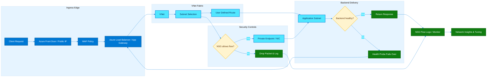

This packet-flow view connects Azure edge routing, VNet placement, NSG policy, backend health, and network observability.
<!-- workflow-diagram:end -->

## Mermaid styling

All diagrams use Azure-themed colors:

- `fill:#0078D4,color:#fff`
- `fill:#50E6FF,color:#232323`

## Table of contents

1. [Virtual Network (VNet)](#virtual-network-vnet)
2. [Network Security Groups (NSGs)](#network-security-groups-nsgs)
3. [Azure Firewall](#azure-firewall)
4. [NAT Gateway](#nat-gateway)
5. [User Defined Routes (UDRs)](#user-defined-routes-udrs)
6. [VNet Peering](#vnet-peering)
7. [Azure Virtual WAN](#azure-virtual-wan)
8. [ExpressRoute](#expressroute)
9. [Azure VPN Gateway](#azure-vpn-gateway)
10. [Azure Load Balancer](#azure-load-balancer)
11. [Application Gateway](#application-gateway)
12. [Azure Front Door](#azure-front-door)
13. [Azure Traffic Manager](#azure-traffic-manager)
14. [Azure DNS](#azure-dns)
15. [Azure Private Link / Private Endpoint](#azure-private-link--private-endpoint)
16. [Azure DDoS Protection](#azure-ddos-protection)
17. [Network Watcher](#network-watcher)

## Notes

- CLI commands are examples and may require parameter adjustments for your subscription, region, or service SKU.
- Replace placeholder names, subscription IDs, passwords, PSKs, and hostnames before use.
- For production, prefer Infrastructure as Code, Azure Policy, and CI/CD validation over manual changes.
- For a deep-dive runbook, see [Azure Load Balancing: Real-World Traffic Switching Scenarios](./load-balancer-real-world-scenarios.md).

---

## Virtual Network (VNet)

Azure Virtual Network is the foundational private network boundary for Azure workloads.

### Mermaid diagram

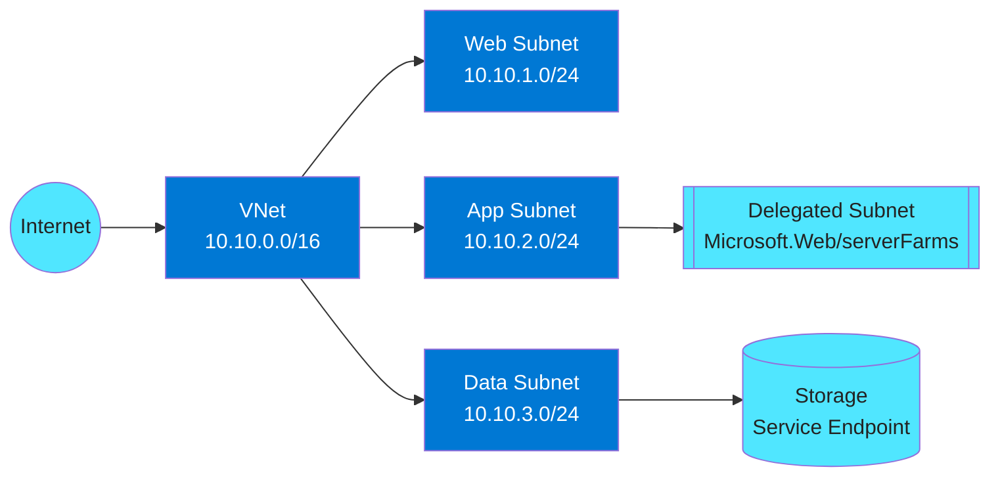

### Explanation

#### What it is

- A VNet is a logically isolated Layer 3 network in Azure.
- It uses one or more non-overlapping CIDR address spaces.
- Subnets divide the VNet into workload or policy boundaries.
- Delegation gives a platform service ownership over a subnet configuration.
- Service endpoints extend VNet identity to supported PaaS services.
- VNets are regional, but they can connect to other VNets and to on-premises networks.
- Good IP planning prevents future overlap problems with peering or hybrid connectivity.
- Most Azure networking patterns start with sound VNet and subnet design.

#### Key capabilities

| Capability | Description | Why it matters |
|---|---|---|
| Address spaces | One or more CIDR blocks assigned to the VNet | Enables growth planning and private IP allocation |
| Subnets | Segmented IP ranges inside the VNet | Separates tiers, policies, and routing intent |
| Delegation | Allows a managed service to control subnet requirements | Needed for App Service, container services, and more |
| Service endpoints | Private backbone access to supported PaaS services | Improves security without requiring private IPs |
| Private DNS integration | Resolves private services by name | Reduces manual IP tracking |
| Hybrid connectivity | Works with VPN, ExpressRoute, peering, and Virtual WAN | Extends Azure networks beyond a single VNet |

#### Design notes

- Reserve extra IP space for future subnets, scale units, and regional expansion.
- Keep gateway, firewall, and private endpoint subnets dedicated.
- Use subnet names that communicate purpose and environment.
- Choose service endpoints when public endpoint access is acceptable but Azure backbone routing is preferred.
- Choose Private Link when a private IP and tighter data exfiltration control are required.
- Document delegated subnets clearly because many services place restrictions on what else can live there.

### Azure CLI commands

```bash
RG=rg-net-core
LOC=eastus
VNET=vnet-prod-eus

az group create -n $RG -l $LOC
az network vnet create -g $RG -n $VNET --address-prefixes 10.10.0.0/16
az network vnet subnet create -g $RG --vnet-name $VNET -n snet-web --address-prefixes 10.10.1.0/24
az network vnet subnet create -g $RG --vnet-name $VNET -n snet-app --address-prefixes 10.10.2.0/24
az network vnet subnet create -g $RG --vnet-name $VNET -n snet-data --address-prefixes 10.10.3.0/24
az network vnet subnet update -g $RG --vnet-name $VNET -n snet-data --service-endpoints Microsoft.Storage Microsoft.Sql
az network vnet subnet update -g $RG --vnet-name $VNET -n snet-app --delegations Microsoft.Web/serverFarms
az network vnet show -g $RG -n $VNET -o yaml
az network vnet subnet list -g $RG --vnet-name $VNET -o table
az network vnet check-ip-address -g $RG -n $VNET --ip-address 10.10.2.10
az network private-dns zone create -g $RG -n privatelink.database.windows.net
az network private-dns link vnet create -g $RG -n link-sql --zone-name privatelink.database.windows.net -v $VNET -e false
```

### Best practices

- Use non-overlapping RFC1918 ranges across all Azure and on-premises environments.
- Separate web, app, data, management, and private endpoint tiers into distinct subnets.
- Keep enough free address space for future subnet splits.
- Standardize names, tags, and IPAM records.
- Review delegation requirements before associating NSGs or UDRs.
- Prefer Private Link for highly sensitive PaaS access.
- Treat subnet design as a landing zone decision, not an afterthought.
- Validate effective routes and DNS after every major change.

### Monitoring and troubleshooting

- Check effective routes and effective NSGs on NICs.
- Track subnet IP utilization before scale events.
- Validate DNS resolution for service endpoints and private endpoints.
- Use Network Watcher connection troubleshoot for path validation.
- Review peering and gateway dependencies before changing address spaces.

---

## Network Security Groups (NSGs)

NSGs provide Layer 3 and Layer 4 filtering at subnet and NIC scope.

### Mermaid diagram

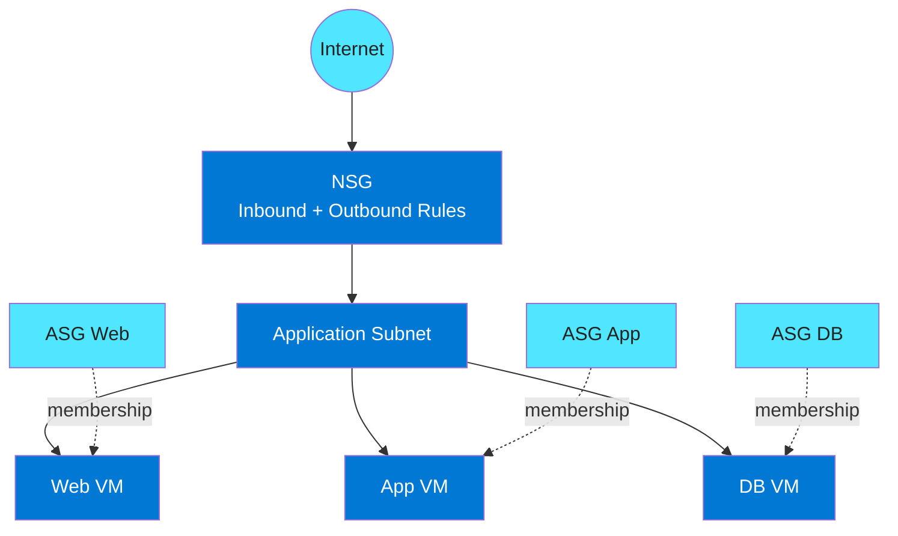

### Explanation

#### What it is

- NSGs filter traffic using ordered allow and deny rules.
- Rules apply to inbound and outbound flows separately.
- NSGs can be associated to a subnet, a NIC, or both.
- Lower priority numbers are evaluated first.
- Augmented rules reduce sprawl by combining multiple ports and prefixes.
- Application Security Groups let you target groups of NICs instead of IP addresses.
- NSGs are stateful, so return traffic for allowed connections is permitted automatically.
- NSGs are ideal for baseline segmentation close to workloads.

#### Key capabilities

| Capability | Description | Why it matters |
|---|---|---|
| Inbound rules | Controls incoming traffic | Limits exposure to approved sources |
| Outbound rules | Controls egress traffic | Helps contain unrestricted internet access |
| Priority model | Lowest number wins first | Makes policy deterministic |
| Augmented rules | Multiple ports and prefixes in one rule | Reduces operational sprawl |
| ASGs | Logical workload grouping by NIC membership | Decouples policy from IP addressing |
| Stateful filtering | Tracks session state | Avoids manual ephemeral return rules |

#### Design notes

- Use subnet NSGs for shared policy and NIC NSGs only for exceptions.
- Reserve priority ranges by policy category.
- Prefer ASGs for multi-tier application rules.
- Keep deny rules explicit and documented.
- Avoid broad allow-any rules that shadow specific intent.
- Pair NSGs with flow logs and IP flow verify for evidence-based troubleshooting.

### Azure CLI commands

```bash
RG=rg-net-sec
LOC=eastus
NSG=nsg-app-eastus

az group create -n $RG -l $LOC
az network nsg create -g $RG -n $NSG
az network asg create -g $RG -n asg-web
az network asg create -g $RG -n asg-app
az network asg create -g $RG -n asg-db
az network nsg rule create -g $RG --nsg-name $NSG -n allow-https-in --priority 100 --direction Inbound --access Allow --protocol Tcp --source-address-prefixes Internet --destination-port-ranges 443
az network nsg rule create -g $RG --nsg-name $NSG -n allow-web-to-app --priority 110 --direction Inbound --access Allow --protocol Tcp --source-asgs asg-web --destination-asgs asg-app --destination-port-ranges 8443
az network nsg rule create -g $RG --nsg-name $NSG -n allow-augmented-admin --priority 120 --direction Inbound --access Allow --protocol Tcp --source-address-prefixes 10.50.0.0/24 10.60.0.0/24 --destination-port-ranges 22 3389
az network nsg rule create -g $RG --nsg-name $NSG -n deny-web-outbound --priority 300 --direction Outbound --access Deny --protocol Tcp --source-address-prefixes 10.10.2.0/24 --destination-address-prefixes Internet --destination-port-ranges 80 443
az network nic update -g $RG -n nic-web-01 --application-security-groups asg-web
az network subnet update -g $RG --vnet-name vnet-prod-eus -n snet-app --network-security-group $NSG
az network nsg rule list -g $RG --nsg-name $NSG -o table
az network nic list-effective-nsg -g $RG -n nic-web-01 -o json
```

### Best practices

- Apply least privilege rules only for required ports and sources.
- Use ASGs instead of hardcoding IPs.
- Standardize priority ranges across environments.
- Remove temporary troubleshooting rules quickly.
- Review effective rules after deployments.
- Enable NSG flow logs where needed for forensics.
- Use subnet NSGs for defaults and NIC NSGs for exceptions.
- Treat NSG changes as production changes with review and approval.

### Monitoring and troubleshooting

- Use IP flow verify to test a specific 5-tuple.
- Review NSG flow logs for denied traffic spikes.
- Check both source and destination effective rules.
- Validate load balancer probe traffic allowances.
- Look for priority shadowing when new rules are introduced.

---

## Azure Firewall

Azure Firewall is a managed, centralized, cloud-native firewall service.

### Mermaid diagram

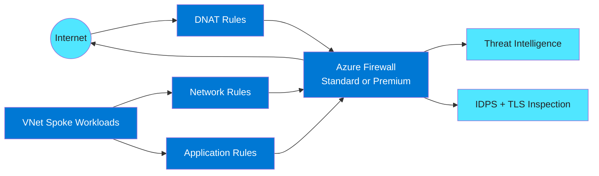

### Explanation

#### What it is

- Azure Firewall is stateful and fully managed by Microsoft.
- Standard SKU supports network and application filtering, autoscaling, and threat intelligence.
- Premium adds TLS inspection, IDPS, URL filtering, and web categories.
- DNAT rules publish internal services through firewall public IPs.
- Network rules filter IPs, ports, and protocols.
- Application rules filter FQDNs and URLs for HTTP, HTTPS, and MSSQL.
- Firewall Policy separates policy from the firewall instance.
- Azure Firewall is often deployed in a hub for shared egress and ingress control.

#### Key capabilities

| Capability | Description | Why it matters |
|---|---|---|
| Standard SKU | Central L3-L7 filtering | Covers many baseline enterprise requirements |
| Premium SKU | TLS inspection and IDPS | Supports deeper security requirements |
| DNAT rules | Publishes internal services | Centralizes inbound exposure |
| Network rules | IP, port, protocol control | Supports non-HTTP traffic filtering |
| Application rules | FQDN and URL filtering | Improves egress governance |
| Firewall Policy | Reusable policy container | Simplifies governance and reuse |

#### Design notes

- Use a dedicated AzureFirewallSubnet.
- Prefer Firewall Policy for policy reuse and hierarchy.
- Use Premium only when the organization can operate certificates and inspection controls.
- Route spokes to the firewall with UDRs when central egress is required.
- Keep DNAT minimal and prefer Layer 7 proxies for web exposure.
- Plan certificate trust distribution before enabling TLS inspection.

### Azure CLI commands

```bash
RG=rg-firewall-core
LOC=eastus
FWPOL=fwpol-hub-prod
FW=azfw-hub-prod
PIP=pip-azfw-prod

az group create -n $RG -l $LOC
az network public-ip create -g $RG -n $PIP --sku Standard
az network firewall policy create -g $RG -n $FWPOL --sku Premium --threat-intel-mode Alert
az network firewall create -g $RG -n $FW -l $LOC --sku AZFW_VNet --tier Premium --firewall-policy $FWPOL
az network firewall ip-config create -g $RG -f $FW -n fw-ipcfg --public-ip-address $PIP --vnet-name vnet-hub-prod
az network firewall policy rule-collection-group create -g $RG --policy-name $FWPOL -n rcg-core --priority 100
az network firewall network-rule create -g $RG -f $FW --collection-name net-allow --name allow-dns --protocols UDP --source-addresses 10.10.0.0/16 --destination-addresses 168.63.129.16 --destination-ports 53 --priority 100 --action Allow
az network firewall application-rule create -g $RG -f $FW --collection-name app-allow --name allow-msft --protocols Http=80 Https=443 --source-addresses 10.10.0.0/16 --target-fqdns management.azure.com login.microsoftonline.com --priority 110 --action Allow
az network firewall nat-rule create -g $RG -f $FW --collection-name dnat-publish --name dnat-https --protocols TCP --source-addresses 0.0.0.0/0 --destination-addresses 20.30.40.50 --destination-ports 443 --translated-address 10.20.1.4 --translated-port 443 --priority 120 --action Dnat
az network firewall update -g $RG -n $FW --threat-intel-mode Deny
az network firewall show -g $RG -n $FW -o yaml
az network firewall policy show -g $RG -n $FWPOL -o yaml
```

### Best practices

- Centralize firewall services in a hub network.
- Use Firewall Policy instead of per-instance rule sprawl.
- Allow only approved destinations and ports.
- Separate DNAT, network, and application rule intent clearly.
- Log all rule activity to central analytics.
- Test SNAT behavior and throughput under realistic load.
- Use Premium only with operational readiness for TLS inspection.
- Prefer Application Gateway or Front Door for modern public web publishing.

### Monitoring and troubleshooting

- Review firewall logs for rule matches and denies.
- Validate spoke route tables after firewall insertion.
- Watch SNAT and throughput behavior during load.
- Monitor certificate health for TLS inspection.
- Track threat intelligence and IDPS events separately.

---

## NAT Gateway

NAT Gateway provides scalable outbound internet access for private subnets.

### Mermaid diagram

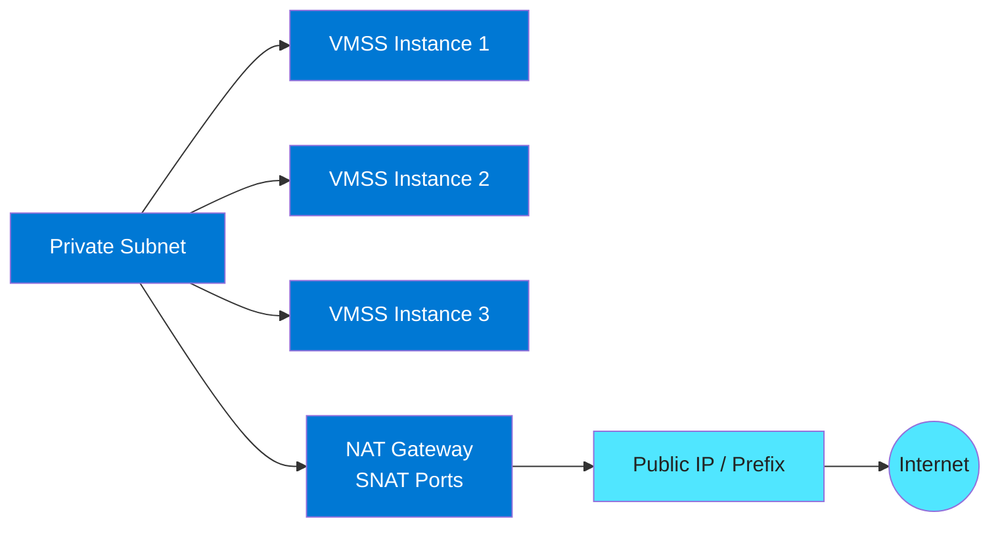

### Explanation

#### What it is

- NAT Gateway is attached at subnet scope.
- It provides outbound-only connectivity to the internet.
- It avoids assigning public IPs directly to VMs or VMSS instances.
- It gives a large pool of SNAT ports and can scale with multiple public IPs or prefixes.
- It supports configurable idle timeout.
- It is simpler than a firewall because it does not inspect traffic.
- It is ideal for patching, package downloads, and SaaS egress from private workloads.
- It is not a solution for inbound exposure.

#### Key capabilities

| Capability | Description | Why it matters |
|---|---|---|
| Private subnet egress | Outbound internet without public NICs | Improves security posture |
| SNAT scaling | Large source port inventory | Supports many concurrent connections |
| Static egress IPs | Uses public IPs or prefixes | Simplifies partner allowlisting |
| Idle timeout | Configurable timeout window | Supports long-lived sessions |
| Managed service | No inspection engine to maintain | Reduces operational overhead |
| Zone-aware support | Works with Standard public IP design | Fits resilient architectures |

#### Design notes

- Use NAT Gateway on subnets that need simple internet egress.
- Do not rely on it for inbound publishing.
- Size SNAT capacity by connection concurrency, not VM count alone.
- Use a public IP prefix when many egress IPs are needed.
- Choose Azure Firewall instead if central inspection is required.
- Align idle timeout with application keepalive behavior.

### Azure CLI commands

```bash
RG=rg-egress
LOC=eastus
NAT=natgw-app
PIP=pip-natgw-app
VNET=vnet-prod-eus
SUBNET=snet-app

az group create -n $RG -l $LOC
az network public-ip create -g $RG -n $PIP --sku Standard --allocation-method Static
az network nat gateway create -g $RG -n $NAT -l $LOC --public-ip-addresses $PIP --idle-timeout 10
az network vnet subnet update -g $RG --vnet-name $VNET -n $SUBNET --nat-gateway $NAT
az network public-ip prefix create -g $RG -n pipfx-egress --length 30 --sku Standard
az network nat gateway update -g $RG -n $NAT --public-ip-prefixes pipfx-egress
az network nat gateway show -g $RG -n $NAT -o yaml
az network vnet subnet show -g $RG --vnet-name $VNET -n $SUBNET -o yaml
az vmss list-instance-public-ips -g $RG -n vmss-app
```

### Best practices

- Use NAT Gateway instead of instance-level public IPs for private subnets.
- Model SNAT consumption for bursty applications.
- Use static Standard public IPs or prefixes.
- Keep one intentional egress model per subnet.
- Tune idle timeout only when applications truly need it.
- Monitor failed outbound connections for SNAT exhaustion symptoms.
- Document which subnets use NAT Gateway versus Firewall.
- Keep NAT Gateway for outbound only and nothing else.

### Monitoring and troubleshooting

- Watch SNAT and failed connection metrics.
- Confirm subnet association after every deployment.
- Validate destination allowlists against NAT public IPs.
- Use packet capture if routes look correct but sessions fail.
- Review keepalive behavior when timeout issues appear.

---

## User Defined Routes (UDRs)

UDRs override Azure system routes to control traffic paths.

### Mermaid diagram

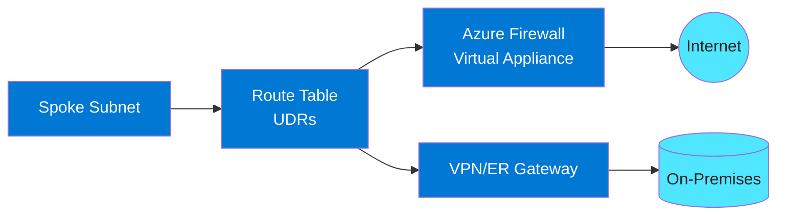

### Explanation

#### What it is

- Azure provides system routes automatically.
- UDRs let you override those routes for specific prefixes.
- Route tables are attached to subnets.
- Common next hop types are VirtualAppliance, VirtualNetworkGateway, Internet, None, and VirtualNetwork.
- Forced tunneling usually uses a default route to a firewall or hybrid gateway.
- BGP propagation can be enabled or disabled on a route table.
- UDRs are critical for service chaining and central egress.
- Effective route tables on NICs show the final path Azure will use.

#### Key capabilities

| Capability | Description | Why it matters |
|---|---|---|
| Route tables | Container for custom routes | Controls pathing per subnet |
| Next hop types | Appliance, gateway, internet, none, VNet | Defines how traffic is forwarded |
| Forced tunneling | Default route to firewall or gateway | Centralizes egress control |
| BGP route propagation | Accept or suppress learned routes | Prevents unexpected path precedence |
| Blackhole routes | Send traffic to None | Blocks unwanted destinations |
| Service chaining | Steer traffic through inspection points | Enables centralized security |

#### Design notes

- Use narrow prefixes when possible.
- Handle default routes with extreme care.
- Disable BGP propagation only when architecture requires it.
- Document route ownership clearly.
- Validate symmetric routing through stateful appliances.
- Always inspect effective routes, not just route table resources.

### Azure CLI commands

```bash
RG=rg-routing
RT=rt-spoke-egress
FW_IP=10.0.0.4

az group create -n $RG -l eastus
az network route-table create -g $RG -n $RT --disable-bgp-route-propagation true
az network route-table route create -g $RG --route-table-name $RT -n default-to-firewall --address-prefix 0.0.0.0/0 --next-hop-type VirtualAppliance --next-hop-ip-address $FW_IP
az network route-table route create -g $RG --route-table-name $RT -n onprem-prefix --address-prefix 172.16.0.0/12 --next-hop-type VirtualNetworkGateway
az network route-table route create -g $RG --route-table-name $RT -n block-test --address-prefix 203.0.113.0/24 --next-hop-type None
az network vnet subnet update -g $RG --vnet-name vnet-spoke-prod -n snet-app --route-table $RT
az network route-table route list -g $RG --route-table-name $RT -o table
az network nic show-effective-route-table -g $RG -n nic-app-01 -o table
az network watcher show-next-hop -g $RG --vm vm-app-01 --source-ip 10.20.1.4 --dest-ip 8.8.8.8
az network watcher show-next-hop -g $RG --vm vm-app-01 --source-ip 10.20.1.4 --dest-ip 172.16.10.10
```

### Best practices

- Use route tables to express clear traffic intent per subnet.
- Test platform dependencies before forced tunneling workloads.
- Prefer Azure Firewall or supported NVAs for central inspection.
- Keep route tables small and focused.
- Be careful with BGP propagation changes.
- Document blackhole routes clearly.
- Check for asymmetric routing through stateful devices.
- Validate effective routes after every change.

### Monitoring and troubleshooting

- Use next hop and effective route tools first.
- Track route drift in IaC and change records.
- Review propagated routes when hybrid paths behave unexpectedly.
- Correlate routing and NSG analysis together.
- Use packet capture when asymmetry is suspected.

---

## VNet Peering

VNet peering connects Azure VNets over the Microsoft backbone.

### Mermaid diagram

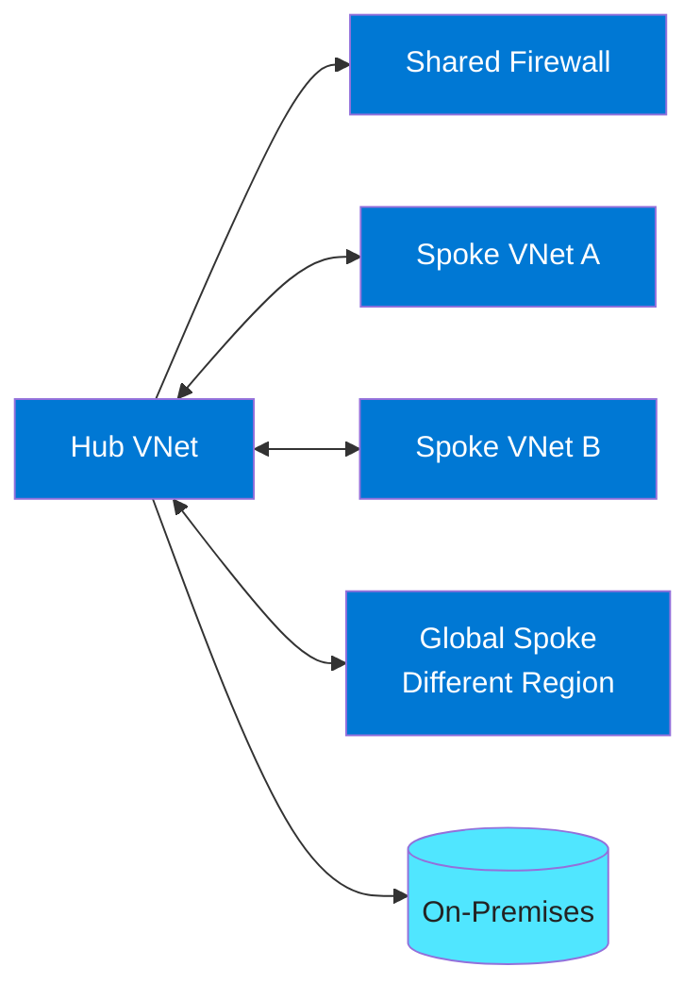

### Explanation

#### What it is

- Regional peering connects VNets in the same Azure region.
- Global peering connects VNets across Azure regions.
- Peering is low-latency and high-bandwidth.
- Peering is non-transitive.
- Hub-spoke is the most common topology built with peering.
- Gateway transit lets spokes use a hub VPN or ExpressRoute gateway.
- Peering requires non-overlapping address spaces.
- Peering alone does not provide centralized inspection or spoke-to-spoke transit.

#### Key capabilities

| Capability | Description | Why it matters |
|---|---|---|
| Regional peering | Same-region VNet connectivity | Supports low-latency east-west traffic |
| Global peering | Cross-region connectivity | Supports multi-region applications |
| Hub-spoke topology | Central hub and multiple spokes | Simplifies shared services |
| Gateway transit | Spokes use the hub gateway | Reduces gateway duplication |
| Remote gateways | Enables spoke consumption of hub transit | Simplifies hybrid designs |
| Service chaining with UDRs | Send traffic to hub security controls | Adds centralized policy |

#### Design notes

- Assume peering is non-transitive.
- Use a hub for shared services and transit.
- Enable gateway transit only where needed.
- Review global peering data transfer costs.
- Preserve non-overlapping address spaces across all regions.
- Combine peering with UDRs and firewall when central inspection is required.

### Azure CLI commands

```bash
RG=rg-peering
HUB=vnet-hub-prod
SPOKE=vnet-spoke-app

az group create -n $RG -l eastus
az network vnet peering create -g $RG -n hub-to-spoke --vnet-name $HUB --remote-vnet $SPOKE --allow-vnet-access
az network vnet peering create -g $RG -n spoke-to-hub --vnet-name $SPOKE --remote-vnet $HUB --allow-vnet-access
az network vnet peering update -g $RG -n hub-to-spoke --vnet-name $HUB --allow-gateway-transit true
az network vnet peering update -g $RG -n spoke-to-hub --vnet-name $SPOKE --use-remote-gateways true
az network vnet peering list -g $RG --vnet-name $HUB -o table
az network vnet peering show -g $RG --vnet-name $HUB -n hub-to-spoke -o yaml
az network nic show-effective-route-table -g $RG -n nic-spoke-01 -o table
az network watcher test-connectivity -g $RG --source-resource nic-spoke-01 --dest-address 10.0.1.4 --dest-port 443
```

### Best practices

- Use hub-spoke instead of many mesh peerings.
- Keep address spaces unique across all VNets.
- Remember peering does not provide transitive routing.
- Use UDRs and a firewall for spoke-to-spoke inspection.
- Enable gateway transit only when hybrid requirements justify it.
- Document peering flags and route behavior.
- Validate DNS across peered VNets.
- Review cost and latency for global peering.

### Monitoring and troubleshooting

- Test connectivity after peering changes.
- Check effective routes on spoke NICs.
- Review peering state after address space updates.
- Monitor cross-region latency in global peering designs.
- Keep a dependency map of shared hub services.

---

## Azure Virtual WAN

Azure Virtual WAN is Microsoft-managed global transit networking.

### Mermaid diagram

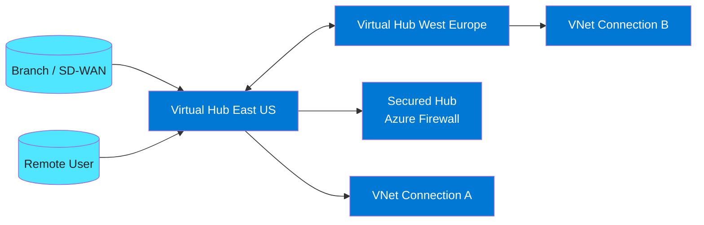

### Explanation

#### What it is

- Virtual WAN is a managed transit service.
- It uses regional virtual hubs as connectivity aggregation points.
- Hubs can connect branches, users, ExpressRoute, VPN, and VNets.
- It supports inter-hub transit across regions.
- Secured hubs integrate Azure Firewall and routing intent.
- It is useful for large, global, or branch-heavy environments.
- It reduces the need to build custom transit hubs in many regions.
- It trades some flexibility for scale and operational simplicity.

#### Key capabilities

| Capability | Description | Why it matters |
|---|---|---|
| Virtual hubs | Managed transit points | Simplifies multi-region networking |
| VNet connections | Connect VNets into the transit fabric | Extends shared routing to cloud apps |
| Branch connections | Connect branch or SD-WAN sites | Supports distributed enterprises |
| Secured hub | Firewall-managed inspection | Centralizes internet and private traffic control |
| Inter-hub transit | Routing between hubs | Supports global architectures |
| Routing intent | Traffic category steering | Reduces manual UDR complexity |

#### Design notes

- Choose Virtual WAN when branch or region scale is high.
- Use Standard Virtual WAN for advanced routing and hybrid use cases.
- Separate private traffic intent from internet traffic intent.
- Validate SD-WAN partner compatibility early.
- Keep hubs near users and workloads to manage latency.
- Plan migration carefully from classic hub-spoke to Virtual WAN.

### Azure CLI commands

```bash
RG=rg-vwan
LOC=eastus
VWAN=vwan-global
VHUB=vhub-eastus

az group create -n $RG -l $LOC
az network vwan create -g $RG -n $VWAN -l $LOC --type Standard
az network vhub create -g $RG -n $VHUB --address-prefix 10.250.0.0/23 --vwan $VWAN -l $LOC
az network vhub connection create -g $RG --vhub-name $VHUB -n conn-spoke-app --remote-vnet /subscriptions/<sub>/resourceGroups/rg-spoke/providers/Microsoft.Network/virtualNetworks/vnet-spoke-app --internet-security
az network vpn-gateway create -g $RG -n vpngw-vhub-eastus --vhub $VHUB --scale-unit 2
az network vpn-site create -g $RG -n branch-hq --ip-address 198.51.100.10 -l $LOC --virtual-wan $VWAN --address-prefixes 172.16.0.0/16
az network vpn-gateway connection create -g $RG --gateway-name vpngw-vhub-eastus -n branch-hq-conn --remote-vpn-site branch-hq --internet-security
az network express-route gateway create -g $RG -n ergw-eastus --vhub $VHUB --scale-units 2
az network firewall create -g $RG -n azfw-vhub-eastus -l $LOC --sku AZFW_Hub --tier Standard --vhub $VHUB
az network vwan show -g $RG -n $VWAN -o yaml
```

### Best practices

- Use Virtual WAN when operational simplicity at scale is more important than custom hub flexibility.
- Standardize route labels and connection naming.
- Use secured hubs when central inspection is strategic.
- Model branch, user, and VNet pathing together.
- Review total cost across hubs, gateways, firewall, and transfer.
- Keep hub placement close to traffic sources and destinations.
- Validate coexistence with existing gateways before migration.
- Pilot new patterns before broad rollout.

### Monitoring and troubleshooting

- Track connection health and route intent behavior.
- Review firewall logs separately in secured hubs.
- Test VNet reachability after route label changes.
- Monitor branch tunnel and BGP state.
- Document regional failover expectations clearly.

---

## ExpressRoute

ExpressRoute provides dedicated private connectivity between Azure and on-premises environments.

### Mermaid diagram

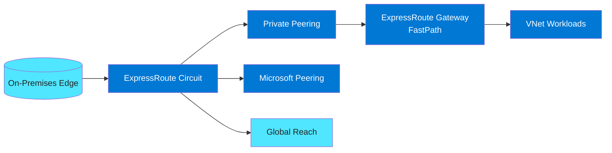

### Explanation

#### What it is

- ExpressRoute uses private connectivity instead of the public internet.
- Private peering is used for VNet access.
- Microsoft peering is used for selected Microsoft public services.
- Circuits are sized by bandwidth and peering location.
- Global Reach can connect on-premises sites through Microsoft backbone.
- FastPath can optimize the data path for some private peering traffic.
- ExpressRoute is often paired with VPN for backup or migration.
- Route planning with BGP is critical in hybrid designs.

#### Key capabilities

| Capability | Description | Why it matters |
|---|---|---|
| Private peering | Hybrid connectivity to VNets | Supports business-critical private paths |
| Microsoft peering | Access to Microsoft public services | Extends private connectivity to SaaS and platform services |
| Global Reach | Connects sites through Microsoft backbone | Simplifies some WAN designs |
| FastPath | Optimized data plane | Improves throughput and latency |
| Circuit bandwidth tiers | Configurable capacity | Matches business demand |
| Premium capabilities | Larger scale and broader reach | Supports global enterprises |

#### Design notes

- Use ExpressRoute for deterministic private connectivity at scale.
- Build redundant provider paths whenever possible.
- Enable Microsoft peering only when required.
- Review gateway SKU and FastPath support early.
- Design BGP carefully when VPN coexists.
- Remember ExpressRoute solves transport, not app resilience or security policy.

### Azure CLI commands

```bash
RG=rg-er
LOC=eastus
CIRCUIT=ercore-eastus
ERGW=ergw-prod

az group create -n $RG -l $LOC
az network express-route create -g $RG -n $CIRCUIT --bandwidth 1000 --peering-location 'Silicon Valley' --provider Equinix --sku-tier Premium --sku-family MeteredData
az network express-route peering create -g $RG --circuit-name $CIRCUIT -n AzurePrivatePeering --peering-type AzurePrivatePeering --peer-asn 65010 --primary-peer-subnet 192.168.0.0/30 --secondary-peer-subnet 192.168.0.4/30 --vlan-id 200
az network express-route peering create -g $RG --circuit-name $CIRCUIT -n MicrosoftPeering --peering-type MicrosoftPeering --peer-asn 65010 --primary-peer-subnet 192.168.1.0/30 --secondary-peer-subnet 192.168.1.4/30 --vlan-id 201
az network route-filter create -g $RG -n rf-m365 -l $LOC
az network route-filter rule create -g $RG --route-filter-name rf-m365 -n allow-m365 --access allow --communities 12076:5010 12076:5030
az network express-route peering update -g $RG --circuit-name $CIRCUIT -n MicrosoftPeering --route-filter rf-m365
az network vnet-gateway create -g $RG -n $ERGW -l $LOC --public-ip-addresses pip-ergw --vnet vnet-hub-prod --gateway-type ExpressRoute --sku ErGw3AZ --no-wait
az network express-route list-route-tables -g $RG -n $CIRCUIT --path primary --peering-name AzurePrivatePeering
az network express-route show -g $RG -n $CIRCUIT -o yaml
```

### Best practices

- Use ExpressRoute for large-scale or regulated hybrid connectivity.
- Build diversity across providers and physical paths.
- Use BGP deliberately and document route preference.
- Limit Microsoft peering to validated needs.
- Validate FastPath support and gateway throughput.
- Keep provider LOAs and runbooks easily available.
- Monitor utilization trends and latency baselines.
- Test failover regularly instead of assuming it will work.

### Monitoring and troubleshooting

- Track BGP session state and route advertisements.
- Monitor utilization on primary and secondary paths.
- Validate route filters when Microsoft destinations fail.
- Compare latency before and after FastPath changes.
- Watch for VPN unexpectedly becoming preferred.

---

## Azure VPN Gateway

Azure VPN Gateway provides encrypted connectivity for sites, users, and VNets.

### Mermaid diagram

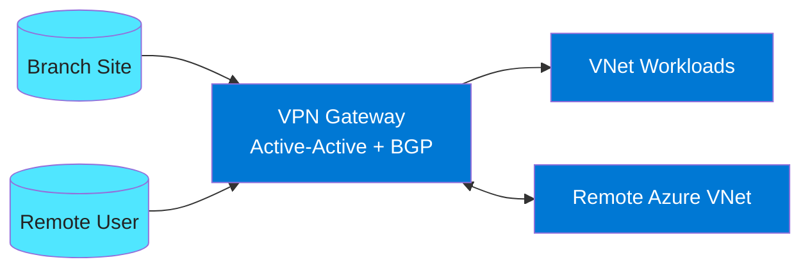

### Explanation

#### What it is

- Site-to-site VPN connects branch or datacenter devices over IPsec/IKE.
- Point-to-site VPN connects individual users.
- VNet-to-VNet uses VPN gateways to connect Azure VNets.
- Active-active deploys two active gateway instances and public IPs.
- BGP simplifies route exchange and failover.
- Route-based gateways are preferred for modern designs.
- VPN is internet-based transport, so it differs from ExpressRoute in performance and determinism.
- Gateway subnet sizing and SKU selection matter for scale.

#### Key capabilities

| Capability | Description | Why it matters |
|---|---|---|
| Site-to-site | Tunnel from branch or datacenter | Extends private connectivity over the internet |
| Point-to-site | User VPN into Azure | Supports remote admins and developers |
| VNet-to-VNet | Tunnel between Azure VNets | Useful in selected isolation scenarios |
| Active-active | Dual active instances | Improves resilience |
| BGP | Dynamic route exchange | Simplifies failover and route management |
| Route-based gateways | Modern VPN model | Supports most current scenarios |

#### Design notes

- Prefer route-based gateways for new deployments.
- Use active-active when high availability matters.
- Size GatewaySubnet for future needs.
- Use VPN as primary for small estates or backup for ExpressRoute.
- Standardize cryptographic settings with partner devices.
- Plan certificate, Azure AD, or RADIUS strategy for point-to-site users.

### Azure CLI commands

```bash
RG=rg-vpn
LOC=eastus
GW=vpngw-prod
LNG=lng-branch-hq

az group create -n $RG -l $LOC
az network public-ip create -g $RG -n pip-vpngw-1 --sku Standard --allocation-method Static
az network public-ip create -g $RG -n pip-vpngw-2 --sku Standard --allocation-method Static
az network vnet-gateway create -g $RG -n $GW -l $LOC --public-ip-addresses pip-vpngw-1 pip-vpngw-2 --vnet vnet-hub-prod --gateway-type Vpn --vpn-type RouteBased --sku VpnGw2AZ --asn 65515 --active-active
az network local-gateway create -g $RG -n $LNG --gateway-ip-address 198.51.100.10 --local-address-prefixes 172.16.0.0/16 --asn 65010 --bgp-peering-address 172.16.255.1
az network vpn-connection create -g $RG -n conn-branch-hq --vnet-gateway1 $GW --local-gateway2 $LNG --shared-key <psk> --enable-bgp
az network vnet-gateway vpn-client generate -g $RG -n $GW --processor-architecture Amd64
az network vpn-connection create -g $RG -n conn-vnet2 --vnet-gateway1 $GW --vnet-gateway2 vpngw-dr --shared-key <psk>
az network vnet-gateway show -g $RG -n $GW -o yaml
az network vpn-connection show -g $RG -n conn-branch-hq -o yaml
```

### Best practices

- Use route-based gateways and BGP where possible.
- Deploy active-active for business-critical links.
- Protect and rotate PSKs securely.
- Size gateway subnet and SKU for growth.
- Validate client VPN DNS and split tunnel behavior.
- Keep branch device compatibility information up to date.
- Monitor tunnels continuously.
- Use ExpressRoute where deterministic private transport is required.

### Monitoring and troubleshooting

- Track tunnel state and BGP state per connection.
- Test active-active failover intentionally.
- Validate DNS for point-to-site users.
- Review logs on both Azure and device sides for tunnel issues.
- Maintain branch inventory and firmware compatibility records.

---

## Azure Load Balancer

Azure Load Balancer is a Layer 4 service for TCP and UDP load distribution.

### Mermaid diagram

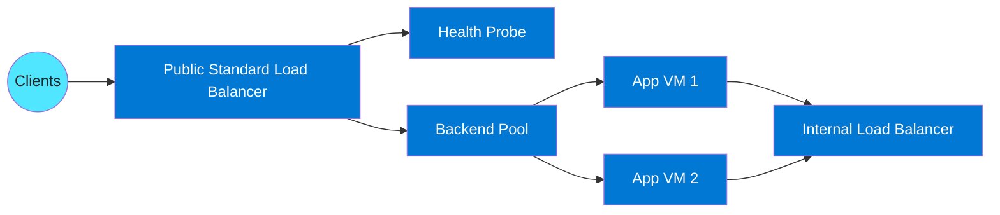

### Explanation

#### What it is

- Azure Load Balancer is a Layer 4 service for TCP and UDP traffic.
- Standard is the recommended SKU for production.
- It supports public and internal frontends.
- Health probes determine which backends receive traffic.
- HA Ports balance all ports and are useful for NVAs.
- Outbound rules can provide SNAT for Standard Load Balancer backends.
- Basic SKU is legacy and should generally be avoided.
- For HTTP-aware routing, use Application Gateway or Front Door instead.

#### Key capabilities

| Capability | Description | Why it matters |
|---|---|---|
| Standard vs Basic | Modern vs legacy SKU | Impacts security, scale, and resiliency |
| Public frontend | Internet-facing VIP | Publishes services externally |
| Internal frontend | Private VIP | Supports private tier load balancing |
| Health probes | TCP, HTTP, or HTTPS checks | Ensures only healthy nodes serve traffic |
| HA Ports | Balance all ports | Useful for appliances and broad protocols |
| Outbound rules | SNAT for backend egress | Controls outbound behavior when needed |

#### Design notes

- Use Standard Load Balancer for new designs.
- Build readiness probes that reflect application health.
- Separate internet-facing and internal concerns clearly.
- Prefer NAT Gateway for general egress scaling.
- Use zone-redundant frontend IPs when regional resilience is important.
- Use internal load balancers for private multi-tier designs.

### Azure CLI commands

```bash
RG=rg-lb
LOC=eastus
LB=slb-web-prod

az group create -n $RG -l $LOC
az network public-ip create -g $RG -n pip-lb-web --sku Standard --allocation-method Static
az network lb create -g $RG -n $LB -l $LOC --sku Standard --public-ip-address pip-lb-web --frontend-ip-name fe-public --backend-pool-name be-web
az network lb probe create -g $RG --lb-name $LB -n hp-https --protocol Tcp --port 443
az network lb rule create -g $RG --lb-name $LB -n rule-https --protocol Tcp --frontend-port 443 --backend-port 443 --frontend-ip-name fe-public --backend-pool-name be-web --probe-name hp-https
az network lb outbound-rule create -g $RG --lb-name $LB -n outbound-web --frontend-ip-configs fe-public --backend-pool-name be-web --protocol All
az network lb frontend-ip create -g $RG --lb-name $LB -n fe-internal --private-ip-address 10.10.2.10 --subnet snet-app --vnet-name vnet-prod-eus
az network lb rule create -g $RG --lb-name $LB -n rule-ha-ports --protocol All --frontend-port 0 --backend-port 0 --frontend-ip-name fe-internal --backend-pool-name be-app --enable-ha-ports true
az network nic ip-config address-pool add -g $RG --nic-name nic-web-01 --ip-config-name ipconfig1 --lb-name $LB --address-pool be-web
az network lb show -g $RG -n $LB -o yaml
```

### Best practices

- Prefer Standard Load Balancer for production.
- Use dedicated health endpoints, not just process liveness checks.
- Separate public and internal balancing concerns.
- Avoid relying on default outbound behavior.
- Use HA Ports for appliance scenarios.
- Align backend pool membership with autoscaling.
- Consider zone-redundant frontends for resilience.
- Load test probe behavior and outbound flows before go-live.

### Monitoring and troubleshooting

- Check probe status first during outages.
- Verify backend pool membership after scale events.
- Monitor outbound behavior if outbound rules are used.
- Review NSGs for probe and client flow issues.
- Use flow logs and packet capture for deep investigation.

---

## Application Gateway

Application Gateway is Azure’s regional Layer 7 load balancer and web application delivery service.

### Mermaid diagram

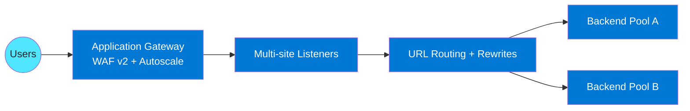

### Explanation

#### What it is

- Application Gateway is HTTP and HTTPS aware.
- It supports WAF v2 for web protection.
- It supports URL-based routing and multi-site listeners.
- It can perform SSL termination and optional re-encryption to backends.
- It supports autoscaling.
- Rewrite rules can modify request or response headers and URLs.
- It is regional and works well in front of private backends.
- It is often combined with Front Door for global architectures.

#### Key capabilities

| Capability | Description | Why it matters |
|---|---|---|
| WAF v2 | Managed OWASP-based WAF | Protects public web apps |
| URL-based routing | Route by path | Supports multiple apps behind one gateway |
| Multi-site hosting | Host-based listeners | Publishes many sites on shared infrastructure |
| SSL termination | TLS offload at gateway | Simplifies certificate management |
| Autoscaling | Elastic scale | Handles bursty traffic |
| Rewrites | Header and URL manipulation | Supports security and app compatibility |

#### Design notes

- Use WAF v2 for internet-facing web applications.
- Keep listener and backend naming consistent.
- Deploy Application Gateway in a dedicated subnet.
- Use explicit health probes for real readiness.
- Automate certificate lifecycle management.
- Combine with Front Door for global entry and edge protection when needed.

### Azure CLI commands

```bash
RG=rg-appgw
LOC=eastus
AGW=agw-prod-web

az group create -n $RG -l $LOC
az network public-ip create -g $RG -n pip-appgw --sku Standard --allocation-method Static
az network application-gateway create -g $RG -n $AGW -l $LOC --sku WAF_v2 --capacity 2 --public-ip-address pip-appgw --vnet-name vnet-hub-prod --subnet appgw-subnet --priority 1001
az network application-gateway http-listener create -g $RG --gateway-name $AGW -n listener-contoso --frontend-port appGatewayFrontendPort --frontend-ip appGatewayFrontendIP --host-names app.contoso.com --ssl-cert webcert
az network application-gateway address-pool create -g $RG --gateway-name $AGW -n pool-api --servers 10.10.2.4 10.10.2.5
az network application-gateway probe create -g $RG --gateway-name $AGW -n probe-api --protocol Https --host-name-from-http-settings true --path /healthz --interval 30 --timeout 30 --threshold 3
az network application-gateway http-settings create -g $RG --gateway-name $AGW -n httpsettings-api --port 443 --protocol Https --probe probe-api --host-name-from-backend-pool true
az network application-gateway rule create -g $RG --gateway-name $AGW -n rule-basic --http-listener listener-contoso --rule-type Basic --address-pool pool-api --http-settings httpsettings-api --priority 100
az network application-gateway waf-policy create -g $RG -n wafpol-prod --type OWASP --version 3.2
az network application-gateway update -g $RG -n $AGW --waf-policy wafpol-prod
az network application-gateway show -g $RG -n $AGW -o yaml
```

### Best practices

- Use WAF v2 and tune it in lower environments first.
- Keep listeners, rules, and pools organized and readable.
- Use dedicated readiness probes.
- Automate certificate renewal and rotation.
- Keep rewrite rules minimal and tested.
- Use a dedicated subnet.
- Combine with NSGs and private backends for defense in depth.
- Layer Front Door above it when global entry is needed.

### Monitoring and troubleshooting

- Review WAF logs and backend health together.
- Check probes and HTTP settings when 502 errors appear.
- Watch autoscale events.
- Validate SNI and certificate bindings.
- Review rewrite rules when authentication or caching breaks.

---

## Azure Front Door

Azure Front Door is a global anycast HTTP and HTTPS entry service.

### Mermaid diagram

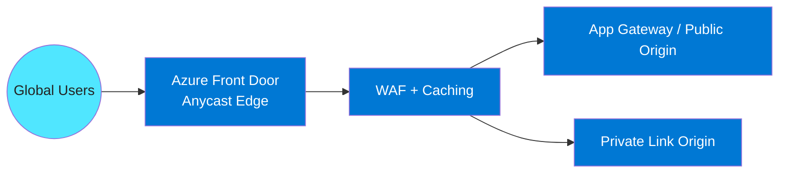

### Explanation

#### What it is

- Front Door provides global Layer 7 load balancing.
- It uses Microsoft edge POPs and anycast routing.
- It includes WAF support at the edge.
- It supports caching and traffic acceleration.
- Front Door Premium supports Private Link origins.
- It can route by path, host, and health state.
- It supports active-active and active-passive origin models.
- It is ideal for global internet-facing applications.

#### Key capabilities

| Capability | Description | Why it matters |
|---|---|---|
| Global load balancing | Distributes traffic across regions | Improves availability and user experience |
| Edge WAF | Web filtering at the edge | Stops threats before origin impact |
| Caching | Stores content near users | Reduces latency and origin load |
| Private Link origins | Connects to private backends | Removes public origin exposure |
| Traffic acceleration | Moves traffic onto Microsoft backbone quickly | Improves performance |
| Origin failover | Health-driven traffic shifting | Supports resilient multi-region apps |

#### Design notes

- Use Front Door for global web entry.
- Use Private Link origins when origin privacy matters.
- Be explicit about caching behavior.
- Combine with Application Gateway when advanced regional reverse proxy features are needed.
- Plan custom domain and certificate automation early.
- Keep health probes lightweight and representative.

### Azure CLI commands

```bash
RG=rg-afd
PROFILE=afdprof-global
ENDPOINT=afd-endpoint-prod

az group create -n $RG -l eastus
az afd profile create -g $RG -n $PROFILE --sku Premium_AzureFrontDoor
az afd endpoint create -g $RG --profile-name $PROFILE -n $ENDPOINT --enabled-state Enabled
az afd origin-group create -g $RG --profile-name $PROFILE -n og-web --probe-request-type GET --probe-protocol Https --probe-path /healthz --sample-size 4 --successful-samples-required 3
az afd origin create -g $RG --profile-name $PROFILE --origin-group-name og-web -n origin-eastus --host-name appgw-eastus.contoso.com --origin-host-header app.contoso.com --priority 1 --weight 1000 --enabled-state Enabled
az afd route create -g $RG --profile-name $PROFILE --endpoint-name $ENDPOINT -n route-web --origin-group og-web --supported-protocols Http Https --patterns-to-match '/*' --forwarding-protocol MatchRequest
az afd custom-domain create -g $RG --profile-name $PROFILE -n cdn-app --host-name app.contoso.com
az afd route update -g $RG --profile-name $PROFILE --endpoint-name $ENDPOINT -n route-web --custom-domains cdn-app --https-redirect Enabled --link-to-default-domain Disabled
az afd origin update -g $RG --profile-name $PROFILE --origin-group-name og-web -n origin-eastus --enable-private-link true --private-link-location eastus --private-link-request-message 'AFD to private origin'
az afd profile show -g $RG -n $PROFILE -o yaml
```

### Best practices

- Use Front Door as the global entry point for web apps.
- Enable WAF and tune exclusions before strict prevention.
- Use caching intentionally for static content only.
- Prefer Private Link origins for sensitive apps.
- Keep probe paths lightweight.
- Use origin priorities and weights deliberately.
- Automate domain validation and certificates.
- Combine with regional services when needed.

### Monitoring and troubleshooting

- Track origin health and latency.
- Review WAF events at the edge.
- Monitor cache hit ratio.
- Test origin failover regularly.
- Validate Private Link approval and DNS when private origins fail.

---

## Azure Traffic Manager

Traffic Manager is a DNS-based global traffic distribution service.

### Mermaid diagram

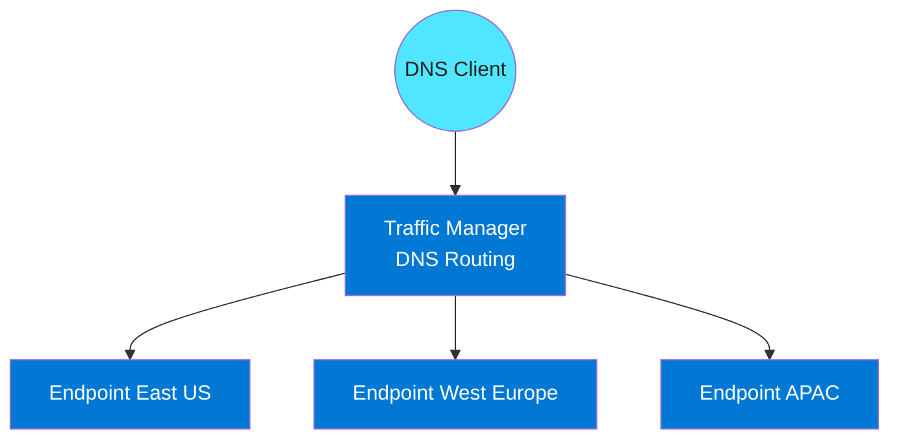

### Explanation

#### What it is

- Traffic Manager answers DNS queries instead of proxying application traffic.
- It supports priority, weighted, geographic, performance, multivalue, and subnet routing.
- DNS TTL influences failover behavior.
- It can target Azure endpoints, external endpoints, and nested profiles.
- It works well for simple global failover and non-HTTP services.
- It does not provide WAF, caching, or HTTP inspection.
- Resolver caching means failover is not always immediate for all clients.
- It is a good choice when DNS steering is enough.

#### Key capabilities

| Capability | Description | Why it matters |
|---|---|---|
| Priority routing | Primary and failover endpoints | Supports active-passive DR |
| Weighted routing | Distributes answers by weight | Useful for canaries and gradual shifts |
| Geographic routing | Routes by user region | Supports locality and data residency needs |
| Performance routing | Chooses lowest-latency endpoint | Improves user response time |
| Multivalue routing | Returns multiple healthy endpoints | Supports retry-capable clients |
| Subnet routing | Maps client IP ranges to endpoints | Supports network-aware steering |

#### Design notes

- Use Traffic Manager when DNS steering is sufficient.
- Set TTL deliberately.
- Use nested profiles for complex routing logic.
- Expect client-side cache behavior to affect failover speed.
- Prefer Front Door for modern web edge features.
- Keep endpoint health probes simple and reliable.

### Azure CLI commands

```bash
RG=rg-tm
PROFILE=tm-global-app

az group create -n $RG -l eastus
az network traffic-manager profile create -g $RG -n $PROFILE --routing-method Performance --unique-dns-name tm-global-app-demo --ttl 30 --protocol HTTPS --port 443 --path /healthz
az network traffic-manager endpoint create -g $RG --profile-name $PROFILE -n ep-eastus --type azureEndpoints --target-resource-id /subscriptions/<sub>/resourceGroups/rg-app/providers/Microsoft.Network/publicIPAddresses/pip-eastus --endpoint-status Enabled --priority 1 --weight 100
az network traffic-manager endpoint create -g $RG --profile-name $PROFILE -n ep-weu --type azureEndpoints --target-resource-id /subscriptions/<sub>/resourceGroups/rg-app/providers/Microsoft.Network/publicIPAddresses/pip-weu --endpoint-status Enabled --priority 2 --weight 50
az network traffic-manager profile update -g $RG -n $PROFILE --routing-method Weighted
az network traffic-manager endpoint update -g $RG --profile-name $PROFILE -n ep-eastus --type azureEndpoints --weight 80
az network traffic-manager endpoint update -g $RG --profile-name $PROFILE -n ep-weu --type azureEndpoints --weight 20
az network traffic-manager profile create -g $RG -n tm-geo --routing-method Geographic --unique-dns-name tm-geo-demo --ttl 60 --protocol HTTPS --port 443 --path /healthz
az network traffic-manager endpoint create -g $RG --profile-name tm-geo -n ep-eu --type externalEndpoints --target eu.contoso.com --geo-mapping GEO-EU
az network traffic-manager profile show -g $RG -n $PROFILE -o yaml
```

### Best practices

- Use Traffic Manager for DNS-only global routing use cases.
- Match the routing method to business intent.
- Keep TTL low enough for realistic failover but not unnecessarily low.
- Use nested profiles where needed.
- Document endpoint weights and priorities.
- Test failover from real client networks.
- Review geographic routing against residency requirements.
- Prefer Front Door for edge web security and acceleration.

### Monitoring and troubleshooting

- Track endpoint health and DNS distribution.
- Test resolver behavior with low TTL scenarios.
- Review nested profile dependencies during incidents.
- Validate endpoint probe paths and certificates.
- Expect resolver caching to slow some failovers.

---

## Azure DNS

Azure DNS hosts public and private authoritative DNS zones.

### Mermaid diagram

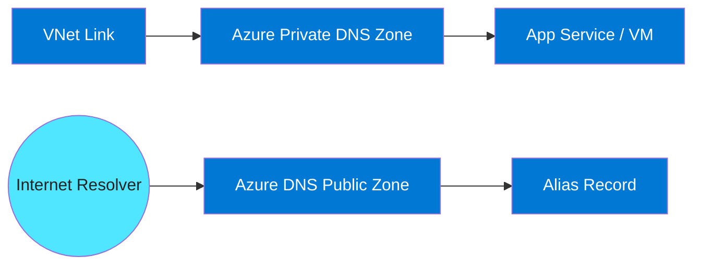

### Explanation

#### What it is

- Azure DNS hosts authoritative public DNS records for internet domains.
- Azure Private DNS provides private name resolution inside linked VNets.
- Alias records can point to Azure resources instead of hardcoded IPs.
- Private DNS zones are heavily used with Private Link.
- VNet links control which networks can resolve a private zone.
- Registration-enabled links can auto-register VM names.
- Hybrid name resolution often requires forwarding to or from on-premises DNS.
- DNS is tightly coupled with network reachability and application availability.

#### Key capabilities

| Capability | Description | Why it matters |
|---|---|---|
| Public zones | Authoritative internet DNS | Supports public app discovery |
| Private zones | Authoritative private DNS | Supports private service discovery |
| Alias records | Reference Azure resources | Reduces manual IP maintenance |
| VNet links | Bind private zones to VNets | Controls resolution scope |
| Auto-registration | Registers VM names automatically | Simplifies small environments |
| Hybrid integration | Forwarding to custom/on-prem DNS | Extends DNS consistency |

#### Design notes

- Keep public and private namespace behavior intentional.
- Use alias records when possible.
- Link private zones only where needed.
- Standardize ownership of Private Link-related zones.
- Use registration-enabled links only when appropriate.
- Include DNS validation in every network change workflow.

### Azure CLI commands

```bash
RG=rg-dns
PUBZONE=contoso.com
PRIVZONE=privatelink.database.windows.net

az group create -n $RG -l eastus
az network dns zone create -g $RG -n $PUBZONE
az network dns record-set a add-record -g $RG -z $PUBZONE -n app -a 20.30.40.50
az network dns record-set cname set-record -g $RG -z $PUBZONE -n www -c app.contoso.com
az network dns record-set a create -g $RG -z $PUBZONE -n api --target-resource /subscriptions/<sub>/resourceGroups/rg-app/providers/Microsoft.Network/publicIPAddresses/pip-api
az network private-dns zone create -g $RG -n $PRIVZONE
az network private-dns link vnet create -g $RG -n link-data --zone-name $PRIVZONE -v /subscriptions/<sub>/resourceGroups/rg-net/providers/Microsoft.Network/virtualNetworks/vnet-prod-eus -e false
az network private-dns record-set a create -g $RG -z $PRIVZONE -n sqlserver1
az network private-dns record-set a add-record -g $RG -z $PRIVZONE -n sqlserver1 -a 10.10.3.4
az network dns zone show -g $RG -n $PUBZONE -o yaml
az network private-dns zone show -g $RG -n $PRIVZONE -o yaml
```

### Best practices

- Design public and private namespaces together.
- Use alias records instead of hardcoded IPs.
- Limit private zone links to networks that need them.
- Standardize private endpoint DNS patterns.
- Use DNS Private Resolver or approved forwarders for hybrid resolution.
- Protect DNS changes with RBAC and review.
- Monitor stale records regularly.
- Include DNS checks in deployment validation.

### Monitoring and troubleshooting

- Validate public and private resolution from multiple client locations.
- Review VNet links when only some networks can resolve a record.
- Check for stale records after resource recreation.
- Correlate DNS and network logs together.
- Keep clear record ownership for emergency changes.

---

## Azure Private Link / Private Endpoint

Private Link brings Azure services into your network with private IP connectivity.

### Mermaid diagram

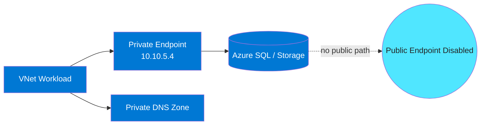

### Explanation

#### What it is

- A private endpoint places a private IP in your subnet for a specific service instance.
- Traffic stays on the Azure backbone.
- DNS is essential so standard service names resolve to the private endpoint IP.
- Private Link is more restrictive than service endpoints.
- Public network access is often disabled after private connectivity is validated.
- Private endpoints are usually placed in dedicated subnets.
- Approval can be automatic or manual depending on ownership and scope.
- It is a strong control for data exfiltration reduction.

#### Key capabilities

| Capability | Description | Why it matters |
|---|---|---|
| Private connectivity | Private IP to a PaaS or partner service | Avoids public endpoint reliance |
| Resource-specific scope | Connects to a single service instance | Improves isolation |
| DNS integration | Private zones map names to private IPs | Makes adoption transparent to apps |
| Public access disablement | Supports private-only posture | Tightens exposure control |
| Cross-tenant patterns | Can connect to approved external services | Enables secure B2B consumption |
| Subresource targeting | blob, sqlServer, vault, and more | Limits exposure to needed interfaces |

#### Design notes

- Use dedicated subnets for private endpoints where possible.
- Always design DNS and private endpoint rollout together.
- Disable public access only after validation.
- Document each service subresource used.
- Review NSG and route policies around private endpoint subnets.
- Plan multi-region DNS and failover behavior carefully.

### Azure CLI commands

```bash
RG=rg-privatelink
LOC=eastus
PE=pe-sql-prod
ZONE=privatelink.database.windows.net

az group create -n $RG -l $LOC
az network private-dns zone create -g $RG -n $ZONE
az network private-dns link vnet create -g $RG -n link-sql-prod --zone-name $ZONE -v /subscriptions/<sub>/resourceGroups/rg-net/providers/Microsoft.Network/virtualNetworks/vnet-prod-eus -e false
az network private-endpoint create -g $RG -n $PE -l $LOC --vnet-name vnet-prod-eus --subnet snet-private-endpoints --private-connection-resource-id /subscriptions/<sub>/resourceGroups/rg-data/providers/Microsoft.Sql/servers/sqlprod01 --group-id sqlServer --connection-name peconn-sqlprod01
az network private-endpoint dns-zone-group create -g $RG --endpoint-name $PE -n dzg-sql --private-dns-zone $ZONE --zone-name $ZONE
az sql server update -g rg-data -n sqlprod01 --public-network-access Disabled
az network private-endpoint show -g $RG -n $PE -o yaml
az network private-endpoint-connection list --id /subscriptions/<sub>/resourceGroups/rg-data/providers/Microsoft.Sql/servers/sqlprod01 -o table
az network private-dns record-set a list -g $RG -z $ZONE -o table
```

### Best practices

- Use Private Link for sensitive PaaS services.
- Design DNS and endpoint deployment together.
- Disable public access after successful validation.
- Keep private endpoints in clearly named, dedicated subnets.
- Review approvals and RBAC carefully.
- Test from all consumer networks, including hybrid clients.
- Prefer Private Link over service endpoints for stricter exfiltration control.
- Maintain inventory of private endpoints and their service mappings.

### Monitoring and troubleshooting

- Validate resolved IPs before checking routes or firewalls.
- Check approval state if the endpoint exists but traffic fails.
- Review private DNS records after failover or recreation.
- Monitor rejected public access attempts after private-only cutover.
- Keep a dependency map of private endpoint consumers.

---

## Azure DDoS Protection

Azure DDoS Protection enhances mitigation for attacks against public IP resources.

### Mermaid diagram

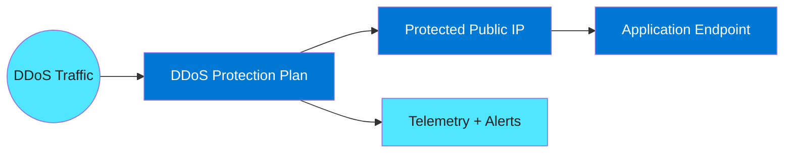

### Explanation

#### What it is

- Azure provides baseline DDoS protection by default.
- DDoS Protection enhances that baseline for protected public resources.
- It includes richer telemetry and mitigation visibility.
- Adaptive tuning baselines application traffic patterns.
- It helps protect public IP-backed services such as load balancers and application gateways.
- It can provide cost protection for qualified events.
- It complements, but does not replace, WAF and app-layer defenses.
- It is most relevant for business-critical public services.

#### Key capabilities

| Capability | Description | Why it matters |
|---|---|---|
| Baseline protection | Default Azure platform mitigation | Protects all Azure customers |
| Network Protection | Enhanced mitigation and visibility | Adds operational value for critical apps |
| Adaptive tuning | Per-resource traffic baselines | Improves mitigation precision |
| Attack telemetry | Metrics and logs during events | Speeds incident response |
| Mitigation visibility | Shows attack and mitigation state | Supports communications and forensics |
| Cost protection | Helps with some attack-driven scale costs | Reduces financial impact |

#### Design notes

- Protect production public services with significant business impact.
- Integrate telemetry into central monitoring and incident workflows.
- Keep frontend architecture inventory current.
- Combine DDoS Protection with WAF, caching, and autoscaling.
- Review which VNets and public entry points must be covered.
- Remember this is one layer in a defense-in-depth model.

### Azure CLI commands

```bash
RG=rg-ddos
PLAN=ddos-plan-prod
VNET=vnet-hub-prod

az group create -n $RG -l eastus
az network ddos-protection create -g $RG -n $PLAN
az network vnet update -g $RG -n $VNET --ddos-protection true --ddos-protection-plan $PLAN
az network public-ip create -g $RG -n pip-protected-web --sku Standard
az network ddos-protection show -g $RG -n $PLAN -o yaml
az monitor metrics list --resource /subscriptions/<sub>/resourceGroups/$RG/providers/Microsoft.Network/publicIPAddresses/pip-protected-web --metric IfUnderDDoSAttack DDoSTriggerSYNPackets DDoSMitigationFlowCount
az monitor activity-log list --resource-group $RG --status Succeeded --offset 7d
```

### Best practices

- Protect high-value public applications.
- Integrate alerts with SOC and NOC processes.
- Combine with WAF and app-layer controls.
- Standardize which VNets must be associated with a plan.
- Test scale behavior under stress conditions.
- Keep incident runbooks ready.
- Audit plan coverage regularly.
- Review telemetry after each event for improvement opportunities.

### Monitoring and troubleshooting

- Watch mitigation status on protected public IPs.
- Correlate mitigation events with frontend errors and autoscale behavior.
- Validate plan association after infrastructure changes.
- Use alerts to trigger incident workflows automatically.
- Preserve historical event data for postmortems.

---

## Network Watcher

Network Watcher is Azure’s built-in network diagnostics and observability service.

### Mermaid diagram

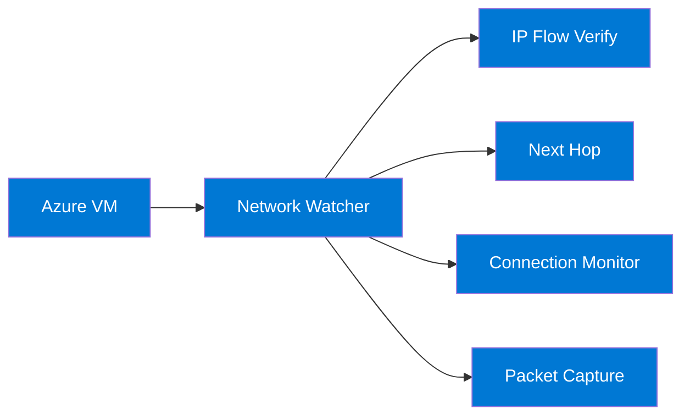

### Explanation

#### What it is

- Network Watcher is region-scoped.
- It provides built-in troubleshooting tools for Azure networking.
- IP flow verify checks whether NSGs allow or deny a specific flow.
- Next hop shows where Azure routes traffic.
- Connection Monitor provides synthetic reachability and latency testing.
- Packet capture collects packets from VMs for deep analysis.
- NSG flow logs provide historical traffic evidence.
- Network Watcher is essential for day-2 troubleshooting and validation.

#### Key capabilities

| Capability | Description | Why it matters |
|---|---|---|
| NSG flow logs | Records allowed and denied flows | Supports trend analysis and forensics |
| Connection Monitor | Synthetic path testing | Detects dependency issues continuously |
| Packet capture | Remote packet collection from VMs | Supports deep troubleshooting |
| IP flow verify | Tests effective NSG outcome | Quickly isolates security rule issues |
| Next hop | Shows effective route destination | Explains pathing behavior |
| Topology/effective views | Reveals network dependencies | Speeds root cause analysis |

#### Design notes

- Enable Network Watcher in every active region.
- Use Connection Monitor for critical service dependencies.
- Centralize flow logs in storage or Log Analytics.
- Start with next hop and IP flow verify before packet capture.
- Standardize troubleshooting runbooks.
- Protect diagnostic data because it can reveal sensitive patterns.

### Azure CLI commands

```bash
RG=rg-watch
LOC=eastus

az network watcher configure -g NetworkWatcherRG -l $LOC --enabled true
az network watcher flow-log configure -g $RG --nsg nsg-app-eastus --enabled true --traffic-analytics true --workspace /subscriptions/<sub>/resourceGroups/rg-ops/providers/Microsoft.OperationalInsights/workspaces/law-net --storage-account stnetworklogs
az network watcher test-ip-flow -g $RG --vm vm-app-01 --direction Outbound --local 10.10.2.4:50000 --remote 40.90.4.1:443 --protocol Tcp
az network watcher show-next-hop -g $RG --vm vm-app-01 --source-ip 10.10.2.4 --dest-ip 8.8.8.8
az network watcher connection-monitor create -g $RG -n cm-app-to-sql --source-resource vm-app-01 --dest-resource /subscriptions/<sub>/resourceGroups/rg-data/providers/Microsoft.Sql/servers/sqlprod01 --dest-port 1433
az network watcher connection-monitor query -g $RG -n cm-app-to-sql
az network watcher packet-capture create -g $RG -n pc-app --vm vm-app-01 --storage-account stcaptures --time-limit 300 --capture-size 1024
az network watcher packet-capture show -g $RG -n pc-app
az network watcher topology -g $RG -l $LOC --resource-group rg-app
az network watcher test-connectivity -g $RG --source-resource vm-app-01 --dest-address sqlprod01.database.windows.net --dest-port 1433
```

### Best practices

- Enable Network Watcher proactively.
- Collect flow logs for audit and troubleshooting needs.
- Use Connection Monitor for important dependency paths.
- Start with route and NSG tools before packet capture.
- Correlate Watcher results with firewall and DNS telemetry.
- Standardize diagnostic sequences in runbooks.
- Protect capture and flow-log storage.
- Ensure operations teams have permission to run diagnostics.

### Monitoring and troubleshooting

- Check flow logs before changing NSG policy.
- Use targeted packet captures only when needed.
- Trend connection latency for early warning.
- Validate next hop after every route or peering change.
- Keep Watcher enabled by policy in active regions.

---

## Operational validation appendices

These appendices provide additional topic-by-topic validation checklists to support design reviews, deployment reviews, and production readiness assessments.

### Virtual Network (VNet) validation checklist

- [01] Confirm address spaces do not overlap with current or future Azure and on-premises networks.
- [02] Confirm subnets align with trust boundaries and operational ownership.
- [03] Confirm delegated subnets are used only for supported services.
- [04] Confirm service endpoints are used only where public endpoint access is acceptable.
- [05] Confirm private endpoint subnets are clearly separated from app subnets.
- [06] Confirm subnet sizing leaves growth room for scale-out and service changes.
- [07] Confirm IPAM records are updated after every subnet or address-space change.
- [08] Confirm DNS dependencies are validated for private connectivity patterns.
- [09] Confirm gateway and firewall dedicated subnets meet service sizing guidance.
- [10] Confirm peering and hybrid designs were considered before finalizing address space.
- [11] Confirm the naming convention is consistent and environment-aware.
- [12] Confirm tags identify owner, environment, application, and cost center.
- [13] Confirm the selected region and SKU match resilience and budget requirements.
- [14] Confirm diagnostics are enabled and routed to the right workspace or storage target.
- [15] Confirm RBAC and change ownership are clearly documented.
- [16] Confirm the design is represented in architecture diagrams and runbooks.
- [17] Confirm policy exemptions, if any, are documented and approved.
- [18] Confirm the deployment is automated through Infrastructure as Code where practical.
- [19] Confirm dependencies on DNS, routing, and security services are understood.
- [20] Confirm there is a rollback or recovery plan for configuration changes.
- [21] Confirm test cases exist for normal traffic, failure, and maintenance scenarios.
- [22] Confirm monitoring alerts are tuned to useful operational thresholds.
- [23] Confirm production and non-production settings are intentionally different where required.
- [24] Confirm service limits and quotas have been reviewed.
- [25] Confirm the design avoids unnecessary public exposure.
- [26] Confirm support teams know how to validate the effective configuration.
- [27] Confirm baseline logs and metrics are captured before major changes.
- [28] Confirm documentation includes known caveats and platform restrictions.
- [29] Confirm dependencies on certificates, secrets, or PSKs are operationally managed.
- [30] Confirm the solution has been reviewed for cost implications under scale or failover.

### Network Security Groups (NSGs) validation checklist

- [01] Confirm rule priorities follow a documented numbering scheme.
- [02] Confirm no broad allow rule shadows more specific intended controls.
- [03] Confirm subnet-level and NIC-level NSGs do not conflict unexpectedly.
- [04] Confirm ASGs are used where application grouping is more stable than IPs.
- [05] Confirm health probe traffic is allowed for load-balanced workloads.
- [06] Confirm temporary troubleshooting rules are removed after use.
- [07] Confirm deny rules are intentional and documented.
- [08] Confirm outbound rules reflect approved egress destinations and ports.
- [09] Confirm effective rules were validated on sample NICs.
- [10] Confirm flow logging or equivalent visibility exists for critical workloads.
- [11] Confirm the naming convention is consistent and environment-aware.
- [12] Confirm tags identify owner, environment, application, and cost center.
- [13] Confirm the selected region and SKU match resilience and budget requirements.
- [14] Confirm diagnostics are enabled and routed to the right workspace or storage target.
- [15] Confirm RBAC and change ownership are clearly documented.
- [16] Confirm the design is represented in architecture diagrams and runbooks.
- [17] Confirm policy exemptions, if any, are documented and approved.
- [18] Confirm the deployment is automated through Infrastructure as Code where practical.
- [19] Confirm dependencies on DNS, routing, and security services are understood.
- [20] Confirm there is a rollback or recovery plan for configuration changes.
- [21] Confirm test cases exist for normal traffic, failure, and maintenance scenarios.
- [22] Confirm monitoring alerts are tuned to useful operational thresholds.
- [23] Confirm production and non-production settings are intentionally different where required.
- [24] Confirm service limits and quotas have been reviewed.
- [25] Confirm the design avoids unnecessary public exposure.
- [26] Confirm support teams know how to validate the effective configuration.
- [27] Confirm baseline logs and metrics are captured before major changes.
- [28] Confirm documentation includes known caveats and platform restrictions.
- [29] Confirm dependencies on certificates, secrets, or PSKs are operationally managed.
- [30] Confirm the solution has been reviewed for cost implications under scale or failover.

### Azure Firewall validation checklist

- [01] Confirm the correct SKU is chosen: Standard for baseline or Premium for deeper inspection.
- [02] Confirm firewall subnet sizing meets current and future capacity needs.
- [03] Confirm UDRs actually steer intended spoke traffic through the firewall.
- [04] Confirm DNAT is used sparingly and only where justified.
- [05] Confirm application rules use FQDNs or URLs that match business intent.
- [06] Confirm threat intelligence mode aligns with security operations policy.
- [07] Confirm TLS inspection trust distribution is planned before enablement.
- [08] Confirm rule collection priorities are consistent and documented.
- [09] Confirm firewall logs are retained long enough for investigations.
- [10] Confirm spoke teams know which traffic paths are centrally inspected.
- [11] Confirm the naming convention is consistent and environment-aware.
- [12] Confirm tags identify owner, environment, application, and cost center.
- [13] Confirm the selected region and SKU match resilience and budget requirements.
- [14] Confirm diagnostics are enabled and routed to the right workspace or storage target.
- [15] Confirm RBAC and change ownership are clearly documented.
- [16] Confirm the design is represented in architecture diagrams and runbooks.
- [17] Confirm policy exemptions, if any, are documented and approved.
- [18] Confirm the deployment is automated through Infrastructure as Code where practical.
- [19] Confirm dependencies on DNS, routing, and security services are understood.
- [20] Confirm there is a rollback or recovery plan for configuration changes.
- [21] Confirm test cases exist for normal traffic, failure, and maintenance scenarios.
- [22] Confirm monitoring alerts are tuned to useful operational thresholds.
- [23] Confirm production and non-production settings are intentionally different where required.
- [24] Confirm service limits and quotas have been reviewed.
- [25] Confirm the design avoids unnecessary public exposure.
- [26] Confirm support teams know how to validate the effective configuration.
- [27] Confirm baseline logs and metrics are captured before major changes.
- [28] Confirm documentation includes known caveats and platform restrictions.
- [29] Confirm dependencies on certificates, secrets, or PSKs are operationally managed.
- [30] Confirm the solution has been reviewed for cost implications under scale or failover.

### NAT Gateway validation checklist

- [01] Confirm the subnet truly requires simple outbound internet access rather than inspection.
- [02] Confirm the egress IP or prefix is communicated to SaaS or partner allowlists.
- [03] Confirm SNAT sizing considers concurrency and burst behavior.
- [04] Confirm applications use keepalives appropriate for the configured idle timeout.
- [05] Confirm no conflicting egress design is applied to the same subnet.
- [06] Confirm instance-level public IPs are not unnecessarily attached.
- [07] Confirm private subnets using NAT are documented for operations teams.
- [08] Confirm outbound requirements do not include unsupported inbound expectations.
- [09] Confirm route tables do not unintentionally bypass the NAT design.
- [10] Confirm monitoring exists for failed connections and SNAT usage.
- [11] Confirm the naming convention is consistent and environment-aware.
- [12] Confirm tags identify owner, environment, application, and cost center.
- [13] Confirm the selected region and SKU match resilience and budget requirements.
- [14] Confirm diagnostics are enabled and routed to the right workspace or storage target.
- [15] Confirm RBAC and change ownership are clearly documented.
- [16] Confirm the design is represented in architecture diagrams and runbooks.
- [17] Confirm policy exemptions, if any, are documented and approved.
- [18] Confirm the deployment is automated through Infrastructure as Code where practical.
- [19] Confirm dependencies on DNS, routing, and security services are understood.
- [20] Confirm there is a rollback or recovery plan for configuration changes.
- [21] Confirm test cases exist for normal traffic, failure, and maintenance scenarios.
- [22] Confirm monitoring alerts are tuned to useful operational thresholds.
- [23] Confirm production and non-production settings are intentionally different where required.
- [24] Confirm service limits and quotas have been reviewed.
- [25] Confirm the design avoids unnecessary public exposure.
- [26] Confirm support teams know how to validate the effective configuration.
- [27] Confirm baseline logs and metrics are captured before major changes.
- [28] Confirm documentation includes known caveats and platform restrictions.
- [29] Confirm dependencies on certificates, secrets, or PSKs are operationally managed.
- [30] Confirm the solution has been reviewed for cost implications under scale or failover.

### User Defined Routes (UDRs) validation checklist

- [01] Confirm route tables are attached only to intended subnets.
- [02] Confirm default routes to appliances or gateways are deliberate and tested.
- [03] Confirm BGP propagation settings align with hybrid route design.
- [04] Confirm blackhole routes are documented with business justification.
- [05] Confirm the next-hop appliance is highly available and reachable.
- [06] Confirm asymmetric routing risk has been assessed.
- [07] Confirm effective routes were checked on representative NICs.
- [08] Confirm route ownership is clear during incident response.
- [09] Confirm application dependencies still work after forced tunneling.
- [10] Confirm rollback steps exist for route-table changes.
- [11] Confirm the naming convention is consistent and environment-aware.
- [12] Confirm tags identify owner, environment, application, and cost center.
- [13] Confirm the selected region and SKU match resilience and budget requirements.
- [14] Confirm diagnostics are enabled and routed to the right workspace or storage target.
- [15] Confirm RBAC and change ownership are clearly documented.
- [16] Confirm the design is represented in architecture diagrams and runbooks.
- [17] Confirm policy exemptions, if any, are documented and approved.
- [18] Confirm the deployment is automated through Infrastructure as Code where practical.
- [19] Confirm dependencies on DNS, routing, and security services are understood.
- [20] Confirm there is a rollback or recovery plan for configuration changes.
- [21] Confirm test cases exist for normal traffic, failure, and maintenance scenarios.
- [22] Confirm monitoring alerts are tuned to useful operational thresholds.
- [23] Confirm production and non-production settings are intentionally different where required.
- [24] Confirm service limits and quotas have been reviewed.
- [25] Confirm the design avoids unnecessary public exposure.
- [26] Confirm support teams know how to validate the effective configuration.
- [27] Confirm baseline logs and metrics are captured before major changes.
- [28] Confirm documentation includes known caveats and platform restrictions.
- [29] Confirm dependencies on certificates, secrets, or PSKs are operationally managed.
- [30] Confirm the solution has been reviewed for cost implications under scale or failover.

### VNet Peering validation checklist

- [01] Confirm all peered VNets have non-overlapping address spaces.
- [02] Confirm hub-to-spoke and spoke-to-hub peerings are configured as intended.
- [03] Confirm gateway transit flags are enabled only where required.
- [04] Confirm teams understand peering is non-transitive.
- [05] Confirm spoke-to-spoke traffic paths are explicitly designed and tested.
- [06] Confirm DNS and name-resolution expectations work across peered VNets.
- [07] Confirm global peering costs and latency were reviewed.
- [08] Confirm address-space changes include peering sync considerations.
- [09] Confirm central inspection paths are enforced with UDRs where needed.
- [10] Confirm peering dependencies are reflected in platform diagrams.
- [11] Confirm the naming convention is consistent and environment-aware.
- [12] Confirm tags identify owner, environment, application, and cost center.
- [13] Confirm the selected region and SKU match resilience and budget requirements.
- [14] Confirm diagnostics are enabled and routed to the right workspace or storage target.
- [15] Confirm RBAC and change ownership are clearly documented.
- [16] Confirm the design is represented in architecture diagrams and runbooks.
- [17] Confirm policy exemptions, if any, are documented and approved.
- [18] Confirm the deployment is automated through Infrastructure as Code where practical.
- [19] Confirm dependencies on DNS, routing, and security services are understood.
- [20] Confirm there is a rollback or recovery plan for configuration changes.
- [21] Confirm test cases exist for normal traffic, failure, and maintenance scenarios.
- [22] Confirm monitoring alerts are tuned to useful operational thresholds.
- [23] Confirm production and non-production settings are intentionally different where required.
- [24] Confirm service limits and quotas have been reviewed.
- [25] Confirm the design avoids unnecessary public exposure.
- [26] Confirm support teams know how to validate the effective configuration.
- [27] Confirm baseline logs and metrics are captured before major changes.
- [28] Confirm documentation includes known caveats and platform restrictions.
- [29] Confirm dependencies on certificates, secrets, or PSKs are operationally managed.
- [30] Confirm the solution has been reviewed for cost implications under scale or failover.

### Azure Virtual WAN validation checklist

- [01] Confirm Virtual WAN is justified by branch, user, or regional scale.
- [02] Confirm the selected hub regions are close to traffic sources and workloads.
- [03] Confirm route tables, labels, and route intent are documented.
- [04] Confirm secured hub requirements include firewall ownership and policy design.
- [05] Confirm SD-WAN partner support was validated where applicable.
- [06] Confirm coexistence or migration from classic hub-spoke is staged safely.
- [07] Confirm branch and VNet connection naming is standardized.
- [08] Confirm cost estimates include hubs, gateways, firewall, and data transfer.
- [09] Confirm inter-hub routing meets disaster recovery assumptions.
- [10] Confirm branch teams understand expected failover behavior.
- [11] Confirm the naming convention is consistent and environment-aware.
- [12] Confirm tags identify owner, environment, application, and cost center.
- [13] Confirm the selected region and SKU match resilience and budget requirements.
- [14] Confirm diagnostics are enabled and routed to the right workspace or storage target.
- [15] Confirm RBAC and change ownership are clearly documented.
- [16] Confirm the design is represented in architecture diagrams and runbooks.
- [17] Confirm policy exemptions, if any, are documented and approved.
- [18] Confirm the deployment is automated through Infrastructure as Code where practical.
- [19] Confirm dependencies on DNS, routing, and security services are understood.
- [20] Confirm there is a rollback or recovery plan for configuration changes.
- [21] Confirm test cases exist for normal traffic, failure, and maintenance scenarios.
- [22] Confirm monitoring alerts are tuned to useful operational thresholds.
- [23] Confirm production and non-production settings are intentionally different where required.
- [24] Confirm service limits and quotas have been reviewed.
- [25] Confirm the design avoids unnecessary public exposure.
- [26] Confirm support teams know how to validate the effective configuration.
- [27] Confirm baseline logs and metrics are captured before major changes.
- [28] Confirm documentation includes known caveats and platform restrictions.
- [29] Confirm dependencies on certificates, secrets, or PSKs are operationally managed.
- [30] Confirm the solution has been reviewed for cost implications under scale or failover.

### ExpressRoute validation checklist

- [01] Confirm circuit bandwidth matches expected throughput and growth.
- [02] Confirm primary and secondary paths are provider-diverse where possible.
- [03] Confirm private peering and Microsoft peering are used only where needed.
- [04] Confirm route filters are maintained and reviewed regularly.
- [05] Confirm BGP policy is consistent across Azure and on-premises edges.
- [06] Confirm FastPath eligibility and gateway requirements were validated.
- [07] Confirm operational contacts and LOA information are easy to find.
- [08] Confirm coexistence with VPN is intentional and tested.
- [09] Confirm failover testing is performed on a recurring schedule.
- [10] Confirm monitoring covers both path health and route advertisements.
- [11] Confirm the naming convention is consistent and environment-aware.
- [12] Confirm tags identify owner, environment, application, and cost center.
- [13] Confirm the selected region and SKU match resilience and budget requirements.
- [14] Confirm diagnostics are enabled and routed to the right workspace or storage target.
- [15] Confirm RBAC and change ownership are clearly documented.
- [16] Confirm the design is represented in architecture diagrams and runbooks.
- [17] Confirm policy exemptions, if any, are documented and approved.
- [18] Confirm the deployment is automated through Infrastructure as Code where practical.
- [19] Confirm dependencies on DNS, routing, and security services are understood.
- [20] Confirm there is a rollback or recovery plan for configuration changes.
- [21] Confirm test cases exist for normal traffic, failure, and maintenance scenarios.
- [22] Confirm monitoring alerts are tuned to useful operational thresholds.
- [23] Confirm production and non-production settings are intentionally different where required.
- [24] Confirm service limits and quotas have been reviewed.
- [25] Confirm the design avoids unnecessary public exposure.
- [26] Confirm support teams know how to validate the effective configuration.
- [27] Confirm baseline logs and metrics are captured before major changes.
- [28] Confirm documentation includes known caveats and platform restrictions.
- [29] Confirm dependencies on certificates, secrets, or PSKs are operationally managed.
- [30] Confirm the solution has been reviewed for cost implications under scale or failover.

### Azure VPN Gateway validation checklist

- [01] Confirm the chosen gateway SKU supports required tunnel count and throughput.
- [02] Confirm GatewaySubnet sizing supports growth.
- [03] Confirm active-active mode is used where higher resilience is required.
- [04] Confirm BGP settings match branch device configuration.
- [05] Confirm PSKs or certificates are stored and rotated securely.
- [06] Confirm client VPN address pools, DNS, and split-tunnel settings are validated.
- [07] Confirm device interoperability was tested before production rollout.
- [08] Confirm VNet-to-VNet tunnels are still justified versus peering.
- [09] Confirm tunnel health and failover are actively monitored.
- [10] Confirm branch inventory includes firmware and crypto compatibility notes.
- [11] Confirm the naming convention is consistent and environment-aware.
- [12] Confirm tags identify owner, environment, application, and cost center.
- [13] Confirm the selected region and SKU match resilience and budget requirements.
- [14] Confirm diagnostics are enabled and routed to the right workspace or storage target.
- [15] Confirm RBAC and change ownership are clearly documented.
- [16] Confirm the design is represented in architecture diagrams and runbooks.
- [17] Confirm policy exemptions, if any, are documented and approved.
- [18] Confirm the deployment is automated through Infrastructure as Code where practical.
- [19] Confirm dependencies on DNS, routing, and security services are understood.
- [20] Confirm there is a rollback or recovery plan for configuration changes.
- [21] Confirm test cases exist for normal traffic, failure, and maintenance scenarios.
- [22] Confirm monitoring alerts are tuned to useful operational thresholds.
- [23] Confirm production and non-production settings are intentionally different where required.
- [24] Confirm service limits and quotas have been reviewed.
- [25] Confirm the design avoids unnecessary public exposure.
- [26] Confirm support teams know how to validate the effective configuration.
- [27] Confirm baseline logs and metrics are captured before major changes.
- [28] Confirm documentation includes known caveats and platform restrictions.
- [29] Confirm dependencies on certificates, secrets, or PSKs are operationally managed.
- [30] Confirm the solution has been reviewed for cost implications under scale or failover.

### Azure Load Balancer validation checklist

- [01] Confirm Standard SKU is used for new production workloads.
- [02] Confirm health probes reflect true backend readiness.
- [03] Confirm backend pool membership is automated where possible.
- [04] Confirm outbound rules are used intentionally and not by accident.
- [05] Confirm HA Ports are reserved for scenarios that truly need all ports.
- [06] Confirm frontend IP design matches public or private exposure requirements.
- [07] Confirm NSGs allow probe and client traffic appropriately.
- [08] Confirm zone-redundant frontend design was considered.
- [09] Confirm inbound and outbound behavior was load tested.
- [10] Confirm operational teams know where to check probe state first.
- [11] Confirm the naming convention is consistent and environment-aware.
- [12] Confirm tags identify owner, environment, application, and cost center.
- [13] Confirm the selected region and SKU match resilience and budget requirements.
- [14] Confirm diagnostics are enabled and routed to the right workspace or storage target.
- [15] Confirm RBAC and change ownership are clearly documented.
- [16] Confirm the design is represented in architecture diagrams and runbooks.
- [17] Confirm policy exemptions, if any, are documented and approved.
- [18] Confirm the deployment is automated through Infrastructure as Code where practical.
- [19] Confirm dependencies on DNS, routing, and security services are understood.
- [20] Confirm there is a rollback or recovery plan for configuration changes.
- [21] Confirm test cases exist for normal traffic, failure, and maintenance scenarios.
- [22] Confirm monitoring alerts are tuned to useful operational thresholds.
- [23] Confirm production and non-production settings are intentionally different where required.
- [24] Confirm service limits and quotas have been reviewed.
- [25] Confirm the design avoids unnecessary public exposure.
- [26] Confirm support teams know how to validate the effective configuration.
- [27] Confirm baseline logs and metrics are captured before major changes.
- [28] Confirm documentation includes known caveats and platform restrictions.
- [29] Confirm dependencies on certificates, secrets, or PSKs are operationally managed.
- [30] Confirm the solution has been reviewed for cost implications under scale or failover.

### Application Gateway validation checklist

- [01] Confirm WAF v2 is used for internet-facing workloads unless exception-approved.
- [02] Confirm listener, rule, and pool naming remains readable at scale.
- [03] Confirm TLS certificate lifecycle is automated.
- [04] Confirm backend probes use realistic health endpoints.
- [05] Confirm rewrite rules are minimal and fully tested.
- [06] Confirm the gateway sits in a dedicated subnet.
- [07] Confirm host-based and path-based routing reflects application intent.
- [08] Confirm backend TLS settings match security requirements.
- [09] Confirm WAF tuning and exclusions are documented.
- [10] Confirm global entry patterns with Front Door are well understood.
- [11] Confirm the naming convention is consistent and environment-aware.
- [12] Confirm tags identify owner, environment, application, and cost center.
- [13] Confirm the selected region and SKU match resilience and budget requirements.
- [14] Confirm diagnostics are enabled and routed to the right workspace or storage target.
- [15] Confirm RBAC and change ownership are clearly documented.
- [16] Confirm the design is represented in architecture diagrams and runbooks.
- [17] Confirm policy exemptions, if any, are documented and approved.
- [18] Confirm the deployment is automated through Infrastructure as Code where practical.
- [19] Confirm dependencies on DNS, routing, and security services are understood.
- [20] Confirm there is a rollback or recovery plan for configuration changes.
- [21] Confirm test cases exist for normal traffic, failure, and maintenance scenarios.
- [22] Confirm monitoring alerts are tuned to useful operational thresholds.
- [23] Confirm production and non-production settings are intentionally different where required.
- [24] Confirm service limits and quotas have been reviewed.
- [25] Confirm the design avoids unnecessary public exposure.
- [26] Confirm support teams know how to validate the effective configuration.
- [27] Confirm baseline logs and metrics are captured before major changes.
- [28] Confirm documentation includes known caveats and platform restrictions.
- [29] Confirm dependencies on certificates, secrets, or PSKs are operationally managed.
- [30] Confirm the solution has been reviewed for cost implications under scale or failover.

### Azure Front Door validation checklist

- [01] Confirm Front Door is required for global edge entry rather than simple DNS steering.
- [02] Confirm caching policy is explicit by route.
- [03] Confirm origin priorities and weights reflect failover intent.
- [04] Confirm Private Link origins are approved and DNS-integrated where used.
- [05] Confirm custom domains and certificates are automated.
- [06] Confirm WAF policies are tuned in pre-production.
- [07] Confirm origin probe paths are lightweight and representative.
- [08] Confirm regional origin designs still provide local resilience.
- [09] Confirm teams understand Front Door vs Application Gateway responsibilities.
- [10] Confirm latency and failover tests are part of release validation.
- [11] Confirm the naming convention is consistent and environment-aware.
- [12] Confirm tags identify owner, environment, application, and cost center.
- [13] Confirm the selected region and SKU match resilience and budget requirements.
- [14] Confirm diagnostics are enabled and routed to the right workspace or storage target.
- [15] Confirm RBAC and change ownership are clearly documented.
- [16] Confirm the design is represented in architecture diagrams and runbooks.
- [17] Confirm policy exemptions, if any, are documented and approved.
- [18] Confirm the deployment is automated through Infrastructure as Code where practical.
- [19] Confirm dependencies on DNS, routing, and security services are understood.
- [20] Confirm there is a rollback or recovery plan for configuration changes.
- [21] Confirm test cases exist for normal traffic, failure, and maintenance scenarios.
- [22] Confirm monitoring alerts are tuned to useful operational thresholds.
- [23] Confirm production and non-production settings are intentionally different where required.
- [24] Confirm service limits and quotas have been reviewed.
- [25] Confirm the design avoids unnecessary public exposure.
- [26] Confirm support teams know how to validate the effective configuration.
- [27] Confirm baseline logs and metrics are captured before major changes.
- [28] Confirm documentation includes known caveats and platform restrictions.
- [29] Confirm dependencies on certificates, secrets, or PSKs are operationally managed.
- [30] Confirm the solution has been reviewed for cost implications under scale or failover.

### Azure Traffic Manager validation checklist

- [01] Confirm DNS-based routing is sufficient for the application use case.
- [02] Confirm the chosen routing method matches business intent.
- [03] Confirm TTL balances failover speed and resolver load.
- [04] Confirm endpoint health probes are stable and meaningful.
- [05] Confirm nested profiles are documented where used.
- [06] Confirm teams understand resolver caching effects on failover.
- [07] Confirm geographic routing complies with data residency needs.
- [08] Confirm weights and priorities are reviewed during release changes.
- [09] Confirm external endpoints are monitored for certificate and reachability health.
- [10] Confirm runbooks explain that Traffic Manager does not proxy application traffic.
- [11] Confirm the naming convention is consistent and environment-aware.
- [12] Confirm tags identify owner, environment, application, and cost center.
- [13] Confirm the selected region and SKU match resilience and budget requirements.
- [14] Confirm diagnostics are enabled and routed to the right workspace or storage target.
- [15] Confirm RBAC and change ownership are clearly documented.
- [16] Confirm the design is represented in architecture diagrams and runbooks.
- [17] Confirm policy exemptions, if any, are documented and approved.
- [18] Confirm the deployment is automated through Infrastructure as Code where practical.
- [19] Confirm dependencies on DNS, routing, and security services are understood.
- [20] Confirm there is a rollback or recovery plan for configuration changes.
- [21] Confirm test cases exist for normal traffic, failure, and maintenance scenarios.
- [22] Confirm monitoring alerts are tuned to useful operational thresholds.
- [23] Confirm production and non-production settings are intentionally different where required.
- [24] Confirm service limits and quotas have been reviewed.
- [25] Confirm the design avoids unnecessary public exposure.
- [26] Confirm support teams know how to validate the effective configuration.
- [27] Confirm baseline logs and metrics are captured before major changes.
- [28] Confirm documentation includes known caveats and platform restrictions.
- [29] Confirm dependencies on certificates, secrets, or PSKs are operationally managed.
- [30] Confirm the solution has been reviewed for cost implications under scale or failover.

### Azure DNS validation checklist

- [01] Confirm public and private zones are intentionally designed together.
- [02] Confirm alias records are used wherever possible.
- [03] Confirm private zone links are limited to VNets that need resolution.
- [04] Confirm split-horizon naming is documented for operations teams.
- [05] Confirm record ownership is clear for every critical zone.
- [06] Confirm stale record cleanup is part of routine hygiene.
- [07] Confirm hybrid forwarders or resolvers are documented and monitored.
- [08] Confirm registration-enabled links are used only where appropriate.
- [09] Confirm DNS changes are included in change control and validation.
- [10] Confirm emergency DNS rollback procedures are tested.
- [11] Confirm the naming convention is consistent and environment-aware.
- [12] Confirm tags identify owner, environment, application, and cost center.
- [13] Confirm the selected region and SKU match resilience and budget requirements.
- [14] Confirm diagnostics are enabled and routed to the right workspace or storage target.
- [15] Confirm RBAC and change ownership are clearly documented.
- [16] Confirm the design is represented in architecture diagrams and runbooks.
- [17] Confirm policy exemptions, if any, are documented and approved.
- [18] Confirm the deployment is automated through Infrastructure as Code where practical.
- [19] Confirm dependencies on DNS, routing, and security services are understood.
- [20] Confirm there is a rollback or recovery plan for configuration changes.
- [21] Confirm test cases exist for normal traffic, failure, and maintenance scenarios.
- [22] Confirm monitoring alerts are tuned to useful operational thresholds.
- [23] Confirm production and non-production settings are intentionally different where required.
- [24] Confirm service limits and quotas have been reviewed.
- [25] Confirm the design avoids unnecessary public exposure.
- [26] Confirm support teams know how to validate the effective configuration.
- [27] Confirm baseline logs and metrics are captured before major changes.
- [28] Confirm documentation includes known caveats and platform restrictions.
- [29] Confirm dependencies on certificates, secrets, or PSKs are operationally managed.
- [30] Confirm the solution has been reviewed for cost implications under scale or failover.

### Azure Private Link / Private Endpoint validation checklist

- [01] Confirm the correct service subresource is selected for the private endpoint.
- [02] Confirm DNS zones and zone groups are created as part of the same deployment.
- [03] Confirm public network access is disabled only after successful testing.
- [04] Confirm consumer VNets and on-premises clients resolve the private name correctly.
- [05] Confirm private endpoint subnets are dedicated where possible.
- [06] Confirm approval workflows and ownership are documented.
- [07] Confirm route and NSG expectations around the subnet are understood.
- [08] Confirm service failover and DNS behavior were reviewed.
- [09] Confirm inventory includes service name, region, and consumer networks.
- [10] Confirm exfiltration controls are aligned with security policy.
- [11] Confirm the naming convention is consistent and environment-aware.
- [12] Confirm tags identify owner, environment, application, and cost center.
- [13] Confirm the selected region and SKU match resilience and budget requirements.
- [14] Confirm diagnostics are enabled and routed to the right workspace or storage target.
- [15] Confirm RBAC and change ownership are clearly documented.
- [16] Confirm the design is represented in architecture diagrams and runbooks.
- [17] Confirm policy exemptions, if any, are documented and approved.
- [18] Confirm the deployment is automated through Infrastructure as Code where practical.
- [19] Confirm dependencies on DNS, routing, and security services are understood.
- [20] Confirm there is a rollback or recovery plan for configuration changes.
- [21] Confirm test cases exist for normal traffic, failure, and maintenance scenarios.
- [22] Confirm monitoring alerts are tuned to useful operational thresholds.
- [23] Confirm production and non-production settings are intentionally different where required.
- [24] Confirm service limits and quotas have been reviewed.
- [25] Confirm the design avoids unnecessary public exposure.
- [26] Confirm support teams know how to validate the effective configuration.
- [27] Confirm baseline logs and metrics are captured before major changes.
- [28] Confirm documentation includes known caveats and platform restrictions.
- [29] Confirm dependencies on certificates, secrets, or PSKs are operationally managed.
- [30] Confirm the solution has been reviewed for cost implications under scale or failover.

### Azure DDoS Protection validation checklist

- [01] Confirm all business-critical public entry points are associated with the right protection plan.
- [02] Confirm DDoS telemetry is integrated with incident response tooling.
- [03] Confirm the organization understands the difference between baseline and enhanced protection.
- [04] Confirm public IP inventory is accurate and continuously updated.
- [05] Confirm adjacent controls such as WAF and caching are in place.
- [06] Confirm autoscale expectations under attack are tested.
- [07] Confirm cost protection and support engagement procedures are documented.
- [08] Confirm runbooks explain mitigation visibility and customer impact communication.
- [09] Confirm alert thresholds are tuned to avoid missed events.
- [10] Confirm coverage is reviewed after new public services go live.
- [11] Confirm the naming convention is consistent and environment-aware.
- [12] Confirm tags identify owner, environment, application, and cost center.
- [13] Confirm the selected region and SKU match resilience and budget requirements.
- [14] Confirm diagnostics are enabled and routed to the right workspace or storage target.
- [15] Confirm RBAC and change ownership are clearly documented.
- [16] Confirm the design is represented in architecture diagrams and runbooks.
- [17] Confirm policy exemptions, if any, are documented and approved.
- [18] Confirm the deployment is automated through Infrastructure as Code where practical.
- [19] Confirm dependencies on DNS, routing, and security services are understood.
- [20] Confirm there is a rollback or recovery plan for configuration changes.
- [21] Confirm test cases exist for normal traffic, failure, and maintenance scenarios.
- [22] Confirm monitoring alerts are tuned to useful operational thresholds.
- [23] Confirm production and non-production settings are intentionally different where required.
- [24] Confirm service limits and quotas have been reviewed.
- [25] Confirm the design avoids unnecessary public exposure.
- [26] Confirm support teams know how to validate the effective configuration.
- [27] Confirm baseline logs and metrics are captured before major changes.
- [28] Confirm documentation includes known caveats and platform restrictions.
- [29] Confirm dependencies on certificates, secrets, or PSKs are operationally managed.
- [30] Confirm the solution has been reviewed for cost implications under scale or failover.

### Network Watcher validation checklist

- [01] Confirm Network Watcher is enabled in every active Azure region.
- [02] Confirm flow logs are enabled where forensic visibility is required.
- [03] Confirm Connection Monitor covers critical dependencies.
- [04] Confirm packet capture destinations and retention are secured.
- [05] Confirm operations teams know how to use next hop and IP flow verify.
- [06] Confirm regional troubleshooting runbooks are standardized.
- [07] Confirm the right Log Analytics workspace and storage accounts are used.
- [08] Confirm baseline connectivity tests are run before major changes.
- [09] Confirm packet capture is reserved for targeted scenarios.
- [10] Confirm policy keeps new subscriptions and regions observable.
- [11] Confirm the naming convention is consistent and environment-aware.
- [12] Confirm tags identify owner, environment, application, and cost center.
- [13] Confirm the selected region and SKU match resilience and budget requirements.
- [14] Confirm diagnostics are enabled and routed to the right workspace or storage target.
- [15] Confirm RBAC and change ownership are clearly documented.
- [16] Confirm the design is represented in architecture diagrams and runbooks.
- [17] Confirm policy exemptions, if any, are documented and approved.
- [18] Confirm the deployment is automated through Infrastructure as Code where practical.
- [19] Confirm dependencies on DNS, routing, and security services are understood.
- [20] Confirm there is a rollback or recovery plan for configuration changes.
- [21] Confirm test cases exist for normal traffic, failure, and maintenance scenarios.
- [22] Confirm monitoring alerts are tuned to useful operational thresholds.
- [23] Confirm production and non-production settings are intentionally different where required.
- [24] Confirm service limits and quotas have been reviewed.
- [25] Confirm the design avoids unnecessary public exposure.
- [26] Confirm support teams know how to validate the effective configuration.
- [27] Confirm baseline logs and metrics are captured before major changes.
- [28] Confirm documentation includes known caveats and platform restrictions.
- [29] Confirm dependencies on certificates, secrets, or PSKs are operationally managed.
- [30] Confirm the solution has been reviewed for cost implications under scale or failover.

---

## 📚 Official Documentation
- [Azure Virtual Network](https://learn.microsoft.com/en-us/azure/virtual-network/)
- [Azure Load Balancer](https://learn.microsoft.com/en-us/azure/load-balancer/)
- [Azure Application Gateway](https://learn.microsoft.com/en-us/azure/application-gateway/)
- [Azure Front Door](https://learn.microsoft.com/en-us/azure/frontdoor/)
- [Azure Private Link](https://learn.microsoft.com/en-us/azure/private-link/)
