# Azure Load Balancing: Real-World Traffic Switching Scenarios

> A field guide for Azure cloud engineers who need to build, operate, and switch traffic across web tiers without downtime.

This guide focuses on **practical load balancing patterns** rather than abstract theory.

You will see:

- When to use **Azure Load Balancer**, **Application Gateway**, **Front Door**, and **Traffic Manager**.
- How to build a **2-VM highly available web tier** behind an Azure Standard Load Balancer.
- How to perform **blue-green**, **rolling**, **canary**, and **regional failover** traffic switches.
- How to validate health, troubleshoot probes, and avoid common routing mistakes.
- How to implement the same core pattern with **Azure CLI**, **Terraform**, and verification commands.

> Assumption used throughout the document: Linux VMs expose a `healthz` endpoint on port `80` and a simple homepage that prints the hostname or app version.

## Reader shortcuts

- If you need the fastest deployment path, go to [Setting Up Load Balancer with 2 VMs](#2-setting-up-load-balancer-with-2-vms-step-by-step).
- If you need a change-management runbook, go to [Blue-Green Deployment with Load Balancer](#3--blue-green-deployment-with-load-balancer-real-scenario).
- If you need regional failover, go to [Traffic Manager for Multi-Region Failover](#5--traffic-manager-for-multi-region-failover).
- If you need operational runbooks, go to [Real-World Scenarios](#6-real-world-scenarios).
- If you are debugging, go to [Monitoring & Troubleshooting](#7-monitoring--troubleshooting).

## Conventions used in commands

- `$RG` = resource group
- `$LOC` = region
- `$LB` = load balancer name
- `$APPGW` = application gateway name
- `$TM` = traffic manager profile name
- `$BLUE` = current production version
- `$GREEN` = next release version
- Replace usernames, keys, DNS names, IPs, and certificate paths with your own values.

## Table of contents

1. [Azure Load Balancer Overview](#1-azure-load-balancer-overview)
2. [Setting Up Load Balancer with 2 VMs (Step-by-Step)](#2-setting-up-load-balancer-with-2-vms-step-by-step)
3. [🔄 Blue-Green Deployment with Load Balancer (REAL SCENARIO)](#3--blue-green-deployment-with-load-balancer-real-scenario)
4. [🎚️ Rolling Update with Application Gateway](#4--rolling-update-with-application-gateway)
5. [🌍 Traffic Manager for Multi-Region Failover](#5--traffic-manager-for-multi-region-failover)
6. [Real-World Scenarios](#6-real-world-scenarios)
7. [Monitoring & Troubleshooting](#7-monitoring--troubleshooting)
8. [Quick Reference](#8-quick-reference)
9. [Appendices](#9-appendices)

## 1. Azure Load Balancer Overview

Azure gives you several traffic distribution services.

The right answer depends on **OSI layer**, **routing intelligence**, **global vs regional scope**, and **how much application awareness you need**.

### 1.1 Service landscape

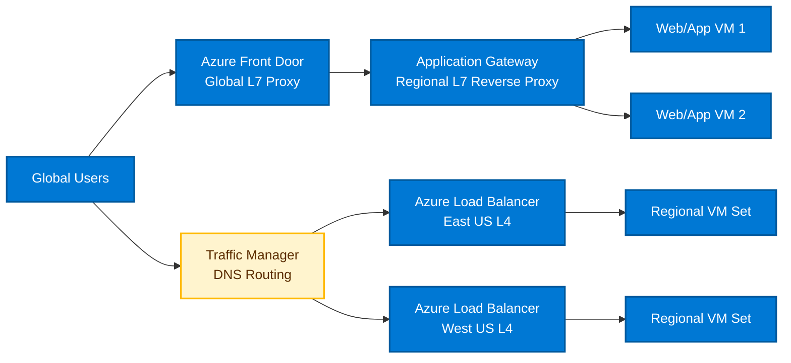

| Service | Layer | Scope | Protocols | Best use case | Avoid when |
|---|---|---|---|---|---|
| Azure Load Balancer | L4 | Regional | TCP/UDP | High-throughput regional balancing for VMs, VMSS, AKS node ports, internal/private workloads | You need HTTP headers, cookies, TLS offload, WAF, or URL routing |
| Application Gateway | L7 | Regional | HTTP/HTTPS/WebSocket | Web apps that need host/path routing, TLS termination, WAF, cookie affinity, connection draining | You only need simple TCP/UDP balancing or ultra-low-level packet forwarding |
| Front Door | L7 | Global | HTTP/HTTPS | Global web entry, acceleration, edge WAF, origin failover, CDN-style routing | Your workload is non-HTTP or must stay only inside a VNet without supported origin patterns |
| Traffic Manager | DNS | Global | Any protocol behind DNS | Multi-region failover or weighted steering when DNS-based routing is acceptable | You need instant per-request switching, TLS offload, WAF, or path-based routing |

### 1.2 Decision guidance

#### Choose Azure Load Balancer when:

- You need **regional** high availability for TCP or UDP.
- You want to balance traffic across **2+ VMs** or **VM Scale Set** instances.
- You need an **internal load balancer** for app or database tiers.
- You want **health-probe-driven failover** without L7 complexity.
- You are publishing non-HTTP services such as SMTP, custom TCP apps, MQTT brokers, Redis proxies, or SQL listeners.

#### Choose Application Gateway when:

- You need **HTTP-aware** routing.
- You need **TLS termination**.
- You need **host-based** or **URL path-based** routing.
- You need **cookie-based affinity** or **connection draining**.
- You need **WAF** protection on inbound web traffic.

#### Choose Front Door when:

- Users are global.
- You need **global anycast** entry and edge acceleration.
- You need **global origin health** and **fast failover**.
- You want **central WAF policy** at the edge.
- You are serving modern Internet-facing web apps or APIs.

#### Choose Traffic Manager when:

- DNS-based steering is enough.
- You need **priority failover** across regions.
- You need **weighted routing** for gradual shifts between endpoints.
- You need to route **non-HTTP** traffic at a global level by changing which endpoint clients resolve.
- You can tolerate **DNS TTL caching behavior**.

| Requirement | Best fit | Why |
|---|---|---|
| Single-region TCP web tier with 2 VMs | Azure Load Balancer | Simple, cheap, resilient L4 balancing |
| Regional web app with SSL offload and WAF | Application Gateway | It understands HTTP/S and handles certificates |
| Global web app with edge routing and WAF | Front Door | It is a global proxy and security edge |
| Active/passive regional failover for any protocol | Traffic Manager | DNS-based steering works for many endpoint types |
| Internal listener for app-to-db traffic | Internal Load Balancer | Private VIP inside the VNet |
| Zero-downtime VM patching | Azure Load Balancer + health probe | Drain one VM, patch it, rejoin it, repeat |

### 1.3 SKU guidance: Basic vs Standard

> Production default: **Standard Load Balancer**.

Basic Load Balancer is a legacy choice and should not be used for new production designs.

Standard Load Balancer provides stronger security defaults, zone-aware capabilities, and more operational features.

| Capability | Basic SKU | Standard SKU | Recommendation |
|---|---|---|---|
| Security model | Open by default in older patterns | Secure by default; use NSG rules explicitly | Prefer Standard |
| Availability zones | Limited/legacy | Supported | Prefer Standard |
| HA ports | No/limited | Supported | Prefer Standard |
| Outbound rules | Limited | Supported | Prefer Standard |
| SLA & production posture | Legacy | Current production option | Prefer Standard |
| Scaling and diagnostics | Lower capability | Richer metrics and diagnostics | Prefer Standard |
| Use for new deployments | No | Yes | Use Standard only |

### 1.4 Architecture pattern summary

- **L4 regional web/app tier**: Public Standard Load Balancer in front of 2+ VMs.
- **L7 regional web tier**: Application Gateway in front of backend pool.
- **Global active/passive**: Traffic Manager with two regional public load balancers.
- **Global web edge**: Front Door in front of Application Gateway or public origins.
- **Internal services**: Internal Load Balancer with private frontend IP.

### 1.5 Operational rule of thumb

- If the switch happens at the **packet/connection level**, think **Load Balancer**.
- If the switch happens at the **URL, host, or TLS layer**, think **Application Gateway**.
- If the switch happens at the **global edge**, think **Front Door**.
- If the switch happens at the **DNS answer level**, think **Traffic Manager**.

## 2. Setting Up Load Balancer with 2 VMs (Step-by-Step)

This section builds a **regional web tier** with:

- 1 VNet
- 1 subnet for web VMs
- 2 Linux VMs
- 1 Standard Public Load Balancer
- 1 backend pool
- 1 HTTP probe
- 1 TCP fallback probe
- 1 load balancing rule for web traffic
- 2 inbound NAT rules for SSH

### 2.1 Target architecture

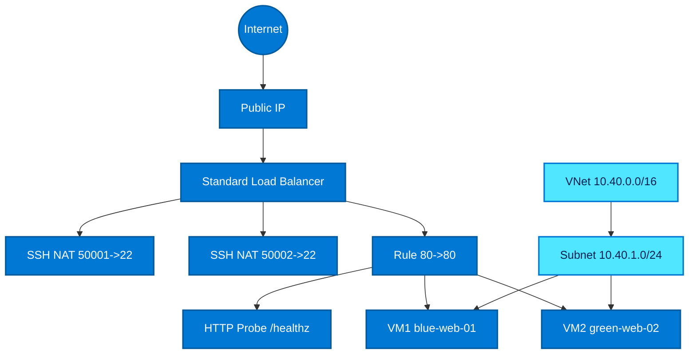

### 2.2 Step-by-step flow

```mermaid
flowchart LR
  A[Create resource group] --> B[Create VNet and subnet]
  B --> C[Create NSG rules]
  C --> D[Create availability set or zones]
  D --> E[Create 2 NICs]
  E --> F[Create 2 VMs]
  F --> G[Install web app and health endpoint]
  G --> H[Create Standard Public IP]
  H --> I[Create Standard Load Balancer]
  I --> J[Create backend pool]
  J --> K[Attach both NICs to pool]
  K --> L[Create HTTP and TCP probes]
  L --> M[Create LB rule]
  M --> N[Create SSH NAT rules]
  N --> O[Test distribution and health]
```

### 2.3 Variables used throughout the setup

```bash
RG=rg-lb-lab
LOC=eastus
VNET=vnet-lb-lab
SUBNET=snet-web
NSG=nsg-web
AVSET=avset-web
PIP=pip-lb-lab
LB=lb-web-prod
FE=fe-public
POOL=be-web
PROBE_HTTP=hp-http
PROBE_TCP=hp-tcp
RULE=rule-http
VM1=blue-web-01
VM2=green-web-02
NIC1=nic-blue-web-01
NIC2=nic-green-web-02
ADMIN=azureuser
SSH_KEY=$HOME/.ssh/id_rsa.pub
```

### 2.4 Optional cloud-init for both VMs

Use a tiny cloud-init file so the homepage and health probe clearly identify the node.

```yaml
#cloud-config
package_update: true
packages:
  - nginx
runcmd:
  - systemctl enable nginx
  - systemctl restart nginx
  - HOST=$(hostname)
  - printf "%s
" "$HOST" > /var/www/html/index.html
  - mkdir -p /var/www/html
  - printf "ok
" > /var/www/html/healthz
```

If you want VM-specific content, update the homepage later with `az vm run-command invoke`.

### 2.5 Create resource group, VNet, subnet, and NSG

```bash
az group create -n $RG -l $LOC

az network vnet create   -g $RG   -n $VNET   --address-prefixes 10.40.0.0/16   --subnet-name $SUBNET   --subnet-prefixes 10.40.1.0/24

az network nsg create -g $RG -n $NSG

az network nsg rule create   -g $RG   --nsg-name $NSG   -n allow-http   --priority 100   --access Allow   --direction Inbound   --protocol Tcp   --destination-port-ranges 80   --source-address-prefixes Internet

az network nsg rule create   -g $RG   --nsg-name $NSG   -n allow-lb-probe   --priority 110   --access Allow   --direction Inbound   --protocol Tcp   --source-address-prefixes AzureLoadBalancer   --destination-port-ranges 80 22

az network vnet subnet update   -g $RG   --vnet-name $VNET   -n $SUBNET   --network-security-group $NSG
```

### 2.6 Create availability set and NICs

If the region supports zones and you prefer zonal VMs, deploy one VM in zone 1 and another in zone 2.

For a simple, portable example, this guide uses an **availability set**.

```bash
az vm availability-set create   -g $RG   -n $AVSET   --platform-fault-domain-count 2   --platform-update-domain-count 2

az network nic create   -g $RG   -n $NIC1   --vnet-name $VNET   --subnet $SUBNET   --network-security-group $NSG

az network nic create   -g $RG   -n $NIC2   --vnet-name $VNET   --subnet $SUBNET   --network-security-group $NSG
```

### 2.7 Create VM1 and VM2

```bash
az vm create   -g $RG   -n $VM1   --nics $NIC1   --image Ubuntu2204   --size Standard_B2s   --admin-username $ADMIN   --ssh-key-values $SSH_KEY   --availability-set $AVSET   --custom-data cloud-init-web.yaml

az vm create   -g $RG   -n $VM2   --nics $NIC2   --image Ubuntu2204   --size Standard_B2s   --admin-username $ADMIN   --ssh-key-values $SSH_KEY   --availability-set $AVSET   --custom-data cloud-init-web.yaml
```

### 2.8 Stamp each VM with unique content

```bash
az vm run-command invoke   -g $RG   -n $VM1   --command-id RunShellScript   --scripts "echo blue-web-01 > /var/www/html/index.html && echo ok > /var/www/html/healthz && systemctl restart nginx"

az vm run-command invoke   -g $RG   -n $VM2   --command-id RunShellScript   --scripts "echo green-web-02 > /var/www/html/index.html && echo ok > /var/www/html/healthz && systemctl restart nginx"
```

### 2.9 Create Public IP and Standard Load Balancer

```bash
az network public-ip create   -g $RG   -n $PIP   --sku Standard   --allocation-method Static   --dns-name lb-lab-$RANDOM

az network lb create   -g $RG   -n $LB   --sku Standard   --public-ip-address $PIP   --frontend-ip-name $FE   --backend-pool-name $POOL
```

### 2.10 Attach both VM NICs to the backend pool

```bash
LB_POOL_ID=$(az network lb address-pool show   -g $RG   --lb-name $LB   -n $POOL   --query id -o tsv)

az network nic ip-config address-pool add   -g $RG   --nic-name $NIC1   --ip-config-name ipconfig1   --address-pool $LB_POOL_ID

az network nic ip-config address-pool add   -g $RG   --nic-name $NIC2   --ip-config-name ipconfig1   --address-pool $LB_POOL_ID
```

### 2.11 Configure health probes

Create an HTTP probe for the web tier and a TCP probe example for non-HTTP services.

```bash
az network lb probe create   -g $RG   --lb-name $LB   -n $PROBE_HTTP   --protocol Http   --port 80   --path /healthz   --interval 5   --threshold 2

az network lb probe create   -g $RG   --lb-name $LB   -n $PROBE_TCP   --protocol Tcp   --port 80   --interval 5   --threshold 2
```

### 2.12 Configure load balancing rule

```bash
az network lb rule create   -g $RG   --lb-name $LB   -n $RULE   --protocol Tcp   --frontend-port 80   --backend-port 80   --frontend-ip-name $FE   --backend-pool-name $POOL   --probe-name $PROBE_HTTP   --idle-timeout 15   --enable-tcp-reset true
```

### 2.13 Configure NAT rules for SSH access

```bash
az network lb inbound-nat-rule create   -g $RG   --lb-name $LB   -n nat-ssh-vm1   --protocol Tcp   --frontend-port 50001   --backend-port 22   --frontend-ip-name $FE

az network lb inbound-nat-rule create   -g $RG   --lb-name $LB   -n nat-ssh-vm2   --protocol Tcp   --frontend-port 50002   --backend-port 22   --frontend-ip-name $FE

NAT1_ID=$(az network lb inbound-nat-rule show -g $RG --lb-name $LB -n nat-ssh-vm1 --query id -o tsv)
NAT2_ID=$(az network lb inbound-nat-rule show -g $RG --lb-name $LB -n nat-ssh-vm2 --query id -o tsv)

az network nic ip-config inbound-nat-rule add   -g $RG   --nic-name $NIC1   --ip-config-name ipconfig1   --inbound-nat-rule $NAT1_ID

az network nic ip-config inbound-nat-rule add   -g $RG   --nic-name $NIC2   --ip-config-name ipconfig1   --inbound-nat-rule $NAT2_ID
```

### 2.14 Test traffic distribution

```bash
LB_IP=$(az network public-ip show -g $RG -n $PIP --query ipAddress -o tsv)

echo $LB_IP

for i in {1..10}; do
  curl -s http://$LB_IP/
  sleep 1
done
```

Expected sample output:

```text
blue-web-01
green-web-02
blue-web-01
green-web-02
green-web-02
blue-web-01
```

Probe verification:

```bash
curl -i http://$LB_IP/healthz
az network lb probe show -g $RG --lb-name $LB -n $PROBE_HTTP -o yaml
az network nic show -g $RG -n $NIC1 --query "ipConfigurations[0].loadBalancerBackendAddressPools[].id" -o tsv
az network nic show -g $RG -n $NIC2 --query "ipConfigurations[0].loadBalancerBackendAddressPools[].id" -o tsv
```

### 2.15 SSH to each VM through NAT

```bash
ssh -o StrictHostKeyChecking=no $ADMIN@$LB_IP -p 50001
ssh -o StrictHostKeyChecking=no $ADMIN@$LB_IP -p 50002
```

Inside each VM, validate:

```bash
hostname
cat /var/www/html/index.html
systemctl status nginx --no-pager
```

### 2.16 Complete Terraform example

The following Terraform builds the same 2-VM load-balanced environment.

```hcl
terraform {
  required_version = ">= 1.5.0"
  required_providers {
    azurerm = {
      source  = "hashicorp/azurerm"
      version = "~> 3.110"
    }
  }
}

provider "azurerm" {
  features {}
}

variable "location" {
  type    = string
  default = "eastus"
}

variable "resource_group_name" {
  type    = string
  default = "rg-lb-lab-tf"
}

variable "admin_username" {
  type    = string
  default = "azureuser"
}

variable "public_key_path" {
  type    = string
  default = "~/.ssh/id_rsa.pub"
}

locals {
  prefix = "lb-lab"
  tags = {
    env     = "lab"
    purpose = "load-balancer-demo"
  }
}

resource "azurerm_resource_group" "rg" {
  name     = var.resource_group_name
  location = var.location
  tags     = local.tags
}

resource "azurerm_virtual_network" "vnet" {
  name                = "${local.prefix}-vnet"
  address_space       = ["10.40.0.0/16"]
  location            = azurerm_resource_group.rg.location
  resource_group_name = azurerm_resource_group.rg.name
  tags                = local.tags
}

resource "azurerm_subnet" "web" {
  name                 = "snet-web"
  resource_group_name  = azurerm_resource_group.rg.name
  virtual_network_name = azurerm_virtual_network.vnet.name
  address_prefixes     = ["10.40.1.0/24"]
}

resource "azurerm_network_security_group" "web" {
  name                = "${local.prefix}-nsg"
  location            = azurerm_resource_group.rg.location
  resource_group_name = azurerm_resource_group.rg.name
  tags                = local.tags

  security_rule {
    name                       = "allow-http"
    priority                   = 100
    direction                  = "Inbound"
    access                     = "Allow"
    protocol                   = "Tcp"
    source_port_range          = "*"
    destination_port_range     = "80"
    source_address_prefix      = "Internet"
    destination_address_prefix = "*"
  }

  security_rule {
    name                       = "allow-lb-probe"
    priority                   = 110
    direction                  = "Inbound"
    access                     = "Allow"
    protocol                   = "Tcp"
    source_port_range          = "*"
    destination_port_ranges    = ["80", "22"]
    source_address_prefix      = "AzureLoadBalancer"
    destination_address_prefix = "*"
  }
}

resource "azurerm_subnet_network_security_group_association" "web" {
  subnet_id                 = azurerm_subnet.web.id
  network_security_group_id = azurerm_network_security_group.web.id
}

resource "azurerm_availability_set" "web" {
  name                = "${local.prefix}-avset"
  location            = azurerm_resource_group.rg.location
  resource_group_name = azurerm_resource_group.rg.name
  managed             = true
  tags                = local.tags
}

resource "azurerm_public_ip" "lb" {
  name                = "${local.prefix}-pip"
  location            = azurerm_resource_group.rg.location
  resource_group_name = azurerm_resource_group.rg.name
  allocation_method   = "Static"
  sku                 = "Standard"
  domain_name_label   = "lb-lab-demo-12345"
  tags                = local.tags
}

resource "azurerm_lb" "web" {
  name                = "${local.prefix}-lb"
  location            = azurerm_resource_group.rg.location
  resource_group_name = azurerm_resource_group.rg.name
  sku                 = "Standard"
  tags                = local.tags

  frontend_ip_configuration {
    name                 = "fe-public"
    public_ip_address_id = azurerm_public_ip.lb.id
  }
}

resource "azurerm_lb_backend_address_pool" "web" {
  name            = "be-web"
  loadbalancer_id = azurerm_lb.web.id
}

resource "azurerm_lb_probe" "http" {
  name                = "hp-http"
  loadbalancer_id     = azurerm_lb.web.id
  protocol            = "Http"
  port                = 80
  request_path        = "/healthz"
  interval_in_seconds = 5
  number_of_probes    = 2
}

resource "azurerm_lb_probe" "tcp" {
  name                = "hp-tcp"
  loadbalancer_id     = azurerm_lb.web.id
  protocol            = "Tcp"
  port                = 80
  interval_in_seconds = 5
  number_of_probes    = 2
}

resource "azurerm_lb_rule" "http" {
  name                           = "rule-http"
  loadbalancer_id                = azurerm_lb.web.id
  protocol                       = "Tcp"
  frontend_port                  = 80
  backend_port                   = 80
  frontend_ip_configuration_name = "fe-public"
  backend_address_pool_ids       = [azurerm_lb_backend_address_pool.web.id]
  probe_id                       = azurerm_lb_probe.http.id
  idle_timeout_in_minutes        = 15
  enable_tcp_reset               = true
}

resource "azurerm_lb_nat_rule" "vm1_ssh" {
  name                           = "nat-ssh-vm1"
  resource_group_name            = azurerm_resource_group.rg.name
  loadbalancer_id                = azurerm_lb.web.id
  protocol                       = "Tcp"
  frontend_port                  = 50001
  backend_port                   = 22
  frontend_ip_configuration_name = "fe-public"
}

resource "azurerm_lb_nat_rule" "vm2_ssh" {
  name                           = "nat-ssh-vm2"
  resource_group_name            = azurerm_resource_group.rg.name
  loadbalancer_id                = azurerm_lb.web.id
  protocol                       = "Tcp"
  frontend_port                  = 50002
  backend_port                   = 22
  frontend_ip_configuration_name = "fe-public"
}

resource "azurerm_network_interface" "vm1" {
  name                = "nic-blue-web-01"
  location            = azurerm_resource_group.rg.location
  resource_group_name = azurerm_resource_group.rg.name
  tags                = local.tags

  ip_configuration {
    name                          = "ipconfig1"
    subnet_id                     = azurerm_subnet.web.id
    private_ip_address_allocation = "Dynamic"
    load_balancer_backend_address_pools_ids = [
      azurerm_lb_backend_address_pool.web.id
    ]
    load_balancer_inbound_nat_rules_ids = [
      azurerm_lb_nat_rule.vm1_ssh.id
    ]
  }
}

resource "azurerm_network_interface" "vm2" {
  name                = "nic-green-web-02"
  location            = azurerm_resource_group.rg.location
  resource_group_name = azurerm_resource_group.rg.name
  tags                = local.tags

  ip_configuration {
    name                          = "ipconfig1"
    subnet_id                     = azurerm_subnet.web.id
    private_ip_address_allocation = "Dynamic"
    load_balancer_backend_address_pools_ids = [
      azurerm_lb_backend_address_pool.web.id
    ]
    load_balancer_inbound_nat_rules_ids = [
      azurerm_lb_nat_rule.vm2_ssh.id
    ]
  }
}

resource "azurerm_linux_virtual_machine" "vm1" {
  name                            = "blue-web-01"
  resource_group_name             = azurerm_resource_group.rg.name
  location                        = azurerm_resource_group.rg.location
  size                            = "Standard_B2s"
  admin_username                  = var.admin_username
  availability_set_id             = azurerm_availability_set.web.id
  disable_password_authentication = true
  network_interface_ids           = [azurerm_network_interface.vm1.id]
  custom_data                     = base64encode(<<-CLOUDINIT
#cloud-config
package_update: true
packages:
  - nginx
runcmd:
  - systemctl enable nginx
  - systemctl restart nginx
  - echo blue-web-01 > /var/www/html/index.html
  - echo ok > /var/www/html/healthz
CLOUDINIT
  )

  admin_ssh_key {
    username   = var.admin_username
    public_key = file(var.public_key_path)
  }

  os_disk {
    caching              = "ReadWrite"
    storage_account_type = "Standard_LRS"
  }

  source_image_reference {
    publisher = "Canonical"
    offer     = "0001-com-ubuntu-server-jammy"
    sku       = "22_04-lts-gen2"
    version   = "latest"
  }

  tags = local.tags
}

resource "azurerm_linux_virtual_machine" "vm2" {
  name                            = "green-web-02"
  resource_group_name             = azurerm_resource_group.rg.name
  location                        = azurerm_resource_group.rg.location
  size                            = "Standard_B2s"
  admin_username                  = var.admin_username
  availability_set_id             = azurerm_availability_set.web.id
  disable_password_authentication = true
  network_interface_ids           = [azurerm_network_interface.vm2.id]
  custom_data                     = base64encode(<<-CLOUDINIT
#cloud-config
package_update: true
packages:
  - nginx
runcmd:
  - systemctl enable nginx
  - systemctl restart nginx
  - echo green-web-02 > /var/www/html/index.html
  - echo ok > /var/www/html/healthz
CLOUDINIT
  )

  admin_ssh_key {
    username   = var.admin_username
    public_key = file(var.public_key_path)
  }

  os_disk {
    caching              = "ReadWrite"
    storage_account_type = "Standard_LRS"
  }

  source_image_reference {
    publisher = "Canonical"
    offer     = "0001-com-ubuntu-server-jammy"
    sku       = "22_04-lts-gen2"
    version   = "latest"
  }

  tags = local.tags
}

output "load_balancer_ip" {
  value = azurerm_public_ip.lb.ip_address
}

output "load_balancer_fqdn" {
  value = azurerm_public_ip.lb.fqdn
}

output "vm1_ssh" {
  value = "ssh ${var.admin_username}@${azurerm_public_ip.lb.ip_address} -p 50001"
}

output "vm2_ssh" {
  value = "ssh ${var.admin_username}@${azurerm_public_ip.lb.ip_address} -p 50002"
}
```

### 2.17 Terraform workflow

```bash
terraform init
terraform fmt
terraform validate
terraform plan -out tfplan
terraform apply tfplan
terraform output
```

### 2.18 What success looks like

- `curl http://$LB_IP/` alternates between the two hostnames over multiple requests.
- Both NICs show membership in the backend pool.
- The HTTP probe stays healthy.
- SSH works through `50001` and `50002`.
- If one VM stops serving `/healthz`, the other continues serving traffic.

## 3. 🔄 Blue-Green Deployment with Load Balancer (REAL SCENARIO)

This is the classic **2-node maintenance runbook** for a production web app.

Because Azure Load Balancer is L4 and health-probe driven, the safest pattern is:

1. Start with both nodes healthy.
2. Remove one node from the backend pool.
3. Patch or deploy on the removed node.
4. Verify it independently.
5. Re-add it.
6. Remove the other node.
7. Patch it.
8. Re-add it.

### 3.1 Starting state

- VM1 = Blue = current production node.
- VM2 = Green = next node to patch first.
- Both are serving traffic behind the LB.

### 3.2 Blue-green sequence diagram

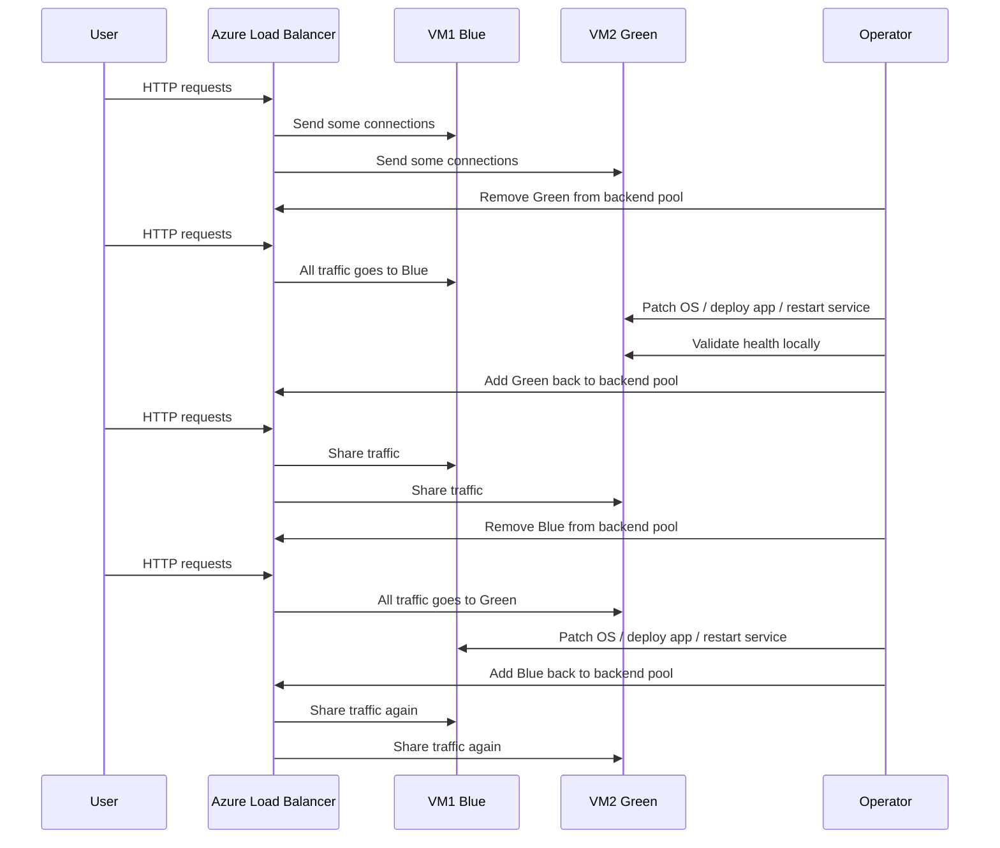

### 3.3 Pre-change validation

```bash
LB_IP=$(az network public-ip show -g $RG -n $PIP --query ipAddress -o tsv)
LB_POOL_ID=$(az network lb address-pool show -g $RG --lb-name $LB -n $POOL --query id -o tsv)

az network nic show -g $RG -n $NIC1 --query "ipConfigurations[0].loadBalancerBackendAddressPools[].id" -o tsv
az network nic show -g $RG -n $NIC2 --query "ipConfigurations[0].loadBalancerBackendAddressPools[].id" -o tsv

for i in {1..8}; do curl -s http://$LB_IP/; done
```

Expected output before the change:

```text
blue-web-01
green-web-02
blue-web-01
green-web-02
```

### 3.4 Step 1: Both VM1 and VM2 behind the load balancer

This is your steady state.

Verification:

```bash
az network lb show -g $RG -n $LB --query "loadBalancingRules[].{name:name,probe:probe.id}" -o table
az network nic show -g $RG -n $NIC1 --query "ipConfigurations[0].loadBalancerBackendAddressPools" -o json
az network nic show -g $RG -n $NIC2 --query "ipConfigurations[0].loadBalancerBackendAddressPools" -o json
```

### 3.5 Step 2: Remove VM2 from the backend pool so all traffic goes to VM1

```bash
az network nic ip-config address-pool remove   -g $RG   --nic-name $NIC2   --ip-config-name ipconfig1   --address-pool $LB_POOL_ID

for i in {1..8}; do curl -s http://$LB_IP/; done
```

Expected sample output after removal:

```text
blue-web-01
blue-web-01
blue-web-01
blue-web-01
```

Backend verification:

```bash
az network nic show -g $RG -n $NIC2 --query "ipConfigurations[0].loadBalancerBackendAddressPools" -o json
```

### 3.6 Step 3: Update or patch VM2 while it is out of rotation

OS patch example:

```bash
az vm run-command invoke   -g $RG   -n $VM2   --command-id RunShellScript   --scripts "sudo apt-get update && sudo DEBIAN_FRONTEND=noninteractive apt-get -y upgrade && sudo systemctl restart nginx"
```

Deploy app version example:

```bash
az vm run-command invoke   -g $RG   -n $VM2   --command-id RunShellScript   --scripts "echo green-web-02-v2 > /var/www/html/index.html && echo ok > /var/www/html/healthz && systemctl restart nginx"
```

### 3.7 Step 4: Verify VM2 is healthy before rejoining it

Because VM2 is not in the backend pool right now, validate it directly.

```bash
VM2_IP=$(az vm list-ip-addresses -g $RG -n $VM2 --query "[0].virtualMachine.network.privateIpAddresses[0]" -o tsv)
ssh $ADMIN@$LB_IP -p 50002 "hostname && curl -s http://localhost/ && curl -s http://localhost/healthz && systemctl is-active nginx"
```

Expected sample output:

```text
green-web-02
green-web-02-v2
ok
active
```

### 3.8 Step 5: Add VM2 back into the backend pool

```bash
az network nic ip-config address-pool add   -g $RG   --nic-name $NIC2   --ip-config-name ipconfig1   --address-pool $LB_POOL_ID

sleep 15
for i in {1..10}; do curl -s http://$LB_IP/; done
```

Expected output after rejoin:

```text
blue-web-01
green-web-02-v2
blue-web-01
green-web-02-v2
```

### 3.9 Step 6: Remove VM1 from the backend pool so all traffic goes to VM2

```bash
az network nic ip-config address-pool remove   -g $RG   --nic-name $NIC1   --ip-config-name ipconfig1   --address-pool $LB_POOL_ID

for i in {1..8}; do curl -s http://$LB_IP/; done
```

Expected output:

```text
green-web-02-v2
green-web-02-v2
green-web-02-v2
```

### 3.10 Step 7: Update or patch VM1

```bash
az vm run-command invoke   -g $RG   -n $VM1   --command-id RunShellScript   --scripts "sudo apt-get update && sudo DEBIAN_FRONTEND=noninteractive apt-get -y upgrade && echo blue-web-01-v2 > /var/www/html/index.html && echo ok > /var/www/html/healthz && systemctl restart nginx"
```

Verify directly:

```bash
ssh $ADMIN@$LB_IP -p 50001 "hostname && curl -s http://localhost/ && curl -s http://localhost/healthz"
```

### 3.11 Step 8: Add VM1 back so both VMs serve traffic again

```bash
az network nic ip-config address-pool add   -g $RG   --nic-name $NIC1   --ip-config-name ipconfig1   --address-pool $LB_POOL_ID

sleep 15
for i in {1..12}; do curl -s http://$LB_IP/; done
```

Expected sample output:

```text
blue-web-01-v2
green-web-02-v2
green-web-02-v2
blue-web-01-v2
```

### 3.12 Rollback commands if the patch fails

If VM2 fails validation while out of rotation:

```bash
az vm run-command invoke   -g $RG   -n $VM2   --command-id RunShellScript   --scripts "echo green-web-02 > /var/www/html/index.html && echo ok > /var/www/html/healthz && systemctl restart nginx"

az network nic ip-config address-pool add   -g $RG   --nic-name $NIC2   --ip-config-name ipconfig1   --address-pool $LB_POOL_ID
```

If VM1 fails after its update:

```bash
az vm run-command invoke   -g $RG   -n $VM1   --command-id RunShellScript   --scripts "echo blue-web-01 > /var/www/html/index.html && echo ok > /var/www/html/healthz && systemctl restart nginx"
```

### 3.13 Operational notes for blue-green with Azure Load Balancer

- Removing a NIC from the backend pool is the cleanest manual drain for a 2-node fleet.
- Health probes protect you from returning obviously bad instances, but they do not validate application correctness beyond the probe path.
- Keep `/healthz` cheap and deterministic.
- Avoid returning `200 OK` if dependencies are down and you want the node drained.
- Keep SSH NAT ports documented in your change runbook.
- For fleets larger than 2 VMs, consider VM Scale Sets, automatic instance upgrades, or orchestration through deployment tooling.

## 4. 🎚️ Rolling Update with Application Gateway

Application Gateway is the right tool when the update needs **HTTP awareness**.

Examples:

- Drain existing connections before a backend is removed.
- Shift users based on **hostnames**, **paths**, or **application behavior**.
- Terminate TLS at the gateway.
- Protect the site with WAF.

> Important accuracy note: Application Gateway does **not** provide a simple native “percentage slider” in the same way Traffic Manager weighted DNS or Front Door origin weighting does. In practice, teams approximate 80/20 and 50/50 by changing backend pool instance counts, using separate pools, or using a canary path/header strategy. This guide shows a practical regional L7 pattern.

### 4.1 Rolling update architecture

```mermaid
flowchart TB
  classDef azure fill:#0078D4,color:#fff,stroke:#005A9E,stroke-width:2px;
  classDef light fill:#50E6FF,color:#002050,stroke:#0078D4,stroke-width:2px;
  Client((Browser/API Client)) --> Listener[HTTPS Listener :443]
  Listener --> AppGw[Application Gateway v2
WAF + Connection Draining]
  AppGw --> PoolBlue[Backend Pool Blue]
  AppGw --> PoolGreen[Backend Pool Green]
  PoolBlue --> B1[blue-vmss instance 1]
  PoolBlue --> B2[blue-vmss instance 2]
  PoolBlue --> B3[blue-vmss instance 3]
  PoolBlue --> B4[blue-vmss instance 4]
  PoolGreen --> G1[green-vmss instance 1]
  AppGw --> BetaRule[/beta/* -> Green]
  class Client,Listener,AppGw,PoolBlue,PoolGreen,BetaRule azure;
  class B1,B2,B3,B4,G1 light;
```

### 4.2 Why Application Gateway helps rolling updates

- **Connection draining** lets in-flight requests finish before a target is removed.
- **HTTP probes** can validate a richer endpoint such as `/healthz` or `/ready`.
- **Path-based routing** lets you expose a beta endpoint before full cutover.
- **SSL offload** keeps certificates at the gateway instead of on each VM.
- **WAF policy** remains active during the rollout.

### 4.3 Create a dedicated subnet and Application Gateway

```bash
APPGW_RG=rg-appgw-rollout
APPGW_LOC=eastus
APPGW_VNET=vnet-appgw-rollout
APPGW_SUBNET_APPGW=snet-appgw
APPGW_SUBNET_WEB=snet-web
APPGW=agw-prod
APPGW_PIP=pip-agw-prod

az group create -n $APPGW_RG -l $APPGW_LOC

az network vnet create   -g $APPGW_RG   -n $APPGW_VNET   --address-prefixes 10.50.0.0/16   --subnet-name $APPGW_SUBNET_APPGW   --subnet-prefixes 10.50.0.0/24

az network vnet subnet create   -g $APPGW_RG   --vnet-name $APPGW_VNET   -n $APPGW_SUBNET_WEB   --address-prefixes 10.50.1.0/24

az network public-ip create   -g $APPGW_RG   -n $APPGW_PIP   --sku Standard   --allocation-method Static

az network application-gateway create   -g $APPGW_RG   -n $APPGW   --sku WAF_v2   --capacity 2   --vnet-name $APPGW_VNET   --subnet $APPGW_SUBNET_APPGW   --public-ip-address $APPGW_PIP
```

### 4.4 Create blue and green backend pools

In a real environment, blue and green backends often come from separate VM Scale Sets.

Example pool members:

- Blue pool: 4 instances
- Green pool: 1 instance

That approximates **80/20** traffic if all targets receive an equal share of requests.

```bash
az network application-gateway address-pool create   -g $APPGW_RG   --gateway-name $APPGW   -n pool-blue   --servers 10.50.1.4 10.50.1.5 10.50.1.6 10.50.1.7

az network application-gateway address-pool create   -g $APPGW_RG   --gateway-name $APPGW   -n pool-green   --servers 10.50.1.8
```

### 4.5 Create HTTP settings with connection draining

```bash
az network application-gateway http-settings create   -g $APPGW_RG   --gateway-name $APPGW   -n hs-web   --port 80   --protocol Http   --cookie-based-affinity Disabled   --timeout 30   --connection-draining-timeout 120
```

If your CLI version supports the explicit switch, also set:

```bash
az network application-gateway http-settings update   -g $APPGW_RG   --gateway-name $APPGW   -n hs-web   --connection-draining true   --connection-draining-timeout 120
```

### 4.6 Create a health probe

```bash
az network application-gateway probe create   -g $APPGW_RG   --gateway-name $APPGW   -n probe-web   --protocol Http   --host-name-from-http-settings true   --path /healthz   --interval 20   --timeout 20   --threshold 3

az network application-gateway http-settings update   -g $APPGW_RG   --gateway-name $APPGW   -n hs-web   --probe probe-web
```

### 4.7 Create listener and initial rule to Blue

```bash
az network application-gateway frontend-port create   -g $APPGW_RG   --gateway-name $APPGW   -n port-80   --port 80

az network application-gateway http-listener create   -g $APPGW_RG   --gateway-name $APPGW   -n listener-web   --frontend-port port-80   --frontend-ip appGatewayFrontendIP

az network application-gateway rule create   -g $APPGW_RG   --gateway-name $APPGW   -n rule-web   --http-listener listener-web   --rule-type Basic   --address-pool pool-blue   --http-settings hs-web
```

### 4.8 URL-based routing during updates

Expose a beta path to Green while keeping the default route on Blue.

```bash
az network application-gateway url-path-map create   -g $APPGW_RG   --gateway-name $APPGW   -n pathmap-web   --default-address-pool pool-blue   --default-http-settings hs-web

az network application-gateway url-path-map rule create   -g $APPGW_RG   --gateway-name $APPGW   --path-map-name pathmap-web   -n beta-to-green   --paths /beta/*   --address-pool pool-green   --http-settings hs-web
```

### 4.9 Traffic split examples

#### Approximate 80/20

- Blue pool has 4 healthy instances.
- Green pool has 1 healthy instance.
- Users on `/` still hit Blue by default.
- Users on `/beta/` hit Green deterministically.

#### Approximate 50/50

Scale Green up until both pools have similar healthy capacity.

```bash
az network application-gateway address-pool update   -g $APPGW_RG   --gateway-name $APPGW   -n pool-green   --servers 10.50.1.8 10.50.1.9 10.50.1.10 10.50.1.11
```

#### 0/100 cutover to Green

Update the default path map so all default traffic goes to Green.

```bash
az network application-gateway url-path-map update   -g $APPGW_RG   --gateway-name $APPGW   -n pathmap-web   --default-address-pool pool-green   --default-http-settings hs-web
```

### 4.10 Verification commands

```bash
APPGW_IP=$(az network public-ip show -g $APPGW_RG -n $APPGW_PIP --query ipAddress -o tsv)

curl -I http://$APPGW_IP/
curl -I http://$APPGW_IP/beta/
az network application-gateway show-backend-health -g $APPGW_RG -n $APPGW -o json
```

Expected backend health indicators:

```text
Healthy
Healthy
Healthy
```

### 4.11 Rolling update sequence with connection draining

1. Keep Blue active.
2. Send early testers to `/beta/` on Green.
3. Scale Green until capacity matches Blue.
4. Change the default route to Green.
5. Wait for drain timeout to complete on Blue.
6. Patch or redeploy Blue.
7. Re-add Blue as standby or next canary target.

## 5. 🌍 Traffic Manager for Multi-Region Failover

Traffic Manager answers **DNS queries** and returns an endpoint according to a routing method.

This makes it useful for:

- Priority failover between regions.
- Weighted regional shifts.
- Multi-region designs for HTTP and non-HTTP workloads.

Remember: **Traffic Manager does not proxy the connection**. Clients still connect directly to the returned endpoint.

### 5.1 Multi-region architecture

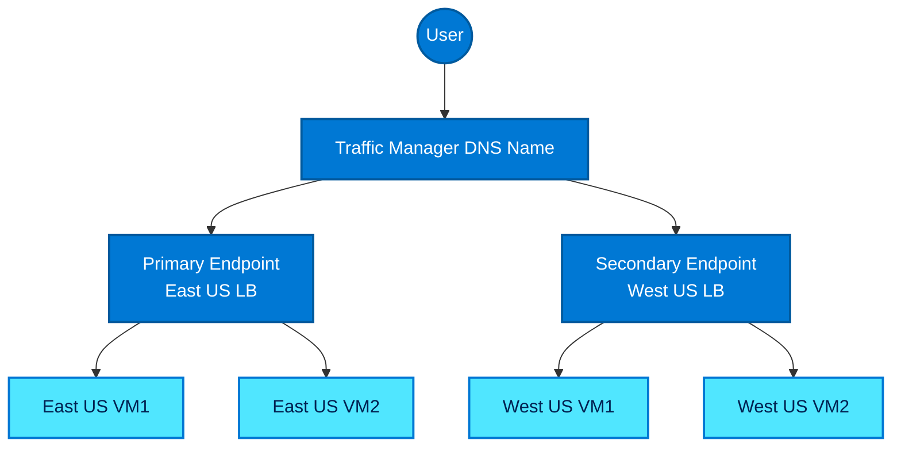

### 5.2 Create regional endpoints first

In practice, each region usually has its own Standard Load Balancer or Application Gateway.

Assume you already have:

- East US public endpoint: `eus-web.contoso.example`
- West US public endpoint: `wus-web.contoso.example`

### 5.3 Create a Traffic Manager profile for priority routing

```bash
TM_RG=rg-traffic-manager
TM=tm-global-web
TM_DNS=contoso-global-web

az group create -n $TM_RG -l global

az network traffic-manager profile create   -g $TM_RG   -n $TM   --routing-method Priority   --unique-dns-name $TM_DNS   --ttl 30   --protocol HTTP   --port 80   --path /healthz
```

### 5.4 Add primary and secondary endpoints

```bash
az network traffic-manager endpoint create   -g $TM_RG   --profile-name $TM   -n eastus-primary   --type externalEndpoints   --target eus-web.contoso.example   --priority 1

az network traffic-manager endpoint create   -g $TM_RG   --profile-name $TM   -n westus-secondary   --type externalEndpoints   --target wus-web.contoso.example   --priority 2
```

### 5.5 Verification for priority routing

```bash
az network traffic-manager profile show -g $TM_RG -n $TM -o table
nslookup $TM_DNS.trafficmanager.net
curl -I http://$TM_DNS.trafficmanager.net/
```

Expected behavior:

- Healthy East US endpoint is returned first.
- West US stays idle unless East US fails.

### 5.6 Failover scenario walkthrough

1. Clients resolve `contoso-global-web.trafficmanager.net`.
2. Traffic Manager returns East US because it has priority `1`.
3. East US endpoint fails health checks.
4. Traffic Manager stops returning East US.
5. New DNS lookups return West US.
6. Existing clients switch as their DNS cache expires.

### 5.7 Simulate a failover

Option A: disable the endpoint manually.

```bash
az network traffic-manager endpoint update   -g $TM_RG   --profile-name $TM   -n eastus-primary   --type externalEndpoints   --endpoint-status Disabled
```

Option B: break the health probe path on the primary site and wait for detection.

Verification:

```bash
nslookup $TM_DNS.trafficmanager.net
curl -I http://$TM_DNS.trafficmanager.net/
az network traffic-manager endpoint show -g $TM_RG --profile-name $TM -n eastus-primary --type externalEndpoints -o json
```

### 5.8 Weighted routing for gradual traffic shift

Change the profile from priority to weighted when you want a gradual distribution.

```bash
az network traffic-manager profile update   -g $TM_RG   -n $TM   --routing-method Weighted

az network traffic-manager endpoint update   -g $TM_RG   --profile-name $TM   -n eastus-primary   --type externalEndpoints   --weight 90   --endpoint-status Enabled

az network traffic-manager endpoint update   -g $TM_RG   --profile-name $TM   -n westus-secondary   --type externalEndpoints   --weight 10   --endpoint-status Enabled
```

This gives you a **90/10** regional canary.

### 5.9 Weighted routing caveats

- Distribution occurs at DNS resolution time, not per request.
- Cached DNS responses mean the shift is not instantaneous.
- Use low TTL values for faster changes, but do not assume exact real-time behavior.
- Weighted routing is a good fit for gradual adoption, but Front Door is usually better for precise web traffic steering.

### 5.10 Traffic Manager failover diagram

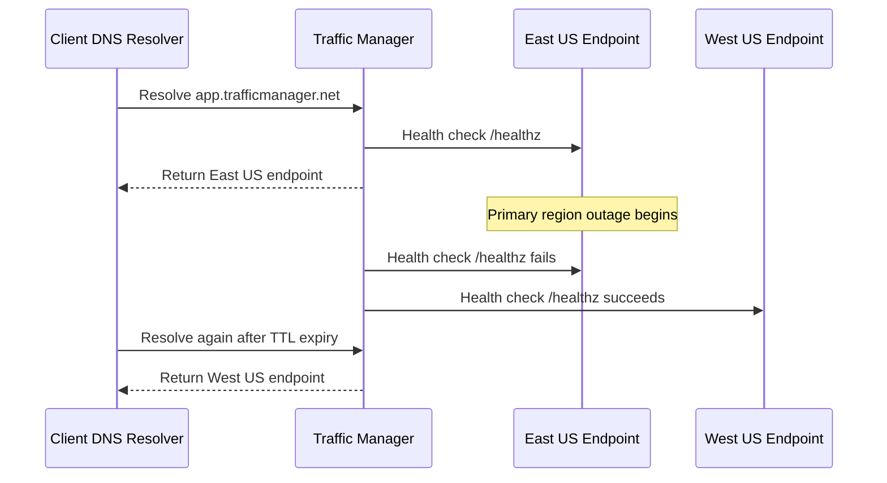

## 6. Real-World Scenarios

This section turns the earlier concepts into practical runbooks.

Each scenario includes:

- Problem
- Architecture
- Commands
- Verification
- Mermaid diagram

### Scenario 1: Zero-downtime patching of a 2-VM web app

**Problem**

Security patches must be applied tonight, but the public website cannot go offline.

**Architecture**

Standard Load Balancer with VM1 and VM2 in one backend pool; remove one node, patch it, rejoin it, then repeat.

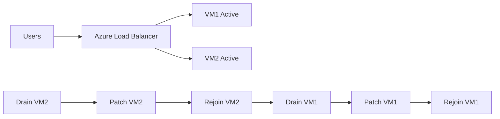

**Commands**

```bash
LB_POOL_ID=$(az network lb address-pool show -g $RG --lb-name $LB -n $POOL --query id -o tsv)
LB_IP=$(az network public-ip show -g $RG -n $PIP --query ipAddress -o tsv)

az network nic ip-config address-pool remove -g $RG --nic-name $NIC2 --ip-config-name ipconfig1 --address-pool $LB_POOL_ID
for i in {1..5}; do curl -s http://$LB_IP/; done
az vm run-command invoke -g $RG -n $VM2 --command-id RunShellScript --scripts "sudo apt-get update && sudo apt-get -y upgrade && echo green-web-02-patched > /var/www/html/index.html && systemctl restart nginx"
ssh $ADMIN@$LB_IP -p 50002 "curl -s http://localhost/healthz"
az network nic ip-config address-pool add -g $RG --nic-name $NIC2 --ip-config-name ipconfig1 --address-pool $LB_POOL_ID
sleep 15
az network nic ip-config address-pool remove -g $RG --nic-name $NIC1 --ip-config-name ipconfig1 --address-pool $LB_POOL_ID
az vm run-command invoke -g $RG -n $VM1 --command-id RunShellScript --scripts "sudo apt-get update && sudo apt-get -y upgrade && echo blue-web-01-patched > /var/www/html/index.html && systemctl restart nginx"
az network nic ip-config address-pool add -g $RG --nic-name $NIC1 --ip-config-name ipconfig1 --address-pool $LB_POOL_ID
```

**Verification**

```bash
for i in {1..10}; do curl -s http://$LB_IP/; done
az network nic show -g $RG -n $NIC1 --query "ipConfigurations[0].loadBalancerBackendAddressPools[].id" -o tsv
az network nic show -g $RG -n $NIC2 --query "ipConfigurations[0].loadBalancerBackendAddressPools[].id" -o tsv
```

Expected sample output:

```text
blue-web-01-patched
green-web-02-patched
blue-web-01-patched
```

**Operator checklist**

- Confirm the maintenance window or deployment guardrails.
- Capture the current backend membership before the change.
- Validate probe health before and after the change.
- Record rollback commands in the same shell session.
- Verify user-facing responses with repeated `curl` checks.
- Update the ticket or change record with the observed result.

### Scenario 2: Canary deployment — send 10% traffic to new version

**Problem**

A new version must receive a small fraction of user traffic before full release.

**Architecture**

Traffic Manager weighted routing with 90 weight on the stable regional endpoint and 10 weight on the canary regional endpoint.

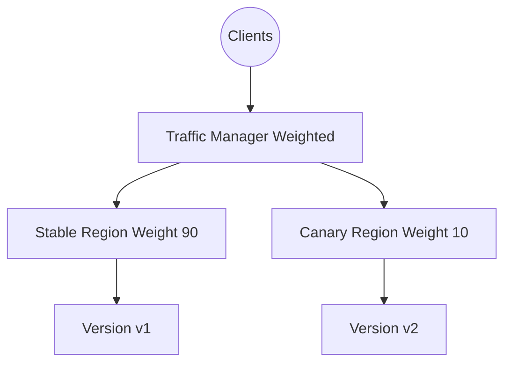

**Commands**

```bash
az network traffic-manager profile update -g $TM_RG -n $TM --routing-method Weighted
az network traffic-manager endpoint update -g $TM_RG --profile-name $TM -n eastus-primary --type externalEndpoints --weight 90
az network traffic-manager endpoint update -g $TM_RG --profile-name $TM -n westus-secondary --type externalEndpoints --weight 10

for i in {1..10}; do nslookup $TM_DNS.trafficmanager.net | tail -n 5; done
```

**Verification**

```bash
curl -I http://$TM_DNS.trafficmanager.net/
az network traffic-manager endpoint list -g $TM_RG --profile-name $TM -o table
```

Notes:

- Because this is DNS-based, the 10% shift is statistical over many client resolutions.
- Use low TTLs and multiple samples to observe the change.

**Operator checklist**

- Confirm the maintenance window or deployment guardrails.
- Capture the current backend membership before the change.
- Validate probe health before and after the change.
- Record rollback commands in the same shell session.
- Verify user-facing responses with repeated `curl` checks.
- Update the ticket or change record with the observed result.

### Scenario 3: Emergency failover — one VM crashes, auto-recovery

**Problem**

One backend becomes unhealthy during business hours; traffic must continue automatically.

**Architecture**

Standard Load Balancer probe removes the failed VM from rotation while the surviving VM handles traffic.

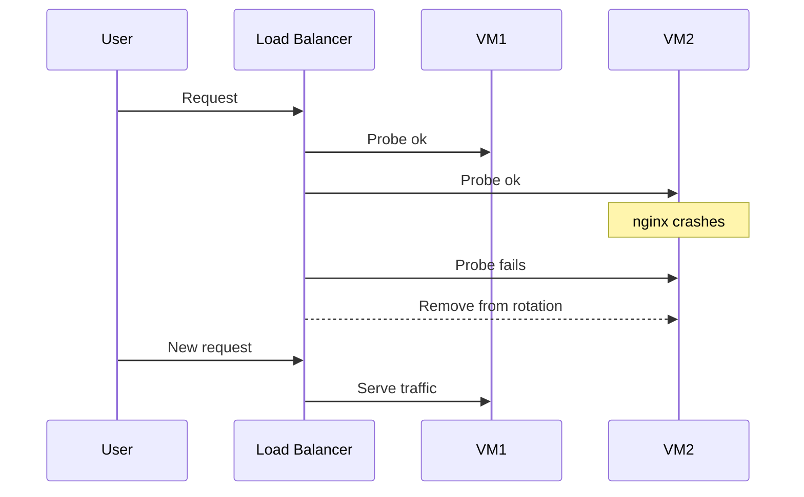

**Commands**

```bash
az vm run-command invoke -g $RG -n $VM2 --command-id RunShellScript --scripts "systemctl stop nginx"
for i in {1..10}; do curl -s http://$LB_IP/; sleep 2; done
az vm run-command invoke -g $RG -n $VM2 --command-id RunShellScript --scripts "systemctl start nginx && echo ok > /var/www/html/healthz"
```

**Verification**

```bash
ssh $ADMIN@$LB_IP -p 50002 "systemctl status nginx --no-pager"
for i in {1..6}; do curl -s http://$LB_IP/; done
```

Expected behavior:

- While nginx is stopped on VM2, only VM1 answers.
- After recovery and probe success, VM2 returns to the rotation.

**Operator checklist**

- Confirm the maintenance window or deployment guardrails.
- Capture the current backend membership before the change.
- Validate probe health before and after the change.
- Record rollback commands in the same shell session.
- Verify user-facing responses with repeated `curl` checks.
- Update the ticket or change record with the observed result.

### Scenario 4: Scaling out — adding VM3 during peak load

**Problem**

Peak traffic requires more backend capacity without changing the frontend VIP.

**Architecture**

Add a third VM and NIC to the existing backend pool and let the same LB rule distribute traffic across three nodes.

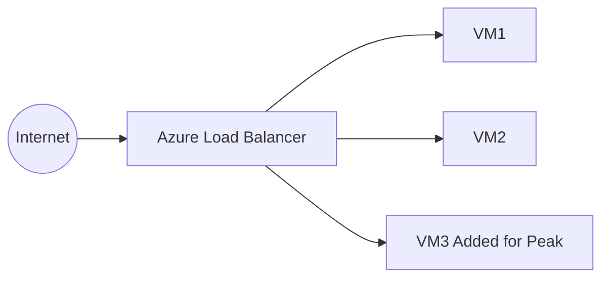

**Commands**

```bash
VM3=burst-web-03
NIC3=nic-burst-web-03

az network nic create -g $RG -n $NIC3 --vnet-name $VNET --subnet $SUBNET --network-security-group $NSG
az vm create -g $RG -n $VM3 --nics $NIC3 --image Ubuntu2204 --size Standard_B2s --admin-username $ADMIN --ssh-key-values $SSH_KEY --availability-set $AVSET --custom-data cloud-init-web.yaml
az vm run-command invoke -g $RG -n $VM3 --command-id RunShellScript --scripts "echo burst-web-03 > /var/www/html/index.html && echo ok > /var/www/html/healthz && systemctl restart nginx"
az network nic ip-config address-pool add -g $RG --nic-name $NIC3 --ip-config-name ipconfig1 --address-pool $LB_POOL_ID
sleep 15
for i in {1..12}; do curl -s http://$LB_IP/; done
```

**Verification**

```bash
az network nic show -g $RG -n $NIC3 --query "ipConfigurations[0].loadBalancerBackendAddressPools[].id" -o tsv
for i in {1..15}; do curl -s http://$LB_IP/; done
```

Expected sample output:

```text
blue-web-01
burst-web-03
green-web-02
burst-web-03
```

**Operator checklist**

- Confirm the maintenance window or deployment guardrails.
- Capture the current backend membership before the change.
- Validate probe health before and after the change.
- Record rollback commands in the same shell session.
- Verify user-facing responses with repeated `curl` checks.
- Update the ticket or change record with the observed result.

### Scenario 5: SSL offloading with Application Gateway

**Problem**

The web app must serve HTTPS without managing certificates on every VM.

**Architecture**

Application Gateway terminates TLS on port 443, forwards HTTP to the backend pool, and optionally redirects HTTP to HTTPS.

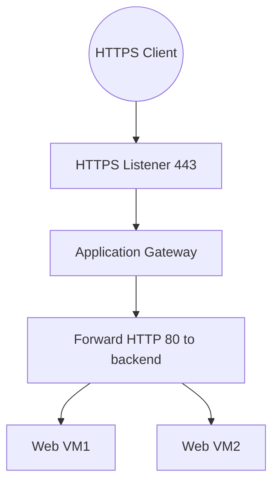

**Commands**

```bash
CERT_PFX=./contoso-web.pfx
CERT_PASS='ReplaceWithStrongPassword'

az network application-gateway ssl-cert create   -g $APPGW_RG   --gateway-name $APPGW   -n cert-contoso   --cert-file $CERT_PFX   --cert-password $CERT_PASS

az network application-gateway frontend-port create   -g $APPGW_RG   --gateway-name $APPGW   -n port-443   --port 443

az network application-gateway http-listener create   -g $APPGW_RG   --gateway-name $APPGW   -n listener-https   --frontend-port port-443   --frontend-ip appGatewayFrontendIP   --ssl-cert cert-contoso

az network application-gateway rule create   -g $APPGW_RG   --gateway-name $APPGW   -n rule-https   --http-listener listener-https   --rule-type Basic   --address-pool pool-blue   --http-settings hs-web
```

**Verification**

```bash
openssl s_client -connect $APPGW_IP:443 -servername contoso.example </dev/null
curl -kI https://$APPGW_IP/
```

Expected indicators:

- The certificate chain is returned by Application Gateway.
- Backend VMs only need HTTP unless end-to-end TLS is required.

**Operator checklist**

- Confirm the maintenance window or deployment guardrails.
- Capture the current backend membership before the change.
- Validate probe health before and after the change.
- Record rollback commands in the same shell session.
- Verify user-facing responses with repeated `curl` checks.
- Update the ticket or change record with the observed result.

### Scenario 6: Internal load balancing for database tier

**Problem**

Application servers need a stable private endpoint for a database listener without exposing the service publicly.

**Architecture**

Internal Load Balancer with private frontend IP in the data subnet. Typical use: SQL listener, active/passive service VIP, or stateful service endpoint.

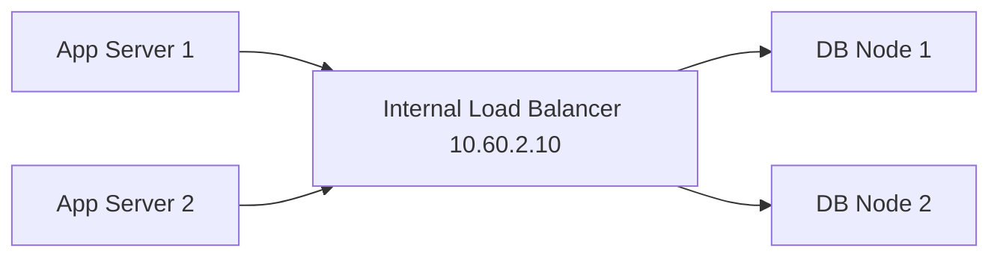

**Commands**

```bash
ILB=ilb-db
DB_POOL=be-db
DB_PROBE=hp-db
DB_RULE=rule-db
DB_VNET=vnet-data
DB_SUBNET=snet-data

az network lb create   -g $RG   -n $ILB   --sku Standard   --vnet-name $DB_VNET   --subnet $DB_SUBNET   --private-ip-address 10.60.2.10   --frontend-ip-name fe-db   --backend-pool-name $DB_POOL

az network lb probe create   -g $RG   --lb-name $ILB   -n $DB_PROBE   --protocol Tcp   --port 1433   --interval 5   --threshold 2

az network lb rule create   -g $RG   --lb-name $ILB   -n $DB_RULE   --protocol Tcp   --frontend-port 1433   --backend-port 1433   --frontend-ip-name fe-db   --backend-pool-name $DB_POOL   --probe-name $DB_PROBE
```

**Verification**

```bash
az network lb show -g $RG -n $ILB -o table
nc -vz 10.60.2.10 1433
```

Important note:

- Do **not** blindly round-robin writes across independent databases.
- Use an ILB only with a database clustering or listener design that supports it.

**Operator checklist**

- Confirm the maintenance window or deployment guardrails.
- Capture the current backend membership before the change.
- Validate probe health before and after the change.
- Record rollback commands in the same shell session.
- Verify user-facing responses with repeated `curl` checks.
- Update the ticket or change record with the observed result.

## 7. Monitoring & Troubleshooting

Traffic switching is only safe when you can see what the platform is doing.

### 7.1 Monitoring architecture

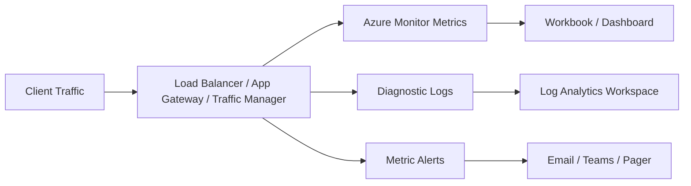

| Service | Key metrics/logs | Why it matters |
|---|---|---|
| Azure Load Balancer | Data path availability, health probe status, SYN count, byte count | Shows whether the frontend is reachable and whether backends are healthy |
| Application Gateway | Unhealthy host count, response status, total requests, failed requests | Shows request-level gateway behavior |
| Traffic Manager | Endpoint health, DNS query behavior, endpoint status | Shows regional routing decisions |
| VMs | CPU, memory, disk latency, service logs | Separates platform routing issues from host failures |

### 7.2 Enable diagnostic settings

```bash
LAW_RG=rg-observability
LAW_NAME=law-networking

az group create -n $LAW_RG -l eastus
az monitor log-analytics workspace create -g $LAW_RG -n $LAW_NAME

LB_ID=$(az network lb show -g $RG -n $LB --query id -o tsv)
LAW_ID=$(az monitor log-analytics workspace show -g $LAW_RG -n $LAW_NAME --query id -o tsv)

az monitor diagnostic-settings create   --name diag-lb   --resource $LB_ID   --workspace $LAW_ID   --logs '[{"category":"LoadBalancerAlertEvent","enabled":true},{"category":"LoadBalancerProbeHealthStatus","enabled":true}]'   --metrics '[{"category":"AllMetrics","enabled":true}]'
```

### 7.3 Create metric alerts

```bash
ACTION_RG=rg-observability
ACTION_GROUP=ag-network-ops

az monitor action-group create   -g $ACTION_RG   -n $ACTION_GROUP   --short-name netops

az monitor metrics alert create   -g $ACTION_RG   -n alert-lb-datapath   --scopes $LB_ID   --description "Alert when load balancer data path availability drops"   --condition "avg VipAvailability < 99"   --action $ACTION_GROUP
```

### 7.4 Health probe debugging checklist

1. Confirm the probe protocol matches the backend behavior.
2. Confirm the probe port is open in the NSG.
3. Confirm the source `AzureLoadBalancer` is allowed.
4. Confirm the app returns the expected status code.
5. Confirm the response is fast enough for the timeout.
6. Confirm the probe path does not depend on a flaky downstream dependency unless that is intentional.
7. Confirm the backend NIC is still in the pool.
8. Confirm the app is listening on the expected interface and port.

### 7.5 Common health probe commands

```bash
# Validate from the VM itself
curl -i http://localhost/healthz
ss -lntp | grep ':80'
systemctl status nginx --no-pager

# Validate pool and probe definitions
az network lb probe show -g $RG --lb-name $LB -n $PROBE_HTTP -o yaml
az network lb rule show -g $RG --lb-name $LB -n $RULE -o yaml
az network nic show -g $RG -n $NIC1 -o yaml

# Application Gateway backend health
az network application-gateway show-backend-health -g $APPGW_RG -n $APPGW -o json

# Traffic Manager endpoint state
az network traffic-manager endpoint list -g $TM_RG --profile-name $TM -o table
```

### 7.6 Common issues and fixes

| Issue | Typical cause | Fix |
|---|---|---|
| Probe fails but app works locally | NSG blocks `AzureLoadBalancer`, wrong probe path, service bound to localhost only | Allow source `AzureLoadBalancer`, fix path, bind service to `0.0.0.0` |
| Asymmetric routing | Return path leaves through a different device or forced tunneling path | Review UDRs, NVAs, and SNAT behavior so replies return correctly |
| SNAT exhaustion | Too many outbound connections without enough ports | Use NAT Gateway, scale out, or tune outbound patterns |
| Single node receives all traffic | Other node is unhealthy or removed from backend pool | Check probe results and NIC pool membership |
| Traffic Manager failover seems slow | DNS TTL and client resolver caching | Lower TTL where appropriate and expect caching delay |
| Application Gateway 502 | Backend health failure or HTTP settings mismatch | Review backend health, probe host headers, TLS settings, and timeout values |

### 7.7 Asymmetric routing explained

Asymmetric routing happens when the request enters through one path but the response exits through another.

In Azure, this often appears when:

- A UDR sends responses through an NVA unexpectedly.
- A public load balancer fronts a workload whose outbound path uses another device.
- Multiple firewalls or NAT devices exist in the same flow path.

Symptoms:

- Intermittent connection resets.
- One-way flows in packet capture.
- Health probes look healthy but user flows fail.

Mitigations:

- Keep inbound and outbound flow design symmetric.
- Use NAT Gateway for predictable outbound if needed.
- Validate effective routes on the NIC.
- Test with Network Watcher and packet capture during the failure window.

### 7.8 SNAT exhaustion explained

Standard Load Balancer can be part of an architecture that depends on SNAT for outbound flows.

High-connection workloads may exhaust available SNAT ports.

Mitigations:

- Attach a **NAT Gateway** for scalable outbound SNAT.
- Reduce needless outbound connection churn.
- Use connection pooling.
- Scale out the backend instances.
- Review outbound rules if the architecture depends on the load balancer for egress.

### 7.9 NSG rules you almost always need for LB-backed workloads

```bash
az network nsg rule create   -g $RG   --nsg-name $NSG   -n allow-azure-load-balancer   --priority 110   --direction Inbound   --access Allow   --protocol Tcp   --source-address-prefixes AzureLoadBalancer   --destination-port-ranges 80 443 22 1433
```

Guidance:

- Allow the frontend application port.
- Allow the probe source `AzureLoadBalancer`.
- Keep management ports restricted to approved sources or NAT rules.
- Do not assume the load balancer bypasses the NSG.

### 7.10 Real verification outputs to recognize

Healthy LB distribution:

```text
blue-web-01-v2
green-web-02-v2
blue-web-01-v2
```

Application Gateway healthy pool:

```text
backendAddressPools:
- backendHttpSettingsCollection:
  - health: Healthy
```

Traffic Manager failover observed:

```text
Non-authoritative answer:
Name:    contoso-global-web.trafficmanager.net
Address: 52.160.10.20
```

## 8. Quick Reference

### 8.1 Common Azure CLI commands

| Task | Command |
|---|---|
| Create resource group | az group create -n $RG -l $LOC |
| Create VNet and subnet | az network vnet create -g $RG -n $VNET --address-prefixes 10.40.0.0/16 --subnet-name $SUBNET --subnet-prefixes 10.40.1.0/24 |
| Create Standard public IP | az network public-ip create -g $RG -n $PIP --sku Standard --allocation-method Static |
| Create load balancer | az network lb create -g $RG -n $LB --sku Standard --public-ip-address $PIP --frontend-ip-name $FE --backend-pool-name $POOL |
| Create LB HTTP probe | az network lb probe create -g $RG --lb-name $LB -n $PROBE_HTTP --protocol Http --port 80 --path /healthz |
| Create LB rule | az network lb rule create -g $RG --lb-name $LB -n $RULE --protocol Tcp --frontend-port 80 --backend-port 80 --frontend-ip-name $FE --backend-pool-name $POOL --probe-name $PROBE_HTTP |
| Add NIC to backend pool | az network nic ip-config address-pool add -g $RG --nic-name $NIC1 --ip-config-name ipconfig1 --address-pool $LB_POOL_ID |
| Remove NIC from backend pool | az network nic ip-config address-pool remove -g $RG --nic-name $NIC2 --ip-config-name ipconfig1 --address-pool $LB_POOL_ID |
| Create inbound NAT rule | az network lb inbound-nat-rule create -g $RG --lb-name $LB -n nat-ssh-vm1 --protocol Tcp --frontend-port 50001 --backend-port 22 --frontend-ip-name $FE |
| Show backend health on App Gateway | az network application-gateway show-backend-health -g $APPGW_RG -n $APPGW -o json |
| Create Traffic Manager profile | az network traffic-manager profile create -g $TM_RG -n $TM --routing-method Priority --unique-dns-name $TM_DNS --ttl 30 --protocol HTTP --port 80 --path /healthz |
| Enable weighted routing | az network traffic-manager profile update -g $TM_RG -n $TM --routing-method Weighted |

### 8.2 Health probe configuration table

| Workload | Service | Probe type | Port | Path | Notes |
|---|---|---|---|---|---|
| Basic web app | Load Balancer | HTTP | 80 | /healthz | Use for simple VM web tiers |
| HTTPS web app behind App Gateway | Application Gateway | HTTP or HTTPS | 80 or 443 | /healthz | Use host headers if needed |
| Database listener | Internal Load Balancer | TCP | 1433 | N/A | Only use with cluster-aware listener design |
| Custom TCP service | Load Balancer | TCP | 5000 | N/A | Checks port open state only |
| Global regional check | Traffic Manager | HTTP/HTTPS/TCP | 80/443/custom | /healthz if HTTP | Controls endpoint DNS selection |

### 8.3 Port and protocol cheat sheet

| Port | Protocol | Typical use |
|---|---|---|
| 80 | HTTP | App content and simple health probes |
| 443 | HTTPS | TLS-terminated web traffic |
| 22 | SSH | Management access through NAT rules |
| 1433 | MSSQL | Database listener behind internal LB |
| 3389 | RDP | Windows management through NAT rules |
| 8080 | HTTP alt | App port behind App Gateway or LB |
| 8443 | HTTPS alt | Private admin or service endpoint |

### 8.4 Fast health validation loop

```bash
for i in {1..20}; do
  date
  curl -s http://$LB_IP/
  curl -s http://$LB_IP/healthz
  sleep 1
done
```

## 9. Appendices

The appendices below give you extra operational depth so the guide can be used as a real change runbook.

### 9.1 Reusable variable blocks

#### Single-region Standard Load Balancer lab

```bash
RG=rg-lb-lab
LOC=eastus
VNET=vnet-lb-lab
SUBNET=snet-web
NSG=nsg-web
AVSET=avset-web
PIP=pip-lb-lab
LB=lb-web-prod
FE=fe-public
POOL=be-web
PROBE_HTTP=hp-http
RULE=rule-http
VM1=blue-web-01
VM2=green-web-02
NIC1=nic-blue-web-01
NIC2=nic-green-web-02
ADMIN=azureuser
```

#### Application Gateway rollout lab

```bash
APPGW_RG=rg-appgw-rollout
APPGW_LOC=eastus
APPGW_VNET=vnet-appgw-rollout
APPGW_SUBNET_APPGW=snet-appgw
APPGW_SUBNET_WEB=snet-web
APPGW=agw-prod
APPGW_PIP=pip-agw-prod
```

#### Traffic Manager lab

```bash
TM_RG=rg-traffic-manager
TM=tm-global-web
TM_DNS=contoso-global-web
```

### 9.2 Pre-change checks

- Capture the current backend pool membership.
- Capture the current load balancer or application gateway configuration.
- Run at least 10 repeated curl checks and save the observed hostnames.
- Confirm the probe endpoint returns the expected payload.
- Confirm the NSG allows the AzureLoadBalancer service tag.
- Confirm SSH or RDP access through NAT before draining a node.
- Document the rollback command set in the change ticket.
- Verify CPU, memory, and disk are within normal range before the change.
- Record the public IP, DNS name, and private IPs involved.
- If using Traffic Manager, note the configured TTL and expected caching delay.

### 9.3 Node drain phase

- Capture the current backend pool membership.
- Capture the current load balancer or application gateway configuration.
- Run at least 10 repeated curl checks and save the observed hostnames.
- Confirm the probe endpoint returns the expected payload.
- Confirm the NSG allows the AzureLoadBalancer service tag.
- Confirm SSH or RDP access through NAT before draining a node.
- Document the rollback command set in the change ticket.
- Verify CPU, memory, and disk are within normal range before the change.
- Record the public IP, DNS name, and private IPs involved.
- If using Traffic Manager, note the configured TTL and expected caching delay.

### 9.4 Patch or deploy phase

- Capture the current backend pool membership.
- Capture the current load balancer or application gateway configuration.
- Run at least 10 repeated curl checks and save the observed hostnames.
- Confirm the probe endpoint returns the expected payload.
- Confirm the NSG allows the AzureLoadBalancer service tag.
- Confirm SSH or RDP access through NAT before draining a node.
- Document the rollback command set in the change ticket.
- Verify CPU, memory, and disk are within normal range before the change.
- Record the public IP, DNS name, and private IPs involved.
- If using Traffic Manager, note the configured TTL and expected caching delay.

### 9.5 Health validation phase

- Capture the current backend pool membership.
- Capture the current load balancer or application gateway configuration.
- Run at least 10 repeated curl checks and save the observed hostnames.
- Confirm the probe endpoint returns the expected payload.
- Confirm the NSG allows the AzureLoadBalancer service tag.
- Confirm SSH or RDP access through NAT before draining a node.
- Document the rollback command set in the change ticket.
- Verify CPU, memory, and disk are within normal range before the change.
- Record the public IP, DNS name, and private IPs involved.
- If using Traffic Manager, note the configured TTL and expected caching delay.

### 9.6 Traffic restoration phase

- Capture the current backend pool membership.
- Capture the current load balancer or application gateway configuration.
- Run at least 10 repeated curl checks and save the observed hostnames.
- Confirm the probe endpoint returns the expected payload.
- Confirm the NSG allows the AzureLoadBalancer service tag.
- Confirm SSH or RDP access through NAT before draining a node.
- Document the rollback command set in the change ticket.
- Verify CPU, memory, and disk are within normal range before the change.
- Record the public IP, DNS name, and private IPs involved.
- If using Traffic Manager, note the configured TTL and expected caching delay.

### 9.7 Rollback trigger review

- Capture the current backend pool membership.
- Capture the current load balancer or application gateway configuration.
- Run at least 10 repeated curl checks and save the observed hostnames.
- Confirm the probe endpoint returns the expected payload.
- Confirm the NSG allows the AzureLoadBalancer service tag.
- Confirm SSH or RDP access through NAT before draining a node.
- Document the rollback command set in the change ticket.
- Verify CPU, memory, and disk are within normal range before the change.
- Record the public IP, DNS name, and private IPs involved.
- If using Traffic Manager, note the configured TTL and expected caching delay.

### 9.8 Troubleshooting playbooks

#### Playbook 1: Backend never returns to rotation
- Check whether the NIC was re-added to the backend pool.
- Verify the health probe path, port, and protocol.
- Check the application service status on the VM.
- Review the NSG for the AzureLoadBalancer source tag.
- Wait for at least a few probe intervals before re-testing.

#### Playbook 2: Traffic keeps hitting only one VM
- Confirm both VMs are in the same backend pool.
- Run repeated curl loops; a tiny sample can be misleading.
- Check whether session stickiness exists elsewhere in the stack.
- Verify the second VM is not returning a failed health response.
- Review whether one node is overloaded or timing out.

#### Playbook 3: Application Gateway returns 502 after rollout
- Run `show-backend-health` immediately.
- Validate the backend HTTP settings port and protocol.
- Check whether the host header expected by the app is present.
- Check connection draining and timeout values.
- Validate the gateway subnet and route design are unchanged.

#### Playbook 4: Traffic Manager failover did not appear immediate
- Check endpoint health state in the profile.
- Confirm the routing method is still what you expect.
- Validate TTL and downstream resolver caching behavior.
- Test from a separate client network to avoid cached DNS responses.
- If necessary, use Front Door for faster request-level steering.

#### Playbook 5: Database traffic breaks behind an internal load balancer
- Validate the database clustering or listener architecture.
- Confirm the probe port is the listener heartbeat, not a random app port.
- Check whether the backend service expects direct node addressing.
- Confirm app servers can reach the ILB private IP.
- Review any UDR or firewall rule affecting east-west flows.

### 9.9 Sample validation outputs library

#### Load balancer curl loop
```text
blue-web-01
green-web-02
blue-web-01-v2
green-web-02-v2
```

#### Healthy probe file
```text
ok
```

#### Traffic Manager endpoint table
```text
eastus-primary   externalEndpoints   Enabled
westus-secondary externalEndpoints   Enabled
```

#### Application Gateway backend health
```text
pool-blue  Healthy
pool-green Healthy
```

#### SSH validation on VM1
```text
hostname: blue-web-01
nginx: active
```

### 9.10 Frequently asked questions

#### Q: Can I use Azure Load Balancer for HTTPS offload?

A: No. Azure Load Balancer is L4. Use Application Gateway or Front Door for TLS termination.

#### Q: Does Traffic Manager fail over instantly?

A: Not exactly. It reacts to health checks, but clients also honor DNS TTL and resolver caches.

#### Q: Should my load balancer probe hit the homepage?

A: Usually no. Use a dedicated health endpoint such as `/healthz` or `/ready`.

#### Q: Can I round-robin two standalone databases behind an internal LB?

A: No. Only use that pattern with a database listener or clustering design that supports it.

#### Q: How do I drain one node safely?

A: Remove it from the backend pool or change routing so it no longer receives new traffic, then validate no active work remains.

#### Q: What is the safest 2-node patching method?

A: Drain one node, patch it, validate it, rejoin it, then repeat for the second node.

#### Q: When should I choose Front Door over Traffic Manager?

A: Choose Front Door when you want global HTTP/S proxying, WAF, and request-level routing instead of DNS-only steering.

#### Q: Why does one VM sometimes receive more requests in a tiny curl sample?

A: Connection reuse and small sample sizes can make distribution look uneven. Test over many requests.

#### Q: Do I still need NSG rules for load-balanced VMs?

A: Yes. The load balancer does not replace NSGs. Probes and app ports still need to be allowed.

#### Q: How should I handle outbound connectivity from LB backends?

A: For heavy outbound traffic, use NAT Gateway to avoid SNAT exhaustion and make egress predictable.

#### Q: Can Application Gateway do true weighted canary by itself?

A: Not as simply as Traffic Manager or Front Door. Regional teams often approximate weights by backend instance counts or use explicit canary routes.

#### Q: What should `/healthz` return?

A: A tiny, fast, deterministic success payload such as `ok` with HTTP 200.

#### Q: Should the probe check dependencies?

A: Only if you want the node removed when dependencies fail. Otherwise keep the probe focused on the node's ability to serve.

#### Q: How do I test backend membership quickly?

A: Query the NIC ip-config or show the backend pool and associated resources with `az network` commands.

#### Q: What is a common cause of intermittent resets during maintenance?

A: Asymmetric routing or an upstream firewall path mismatch.

### 9.11 Command cookbook

#### Command 1: Show LB frontend IP
```bash
az network lb frontend-ip show -g $RG --lb-name $LB -n $FE -o yaml
```

#### Command 2: Show LB backend pool
```bash
az network lb address-pool show -g $RG --lb-name $LB -n $POOL -o yaml
```

#### Command 3: Show LB rules
```bash
az network lb rule list -g $RG --lb-name $LB -o table
```

#### Command 4: Show NAT rules
```bash
az network lb inbound-nat-rule list -g $RG --lb-name $LB -o table
```

#### Command 5: Show probe config
```bash
az network lb probe list -g $RG --lb-name $LB -o table
```

#### Command 6: Show NIC backend pools
```bash
az network nic show -g $RG -n $NIC1 --query "ipConfigurations[0].loadBalancerBackendAddressPools" -o json
```

#### Command 7: Run remote shell command
```bash
az vm run-command invoke -g $RG -n $VM1 --command-id RunShellScript --scripts "hostname"
```

#### Command 8: Check public IP
```bash
az network public-ip show -g $RG -n $PIP --query ipAddress -o tsv
```

#### Command 9: Check VM private IP
```bash
az vm list-ip-addresses -g $RG -n $VM1 -o yaml
```

#### Command 10: Show App Gateway backend health
```bash
az network application-gateway show-backend-health -g $APPGW_RG -n $APPGW -o json
```

#### Command 11: Show App Gateway pools
```bash
az network application-gateway address-pool list -g $APPGW_RG --gateway-name $APPGW -o table
```

#### Command 12: Show App Gateway listeners
```bash
az network application-gateway http-listener list -g $APPGW_RG --gateway-name $APPGW -o table
```

#### Command 13: Show Traffic Manager endpoints
```bash
az network traffic-manager endpoint list -g $TM_RG --profile-name $TM -o table
```

#### Command 14: Disable Traffic Manager endpoint
```bash
az network traffic-manager endpoint update -g $TM_RG --profile-name $TM -n eastus-primary --type externalEndpoints --endpoint-status Disabled
```

#### Command 15: Enable Traffic Manager endpoint
```bash
az network traffic-manager endpoint update -g $TM_RG --profile-name $TM -n eastus-primary --type externalEndpoints --endpoint-status Enabled
```

### 9.12 Traffic switching worksheets

#### Worksheet for Before Change
- Record public vip or dns name for before change.
- Record observed backend hostname for before change.
- Record probe status for before change.
- Record nsg validation for before change.
- Record app process status for before change.
- Record ticket note for before change.

#### Worksheet for During Drain
- Record public vip or dns name for during drain.
- Record observed backend hostname for during drain.
- Record probe status for during drain.
- Record nsg validation for during drain.
- Record app process status for during drain.
- Record ticket note for during drain.

#### Worksheet for After Patch
- Record public vip or dns name for after patch.
- Record observed backend hostname for after patch.
- Record probe status for after patch.
- Record nsg validation for after patch.
- Record app process status for after patch.
- Record ticket note for after patch.

#### Worksheet for After Rejoin
- Record public vip or dns name for after rejoin.
- Record observed backend hostname for after rejoin.
- Record probe status for after rejoin.
- Record nsg validation for after rejoin.
- Record app process status for after rejoin.
- Record ticket note for after rejoin.

#### Worksheet for During Failover
- Record public vip or dns name for during failover.
- Record observed backend hostname for during failover.
- Record probe status for during failover.
- Record nsg validation for during failover.
- Record app process status for during failover.
- Record ticket note for during failover.

#### Worksheet for After Rollback
- Record public vip or dns name for after rollback.
- Record observed backend hostname for after rollback.
- Record probe status for after rollback.
- Record nsg validation for after rollback.
- Record app process status for after rollback.
- Record ticket note for after rollback.

### 9.13 Extra operational notes

- Note 1: Prefer immutable image rollout for major app changes and in-place patching for urgent OS fixes only.

- Note 2: Keep one simple script that updates the homepage banner to the current hostname and version for validation.

- Note 3: Document whether your probes are liveness probes or readiness probes; mixing the intent creates confusion.

- Note 4: Always define who owns DNS TTL decisions before a Traffic Manager failover exercise.

- Note 5: If your app uses sticky sessions, confirm whether that behavior lives in the app, the gateway, or the client.

- Note 6: Treat NAT rules as admin-only paths and review them regularly.

- Note 7: For Internet-facing production systems, combine secure ingress with Azure DDoS, WAF, and NSG hygiene.

- Note 8: For internal application tiers, prefer private frontends and least-privilege east-west rules.

- Note 9: When scaling out quickly, verify the new node has the same app, configuration, certificates, and monitoring agents.

- Note 10: After every planned switch, capture a short post-change report that includes time, command log, and observed outputs.

