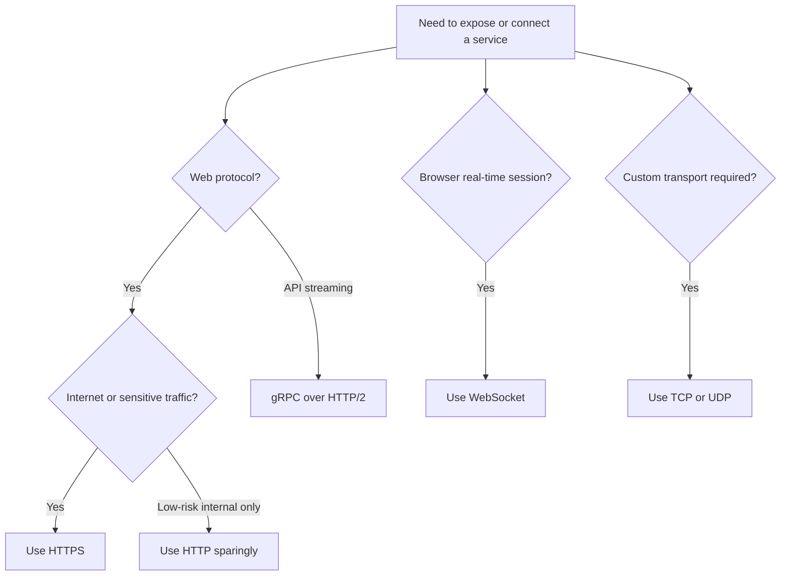
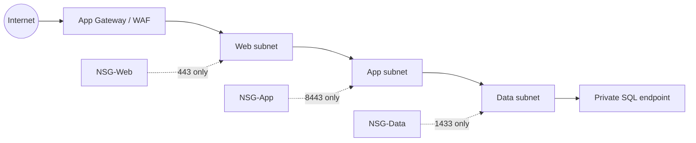

# Network Policies and Protocols on Azure

> **Screenshot Disclaimer:** Portal screenshots referenced in this guide are sourced from [Microsoft Learn](https://learn.microsoft.com/en-us/azure/) documentation. © Microsoft Corporation. All rights reserved. Used for educational reference only.

## NSG rules: what and why

A Network Security Group filters traffic at subnet or NIC level using ordered allow and deny rules.
Use NSGs to segment traffic close to workloads, reduce lateral movement, and document intended connectivity.
NSGs are stateful, so return traffic is automatically allowed when the initiating flow matches an allow rule.

### NSG step 1: Create the NSG

Why: Create a reusable control boundary before attaching it to subnets or NICs.

```bash
az network nsg create --resource-group rg-net-prod --name nsg-app-prod --location eastus
```

- Start with one NSG per subnet role when you need clear ownership and predictable changes.

- Document owner, approved flow, change ticket, and rollback for NSG step 1.

### NSG step 2: Add inbound rules

Why: Only allow required client, load balancer, or platform traffic.

```bash
az network nsg rule create --resource-group rg-net-prod --nsg-name nsg-app-prod --name allow-https-from-appgw --priority 100 --direction Inbound --access Allow --protocol Tcp --source-address-prefixes 10.20.0.0/24 --source-port-ranges "*" --destination-address-prefixes 10.10.1.0/24 --destination-port-ranges 443
az network nsg rule create --resource-group rg-net-prod --nsg-name nsg-app-prod --name allow-ssh-from-bastion --priority 110 --direction Inbound --access Allow --protocol Tcp --source-address-prefixes 10.0.3.0/24 --destination-port-ranges 22
```

- Use narrow source prefixes and destination ports so the rule explains the business flow.

- Document owner, approved flow, change ticket, and rollback for NSG step 2.

### NSG step 3: Add outbound rules

Why: Restrict egress when workloads should only reach approved dependencies.

```bash
az network nsg rule create --resource-group rg-net-prod --nsg-name nsg-app-prod --name allow-outbound-sql-private-endpoint --priority 100 --direction Outbound --access Allow --protocol Tcp --source-address-prefixes 10.10.1.0/24 --destination-address-prefixes 10.30.2.4 --destination-port-ranges 1433
```

- Outbound controls matter when you want workloads to reach only approved private endpoints or inspection paths.

- Document owner, approved flow, change ticket, and rollback for NSG step 3.

### NSG step 4: Associate with subnets

Why: Subnet association enforces consistent controls across all NICs in that subnet.

```bash
az network vnet subnet update --resource-group rg-net-prod --vnet-name vnet-app-prod --name snet-app --network-security-group nsg-app-prod
```

- Prefer subnet association for consistency; use NIC-level association only for exceptional cases.

- Document owner, approved flow, change ticket, and rollback for NSG step 4.

### NSG step 5: Review effective rules

Why: Effective rules show the combined impact of default, explicit, and inherited controls.

```bash
az network nic list-effective-nsg --resource-group rg-net-prod --name vmss-app000001VMNic
az network watcher test-ip-flow --resource-group rg-net-prod --vm vm-app01 --direction Outbound --protocol TCP --local 10.10.1.4:50000 --remote 10.30.2.4:1433
```

- Review effective security before incidents happen so teams trust the control plane data.

- Document owner, approved flow, change ticket, and rollback for NSG step 5.

## Azure Firewall vs NSG vs Application Gateway WAF

| Control | Best for | Layer | Why choose it | Limitations |
| --- | --- | --- | --- | --- |
| NSG | East-west subnet or NIC filtering | L3-L4 | Low cost, simple, native, close to workloads | No application inspection or central egress filtering |
| Azure Firewall | Central ingress and egress inspection, DNAT, FQDN rules | L3-L7 depending on SKU/features | Managed firewall with policy, scaling, and threat intelligence | More expensive than NSGs, not an HTTP reverse proxy |
| Application Gateway WAF | HTTP or HTTPS publishing with OWASP protections | L7 | Reverse proxy, TLS offload, path routing, WAF policies | Only for web traffic; not a general network firewall |

## Protocols on Azure

| Protocol | When to use | Why | Azure support notes |
| --- | --- | --- | --- |
| HTTP | Internal test endpoints, health probes, temporary non-sensitive paths | Simple and lightweight | Use only on trusted internal paths; encrypt external traffic with HTTPS |
| HTTPS | Web apps, APIs, portals, ingress to most business apps | TLS protects confidentiality and integrity | Supported by App Gateway, Front Door, Load Balancer with pass-through scenarios, App Service, AKS ingress |
| gRPC | Low-latency service-to-service APIs, streaming, strongly typed contracts | HTTP/2 based, efficient serialization, bidirectional streaming | Use with App Gateway v2 or Front Door patterns that support HTTP/2; validate ingress controller support in AKS |
| WebSocket | Real-time dashboards, chat, collaborative apps, push-style web sessions | Maintains long-lived duplex connections | Supported by App Service, App Gateway, Front Door, and AKS ingress with proper timeouts |
| TCP/UDP | Custom protocols, gaming, database protocols, DNS, syslog, telemetry | Full transport flexibility | Use Load Balancer, Firewall, NSG, and VNet rules; choose Standard SKU services for production |

## AKS Network Policies

| Engine | When to choose | Why | Notes |
| --- | --- | --- | --- |
| Azure Network Policy Manager | Teams wanting Azure-native management and simpler AKS alignment | Easy Azure integration and operational familiarity | Check feature availability per AKS version and region |
| Calico | Mature policy model, common enterprise Kubernetes experience | Well-known policies and flexible network segmentation | Some advanced features may depend on support model and plugin mode |
| Cilium | Teams prioritizing eBPF features, observability, and advanced policy behavior | Strong modern dataplane and network visibility | Validate AKS support matrix and operational skills first |

### Example namespace default deny

```yaml
apiVersion: networking.k8s.io/v1
kind: NetworkPolicy
metadata:
  name: default-deny-all
  namespace: payments
spec:
  podSelector: {}
  policyTypes:
  - Ingress
  - Egress
```

### Example allow from ingress namespace

```yaml
apiVersion: networking.k8s.io/v1
kind: NetworkPolicy
metadata:
  name: allow-from-ingress
  namespace: payments
spec:
  podSelector:
    matchLabels:
      app: payments-api
  ingress:
  - from:
    - namespaceSelector:
        matchLabels:
          kubernetes.io/metadata.name: ingress-system
    ports:
    - protocol: TCP
      port: 8443
  policyTypes:
  - Ingress
```

### Example allow egress to CoreDNS and SQL private endpoint

```yaml
apiVersion: networking.k8s.io/v1
kind: NetworkPolicy
metadata:
  name: allow-dns-and-sql
  namespace: payments
spec:
  podSelector:
    matchLabels:
      app: payments-api
  egress:
  - to:
    - namespaceSelector:
        matchLabels:
          kubernetes.io/metadata.name: kube-system
    ports:
    - protocol: UDP
      port: 53
  - to:
    - ipBlock:
        cidr: 10.30.2.4/32
    ports:
    - protocol: TCP
      port: 1433
  policyTypes:
  - Egress
```

## Private Endpoints vs Service Endpoints

| Option | When to use | Why | Watch-outs |
| --- | --- | --- | --- |
| Private Endpoint | Sensitive PaaS access, strict exfiltration control, private IP requirement | Brings service to your VNet using Private Link and works well with DNS control | More DNS planning and per-endpoint management |
| Service Endpoint | Simple subnet-based restriction to Azure PaaS without private IP exposure | Easier to enable and lower operational complexity for some scenarios | Service still has public endpoint; less isolation than Private Link |

## DNS and traffic distribution

| Service | When to use | Why |
| --- | --- | --- |
| Azure DNS | Public authoritative DNS hosting for domains and records | Simple managed authoritative DNS in Azure |
| Azure Private DNS | Internal name resolution for VNets and private endpoints | Central private namespace with VNet links |
| Traffic Manager | DNS-based global routing using latency, priority, or weighted policies | Useful across public endpoints and multiple clouds or regions |
| Azure Front Door | Global anycast entry point, L7 acceleration, CDN-like edge, WAF integration | Preferred for modern web delivery and application-layer failover |

## Protocol selection flow



## Microsoft Learn references

> 
>
> *Screenshot source: [Microsoft Learn — Quickstart: Create an Azure Virtual Network | Microsoft Learn](https://learn.microsoft.com/en-us/azure/virtual-network/quick-create-portal). © Microsoft Corporation. Used for educational reference only.*

> **Portal View:** Navigate to `Azure Portal` → `Network security groups` → `Inbound security rules` or `Effective security rules`. These blades help operators confirm rule priority, service tags, ASGs, and the combined result of subnet and NIC policy.
>
> *For the latest portal screenshots, see [Microsoft Learn — Network security groups](https://learn.microsoft.com/en-us/azure/virtual-network/network-security-groups-overview).* 

> **Portal View:** Navigate to `Azure Portal` → `Azure Firewall` → `Rule Collection Groups` or `Logs`. The experience shows application, network, and DNAT rules together with logging views used when tracing blocked flows.
>
> *For the latest portal screenshots, see [Microsoft Learn — Azure Firewall overview](https://learn.microsoft.com/en-us/azure/firewall/overview).* 

- [Network security groups](https://learn.microsoft.com/azure/virtual-network/network-security-groups-overview)
- [Azure Firewall](https://learn.microsoft.com/azure/firewall/overview)
- [Application Gateway WAF](https://learn.microsoft.com/azure/web-application-firewall/ag/ag-overview)
- [AKS network policy](https://learn.microsoft.com/azure/aks/use-network-policies)
- [Private endpoints](https://learn.microsoft.com/azure/private-link/private-endpoint-overview)
- [Azure DNS](https://learn.microsoft.com/azure/dns/dns-overview)

## Practical implementation runbooks

### Scenario 1: Three-tier app subnet policy



1. Attach a subnet-level NSG to each tier rather than mixing unrelated rules into one giant policy object.
2. Use **Application Security Groups** so web-to-app and app-to-data flows follow workload labels rather than changing IP addresses.
3. Validate the exact five-tuple with `az network watcher test-ip-flow` before approving production changes.
4. Capture the effective NSG output and change ticket ID in the implementation record.

Expected validation output for a healthy rule path:

```text
Access    RuleName
--------  ------------------------------
Allow     allow-https-from-appgw

ConnectionStatus    Hops
------------------  ----
Reachable           3
```

### Scenario 2: Private endpoint with DNS governance

- Use a dedicated or tightly governed private-endpoint subnet.
- Host Private DNS zones centrally and link all consumer VNets.
- Confirm clients resolve the service FQDN to the private IP before disabling the public endpoint.
- Review UDRs carefully so inspection devices do not accidentally break Private Link traffic.

### Scenario 3: AKS namespace isolation

- Apply a default-deny policy first in non-production and test platform components such as ingress, DNS, and metrics.
- Add explicit ingress and egress rules for dependencies like SQL private endpoints, queues, and CoreDNS.
- Treat namespace labels and workload selectors as part of the application contract; policy drift often starts there.
- Re-run connectivity tests after each deployment because new sidecars or destinations can silently break policy assumptions.

## Operator checklist

| Check | Why it matters | Evidence |
| --- | --- | --- |
| Effective NSG review | Confirms combined subnet + NIC behavior | `az network nic list-effective-nsg` output |
| Next hop review | Validates routing after UDR or firewall changes | `az network watcher show-next-hop` output |
| DNS resolution test | Confirms private endpoint name resolution | `nslookup` or `Resolve-DnsName` result |
| Health probe allowance | Prevents false backend failures | Probe source and NSG rule review |
| Log review | Explains blocked or asymmetric flows | NSG flow logs or Firewall logs |
