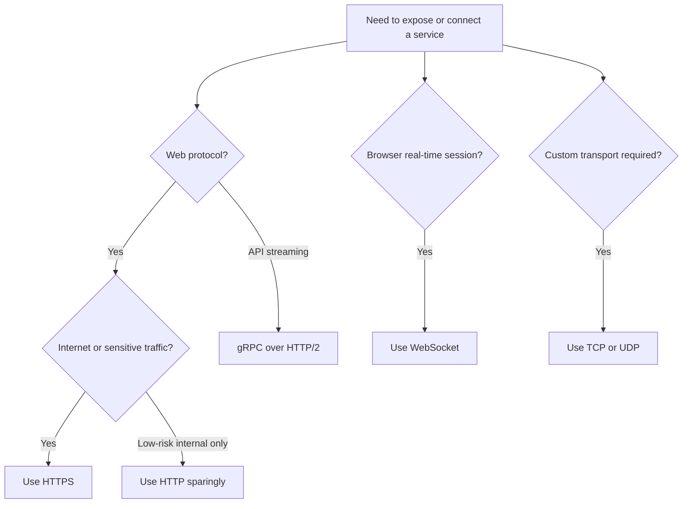

# Network Policies and Protocols on Azure

## NSG rules: what and why

A Network Security Group filters traffic at subnet or NIC level using ordered allow and deny rules.
Use NSGs to segment traffic close to workloads, reduce lateral movement, and document intended connectivity.
NSGs are stateful, so return traffic is automatically allowed when the initiating flow matches an allow rule.

### NSG step 1: Create the NSG

Why: Create a reusable control boundary before attaching it to subnets or NICs.

```bash
az network nsg create --resource-group rg-net-prod --name nsg-app-prod --location eastus
```

- Start with one NSG per subnet role when you need clear ownership and predictable changes.

- Document owner, approved flow, change ticket, and rollback for NSG step 1.

### NSG step 2: Add inbound rules

Why: Only allow required client, load balancer, or platform traffic.

```bash
az network nsg rule create --resource-group rg-net-prod --nsg-name nsg-app-prod --name allow-https-from-appgw --priority 100 --direction Inbound --access Allow --protocol Tcp --source-address-prefixes 10.20.0.0/24 --source-port-ranges "*" --destination-address-prefixes 10.10.1.0/24 --destination-port-ranges 443
az network nsg rule create --resource-group rg-net-prod --nsg-name nsg-app-prod --name allow-ssh-from-bastion --priority 110 --direction Inbound --access Allow --protocol Tcp --source-address-prefixes 10.0.3.0/24 --destination-port-ranges 22
```

- Use narrow source prefixes and destination ports so the rule explains the business flow.

- Document owner, approved flow, change ticket, and rollback for NSG step 2.

### NSG step 3: Add outbound rules

Why: Restrict egress when workloads should only reach approved dependencies.

```bash
az network nsg rule create --resource-group rg-net-prod --nsg-name nsg-app-prod --name allow-outbound-sql-private-endpoint --priority 100 --direction Outbound --access Allow --protocol Tcp --source-address-prefixes 10.10.1.0/24 --destination-address-prefixes 10.30.2.4 --destination-port-ranges 1433
```

- Outbound controls matter when you want workloads to reach only approved private endpoints or inspection paths.

- Document owner, approved flow, change ticket, and rollback for NSG step 3.

### NSG step 4: Associate with subnets

Why: Subnet association enforces consistent controls across all NICs in that subnet.

```bash
az network vnet subnet update --resource-group rg-net-prod --vnet-name vnet-app-prod --name snet-app --network-security-group nsg-app-prod
```

- Prefer subnet association for consistency; use NIC-level association only for exceptional cases.

- Document owner, approved flow, change ticket, and rollback for NSG step 4.

### NSG step 5: Review effective rules

Why: Effective rules show the combined impact of default, explicit, and inherited controls.

```bash
az network nic list-effective-nsg --resource-group rg-net-prod --name vmss-app000001VMNic
az network watcher test-ip-flow --resource-group rg-net-prod --vm vm-app01 --direction Outbound --protocol TCP --local 10.10.1.4:50000 --remote 10.30.2.4:1433
```

- Review effective security before incidents happen so teams trust the control plane data.

- Document owner, approved flow, change ticket, and rollback for NSG step 5.

## Azure Firewall vs NSG vs Application Gateway WAF

| Control | Best for | Layer | Why choose it | Limitations |
| --- | --- | --- | --- | --- |
| NSG | East-west subnet or NIC filtering | L3-L4 | Low cost, simple, native, close to workloads | No application inspection or central egress filtering |
| Azure Firewall | Central ingress and egress inspection, DNAT, FQDN rules | L3-L7 depending on SKU/features | Managed firewall with policy, scaling, and threat intelligence | More expensive than NSGs, not an HTTP reverse proxy |
| Application Gateway WAF | HTTP or HTTPS publishing with OWASP protections | L7 | Reverse proxy, TLS offload, path routing, WAF policies | Only for web traffic; not a general network firewall |

## Protocols on Azure

| Protocol | When to use | Why | Azure support notes |
| --- | --- | --- | --- |
| HTTP | Internal test endpoints, health probes, temporary non-sensitive paths | Simple and lightweight | Use only on trusted internal paths; encrypt external traffic with HTTPS |
| HTTPS | Web apps, APIs, portals, ingress to most business apps | TLS protects confidentiality and integrity | Supported by App Gateway, Front Door, Load Balancer with pass-through scenarios, App Service, AKS ingress |
| gRPC | Low-latency service-to-service APIs, streaming, strongly typed contracts | HTTP/2 based, efficient serialization, bidirectional streaming | Use with App Gateway v2 or Front Door patterns that support HTTP/2; validate ingress controller support in AKS |
| WebSocket | Real-time dashboards, chat, collaborative apps, push-style web sessions | Maintains long-lived duplex connections | Supported by App Service, App Gateway, Front Door, and AKS ingress with proper timeouts |
| TCP/UDP | Custom protocols, gaming, database protocols, DNS, syslog, telemetry | Full transport flexibility | Use Load Balancer, Firewall, NSG, and VNet rules; choose Standard SKU services for production |

## AKS Network Policies

| Engine | When to choose | Why | Notes |
| --- | --- | --- | --- |
| Azure Network Policy Manager | Teams wanting Azure-native management and simpler AKS alignment | Easy Azure integration and operational familiarity | Check feature availability per AKS version and region |
| Calico | Mature policy model, common enterprise Kubernetes experience | Well-known policies and flexible network segmentation | Some advanced features may depend on support model and plugin mode |
| Cilium | Teams prioritizing eBPF features, observability, and advanced policy behavior | Strong modern dataplane and network visibility | Validate AKS support matrix and operational skills first |

### Example namespace default deny

```yaml
apiVersion: networking.k8s.io/v1
kind: NetworkPolicy
metadata:
  name: default-deny-all
  namespace: payments
spec:
  podSelector: {}
  policyTypes:
  - Ingress
  - Egress
```

### Example allow from ingress namespace

```yaml
apiVersion: networking.k8s.io/v1
kind: NetworkPolicy
metadata:
  name: allow-from-ingress
  namespace: payments
spec:
  podSelector:
    matchLabels:
      app: payments-api
  ingress:
  - from:
    - namespaceSelector:
        matchLabels:
          kubernetes.io/metadata.name: ingress-system
    ports:
    - protocol: TCP
      port: 8443
  policyTypes:
  - Ingress
```

### Example allow egress to CoreDNS and SQL private endpoint

```yaml
apiVersion: networking.k8s.io/v1
kind: NetworkPolicy
metadata:
  name: allow-dns-and-sql
  namespace: payments
spec:
  podSelector:
    matchLabels:
      app: payments-api
  egress:
  - to:
    - namespaceSelector:
        matchLabels:
          kubernetes.io/metadata.name: kube-system
    ports:
    - protocol: UDP
      port: 53
  - to:
    - ipBlock:
        cidr: 10.30.2.4/32
    ports:
    - protocol: TCP
      port: 1433
  policyTypes:
  - Egress
```

## Private Endpoints vs Service Endpoints

| Option | When to use | Why | Watch-outs |
| --- | --- | --- | --- |
| Private Endpoint | Sensitive PaaS access, strict exfiltration control, private IP requirement | Brings service to your VNet using Private Link and works well with DNS control | More DNS planning and per-endpoint management |
| Service Endpoint | Simple subnet-based restriction to Azure PaaS without private IP exposure | Easier to enable and lower operational complexity for some scenarios | Service still has public endpoint; less isolation than Private Link |

## DNS and traffic distribution

| Service | When to use | Why |
| --- | --- | --- |
| Azure DNS | Public authoritative DNS hosting for domains and records | Simple managed authoritative DNS in Azure |
| Azure Private DNS | Internal name resolution for VNets and private endpoints | Central private namespace with VNet links |
| Traffic Manager | DNS-based global routing using latency, priority, or weighted policies | Useful across public endpoints and multiple clouds or regions |
| Azure Front Door | Global anycast entry point, L7 acceleration, CDN-like edge, WAF integration | Preferred for modern web delivery and application-layer failover |

## Protocol selection flow



## Microsoft Learn references

- [Network security groups](https://learn.microsoft.com/azure/virtual-network/network-security-groups-overview)
- [Azure Firewall](https://learn.microsoft.com/azure/firewall/overview)
- [Application Gateway WAF](https://learn.microsoft.com/azure/web-application-firewall/ag/ag-overview)
- [AKS network policy](https://learn.microsoft.com/azure/aks/use-network-policies)
- [Private endpoints](https://learn.microsoft.com/azure/private-link/private-endpoint-overview)
- [Azure DNS](https://learn.microsoft.com/azure/dns/dns-overview)

### Networking implementation note 1

- Confirm scope, ownership, and rollback steps for networking implementation note 1.
- Capture the az command output in change records so auditors can trace decision 1.
- Revisit naming, tags, and RBAC boundaries before promoting to production wave 1.
- Validate dependencies, DNS paths, routing, and policy assignments after milestone 1.

### Networking implementation note 2

- Confirm scope, ownership, and rollback steps for networking implementation note 2.
- Capture the az command output in change records so auditors can trace decision 2.
- Revisit naming, tags, and RBAC boundaries before promoting to production wave 2.
- Validate dependencies, DNS paths, routing, and policy assignments after milestone 2.

### Networking implementation note 3

- Confirm scope, ownership, and rollback steps for networking implementation note 3.
- Capture the az command output in change records so auditors can trace decision 3.
- Revisit naming, tags, and RBAC boundaries before promoting to production wave 3.
- Validate dependencies, DNS paths, routing, and policy assignments after milestone 3.

### Networking implementation note 4

- Confirm scope, ownership, and rollback steps for networking implementation note 4.
- Capture the az command output in change records so auditors can trace decision 4.
- Revisit naming, tags, and RBAC boundaries before promoting to production wave 4.
- Validate dependencies, DNS paths, routing, and policy assignments after milestone 4.

### Networking implementation note 5

- Confirm scope, ownership, and rollback steps for networking implementation note 5.
- Capture the az command output in change records so auditors can trace decision 5.
- Revisit naming, tags, and RBAC boundaries before promoting to production wave 5.
- Validate dependencies, DNS paths, routing, and policy assignments after milestone 5.

### Networking implementation note 6

- Confirm scope, ownership, and rollback steps for networking implementation note 6.
- Capture the az command output in change records so auditors can trace decision 6.
- Revisit naming, tags, and RBAC boundaries before promoting to production wave 6.
- Validate dependencies, DNS paths, routing, and policy assignments after milestone 6.

### Networking implementation note 7

- Confirm scope, ownership, and rollback steps for networking implementation note 7.
- Capture the az command output in change records so auditors can trace decision 7.
- Revisit naming, tags, and RBAC boundaries before promoting to production wave 7.
- Validate dependencies, DNS paths, routing, and policy assignments after milestone 7.

### Networking implementation note 8

- Confirm scope, ownership, and rollback steps for networking implementation note 8.
- Capture the az command output in change records so auditors can trace decision 8.
- Revisit naming, tags, and RBAC boundaries before promoting to production wave 8.
- Validate dependencies, DNS paths, routing, and policy assignments after milestone 8.

### Networking implementation note 9

- Confirm scope, ownership, and rollback steps for networking implementation note 9.
- Capture the az command output in change records so auditors can trace decision 9.
- Revisit naming, tags, and RBAC boundaries before promoting to production wave 9.
- Validate dependencies, DNS paths, routing, and policy assignments after milestone 9.

### Networking implementation note 10

- Confirm scope, ownership, and rollback steps for networking implementation note 10.
- Capture the az command output in change records so auditors can trace decision 10.
- Revisit naming, tags, and RBAC boundaries before promoting to production wave 10.
- Validate dependencies, DNS paths, routing, and policy assignments after milestone 10.

### Networking implementation note 11

- Confirm scope, ownership, and rollback steps for networking implementation note 11.
- Capture the az command output in change records so auditors can trace decision 11.
- Revisit naming, tags, and RBAC boundaries before promoting to production wave 11.
- Validate dependencies, DNS paths, routing, and policy assignments after milestone 11.

### Networking implementation note 12

- Confirm scope, ownership, and rollback steps for networking implementation note 12.
- Capture the az command output in change records so auditors can trace decision 12.
- Revisit naming, tags, and RBAC boundaries before promoting to production wave 12.
- Validate dependencies, DNS paths, routing, and policy assignments after milestone 12.

### Networking implementation note 13

- Confirm scope, ownership, and rollback steps for networking implementation note 13.
- Capture the az command output in change records so auditors can trace decision 13.
- Revisit naming, tags, and RBAC boundaries before promoting to production wave 13.
- Validate dependencies, DNS paths, routing, and policy assignments after milestone 13.

### Networking implementation note 14

- Confirm scope, ownership, and rollback steps for networking implementation note 14.
- Capture the az command output in change records so auditors can trace decision 14.
- Revisit naming, tags, and RBAC boundaries before promoting to production wave 14.
- Validate dependencies, DNS paths, routing, and policy assignments after milestone 14.

### Networking implementation note 15

- Confirm scope, ownership, and rollback steps for networking implementation note 15.
- Capture the az command output in change records so auditors can trace decision 15.
- Revisit naming, tags, and RBAC boundaries before promoting to production wave 15.
- Validate dependencies, DNS paths, routing, and policy assignments after milestone 15.

### Networking implementation note 16

- Confirm scope, ownership, and rollback steps for networking implementation note 16.
- Capture the az command output in change records so auditors can trace decision 16.
- Revisit naming, tags, and RBAC boundaries before promoting to production wave 16.
- Validate dependencies, DNS paths, routing, and policy assignments after milestone 16.

### Networking implementation note 17

- Confirm scope, ownership, and rollback steps for networking implementation note 17.
- Capture the az command output in change records so auditors can trace decision 17.
- Revisit naming, tags, and RBAC boundaries before promoting to production wave 17.
- Validate dependencies, DNS paths, routing, and policy assignments after milestone 17.

### Networking implementation note 18

- Confirm scope, ownership, and rollback steps for networking implementation note 18.
- Capture the az command output in change records so auditors can trace decision 18.
- Revisit naming, tags, and RBAC boundaries before promoting to production wave 18.
- Validate dependencies, DNS paths, routing, and policy assignments after milestone 18.

### Networking implementation note 19

- Confirm scope, ownership, and rollback steps for networking implementation note 19.
- Capture the az command output in change records so auditors can trace decision 19.
- Revisit naming, tags, and RBAC boundaries before promoting to production wave 19.
- Validate dependencies, DNS paths, routing, and policy assignments after milestone 19.

### Networking implementation note 20

- Confirm scope, ownership, and rollback steps for networking implementation note 20.
- Capture the az command output in change records so auditors can trace decision 20.
- Revisit naming, tags, and RBAC boundaries before promoting to production wave 20.
- Validate dependencies, DNS paths, routing, and policy assignments after milestone 20.

### Networking implementation note 21

- Confirm scope, ownership, and rollback steps for networking implementation note 21.
- Capture the az command output in change records so auditors can trace decision 21.
- Revisit naming, tags, and RBAC boundaries before promoting to production wave 21.
- Validate dependencies, DNS paths, routing, and policy assignments after milestone 21.

### Networking implementation note 22

- Confirm scope, ownership, and rollback steps for networking implementation note 22.
- Capture the az command output in change records so auditors can trace decision 22.
- Revisit naming, tags, and RBAC boundaries before promoting to production wave 22.
- Validate dependencies, DNS paths, routing, and policy assignments after milestone 22.

### Networking implementation note 23

- Confirm scope, ownership, and rollback steps for networking implementation note 23.
- Capture the az command output in change records so auditors can trace decision 23.
- Revisit naming, tags, and RBAC boundaries before promoting to production wave 23.
- Validate dependencies, DNS paths, routing, and policy assignments after milestone 23.

### Networking implementation note 24

- Confirm scope, ownership, and rollback steps for networking implementation note 24.
- Capture the az command output in change records so auditors can trace decision 24.
- Revisit naming, tags, and RBAC boundaries before promoting to production wave 24.
- Validate dependencies, DNS paths, routing, and policy assignments after milestone 24.

### Networking implementation note 25

- Confirm scope, ownership, and rollback steps for networking implementation note 25.
- Capture the az command output in change records so auditors can trace decision 25.
- Revisit naming, tags, and RBAC boundaries before promoting to production wave 25.
- Validate dependencies, DNS paths, routing, and policy assignments after milestone 25.

### Networking implementation note 26

- Confirm scope, ownership, and rollback steps for networking implementation note 26.
- Capture the az command output in change records so auditors can trace decision 26.
- Revisit naming, tags, and RBAC boundaries before promoting to production wave 26.
- Validate dependencies, DNS paths, routing, and policy assignments after milestone 26.

### Networking implementation note 27

- Confirm scope, ownership, and rollback steps for networking implementation note 27.
- Capture the az command output in change records so auditors can trace decision 27.
- Revisit naming, tags, and RBAC boundaries before promoting to production wave 27.
- Validate dependencies, DNS paths, routing, and policy assignments after milestone 27.

### Networking implementation note 28

- Confirm scope, ownership, and rollback steps for networking implementation note 28.
- Capture the az command output in change records so auditors can trace decision 28.
- Revisit naming, tags, and RBAC boundaries before promoting to production wave 28.
- Validate dependencies, DNS paths, routing, and policy assignments after milestone 28.

### Networking implementation note 29

- Confirm scope, ownership, and rollback steps for networking implementation note 29.
- Capture the az command output in change records so auditors can trace decision 29.
- Revisit naming, tags, and RBAC boundaries before promoting to production wave 29.
- Validate dependencies, DNS paths, routing, and policy assignments after milestone 29.

### Networking implementation note 30

- Confirm scope, ownership, and rollback steps for networking implementation note 30.
- Capture the az command output in change records so auditors can trace decision 30.
- Revisit naming, tags, and RBAC boundaries before promoting to production wave 30.
- Validate dependencies, DNS paths, routing, and policy assignments after milestone 30.

### Networking implementation note 31

- Confirm scope, ownership, and rollback steps for networking implementation note 31.
- Capture the az command output in change records so auditors can trace decision 31.
- Revisit naming, tags, and RBAC boundaries before promoting to production wave 31.
- Validate dependencies, DNS paths, routing, and policy assignments after milestone 31.

### Networking implementation note 32

- Confirm scope, ownership, and rollback steps for networking implementation note 32.
- Capture the az command output in change records so auditors can trace decision 32.
- Revisit naming, tags, and RBAC boundaries before promoting to production wave 32.
- Validate dependencies, DNS paths, routing, and policy assignments after milestone 32.

### Networking implementation note 33

- Confirm scope, ownership, and rollback steps for networking implementation note 33.
- Capture the az command output in change records so auditors can trace decision 33.
- Revisit naming, tags, and RBAC boundaries before promoting to production wave 33.
- Validate dependencies, DNS paths, routing, and policy assignments after milestone 33.

### Networking implementation note 34

- Confirm scope, ownership, and rollback steps for networking implementation note 34.
- Capture the az command output in change records so auditors can trace decision 34.
- Revisit naming, tags, and RBAC boundaries before promoting to production wave 34.
- Validate dependencies, DNS paths, routing, and policy assignments after milestone 34.

### Networking implementation note 35

- Confirm scope, ownership, and rollback steps for networking implementation note 35.
- Capture the az command output in change records so auditors can trace decision 35.
- Revisit naming, tags, and RBAC boundaries before promoting to production wave 35.
- Validate dependencies, DNS paths, routing, and policy assignments after milestone 35.

### Networking implementation note 36

- Confirm scope, ownership, and rollback steps for networking implementation note 36.
- Capture the az command output in change records so auditors can trace decision 36.
- Revisit naming, tags, and RBAC boundaries before promoting to production wave 36.
- Validate dependencies, DNS paths, routing, and policy assignments after milestone 36.

### Networking implementation note 37

- Confirm scope, ownership, and rollback steps for networking implementation note 37.
- Capture the az command output in change records so auditors can trace decision 37.
- Revisit naming, tags, and RBAC boundaries before promoting to production wave 37.
- Validate dependencies, DNS paths, routing, and policy assignments after milestone 37.

### Networking implementation note 38

- Confirm scope, ownership, and rollback steps for networking implementation note 38.
- Capture the az command output in change records so auditors can trace decision 38.
- Revisit naming, tags, and RBAC boundaries before promoting to production wave 38.
- Validate dependencies, DNS paths, routing, and policy assignments after milestone 38.

### Networking implementation note 39

- Confirm scope, ownership, and rollback steps for networking implementation note 39.
- Capture the az command output in change records so auditors can trace decision 39.
- Revisit naming, tags, and RBAC boundaries before promoting to production wave 39.
- Validate dependencies, DNS paths, routing, and policy assignments after milestone 39.

### Networking implementation note 40

- Confirm scope, ownership, and rollback steps for networking implementation note 40.
- Capture the az command output in change records so auditors can trace decision 40.
- Revisit naming, tags, and RBAC boundaries before promoting to production wave 40.
- Validate dependencies, DNS paths, routing, and policy assignments after milestone 40.

### Networking implementation note 41

- Confirm scope, ownership, and rollback steps for networking implementation note 41.
- Capture the az command output in change records so auditors can trace decision 41.
- Revisit naming, tags, and RBAC boundaries before promoting to production wave 41.
- Validate dependencies, DNS paths, routing, and policy assignments after milestone 41.

### Networking implementation note 42

- Confirm scope, ownership, and rollback steps for networking implementation note 42.
- Capture the az command output in change records so auditors can trace decision 42.
- Revisit naming, tags, and RBAC boundaries before promoting to production wave 42.
- Validate dependencies, DNS paths, routing, and policy assignments after milestone 42.

### Networking implementation note 43

- Confirm scope, ownership, and rollback steps for networking implementation note 43.
- Capture the az command output in change records so auditors can trace decision 43.
- Revisit naming, tags, and RBAC boundaries before promoting to production wave 43.
- Validate dependencies, DNS paths, routing, and policy assignments after milestone 43.

### Networking implementation note 44

- Confirm scope, ownership, and rollback steps for networking implementation note 44.
- Capture the az command output in change records so auditors can trace decision 44.
- Revisit naming, tags, and RBAC boundaries before promoting to production wave 44.
- Validate dependencies, DNS paths, routing, and policy assignments after milestone 44.

### Networking implementation note 45

- Confirm scope, ownership, and rollback steps for networking implementation note 45.
- Capture the az command output in change records so auditors can trace decision 45.
- Revisit naming, tags, and RBAC boundaries before promoting to production wave 45.
- Validate dependencies, DNS paths, routing, and policy assignments after milestone 45.

### Networking implementation note 46

- Confirm scope, ownership, and rollback steps for networking implementation note 46.
- Capture the az command output in change records so auditors can trace decision 46.
- Revisit naming, tags, and RBAC boundaries before promoting to production wave 46.
- Validate dependencies, DNS paths, routing, and policy assignments after milestone 46.

### Networking implementation note 47

- Confirm scope, ownership, and rollback steps for networking implementation note 47.
- Capture the az command output in change records so auditors can trace decision 47.
- Revisit naming, tags, and RBAC boundaries before promoting to production wave 47.
- Validate dependencies, DNS paths, routing, and policy assignments after milestone 47.

### Networking implementation note 48

- Confirm scope, ownership, and rollback steps for networking implementation note 48.
- Capture the az command output in change records so auditors can trace decision 48.
- Revisit naming, tags, and RBAC boundaries before promoting to production wave 48.
- Validate dependencies, DNS paths, routing, and policy assignments after milestone 48.

### Networking implementation note 49

- Confirm scope, ownership, and rollback steps for networking implementation note 49.
- Capture the az command output in change records so auditors can trace decision 49.
- Revisit naming, tags, and RBAC boundaries before promoting to production wave 49.
- Validate dependencies, DNS paths, routing, and policy assignments after milestone 49.

### Networking implementation note 50

- Confirm scope, ownership, and rollback steps for networking implementation note 50.
- Capture the az command output in change records so auditors can trace decision 50.
- Revisit naming, tags, and RBAC boundaries before promoting to production wave 50.
- Validate dependencies, DNS paths, routing, and policy assignments after milestone 50.

### Networking implementation note 51

- Confirm scope, ownership, and rollback steps for networking implementation note 51.
- Capture the az command output in change records so auditors can trace decision 51.
- Revisit naming, tags, and RBAC boundaries before promoting to production wave 51.
- Validate dependencies, DNS paths, routing, and policy assignments after milestone 51.

### Networking implementation note 52

- Confirm scope, ownership, and rollback steps for networking implementation note 52.
- Capture the az command output in change records so auditors can trace decision 52.
- Revisit naming, tags, and RBAC boundaries before promoting to production wave 52.
- Validate dependencies, DNS paths, routing, and policy assignments after milestone 52.

### Networking implementation note 53

- Confirm scope, ownership, and rollback steps for networking implementation note 53.
- Capture the az command output in change records so auditors can trace decision 53.
- Revisit naming, tags, and RBAC boundaries before promoting to production wave 53.
- Validate dependencies, DNS paths, routing, and policy assignments after milestone 53.

### Networking implementation note 54

- Confirm scope, ownership, and rollback steps for networking implementation note 54.
- Capture the az command output in change records so auditors can trace decision 54.
- Revisit naming, tags, and RBAC boundaries before promoting to production wave 54.
- Validate dependencies, DNS paths, routing, and policy assignments after milestone 54.

### Networking implementation note 55

- Confirm scope, ownership, and rollback steps for networking implementation note 55.
- Capture the az command output in change records so auditors can trace decision 55.
- Revisit naming, tags, and RBAC boundaries before promoting to production wave 55.
- Validate dependencies, DNS paths, routing, and policy assignments after milestone 55.

### Networking implementation note 56

- Confirm scope, ownership, and rollback steps for networking implementation note 56.
- Capture the az command output in change records so auditors can trace decision 56.
- Revisit naming, tags, and RBAC boundaries before promoting to production wave 56.
- Validate dependencies, DNS paths, routing, and policy assignments after milestone 56.

### Networking implementation note 57

- Confirm scope, ownership, and rollback steps for networking implementation note 57.
- Capture the az command output in change records so auditors can trace decision 57.
- Revisit naming, tags, and RBAC boundaries before promoting to production wave 57.
- Validate dependencies, DNS paths, routing, and policy assignments after milestone 57.

### Networking implementation note 58

- Confirm scope, ownership, and rollback steps for networking implementation note 58.
- Capture the az command output in change records so auditors can trace decision 58.
- Revisit naming, tags, and RBAC boundaries before promoting to production wave 58.
- Validate dependencies, DNS paths, routing, and policy assignments after milestone 58.

### Networking implementation note 59

- Confirm scope, ownership, and rollback steps for networking implementation note 59.
- Capture the az command output in change records so auditors can trace decision 59.
- Revisit naming, tags, and RBAC boundaries before promoting to production wave 59.
- Validate dependencies, DNS paths, routing, and policy assignments after milestone 59.

### Networking implementation note 60

- Confirm scope, ownership, and rollback steps for networking implementation note 60.
- Capture the az command output in change records so auditors can trace decision 60.
- Revisit naming, tags, and RBAC boundaries before promoting to production wave 60.
- Validate dependencies, DNS paths, routing, and policy assignments after milestone 60.

### Networking implementation note 61

- Confirm scope, ownership, and rollback steps for networking implementation note 61.
- Capture the az command output in change records so auditors can trace decision 61.
- Revisit naming, tags, and RBAC boundaries before promoting to production wave 61.
- Validate dependencies, DNS paths, routing, and policy assignments after milestone 61.

### Networking implementation note 62

- Confirm scope, ownership, and rollback steps for networking implementation note 62.
- Capture the az command output in change records so auditors can trace decision 62.
- Revisit naming, tags, and RBAC boundaries before promoting to production wave 62.
- Validate dependencies, DNS paths, routing, and policy assignments after milestone 62.

### Networking implementation note 63

- Confirm scope, ownership, and rollback steps for networking implementation note 63.
- Capture the az command output in change records so auditors can trace decision 63.
- Revisit naming, tags, and RBAC boundaries before promoting to production wave 63.
- Validate dependencies, DNS paths, routing, and policy assignments after milestone 63.

### Networking implementation note 64

- Confirm scope, ownership, and rollback steps for networking implementation note 64.
- Capture the az command output in change records so auditors can trace decision 64.
- Revisit naming, tags, and RBAC boundaries before promoting to production wave 64.
- Validate dependencies, DNS paths, routing, and policy assignments after milestone 64.

### Networking implementation note 65

- Confirm scope, ownership, and rollback steps for networking implementation note 65.
- Capture the az command output in change records so auditors can trace decision 65.
- Revisit naming, tags, and RBAC boundaries before promoting to production wave 65.
- Validate dependencies, DNS paths, routing, and policy assignments after milestone 65.

### Networking implementation note 66

- Confirm scope, ownership, and rollback steps for networking implementation note 66.
- Capture the az command output in change records so auditors can trace decision 66.
- Revisit naming, tags, and RBAC boundaries before promoting to production wave 66.
- Validate dependencies, DNS paths, routing, and policy assignments after milestone 66.

### Networking implementation note 67

- Confirm scope, ownership, and rollback steps for networking implementation note 67.
- Capture the az command output in change records so auditors can trace decision 67.
- Revisit naming, tags, and RBAC boundaries before promoting to production wave 67.
- Validate dependencies, DNS paths, routing, and policy assignments after milestone 67.

### Networking implementation note 68

- Confirm scope, ownership, and rollback steps for networking implementation note 68.
- Capture the az command output in change records so auditors can trace decision 68.
- Revisit naming, tags, and RBAC boundaries before promoting to production wave 68.
- Validate dependencies, DNS paths, routing, and policy assignments after milestone 68.

### Networking implementation note 69

- Confirm scope, ownership, and rollback steps for networking implementation note 69.
- Capture the az command output in change records so auditors can trace decision 69.
- Revisit naming, tags, and RBAC boundaries before promoting to production wave 69.
- Validate dependencies, DNS paths, routing, and policy assignments after milestone 69.

### Networking implementation note 70

- Confirm scope, ownership, and rollback steps for networking implementation note 70.
- Capture the az command output in change records so auditors can trace decision 70.
- Revisit naming, tags, and RBAC boundaries before promoting to production wave 70.
- Validate dependencies, DNS paths, routing, and policy assignments after milestone 70.

### Networking implementation note 71

- Confirm scope, ownership, and rollback steps for networking implementation note 71.
- Capture the az command output in change records so auditors can trace decision 71.
- Revisit naming, tags, and RBAC boundaries before promoting to production wave 71.
- Validate dependencies, DNS paths, routing, and policy assignments after milestone 71.

### Networking implementation note 72

- Confirm scope, ownership, and rollback steps for networking implementation note 72.
- Capture the az command output in change records so auditors can trace decision 72.
- Revisit naming, tags, and RBAC boundaries before promoting to production wave 72.
- Validate dependencies, DNS paths, routing, and policy assignments after milestone 72.

### Networking implementation note 73

- Confirm scope, ownership, and rollback steps for networking implementation note 73.
- Capture the az command output in change records so auditors can trace decision 73.
- Revisit naming, tags, and RBAC boundaries before promoting to production wave 73.
- Validate dependencies, DNS paths, routing, and policy assignments after milestone 73.

### Networking implementation note 74

- Confirm scope, ownership, and rollback steps for networking implementation note 74.
- Capture the az command output in change records so auditors can trace decision 74.
- Revisit naming, tags, and RBAC boundaries before promoting to production wave 74.
- Validate dependencies, DNS paths, routing, and policy assignments after milestone 74.

### Networking implementation note 75

- Confirm scope, ownership, and rollback steps for networking implementation note 75.
- Capture the az command output in change records so auditors can trace decision 75.
- Revisit naming, tags, and RBAC boundaries before promoting to production wave 75.
- Validate dependencies, DNS paths, routing, and policy assignments after milestone 75.

### Networking implementation note 76

- Confirm scope, ownership, and rollback steps for networking implementation note 76.
- Capture the az command output in change records so auditors can trace decision 76.
- Revisit naming, tags, and RBAC boundaries before promoting to production wave 76.
- Validate dependencies, DNS paths, routing, and policy assignments after milestone 76.

### Networking implementation note 77

- Confirm scope, ownership, and rollback steps for networking implementation note 77.
- Capture the az command output in change records so auditors can trace decision 77.
- Revisit naming, tags, and RBAC boundaries before promoting to production wave 77.
- Validate dependencies, DNS paths, routing, and policy assignments after milestone 77.

### Networking implementation note 78

- Confirm scope, ownership, and rollback steps for networking implementation note 78.
- Capture the az command output in change records so auditors can trace decision 78.
- Revisit naming, tags, and RBAC boundaries before promoting to production wave 78.
- Validate dependencies, DNS paths, routing, and policy assignments after milestone 78.

### Networking implementation note 79

- Confirm scope, ownership, and rollback steps for networking implementation note 79.
- Capture the az command output in change records so auditors can trace decision 79.
- Revisit naming, tags, and RBAC boundaries before promoting to production wave 79.
- Validate dependencies, DNS paths, routing, and policy assignments after milestone 79.

### Networking implementation note 80

- Confirm scope, ownership, and rollback steps for networking implementation note 80.
- Capture the az command output in change records so auditors can trace decision 80.
- Revisit naming, tags, and RBAC boundaries before promoting to production wave 80.
- Validate dependencies, DNS paths, routing, and policy assignments after milestone 80.

### Networking implementation note 81

- Confirm scope, ownership, and rollback steps for networking implementation note 81.
- Capture the az command output in change records so auditors can trace decision 81.
- Revisit naming, tags, and RBAC boundaries before promoting to production wave 81.
- Validate dependencies, DNS paths, routing, and policy assignments after milestone 81.

### Networking implementation note 82

- Confirm scope, ownership, and rollback steps for networking implementation note 82.
- Capture the az command output in change records so auditors can trace decision 82.
- Revisit naming, tags, and RBAC boundaries before promoting to production wave 82.
- Validate dependencies, DNS paths, routing, and policy assignments after milestone 82.

### Networking implementation note 83

- Confirm scope, ownership, and rollback steps for networking implementation note 83.
- Capture the az command output in change records so auditors can trace decision 83.
- Revisit naming, tags, and RBAC boundaries before promoting to production wave 83.
- Validate dependencies, DNS paths, routing, and policy assignments after milestone 83.

### Networking implementation note 84

- Confirm scope, ownership, and rollback steps for networking implementation note 84.
- Capture the az command output in change records so auditors can trace decision 84.
- Revisit naming, tags, and RBAC boundaries before promoting to production wave 84.
- Validate dependencies, DNS paths, routing, and policy assignments after milestone 84.

### Networking implementation note 85

- Confirm scope, ownership, and rollback steps for networking implementation note 85.
- Capture the az command output in change records so auditors can trace decision 85.
- Revisit naming, tags, and RBAC boundaries before promoting to production wave 85.
- Validate dependencies, DNS paths, routing, and policy assignments after milestone 85.

### Networking implementation note 86

- Confirm scope, ownership, and rollback steps for networking implementation note 86.
- Capture the az command output in change records so auditors can trace decision 86.
- Revisit naming, tags, and RBAC boundaries before promoting to production wave 86.
- Validate dependencies, DNS paths, routing, and policy assignments after milestone 86.

### Networking implementation note 87

- Confirm scope, ownership, and rollback steps for networking implementation note 87.
- Capture the az command output in change records so auditors can trace decision 87.
- Revisit naming, tags, and RBAC boundaries before promoting to production wave 87.
- Validate dependencies, DNS paths, routing, and policy assignments after milestone 87.

### Networking implementation note 88

- Confirm scope, ownership, and rollback steps for networking implementation note 88.
- Capture the az command output in change records so auditors can trace decision 88.
- Revisit naming, tags, and RBAC boundaries before promoting to production wave 88.
- Validate dependencies, DNS paths, routing, and policy assignments after milestone 88.

### Networking implementation note 89

- Confirm scope, ownership, and rollback steps for networking implementation note 89.
- Capture the az command output in change records so auditors can trace decision 89.
- Revisit naming, tags, and RBAC boundaries before promoting to production wave 89.
- Validate dependencies, DNS paths, routing, and policy assignments after milestone 89.

### Networking implementation note 90

- Confirm scope, ownership, and rollback steps for networking implementation note 90.
- Capture the az command output in change records so auditors can trace decision 90.
- Revisit naming, tags, and RBAC boundaries before promoting to production wave 90.
- Validate dependencies, DNS paths, routing, and policy assignments after milestone 90.

### Networking implementation note 91

- Confirm scope, ownership, and rollback steps for networking implementation note 91.
- Capture the az command output in change records so auditors can trace decision 91.
- Revisit naming, tags, and RBAC boundaries before promoting to production wave 91.
- Validate dependencies, DNS paths, routing, and policy assignments after milestone 91.

### Networking implementation note 92

- Confirm scope, ownership, and rollback steps for networking implementation note 92.
- Capture the az command output in change records so auditors can trace decision 92.
- Revisit naming, tags, and RBAC boundaries before promoting to production wave 92.
- Validate dependencies, DNS paths, routing, and policy assignments after milestone 92.

### Networking implementation note 93

- Confirm scope, ownership, and rollback steps for networking implementation note 93.
- Capture the az command output in change records so auditors can trace decision 93.
- Revisit naming, tags, and RBAC boundaries before promoting to production wave 93.
- Validate dependencies, DNS paths, routing, and policy assignments after milestone 93.

### Networking implementation note 94

- Confirm scope, ownership, and rollback steps for networking implementation note 94.
- Capture the az command output in change records so auditors can trace decision 94.
- Revisit naming, tags, and RBAC boundaries before promoting to production wave 94.
- Validate dependencies, DNS paths, routing, and policy assignments after milestone 94.

### Networking implementation note 95

- Confirm scope, ownership, and rollback steps for networking implementation note 95.
- Capture the az command output in change records so auditors can trace decision 95.
- Revisit naming, tags, and RBAC boundaries before promoting to production wave 95.
- Validate dependencies, DNS paths, routing, and policy assignments after milestone 95.

### Networking implementation note 96

- Confirm scope, ownership, and rollback steps for networking implementation note 96.
- Capture the az command output in change records so auditors can trace decision 96.
- Revisit naming, tags, and RBAC boundaries before promoting to production wave 96.
- Validate dependencies, DNS paths, routing, and policy assignments after milestone 96.

### Networking implementation note 97

- Confirm scope, ownership, and rollback steps for networking implementation note 97.
- Capture the az command output in change records so auditors can trace decision 97.
- Revisit naming, tags, and RBAC boundaries before promoting to production wave 97.
- Validate dependencies, DNS paths, routing, and policy assignments after milestone 97.

### Networking implementation note 98

- Confirm scope, ownership, and rollback steps for networking implementation note 98.
- Capture the az command output in change records so auditors can trace decision 98.
- Revisit naming, tags, and RBAC boundaries before promoting to production wave 98.
- Validate dependencies, DNS paths, routing, and policy assignments after milestone 98.

### Networking implementation note 99

- Confirm scope, ownership, and rollback steps for networking implementation note 99.
- Capture the az command output in change records so auditors can trace decision 99.
- Revisit naming, tags, and RBAC boundaries before promoting to production wave 99.
- Validate dependencies, DNS paths, routing, and policy assignments after milestone 99.

### Networking implementation note 100

- Confirm scope, ownership, and rollback steps for networking implementation note 100.
- Capture the az command output in change records so auditors can trace decision 100.
- Revisit naming, tags, and RBAC boundaries before promoting to production wave 100.
- Validate dependencies, DNS paths, routing, and policy assignments after milestone 100.
