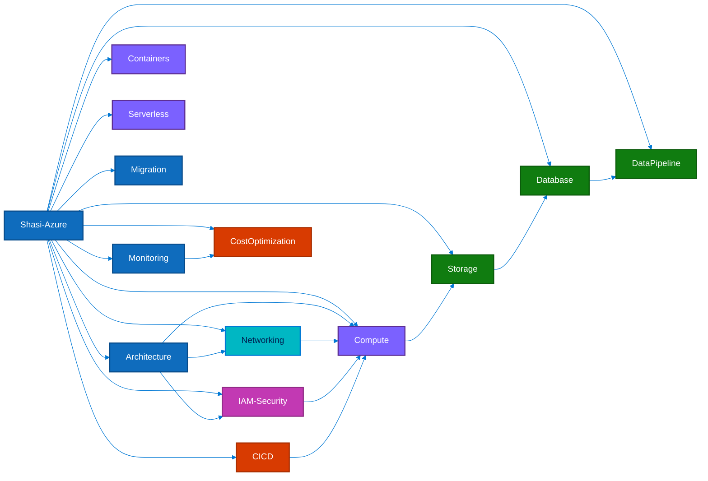
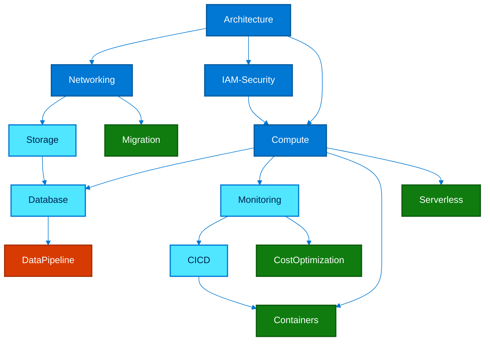

<div align="center">
<pre>
┌──────────────────────────────────────────────────────────────────────┐
│                                                                      │
│   ____  _               _        _                                   │
│  / ___|| |__   __ _ ___(_)      / \    _____   _ _ __ ___           │
│  \___ \| '_ \ / _` / __| |____ / _ \  |_  / | | | '__/ _ \          │
│   ___) | | | | (_| \__ \ |____/ ___ \  / /| |_| | | |  __/          │
│  |____/|_| |_|\__,_|___/_|   /_/   \_\/___|\__,_|_|  \___|          │
│                                                                      │
│         Comprehensive Azure Guide  —  Basic to Advanced              │
│                                                                      │
├──────────────────────────────────────────────────────────────────────┤
│                                                                      │
│   Provider : Microsoft Azure         Region  : Global                │
│   Services : Compute, Network, DB    Modules : 13+                   │
│                                                                      │
│   Last login: Tue Jun 3 11:19:46 2025 from github.com/ShasidharReddy │
│                                                                      │
├──────────────────────────────────────────────────────────────────────┤
│                                                                      │
│   admin@shasi-azure:~$ az account show                               │
│                                                                      │
│   Welcome to Shasi-Azure!                                            │
│   Your complete Azure learning environment.                          │
│                                                                      │
│   Type 'ls' to explore modules. Happy learning!                      │
│                                                                      │
└──────────────────────────────────────────────────────────────────────┘
</pre>
</div>

# ☁️ Shasi-Azure — Comprehensive Guide (Basic → Advanced)

Shasi-Azure is a curated collection of Azure command references, architecture diagrams, scripts, and step-by-step guides covering core Azure services from basics through advanced scenarios. Organized by topic — use this as a practical quick reference while working on Azure projects.

---

## Animated Module Map



| Category | Modules |
|----------|---------|
| core | Architecture, Monitoring, Migration |
| compute | Compute, Containers, Serverless |
| network | Networking |
| security | IAM-Security |
| data | Storage, Database, DataPipeline |
| devops | CICD, CostOptimization |

---

## 📁 Enhanced Directory Structure

| Directory | Description | Focus Areas |
|-----------|-------------|-------------|
| [`Architecture/`](./Architecture/) | 🔷 Central visual reference with Azure service maps, workload patterns, and platform diagrams. | Regions, landing zones, service decision guides, DR, reference architectures |
| [`Networking/`](./Networking/) | Network design and traffic engineering guide for secure and scalable Azure connectivity. | VNet, NSG, Firewall, VPN, ExpressRoute, Front Door, Private Link |
| [`IAM-Security/`](./IAM-Security/) | Identity, governance, and security operations handbook for Azure environments. | Entra ID, RBAC, PIM, Key Vault, Defender, Sentinel, Policy |
| [`Compute/`](./Compute/) | Practical field guide for selecting, provisioning, and operating Azure compute services. | VMs, VMSS, App Service, disks, availability, Bastion, Batch |
| [`Storage/`](./Storage/) | Storage platform reference covering performance, replication, protection, and transfer options. | Blob, Files, ADLS Gen2, disks, backup, ASR, Data Box |
| [`Database/`](./Database/) | Database and analytics decision guide for transactional, cache, and analytical workloads. | Azure SQL, Cosmos DB, PostgreSQL, MySQL, Redis, Synapse, DMS |
| [`Monitoring/`](./Monitoring/) | Observability guide for telemetry collection, alerting, dashboards, and incident response. | Azure Monitor, Log Analytics, App Insights, Grafana, Prometheus |
| [`DataPipeline/`](./DataPipeline/) | Data engineering and analytics guide for batch, stream, lakehouse, and BI patterns. | Data Factory, Synapse, Databricks, Event Hubs, Service Bus, Purview |
| [`CostOptimization/`](./CostOptimization/) | FinOps-oriented playbook for cost analysis, commercial optimization, and governance. | Reservations, Savings Plans, rightsizing, budgets, Advisor, tagging |
| [`Serverless/`](./Serverless/) | Event-driven application guide for serverless integration and API patterns. | Functions, Logic Apps, Event Grid, APIM, Container Apps, SWA |
| [`Containers/`](./Containers/) | Container platform reference for Kubernetes, serverless containers, and registry workflows. | AKS, ACA, ACI, ACR, ARO, service mesh, KEDA |
| [`Migration/`](./Migration/) | Migration handbook for assessment, landing zones, replication, and cutover. | Azure Migrate, DMS, Site Recovery, Data Box, AWS/GCP mapping |
| [`CICD/`](./CICD/) | Delivery automation guide for Azure-native and GitHub-based deployment workflows. | Azure DevOps, Pipelines, Bicep, ARM, Terraform, GitHub Actions |

---

## 🚀 Quick Start

### Prerequisites

- [Azure CLI](https://learn.microsoft.com/en-us/cli/azure/install-azure-cli) installed and configured
- An Azure subscription:
  ```bash
  az login
  az account set --subscription "YOUR_SUBSCRIPTION_ID"
  az account show
  ```

### Recommended Reading Order

1. Start with [`Architecture/`](./Architecture/) for a visual overview of Azure services and workload patterns.
2. Move into [`Networking/`](./Networking/) and [`IAM-Security/`](./IAM-Security/) to build the platform foundation.
3. Continue with [`Compute/`](./Compute/), [`Storage/`](./Storage/), and [`Database/`](./Database/) for core runtime services.
4. Add observability through [`Monitoring/`](./Monitoring/) and automation with [`CICD/`](./CICD/).
5. Finish with specialized tracks like [`Containers/`](./Containers/), [`Serverless/`](./Serverless/), [`DataPipeline/`](./DataPipeline/), [`Migration/`](./Migration/), and [`CostOptimization/`](./CostOptimization/).

---

## Learning Path Diagram



| Difficulty | Topics |
|------------|--------|
| Foundation | Architecture, Networking, IAM-Security, Compute |
| Intermediate | Storage, Database, Monitoring, CICD |
| Advanced | Containers, Serverless, Migration, CostOptimization |
| Expert | DataPipeline |

---

## Quick Links

| Tool / Resource | Purpose | Link |
|-----------------|---------|------|
| Azure Portal | Manage Azure subscriptions, resources, and dashboards | [portal.azure.com](https://portal.azure.com/) |
| Azure CLI Reference | Command reference for `az` workflows | [learn.microsoft.com/cli/azure](https://learn.microsoft.com/en-us/cli/azure/) |
| Azure Pricing Calculator | Estimate service costs before deployment | [azure.microsoft.com/pricing/calculator](https://azure.microsoft.com/pricing/calculator/) |
| Azure Status | Review current platform incidents and service health | [status.azure.com](https://status.azure.com/) |
| Azure Updates | Track new features and releases across Azure services | [azure.microsoft.com/updates](https://azure.microsoft.com/updates/) |
| Azure Architecture Center | Reference architectures and design guidance | [learn.microsoft.com/azure/architecture](https://learn.microsoft.com/en-us/azure/architecture/) |
| Well-Architected Framework | Design guidance for reliability, security, cost, operations, and performance | [learn.microsoft.com/azure/well-architected](https://learn.microsoft.com/en-us/azure/well-architected/) |
| Microsoft Learn for Azure | Interactive Azure training paths and labs | [learn.microsoft.com/training/azure](https://learn.microsoft.com/en-us/training/azure/) |
| Azure Resource Graph Explorer | Query Azure resources at scale | [learn.microsoft.com/azure/governance/resource-graph/](https://learn.microsoft.com/en-us/azure/governance/resource-graph/) |

---

## Content Stats

| Metric | Value | Notes |
|--------|-------|-------|
| Topic modules | 13 | First-level Azure domains in this repo |
| README guides | 14 | Root guide plus topic-specific READMEs |
| Mermaid diagrams | 229 | Includes workflow snapshots, maps, and learning diagrams |
| CLI code blocks | 300 | Azure CLI and shell examples across the guides |
| Coverage categories | 6 | core, compute, network, security, data, devops |

---

## 🏷️ Topics Covered

`Virtual Machines` · `VMSS` · `App Service` · `VNet` · `NSG` · `Azure Firewall` · `Entra ID` · `RBAC` · `Key Vault` · `Blob Storage` · `ADLS Gen2` · `Azure SQL` · `Cosmos DB` · `Azure Monitor` · `Log Analytics` · `Application Insights` · `AKS` · `Container Apps` · `Azure Functions` · `Logic Apps` · `Event Grid` · `Data Factory` · `Synapse Analytics` · `Databricks` · `Event Hubs` · `Service Bus` · `Azure DevOps` · `Bicep` · `ARM Templates` · `Terraform` · `ExpressRoute` · `Front Door` · `Application Gateway` · `Traffic Manager` · `Azure Migrate` · `Site Recovery` · `Cost Management` · `Defender for Cloud` · `Sentinel` · `Policy`

---

## 🔷 Visual Diagrams

This repo includes **Mermaid flow diagrams** that render directly on GitHub — no images needed. See [`Architecture/`](./Architecture/) for:

- Azure Global Infrastructure (Regions, AZs, Region Pairs, Edge Zones)
- Compute decision tree (VMs vs App Service vs AKS vs Functions vs Container Apps)
- VM lifecycle state diagram
- VNet multi-AZ architecture with Azure Firewall
- Application Gateway / Front Door request flow
- Azure Storage account tiers and lifecycle
- AKS cluster architecture
- Azure Functions event-driven sequence flow
- Azure SQL HA and Cosmos DB global distribution
- Entra ID / RBAC hierarchy
- Azure DevOps CI/CD pipeline
- 3-tier web application reference architecture
- Data lake architecture (ADLS Gen2 → Synapse → Power BI)
- Disaster recovery with Site Recovery
- Well-Architected Framework pillars
- On-premises and cross-cloud migration flows

---

## 📝 Notes

- All guides include practical `az` CLI commands — replace placeholder values before running.
- Each guide includes Mermaid diagrams, best practices, and comparison tables.
- Guides are for **learning and reference** purposes — review before running in production.

---

## 📚 Official Documentation
- [Azure Virtual Machines (Compute)](https://learn.microsoft.com/en-us/azure/virtual-machines/)
- [Azure Virtual Network (Networking)](https://learn.microsoft.com/en-us/azure/virtual-network/)
- [Azure Storage](https://learn.microsoft.com/en-us/azure/storage/)
- [Azure Functions (Serverless)](https://learn.microsoft.com/en-us/azure/azure-functions/)
- [Azure Kubernetes Service (AKS)](https://learn.microsoft.com/en-us/azure/aks/)
- [Azure Load Balancer](https://learn.microsoft.com/en-us/azure/load-balancer/)
- [Azure App Service](https://learn.microsoft.com/en-us/azure/app-service/)
- [Azure Data Factory](https://learn.microsoft.com/en-us/azure/data-factory/)
- [Azure Monitor](https://learn.microsoft.com/en-us/azure/azure-monitor/)
- [Terraform on Azure](https://learn.microsoft.com/en-us/azure/terraform/)
- [Azure Architecture Center](https://learn.microsoft.com/en-us/azure/architecture/)
- [Azure RBAC (IAM/Security)](https://learn.microsoft.com/en-us/azure/role-based-access-control/)
- [Azure Site Recovery (Disaster Recovery)](https://learn.microsoft.com/en-us/azure/site-recovery/)
- [Azure Database Migration Service](https://learn.microsoft.com/en-us/azure/dms/)
