# Azure Serverless

> Comprehensive Azure serverless reference with Mermaid diagrams, Azure CLI examples, `func` CLI examples, decision guidance, and best practices.

## Standalone Deep Dive

- [Azure Functions Deep Dive](./azure-functions-deep-dive.md) — dedicated guide for triggers, bindings, hosting plans, Durable Functions, Event Grid, Logic Apps comparison, and API Management integration.

<!-- workflow-diagram:start -->
## Workflow Snapshot

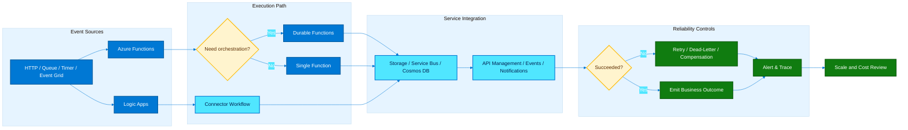

This event-driven workflow shows how Azure serverless services route triggers, coordinate execution, integrate with downstream systems, and recover from failures.
<!-- workflow-diagram:end -->

## Table of Contents
1. [Overview](#overview)
2. [Azure Functions](#azure-functions)
3. [Azure Logic Apps](#azure-logic-apps)
4. [Azure Event Grid](#azure-event-grid)
5. [Azure API Management (APIM)](#azure-api-management-apim)
6. [Azure Container Apps](#azure-container-apps)
7. [Azure Static Web Apps](#azure-static-web-apps)
8. [Azure SignalR Service](#azure-signalr-service)
9. [Azure Notification Hubs](#azure-notification-hubs)
10. [Serverless Comparison](#serverless-comparison)
11. [Serverless Patterns](#serverless-patterns)
12. [Durable Functions Deep Dive](#durable-functions-deep-dive)
13. [Reference Commands](#reference-commands)
14. [Operational Checklist](#operational-checklist)
15. [Appendix](#appendix)

---

## Overview
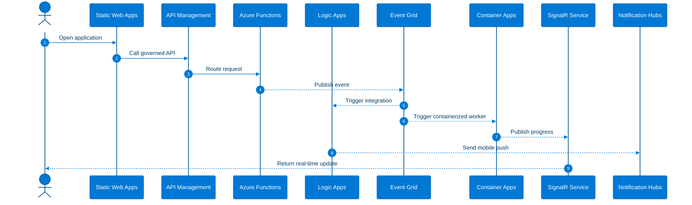
### Explanation
- Azure serverless is a portfolio of services with different execution models.
- Functions is code-first compute, Logic Apps is workflow-first integration, and Event Grid is reactive routing.
- API Management governs APIs, Container Apps runs serverless containers, and Static Web Apps hosts frontend-first applications.
- SignalR Service handles real-time active client messaging and Notification Hubs handles cross-platform device push.
- The best Azure serverless architectures combine these services intentionally rather than forcing every workload into a single runtime.
- Identity, observability, contract versioning, and network design matter as much as service selection.
### Azure CLI / func CLI commands
```bash
az login
az account set --subscription "<subscription-id-or-name>"
az group create --name rg-serverless-core --location eastus
az provider show --namespace Microsoft.Web --query registrationState -o tsv
az provider show --namespace Microsoft.EventGrid --query registrationState -o tsv
az provider show --namespace Microsoft.App --query registrationState -o tsv
az provider show --namespace Microsoft.ApiManagement --query registrationState -o tsv
az provider show --namespace Microsoft.SignalRService --query registrationState -o tsv
az provider show --namespace Microsoft.NotificationHubs --query registrationState -o tsv
```
### Best practices
- Use managed identities wherever possible.
- Separate environments and security boundaries cleanly.
- Use Application Insights and Log Analytics across the platform.
- Choose each service based on the dominant workload shape.
- Document quotas, regional support, and cost assumptions.

---

## Azure Functions
Azure Functions is Azure's code-first serverless compute platform for APIs, event handlers, workers, schedules, and Durable workflows.

### Hosting plans (Consumption, Premium, Dedicated, Flex Consumption)
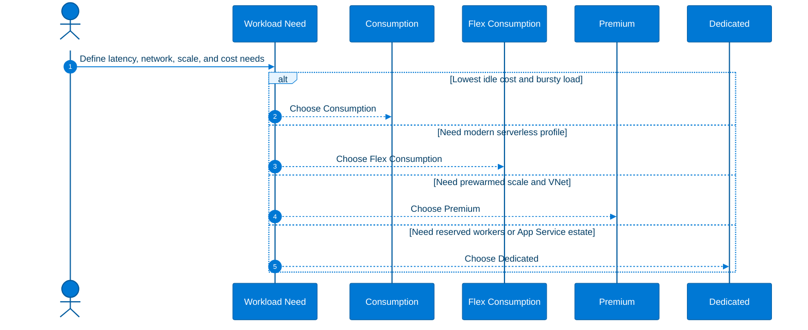
#### Explanation
- Consumption provides pay-per-execution scale and is suited to bursty workloads that tolerate some cold start behavior.
- Flex Consumption is the newer serverless option for modern Azure Functions scenarios that need more deployment and scaling flexibility.
- Premium adds prewarmed workers, private networking support, and stronger suitability for enterprise workloads and Durable orchestration.
- Dedicated runs Functions on an App Service plan when reserved capacity or always-on hosting is already justified.
- Plan choice affects latency, networking, timeout behavior, available scale semantics, and cost profile.
- Different workloads should often live in separate function apps when their scale and security boundaries differ.
#### Azure CLI / func CLI commands
```bash
RG=rg-func-demo
LOC=eastus
ST=stfuncdemoeastus001
PLAN=asp-func-dedicated
APP=func-demo-eastus-001
az group create --name $RG --location $LOC
az storage account create --name $ST --resource-group $RG --location $LOC --sku Standard_LRS
az functionapp create --resource-group $RG --consumption-plan-location $LOC --runtime dotnet-isolated --runtime-version 8 --functions-version 4 --name $APP --storage-account $ST --os-type Linux
az functionapp plan create --name plan-func-premium --resource-group $RG --location $LOC --sku EP1 --is-linux
az functionapp create --resource-group $RG --plan plan-func-premium --runtime python --runtime-version 3.11 --functions-version 4 --name ${APP}prem --storage-account $ST --os-type Linux
az appservice plan create --name $PLAN --resource-group $RG --location $LOC --sku P1V3 --is-linux
az functionapp create --resource-group $RG --plan $PLAN --runtime node --runtime-version 20 --functions-version 4 --name ${APP}ded --storage-account $ST --os-type Linux
az functionapp list-flexconsumption-locations -o table
az functionapp list-runtimes --os linux -o table
func init func-local-demo --worker-runtime node --model V4
func start
```
#### Best practices
- Use Consumption or Flex Consumption for bursty traffic.
- Use Premium for VNet integration and lower cold start impact.
- Use Dedicated only when reserved compute is intentional.
- Validate regional support before platform standardization.
- Separate apps by security boundary and scaling profile.

### Triggers & bindings (HTTP, Timer, Blob, Queue, Event Hub, Cosmos DB, Service Bus)
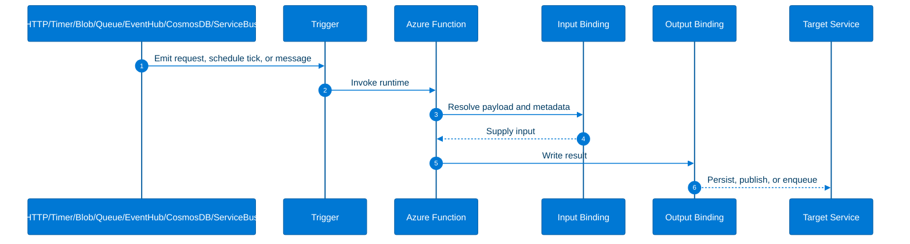
#### Explanation
- HTTP triggers are for APIs, webhooks, and callbacks.
- Timer triggers are for scheduled jobs and recurring automation.
- Blob triggers are for file-driven ingestion and transformation.
- Queue triggers support decoupled background processing with retry-friendly behavior.
- Event Hub triggers handle streaming telemetry and partitioned event ingestion.
- Cosmos DB triggers react to change feed updates and are ideal for projections and sync flows.
- Service Bus triggers support enterprise messaging with queues, topics, sessions, dead-lettering, and richer delivery semantics.
- Bindings reduce integration boilerplate, but SDKs remain useful for advanced scenarios and precise control.
#### Azure CLI / func CLI commands
```bash
func init serverless-triggers --worker-runtime dotnet-isolated
cd serverless-triggers
func new --template "HTTP trigger" --name HttpOrders
func new --template "Timer trigger" --name NightlyReconcile
func new --template "Azure Blob Storage trigger" --name BlobIngest
func new --template "Azure Queue Storage trigger" --name QueueWorker
func new --template "Azure Event Hub trigger" --name TelemetryIngest
func new --template "Azure Cosmos DB trigger" --name CustomerProjection
func new --template "Azure Service Bus Queue trigger" --name BillingWorker
func azure functionapp publish func-demo-eastus-001
az storage queue create --name workitems --account-name $ST
az storage message put --queue-name workitems --content '{"job":"resize-image","blob":"incoming/a.jpg"}' --account-name $ST
az servicebus namespace create --name sb-serverless-demo-001 --resource-group $RG --location $LOC --sku Standard
az servicebus queue create --resource-group $RG --namespace-name sb-serverless-demo-001 --name orders
az eventhubs namespace create --name evhnsserverless001 --resource-group $RG --location $LOC --sku Standard
az eventhubs eventhub create --resource-group $RG --namespace-name evhnsserverless001 --name telemetry
az cosmosdb create --name cosmos-serverless-demo-001 --resource-group $RG
```
#### Best practices
- Keep functions small and idempotent.
- Use Service Bus for advanced messaging semantics.
- Model poison handling and retries explicitly.
- Avoid long synchronous HTTP requests for heavy work.
- Log message IDs and correlation IDs for every trigger.

### Durable Functions (orchestrations, entity functions, fan-out/fan-in)
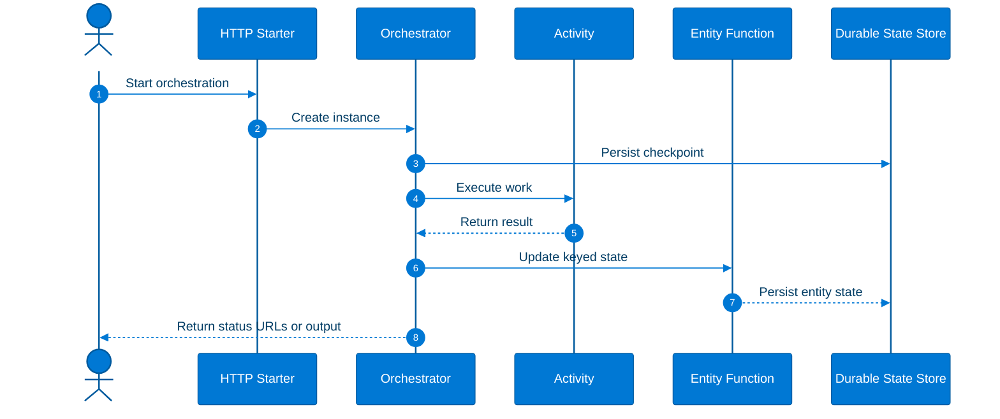
#### Explanation
- Orchestrator functions coordinate stateful workflows and replay from durable history.
- Activity functions perform the actual side-effecting work such as SDK calls, transformations, and persistence.
- Entity functions provide lightweight durable objects keyed by identity for counters, reservations, and aggregates.
- Fan-out/fan-in is a first-class pattern where the orchestrator dispatches parallel activities and waits for all of them before aggregation.
- Durable Functions is ideal for approvals, long-running jobs, provisioning workflows, and business process coordination.
- Deterministic orchestrator code is mandatory because the runtime replays execution history.
#### Azure CLI / func CLI commands
```bash
func init durable-demo --worker-runtime node --language javascript
cd durable-demo
func new --template "Durable Functions orchestrator" --name OrderOrchestrator
func start
curl -X POST http://localhost:7071/api/orchestrators/OrderOrchestrator
func azure functionapp publish func-demo-eastus-001
az functionapp config appsettings list --name func-demo-eastus-001 --resource-group $RG -o table
az functionapp identity assign --name func-demo-eastus-001 --resource-group $RG
```
#### Best practices
- Keep orchestrator code deterministic.
- Put all I/O into activity functions.
- Use entities for small keyed state, not bulk datasets.
- Track orchestration instance IDs in logs and downstream systems.
- Use Premium when orchestration latency and load justify it.

### Durable Functions patterns
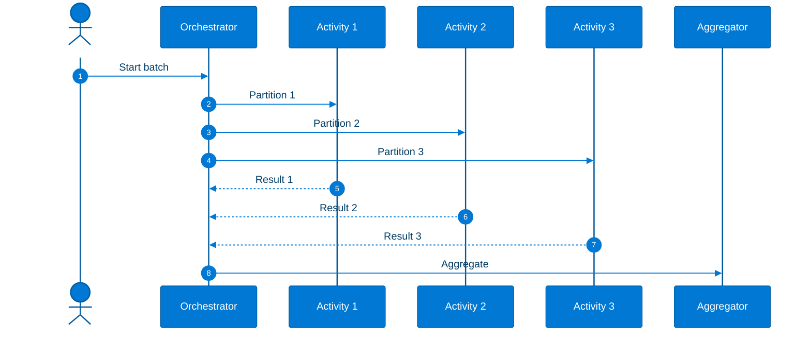
#### Explanation
- Durable patterns include function chaining, fan-out/fan-in, async HTTP APIs, monitor workflows, saga compensation, and human interaction.
- Function chaining models strict sequencing.
- Async HTTP APIs return 202 Accepted and expose status URLs while work continues.
- Monitor patterns wake periodically until a condition is met or a timeout expires.
- Human interaction patterns wait for external approval or rejection events.
- Saga patterns use compensating activities to undo earlier actions when later steps fail.
#### Azure CLI / func CLI commands
```bash
func init durable-patterns --worker-runtime python
cd durable-patterns
func new --template "Durable Functions HTTP starter" --name HttpStart
func new --template "Durable Functions activity" --name ValidateOrder
func new --template "Durable Functions activity" --name ChargeCard
func new --template "Durable Functions activity" --name ReserveInventory
func new --template "Durable Functions activity" --name SendConfirmation
func start
curl -X POST http://localhost:7071/api/orchestrators/OrderProcessing
curl http://localhost:7071/runtime/webhooks/durabletask/instances/<instanceId>?taskHub=DurableFunctionsHub
```
#### Best practices
- Use async HTTP for user-facing long-running jobs.
- Cap fan-out concurrency to match downstream limits.
- Model compensation for distributed business actions.
- Use timers for reminders and deadlines.
- Document orchestration contracts and instance lifecycle.

---

## Azure Logic Apps
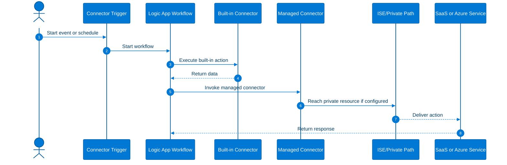
### Explanation
- Logic Apps Consumption is multi-tenant and billed per action execution.
- Logic Apps Standard is single-tenant, supports multiple workflows in one app, and is better aligned to private networking and local development.
- Logic Apps offers 400+ connectors for SaaS, databases, enterprise systems, and Azure services.
- Built-in connectors are typically lower latency and better aligned to the Standard runtime; managed connectors offer broad service coverage.
- ISE is relevant for historical isolated Consumption deployments, while many current isolated designs favor Standard.
- Stateful workflows persist history and are ideal for long-running auditable processes; stateless workflows favor low latency and high throughput.
### Azure CLI / func CLI commands
```bash
az logic workflow create --resource-group $RG --location $LOC --name la-consumption-demo
az logic workflow list --resource-group $RG -o table
az logic workflow show --resource-group $RG --name la-consumption-demo
az extension list -o table
az logic -h
```
### Best practices
- Use Standard for private, multi-workflow, or lower-latency needs.
- Use Consumption for lightweight event-driven integrations.
- Choose stateful versus stateless intentionally.
- Protect connector credentials with managed identity and Key Vault where possible.
- Use Logic Apps for workflow clarity and connectors rather than heavy custom code.

---

## Azure Event Grid
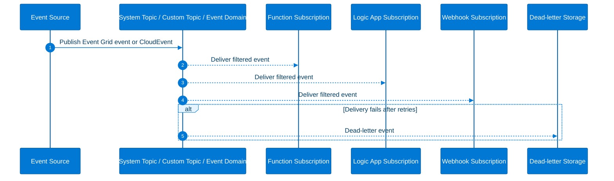
### Explanation
- System topics expose Azure-native events without requiring you to manage the topic lifecycle.
- Custom topics are application-owned endpoints for your own event publishers.
- Event domains help large multi-tenant event publishing scenarios.
- Event subscriptions define destination, filters, schema, retries, and dead-letter behavior.
- Filtering supports subject prefixes, subject suffixes, event types, and advanced filters.
- CloudEvents support makes Event Grid compatible with a widely used standard schema.
### Azure CLI / func CLI commands
```bash
az eventgrid topic create --name eg-topic-demo --resource-group $RG --location $LOC
az eventgrid topic show --name eg-topic-demo --resource-group $RG --query endpoint -o tsv
az eventgrid topic key list --name eg-topic-demo --resource-group $RG
az storage account create --name stegdldemo001 --resource-group $RG --location $LOC --sku Standard_LRS
az eventgrid event-subscription create --name eg-sub-orders --source-resource-id $(az eventgrid topic show --name eg-topic-demo --resource-group $RG --query id -o tsv) --endpoint https://example.azurewebsites.net/runtime/webhooks/eventgrid?functionName=ProcessOrder --included-event-types Contoso.Items.Created Contoso.Items.Updated --subject-begins-with /tenants/a/ --subject-ends-with /orders
az eventgrid event-subscription create --name eg-sub-cloudevents --source-resource-id $(az eventgrid topic show --name eg-topic-demo --resource-group $RG --query id -o tsv) --endpoint https://example.com/api/events --event-delivery-schema cloudeventschemav1_0
az eventgrid event-subscription list --source-resource-id $(az eventgrid topic show --name eg-topic-demo --resource-group $RG --query id -o tsv) -o table
```
### Best practices
- Publish business facts, not chatty internal details.
- Use broker-side filters aggressively.
- Always configure dead-lettering for important subscribers.
- Version event payloads and include correlation metadata.
- Use CloudEvents when portability matters.

---

## Azure API Management (APIM)
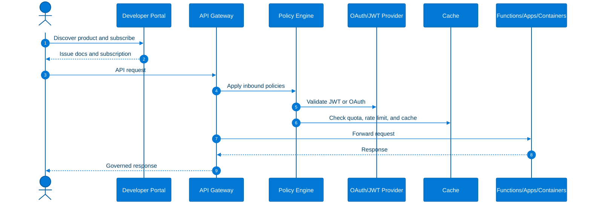
### Explanation
- APIM tiers include Consumption, Developer, Basic, Standard, and Premium.
- Policies provide transformation, validation, routing, quota, caching, security, and mediation without backend code changes.
- Products package APIs for consumer groups; subscriptions govern access and keys.
- OAuth and JWT validation should normally happen at the gateway edge.
- Caching reduces backend load for stable read-heavy responses.
- The developer portal improves discoverability, onboarding, and testing.
### Azure CLI / func CLI commands
```bash
az apim create --name apim-serverless-demo --resource-group $RG --location $LOC --publisher-email admin@contoso.com --publisher-name Contoso --sku-name Consumption
az apim list --resource-group $RG -o table
az apim api import --resource-group $RG --service-name apim-serverless-demo --path orders --api-id orders-api --specification-format OpenApi --specification-path ./openapi/orders.json
az apim product create --resource-group $RG --service-name apim-serverless-demo --product-id starter --product-name "Starter Product" --subscription-required true --approval-required false --state published
az apim product api add --resource-group $RG --service-name apim-serverless-demo --product-id starter --api-id orders-api
az apim api show --resource-group $RG --service-name apim-serverless-demo --api-id orders-api
```
### Sample policies
```xml
<validate-jwt header-name="Authorization" failed-validation-httpcode="401" failed-validation-error-message="Unauthorized">
  <openid-config url="https://login.microsoftonline.com/<tenant-id>/v2.0/.well-known/openid-configuration" />
  <required-claims>
    <claim name="aud">
      <value>api://orders-api</value>
    </claim>
  </required-claims>
</validate-jwt>

<rate-limit-by-key calls="100" renewal-period="60" counter-key="@(context.Request.IpAddress)" />

<cache-lookup vary-by-developer="false" vary-by-developer-groups="false" />
<cache-store duration="60" />
```
### Best practices
- Put APIM in front of externally exposed APIs.
- Use validate-jwt rather than duplicating token validation in every backend.
- Apply rate limits and quotas based on product design and backend safety.
- Use Developer only for non-production.
- Use Premium for multi-region and enterprise networking scenarios.

---

## Azure Container Apps
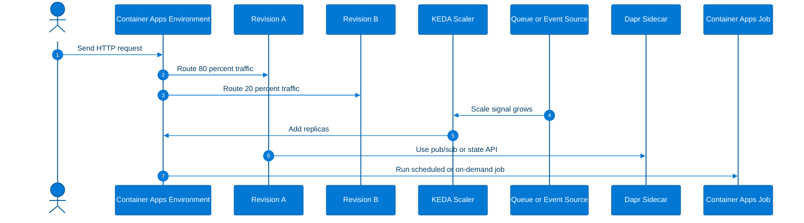
### Explanation
- A Container Apps environment is the hosting boundary for one or more apps and jobs.
- Container Apps runs OCI images with serverless ingress, secrets, identities, revisions, and KEDA-based scale.
- Revisions are immutable deployment versions that support controlled rollout and rollback.
- Traffic splitting enables canary and blue/green releases.
- KEDA supports scaling from HTTP, queues, messaging systems, cron, and custom event sources.
- Dapr integration adds service invocation, pub/sub, state stores, bindings, and secrets abstractions.
- Jobs are ideal for scheduled, event-driven, or one-off finite execution.
### Azure CLI / func CLI commands
```bash
az extension add --name containerapp --upgrade
az monitor log-analytics workspace create --resource-group $RG --workspace-name law-serverless-demo
LAW_ID=$(az monitor log-analytics workspace show --resource-group $RG --workspace-name law-serverless-demo --query customerId -o tsv)
LAW_KEY=$(az monitor log-analytics workspace get-shared-keys --resource-group $RG --workspace-name law-serverless-demo --query primarySharedKey -o tsv)
az containerapp env create --name cae-serverless-demo --resource-group $RG --location $LOC --logs-workspace-id $LAW_ID --logs-workspace-key $LAW_KEY
az containerapp create --name ca-orders-api --resource-group $RG --environment cae-serverless-demo --image mcr.microsoft.com/azuredocs/containerapps-helloworld:latest --target-port 80 --ingress external --min-replicas 0 --max-replicas 10
az containerapp revision set-mode --name ca-orders-api --resource-group $RG --mode multiple
az containerapp ingress traffic set --name ca-orders-api --resource-group $RG --revision-weight ca-orders-api--rev1=80 ca-orders-api--rev2=20
az containerapp job create --name caj-nightly-batch --resource-group $RG --environment cae-serverless-demo --image mcr.microsoft.com/k8se/quickstart-jobs:latest --trigger-type Schedule --cron-expression "0 0 * * *" --replica-timeout 1800 --replica-retry-limit 1 --parallelism 1 --replica-completion-count 1
```
### Best practices
- Use Container Apps for custom runtimes, containerized APIs, workers, and jobs.
- Use revisions and traffic splitting for safer rollout.
- Set min and max replicas intentionally.
- Align KEDA thresholds with downstream capacity.
- Use jobs for finite work instead of simulating jobs inside long-running services.

---

## Azure Static Web Apps
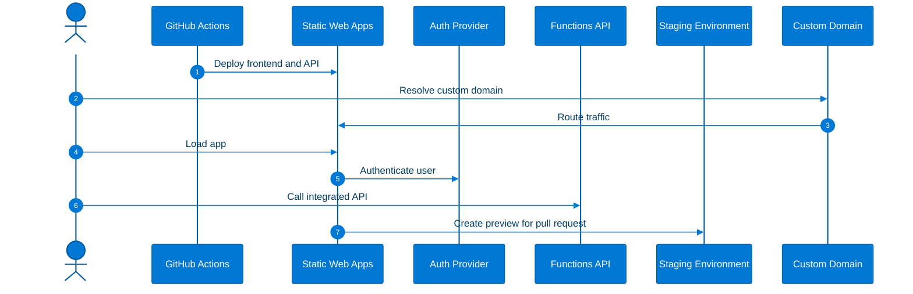
### Explanation
- Static Web Apps hosts static content and SPA frameworks with a globally distributed developer experience.
- It integrates naturally with Azure Functions for APIs.
- Authentication providers can be wired into the platform to simplify identity and route authorization.
- Custom domains and managed certificates are built into the platform experience.
- Staging environments provide preview URLs for pull requests.
- GitHub Actions integration is a primary deployment path for many teams.
### Azure CLI / func CLI commands
```bash
az staticwebapp create --name swa-serverless-demo --resource-group $RG --location $LOC --source https://github.com/<org>/<repo> --branch main --app-location "/" --output-location "dist" --login-with-github
az staticwebapp list --resource-group $RG -o table
az staticwebapp show --name swa-serverless-demo --resource-group $RG
az staticwebapp hostname set --name swa-serverless-demo --resource-group $RG --hostname app.contoso.com
```
### Example staticwebapp.config.json
```json
{
  "routes": [
    {
      "route": "/admin/*",
      "allowedRoles": ["administrator"]
    }
  ],
  "responseOverrides": {
    "401": {
      "redirect": "/.auth/login/aad",
      "statusCode": 302
    }
  },
  "navigationFallback": {
    "rewrite": "/index.html"
  }
}
```
### Best practices
- Use Static Web Apps for frontend-first systems.
- Keep secrets out of client code.
- Use pull-request preview environments for validation.
- Verify route authorization in every environment.
- Add APIM in front of APIs when broader governance is required.

---

## Azure SignalR Service
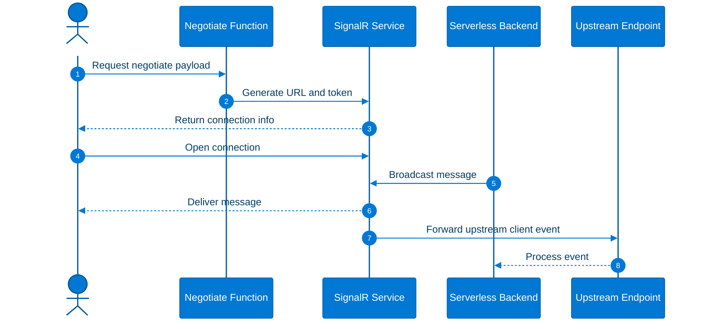
### Explanation
- Serverless mode lets clients connect directly to SignalR Service while functions or other backends perform negotiation and broadcasting.
- Real-time messaging is ideal for dashboards, progress reporting, collaborative UX, and operations views.
- Negotiation endpoints typically enforce user authorization and produce short-lived connection information.
- Upstream configuration forwards client-originated events to your backend endpoints.
- SignalR is optimized for active connections, not offline mobile push fan-out.
### Azure CLI / func CLI commands
```bash
az signalr create --name signalr-serverless-demo --resource-group $RG --location $LOC --sku Standard_S1 --service-mode Serverless
az signalr key list --name signalr-serverless-demo --resource-group $RG
az signalr show --name signalr-serverless-demo --resource-group $RG
```
### Best practices
- Authenticate negotiate endpoints when user identity matters.
- Use groups for efficient audience targeting.
- Keep messages small and purposeful.
- Protect upstream endpoints.
- Monitor connection counts and reconnect behavior.

---

## Azure Notification Hubs
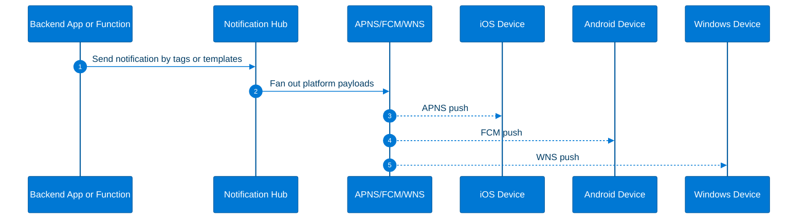
### Explanation
- Notification Hubs is Azure's large-scale push fan-out service for mobile and device platforms.
- It supports common platform notification systems including APNS, FCM, and WNS.
- Tags support audience segmentation by user, region, campaign, tenant, or business category.
- Templates let clients define rendering while the backend sends normalized payloads.
- Scheduled sends are typically orchestrated by surrounding workflow or scheduling logic.
- Notification Hubs complements SignalR rather than replacing it.
### Azure CLI / func CLI commands
```bash
az notification-hub namespace create --name nhns-serverless-demo --resource-group $RG --location $LOC
az notification-hub create --name nh-serverless-demo --namespace-name nhns-serverless-demo --resource-group $RG --location $LOC
az notification-hub list --namespace-name nhns-serverless-demo --resource-group $RG -o table
az notification-hub authorization-rule list --namespace-name nhns-serverless-demo --resource-group $RG --notification-hub-name nh-serverless-demo
```
### Best practices
- Use tags for scalable targeting.
- Use templates for multi-platform normalization.
- Protect and rotate PNS credentials.
- Clean up stale registrations.
- Use Notification Hubs for device push, not browser real-time sockets.

---

## Serverless Comparison
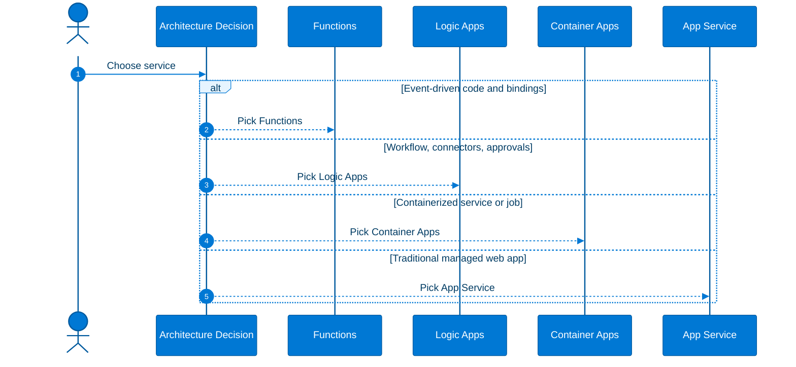
### Explanation
- Functions is strongest for event-driven code and lightweight APIs.
- Logic Apps is strongest for workflow-first integration and approvals.
- Container Apps is strongest for serverless containers, workers, and jobs.
- App Service is strongest for traditional managed web app hosting and steady-state applications.
### Azure CLI / func CLI commands
```bash
az functionapp list --resource-group $RG -o table
az logic workflow list --resource-group $RG -o table
az containerapp list --resource-group $RG -o table
az webapp list --resource-group $RG -o table
```
### Comparison table
| Service | Best fit | Strengths | Weaknesses | Typical scaling model | Ideal workloads |
|---|---|---|---|---|---|
| Azure Functions | Event-driven code execution | Triggers, bindings, Durable Functions, rapid development | Cold starts on some plans, app partitioning matters | Event-driven elastic scale | APIs, jobs, event handlers |
| Azure Logic Apps | Workflow and integration | 400+ connectors, visual orchestration, approvals | Less suitable for heavy custom code | Action/workflow driven | Integration, automation, approvals |
| Azure Container Apps | Serverless containers | Any container image, revisions, KEDA, jobs, Dapr | Requires container engineering discipline | HTTP and event/KEDA scale | Microservices, workers, custom runtimes |
| Azure App Service | Managed app hosting | Mature hosting platform, deployment slots, framework support | Not inherently serverless billing | Plan-based scale | Traditional web apps and APIs |
### Best practices
- Do not force every workload into one platform.
- Select the service that matches the dominant execution model.
- Use shared identity, telemetry, and API governance across all choices.
- Document platform selection criteria.

---

## Serverless Patterns
Azure serverless architectures are built from repeatable patterns that can be composed across services.

### Event-driven
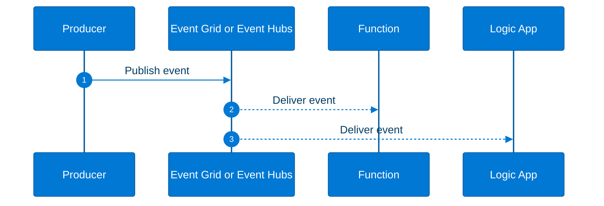
#### Explanation
- Use when multiple independent consumers should react asynchronously to a business event.
- Event-driven patterns improve decoupling, flexibility, and parallelism.
- Expect eventual consistency and duplicates.
#### Azure CLI / func CLI commands
```bash
az eventgrid topic list --resource-group $RG -o table
az eventhubs namespace list --resource-group $RG -o table
```
#### Best practices
- Design idempotent consumers.
- Use retries and dead-lettering.
- Version event contracts.

### Choreography
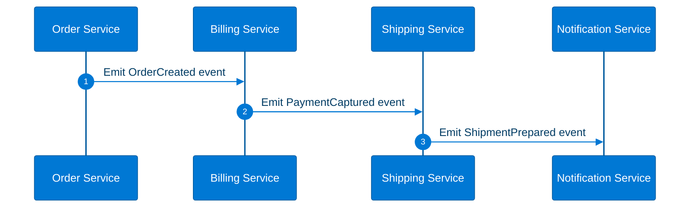
#### Explanation
- Choreography coordinates services through shared events instead of a central controller.
- It works well when each service owns a clear business capability.
- Observability is critical because flow is distributed.
#### Azure CLI / func CLI commands
```bash
az eventgrid event-subscription list --source-resource-id $(az eventgrid topic show --name eg-topic-demo --resource-group $RG --query id -o tsv) -o table
```
#### Best practices
- Keep contracts explicit.
- Avoid hidden coupling.
- Use correlation IDs.

### Saga
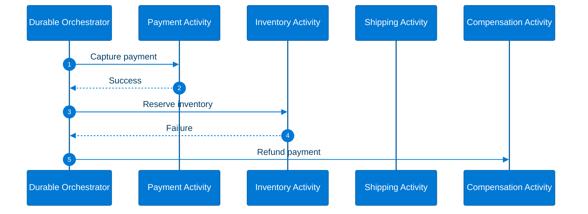
#### Explanation
- Saga coordinates distributed transactions using forward steps plus compensations.
- It is the preferred pattern when atomic cross-service commits are not feasible.
- Compensation logic must be explicit and auditable.
#### Azure CLI / func CLI commands
```bash
func new --template "Durable Functions orchestrator" --name SagaOrchestrator
func new --template "Durable Functions activity" --name RefundPayment
```
#### Best practices
- Define compensation for each reversible step.
- Make compensation idempotent.
- Persist business correlation IDs.

### Async HTTP
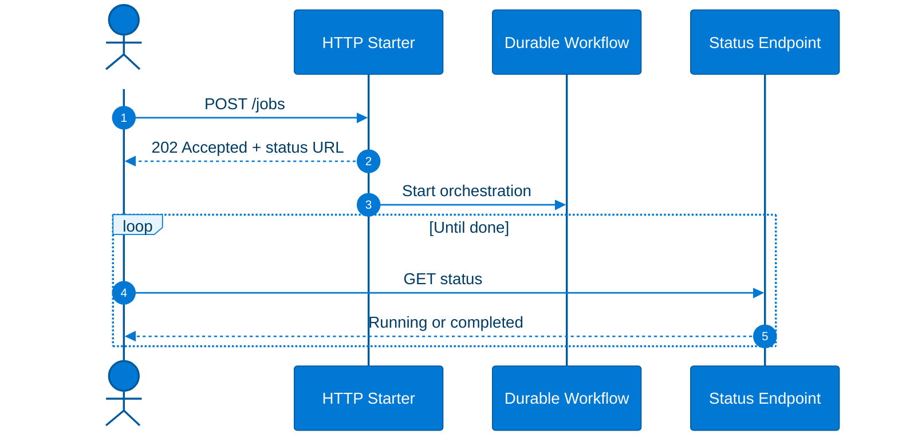
#### Explanation
- Use Async HTTP when a request starts long-running work and the client should not hold the connection open.
- This is the standard pattern for imports, report generation, and expensive processing.
- It pairs naturally with Durable Functions.
#### Azure CLI / func CLI commands
```bash
curl -X POST https://<func-app>.azurewebsites.net/api/orchestrators/LongJob
```
#### Best practices
- Return 202 with status URLs.
- Include correlation IDs.
- Use push completion signals when useful.

### Fan-out / fan-in
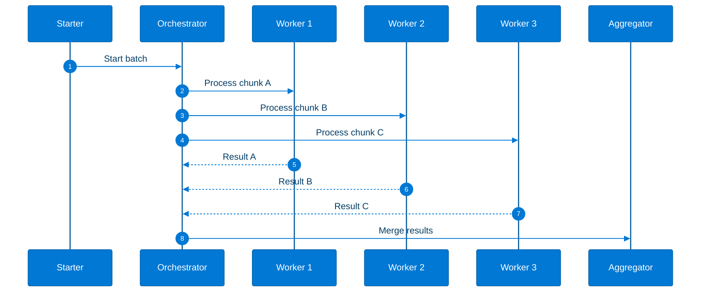
#### Explanation
- Fan-out / fan-in is ideal for partitionable work that still needs one final business result.
- Use it for data processing, media pipelines, and parallel validation.
- Aggregation should clearly represent partial failures and success counts.
#### Azure CLI / func CLI commands
```bash
az storage queue create --name batch-jobs --account-name $ST
func new --template "Azure Queue Storage trigger" --name ChunkWorker
```
#### Best practices
- Partition work evenly.
- Cap concurrency to protect downstream services.
- Aggregate errors clearly.

### Human interaction
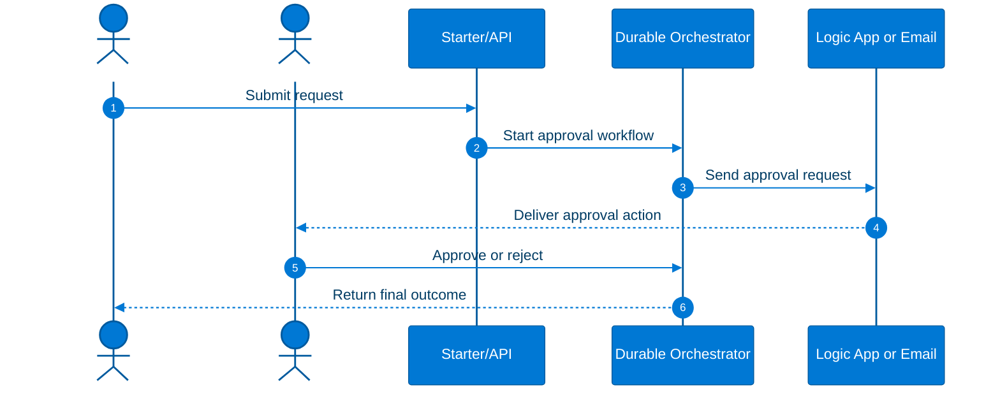
#### Explanation
- Human interaction patterns combine durable state, external events, timers, and reminders.
- They are ideal for approvals, access requests, and exception handling.
- Long-lived waiting is a feature here, not a problem.
#### Azure CLI / func CLI commands
```bash
func new --template "Durable Functions HTTP starter" --name ApprovalStart
az logic workflow list --resource-group $RG -o table
```
#### Best practices
- Model timeout and escalation paths.
- Audit who approved and when.
- Do not block synchronous requests waiting for humans.

---

## Durable Functions Deep Dive
The following subsections go deeper into the key Durable Functions patterns requested for this guide.

### Function chaining
```mermaid
%%{init: {
  "theme": "base",
  "themeVariables": {
    "primaryColor": "#0078D4",
    "primaryTextColor": "#FFFFFF",
    "primaryBorderColor": "#005A9E",
    "lineColor": "#0078D4",
    "secondaryColor": "#50E6FF",
    "tertiaryColor": "#E6F4FF",
    "actorBorder": "#005A9E",
    "actorBkg": "#0078D4",
    "actorTextColor": "#FFFFFF",
    "signalColor": "#0078D4",
    "signalTextColor": "#003C64",
    "labelBoxBkgColor": "#E6F4FF",
    "labelBoxBorderColor": "#0078D4",
    "labelTextColor": "#003C64",
    "loopTextColor": "#003C64",
    "noteBkgColor": "#F3F9FD",
    "noteBorderColor": "#50E6FF",
    "noteTextColor": "#003C64",
    "activationBorderColor": "#005A9E",
    "activationBkgColor": "#B3DAF7",
    "sequenceNumberColor": "#FFFFFF"
  }
}}%%
sequenceDiagram
    autonumber
    participant Orch as Orchestrator
    participant Step1 as Validate Input
    participant Step2 as Enrich Data
    participant Step3 as Persist Record
    participant Step4 as Publish Event
    Orch->>Step1: Execute
    Step1-->>Orch: Valid
    Orch->>Step2: Execute
    Step2-->>Orch: Enriched
    Orch->>Step3: Execute
    Step3-->>Orch: Saved
    Orch->>Step4: Execute
    Step4-->>Orch: Published
```
#### Explanation
- Function chaining models strict sequential dependencies.
- Use it when each activity depends on the previous one.
- It is ideal for validate-enrich-persist-publish style flows.
#### Azure CLI / func CLI commands
```bash
func new --template "Durable Functions orchestrator" --name ChainedPipeline
func new --template "Durable Functions activity" --name ValidateInput
func new --template "Durable Functions activity" --name EnrichData
func new --template "Durable Functions activity" --name PersistRecord
func new --template "Durable Functions activity" --name PublishEvent
```
#### Best practices
- Keep activity outputs structured.
- Apply retries per activity.
- Keep the orchestrator declarative.

### Fan-out / fan-in
```mermaid
%%{init: {
  "theme": "base",
  "themeVariables": {
    "primaryColor": "#0078D4",
    "primaryTextColor": "#FFFFFF",
    "primaryBorderColor": "#005A9E",
    "lineColor": "#0078D4",
    "secondaryColor": "#50E6FF",
    "tertiaryColor": "#E6F4FF",
    "actorBorder": "#005A9E",
    "actorBkg": "#0078D4",
    "actorTextColor": "#FFFFFF",
    "signalColor": "#0078D4",
    "signalTextColor": "#003C64",
    "labelBoxBkgColor": "#E6F4FF",
    "labelBoxBorderColor": "#0078D4",
    "labelTextColor": "#003C64",
    "loopTextColor": "#003C64",
    "noteBkgColor": "#F3F9FD",
    "noteBorderColor": "#50E6FF",
    "noteTextColor": "#003C64",
    "activationBorderColor": "#005A9E",
    "activationBkgColor": "#B3DAF7",
    "sequenceNumberColor": "#FFFFFF"
  }
}}%%
sequenceDiagram
    autonumber
    actor Caller
    participant Orch as Orchestrator
    participant P1 as Partition 1
    participant P2 as Partition 2
    participant P3 as Partition 3
    participant Finalize as Finalize Activity
    Caller->>Orch: Submit partitions
    Orch->>P1: Run
    Orch->>P2: Run
    Orch->>P3: Run
    P1-->>Orch: Result 1
    P2-->>Orch: Result 2
    P3-->>Orch: Result 3
    Orch->>Finalize: Merge all
```
#### Explanation
- This pattern gives checkpointed concurrency and explicit aggregation.
- Use it when a job is parallelizable but the overall business result must remain coordinated.
- Watch downstream throttles and payload sizes.
#### Azure CLI / func CLI commands
```bash
func new --template "Durable Functions activity" --name ProcessPartition
func new --template "Durable Functions activity" --name FinalizeBatch
```
#### Best practices
- Avoid too many tiny activities.
- Track item-level failures.
- Throttle based on downstream capacity.

### Async HTTP APIs
```mermaid
%%{init: {
  "theme": "base",
  "themeVariables": {
    "primaryColor": "#0078D4",
    "primaryTextColor": "#FFFFFF",
    "primaryBorderColor": "#005A9E",
    "lineColor": "#0078D4",
    "secondaryColor": "#50E6FF",
    "tertiaryColor": "#E6F4FF",
    "actorBorder": "#005A9E",
    "actorBkg": "#0078D4",
    "actorTextColor": "#FFFFFF",
    "signalColor": "#0078D4",
    "signalTextColor": "#003C64",
    "labelBoxBkgColor": "#E6F4FF",
    "labelBoxBorderColor": "#0078D4",
    "labelTextColor": "#003C64",
    "loopTextColor": "#003C64",
    "noteBkgColor": "#F3F9FD",
    "noteBorderColor": "#50E6FF",
    "noteTextColor": "#003C64",
    "activationBorderColor": "#005A9E",
    "activationBkgColor": "#B3DAF7",
    "sequenceNumberColor": "#FFFFFF"
  }
}}%%
sequenceDiagram
    autonumber
    actor Client
    participant Start as Starter Function
    participant Orch as Orchestrator
    participant Poll as Status API
    participant Notify as SignalR or Email
    Client->>Start: POST long-running request
    Start-->>Client: 202 + status URLs
    Start->>Orch: Start instance
    loop Progress
        Client->>Poll: GET status
        Poll-->>Client: Running
    end
    Orch->>Notify: Optional completion message
    Poll-->>Client: Completed
```
#### Explanation
- Async HTTP APIs are the canonical serverless answer for long-running interactive workloads.
- They avoid request timeouts while keeping a clean API contract.
- Use them for report generation, imports, reconciliations, and expensive provisioning.
#### Azure CLI / func CLI commands
```bash
curl -i -X POST https://<function-app>.azurewebsites.net/api/orchestrators/ReportJob
az monitor app-insights component show --app <appinsights-name> --resource-group $RG
```
#### Best practices
- Store large outputs outside orchestration state.
- Return correlation IDs and polling instructions.
- Add terminate or purge operations when operationally useful.

### Monitoring
```mermaid
%%{init: {
  "theme": "base",
  "themeVariables": {
    "primaryColor": "#0078D4",
    "primaryTextColor": "#FFFFFF",
    "primaryBorderColor": "#005A9E",
    "lineColor": "#0078D4",
    "secondaryColor": "#50E6FF",
    "tertiaryColor": "#E6F4FF",
    "actorBorder": "#005A9E",
    "actorBkg": "#0078D4",
    "actorTextColor": "#FFFFFF",
    "signalColor": "#0078D4",
    "signalTextColor": "#003C64",
    "labelBoxBkgColor": "#E6F4FF",
    "labelBoxBorderColor": "#0078D4",
    "labelTextColor": "#003C64",
    "loopTextColor": "#003C64",
    "noteBkgColor": "#F3F9FD",
    "noteBorderColor": "#50E6FF",
    "noteTextColor": "#003C64",
    "activationBorderColor": "#005A9E",
    "activationBkgColor": "#B3DAF7",
    "sequenceNumberColor": "#FFFFFF"
  }
}}%%
sequenceDiagram
    autonumber
    participant Instance as Durable Instance
    participant AI as Application Insights
    participant Logs as Log Analytics
    participant Operator as SRE
    Instance->>AI: Emit traces and exceptions
    AI->>Logs: Persist telemetry
    Operator->>Logs: Query orchestration health
    Logs-->>Operator: Return trends and failures
```
#### Explanation
- Monitoring should track failure rates, latency, retries, pending instances, wait times, and stuck workflows.
- Application Insights and Log Analytics are core tools for Durable Functions operations.
- Instance-level correlation is essential for supportability.
#### Azure CLI / func CLI commands
```bash
az functionapp config appsettings list --name func-demo-eastus-001 --resource-group $RG -o table
az webapp log tail --name func-demo-eastus-001 --resource-group $RG
```
#### Best practices
- Alert on failed or unusually long-running orchestrations.
- Log orchestration IDs everywhere.
- Define retention and purge strategy.

### Human interaction patterns
```mermaid
%%{init: {
  "theme": "base",
  "themeVariables": {
    "primaryColor": "#0078D4",
    "primaryTextColor": "#FFFFFF",
    "primaryBorderColor": "#005A9E",
    "lineColor": "#0078D4",
    "secondaryColor": "#50E6FF",
    "tertiaryColor": "#E6F4FF",
    "actorBorder": "#005A9E",
    "actorBkg": "#0078D4",
    "actorTextColor": "#FFFFFF",
    "signalColor": "#0078D4",
    "signalTextColor": "#003C64",
    "labelBoxBkgColor": "#E6F4FF",
    "labelBoxBorderColor": "#0078D4",
    "labelTextColor": "#003C64",
    "loopTextColor": "#003C64",
    "noteBkgColor": "#F3F9FD",
    "noteBorderColor": "#50E6FF",
    "noteTextColor": "#003C64",
    "activationBorderColor": "#005A9E",
    "activationBkgColor": "#B3DAF7",
    "sequenceNumberColor": "#FFFFFF"
  }
}}%%
sequenceDiagram
    autonumber
    actor Requestor
    actor Approver
    participant Orch as Durable Orchestrator
    participant Timer as Durable Timer
    participant Reminder as Reminder Activity
    Requestor->>Orch: Submit request
    Orch->>Approver: Send approval request
    par Wait for response
        Approver->>Orch: Approve or reject
    and Wait for deadline
        Orch->>Timer: Start timeout timer
    end
    alt Deadline passes
        Orch->>Reminder: Send reminder or escalate
    else Response received
        Orch-->>Requestor: Final decision
    end
```
#### Explanation
- Human interaction patterns are ideal for approvals, remediation signoff, procurement, and access workflows.
- Durable timers and external events make this pattern straightforward and reliable.
- Escalation and audit trails matter just as much as the approval action itself.
#### Azure CLI / func CLI commands
```bash
func new --template "Durable Functions activity" --name SendReminder
func new --template "Durable Functions activity" --name EscalateApproval
```
#### Best practices
- Validate approval callers and callback tokens.
- Record approver identity and timestamps.
- Model reminders, escalation, and expiry explicitly.

---

## Reference Commands
### Functions operations
```bash
az functionapp restart --name func-demo-eastus-001 --resource-group $RG
az functionapp config appsettings list --name func-demo-eastus-001 --resource-group $RG
az functionapp config appsettings set --name func-demo-eastus-001 --resource-group $RG --settings FUNCTIONS_EXTENSION_VERSION="~4"
func azure functionapp publish func-demo-eastus-001
```
### APIM operations
```bash
az apim api list --resource-group $RG --service-name apim-serverless-demo -o table
az apim product list --resource-group $RG --service-name apim-serverless-demo -o table
```
### Container Apps operations
```bash
az containerapp revision list --name ca-orders-api --resource-group $RG -o table
az containerapp logs show --name ca-orders-api --resource-group $RG --follow
```
### Static Web Apps operations
```bash
az staticwebapp environment list --name swa-serverless-demo --resource-group $RG
az staticwebapp functions list --name swa-serverless-demo --resource-group $RG
```
### SignalR operations
```bash
az signalr list --resource-group $RG -o table
```
### Notification Hubs operations
```bash
az notification-hub namespace list --resource-group $RG -o table
```
## Operational Checklist
### Platform governance
- [ ] Standardize names, tags, and region choices.
- [ ] Use RBAC and managed identity consistently.
- [ ] Centralize telemetry and alerting.
- [ ] Automate provisioning and drift detection.
- [ ] Document quotas and support processes.

### Functions
- [ ] Choose the hosting plan intentionally.
- [ ] Separate apps by scaling and security boundary.
- [ ] Keep handlers idempotent.
- [ ] Use queues or Durable workflows for long work.
- [ ] Tune concurrency and retries.

### Logic Apps
- [ ] Choose Standard versus Consumption deliberately.
- [ ] Choose stateful versus stateless deliberately.
- [ ] Review connector throttles and auth.
- [ ] Protect callback URLs and outputs.
- [ ] Track history retention and cost.

### Event Grid
- [ ] Publish business events.
- [ ] Use filters and dead-lettering.
- [ ] Version schemas and subjects.
- [ ] Protect publishers and subscribers.
- [ ] Test failure handling.

### APIM
- [ ] Validate JWT at the gateway.
- [ ] Apply quotas, limits, and caching.
- [ ] Group APIs into products.
- [ ] Maintain developer portal quality.
- [ ] Use the right tier for production needs.

### Container Apps
- [ ] Use revisions and traffic split.
- [ ] Set replica ranges carefully.
- [ ] Align KEDA thresholds to capacity.
- [ ] Use jobs for finite work.
- [ ] Govern images and secrets.

### Frontend and messaging
- [ ] Use preview environments for pull requests.
- [ ] Use SignalR for live connections.
- [ ] Use Notification Hubs for push fan-out.
- [ ] Protect negotiate and upstream endpoints.
- [ ] Audit notification targeting.

## Appendix
### Quick decision notes
- **Azure Functions**: Choose when the unit of work is a function triggered by a request, event, or schedule.
- **Azure Logic Apps**: Choose when the unit of work is a workflow with connectors or approvals.
- **Azure Event Grid**: Choose when events must be distributed reactively to subscribers.
- **Azure API Management**: Choose when APIs need security, policy, products, and a developer experience.
- **Azure Container Apps**: Choose when the workload is naturally a containerized service or job.
- **Azure Static Web Apps**: Choose when the application is frontend-first with GitHub-integrated delivery.
- **Azure SignalR Service**: Choose when active clients need low-latency real-time messages.
- **Azure Notification Hubs**: Choose when mobile or device push fan-out is required.

### Reference architectures
#### E-commerce order processing
```mermaid
%%{init: {
  "theme": "base",
  "themeVariables": {
    "primaryColor": "#0078D4",
    "primaryTextColor": "#FFFFFF",
    "primaryBorderColor": "#005A9E",
    "lineColor": "#0078D4",
    "secondaryColor": "#50E6FF",
    "tertiaryColor": "#E6F4FF",
    "actorBorder": "#005A9E",
    "actorBkg": "#0078D4",
    "actorTextColor": "#FFFFFF",
    "signalColor": "#0078D4",
    "signalTextColor": "#003C64",
    "labelBoxBkgColor": "#E6F4FF",
    "labelBoxBorderColor": "#0078D4",
    "labelTextColor": "#003C64",
    "loopTextColor": "#003C64",
    "noteBkgColor": "#F3F9FD",
    "noteBorderColor": "#50E6FF",
    "noteTextColor": "#003C64",
    "activationBorderColor": "#005A9E",
    "activationBkgColor": "#B3DAF7",
    "sequenceNumberColor": "#FFFFFF"
  }
}}%%
sequenceDiagram
    autonumber
    actor Shopper
    participant SWA as Static Web App
    participant APIM as APIM
    participant Func as Order API
    participant Durable as Durable Workflow
    participant Bus as Service Bus
    participant Logic as Logic App
    participant Sig as SignalR
    participant NH as Notification Hubs
    Shopper->>SWA: Submit order
    SWA->>APIM: POST /orders
    APIM->>Func: Validate and authorize
    Func->>Durable: Start order flow
    Durable->>Bus: Queue fulfillment
    Bus-->>Logic: Trigger ERP integration
    Logic-->>NH: Send push confirmation
    Durable-->>Sig: Broadcast progress
```
##### Explanation
- Use APIM at the edge, Durable Functions for workflow, Logic Apps for external systems, and SignalR for live progress.
##### Azure CLI commands
```bash
az servicebus topic create --resource-group $RG --namespace-name sb-serverless-demo-001 --name orders-topic
```
##### Best practices
- Keep order state changes evented and auditable.
#### IoT telemetry processing
```mermaid
%%{init: {
  "theme": "base",
  "themeVariables": {
    "primaryColor": "#0078D4",
    "primaryTextColor": "#FFFFFF",
    "primaryBorderColor": "#005A9E",
    "lineColor": "#0078D4",
    "secondaryColor": "#50E6FF",
    "tertiaryColor": "#E6F4FF",
    "actorBorder": "#005A9E",
    "actorBkg": "#0078D4",
    "actorTextColor": "#FFFFFF",
    "signalColor": "#0078D4",
    "signalTextColor": "#003C64",
    "labelBoxBkgColor": "#E6F4FF",
    "labelBoxBorderColor": "#0078D4",
    "labelTextColor": "#003C64",
    "loopTextColor": "#003C64",
    "noteBkgColor": "#F3F9FD",
    "noteBorderColor": "#50E6FF",
    "noteTextColor": "#003C64",
    "activationBorderColor": "#005A9E",
    "activationBkgColor": "#B3DAF7",
    "sequenceNumberColor": "#FFFFFF"
  }
}}%%
sequenceDiagram
    autonumber
    participant Devices
    participant Hub as Event Hubs
    participant Func as Functions Ingestor
    participant ACA as Container App Analyzer
    participant Grid as Event Grid
    participant Sig as SignalR Dashboard
    Devices->>Hub: Send telemetry
    Hub-->>Func: Trigger processing
    Func-->>ACA: Invoke analysis
    Func-->>Grid: Publish alert
    Grid-->>Sig: Notify dashboard path
```
##### Explanation
- Use Event Hubs for streams, Functions for ingest, Container Apps for custom analysis, and SignalR for live dashboards.
##### Azure CLI commands
```bash
az eventhubs consumer-group create --resource-group $RG --namespace-name evhnsserverless001 --eventhub-name telemetry --name analytics
```
##### Best practices
- Separate hot-path processing from slower analytics.
#### Employee approval workflow
```mermaid
%%{init: {
  "theme": "base",
  "themeVariables": {
    "primaryColor": "#0078D4",
    "primaryTextColor": "#FFFFFF",
    "primaryBorderColor": "#005A9E",
    "lineColor": "#0078D4",
    "secondaryColor": "#50E6FF",
    "tertiaryColor": "#E6F4FF",
    "actorBorder": "#005A9E",
    "actorBkg": "#0078D4",
    "actorTextColor": "#FFFFFF",
    "signalColor": "#0078D4",
    "signalTextColor": "#003C64",
    "labelBoxBkgColor": "#E6F4FF",
    "labelBoxBorderColor": "#0078D4",
    "labelTextColor": "#003C64",
    "loopTextColor": "#003C64",
    "noteBkgColor": "#F3F9FD",
    "noteBorderColor": "#50E6FF",
    "noteTextColor": "#003C64",
    "activationBorderColor": "#005A9E",
    "activationBkgColor": "#B3DAF7",
    "sequenceNumberColor": "#FFFFFF"
  }
}}%%
sequenceDiagram
    autonumber
    actor Employee
    actor Manager
    participant Portal as Internal Portal
    participant Func as Starter Function
    participant Durable as Approval Orchestrator
    participant Logic as Teams or Email Connector
    Employee->>Portal: Submit request
    Portal->>Func: Start approval
    Func->>Durable: Create instance
    Durable->>Logic: Send approval message
    Logic-->>Manager: Deliver action
    Manager->>Durable: Approve or reject
```
##### Explanation
- Use Durable Functions for workflow state and Logic Apps for connector-heavy notification steps.
##### Azure CLI commands
```bash
az staticwebapp environment list --name swa-serverless-demo --resource-group $RG
```
##### Best practices
- Include timeouts, reminders, and escalation.
### Security notes
- Use managed identity before secrets wherever possible.
- Restrict ingress and use least privilege between services.
- Rotate keys, tokens, and PNS credentials.
- Use Key Vault for secret material.
- Audit service-specific logs and access changes.
- Model publisher and subscriber trust boundaries explicitly.
### Additional operational notes
- Operational note 1: Validate region support, quotas, networking prerequisites, retry settings, event schema versioning, identity design, telemetry wiring, deployment rollback, cost monitoring, and service limits before promoting Azure serverless workloads to production.
- Operational note 2: Validate region support, quotas, networking prerequisites, retry settings, event schema versioning, identity design, telemetry wiring, deployment rollback, cost monitoring, and service limits before promoting Azure serverless workloads to production.
- Operational note 3: Validate region support, quotas, networking prerequisites, retry settings, event schema versioning, identity design, telemetry wiring, deployment rollback, cost monitoring, and service limits before promoting Azure serverless workloads to production.
- Operational note 4: Validate region support, quotas, networking prerequisites, retry settings, event schema versioning, identity design, telemetry wiring, deployment rollback, cost monitoring, and service limits before promoting Azure serverless workloads to production.
- Operational note 5: Validate region support, quotas, networking prerequisites, retry settings, event schema versioning, identity design, telemetry wiring, deployment rollback, cost monitoring, and service limits before promoting Azure serverless workloads to production.
- Operational note 6: Validate region support, quotas, networking prerequisites, retry settings, event schema versioning, identity design, telemetry wiring, deployment rollback, cost monitoring, and service limits before promoting Azure serverless workloads to production.
- Operational note 7: Validate region support, quotas, networking prerequisites, retry settings, event schema versioning, identity design, telemetry wiring, deployment rollback, cost monitoring, and service limits before promoting Azure serverless workloads to production.
- Operational note 8: Validate region support, quotas, networking prerequisites, retry settings, event schema versioning, identity design, telemetry wiring, deployment rollback, cost monitoring, and service limits before promoting Azure serverless workloads to production.
- Operational note 9: Validate region support, quotas, networking prerequisites, retry settings, event schema versioning, identity design, telemetry wiring, deployment rollback, cost monitoring, and service limits before promoting Azure serverless workloads to production.
- Operational note 10: Validate region support, quotas, networking prerequisites, retry settings, event schema versioning, identity design, telemetry wiring, deployment rollback, cost monitoring, and service limits before promoting Azure serverless workloads to production.
- Operational note 11: Validate region support, quotas, networking prerequisites, retry settings, event schema versioning, identity design, telemetry wiring, deployment rollback, cost monitoring, and service limits before promoting Azure serverless workloads to production.
- Operational note 12: Validate region support, quotas, networking prerequisites, retry settings, event schema versioning, identity design, telemetry wiring, deployment rollback, cost monitoring, and service limits before promoting Azure serverless workloads to production.
- Operational note 13: Validate region support, quotas, networking prerequisites, retry settings, event schema versioning, identity design, telemetry wiring, deployment rollback, cost monitoring, and service limits before promoting Azure serverless workloads to production.
- Operational note 14: Validate region support, quotas, networking prerequisites, retry settings, event schema versioning, identity design, telemetry wiring, deployment rollback, cost monitoring, and service limits before promoting Azure serverless workloads to production.
- Operational note 15: Validate region support, quotas, networking prerequisites, retry settings, event schema versioning, identity design, telemetry wiring, deployment rollback, cost monitoring, and service limits before promoting Azure serverless workloads to production.
- Operational note 16: Validate region support, quotas, networking prerequisites, retry settings, event schema versioning, identity design, telemetry wiring, deployment rollback, cost monitoring, and service limits before promoting Azure serverless workloads to production.
- Operational note 17: Validate region support, quotas, networking prerequisites, retry settings, event schema versioning, identity design, telemetry wiring, deployment rollback, cost monitoring, and service limits before promoting Azure serverless workloads to production.
- Operational note 18: Validate region support, quotas, networking prerequisites, retry settings, event schema versioning, identity design, telemetry wiring, deployment rollback, cost monitoring, and service limits before promoting Azure serverless workloads to production.
- Operational note 19: Validate region support, quotas, networking prerequisites, retry settings, event schema versioning, identity design, telemetry wiring, deployment rollback, cost monitoring, and service limits before promoting Azure serverless workloads to production.
- Operational note 20: Validate region support, quotas, networking prerequisites, retry settings, event schema versioning, identity design, telemetry wiring, deployment rollback, cost monitoring, and service limits before promoting Azure serverless workloads to production.
- Operational note 21: Validate region support, quotas, networking prerequisites, retry settings, event schema versioning, identity design, telemetry wiring, deployment rollback, cost monitoring, and service limits before promoting Azure serverless workloads to production.
- Operational note 22: Validate region support, quotas, networking prerequisites, retry settings, event schema versioning, identity design, telemetry wiring, deployment rollback, cost monitoring, and service limits before promoting Azure serverless workloads to production.
- Operational note 23: Validate region support, quotas, networking prerequisites, retry settings, event schema versioning, identity design, telemetry wiring, deployment rollback, cost monitoring, and service limits before promoting Azure serverless workloads to production.
- Operational note 24: Validate region support, quotas, networking prerequisites, retry settings, event schema versioning, identity design, telemetry wiring, deployment rollback, cost monitoring, and service limits before promoting Azure serverless workloads to production.
- Operational note 25: Validate region support, quotas, networking prerequisites, retry settings, event schema versioning, identity design, telemetry wiring, deployment rollback, cost monitoring, and service limits before promoting Azure serverless workloads to production.
- Operational note 26: Validate region support, quotas, networking prerequisites, retry settings, event schema versioning, identity design, telemetry wiring, deployment rollback, cost monitoring, and service limits before promoting Azure serverless workloads to production.
- Operational note 27: Validate region support, quotas, networking prerequisites, retry settings, event schema versioning, identity design, telemetry wiring, deployment rollback, cost monitoring, and service limits before promoting Azure serverless workloads to production.
- Operational note 28: Validate region support, quotas, networking prerequisites, retry settings, event schema versioning, identity design, telemetry wiring, deployment rollback, cost monitoring, and service limits before promoting Azure serverless workloads to production.
- Operational note 29: Validate region support, quotas, networking prerequisites, retry settings, event schema versioning, identity design, telemetry wiring, deployment rollback, cost monitoring, and service limits before promoting Azure serverless workloads to production.
- Operational note 30: Validate region support, quotas, networking prerequisites, retry settings, event schema versioning, identity design, telemetry wiring, deployment rollback, cost monitoring, and service limits before promoting Azure serverless workloads to production.
- Operational note 31: Validate region support, quotas, networking prerequisites, retry settings, event schema versioning, identity design, telemetry wiring, deployment rollback, cost monitoring, and service limits before promoting Azure serverless workloads to production.
- Operational note 32: Validate region support, quotas, networking prerequisites, retry settings, event schema versioning, identity design, telemetry wiring, deployment rollback, cost monitoring, and service limits before promoting Azure serverless workloads to production.
- Operational note 33: Validate region support, quotas, networking prerequisites, retry settings, event schema versioning, identity design, telemetry wiring, deployment rollback, cost monitoring, and service limits before promoting Azure serverless workloads to production.
- Operational note 34: Validate region support, quotas, networking prerequisites, retry settings, event schema versioning, identity design, telemetry wiring, deployment rollback, cost monitoring, and service limits before promoting Azure serverless workloads to production.
- Operational note 35: Validate region support, quotas, networking prerequisites, retry settings, event schema versioning, identity design, telemetry wiring, deployment rollback, cost monitoring, and service limits before promoting Azure serverless workloads to production.
- Operational note 36: Validate region support, quotas, networking prerequisites, retry settings, event schema versioning, identity design, telemetry wiring, deployment rollback, cost monitoring, and service limits before promoting Azure serverless workloads to production.
- Operational note 37: Validate region support, quotas, networking prerequisites, retry settings, event schema versioning, identity design, telemetry wiring, deployment rollback, cost monitoring, and service limits before promoting Azure serverless workloads to production.
- Operational note 38: Validate region support, quotas, networking prerequisites, retry settings, event schema versioning, identity design, telemetry wiring, deployment rollback, cost monitoring, and service limits before promoting Azure serverless workloads to production.
- Operational note 39: Validate region support, quotas, networking prerequisites, retry settings, event schema versioning, identity design, telemetry wiring, deployment rollback, cost monitoring, and service limits before promoting Azure serverless workloads to production.
- Operational note 40: Validate region support, quotas, networking prerequisites, retry settings, event schema versioning, identity design, telemetry wiring, deployment rollback, cost monitoring, and service limits before promoting Azure serverless workloads to production.
- Operational note 41: Validate region support, quotas, networking prerequisites, retry settings, event schema versioning, identity design, telemetry wiring, deployment rollback, cost monitoring, and service limits before promoting Azure serverless workloads to production.
- Operational note 42: Validate region support, quotas, networking prerequisites, retry settings, event schema versioning, identity design, telemetry wiring, deployment rollback, cost monitoring, and service limits before promoting Azure serverless workloads to production.
- Operational note 43: Validate region support, quotas, networking prerequisites, retry settings, event schema versioning, identity design, telemetry wiring, deployment rollback, cost monitoring, and service limits before promoting Azure serverless workloads to production.
- Operational note 44: Validate region support, quotas, networking prerequisites, retry settings, event schema versioning, identity design, telemetry wiring, deployment rollback, cost monitoring, and service limits before promoting Azure serverless workloads to production.
- Operational note 45: Validate region support, quotas, networking prerequisites, retry settings, event schema versioning, identity design, telemetry wiring, deployment rollback, cost monitoring, and service limits before promoting Azure serverless workloads to production.
- Operational note 46: Validate region support, quotas, networking prerequisites, retry settings, event schema versioning, identity design, telemetry wiring, deployment rollback, cost monitoring, and service limits before promoting Azure serverless workloads to production.
- Operational note 47: Validate region support, quotas, networking prerequisites, retry settings, event schema versioning, identity design, telemetry wiring, deployment rollback, cost monitoring, and service limits before promoting Azure serverless workloads to production.
- Operational note 48: Validate region support, quotas, networking prerequisites, retry settings, event schema versioning, identity design, telemetry wiring, deployment rollback, cost monitoring, and service limits before promoting Azure serverless workloads to production.
- Operational note 49: Validate region support, quotas, networking prerequisites, retry settings, event schema versioning, identity design, telemetry wiring, deployment rollback, cost monitoring, and service limits before promoting Azure serverless workloads to production.
- Operational note 50: Validate region support, quotas, networking prerequisites, retry settings, event schema versioning, identity design, telemetry wiring, deployment rollback, cost monitoring, and service limits before promoting Azure serverless workloads to production.
- Operational note 51: Validate region support, quotas, networking prerequisites, retry settings, event schema versioning, identity design, telemetry wiring, deployment rollback, cost monitoring, and service limits before promoting Azure serverless workloads to production.
- Operational note 52: Validate region support, quotas, networking prerequisites, retry settings, event schema versioning, identity design, telemetry wiring, deployment rollback, cost monitoring, and service limits before promoting Azure serverless workloads to production.
- Operational note 53: Validate region support, quotas, networking prerequisites, retry settings, event schema versioning, identity design, telemetry wiring, deployment rollback, cost monitoring, and service limits before promoting Azure serverless workloads to production.
- Operational note 54: Validate region support, quotas, networking prerequisites, retry settings, event schema versioning, identity design, telemetry wiring, deployment rollback, cost monitoring, and service limits before promoting Azure serverless workloads to production.
- Operational note 55: Validate region support, quotas, networking prerequisites, retry settings, event schema versioning, identity design, telemetry wiring, deployment rollback, cost monitoring, and service limits before promoting Azure serverless workloads to production.
- Operational note 56: Validate region support, quotas, networking prerequisites, retry settings, event schema versioning, identity design, telemetry wiring, deployment rollback, cost monitoring, and service limits before promoting Azure serverless workloads to production.
- Operational note 57: Validate region support, quotas, networking prerequisites, retry settings, event schema versioning, identity design, telemetry wiring, deployment rollback, cost monitoring, and service limits before promoting Azure serverless workloads to production.
- Operational note 58: Validate region support, quotas, networking prerequisites, retry settings, event schema versioning, identity design, telemetry wiring, deployment rollback, cost monitoring, and service limits before promoting Azure serverless workloads to production.
- Operational note 59: Validate region support, quotas, networking prerequisites, retry settings, event schema versioning, identity design, telemetry wiring, deployment rollback, cost monitoring, and service limits before promoting Azure serverless workloads to production.
- Operational note 60: Validate region support, quotas, networking prerequisites, retry settings, event schema versioning, identity design, telemetry wiring, deployment rollback, cost monitoring, and service limits before promoting Azure serverless workloads to production.
- Operational note 61: Validate region support, quotas, networking prerequisites, retry settings, event schema versioning, identity design, telemetry wiring, deployment rollback, cost monitoring, and service limits before promoting Azure serverless workloads to production.
- Operational note 62: Validate region support, quotas, networking prerequisites, retry settings, event schema versioning, identity design, telemetry wiring, deployment rollback, cost monitoring, and service limits before promoting Azure serverless workloads to production.
- Operational note 63: Validate region support, quotas, networking prerequisites, retry settings, event schema versioning, identity design, telemetry wiring, deployment rollback, cost monitoring, and service limits before promoting Azure serverless workloads to production.
- Operational note 64: Validate region support, quotas, networking prerequisites, retry settings, event schema versioning, identity design, telemetry wiring, deployment rollback, cost monitoring, and service limits before promoting Azure serverless workloads to production.
- Operational note 65: Validate region support, quotas, networking prerequisites, retry settings, event schema versioning, identity design, telemetry wiring, deployment rollback, cost monitoring, and service limits before promoting Azure serverless workloads to production.
- Operational note 66: Validate region support, quotas, networking prerequisites, retry settings, event schema versioning, identity design, telemetry wiring, deployment rollback, cost monitoring, and service limits before promoting Azure serverless workloads to production.
- Operational note 67: Validate region support, quotas, networking prerequisites, retry settings, event schema versioning, identity design, telemetry wiring, deployment rollback, cost monitoring, and service limits before promoting Azure serverless workloads to production.
- Operational note 68: Validate region support, quotas, networking prerequisites, retry settings, event schema versioning, identity design, telemetry wiring, deployment rollback, cost monitoring, and service limits before promoting Azure serverless workloads to production.
- Operational note 69: Validate region support, quotas, networking prerequisites, retry settings, event schema versioning, identity design, telemetry wiring, deployment rollback, cost monitoring, and service limits before promoting Azure serverless workloads to production.
- Operational note 70: Validate region support, quotas, networking prerequisites, retry settings, event schema versioning, identity design, telemetry wiring, deployment rollback, cost monitoring, and service limits before promoting Azure serverless workloads to production.
- Operational note 71: Validate region support, quotas, networking prerequisites, retry settings, event schema versioning, identity design, telemetry wiring, deployment rollback, cost monitoring, and service limits before promoting Azure serverless workloads to production.
- Operational note 72: Validate region support, quotas, networking prerequisites, retry settings, event schema versioning, identity design, telemetry wiring, deployment rollback, cost monitoring, and service limits before promoting Azure serverless workloads to production.
- Operational note 73: Validate region support, quotas, networking prerequisites, retry settings, event schema versioning, identity design, telemetry wiring, deployment rollback, cost monitoring, and service limits before promoting Azure serverless workloads to production.
- Operational note 74: Validate region support, quotas, networking prerequisites, retry settings, event schema versioning, identity design, telemetry wiring, deployment rollback, cost monitoring, and service limits before promoting Azure serverless workloads to production.
- Operational note 75: Validate region support, quotas, networking prerequisites, retry settings, event schema versioning, identity design, telemetry wiring, deployment rollback, cost monitoring, and service limits before promoting Azure serverless workloads to production.
- Operational note 76: Validate region support, quotas, networking prerequisites, retry settings, event schema versioning, identity design, telemetry wiring, deployment rollback, cost monitoring, and service limits before promoting Azure serverless workloads to production.
- Operational note 77: Validate region support, quotas, networking prerequisites, retry settings, event schema versioning, identity design, telemetry wiring, deployment rollback, cost monitoring, and service limits before promoting Azure serverless workloads to production.
- Operational note 78: Validate region support, quotas, networking prerequisites, retry settings, event schema versioning, identity design, telemetry wiring, deployment rollback, cost monitoring, and service limits before promoting Azure serverless workloads to production.
- Operational note 79: Validate region support, quotas, networking prerequisites, retry settings, event schema versioning, identity design, telemetry wiring, deployment rollback, cost monitoring, and service limits before promoting Azure serverless workloads to production.
- Operational note 80: Validate region support, quotas, networking prerequisites, retry settings, event schema versioning, identity design, telemetry wiring, deployment rollback, cost monitoring, and service limits before promoting Azure serverless workloads to production.
- Operational note 81: Validate region support, quotas, networking prerequisites, retry settings, event schema versioning, identity design, telemetry wiring, deployment rollback, cost monitoring, and service limits before promoting Azure serverless workloads to production.
- Operational note 82: Validate region support, quotas, networking prerequisites, retry settings, event schema versioning, identity design, telemetry wiring, deployment rollback, cost monitoring, and service limits before promoting Azure serverless workloads to production.
- Operational note 83: Validate region support, quotas, networking prerequisites, retry settings, event schema versioning, identity design, telemetry wiring, deployment rollback, cost monitoring, and service limits before promoting Azure serverless workloads to production.
- Operational note 84: Validate region support, quotas, networking prerequisites, retry settings, event schema versioning, identity design, telemetry wiring, deployment rollback, cost monitoring, and service limits before promoting Azure serverless workloads to production.
- Operational note 85: Validate region support, quotas, networking prerequisites, retry settings, event schema versioning, identity design, telemetry wiring, deployment rollback, cost monitoring, and service limits before promoting Azure serverless workloads to production.
- Operational note 86: Validate region support, quotas, networking prerequisites, retry settings, event schema versioning, identity design, telemetry wiring, deployment rollback, cost monitoring, and service limits before promoting Azure serverless workloads to production.
- Operational note 87: Validate region support, quotas, networking prerequisites, retry settings, event schema versioning, identity design, telemetry wiring, deployment rollback, cost monitoring, and service limits before promoting Azure serverless workloads to production.
- Operational note 88: Validate region support, quotas, networking prerequisites, retry settings, event schema versioning, identity design, telemetry wiring, deployment rollback, cost monitoring, and service limits before promoting Azure serverless workloads to production.
- Operational note 89: Validate region support, quotas, networking prerequisites, retry settings, event schema versioning, identity design, telemetry wiring, deployment rollback, cost monitoring, and service limits before promoting Azure serverless workloads to production.
- Operational note 90: Validate region support, quotas, networking prerequisites, retry settings, event schema versioning, identity design, telemetry wiring, deployment rollback, cost monitoring, and service limits before promoting Azure serverless workloads to production.
- Operational note 91: Validate region support, quotas, networking prerequisites, retry settings, event schema versioning, identity design, telemetry wiring, deployment rollback, cost monitoring, and service limits before promoting Azure serverless workloads to production.
- Operational note 92: Validate region support, quotas, networking prerequisites, retry settings, event schema versioning, identity design, telemetry wiring, deployment rollback, cost monitoring, and service limits before promoting Azure serverless workloads to production.
- Operational note 93: Validate region support, quotas, networking prerequisites, retry settings, event schema versioning, identity design, telemetry wiring, deployment rollback, cost monitoring, and service limits before promoting Azure serverless workloads to production.
- Operational note 94: Validate region support, quotas, networking prerequisites, retry settings, event schema versioning, identity design, telemetry wiring, deployment rollback, cost monitoring, and service limits before promoting Azure serverless workloads to production.
- Operational note 95: Validate region support, quotas, networking prerequisites, retry settings, event schema versioning, identity design, telemetry wiring, deployment rollback, cost monitoring, and service limits before promoting Azure serverless workloads to production.
- Operational note 96: Validate region support, quotas, networking prerequisites, retry settings, event schema versioning, identity design, telemetry wiring, deployment rollback, cost monitoring, and service limits before promoting Azure serverless workloads to production.
- Operational note 97: Validate region support, quotas, networking prerequisites, retry settings, event schema versioning, identity design, telemetry wiring, deployment rollback, cost monitoring, and service limits before promoting Azure serverless workloads to production.
- Operational note 98: Validate region support, quotas, networking prerequisites, retry settings, event schema versioning, identity design, telemetry wiring, deployment rollback, cost monitoring, and service limits before promoting Azure serverless workloads to production.
- Operational note 99: Validate region support, quotas, networking prerequisites, retry settings, event schema versioning, identity design, telemetry wiring, deployment rollback, cost monitoring, and service limits before promoting Azure serverless workloads to production.
- Operational note 100: Validate region support, quotas, networking prerequisites, retry settings, event schema versioning, identity design, telemetry wiring, deployment rollback, cost monitoring, and service limits before promoting Azure serverless workloads to production.
- Operational note 101: Validate region support, quotas, networking prerequisites, retry settings, event schema versioning, identity design, telemetry wiring, deployment rollback, cost monitoring, and service limits before promoting Azure serverless workloads to production.
- Operational note 102: Validate region support, quotas, networking prerequisites, retry settings, event schema versioning, identity design, telemetry wiring, deployment rollback, cost monitoring, and service limits before promoting Azure serverless workloads to production.
- Operational note 103: Validate region support, quotas, networking prerequisites, retry settings, event schema versioning, identity design, telemetry wiring, deployment rollback, cost monitoring, and service limits before promoting Azure serverless workloads to production.
- Operational note 104: Validate region support, quotas, networking prerequisites, retry settings, event schema versioning, identity design, telemetry wiring, deployment rollback, cost monitoring, and service limits before promoting Azure serverless workloads to production.
- Operational note 105: Validate region support, quotas, networking prerequisites, retry settings, event schema versioning, identity design, telemetry wiring, deployment rollback, cost monitoring, and service limits before promoting Azure serverless workloads to production.
- Operational note 106: Validate region support, quotas, networking prerequisites, retry settings, event schema versioning, identity design, telemetry wiring, deployment rollback, cost monitoring, and service limits before promoting Azure serverless workloads to production.
- Operational note 107: Validate region support, quotas, networking prerequisites, retry settings, event schema versioning, identity design, telemetry wiring, deployment rollback, cost monitoring, and service limits before promoting Azure serverless workloads to production.
- Operational note 108: Validate region support, quotas, networking prerequisites, retry settings, event schema versioning, identity design, telemetry wiring, deployment rollback, cost monitoring, and service limits before promoting Azure serverless workloads to production.
- Operational note 109: Validate region support, quotas, networking prerequisites, retry settings, event schema versioning, identity design, telemetry wiring, deployment rollback, cost monitoring, and service limits before promoting Azure serverless workloads to production.
- Operational note 110: Validate region support, quotas, networking prerequisites, retry settings, event schema versioning, identity design, telemetry wiring, deployment rollback, cost monitoring, and service limits before promoting Azure serverless workloads to production.
- Operational note 111: Validate region support, quotas, networking prerequisites, retry settings, event schema versioning, identity design, telemetry wiring, deployment rollback, cost monitoring, and service limits before promoting Azure serverless workloads to production.
- Operational note 112: Validate region support, quotas, networking prerequisites, retry settings, event schema versioning, identity design, telemetry wiring, deployment rollback, cost monitoring, and service limits before promoting Azure serverless workloads to production.
- Operational note 113: Validate region support, quotas, networking prerequisites, retry settings, event schema versioning, identity design, telemetry wiring, deployment rollback, cost monitoring, and service limits before promoting Azure serverless workloads to production.
- Operational note 114: Validate region support, quotas, networking prerequisites, retry settings, event schema versioning, identity design, telemetry wiring, deployment rollback, cost monitoring, and service limits before promoting Azure serverless workloads to production.
- Operational note 115: Validate region support, quotas, networking prerequisites, retry settings, event schema versioning, identity design, telemetry wiring, deployment rollback, cost monitoring, and service limits before promoting Azure serverless workloads to production.
- Operational note 116: Validate region support, quotas, networking prerequisites, retry settings, event schema versioning, identity design, telemetry wiring, deployment rollback, cost monitoring, and service limits before promoting Azure serverless workloads to production.
- Operational note 117: Validate region support, quotas, networking prerequisites, retry settings, event schema versioning, identity design, telemetry wiring, deployment rollback, cost monitoring, and service limits before promoting Azure serverless workloads to production.
- Operational note 118: Validate region support, quotas, networking prerequisites, retry settings, event schema versioning, identity design, telemetry wiring, deployment rollback, cost monitoring, and service limits before promoting Azure serverless workloads to production.
- Operational note 119: Validate region support, quotas, networking prerequisites, retry settings, event schema versioning, identity design, telemetry wiring, deployment rollback, cost monitoring, and service limits before promoting Azure serverless workloads to production.
- Operational note 120: Validate region support, quotas, networking prerequisites, retry settings, event schema versioning, identity design, telemetry wiring, deployment rollback, cost monitoring, and service limits before promoting Azure serverless workloads to production.
- Operational note 121: Validate region support, quotas, networking prerequisites, retry settings, event schema versioning, identity design, telemetry wiring, deployment rollback, cost monitoring, and service limits before promoting Azure serverless workloads to production.
- Operational note 122: Validate region support, quotas, networking prerequisites, retry settings, event schema versioning, identity design, telemetry wiring, deployment rollback, cost monitoring, and service limits before promoting Azure serverless workloads to production.
- Operational note 123: Validate region support, quotas, networking prerequisites, retry settings, event schema versioning, identity design, telemetry wiring, deployment rollback, cost monitoring, and service limits before promoting Azure serverless workloads to production.
- Operational note 124: Validate region support, quotas, networking prerequisites, retry settings, event schema versioning, identity design, telemetry wiring, deployment rollback, cost monitoring, and service limits before promoting Azure serverless workloads to production.
- Operational note 125: Validate region support, quotas, networking prerequisites, retry settings, event schema versioning, identity design, telemetry wiring, deployment rollback, cost monitoring, and service limits before promoting Azure serverless workloads to production.
- Operational note 126: Validate region support, quotas, networking prerequisites, retry settings, event schema versioning, identity design, telemetry wiring, deployment rollback, cost monitoring, and service limits before promoting Azure serverless workloads to production.
- Operational note 127: Validate region support, quotas, networking prerequisites, retry settings, event schema versioning, identity design, telemetry wiring, deployment rollback, cost monitoring, and service limits before promoting Azure serverless workloads to production.
- Operational note 128: Validate region support, quotas, networking prerequisites, retry settings, event schema versioning, identity design, telemetry wiring, deployment rollback, cost monitoring, and service limits before promoting Azure serverless workloads to production.
- Operational note 129: Validate region support, quotas, networking prerequisites, retry settings, event schema versioning, identity design, telemetry wiring, deployment rollback, cost monitoring, and service limits before promoting Azure serverless workloads to production.
- Operational note 130: Validate region support, quotas, networking prerequisites, retry settings, event schema versioning, identity design, telemetry wiring, deployment rollback, cost monitoring, and service limits before promoting Azure serverless workloads to production.
- Operational note 131: Validate region support, quotas, networking prerequisites, retry settings, event schema versioning, identity design, telemetry wiring, deployment rollback, cost monitoring, and service limits before promoting Azure serverless workloads to production.
- Operational note 132: Validate region support, quotas, networking prerequisites, retry settings, event schema versioning, identity design, telemetry wiring, deployment rollback, cost monitoring, and service limits before promoting Azure serverless workloads to production.
- Operational note 133: Validate region support, quotas, networking prerequisites, retry settings, event schema versioning, identity design, telemetry wiring, deployment rollback, cost monitoring, and service limits before promoting Azure serverless workloads to production.
- Operational note 134: Validate region support, quotas, networking prerequisites, retry settings, event schema versioning, identity design, telemetry wiring, deployment rollback, cost monitoring, and service limits before promoting Azure serverless workloads to production.
- Operational note 135: Validate region support, quotas, networking prerequisites, retry settings, event schema versioning, identity design, telemetry wiring, deployment rollback, cost monitoring, and service limits before promoting Azure serverless workloads to production.
- Operational note 136: Validate region support, quotas, networking prerequisites, retry settings, event schema versioning, identity design, telemetry wiring, deployment rollback, cost monitoring, and service limits before promoting Azure serverless workloads to production.
- Operational note 137: Validate region support, quotas, networking prerequisites, retry settings, event schema versioning, identity design, telemetry wiring, deployment rollback, cost monitoring, and service limits before promoting Azure serverless workloads to production.
- Operational note 138: Validate region support, quotas, networking prerequisites, retry settings, event schema versioning, identity design, telemetry wiring, deployment rollback, cost monitoring, and service limits before promoting Azure serverless workloads to production.
- Operational note 139: Validate region support, quotas, networking prerequisites, retry settings, event schema versioning, identity design, telemetry wiring, deployment rollback, cost monitoring, and service limits before promoting Azure serverless workloads to production.
- Operational note 140: Validate region support, quotas, networking prerequisites, retry settings, event schema versioning, identity design, telemetry wiring, deployment rollback, cost monitoring, and service limits before promoting Azure serverless workloads to production.
- Operational note 141: Validate region support, quotas, networking prerequisites, retry settings, event schema versioning, identity design, telemetry wiring, deployment rollback, cost monitoring, and service limits before promoting Azure serverless workloads to production.
- Operational note 142: Validate region support, quotas, networking prerequisites, retry settings, event schema versioning, identity design, telemetry wiring, deployment rollback, cost monitoring, and service limits before promoting Azure serverless workloads to production.
- Operational note 143: Validate region support, quotas, networking prerequisites, retry settings, event schema versioning, identity design, telemetry wiring, deployment rollback, cost monitoring, and service limits before promoting Azure serverless workloads to production.
- Operational note 144: Validate region support, quotas, networking prerequisites, retry settings, event schema versioning, identity design, telemetry wiring, deployment rollback, cost monitoring, and service limits before promoting Azure serverless workloads to production.
- Operational note 145: Validate region support, quotas, networking prerequisites, retry settings, event schema versioning, identity design, telemetry wiring, deployment rollback, cost monitoring, and service limits before promoting Azure serverless workloads to production.
- Operational note 146: Validate region support, quotas, networking prerequisites, retry settings, event schema versioning, identity design, telemetry wiring, deployment rollback, cost monitoring, and service limits before promoting Azure serverless workloads to production.
- Operational note 147: Validate region support, quotas, networking prerequisites, retry settings, event schema versioning, identity design, telemetry wiring, deployment rollback, cost monitoring, and service limits before promoting Azure serverless workloads to production.
- Operational note 148: Validate region support, quotas, networking prerequisites, retry settings, event schema versioning, identity design, telemetry wiring, deployment rollback, cost monitoring, and service limits before promoting Azure serverless workloads to production.
- Operational note 149: Validate region support, quotas, networking prerequisites, retry settings, event schema versioning, identity design, telemetry wiring, deployment rollback, cost monitoring, and service limits before promoting Azure serverless workloads to production.
- Operational note 150: Validate region support, quotas, networking prerequisites, retry settings, event schema versioning, identity design, telemetry wiring, deployment rollback, cost monitoring, and service limits before promoting Azure serverless workloads to production.
- Operational note 151: Validate region support, quotas, networking prerequisites, retry settings, event schema versioning, identity design, telemetry wiring, deployment rollback, cost monitoring, and service limits before promoting Azure serverless workloads to production.
- Operational note 152: Validate region support, quotas, networking prerequisites, retry settings, event schema versioning, identity design, telemetry wiring, deployment rollback, cost monitoring, and service limits before promoting Azure serverless workloads to production.
- Operational note 153: Validate region support, quotas, networking prerequisites, retry settings, event schema versioning, identity design, telemetry wiring, deployment rollback, cost monitoring, and service limits before promoting Azure serverless workloads to production.
- Operational note 154: Validate region support, quotas, networking prerequisites, retry settings, event schema versioning, identity design, telemetry wiring, deployment rollback, cost monitoring, and service limits before promoting Azure serverless workloads to production.
- Operational note 155: Validate region support, quotas, networking prerequisites, retry settings, event schema versioning, identity design, telemetry wiring, deployment rollback, cost monitoring, and service limits before promoting Azure serverless workloads to production.
- Operational note 156: Validate region support, quotas, networking prerequisites, retry settings, event schema versioning, identity design, telemetry wiring, deployment rollback, cost monitoring, and service limits before promoting Azure serverless workloads to production.
- Operational note 157: Validate region support, quotas, networking prerequisites, retry settings, event schema versioning, identity design, telemetry wiring, deployment rollback, cost monitoring, and service limits before promoting Azure serverless workloads to production.
- Operational note 158: Validate region support, quotas, networking prerequisites, retry settings, event schema versioning, identity design, telemetry wiring, deployment rollback, cost monitoring, and service limits before promoting Azure serverless workloads to production.
- Operational note 159: Validate region support, quotas, networking prerequisites, retry settings, event schema versioning, identity design, telemetry wiring, deployment rollback, cost monitoring, and service limits before promoting Azure serverless workloads to production.
- Operational note 160: Validate region support, quotas, networking prerequisites, retry settings, event schema versioning, identity design, telemetry wiring, deployment rollback, cost monitoring, and service limits before promoting Azure serverless workloads to production.
- Operational note 161: Validate region support, quotas, networking prerequisites, retry settings, event schema versioning, identity design, telemetry wiring, deployment rollback, cost monitoring, and service limits before promoting Azure serverless workloads to production.
- Operational note 162: Validate region support, quotas, networking prerequisites, retry settings, event schema versioning, identity design, telemetry wiring, deployment rollback, cost monitoring, and service limits before promoting Azure serverless workloads to production.
- Operational note 163: Validate region support, quotas, networking prerequisites, retry settings, event schema versioning, identity design, telemetry wiring, deployment rollback, cost monitoring, and service limits before promoting Azure serverless workloads to production.
- Operational note 164: Validate region support, quotas, networking prerequisites, retry settings, event schema versioning, identity design, telemetry wiring, deployment rollback, cost monitoring, and service limits before promoting Azure serverless workloads to production.
- Operational note 165: Validate region support, quotas, networking prerequisites, retry settings, event schema versioning, identity design, telemetry wiring, deployment rollback, cost monitoring, and service limits before promoting Azure serverless workloads to production.
- Operational note 166: Validate region support, quotas, networking prerequisites, retry settings, event schema versioning, identity design, telemetry wiring, deployment rollback, cost monitoring, and service limits before promoting Azure serverless workloads to production.
- Operational note 167: Validate region support, quotas, networking prerequisites, retry settings, event schema versioning, identity design, telemetry wiring, deployment rollback, cost monitoring, and service limits before promoting Azure serverless workloads to production.
- Operational note 168: Validate region support, quotas, networking prerequisites, retry settings, event schema versioning, identity design, telemetry wiring, deployment rollback, cost monitoring, and service limits before promoting Azure serverless workloads to production.
- Operational note 169: Validate region support, quotas, networking prerequisites, retry settings, event schema versioning, identity design, telemetry wiring, deployment rollback, cost monitoring, and service limits before promoting Azure serverless workloads to production.
- Operational note 170: Validate region support, quotas, networking prerequisites, retry settings, event schema versioning, identity design, telemetry wiring, deployment rollback, cost monitoring, and service limits before promoting Azure serverless workloads to production.
- Operational note 171: Validate region support, quotas, networking prerequisites, retry settings, event schema versioning, identity design, telemetry wiring, deployment rollback, cost monitoring, and service limits before promoting Azure serverless workloads to production.
- Operational note 172: Validate region support, quotas, networking prerequisites, retry settings, event schema versioning, identity design, telemetry wiring, deployment rollback, cost monitoring, and service limits before promoting Azure serverless workloads to production.
- Operational note 173: Validate region support, quotas, networking prerequisites, retry settings, event schema versioning, identity design, telemetry wiring, deployment rollback, cost monitoring, and service limits before promoting Azure serverless workloads to production.
- Operational note 174: Validate region support, quotas, networking prerequisites, retry settings, event schema versioning, identity design, telemetry wiring, deployment rollback, cost monitoring, and service limits before promoting Azure serverless workloads to production.
- Operational note 175: Validate region support, quotas, networking prerequisites, retry settings, event schema versioning, identity design, telemetry wiring, deployment rollback, cost monitoring, and service limits before promoting Azure serverless workloads to production.
- Operational note 176: Validate region support, quotas, networking prerequisites, retry settings, event schema versioning, identity design, telemetry wiring, deployment rollback, cost monitoring, and service limits before promoting Azure serverless workloads to production.
- Operational note 177: Validate region support, quotas, networking prerequisites, retry settings, event schema versioning, identity design, telemetry wiring, deployment rollback, cost monitoring, and service limits before promoting Azure serverless workloads to production.
- Operational note 178: Validate region support, quotas, networking prerequisites, retry settings, event schema versioning, identity design, telemetry wiring, deployment rollback, cost monitoring, and service limits before promoting Azure serverless workloads to production.
- Operational note 179: Validate region support, quotas, networking prerequisites, retry settings, event schema versioning, identity design, telemetry wiring, deployment rollback, cost monitoring, and service limits before promoting Azure serverless workloads to production.
- Operational note 180: Validate region support, quotas, networking prerequisites, retry settings, event schema versioning, identity design, telemetry wiring, deployment rollback, cost monitoring, and service limits before promoting Azure serverless workloads to production.
- Operational note 181: Validate region support, quotas, networking prerequisites, retry settings, event schema versioning, identity design, telemetry wiring, deployment rollback, cost monitoring, and service limits before promoting Azure serverless workloads to production.
- Operational note 182: Validate region support, quotas, networking prerequisites, retry settings, event schema versioning, identity design, telemetry wiring, deployment rollback, cost monitoring, and service limits before promoting Azure serverless workloads to production.
- Operational note 183: Validate region support, quotas, networking prerequisites, retry settings, event schema versioning, identity design, telemetry wiring, deployment rollback, cost monitoring, and service limits before promoting Azure serverless workloads to production.
- Operational note 184: Validate region support, quotas, networking prerequisites, retry settings, event schema versioning, identity design, telemetry wiring, deployment rollback, cost monitoring, and service limits before promoting Azure serverless workloads to production.
- Operational note 185: Validate region support, quotas, networking prerequisites, retry settings, event schema versioning, identity design, telemetry wiring, deployment rollback, cost monitoring, and service limits before promoting Azure serverless workloads to production.
- Operational note 186: Validate region support, quotas, networking prerequisites, retry settings, event schema versioning, identity design, telemetry wiring, deployment rollback, cost monitoring, and service limits before promoting Azure serverless workloads to production.
- Operational note 187: Validate region support, quotas, networking prerequisites, retry settings, event schema versioning, identity design, telemetry wiring, deployment rollback, cost monitoring, and service limits before promoting Azure serverless workloads to production.
- Operational note 188: Validate region support, quotas, networking prerequisites, retry settings, event schema versioning, identity design, telemetry wiring, deployment rollback, cost monitoring, and service limits before promoting Azure serverless workloads to production.
- Operational note 189: Validate region support, quotas, networking prerequisites, retry settings, event schema versioning, identity design, telemetry wiring, deployment rollback, cost monitoring, and service limits before promoting Azure serverless workloads to production.
- Operational note 190: Validate region support, quotas, networking prerequisites, retry settings, event schema versioning, identity design, telemetry wiring, deployment rollback, cost monitoring, and service limits before promoting Azure serverless workloads to production.
- Operational note 191: Validate region support, quotas, networking prerequisites, retry settings, event schema versioning, identity design, telemetry wiring, deployment rollback, cost monitoring, and service limits before promoting Azure serverless workloads to production.
- Operational note 192: Validate region support, quotas, networking prerequisites, retry settings, event schema versioning, identity design, telemetry wiring, deployment rollback, cost monitoring, and service limits before promoting Azure serverless workloads to production.
- Operational note 193: Validate region support, quotas, networking prerequisites, retry settings, event schema versioning, identity design, telemetry wiring, deployment rollback, cost monitoring, and service limits before promoting Azure serverless workloads to production.
- Operational note 194: Validate region support, quotas, networking prerequisites, retry settings, event schema versioning, identity design, telemetry wiring, deployment rollback, cost monitoring, and service limits before promoting Azure serverless workloads to production.
- Operational note 195: Validate region support, quotas, networking prerequisites, retry settings, event schema versioning, identity design, telemetry wiring, deployment rollback, cost monitoring, and service limits before promoting Azure serverless workloads to production.
- Operational note 196: Validate region support, quotas, networking prerequisites, retry settings, event schema versioning, identity design, telemetry wiring, deployment rollback, cost monitoring, and service limits before promoting Azure serverless workloads to production.
- Operational note 197: Validate region support, quotas, networking prerequisites, retry settings, event schema versioning, identity design, telemetry wiring, deployment rollback, cost monitoring, and service limits before promoting Azure serverless workloads to production.
- Operational note 198: Validate region support, quotas, networking prerequisites, retry settings, event schema versioning, identity design, telemetry wiring, deployment rollback, cost monitoring, and service limits before promoting Azure serverless workloads to production.
- Operational note 199: Validate region support, quotas, networking prerequisites, retry settings, event schema versioning, identity design, telemetry wiring, deployment rollback, cost monitoring, and service limits before promoting Azure serverless workloads to production.
- Operational note 200: Validate region support, quotas, networking prerequisites, retry settings, event schema versioning, identity design, telemetry wiring, deployment rollback, cost monitoring, and service limits before promoting Azure serverless workloads to production.
- Operational note 201: Validate region support, quotas, networking prerequisites, retry settings, event schema versioning, identity design, telemetry wiring, deployment rollback, cost monitoring, and service limits before promoting Azure serverless workloads to production.
- Operational note 202: Validate region support, quotas, networking prerequisites, retry settings, event schema versioning, identity design, telemetry wiring, deployment rollback, cost monitoring, and service limits before promoting Azure serverless workloads to production.
- Operational note 203: Validate region support, quotas, networking prerequisites, retry settings, event schema versioning, identity design, telemetry wiring, deployment rollback, cost monitoring, and service limits before promoting Azure serverless workloads to production.
- Operational note 204: Validate region support, quotas, networking prerequisites, retry settings, event schema versioning, identity design, telemetry wiring, deployment rollback, cost monitoring, and service limits before promoting Azure serverless workloads to production.
- Operational note 205: Validate region support, quotas, networking prerequisites, retry settings, event schema versioning, identity design, telemetry wiring, deployment rollback, cost monitoring, and service limits before promoting Azure serverless workloads to production.
- Operational note 206: Validate region support, quotas, networking prerequisites, retry settings, event schema versioning, identity design, telemetry wiring, deployment rollback, cost monitoring, and service limits before promoting Azure serverless workloads to production.
- Operational note 207: Validate region support, quotas, networking prerequisites, retry settings, event schema versioning, identity design, telemetry wiring, deployment rollback, cost monitoring, and service limits before promoting Azure serverless workloads to production.
- Operational note 208: Validate region support, quotas, networking prerequisites, retry settings, event schema versioning, identity design, telemetry wiring, deployment rollback, cost monitoring, and service limits before promoting Azure serverless workloads to production.
- Operational note 209: Validate region support, quotas, networking prerequisites, retry settings, event schema versioning, identity design, telemetry wiring, deployment rollback, cost monitoring, and service limits before promoting Azure serverless workloads to production.
- Operational note 210: Validate region support, quotas, networking prerequisites, retry settings, event schema versioning, identity design, telemetry wiring, deployment rollback, cost monitoring, and service limits before promoting Azure serverless workloads to production.
- Operational note 211: Validate region support, quotas, networking prerequisites, retry settings, event schema versioning, identity design, telemetry wiring, deployment rollback, cost monitoring, and service limits before promoting Azure serverless workloads to production.
- Operational note 212: Validate region support, quotas, networking prerequisites, retry settings, event schema versioning, identity design, telemetry wiring, deployment rollback, cost monitoring, and service limits before promoting Azure serverless workloads to production.
- Operational note 213: Validate region support, quotas, networking prerequisites, retry settings, event schema versioning, identity design, telemetry wiring, deployment rollback, cost monitoring, and service limits before promoting Azure serverless workloads to production.
- Operational note 214: Validate region support, quotas, networking prerequisites, retry settings, event schema versioning, identity design, telemetry wiring, deployment rollback, cost monitoring, and service limits before promoting Azure serverless workloads to production.
- Operational note 215: Validate region support, quotas, networking prerequisites, retry settings, event schema versioning, identity design, telemetry wiring, deployment rollback, cost monitoring, and service limits before promoting Azure serverless workloads to production.
- Operational note 216: Validate region support, quotas, networking prerequisites, retry settings, event schema versioning, identity design, telemetry wiring, deployment rollback, cost monitoring, and service limits before promoting Azure serverless workloads to production.
- Operational note 217: Validate region support, quotas, networking prerequisites, retry settings, event schema versioning, identity design, telemetry wiring, deployment rollback, cost monitoring, and service limits before promoting Azure serverless workloads to production.
- Operational note 218: Validate region support, quotas, networking prerequisites, retry settings, event schema versioning, identity design, telemetry wiring, deployment rollback, cost monitoring, and service limits before promoting Azure serverless workloads to production.
- Operational note 219: Validate region support, quotas, networking prerequisites, retry settings, event schema versioning, identity design, telemetry wiring, deployment rollback, cost monitoring, and service limits before promoting Azure serverless workloads to production.
- Operational note 220: Validate region support, quotas, networking prerequisites, retry settings, event schema versioning, identity design, telemetry wiring, deployment rollback, cost monitoring, and service limits before promoting Azure serverless workloads to production.
- Operational note 221: Validate region support, quotas, networking prerequisites, retry settings, event schema versioning, identity design, telemetry wiring, deployment rollback, cost monitoring, and service limits before promoting Azure serverless workloads to production.
- Operational note 222: Validate region support, quotas, networking prerequisites, retry settings, event schema versioning, identity design, telemetry wiring, deployment rollback, cost monitoring, and service limits before promoting Azure serverless workloads to production.
- Operational note 223: Validate region support, quotas, networking prerequisites, retry settings, event schema versioning, identity design, telemetry wiring, deployment rollback, cost monitoring, and service limits before promoting Azure serverless workloads to production.
- Operational note 224: Validate region support, quotas, networking prerequisites, retry settings, event schema versioning, identity design, telemetry wiring, deployment rollback, cost monitoring, and service limits before promoting Azure serverless workloads to production.
- Operational note 225: Validate region support, quotas, networking prerequisites, retry settings, event schema versioning, identity design, telemetry wiring, deployment rollback, cost monitoring, and service limits before promoting Azure serverless workloads to production.
- Operational note 226: Validate region support, quotas, networking prerequisites, retry settings, event schema versioning, identity design, telemetry wiring, deployment rollback, cost monitoring, and service limits before promoting Azure serverless workloads to production.
- Operational note 227: Validate region support, quotas, networking prerequisites, retry settings, event schema versioning, identity design, telemetry wiring, deployment rollback, cost monitoring, and service limits before promoting Azure serverless workloads to production.
- Operational note 228: Validate region support, quotas, networking prerequisites, retry settings, event schema versioning, identity design, telemetry wiring, deployment rollback, cost monitoring, and service limits before promoting Azure serverless workloads to production.
- Operational note 229: Validate region support, quotas, networking prerequisites, retry settings, event schema versioning, identity design, telemetry wiring, deployment rollback, cost monitoring, and service limits before promoting Azure serverless workloads to production.
- Operational note 230: Validate region support, quotas, networking prerequisites, retry settings, event schema versioning, identity design, telemetry wiring, deployment rollback, cost monitoring, and service limits before promoting Azure serverless workloads to production.
- Operational note 231: Validate region support, quotas, networking prerequisites, retry settings, event schema versioning, identity design, telemetry wiring, deployment rollback, cost monitoring, and service limits before promoting Azure serverless workloads to production.
- Operational note 232: Validate region support, quotas, networking prerequisites, retry settings, event schema versioning, identity design, telemetry wiring, deployment rollback, cost monitoring, and service limits before promoting Azure serverless workloads to production.
- Operational note 233: Validate region support, quotas, networking prerequisites, retry settings, event schema versioning, identity design, telemetry wiring, deployment rollback, cost monitoring, and service limits before promoting Azure serverless workloads to production.
- Operational note 234: Validate region support, quotas, networking prerequisites, retry settings, event schema versioning, identity design, telemetry wiring, deployment rollback, cost monitoring, and service limits before promoting Azure serverless workloads to production.
- Operational note 235: Validate region support, quotas, networking prerequisites, retry settings, event schema versioning, identity design, telemetry wiring, deployment rollback, cost monitoring, and service limits before promoting Azure serverless workloads to production.
- Operational note 236: Validate region support, quotas, networking prerequisites, retry settings, event schema versioning, identity design, telemetry wiring, deployment rollback, cost monitoring, and service limits before promoting Azure serverless workloads to production.
- Operational note 237: Validate region support, quotas, networking prerequisites, retry settings, event schema versioning, identity design, telemetry wiring, deployment rollback, cost monitoring, and service limits before promoting Azure serverless workloads to production.
- Operational note 238: Validate region support, quotas, networking prerequisites, retry settings, event schema versioning, identity design, telemetry wiring, deployment rollback, cost monitoring, and service limits before promoting Azure serverless workloads to production.
- Operational note 239: Validate region support, quotas, networking prerequisites, retry settings, event schema versioning, identity design, telemetry wiring, deployment rollback, cost monitoring, and service limits before promoting Azure serverless workloads to production.
- Operational note 240: Validate region support, quotas, networking prerequisites, retry settings, event schema versioning, identity design, telemetry wiring, deployment rollback, cost monitoring, and service limits before promoting Azure serverless workloads to production.
- Operational note 241: Validate region support, quotas, networking prerequisites, retry settings, event schema versioning, identity design, telemetry wiring, deployment rollback, cost monitoring, and service limits before promoting Azure serverless workloads to production.
- Operational note 242: Validate region support, quotas, networking prerequisites, retry settings, event schema versioning, identity design, telemetry wiring, deployment rollback, cost monitoring, and service limits before promoting Azure serverless workloads to production.
- Operational note 243: Validate region support, quotas, networking prerequisites, retry settings, event schema versioning, identity design, telemetry wiring, deployment rollback, cost monitoring, and service limits before promoting Azure serverless workloads to production.
- Operational note 244: Validate region support, quotas, networking prerequisites, retry settings, event schema versioning, identity design, telemetry wiring, deployment rollback, cost monitoring, and service limits before promoting Azure serverless workloads to production.
- Operational note 245: Validate region support, quotas, networking prerequisites, retry settings, event schema versioning, identity design, telemetry wiring, deployment rollback, cost monitoring, and service limits before promoting Azure serverless workloads to production.
- Operational note 246: Validate region support, quotas, networking prerequisites, retry settings, event schema versioning, identity design, telemetry wiring, deployment rollback, cost monitoring, and service limits before promoting Azure serverless workloads to production.
- Operational note 247: Validate region support, quotas, networking prerequisites, retry settings, event schema versioning, identity design, telemetry wiring, deployment rollback, cost monitoring, and service limits before promoting Azure serverless workloads to production.
- Operational note 248: Validate region support, quotas, networking prerequisites, retry settings, event schema versioning, identity design, telemetry wiring, deployment rollback, cost monitoring, and service limits before promoting Azure serverless workloads to production.
- Operational note 249: Validate region support, quotas, networking prerequisites, retry settings, event schema versioning, identity design, telemetry wiring, deployment rollback, cost monitoring, and service limits before promoting Azure serverless workloads to production.
- Operational note 250: Validate region support, quotas, networking prerequisites, retry settings, event schema versioning, identity design, telemetry wiring, deployment rollback, cost monitoring, and service limits before promoting Azure serverless workloads to production.
- Operational note 251: Validate region support, quotas, networking prerequisites, retry settings, event schema versioning, identity design, telemetry wiring, deployment rollback, cost monitoring, and service limits before promoting Azure serverless workloads to production.
- Operational note 252: Validate region support, quotas, networking prerequisites, retry settings, event schema versioning, identity design, telemetry wiring, deployment rollback, cost monitoring, and service limits before promoting Azure serverless workloads to production.
- Operational note 253: Validate region support, quotas, networking prerequisites, retry settings, event schema versioning, identity design, telemetry wiring, deployment rollback, cost monitoring, and service limits before promoting Azure serverless workloads to production.
- Operational note 254: Validate region support, quotas, networking prerequisites, retry settings, event schema versioning, identity design, telemetry wiring, deployment rollback, cost monitoring, and service limits before promoting Azure serverless workloads to production.
- Operational note 255: Validate region support, quotas, networking prerequisites, retry settings, event schema versioning, identity design, telemetry wiring, deployment rollback, cost monitoring, and service limits before promoting Azure serverless workloads to production.
- Operational note 256: Validate region support, quotas, networking prerequisites, retry settings, event schema versioning, identity design, telemetry wiring, deployment rollback, cost monitoring, and service limits before promoting Azure serverless workloads to production.
- Operational note 257: Validate region support, quotas, networking prerequisites, retry settings, event schema versioning, identity design, telemetry wiring, deployment rollback, cost monitoring, and service limits before promoting Azure serverless workloads to production.
- Operational note 258: Validate region support, quotas, networking prerequisites, retry settings, event schema versioning, identity design, telemetry wiring, deployment rollback, cost monitoring, and service limits before promoting Azure serverless workloads to production.
- Operational note 259: Validate region support, quotas, networking prerequisites, retry settings, event schema versioning, identity design, telemetry wiring, deployment rollback, cost monitoring, and service limits before promoting Azure serverless workloads to production.
- Operational note 260: Validate region support, quotas, networking prerequisites, retry settings, event schema versioning, identity design, telemetry wiring, deployment rollback, cost monitoring, and service limits before promoting Azure serverless workloads to production.
- Operational note 261: Validate region support, quotas, networking prerequisites, retry settings, event schema versioning, identity design, telemetry wiring, deployment rollback, cost monitoring, and service limits before promoting Azure serverless workloads to production.
- Operational note 262: Validate region support, quotas, networking prerequisites, retry settings, event schema versioning, identity design, telemetry wiring, deployment rollback, cost monitoring, and service limits before promoting Azure serverless workloads to production.
- Operational note 263: Validate region support, quotas, networking prerequisites, retry settings, event schema versioning, identity design, telemetry wiring, deployment rollback, cost monitoring, and service limits before promoting Azure serverless workloads to production.
- Operational note 264: Validate region support, quotas, networking prerequisites, retry settings, event schema versioning, identity design, telemetry wiring, deployment rollback, cost monitoring, and service limits before promoting Azure serverless workloads to production.
- Operational note 265: Validate region support, quotas, networking prerequisites, retry settings, event schema versioning, identity design, telemetry wiring, deployment rollback, cost monitoring, and service limits before promoting Azure serverless workloads to production.
- Operational note 266: Validate region support, quotas, networking prerequisites, retry settings, event schema versioning, identity design, telemetry wiring, deployment rollback, cost monitoring, and service limits before promoting Azure serverless workloads to production.
- Operational note 267: Validate region support, quotas, networking prerequisites, retry settings, event schema versioning, identity design, telemetry wiring, deployment rollback, cost monitoring, and service limits before promoting Azure serverless workloads to production.
- Operational note 268: Validate region support, quotas, networking prerequisites, retry settings, event schema versioning, identity design, telemetry wiring, deployment rollback, cost monitoring, and service limits before promoting Azure serverless workloads to production.
- Operational note 269: Validate region support, quotas, networking prerequisites, retry settings, event schema versioning, identity design, telemetry wiring, deployment rollback, cost monitoring, and service limits before promoting Azure serverless workloads to production.
- Operational note 270: Validate region support, quotas, networking prerequisites, retry settings, event schema versioning, identity design, telemetry wiring, deployment rollback, cost monitoring, and service limits before promoting Azure serverless workloads to production.
- Operational note 271: Validate region support, quotas, networking prerequisites, retry settings, event schema versioning, identity design, telemetry wiring, deployment rollback, cost monitoring, and service limits before promoting Azure serverless workloads to production.
- Operational note 272: Validate region support, quotas, networking prerequisites, retry settings, event schema versioning, identity design, telemetry wiring, deployment rollback, cost monitoring, and service limits before promoting Azure serverless workloads to production.
- Operational note 273: Validate region support, quotas, networking prerequisites, retry settings, event schema versioning, identity design, telemetry wiring, deployment rollback, cost monitoring, and service limits before promoting Azure serverless workloads to production.
- Operational note 274: Validate region support, quotas, networking prerequisites, retry settings, event schema versioning, identity design, telemetry wiring, deployment rollback, cost monitoring, and service limits before promoting Azure serverless workloads to production.
- Operational note 275: Validate region support, quotas, networking prerequisites, retry settings, event schema versioning, identity design, telemetry wiring, deployment rollback, cost monitoring, and service limits before promoting Azure serverless workloads to production.
- Operational note 276: Validate region support, quotas, networking prerequisites, retry settings, event schema versioning, identity design, telemetry wiring, deployment rollback, cost monitoring, and service limits before promoting Azure serverless workloads to production.
- Operational note 277: Validate region support, quotas, networking prerequisites, retry settings, event schema versioning, identity design, telemetry wiring, deployment rollback, cost monitoring, and service limits before promoting Azure serverless workloads to production.
- Operational note 278: Validate region support, quotas, networking prerequisites, retry settings, event schema versioning, identity design, telemetry wiring, deployment rollback, cost monitoring, and service limits before promoting Azure serverless workloads to production.
- Operational note 279: Validate region support, quotas, networking prerequisites, retry settings, event schema versioning, identity design, telemetry wiring, deployment rollback, cost monitoring, and service limits before promoting Azure serverless workloads to production.
- Operational note 280: Validate region support, quotas, networking prerequisites, retry settings, event schema versioning, identity design, telemetry wiring, deployment rollback, cost monitoring, and service limits before promoting Azure serverless workloads to production.
- Operational note 281: Validate region support, quotas, networking prerequisites, retry settings, event schema versioning, identity design, telemetry wiring, deployment rollback, cost monitoring, and service limits before promoting Azure serverless workloads to production.
- Operational note 282: Validate region support, quotas, networking prerequisites, retry settings, event schema versioning, identity design, telemetry wiring, deployment rollback, cost monitoring, and service limits before promoting Azure serverless workloads to production.
- Operational note 283: Validate region support, quotas, networking prerequisites, retry settings, event schema versioning, identity design, telemetry wiring, deployment rollback, cost monitoring, and service limits before promoting Azure serverless workloads to production.
- Operational note 284: Validate region support, quotas, networking prerequisites, retry settings, event schema versioning, identity design, telemetry wiring, deployment rollback, cost monitoring, and service limits before promoting Azure serverless workloads to production.
- Operational note 285: Validate region support, quotas, networking prerequisites, retry settings, event schema versioning, identity design, telemetry wiring, deployment rollback, cost monitoring, and service limits before promoting Azure serverless workloads to production.
- Operational note 286: Validate region support, quotas, networking prerequisites, retry settings, event schema versioning, identity design, telemetry wiring, deployment rollback, cost monitoring, and service limits before promoting Azure serverless workloads to production.
- Operational note 287: Validate region support, quotas, networking prerequisites, retry settings, event schema versioning, identity design, telemetry wiring, deployment rollback, cost monitoring, and service limits before promoting Azure serverless workloads to production.
- Operational note 288: Validate region support, quotas, networking prerequisites, retry settings, event schema versioning, identity design, telemetry wiring, deployment rollback, cost monitoring, and service limits before promoting Azure serverless workloads to production.
- Operational note 289: Validate region support, quotas, networking prerequisites, retry settings, event schema versioning, identity design, telemetry wiring, deployment rollback, cost monitoring, and service limits before promoting Azure serverless workloads to production.
- Operational note 290: Validate region support, quotas, networking prerequisites, retry settings, event schema versioning, identity design, telemetry wiring, deployment rollback, cost monitoring, and service limits before promoting Azure serverless workloads to production.
- Operational note 291: Validate region support, quotas, networking prerequisites, retry settings, event schema versioning, identity design, telemetry wiring, deployment rollback, cost monitoring, and service limits before promoting Azure serverless workloads to production.
- Operational note 292: Validate region support, quotas, networking prerequisites, retry settings, event schema versioning, identity design, telemetry wiring, deployment rollback, cost monitoring, and service limits before promoting Azure serverless workloads to production.
- Operational note 293: Validate region support, quotas, networking prerequisites, retry settings, event schema versioning, identity design, telemetry wiring, deployment rollback, cost monitoring, and service limits before promoting Azure serverless workloads to production.
- Operational note 294: Validate region support, quotas, networking prerequisites, retry settings, event schema versioning, identity design, telemetry wiring, deployment rollback, cost monitoring, and service limits before promoting Azure serverless workloads to production.
- Operational note 295: Validate region support, quotas, networking prerequisites, retry settings, event schema versioning, identity design, telemetry wiring, deployment rollback, cost monitoring, and service limits before promoting Azure serverless workloads to production.
- Operational note 296: Validate region support, quotas, networking prerequisites, retry settings, event schema versioning, identity design, telemetry wiring, deployment rollback, cost monitoring, and service limits before promoting Azure serverless workloads to production.
- Operational note 297: Validate region support, quotas, networking prerequisites, retry settings, event schema versioning, identity design, telemetry wiring, deployment rollback, cost monitoring, and service limits before promoting Azure serverless workloads to production.
- Operational note 298: Validate region support, quotas, networking prerequisites, retry settings, event schema versioning, identity design, telemetry wiring, deployment rollback, cost monitoring, and service limits before promoting Azure serverless workloads to production.
- Operational note 299: Validate region support, quotas, networking prerequisites, retry settings, event schema versioning, identity design, telemetry wiring, deployment rollback, cost monitoring, and service limits before promoting Azure serverless workloads to production.
- Operational note 300: Validate region support, quotas, networking prerequisites, retry settings, event schema versioning, identity design, telemetry wiring, deployment rollback, cost monitoring, and service limits before promoting Azure serverless workloads to production.
- Operational note 301: Validate region support, quotas, networking prerequisites, retry settings, event schema versioning, identity design, telemetry wiring, deployment rollback, cost monitoring, and service limits before promoting Azure serverless workloads to production.
- Operational note 302: Validate region support, quotas, networking prerequisites, retry settings, event schema versioning, identity design, telemetry wiring, deployment rollback, cost monitoring, and service limits before promoting Azure serverless workloads to production.
- Operational note 303: Validate region support, quotas, networking prerequisites, retry settings, event schema versioning, identity design, telemetry wiring, deployment rollback, cost monitoring, and service limits before promoting Azure serverless workloads to production.
- Operational note 304: Validate region support, quotas, networking prerequisites, retry settings, event schema versioning, identity design, telemetry wiring, deployment rollback, cost monitoring, and service limits before promoting Azure serverless workloads to production.
- Operational note 305: Validate region support, quotas, networking prerequisites, retry settings, event schema versioning, identity design, telemetry wiring, deployment rollback, cost monitoring, and service limits before promoting Azure serverless workloads to production.
- Operational note 306: Validate region support, quotas, networking prerequisites, retry settings, event schema versioning, identity design, telemetry wiring, deployment rollback, cost monitoring, and service limits before promoting Azure serverless workloads to production.
- Operational note 307: Validate region support, quotas, networking prerequisites, retry settings, event schema versioning, identity design, telemetry wiring, deployment rollback, cost monitoring, and service limits before promoting Azure serverless workloads to production.
- Operational note 308: Validate region support, quotas, networking prerequisites, retry settings, event schema versioning, identity design, telemetry wiring, deployment rollback, cost monitoring, and service limits before promoting Azure serverless workloads to production.
- Operational note 309: Validate region support, quotas, networking prerequisites, retry settings, event schema versioning, identity design, telemetry wiring, deployment rollback, cost monitoring, and service limits before promoting Azure serverless workloads to production.
- Operational note 310: Validate region support, quotas, networking prerequisites, retry settings, event schema versioning, identity design, telemetry wiring, deployment rollback, cost monitoring, and service limits before promoting Azure serverless workloads to production.
- Operational note 311: Validate region support, quotas, networking prerequisites, retry settings, event schema versioning, identity design, telemetry wiring, deployment rollback, cost monitoring, and service limits before promoting Azure serverless workloads to production.
- Operational note 312: Validate region support, quotas, networking prerequisites, retry settings, event schema versioning, identity design, telemetry wiring, deployment rollback, cost monitoring, and service limits before promoting Azure serverless workloads to production.
- Operational note 313: Validate region support, quotas, networking prerequisites, retry settings, event schema versioning, identity design, telemetry wiring, deployment rollback, cost monitoring, and service limits before promoting Azure serverless workloads to production.
- Operational note 314: Validate region support, quotas, networking prerequisites, retry settings, event schema versioning, identity design, telemetry wiring, deployment rollback, cost monitoring, and service limits before promoting Azure serverless workloads to production.
- Operational note 315: Validate region support, quotas, networking prerequisites, retry settings, event schema versioning, identity design, telemetry wiring, deployment rollback, cost monitoring, and service limits before promoting Azure serverless workloads to production.
- Operational note 316: Validate region support, quotas, networking prerequisites, retry settings, event schema versioning, identity design, telemetry wiring, deployment rollback, cost monitoring, and service limits before promoting Azure serverless workloads to production.
- Operational note 317: Validate region support, quotas, networking prerequisites, retry settings, event schema versioning, identity design, telemetry wiring, deployment rollback, cost monitoring, and service limits before promoting Azure serverless workloads to production.
- Operational note 318: Validate region support, quotas, networking prerequisites, retry settings, event schema versioning, identity design, telemetry wiring, deployment rollback, cost monitoring, and service limits before promoting Azure serverless workloads to production.
- Operational note 319: Validate region support, quotas, networking prerequisites, retry settings, event schema versioning, identity design, telemetry wiring, deployment rollback, cost monitoring, and service limits before promoting Azure serverless workloads to production.
- Operational note 320: Validate region support, quotas, networking prerequisites, retry settings, event schema versioning, identity design, telemetry wiring, deployment rollback, cost monitoring, and service limits before promoting Azure serverless workloads to production.
