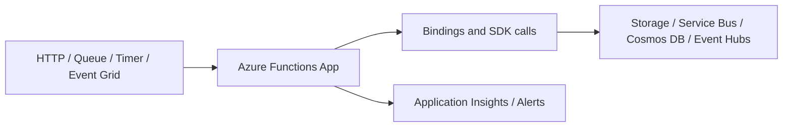
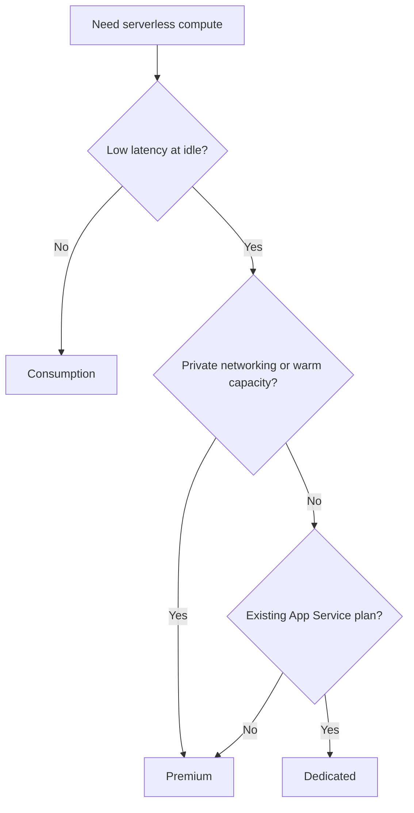
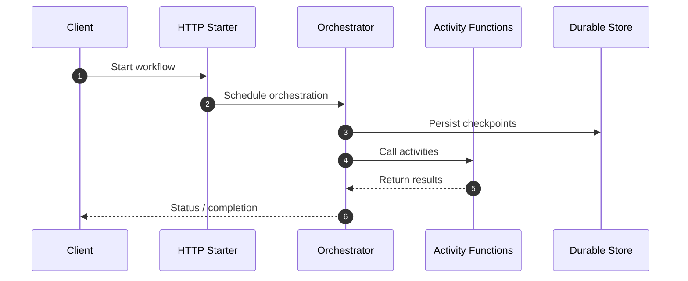
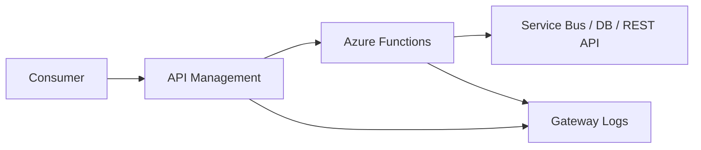

# Azure Functions Deep Dive

> Comprehensive Azure Functions guide covering triggers, bindings, hosting plans, Durable Functions, Logic Apps comparison, Event Grid, API Management integration, and operational best practices.

## Table of Contents
- 1. [Azure Functions overview](#1-azure-functions-overview)
- 2. [Execution model and runtime](#2-execution-model-and-runtime)
- 3. [Triggers and bindings](#3-triggers-and-bindings)
- 4. [Hosting plans](#4-hosting-plans)
- 5. [Durable Functions](#5-durable-functions)
- 6. [Logic Apps comparison](#6-logic-apps-comparison)
- 7. [Event Grid integration](#7-event-grid-integration)
- 8. [API Management integration](#8-api-management-integration)
- 9. [Security, networking, and observability](#9-security-networking-and-observability)
- 10. [Deployment patterns](#10-deployment-patterns)
- 11. [Troubleshooting](#11-troubleshooting)
- 12. [Reference matrix](#12-reference-matrix)
- 13. [Governance checklist](#13-governance-checklist)
- 14. [Operational review notes](#14-operational-review-notes)
- 15. [Glossary](#15-glossary)

---

## 1. Azure Functions Overview

- Azure Functions is Azure serverless compute for event-driven code execution.
- It supports multiple languages, automatic scaling, and bindings to many Azure services.
- It is ideal for APIs, background jobs, reactive automation, integrations, and orchestration patterns.



## 2. Execution Model and Runtime

- A function app is the deployment and scale boundary for one or more functions.
- A trigger starts execution, input bindings supply context, and output bindings publish results.
- Cold start, package size, concurrency, and downstream throttling should influence design decisions.

```bash
func init orders-api --worker-runtime node --model V4
cd orders-api
func new --name SubmitOrder --template "HTTP trigger"
func start
```

## 3. Triggers and Bindings

### HTTP trigger
- Use for APIs, webhooks, synchronous callbacks, and lightweight backends.
- Validate retries, idempotency, and observability before production use.
- Prefer managed identity and secure configuration over embedded secrets.

### Timer trigger
- Use for scheduled reconciliation, cleanup, and batch start jobs.
- Validate retries, idempotency, and observability before production use.
- Prefer managed identity and secure configuration over embedded secrets.

### Queue trigger
- Use for asynchronous decoupling with retry and poison handling.
- Validate retries, idempotency, and observability before production use.
- Prefer managed identity and secure configuration over embedded secrets.

### Service Bus trigger
- Use for enterprise messaging with queues, topics, and sessions.
- Validate retries, idempotency, and observability before production use.
- Prefer managed identity and secure configuration over embedded secrets.

### Event Grid trigger
- Use for reactive event routing from Azure services and custom publishers.
- Validate retries, idempotency, and observability before production use.
- Prefer managed identity and secure configuration over embedded secrets.

### Blob trigger
- Use for file processing and storage-driven pipelines.
- Validate retries, idempotency, and observability before production use.
- Prefer managed identity and secure configuration over embedded secrets.

### Cosmos DB trigger
- Use for change feed driven processing.
- Validate retries, idempotency, and observability before production use.
- Prefer managed identity and secure configuration over embedded secrets.

| Binding type | Purpose | Example |
|---|---|---|
| Trigger binding | Starts execution | HTTP, Queue, Event Grid |
| Input binding | Supplies data or context | Blob input, Cosmos DB input |
| Output binding | Writes a result to another system | Queue output, Blob output, Event Hub output |

## 4. Hosting Plans

| Plan | Strengths | Trade-offs | Good fit |
|---|---|---|---|
| Consumption | Pay per execution and automatic scale. | Cold start and execution constraints can affect latency-sensitive apps. | Bursty event-driven workloads with low idle demand. |
| Premium | Warm instances, VNet integration, and better latency control. | Higher baseline cost than Consumption. | Production APIs, private networking, and consistent performance. |
| Dedicated | Runs on App Service plans with fixed capacity and always-on support. | You pay for provisioned capacity even when idle. | Shared web plus function estates or reserved capacity patterns. |



## 5. Durable Functions

- Durable Functions adds stateful orchestration to Azure Functions using replayable orchestrators and activity functions.
- Use it for long-running workflows, fan-out and fan-in, approvals, and async APIs.
- Keep orchestrators deterministic and move I/O into activity functions.



### Durable patterns
- Function chaining for ordered steps.
- Fan-out and fan-in for parallel work.
- Human interaction with timeout handling.
- Async HTTP APIs with status endpoints.
- Entity functions for counters and lightweight coordination.

## 6. Logic Apps Comparison

| Dimension | Azure Functions | Logic Apps |
|---|---|---|
| Primary model | Code-first compute | Workflow-first integration |
| Best for | Custom logic and APIs | Connector-driven orchestration |
| Stateful orchestration | Durable Functions | Built-in workflow engine |
| Developer workflow | Traditional code and CI/CD | Designer plus automation |
| Connector breadth | Good but narrower | Very broad SaaS and enterprise connectors |

- Choose Functions when engineering teams want code-centric workflows and deep customization.
- Choose Logic Apps when the primary need is workflow orchestration across connectors.
- Use both when Logic Apps coordinates processes and Functions handles custom compute or validation.

## 7. Event Grid Integration

- Event Grid is ideal for near-real-time event fan-out from Azure services and custom publishers.
- Functions can subscribe directly to Event Grid events to keep architectures reactive and loosely coupled.
- Use filters, dead-lettering, and idempotent handlers to reduce noise and improve resilience.

```bash
az eventgrid topic create --resource-group $RG --name eg-orders --location eastus
az functionapp create --resource-group $RG --consumption-plan-location eastus --name func-orders-demo --storage-account stordersdemo123 --runtime dotnet --functions-version 4
az eventgrid event-subscription create --name sub-orders --source-resource-id <topic-id> --endpoint-type azurefunction --endpoint <function-resource-id>
```

## 8. API Management Integration

- API Management adds authentication, throttling, transformation, caching, versioning, and portal capabilities.
- Use APIM when Functions should participate in a governed API program rather than expose raw function URLs.
- Align APIM policies, backend auth, and timeout settings with the function runtime behavior.



## 9. Security, Networking, and Observability

- Use managed identities for outbound Azure service access wherever supported.
- Use Premium or Dedicated when VNet integration and private endpoint access are required.
- Send telemetry to Application Insights and alert on failures, latency, and dependency issues.
- Protect HTTP endpoints with Microsoft Entra, APIM, or app-level auth as appropriate.

## 10. Deployment Patterns

- Use slots when supported and when warm-up plus staged validation are needed before swap.
- Separate function apps when scale profile, ownership, or lifecycle diverges materially.
- Keep package size small to reduce startup and deployment time.
- Use IaC for app settings, identities, monitoring, APIM, and Event Grid resources.

## 11. Troubleshooting

| Symptom | Likely cause | First checks |
|---|---|---|
| Cold start too high | Idle scale-in or oversized startup dependencies | Plan type, package size, initialization logs |
| 401/403 responses | Auth mismatch or missing downstream rights | Auth settings, APIM policies, RBAC |
| Queue backlog growing | Insufficient scale or poison workload | Queue depth, retries, dependency latency |
| Durable workflow stuck | Non-deterministic orchestrator or failing activity | Durable status, history, host logs |
| Event Grid delivery failure | Subscription, endpoint auth, or validation issue | Event subscription health and trigger logs |

## 12. Reference Matrix

| Use case | Preferred pattern | Why |
|---|---|---|
| HTTP API | Premium or Dedicated + APIM | Low latency and governance |
| Nightly cleanup | Consumption + Timer trigger | Low-cost scheduled work |
| Order ingestion | Service Bus trigger + Durable Functions | Reliable decoupling and orchestration |
| Blob processing | Blob trigger + queue fan-out | Simple storage-driven automation |
| Platform events | Event Grid trigger | Reactive event routing |

## 13. Governance Checklist

### Design
- Review 1: Match trigger type to delivery guarantees and downstream behavior. Iteration 1.
- Review 2: Document retry, timeout, poison, and dead-letter behavior for each integration. Iteration 1.
- Review 3: Prefer idempotent handlers where duplicate delivery is possible. Iteration 1.
- Review 4: Match trigger type to delivery guarantees and downstream behavior. Iteration 2.
- Review 5: Document retry, timeout, poison, and dead-letter behavior for each integration. Iteration 2.
- Review 6: Prefer idempotent handlers where duplicate delivery is possible. Iteration 2.
- Review 7: Match trigger type to delivery guarantees and downstream behavior. Iteration 3.
- Review 8: Document retry, timeout, poison, and dead-letter behavior for each integration. Iteration 3.
- Review 9: Prefer idempotent handlers where duplicate delivery is possible. Iteration 3.
- Review 10: Match trigger type to delivery guarantees and downstream behavior. Iteration 4.
- Review 11: Document retry, timeout, poison, and dead-letter behavior for each integration. Iteration 4.
- Review 12: Prefer idempotent handlers where duplicate delivery is possible. Iteration 4.
- Review 13: Match trigger type to delivery guarantees and downstream behavior. Iteration 5.
- Review 14: Document retry, timeout, poison, and dead-letter behavior for each integration. Iteration 5.
- Review 15: Prefer idempotent handlers where duplicate delivery is possible. Iteration 5.
- Review 16: Match trigger type to delivery guarantees and downstream behavior. Iteration 6.
- Review 17: Document retry, timeout, poison, and dead-letter behavior for each integration. Iteration 6.
- Review 18: Prefer idempotent handlers where duplicate delivery is possible. Iteration 6.
- Review 19: Match trigger type to delivery guarantees and downstream behavior. Iteration 7.
- Review 20: Document retry, timeout, poison, and dead-letter behavior for each integration. Iteration 7.
- Review 21: Prefer idempotent handlers where duplicate delivery is possible. Iteration 7.
- Review 22: Match trigger type to delivery guarantees and downstream behavior. Iteration 8.
- Review 23: Document retry, timeout, poison, and dead-letter behavior for each integration. Iteration 8.
- Review 24: Prefer idempotent handlers where duplicate delivery is possible. Iteration 8.
- Review 25: Match trigger type to delivery guarantees and downstream behavior. Iteration 9.
- Review 26: Document retry, timeout, poison, and dead-letter behavior for each integration. Iteration 9.
- Review 27: Prefer idempotent handlers where duplicate delivery is possible. Iteration 9.
- Review 28: Match trigger type to delivery guarantees and downstream behavior. Iteration 10.
- Review 29: Document retry, timeout, poison, and dead-letter behavior for each integration. Iteration 10.
- Review 30: Prefer idempotent handlers where duplicate delivery is possible. Iteration 10.
- Review 31: Match trigger type to delivery guarantees and downstream behavior. Iteration 11.
- Review 32: Document retry, timeout, poison, and dead-letter behavior for each integration. Iteration 11.
- Review 33: Prefer idempotent handlers where duplicate delivery is possible. Iteration 11.
- Review 34: Match trigger type to delivery guarantees and downstream behavior. Iteration 12.
- Review 35: Document retry, timeout, poison, and dead-letter behavior for each integration. Iteration 12.
- Review 36: Prefer idempotent handlers where duplicate delivery is possible. Iteration 12.
- Review 37: Match trigger type to delivery guarantees and downstream behavior. Iteration 13.
- Review 38: Document retry, timeout, poison, and dead-letter behavior for each integration. Iteration 13.
- Review 39: Prefer idempotent handlers where duplicate delivery is possible. Iteration 13.
- Review 40: Match trigger type to delivery guarantees and downstream behavior. Iteration 14.
- Review 41: Document retry, timeout, poison, and dead-letter behavior for each integration. Iteration 14.
- Review 42: Prefer idempotent handlers where duplicate delivery is possible. Iteration 14.
- Review 43: Match trigger type to delivery guarantees and downstream behavior. Iteration 15.
- Review 44: Document retry, timeout, poison, and dead-letter behavior for each integration. Iteration 15.
- Review 45: Prefer idempotent handlers where duplicate delivery is possible. Iteration 15.
- Review 46: Match trigger type to delivery guarantees and downstream behavior. Iteration 16.
- Review 47: Document retry, timeout, poison, and dead-letter behavior for each integration. Iteration 16.
- Review 48: Prefer idempotent handlers where duplicate delivery is possible. Iteration 16.
- Review 49: Match trigger type to delivery guarantees and downstream behavior. Iteration 17.
- Review 50: Document retry, timeout, poison, and dead-letter behavior for each integration. Iteration 17.
- Review 51: Prefer idempotent handlers where duplicate delivery is possible. Iteration 17.
- Review 52: Match trigger type to delivery guarantees and downstream behavior. Iteration 18.
- Review 53: Document retry, timeout, poison, and dead-letter behavior for each integration. Iteration 18.
- Review 54: Prefer idempotent handlers where duplicate delivery is possible. Iteration 18.
- Review 55: Match trigger type to delivery guarantees and downstream behavior. Iteration 19.
- Review 56: Document retry, timeout, poison, and dead-letter behavior for each integration. Iteration 19.
- Review 57: Prefer idempotent handlers where duplicate delivery is possible. Iteration 19.
- Review 58: Match trigger type to delivery guarantees and downstream behavior. Iteration 20.
- Review 59: Document retry, timeout, poison, and dead-letter behavior for each integration. Iteration 20.
- Review 60: Prefer idempotent handlers where duplicate delivery is possible. Iteration 20.
- Review 61: Match trigger type to delivery guarantees and downstream behavior. Iteration 21.
- Review 62: Document retry, timeout, poison, and dead-letter behavior for each integration. Iteration 21.
- Review 63: Prefer idempotent handlers where duplicate delivery is possible. Iteration 21.
- Review 64: Match trigger type to delivery guarantees and downstream behavior. Iteration 22.
- Review 65: Document retry, timeout, poison, and dead-letter behavior for each integration. Iteration 22.
- Review 66: Prefer idempotent handlers where duplicate delivery is possible. Iteration 22.
- Review 67: Match trigger type to delivery guarantees and downstream behavior. Iteration 23.
- Review 68: Document retry, timeout, poison, and dead-letter behavior for each integration. Iteration 23.
- Review 69: Prefer idempotent handlers where duplicate delivery is possible. Iteration 23.
- Review 70: Match trigger type to delivery guarantees and downstream behavior. Iteration 24.
- Review 71: Document retry, timeout, poison, and dead-letter behavior for each integration. Iteration 24.
- Review 72: Prefer idempotent handlers where duplicate delivery is possible. Iteration 24.
- Review 73: Match trigger type to delivery guarantees and downstream behavior. Iteration 25.
- Review 74: Document retry, timeout, poison, and dead-letter behavior for each integration. Iteration 25.
- Review 75: Prefer idempotent handlers where duplicate delivery is possible. Iteration 25.
- Review 76: Match trigger type to delivery guarantees and downstream behavior. Iteration 26.
- Review 77: Document retry, timeout, poison, and dead-letter behavior for each integration. Iteration 26.
- Review 78: Prefer idempotent handlers where duplicate delivery is possible. Iteration 26.
- Review 79: Match trigger type to delivery guarantees and downstream behavior. Iteration 27.
- Review 80: Document retry, timeout, poison, and dead-letter behavior for each integration. Iteration 27.
- Review 81: Prefer idempotent handlers where duplicate delivery is possible. Iteration 27.
- Review 82: Match trigger type to delivery guarantees and downstream behavior. Iteration 28.
- Review 83: Document retry, timeout, poison, and dead-letter behavior for each integration. Iteration 28.
- Review 84: Prefer idempotent handlers where duplicate delivery is possible. Iteration 28.
- Review 85: Match trigger type to delivery guarantees and downstream behavior. Iteration 29.
- Review 86: Document retry, timeout, poison, and dead-letter behavior for each integration. Iteration 29.
- Review 87: Prefer idempotent handlers where duplicate delivery is possible. Iteration 29.
- Review 88: Match trigger type to delivery guarantees and downstream behavior. Iteration 30.
- Review 89: Document retry, timeout, poison, and dead-letter behavior for each integration. Iteration 30.
- Review 90: Prefer idempotent handlers where duplicate delivery is possible. Iteration 30.
- Review 91: Match trigger type to delivery guarantees and downstream behavior. Iteration 31.
- Review 92: Document retry, timeout, poison, and dead-letter behavior for each integration. Iteration 31.
- Review 93: Prefer idempotent handlers where duplicate delivery is possible. Iteration 31.
- Review 94: Match trigger type to delivery guarantees and downstream behavior. Iteration 32.
- Review 95: Document retry, timeout, poison, and dead-letter behavior for each integration. Iteration 32.
- Review 96: Prefer idempotent handlers where duplicate delivery is possible. Iteration 32.
- Review 97: Match trigger type to delivery guarantees and downstream behavior. Iteration 33.
- Review 98: Document retry, timeout, poison, and dead-letter behavior for each integration. Iteration 33.
- Review 99: Prefer idempotent handlers where duplicate delivery is possible. Iteration 33.
- Review 100: Match trigger type to delivery guarantees and downstream behavior. Iteration 34.
- Review 101: Document retry, timeout, poison, and dead-letter behavior for each integration. Iteration 34.
- Review 102: Prefer idempotent handlers where duplicate delivery is possible. Iteration 34.
- Review 103: Match trigger type to delivery guarantees and downstream behavior. Iteration 35.
- Review 104: Document retry, timeout, poison, and dead-letter behavior for each integration. Iteration 35.
- Review 105: Prefer idempotent handlers where duplicate delivery is possible. Iteration 35.
- Review 106: Match trigger type to delivery guarantees and downstream behavior. Iteration 36.
- Review 107: Document retry, timeout, poison, and dead-letter behavior for each integration. Iteration 36.
- Review 108: Prefer idempotent handlers where duplicate delivery is possible. Iteration 36.
- Review 109: Match trigger type to delivery guarantees and downstream behavior. Iteration 37.
- Review 110: Document retry, timeout, poison, and dead-letter behavior for each integration. Iteration 37.
- Review 111: Prefer idempotent handlers where duplicate delivery is possible. Iteration 37.
- Review 112: Match trigger type to delivery guarantees and downstream behavior. Iteration 38.
- Review 113: Document retry, timeout, poison, and dead-letter behavior for each integration. Iteration 38.
- Review 114: Prefer idempotent handlers where duplicate delivery is possible. Iteration 38.
- Review 115: Match trigger type to delivery guarantees and downstream behavior. Iteration 39.
- Review 116: Document retry, timeout, poison, and dead-letter behavior for each integration. Iteration 39.
- Review 117: Prefer idempotent handlers where duplicate delivery is possible. Iteration 39.
- Review 118: Match trigger type to delivery guarantees and downstream behavior. Iteration 40.
- Review 119: Document retry, timeout, poison, and dead-letter behavior for each integration. Iteration 40.
- Review 120: Prefer idempotent handlers where duplicate delivery is possible. Iteration 40.
- Review 121: Match trigger type to delivery guarantees and downstream behavior. Iteration 41.
- Review 122: Document retry, timeout, poison, and dead-letter behavior for each integration. Iteration 41.
- Review 123: Prefer idempotent handlers where duplicate delivery is possible. Iteration 41.
- Review 124: Match trigger type to delivery guarantees and downstream behavior. Iteration 42.
- Review 125: Document retry, timeout, poison, and dead-letter behavior for each integration. Iteration 42.
- Review 126: Prefer idempotent handlers where duplicate delivery is possible. Iteration 42.
- Review 127: Match trigger type to delivery guarantees and downstream behavior. Iteration 43.
- Review 128: Document retry, timeout, poison, and dead-letter behavior for each integration. Iteration 43.
- Review 129: Prefer idempotent handlers where duplicate delivery is possible. Iteration 43.
- Review 130: Match trigger type to delivery guarantees and downstream behavior. Iteration 44.
- Review 131: Document retry, timeout, poison, and dead-letter behavior for each integration. Iteration 44.
- Review 132: Prefer idempotent handlers where duplicate delivery is possible. Iteration 44.
- Review 133: Match trigger type to delivery guarantees and downstream behavior. Iteration 45.
- Review 134: Document retry, timeout, poison, and dead-letter behavior for each integration. Iteration 45.
- Review 135: Prefer idempotent handlers where duplicate delivery is possible. Iteration 45.
- Review 136: Match trigger type to delivery guarantees and downstream behavior. Iteration 46.
- Review 137: Document retry, timeout, poison, and dead-letter behavior for each integration. Iteration 46.
- Review 138: Prefer idempotent handlers where duplicate delivery is possible. Iteration 46.
- Review 139: Match trigger type to delivery guarantees and downstream behavior. Iteration 47.
- Review 140: Document retry, timeout, poison, and dead-letter behavior for each integration. Iteration 47.
- Review 141: Prefer idempotent handlers where duplicate delivery is possible. Iteration 47.
- Review 142: Match trigger type to delivery guarantees and downstream behavior. Iteration 48.
- Review 143: Document retry, timeout, poison, and dead-letter behavior for each integration. Iteration 48.
- Review 144: Prefer idempotent handlers where duplicate delivery is possible. Iteration 48.
- Review 145: Match trigger type to delivery guarantees and downstream behavior. Iteration 49.
- Review 146: Document retry, timeout, poison, and dead-letter behavior for each integration. Iteration 49.
- Review 147: Prefer idempotent handlers where duplicate delivery is possible. Iteration 49.
- Review 148: Match trigger type to delivery guarantees and downstream behavior. Iteration 50.
- Review 149: Document retry, timeout, poison, and dead-letter behavior for each integration. Iteration 50.
- Review 150: Prefer idempotent handlers where duplicate delivery is possible. Iteration 50.
- Review 151: Match trigger type to delivery guarantees and downstream behavior. Iteration 51.
- Review 152: Document retry, timeout, poison, and dead-letter behavior for each integration. Iteration 51.
- Review 153: Prefer idempotent handlers where duplicate delivery is possible. Iteration 51.
- Review 154: Match trigger type to delivery guarantees and downstream behavior. Iteration 52.
- Review 155: Document retry, timeout, poison, and dead-letter behavior for each integration. Iteration 52.
- Review 156: Prefer idempotent handlers where duplicate delivery is possible. Iteration 52.
- Review 157: Match trigger type to delivery guarantees and downstream behavior. Iteration 53.
- Review 158: Document retry, timeout, poison, and dead-letter behavior for each integration. Iteration 53.
- Review 159: Prefer idempotent handlers where duplicate delivery is possible. Iteration 53.
- Review 160: Match trigger type to delivery guarantees and downstream behavior. Iteration 54.
- Review 161: Document retry, timeout, poison, and dead-letter behavior for each integration. Iteration 54.
- Review 162: Prefer idempotent handlers where duplicate delivery is possible. Iteration 54.
- Review 163: Match trigger type to delivery guarantees and downstream behavior. Iteration 55.
- Review 164: Document retry, timeout, poison, and dead-letter behavior for each integration. Iteration 55.
- Review 165: Prefer idempotent handlers where duplicate delivery is possible. Iteration 55.
- Review 166: Match trigger type to delivery guarantees and downstream behavior. Iteration 56.
- Review 167: Document retry, timeout, poison, and dead-letter behavior for each integration. Iteration 56.
- Review 168: Prefer idempotent handlers where duplicate delivery is possible. Iteration 56.
- Review 169: Match trigger type to delivery guarantees and downstream behavior. Iteration 57.
- Review 170: Document retry, timeout, poison, and dead-letter behavior for each integration. Iteration 57.
- Review 171: Prefer idempotent handlers where duplicate delivery is possible. Iteration 57.
- Review 172: Match trigger type to delivery guarantees and downstream behavior. Iteration 58.
- Review 173: Document retry, timeout, poison, and dead-letter behavior for each integration. Iteration 58.
- Review 174: Prefer idempotent handlers where duplicate delivery is possible. Iteration 58.
- Review 175: Match trigger type to delivery guarantees and downstream behavior. Iteration 59.
- Review 176: Document retry, timeout, poison, and dead-letter behavior for each integration. Iteration 59.
- Review 177: Prefer idempotent handlers where duplicate delivery is possible. Iteration 59.
- Review 178: Match trigger type to delivery guarantees and downstream behavior. Iteration 60.
- Review 179: Document retry, timeout, poison, and dead-letter behavior for each integration. Iteration 60.
- Review 180: Prefer idempotent handlers where duplicate delivery is possible. Iteration 60.
- Review 181: Match trigger type to delivery guarantees and downstream behavior. Iteration 61.
- Review 182: Document retry, timeout, poison, and dead-letter behavior for each integration. Iteration 61.
- Review 183: Prefer idempotent handlers where duplicate delivery is possible. Iteration 61.
- Review 184: Match trigger type to delivery guarantees and downstream behavior. Iteration 62.
- Review 185: Document retry, timeout, poison, and dead-letter behavior for each integration. Iteration 62.
- Review 186: Prefer idempotent handlers where duplicate delivery is possible. Iteration 62.
- Review 187: Match trigger type to delivery guarantees and downstream behavior. Iteration 63.
- Review 188: Document retry, timeout, poison, and dead-letter behavior for each integration. Iteration 63.
- Review 189: Prefer idempotent handlers where duplicate delivery is possible. Iteration 63.
- Review 190: Match trigger type to delivery guarantees and downstream behavior. Iteration 64.
- Review 191: Document retry, timeout, poison, and dead-letter behavior for each integration. Iteration 64.
- Review 192: Prefer idempotent handlers where duplicate delivery is possible. Iteration 64.
- Review 193: Match trigger type to delivery guarantees and downstream behavior. Iteration 65.
- Review 194: Document retry, timeout, poison, and dead-letter behavior for each integration. Iteration 65.
- Review 195: Prefer idempotent handlers where duplicate delivery is possible. Iteration 65.
- Review 196: Match trigger type to delivery guarantees and downstream behavior. Iteration 66.
- Review 197: Document retry, timeout, poison, and dead-letter behavior for each integration. Iteration 66.
- Review 198: Prefer idempotent handlers where duplicate delivery is possible. Iteration 66.
- Review 199: Match trigger type to delivery guarantees and downstream behavior. Iteration 67.
- Review 200: Document retry, timeout, poison, and dead-letter behavior for each integration. Iteration 67.
- Review 201: Prefer idempotent handlers where duplicate delivery is possible. Iteration 67.
- Review 202: Match trigger type to delivery guarantees and downstream behavior. Iteration 68.
- Review 203: Document retry, timeout, poison, and dead-letter behavior for each integration. Iteration 68.
- Review 204: Prefer idempotent handlers where duplicate delivery is possible. Iteration 68.
- Review 205: Match trigger type to delivery guarantees and downstream behavior. Iteration 69.
- Review 206: Document retry, timeout, poison, and dead-letter behavior for each integration. Iteration 69.
- Review 207: Prefer idempotent handlers where duplicate delivery is possible. Iteration 69.
- Review 208: Match trigger type to delivery guarantees and downstream behavior. Iteration 70.
- Review 209: Document retry, timeout, poison, and dead-letter behavior for each integration. Iteration 70.
- Review 210: Prefer idempotent handlers where duplicate delivery is possible. Iteration 70.

### Operations
- Review 211: Track cost, failure rate, invocation volume, queue depth, and dependency latency. Iteration 1.
- Review 212: Test rollback, storage resilience, and deployment failure paths. Iteration 1.
- Review 213: Review plan sizing and cold-start posture regularly. Iteration 1.
- Review 214: Track cost, failure rate, invocation volume, queue depth, and dependency latency. Iteration 2.
- Review 215: Test rollback, storage resilience, and deployment failure paths. Iteration 2.
- Review 216: Review plan sizing and cold-start posture regularly. Iteration 2.
- Review 217: Track cost, failure rate, invocation volume, queue depth, and dependency latency. Iteration 3.
- Review 218: Test rollback, storage resilience, and deployment failure paths. Iteration 3.
- Review 219: Review plan sizing and cold-start posture regularly. Iteration 3.
- Review 220: Track cost, failure rate, invocation volume, queue depth, and dependency latency. Iteration 4.
- Review 221: Test rollback, storage resilience, and deployment failure paths. Iteration 4.
- Review 222: Review plan sizing and cold-start posture regularly. Iteration 4.
- Review 223: Track cost, failure rate, invocation volume, queue depth, and dependency latency. Iteration 5.
- Review 224: Test rollback, storage resilience, and deployment failure paths. Iteration 5.
- Review 225: Review plan sizing and cold-start posture regularly. Iteration 5.
- Review 226: Track cost, failure rate, invocation volume, queue depth, and dependency latency. Iteration 6.
- Review 227: Test rollback, storage resilience, and deployment failure paths. Iteration 6.
- Review 228: Review plan sizing and cold-start posture regularly. Iteration 6.
- Review 229: Track cost, failure rate, invocation volume, queue depth, and dependency latency. Iteration 7.
- Review 230: Test rollback, storage resilience, and deployment failure paths. Iteration 7.
- Review 231: Review plan sizing and cold-start posture regularly. Iteration 7.
- Review 232: Track cost, failure rate, invocation volume, queue depth, and dependency latency. Iteration 8.
- Review 233: Test rollback, storage resilience, and deployment failure paths. Iteration 8.
- Review 234: Review plan sizing and cold-start posture regularly. Iteration 8.
- Review 235: Track cost, failure rate, invocation volume, queue depth, and dependency latency. Iteration 9.
- Review 236: Test rollback, storage resilience, and deployment failure paths. Iteration 9.
- Review 237: Review plan sizing and cold-start posture regularly. Iteration 9.
- Review 238: Track cost, failure rate, invocation volume, queue depth, and dependency latency. Iteration 10.
- Review 239: Test rollback, storage resilience, and deployment failure paths. Iteration 10.
- Review 240: Review plan sizing and cold-start posture regularly. Iteration 10.
- Review 241: Track cost, failure rate, invocation volume, queue depth, and dependency latency. Iteration 11.
- Review 242: Test rollback, storage resilience, and deployment failure paths. Iteration 11.
- Review 243: Review plan sizing and cold-start posture regularly. Iteration 11.
- Review 244: Track cost, failure rate, invocation volume, queue depth, and dependency latency. Iteration 12.
- Review 245: Test rollback, storage resilience, and deployment failure paths. Iteration 12.
- Review 246: Review plan sizing and cold-start posture regularly. Iteration 12.
- Review 247: Track cost, failure rate, invocation volume, queue depth, and dependency latency. Iteration 13.
- Review 248: Test rollback, storage resilience, and deployment failure paths. Iteration 13.
- Review 249: Review plan sizing and cold-start posture regularly. Iteration 13.
- Review 250: Track cost, failure rate, invocation volume, queue depth, and dependency latency. Iteration 14.
- Review 251: Test rollback, storage resilience, and deployment failure paths. Iteration 14.
- Review 252: Review plan sizing and cold-start posture regularly. Iteration 14.
- Review 253: Track cost, failure rate, invocation volume, queue depth, and dependency latency. Iteration 15.
- Review 254: Test rollback, storage resilience, and deployment failure paths. Iteration 15.
- Review 255: Review plan sizing and cold-start posture regularly. Iteration 15.
- Review 256: Track cost, failure rate, invocation volume, queue depth, and dependency latency. Iteration 16.
- Review 257: Test rollback, storage resilience, and deployment failure paths. Iteration 16.
- Review 258: Review plan sizing and cold-start posture regularly. Iteration 16.
- Review 259: Track cost, failure rate, invocation volume, queue depth, and dependency latency. Iteration 17.
- Review 260: Test rollback, storage resilience, and deployment failure paths. Iteration 17.
- Review 261: Review plan sizing and cold-start posture regularly. Iteration 17.
- Review 262: Track cost, failure rate, invocation volume, queue depth, and dependency latency. Iteration 18.
- Review 263: Test rollback, storage resilience, and deployment failure paths. Iteration 18.
- Review 264: Review plan sizing and cold-start posture regularly. Iteration 18.
- Review 265: Track cost, failure rate, invocation volume, queue depth, and dependency latency. Iteration 19.
- Review 266: Test rollback, storage resilience, and deployment failure paths. Iteration 19.
- Review 267: Review plan sizing and cold-start posture regularly. Iteration 19.
- Review 268: Track cost, failure rate, invocation volume, queue depth, and dependency latency. Iteration 20.
- Review 269: Test rollback, storage resilience, and deployment failure paths. Iteration 20.
- Review 270: Review plan sizing and cold-start posture regularly. Iteration 20.
- Review 271: Track cost, failure rate, invocation volume, queue depth, and dependency latency. Iteration 21.
- Review 272: Test rollback, storage resilience, and deployment failure paths. Iteration 21.
- Review 273: Review plan sizing and cold-start posture regularly. Iteration 21.
- Review 274: Track cost, failure rate, invocation volume, queue depth, and dependency latency. Iteration 22.
- Review 275: Test rollback, storage resilience, and deployment failure paths. Iteration 22.
- Review 276: Review plan sizing and cold-start posture regularly. Iteration 22.
- Review 277: Track cost, failure rate, invocation volume, queue depth, and dependency latency. Iteration 23.
- Review 278: Test rollback, storage resilience, and deployment failure paths. Iteration 23.
- Review 279: Review plan sizing and cold-start posture regularly. Iteration 23.
- Review 280: Track cost, failure rate, invocation volume, queue depth, and dependency latency. Iteration 24.
- Review 281: Test rollback, storage resilience, and deployment failure paths. Iteration 24.
- Review 282: Review plan sizing and cold-start posture regularly. Iteration 24.
- Review 283: Track cost, failure rate, invocation volume, queue depth, and dependency latency. Iteration 25.
- Review 284: Test rollback, storage resilience, and deployment failure paths. Iteration 25.
- Review 285: Review plan sizing and cold-start posture regularly. Iteration 25.
- Review 286: Track cost, failure rate, invocation volume, queue depth, and dependency latency. Iteration 26.
- Review 287: Test rollback, storage resilience, and deployment failure paths. Iteration 26.
- Review 288: Review plan sizing and cold-start posture regularly. Iteration 26.
- Review 289: Track cost, failure rate, invocation volume, queue depth, and dependency latency. Iteration 27.
- Review 290: Test rollback, storage resilience, and deployment failure paths. Iteration 27.
- Review 291: Review plan sizing and cold-start posture regularly. Iteration 27.
- Review 292: Track cost, failure rate, invocation volume, queue depth, and dependency latency. Iteration 28.
- Review 293: Test rollback, storage resilience, and deployment failure paths. Iteration 28.
- Review 294: Review plan sizing and cold-start posture regularly. Iteration 28.
- Review 295: Track cost, failure rate, invocation volume, queue depth, and dependency latency. Iteration 29.
- Review 296: Test rollback, storage resilience, and deployment failure paths. Iteration 29.
- Review 297: Review plan sizing and cold-start posture regularly. Iteration 29.
- Review 298: Track cost, failure rate, invocation volume, queue depth, and dependency latency. Iteration 30.
- Review 299: Test rollback, storage resilience, and deployment failure paths. Iteration 30.
- Review 300: Review plan sizing and cold-start posture regularly. Iteration 30.
- Review 301: Track cost, failure rate, invocation volume, queue depth, and dependency latency. Iteration 31.
- Review 302: Test rollback, storage resilience, and deployment failure paths. Iteration 31.
- Review 303: Review plan sizing and cold-start posture regularly. Iteration 31.
- Review 304: Track cost, failure rate, invocation volume, queue depth, and dependency latency. Iteration 32.
- Review 305: Test rollback, storage resilience, and deployment failure paths. Iteration 32.
- Review 306: Review plan sizing and cold-start posture regularly. Iteration 32.
- Review 307: Track cost, failure rate, invocation volume, queue depth, and dependency latency. Iteration 33.
- Review 308: Test rollback, storage resilience, and deployment failure paths. Iteration 33.
- Review 309: Review plan sizing and cold-start posture regularly. Iteration 33.
- Review 310: Track cost, failure rate, invocation volume, queue depth, and dependency latency. Iteration 34.
- Review 311: Test rollback, storage resilience, and deployment failure paths. Iteration 34.
- Review 312: Review plan sizing and cold-start posture regularly. Iteration 34.
- Review 313: Track cost, failure rate, invocation volume, queue depth, and dependency latency. Iteration 35.
- Review 314: Test rollback, storage resilience, and deployment failure paths. Iteration 35.
- Review 315: Review plan sizing and cold-start posture regularly. Iteration 35.
- Review 316: Track cost, failure rate, invocation volume, queue depth, and dependency latency. Iteration 36.
- Review 317: Test rollback, storage resilience, and deployment failure paths. Iteration 36.
- Review 318: Review plan sizing and cold-start posture regularly. Iteration 36.
- Review 319: Track cost, failure rate, invocation volume, queue depth, and dependency latency. Iteration 37.
- Review 320: Test rollback, storage resilience, and deployment failure paths. Iteration 37.
- Review 321: Review plan sizing and cold-start posture regularly. Iteration 37.
- Review 322: Track cost, failure rate, invocation volume, queue depth, and dependency latency. Iteration 38.
- Review 323: Test rollback, storage resilience, and deployment failure paths. Iteration 38.
- Review 324: Review plan sizing and cold-start posture regularly. Iteration 38.
- Review 325: Track cost, failure rate, invocation volume, queue depth, and dependency latency. Iteration 39.
- Review 326: Test rollback, storage resilience, and deployment failure paths. Iteration 39.
- Review 327: Review plan sizing and cold-start posture regularly. Iteration 39.
- Review 328: Track cost, failure rate, invocation volume, queue depth, and dependency latency. Iteration 40.
- Review 329: Test rollback, storage resilience, and deployment failure paths. Iteration 40.
- Review 330: Review plan sizing and cold-start posture regularly. Iteration 40.
- Review 331: Track cost, failure rate, invocation volume, queue depth, and dependency latency. Iteration 41.
- Review 332: Test rollback, storage resilience, and deployment failure paths. Iteration 41.
- Review 333: Review plan sizing and cold-start posture regularly. Iteration 41.
- Review 334: Track cost, failure rate, invocation volume, queue depth, and dependency latency. Iteration 42.
- Review 335: Test rollback, storage resilience, and deployment failure paths. Iteration 42.
- Review 336: Review plan sizing and cold-start posture regularly. Iteration 42.
- Review 337: Track cost, failure rate, invocation volume, queue depth, and dependency latency. Iteration 43.
- Review 338: Test rollback, storage resilience, and deployment failure paths. Iteration 43.
- Review 339: Review plan sizing and cold-start posture regularly. Iteration 43.
- Review 340: Track cost, failure rate, invocation volume, queue depth, and dependency latency. Iteration 44.
- Review 341: Test rollback, storage resilience, and deployment failure paths. Iteration 44.
- Review 342: Review plan sizing and cold-start posture regularly. Iteration 44.
- Review 343: Track cost, failure rate, invocation volume, queue depth, and dependency latency. Iteration 45.
- Review 344: Test rollback, storage resilience, and deployment failure paths. Iteration 45.
- Review 345: Review plan sizing and cold-start posture regularly. Iteration 45.
- Review 346: Track cost, failure rate, invocation volume, queue depth, and dependency latency. Iteration 46.
- Review 347: Test rollback, storage resilience, and deployment failure paths. Iteration 46.
- Review 348: Review plan sizing and cold-start posture regularly. Iteration 46.
- Review 349: Track cost, failure rate, invocation volume, queue depth, and dependency latency. Iteration 47.
- Review 350: Test rollback, storage resilience, and deployment failure paths. Iteration 47.
- Review 351: Review plan sizing and cold-start posture regularly. Iteration 47.
- Review 352: Track cost, failure rate, invocation volume, queue depth, and dependency latency. Iteration 48.
- Review 353: Test rollback, storage resilience, and deployment failure paths. Iteration 48.
- Review 354: Review plan sizing and cold-start posture regularly. Iteration 48.
- Review 355: Track cost, failure rate, invocation volume, queue depth, and dependency latency. Iteration 49.
- Review 356: Test rollback, storage resilience, and deployment failure paths. Iteration 49.
- Review 357: Review plan sizing and cold-start posture regularly. Iteration 49.
- Review 358: Track cost, failure rate, invocation volume, queue depth, and dependency latency. Iteration 50.
- Review 359: Test rollback, storage resilience, and deployment failure paths. Iteration 50.
- Review 360: Review plan sizing and cold-start posture regularly. Iteration 50.
- Review 361: Track cost, failure rate, invocation volume, queue depth, and dependency latency. Iteration 51.
- Review 362: Test rollback, storage resilience, and deployment failure paths. Iteration 51.
- Review 363: Review plan sizing and cold-start posture regularly. Iteration 51.
- Review 364: Track cost, failure rate, invocation volume, queue depth, and dependency latency. Iteration 52.
- Review 365: Test rollback, storage resilience, and deployment failure paths. Iteration 52.
- Review 366: Review plan sizing and cold-start posture regularly. Iteration 52.
- Review 367: Track cost, failure rate, invocation volume, queue depth, and dependency latency. Iteration 53.
- Review 368: Test rollback, storage resilience, and deployment failure paths. Iteration 53.
- Review 369: Review plan sizing and cold-start posture regularly. Iteration 53.
- Review 370: Track cost, failure rate, invocation volume, queue depth, and dependency latency. Iteration 54.
- Review 371: Test rollback, storage resilience, and deployment failure paths. Iteration 54.
- Review 372: Review plan sizing and cold-start posture regularly. Iteration 54.
- Review 373: Track cost, failure rate, invocation volume, queue depth, and dependency latency. Iteration 55.
- Review 374: Test rollback, storage resilience, and deployment failure paths. Iteration 55.
- Review 375: Review plan sizing and cold-start posture regularly. Iteration 55.
- Review 376: Track cost, failure rate, invocation volume, queue depth, and dependency latency. Iteration 56.
- Review 377: Test rollback, storage resilience, and deployment failure paths. Iteration 56.
- Review 378: Review plan sizing and cold-start posture regularly. Iteration 56.
- Review 379: Track cost, failure rate, invocation volume, queue depth, and dependency latency. Iteration 57.
- Review 380: Test rollback, storage resilience, and deployment failure paths. Iteration 57.
- Review 381: Review plan sizing and cold-start posture regularly. Iteration 57.
- Review 382: Track cost, failure rate, invocation volume, queue depth, and dependency latency. Iteration 58.
- Review 383: Test rollback, storage resilience, and deployment failure paths. Iteration 58.
- Review 384: Review plan sizing and cold-start posture regularly. Iteration 58.
- Review 385: Track cost, failure rate, invocation volume, queue depth, and dependency latency. Iteration 59.
- Review 386: Test rollback, storage resilience, and deployment failure paths. Iteration 59.
- Review 387: Review plan sizing and cold-start posture regularly. Iteration 59.
- Review 388: Track cost, failure rate, invocation volume, queue depth, and dependency latency. Iteration 60.
- Review 389: Test rollback, storage resilience, and deployment failure paths. Iteration 60.
- Review 390: Review plan sizing and cold-start posture regularly. Iteration 60.
- Review 391: Track cost, failure rate, invocation volume, queue depth, and dependency latency. Iteration 61.
- Review 392: Test rollback, storage resilience, and deployment failure paths. Iteration 61.
- Review 393: Review plan sizing and cold-start posture regularly. Iteration 61.
- Review 394: Track cost, failure rate, invocation volume, queue depth, and dependency latency. Iteration 62.
- Review 395: Test rollback, storage resilience, and deployment failure paths. Iteration 62.
- Review 396: Review plan sizing and cold-start posture regularly. Iteration 62.
- Review 397: Track cost, failure rate, invocation volume, queue depth, and dependency latency. Iteration 63.
- Review 398: Test rollback, storage resilience, and deployment failure paths. Iteration 63.
- Review 399: Review plan sizing and cold-start posture regularly. Iteration 63.
- Review 400: Track cost, failure rate, invocation volume, queue depth, and dependency latency. Iteration 64.
- Review 401: Test rollback, storage resilience, and deployment failure paths. Iteration 64.
- Review 402: Review plan sizing and cold-start posture regularly. Iteration 64.
- Review 403: Track cost, failure rate, invocation volume, queue depth, and dependency latency. Iteration 65.
- Review 404: Test rollback, storage resilience, and deployment failure paths. Iteration 65.
- Review 405: Review plan sizing and cold-start posture regularly. Iteration 65.
- Review 406: Track cost, failure rate, invocation volume, queue depth, and dependency latency. Iteration 66.
- Review 407: Test rollback, storage resilience, and deployment failure paths. Iteration 66.
- Review 408: Review plan sizing and cold-start posture regularly. Iteration 66.
- Review 409: Track cost, failure rate, invocation volume, queue depth, and dependency latency. Iteration 67.
- Review 410: Test rollback, storage resilience, and deployment failure paths. Iteration 67.
- Review 411: Review plan sizing and cold-start posture regularly. Iteration 67.
- Review 412: Track cost, failure rate, invocation volume, queue depth, and dependency latency. Iteration 68.
- Review 413: Test rollback, storage resilience, and deployment failure paths. Iteration 68.
- Review 414: Review plan sizing and cold-start posture regularly. Iteration 68.
- Review 415: Track cost, failure rate, invocation volume, queue depth, and dependency latency. Iteration 69.
- Review 416: Test rollback, storage resilience, and deployment failure paths. Iteration 69.
- Review 417: Review plan sizing and cold-start posture regularly. Iteration 69.
- Review 418: Track cost, failure rate, invocation volume, queue depth, and dependency latency. Iteration 70.
- Review 419: Test rollback, storage resilience, and deployment failure paths. Iteration 70.
- Review 420: Review plan sizing and cold-start posture regularly. Iteration 70.

### Security
- Review 421: Use managed identity and least privilege for every Azure dependency. Iteration 1.
- Review 422: Review public exposure, APIM policies, and data handling requirements. Iteration 1.
- Review 423: Align log retention with compliance and incident response needs. Iteration 1.
- Review 424: Use managed identity and least privilege for every Azure dependency. Iteration 2.
- Review 425: Review public exposure, APIM policies, and data handling requirements. Iteration 2.
- Review 426: Align log retention with compliance and incident response needs. Iteration 2.
- Review 427: Use managed identity and least privilege for every Azure dependency. Iteration 3.
- Review 428: Review public exposure, APIM policies, and data handling requirements. Iteration 3.
- Review 429: Align log retention with compliance and incident response needs. Iteration 3.
- Review 430: Use managed identity and least privilege for every Azure dependency. Iteration 4.
- Review 431: Review public exposure, APIM policies, and data handling requirements. Iteration 4.
- Review 432: Align log retention with compliance and incident response needs. Iteration 4.
- Review 433: Use managed identity and least privilege for every Azure dependency. Iteration 5.
- Review 434: Review public exposure, APIM policies, and data handling requirements. Iteration 5.
- Review 435: Align log retention with compliance and incident response needs. Iteration 5.
- Review 436: Use managed identity and least privilege for every Azure dependency. Iteration 6.
- Review 437: Review public exposure, APIM policies, and data handling requirements. Iteration 6.
- Review 438: Align log retention with compliance and incident response needs. Iteration 6.
- Review 439: Use managed identity and least privilege for every Azure dependency. Iteration 7.
- Review 440: Review public exposure, APIM policies, and data handling requirements. Iteration 7.
- Review 441: Align log retention with compliance and incident response needs. Iteration 7.
- Review 442: Use managed identity and least privilege for every Azure dependency. Iteration 8.
- Review 443: Review public exposure, APIM policies, and data handling requirements. Iteration 8.
- Review 444: Align log retention with compliance and incident response needs. Iteration 8.
- Review 445: Use managed identity and least privilege for every Azure dependency. Iteration 9.
- Review 446: Review public exposure, APIM policies, and data handling requirements. Iteration 9.
- Review 447: Align log retention with compliance and incident response needs. Iteration 9.
- Review 448: Use managed identity and least privilege for every Azure dependency. Iteration 10.
- Review 449: Review public exposure, APIM policies, and data handling requirements. Iteration 10.
- Review 450: Align log retention with compliance and incident response needs. Iteration 10.
- Review 451: Use managed identity and least privilege for every Azure dependency. Iteration 11.
- Review 452: Review public exposure, APIM policies, and data handling requirements. Iteration 11.
- Review 453: Align log retention with compliance and incident response needs. Iteration 11.
- Review 454: Use managed identity and least privilege for every Azure dependency. Iteration 12.
- Review 455: Review public exposure, APIM policies, and data handling requirements. Iteration 12.
- Review 456: Align log retention with compliance and incident response needs. Iteration 12.
- Review 457: Use managed identity and least privilege for every Azure dependency. Iteration 13.
- Review 458: Review public exposure, APIM policies, and data handling requirements. Iteration 13.
- Review 459: Align log retention with compliance and incident response needs. Iteration 13.
- Review 460: Use managed identity and least privilege for every Azure dependency. Iteration 14.
- Review 461: Review public exposure, APIM policies, and data handling requirements. Iteration 14.
- Review 462: Align log retention with compliance and incident response needs. Iteration 14.
- Review 463: Use managed identity and least privilege for every Azure dependency. Iteration 15.
- Review 464: Review public exposure, APIM policies, and data handling requirements. Iteration 15.
- Review 465: Align log retention with compliance and incident response needs. Iteration 15.
- Review 466: Use managed identity and least privilege for every Azure dependency. Iteration 16.
- Review 467: Review public exposure, APIM policies, and data handling requirements. Iteration 16.
- Review 468: Align log retention with compliance and incident response needs. Iteration 16.
- Review 469: Use managed identity and least privilege for every Azure dependency. Iteration 17.
- Review 470: Review public exposure, APIM policies, and data handling requirements. Iteration 17.
- Review 471: Align log retention with compliance and incident response needs. Iteration 17.
- Review 472: Use managed identity and least privilege for every Azure dependency. Iteration 18.
- Review 473: Review public exposure, APIM policies, and data handling requirements. Iteration 18.
- Review 474: Align log retention with compliance and incident response needs. Iteration 18.
- Review 475: Use managed identity and least privilege for every Azure dependency. Iteration 19.
- Review 476: Review public exposure, APIM policies, and data handling requirements. Iteration 19.
- Review 477: Align log retention with compliance and incident response needs. Iteration 19.
- Review 478: Use managed identity and least privilege for every Azure dependency. Iteration 20.
- Review 479: Review public exposure, APIM policies, and data handling requirements. Iteration 20.
- Review 480: Align log retention with compliance and incident response needs. Iteration 20.
- Review 481: Use managed identity and least privilege for every Azure dependency. Iteration 21.
- Review 482: Review public exposure, APIM policies, and data handling requirements. Iteration 21.
- Review 483: Align log retention with compliance and incident response needs. Iteration 21.
- Review 484: Use managed identity and least privilege for every Azure dependency. Iteration 22.
- Review 485: Review public exposure, APIM policies, and data handling requirements. Iteration 22.
- Review 486: Align log retention with compliance and incident response needs. Iteration 22.
- Review 487: Use managed identity and least privilege for every Azure dependency. Iteration 23.
- Review 488: Review public exposure, APIM policies, and data handling requirements. Iteration 23.
- Review 489: Align log retention with compliance and incident response needs. Iteration 23.
- Review 490: Use managed identity and least privilege for every Azure dependency. Iteration 24.
- Review 491: Review public exposure, APIM policies, and data handling requirements. Iteration 24.
- Review 492: Align log retention with compliance and incident response needs. Iteration 24.
- Review 493: Use managed identity and least privilege for every Azure dependency. Iteration 25.
- Review 494: Review public exposure, APIM policies, and data handling requirements. Iteration 25.
- Review 495: Align log retention with compliance and incident response needs. Iteration 25.
- Review 496: Use managed identity and least privilege for every Azure dependency. Iteration 26.
- Review 497: Review public exposure, APIM policies, and data handling requirements. Iteration 26.
- Review 498: Align log retention with compliance and incident response needs. Iteration 26.
- Review 499: Use managed identity and least privilege for every Azure dependency. Iteration 27.
- Review 500: Review public exposure, APIM policies, and data handling requirements. Iteration 27.
- Review 501: Align log retention with compliance and incident response needs. Iteration 27.
- Review 502: Use managed identity and least privilege for every Azure dependency. Iteration 28.
- Review 503: Review public exposure, APIM policies, and data handling requirements. Iteration 28.
- Review 504: Align log retention with compliance and incident response needs. Iteration 28.
- Review 505: Use managed identity and least privilege for every Azure dependency. Iteration 29.
- Review 506: Review public exposure, APIM policies, and data handling requirements. Iteration 29.
- Review 507: Align log retention with compliance and incident response needs. Iteration 29.
- Review 508: Use managed identity and least privilege for every Azure dependency. Iteration 30.
- Review 509: Review public exposure, APIM policies, and data handling requirements. Iteration 30.
- Review 510: Align log retention with compliance and incident response needs. Iteration 30.
- Review 511: Use managed identity and least privilege for every Azure dependency. Iteration 31.
- Review 512: Review public exposure, APIM policies, and data handling requirements. Iteration 31.
- Review 513: Align log retention with compliance and incident response needs. Iteration 31.
- Review 514: Use managed identity and least privilege for every Azure dependency. Iteration 32.
- Review 515: Review public exposure, APIM policies, and data handling requirements. Iteration 32.
- Review 516: Align log retention with compliance and incident response needs. Iteration 32.
- Review 517: Use managed identity and least privilege for every Azure dependency. Iteration 33.
- Review 518: Review public exposure, APIM policies, and data handling requirements. Iteration 33.
- Review 519: Align log retention with compliance and incident response needs. Iteration 33.
- Review 520: Use managed identity and least privilege for every Azure dependency. Iteration 34.
- Review 521: Review public exposure, APIM policies, and data handling requirements. Iteration 34.
- Review 522: Align log retention with compliance and incident response needs. Iteration 34.
- Review 523: Use managed identity and least privilege for every Azure dependency. Iteration 35.
- Review 524: Review public exposure, APIM policies, and data handling requirements. Iteration 35.
- Review 525: Align log retention with compliance and incident response needs. Iteration 35.
- Review 526: Use managed identity and least privilege for every Azure dependency. Iteration 36.
- Review 527: Review public exposure, APIM policies, and data handling requirements. Iteration 36.
- Review 528: Align log retention with compliance and incident response needs. Iteration 36.
- Review 529: Use managed identity and least privilege for every Azure dependency. Iteration 37.
- Review 530: Review public exposure, APIM policies, and data handling requirements. Iteration 37.
- Review 531: Align log retention with compliance and incident response needs. Iteration 37.
- Review 532: Use managed identity and least privilege for every Azure dependency. Iteration 38.
- Review 533: Review public exposure, APIM policies, and data handling requirements. Iteration 38.
- Review 534: Align log retention with compliance and incident response needs. Iteration 38.
- Review 535: Use managed identity and least privilege for every Azure dependency. Iteration 39.
- Review 536: Review public exposure, APIM policies, and data handling requirements. Iteration 39.
- Review 537: Align log retention with compliance and incident response needs. Iteration 39.
- Review 538: Use managed identity and least privilege for every Azure dependency. Iteration 40.
- Review 539: Review public exposure, APIM policies, and data handling requirements. Iteration 40.
- Review 540: Align log retention with compliance and incident response needs. Iteration 40.
- Review 541: Use managed identity and least privilege for every Azure dependency. Iteration 41.
- Review 542: Review public exposure, APIM policies, and data handling requirements. Iteration 41.
- Review 543: Align log retention with compliance and incident response needs. Iteration 41.
- Review 544: Use managed identity and least privilege for every Azure dependency. Iteration 42.
- Review 545: Review public exposure, APIM policies, and data handling requirements. Iteration 42.
- Review 546: Align log retention with compliance and incident response needs. Iteration 42.
- Review 547: Use managed identity and least privilege for every Azure dependency. Iteration 43.
- Review 548: Review public exposure, APIM policies, and data handling requirements. Iteration 43.
- Review 549: Align log retention with compliance and incident response needs. Iteration 43.
- Review 550: Use managed identity and least privilege for every Azure dependency. Iteration 44.
- Review 551: Review public exposure, APIM policies, and data handling requirements. Iteration 44.
- Review 552: Align log retention with compliance and incident response needs. Iteration 44.
- Review 553: Use managed identity and least privilege for every Azure dependency. Iteration 45.
- Review 554: Review public exposure, APIM policies, and data handling requirements. Iteration 45.
- Review 555: Align log retention with compliance and incident response needs. Iteration 45.
- Review 556: Use managed identity and least privilege for every Azure dependency. Iteration 46.
- Review 557: Review public exposure, APIM policies, and data handling requirements. Iteration 46.
- Review 558: Align log retention with compliance and incident response needs. Iteration 46.
- Review 559: Use managed identity and least privilege for every Azure dependency. Iteration 47.
- Review 560: Review public exposure, APIM policies, and data handling requirements. Iteration 47.
- Review 561: Align log retention with compliance and incident response needs. Iteration 47.
- Review 562: Use managed identity and least privilege for every Azure dependency. Iteration 48.
- Review 563: Review public exposure, APIM policies, and data handling requirements. Iteration 48.
- Review 564: Align log retention with compliance and incident response needs. Iteration 48.
- Review 565: Use managed identity and least privilege for every Azure dependency. Iteration 49.
- Review 566: Review public exposure, APIM policies, and data handling requirements. Iteration 49.
- Review 567: Align log retention with compliance and incident response needs. Iteration 49.
- Review 568: Use managed identity and least privilege for every Azure dependency. Iteration 50.
- Review 569: Review public exposure, APIM policies, and data handling requirements. Iteration 50.
- Review 570: Align log retention with compliance and incident response needs. Iteration 50.
- Review 571: Use managed identity and least privilege for every Azure dependency. Iteration 51.
- Review 572: Review public exposure, APIM policies, and data handling requirements. Iteration 51.
- Review 573: Align log retention with compliance and incident response needs. Iteration 51.
- Review 574: Use managed identity and least privilege for every Azure dependency. Iteration 52.
- Review 575: Review public exposure, APIM policies, and data handling requirements. Iteration 52.
- Review 576: Align log retention with compliance and incident response needs. Iteration 52.
- Review 577: Use managed identity and least privilege for every Azure dependency. Iteration 53.
- Review 578: Review public exposure, APIM policies, and data handling requirements. Iteration 53.
- Review 579: Align log retention with compliance and incident response needs. Iteration 53.
- Review 580: Use managed identity and least privilege for every Azure dependency. Iteration 54.
- Review 581: Review public exposure, APIM policies, and data handling requirements. Iteration 54.
- Review 582: Align log retention with compliance and incident response needs. Iteration 54.
- Review 583: Use managed identity and least privilege for every Azure dependency. Iteration 55.
- Review 584: Review public exposure, APIM policies, and data handling requirements. Iteration 55.
- Review 585: Align log retention with compliance and incident response needs. Iteration 55.
- Review 586: Use managed identity and least privilege for every Azure dependency. Iteration 56.
- Review 587: Review public exposure, APIM policies, and data handling requirements. Iteration 56.
- Review 588: Align log retention with compliance and incident response needs. Iteration 56.
- Review 589: Use managed identity and least privilege for every Azure dependency. Iteration 57.
- Review 590: Review public exposure, APIM policies, and data handling requirements. Iteration 57.
- Review 591: Align log retention with compliance and incident response needs. Iteration 57.
- Review 592: Use managed identity and least privilege for every Azure dependency. Iteration 58.
- Review 593: Review public exposure, APIM policies, and data handling requirements. Iteration 58.
- Review 594: Align log retention with compliance and incident response needs. Iteration 58.
- Review 595: Use managed identity and least privilege for every Azure dependency. Iteration 59.
- Review 596: Review public exposure, APIM policies, and data handling requirements. Iteration 59.
- Review 597: Align log retention with compliance and incident response needs. Iteration 59.
- Review 598: Use managed identity and least privilege for every Azure dependency. Iteration 60.
- Review 599: Review public exposure, APIM policies, and data handling requirements. Iteration 60.
- Review 600: Align log retention with compliance and incident response needs. Iteration 60.
- Review 601: Use managed identity and least privilege for every Azure dependency. Iteration 61.
- Review 602: Review public exposure, APIM policies, and data handling requirements. Iteration 61.
- Review 603: Align log retention with compliance and incident response needs. Iteration 61.
- Review 604: Use managed identity and least privilege for every Azure dependency. Iteration 62.
- Review 605: Review public exposure, APIM policies, and data handling requirements. Iteration 62.
- Review 606: Align log retention with compliance and incident response needs. Iteration 62.
- Review 607: Use managed identity and least privilege for every Azure dependency. Iteration 63.
- Review 608: Review public exposure, APIM policies, and data handling requirements. Iteration 63.
- Review 609: Align log retention with compliance and incident response needs. Iteration 63.
- Review 610: Use managed identity and least privilege for every Azure dependency. Iteration 64.
- Review 611: Review public exposure, APIM policies, and data handling requirements. Iteration 64.
- Review 612: Align log retention with compliance and incident response needs. Iteration 64.
- Review 613: Use managed identity and least privilege for every Azure dependency. Iteration 65.
- Review 614: Review public exposure, APIM policies, and data handling requirements. Iteration 65.
- Review 615: Align log retention with compliance and incident response needs. Iteration 65.
- Review 616: Use managed identity and least privilege for every Azure dependency. Iteration 66.
- Review 617: Review public exposure, APIM policies, and data handling requirements. Iteration 66.
- Review 618: Align log retention with compliance and incident response needs. Iteration 66.
- Review 619: Use managed identity and least privilege for every Azure dependency. Iteration 67.
- Review 620: Review public exposure, APIM policies, and data handling requirements. Iteration 67.
- Review 621: Align log retention with compliance and incident response needs. Iteration 67.
- Review 622: Use managed identity and least privilege for every Azure dependency. Iteration 68.
- Review 623: Review public exposure, APIM policies, and data handling requirements. Iteration 68.
- Review 624: Align log retention with compliance and incident response needs. Iteration 68.
- Review 625: Use managed identity and least privilege for every Azure dependency. Iteration 69.
- Review 626: Review public exposure, APIM policies, and data handling requirements. Iteration 69.
- Review 627: Align log retention with compliance and incident response needs. Iteration 69.
- Review 628: Use managed identity and least privilege for every Azure dependency. Iteration 70.
- Review 629: Review public exposure, APIM policies, and data handling requirements. Iteration 70.
- Review 630: Align log retention with compliance and incident response needs. Iteration 70.

## 14. Operational Review Notes

### Design
- Note 1: Review trigger choice, retry model, timeout limits, and idempotency for each function app. Review cycle 1.
- Note 2: Confirm whether bindings are sufficient or whether direct SDK usage gives better control and diagnostics. Review cycle 1.
- Note 3: Check whether app boundaries still align to scale profile, ownership, and deployment cadence. Review cycle 1.
- Note 4: Review trigger choice, retry model, timeout limits, and idempotency for each function app. Review cycle 2.
- Note 5: Confirm whether bindings are sufficient or whether direct SDK usage gives better control and diagnostics. Review cycle 2.
- Note 6: Check whether app boundaries still align to scale profile, ownership, and deployment cadence. Review cycle 2.
- Note 7: Review trigger choice, retry model, timeout limits, and idempotency for each function app. Review cycle 3.
- Note 8: Confirm whether bindings are sufficient or whether direct SDK usage gives better control and diagnostics. Review cycle 3.
- Note 9: Check whether app boundaries still align to scale profile, ownership, and deployment cadence. Review cycle 3.
- Note 10: Review trigger choice, retry model, timeout limits, and idempotency for each function app. Review cycle 4.
- Note 11: Confirm whether bindings are sufficient or whether direct SDK usage gives better control and diagnostics. Review cycle 4.
- Note 12: Check whether app boundaries still align to scale profile, ownership, and deployment cadence. Review cycle 4.
- Note 13: Review trigger choice, retry model, timeout limits, and idempotency for each function app. Review cycle 5.
- Note 14: Confirm whether bindings are sufficient or whether direct SDK usage gives better control and diagnostics. Review cycle 5.
- Note 15: Check whether app boundaries still align to scale profile, ownership, and deployment cadence. Review cycle 5.
- Note 16: Review trigger choice, retry model, timeout limits, and idempotency for each function app. Review cycle 6.
- Note 17: Confirm whether bindings are sufficient or whether direct SDK usage gives better control and diagnostics. Review cycle 6.
- Note 18: Check whether app boundaries still align to scale profile, ownership, and deployment cadence. Review cycle 6.
- Note 19: Review trigger choice, retry model, timeout limits, and idempotency for each function app. Review cycle 7.
- Note 20: Confirm whether bindings are sufficient or whether direct SDK usage gives better control and diagnostics. Review cycle 7.
- Note 21: Check whether app boundaries still align to scale profile, ownership, and deployment cadence. Review cycle 7.
- Note 22: Review trigger choice, retry model, timeout limits, and idempotency for each function app. Review cycle 8.
- Note 23: Confirm whether bindings are sufficient or whether direct SDK usage gives better control and diagnostics. Review cycle 8.
- Note 24: Check whether app boundaries still align to scale profile, ownership, and deployment cadence. Review cycle 8.
- Note 25: Review trigger choice, retry model, timeout limits, and idempotency for each function app. Review cycle 9.
- Note 26: Confirm whether bindings are sufficient or whether direct SDK usage gives better control and diagnostics. Review cycle 9.
- Note 27: Check whether app boundaries still align to scale profile, ownership, and deployment cadence. Review cycle 9.
- Note 28: Review trigger choice, retry model, timeout limits, and idempotency for each function app. Review cycle 10.
- Note 29: Confirm whether bindings are sufficient or whether direct SDK usage gives better control and diagnostics. Review cycle 10.
- Note 30: Check whether app boundaries still align to scale profile, ownership, and deployment cadence. Review cycle 10.
- Note 31: Review trigger choice, retry model, timeout limits, and idempotency for each function app. Review cycle 11.
- Note 32: Confirm whether bindings are sufficient or whether direct SDK usage gives better control and diagnostics. Review cycle 11.
- Note 33: Check whether app boundaries still align to scale profile, ownership, and deployment cadence. Review cycle 11.
- Note 34: Review trigger choice, retry model, timeout limits, and idempotency for each function app. Review cycle 12.
- Note 35: Confirm whether bindings are sufficient or whether direct SDK usage gives better control and diagnostics. Review cycle 12.
- Note 36: Check whether app boundaries still align to scale profile, ownership, and deployment cadence. Review cycle 12.
- Note 37: Review trigger choice, retry model, timeout limits, and idempotency for each function app. Review cycle 13.
- Note 38: Confirm whether bindings are sufficient or whether direct SDK usage gives better control and diagnostics. Review cycle 13.
- Note 39: Check whether app boundaries still align to scale profile, ownership, and deployment cadence. Review cycle 13.
- Note 40: Review trigger choice, retry model, timeout limits, and idempotency for each function app. Review cycle 14.
- Note 41: Confirm whether bindings are sufficient or whether direct SDK usage gives better control and diagnostics. Review cycle 14.
- Note 42: Check whether app boundaries still align to scale profile, ownership, and deployment cadence. Review cycle 14.
- Note 43: Review trigger choice, retry model, timeout limits, and idempotency for each function app. Review cycle 15.
- Note 44: Confirm whether bindings are sufficient or whether direct SDK usage gives better control and diagnostics. Review cycle 15.
- Note 45: Check whether app boundaries still align to scale profile, ownership, and deployment cadence. Review cycle 15.

### Operations
- Note 46: Measure cold start, dependency latency, queue depth, throughput, and failure rate together. Review cycle 1.
- Note 47: Validate that alert thresholds reflect real user impact rather than raw invocation noise. Review cycle 1.
- Note 48: Exercise rollback, slot swap, and dependency outage scenarios before critical releases. Review cycle 1.
- Note 49: Measure cold start, dependency latency, queue depth, throughput, and failure rate together. Review cycle 2.
- Note 50: Validate that alert thresholds reflect real user impact rather than raw invocation noise. Review cycle 2.
- Note 51: Exercise rollback, slot swap, and dependency outage scenarios before critical releases. Review cycle 2.
- Note 52: Measure cold start, dependency latency, queue depth, throughput, and failure rate together. Review cycle 3.
- Note 53: Validate that alert thresholds reflect real user impact rather than raw invocation noise. Review cycle 3.
- Note 54: Exercise rollback, slot swap, and dependency outage scenarios before critical releases. Review cycle 3.
- Note 55: Measure cold start, dependency latency, queue depth, throughput, and failure rate together. Review cycle 4.
- Note 56: Validate that alert thresholds reflect real user impact rather than raw invocation noise. Review cycle 4.
- Note 57: Exercise rollback, slot swap, and dependency outage scenarios before critical releases. Review cycle 4.
- Note 58: Measure cold start, dependency latency, queue depth, throughput, and failure rate together. Review cycle 5.
- Note 59: Validate that alert thresholds reflect real user impact rather than raw invocation noise. Review cycle 5.
- Note 60: Exercise rollback, slot swap, and dependency outage scenarios before critical releases. Review cycle 5.
- Note 61: Measure cold start, dependency latency, queue depth, throughput, and failure rate together. Review cycle 6.
- Note 62: Validate that alert thresholds reflect real user impact rather than raw invocation noise. Review cycle 6.
- Note 63: Exercise rollback, slot swap, and dependency outage scenarios before critical releases. Review cycle 6.
- Note 64: Measure cold start, dependency latency, queue depth, throughput, and failure rate together. Review cycle 7.
- Note 65: Validate that alert thresholds reflect real user impact rather than raw invocation noise. Review cycle 7.
- Note 66: Exercise rollback, slot swap, and dependency outage scenarios before critical releases. Review cycle 7.
- Note 67: Measure cold start, dependency latency, queue depth, throughput, and failure rate together. Review cycle 8.
- Note 68: Validate that alert thresholds reflect real user impact rather than raw invocation noise. Review cycle 8.
- Note 69: Exercise rollback, slot swap, and dependency outage scenarios before critical releases. Review cycle 8.
- Note 70: Measure cold start, dependency latency, queue depth, throughput, and failure rate together. Review cycle 9.
- Note 71: Validate that alert thresholds reflect real user impact rather than raw invocation noise. Review cycle 9.
- Note 72: Exercise rollback, slot swap, and dependency outage scenarios before critical releases. Review cycle 9.
- Note 73: Measure cold start, dependency latency, queue depth, throughput, and failure rate together. Review cycle 10.
- Note 74: Validate that alert thresholds reflect real user impact rather than raw invocation noise. Review cycle 10.
- Note 75: Exercise rollback, slot swap, and dependency outage scenarios before critical releases. Review cycle 10.
- Note 76: Measure cold start, dependency latency, queue depth, throughput, and failure rate together. Review cycle 11.
- Note 77: Validate that alert thresholds reflect real user impact rather than raw invocation noise. Review cycle 11.
- Note 78: Exercise rollback, slot swap, and dependency outage scenarios before critical releases. Review cycle 11.
- Note 79: Measure cold start, dependency latency, queue depth, throughput, and failure rate together. Review cycle 12.
- Note 80: Validate that alert thresholds reflect real user impact rather than raw invocation noise. Review cycle 12.
- Note 81: Exercise rollback, slot swap, and dependency outage scenarios before critical releases. Review cycle 12.
- Note 82: Measure cold start, dependency latency, queue depth, throughput, and failure rate together. Review cycle 13.
- Note 83: Validate that alert thresholds reflect real user impact rather than raw invocation noise. Review cycle 13.
- Note 84: Exercise rollback, slot swap, and dependency outage scenarios before critical releases. Review cycle 13.
- Note 85: Measure cold start, dependency latency, queue depth, throughput, and failure rate together. Review cycle 14.
- Note 86: Validate that alert thresholds reflect real user impact rather than raw invocation noise. Review cycle 14.
- Note 87: Exercise rollback, slot swap, and dependency outage scenarios before critical releases. Review cycle 14.
- Note 88: Measure cold start, dependency latency, queue depth, throughput, and failure rate together. Review cycle 15.
- Note 89: Validate that alert thresholds reflect real user impact rather than raw invocation noise. Review cycle 15.
- Note 90: Exercise rollback, slot swap, and dependency outage scenarios before critical releases. Review cycle 15.

### Integration
- Note 91: Track Event Grid filters, dead-letter destinations, Service Bus retry settings, and downstream contracts. Review cycle 1.
- Note 92: Review APIM policy drift, backend auth settings, and version routing after each API change. Review cycle 1.
- Note 93: Confirm Durable Functions state retention and cleanup strategy for long-running orchestrations. Review cycle 1.
- Note 94: Track Event Grid filters, dead-letter destinations, Service Bus retry settings, and downstream contracts. Review cycle 2.
- Note 95: Review APIM policy drift, backend auth settings, and version routing after each API change. Review cycle 2.
- Note 96: Confirm Durable Functions state retention and cleanup strategy for long-running orchestrations. Review cycle 2.
- Note 97: Track Event Grid filters, dead-letter destinations, Service Bus retry settings, and downstream contracts. Review cycle 3.
- Note 98: Review APIM policy drift, backend auth settings, and version routing after each API change. Review cycle 3.
- Note 99: Confirm Durable Functions state retention and cleanup strategy for long-running orchestrations. Review cycle 3.
- Note 100: Track Event Grid filters, dead-letter destinations, Service Bus retry settings, and downstream contracts. Review cycle 4.
- Note 101: Review APIM policy drift, backend auth settings, and version routing after each API change. Review cycle 4.
- Note 102: Confirm Durable Functions state retention and cleanup strategy for long-running orchestrations. Review cycle 4.
- Note 103: Track Event Grid filters, dead-letter destinations, Service Bus retry settings, and downstream contracts. Review cycle 5.
- Note 104: Review APIM policy drift, backend auth settings, and version routing after each API change. Review cycle 5.
- Note 105: Confirm Durable Functions state retention and cleanup strategy for long-running orchestrations. Review cycle 5.
- Note 106: Track Event Grid filters, dead-letter destinations, Service Bus retry settings, and downstream contracts. Review cycle 6.
- Note 107: Review APIM policy drift, backend auth settings, and version routing after each API change. Review cycle 6.
- Note 108: Confirm Durable Functions state retention and cleanup strategy for long-running orchestrations. Review cycle 6.
- Note 109: Track Event Grid filters, dead-letter destinations, Service Bus retry settings, and downstream contracts. Review cycle 7.
- Note 110: Review APIM policy drift, backend auth settings, and version routing after each API change. Review cycle 7.
- Note 111: Confirm Durable Functions state retention and cleanup strategy for long-running orchestrations. Review cycle 7.
- Note 112: Track Event Grid filters, dead-letter destinations, Service Bus retry settings, and downstream contracts. Review cycle 8.
- Note 113: Review APIM policy drift, backend auth settings, and version routing after each API change. Review cycle 8.
- Note 114: Confirm Durable Functions state retention and cleanup strategy for long-running orchestrations. Review cycle 8.
- Note 115: Track Event Grid filters, dead-letter destinations, Service Bus retry settings, and downstream contracts. Review cycle 9.
- Note 116: Review APIM policy drift, backend auth settings, and version routing after each API change. Review cycle 9.
- Note 117: Confirm Durable Functions state retention and cleanup strategy for long-running orchestrations. Review cycle 9.
- Note 118: Track Event Grid filters, dead-letter destinations, Service Bus retry settings, and downstream contracts. Review cycle 10.
- Note 119: Review APIM policy drift, backend auth settings, and version routing after each API change. Review cycle 10.
- Note 120: Confirm Durable Functions state retention and cleanup strategy for long-running orchestrations. Review cycle 10.
- Note 121: Track Event Grid filters, dead-letter destinations, Service Bus retry settings, and downstream contracts. Review cycle 11.
- Note 122: Review APIM policy drift, backend auth settings, and version routing after each API change. Review cycle 11.
- Note 123: Confirm Durable Functions state retention and cleanup strategy for long-running orchestrations. Review cycle 11.
- Note 124: Track Event Grid filters, dead-letter destinations, Service Bus retry settings, and downstream contracts. Review cycle 12.
- Note 125: Review APIM policy drift, backend auth settings, and version routing after each API change. Review cycle 12.
- Note 126: Confirm Durable Functions state retention and cleanup strategy for long-running orchestrations. Review cycle 12.
- Note 127: Track Event Grid filters, dead-letter destinations, Service Bus retry settings, and downstream contracts. Review cycle 13.
- Note 128: Review APIM policy drift, backend auth settings, and version routing after each API change. Review cycle 13.
- Note 129: Confirm Durable Functions state retention and cleanup strategy for long-running orchestrations. Review cycle 13.
- Note 130: Track Event Grid filters, dead-letter destinations, Service Bus retry settings, and downstream contracts. Review cycle 14.
- Note 131: Review APIM policy drift, backend auth settings, and version routing after each API change. Review cycle 14.
- Note 132: Confirm Durable Functions state retention and cleanup strategy for long-running orchestrations. Review cycle 14.
- Note 133: Track Event Grid filters, dead-letter destinations, Service Bus retry settings, and downstream contracts. Review cycle 15.
- Note 134: Review APIM policy drift, backend auth settings, and version routing after each API change. Review cycle 15.
- Note 135: Confirm Durable Functions state retention and cleanup strategy for long-running orchestrations. Review cycle 15.

### Security
- Note 136: Verify managed identity permissions, secret rotation posture, and public endpoint exposure. Review cycle 1.
- Note 137: Review compliance needs for logs, payload retention, and sensitive data handling. Review cycle 1.
- Note 138: Ensure environment configuration is separated cleanly between dev, test, and production. Review cycle 1.
- Note 139: Verify managed identity permissions, secret rotation posture, and public endpoint exposure. Review cycle 2.
- Note 140: Review compliance needs for logs, payload retention, and sensitive data handling. Review cycle 2.
- Note 141: Ensure environment configuration is separated cleanly between dev, test, and production. Review cycle 2.
- Note 142: Verify managed identity permissions, secret rotation posture, and public endpoint exposure. Review cycle 3.
- Note 143: Review compliance needs for logs, payload retention, and sensitive data handling. Review cycle 3.
- Note 144: Ensure environment configuration is separated cleanly between dev, test, and production. Review cycle 3.
- Note 145: Verify managed identity permissions, secret rotation posture, and public endpoint exposure. Review cycle 4.
- Note 146: Review compliance needs for logs, payload retention, and sensitive data handling. Review cycle 4.
- Note 147: Ensure environment configuration is separated cleanly between dev, test, and production. Review cycle 4.
- Note 148: Verify managed identity permissions, secret rotation posture, and public endpoint exposure. Review cycle 5.
- Note 149: Review compliance needs for logs, payload retention, and sensitive data handling. Review cycle 5.
- Note 150: Ensure environment configuration is separated cleanly between dev, test, and production. Review cycle 5.
- Note 151: Verify managed identity permissions, secret rotation posture, and public endpoint exposure. Review cycle 6.
- Note 152: Review compliance needs for logs, payload retention, and sensitive data handling. Review cycle 6.
- Note 153: Ensure environment configuration is separated cleanly between dev, test, and production. Review cycle 6.
- Note 154: Verify managed identity permissions, secret rotation posture, and public endpoint exposure. Review cycle 7.
- Note 155: Review compliance needs for logs, payload retention, and sensitive data handling. Review cycle 7.
- Note 156: Ensure environment configuration is separated cleanly between dev, test, and production. Review cycle 7.
- Note 157: Verify managed identity permissions, secret rotation posture, and public endpoint exposure. Review cycle 8.
- Note 158: Review compliance needs for logs, payload retention, and sensitive data handling. Review cycle 8.
- Note 159: Ensure environment configuration is separated cleanly between dev, test, and production. Review cycle 8.
- Note 160: Verify managed identity permissions, secret rotation posture, and public endpoint exposure. Review cycle 9.
- Note 161: Review compliance needs for logs, payload retention, and sensitive data handling. Review cycle 9.
- Note 162: Ensure environment configuration is separated cleanly between dev, test, and production. Review cycle 9.
- Note 163: Verify managed identity permissions, secret rotation posture, and public endpoint exposure. Review cycle 10.
- Note 164: Review compliance needs for logs, payload retention, and sensitive data handling. Review cycle 10.
- Note 165: Ensure environment configuration is separated cleanly between dev, test, and production. Review cycle 10.
- Note 166: Verify managed identity permissions, secret rotation posture, and public endpoint exposure. Review cycle 11.
- Note 167: Review compliance needs for logs, payload retention, and sensitive data handling. Review cycle 11.
- Note 168: Ensure environment configuration is separated cleanly between dev, test, and production. Review cycle 11.
- Note 169: Verify managed identity permissions, secret rotation posture, and public endpoint exposure. Review cycle 12.
- Note 170: Review compliance needs for logs, payload retention, and sensitive data handling. Review cycle 12.
- Note 171: Ensure environment configuration is separated cleanly between dev, test, and production. Review cycle 12.
- Note 172: Verify managed identity permissions, secret rotation posture, and public endpoint exposure. Review cycle 13.
- Note 173: Review compliance needs for logs, payload retention, and sensitive data handling. Review cycle 13.
- Note 174: Ensure environment configuration is separated cleanly between dev, test, and production. Review cycle 13.
- Note 175: Verify managed identity permissions, secret rotation posture, and public endpoint exposure. Review cycle 14.
- Note 176: Review compliance needs for logs, payload retention, and sensitive data handling. Review cycle 14.
- Note 177: Ensure environment configuration is separated cleanly between dev, test, and production. Review cycle 14.
- Note 178: Verify managed identity permissions, secret rotation posture, and public endpoint exposure. Review cycle 15.
- Note 179: Review compliance needs for logs, payload retention, and sensitive data handling. Review cycle 15.
- Note 180: Ensure environment configuration is separated cleanly between dev, test, and production. Review cycle 15.


## 15. Glossary

- **Function app:** Deployment and scale boundary for one or more functions.
- **Trigger:** Binding that starts a function execution.
- **Binding:** Declarative integration mechanism for inputs and outputs.
- **Consumption plan:** Serverless billing and scale model based on execution.
- **Premium plan:** Functions plan with warm instances and stronger networking options.
- **Durable Functions:** Stateful workflow extension for Azure Functions.
- **Event Grid:** Event routing service for reactive architectures.
- **APIM:** Azure API Management gateway and governance platform.
