# Azure Storage Comprehensive Guide

> A practical reference for Azure Storage services, backup, disaster recovery, data transfer, and architecture choices.

## How to use this guide

- Every major storage topic includes a Mermaid diagram, explanation, Azure CLI commands, and best practices.
- CLI examples use placeholder values such as `<resource-group>`, `<storage-account>`, and `<location>`.
- Some operations, such as Azure Files AD DS integration or Azure Backup protected item workflows, often need portal, PowerShell, or workload-specific steps in addition to CLI.
- Mermaid diagrams use Azure-inspired brand colors centered on `#0078D4`.

<!-- workflow-diagram:start -->
## Workflow Snapshot

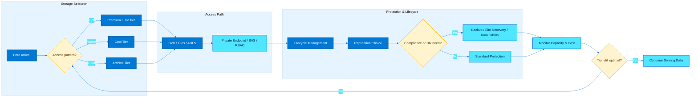

This workflow connects Azure storage tiering, access design, lifecycle policy, resilience choices, and ongoing cost review.
<!-- workflow-diagram:end -->

## Global variables used in examples

```bash
RG=<resource-group>
LOC=<location>
STG=<storage-account>
CONTAINER=<container-name>
SHARE=<share-name>
QUEUE=<queue-name>
TABLE=<table-name>
VAULT=<recovery-services-vault>
VM=<vm-name>
SUBNET_ID=<subnet-resource-id>
KEYVAULT_ID=<key-vault-resource-id>
DISK=<disk-name>
```

## Table of contents

1. [Storage Account Overview](#1-storage-account-overview)
2. [Blob Storage](#2-blob-storage)
3. [Azure Data Lake Storage Gen2](#3-azure-data-lake-storage-gen2)
4. [Azure Files](#4-azure-files)
5. [Azure Queue Storage](#5-azure-queue-storage)
6. [Azure Table Storage](#6-azure-table-storage)
7. [Azure Managed Disks](#7-azure-managed-disks)
8. [Storage Security](#8-storage-security)
9. [Storage Replication & Redundancy](#9-storage-replication--redundancy)
10. [Azure Backup](#10-azure-backup)
11. [Azure Site Recovery](#11-azure-site-recovery)
12. [Azure Data Box](#12-azure-data-box)
13. [AzCopy & Storage Explorer](#13-azcopy--storage-explorer)
14. [Storage Decision Guide](#14-storage-decision-guide)

---
## 1. Storage Account Overview

### Diagram

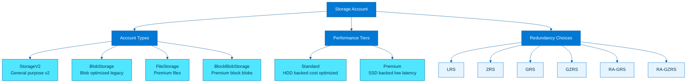

### Explanation

Azure Storage starts with the storage account, which defines the namespace, authentication boundary, region, replication model, and service endpoints for blobs, files, queues, and tables. Choosing the right account type, performance tier, and redundancy setting affects cost, resilience, latency, and the services you can enable later.

#### 1.1 Detail

Account type is about supported services and feature surface, while SKU is about pricing tier and redundancy combination. For example, a StorageV2 account can be Standard_LRS, Standard_ZRS, Standard_GRS, Standard_GZRS, Standard_RAGRS, or Standard_RAGZRS depending on region capability.

#### 1.2 Detail

Premium storage improves IOPS and latency but is workload-specific. FileStorage is only for Azure Files, BlockBlobStorage is only for block blobs, and premium managed disks are separate from storage account choices.

#### 1.3 Detail

Redundancy selection should be discussed with application owners because an app that is not region-failover aware gains little value from GRS alone.

### Key concepts

- **StorageV2** is the default and recommended account type because it supports blobs, files, queues, tables, lifecycle management, Data Lake Storage Gen2, static website, and most modern features.

- **BlobStorage** is a legacy account focused on blobs only; most new deployments should prefer StorageV2 unless there is a migration-specific reason.

- **FileStorage** is a premium account type optimized for Azure Files workloads that need predictable low-latency SSD-backed file shares.

- **BlockBlobStorage** is a premium account optimized for block blobs, typically used for high transaction rates and analytics or media workloads.

- **Standard** accounts use HDD-backed infrastructure and fit general-purpose workloads where cost efficiency matters more than ultra-low latency.

- **Premium** accounts use SSD-backed infrastructure and are appropriate for latency-sensitive workloads like premium file shares, premium page blobs, or high-performance block blobs.

- **LRS** keeps three copies in one datacenter, **ZRS** synchronously spans availability zones, **GRS/GZRS** add a secondary region, and **RA-** variants permit read access to the secondary.

- Redundancy selection is constrained by region support, storage service type, and whether zone-level resilience or regional disaster recovery is the main objective.

### Additional notes

- A storage account name is globally unique and becomes part of the public DNS name.

- Many capabilities, including Data Lake Storage Gen2 and some redundancy modes, must be chosen at creation time or have limited migration paths.

- Changing redundancy can incur replication time, cost impact, and temporary operational considerations.

### Azure CLI commands

```bash
# Create a general-purpose v2 account
az storage account create \
  --name $STG \
  --resource-group $RG \
  --location $LOC \
  --sku Standard_LRS \
  --kind StorageV2 \
  --https-only true \
  --min-tls-version TLS1_2

# Create a premium FileStorage account
az storage account create \
  --name ${STG}files \
  --resource-group $RG \
  --location $LOC \
  --sku Premium_LRS \
  --kind FileStorage

# Create a premium BlockBlobStorage account
az storage account create \
  --name ${STG}blob \
  --resource-group $RG \
  --location $LOC \
  --sku Premium_LRS \
  --kind BlockBlobStorage

# Show account properties
az storage account show \
  --name $STG \
  --resource-group $RG

# Update redundancy to ZRS where supported
az storage account update \
  --name $STG \
  --resource-group $RG \
  --sku Standard_ZRS

# List account keys
az storage account keys list \
  --resource-group $RG \
  --account-name $STG

# Show service endpoints
az storage account show \
  --name $STG \
  --resource-group $RG \
  --query "primaryEndpoints"

# Enable hierarchical namespace on create for ADLS Gen2
az storage account create \
  --name ${STG}dls \
  --resource-group $RG \
  --location $LOC \
  --sku Standard_LRS \
  --kind StorageV2 \
  --hierarchical-namespace true
```

### Best practices

- Use StorageV2 unless a workload explicitly needs premium FileStorage or premium BlockBlobStorage semantics.

- Standardize naming, TLS 1.2+, HTTPS-only, and infrastructure-as-code for all storage account provisioning.

- Match redundancy to business RPO/RTO instead of always choosing the cheapest or most expensive SKU.

- Check region-specific support before selecting ZRS, GZRS, or premium account types.

- Separate production, non-production, and highly regulated workloads into different accounts to reduce blast radius and simplify governance.

- Plan for service limits such as account throughput, object scale, and per-account networking rules before consolidating many workloads into one account.

---

## 2. Blob Storage

### Diagram

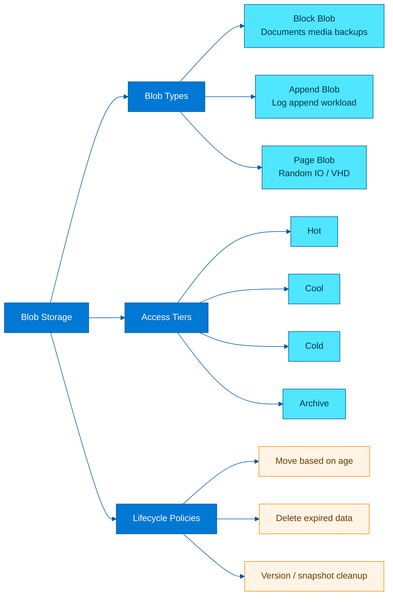

### Explanation

Blob Storage is Azure's massively scalable object store for unstructured data. It is the default choice for documents, backups, media, analytics landing zones, application assets, and log archives. Blob data lives inside containers and each object can be addressed over HTTPS or via SDKs, REST, NFS 3.0, or ABFS in Gen2-enabled accounts.

#### 2.1 Detail

Block blobs are composed of blocks uploaded independently and committed together, enabling parallel uploads and resumable patterns. This is why they dominate modern cloud-native file and object use cases.

#### 2.2 Detail

Append blobs expose append block semantics that reduce accidental overwrite risk for log pipelines, though they are not a substitute for centralized observability platforms.

#### 2.3 Detail

Page blobs allow byte-range updates in 512-byte pages, which makes them suitable for virtual disk style access but usually not for general object workloads.

### Key concepts

- **Block blobs** are the default and best for streaming uploads, files, images, backups, and data lake ingestion pipelines.

- **Append blobs** are optimized for append-only patterns such as application logs where blocks are continuously added to the end.

- **Page blobs** support random read/write operations and are the underlying format for unmanaged VHD scenarios and specialized workloads.

- Access tiers help balance cost and retrieval latency: **Hot** for frequent access, **Cool** for infrequent access, **Cold** for lower-cost long-lived rarely accessed data, and **Archive** for offline retention with rehydration delay.

- Lifecycle management policies automate moves between tiers and deletion of expired blobs, snapshots, and versions.

- Blob versioning, soft delete, change feed, and point-in-time restore improve data protection and operational recovery.

- Container namespace design matters: organize data by environment, application, retention domain, and analytics partitioning patterns.

- Blob index tags enable policy, search, and conditional lifecycle operations beyond prefix-based naming.

### Additional notes

- Cold tier availability depends on account and region support and sits between Cool and Archive for cost/latency trade-offs.

- Archive blobs must be rehydrated before they can be read; this is not an interactive tier.

- Lifecycle policies can target base blobs, versions, and snapshots using conditions like days after creation or last access.

### Azure CLI commands

```bash
# Create a container using Azure AD login context
az storage container create \
  --account-name $STG \
  --name $CONTAINER \
  --auth-mode login

# Upload a file to blob storage
az storage blob upload \
  --account-name $STG \
  --container-name $CONTAINER \
  --name sample.txt \
  --file ./sample.txt \
  --auth-mode login

# Upload and set blob tier to cool
az storage blob upload \
  --account-name $STG \
  --container-name $CONTAINER \
  --name archive/report.csv \
  --file ./report.csv \
  --tier Cool \
  --auth-mode login

# Change access tier later
az storage blob set-tier \
  --account-name $STG \
  --container-name $CONTAINER \
  --name archive/report.csv \
  --tier Archive \
  --auth-mode login

# List blobs with metadata
az storage blob list \
  --account-name $STG \
  --container-name $CONTAINER \
  --include metadata tags versions deleted \
  --auth-mode login

# Enable blob soft delete, versioning, and change feed
az storage account blob-service-properties update \
  --account-name $STG \
  --resource-group $RG \
  --enable-delete-retention true \
  --delete-retention-days 14 \
  --enable-versioning true \
  --enable-change-feed true

# Apply a lifecycle management policy from JSON
az storage account management-policy create \
  --account-name $STG \
  --resource-group $RG \
  --policy @lifecycle-policy.json

# Show lifecycle policy
az storage account management-policy show \
  --account-name $STG \
  --resource-group $RG
```

### Best practices

- Default to block blobs unless the write pattern is truly append-only or random IO oriented.

- Use lifecycle policies to move stale data automatically; manual tiering at scale is error-prone.

- Test retrieval time and rehydration expectations before placing operationally important data in Archive tier.

- Enable soft delete, versioning, and container deletion protection for critical datasets.

- Use blob index tags and predictable prefixes to simplify governance, search, chargeback, and data retention automation.

- Avoid storing millions of unrelated workloads in a single flat container without naming conventions or policy boundaries.

---

## 3. Azure Data Lake Storage Gen2

### Diagram

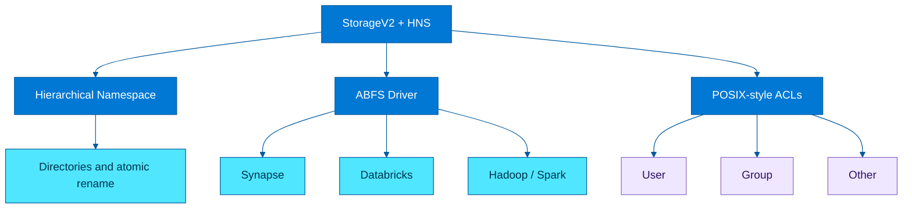

### Explanation

Azure Data Lake Storage Gen2 is Blob Storage enhanced with a hierarchical namespace (HNS). HNS turns the flat object namespace into directories and files, enabling atomic rename, directory-level operations, and POSIX-like access control lists. This makes it ideal for analytics platforms that expect filesystem behavior at cloud scale.

#### 3.1 Detail

Synapse serverless SQL can query files in ADLS Gen2 directly, while Spark pools and Databricks clusters use the storage account as a lakehouse backbone.

#### 3.2 Detail

Atomic rename is one of the biggest practical differentiators versus flat blob namespaces because many distributed processing frameworks write temporary output and rename it into place at job commit time.

#### 3.3 Detail

ACL entries support user, group, mask, and other permissions, with default ACLs propagating to newly created child objects when configured on directories.

### Key concepts

- HNS improves big data job efficiency by avoiding expensive recursive listing and rename patterns common in analytics frameworks.

- The **ABFS** driver gives Hadoop/Spark-compatible tools a filesystem interface over ADLS Gen2.

- ACLs add fine-grained authorization at filesystem, directory, and file level beyond coarse RBAC.

- Synapse, Databricks, HDInsight, and other Spark engines integrate natively with ADLS Gen2 for landing, bronze/silver/gold lakehouse zones, and external tables.

- ADLS Gen2 still uses blob containers, but when HNS is enabled those containers are often referred to as filesystems.

- Directory renames are atomic, which is especially important for commit protocols and partition publication in data engineering jobs.

- ACL inheritance simplifies managing access for folders such as `/raw`, `/curated`, `/finance`, or `/ml-feature-store`.

- RBAC and ACLs work together: RBAC authorizes access to the account or container scope, and ACLs refine access within the namespace.

### Additional notes

- Enabling HNS changes namespace semantics and is beneficial for analytics, but may slightly alter behavior for some legacy applications expecting flat blob semantics.

- ABFS URIs commonly look like `abfss://filesystem@account.dfs.core.windows.net/path`.

- In enterprise deployments, ACL troubleshooting usually involves both RBAC and POSIX-style permissions.

### Azure CLI commands

```bash
# Create a StorageV2 account with hierarchical namespace enabled
az storage account create \
  --name $STG \
  --resource-group $RG \
  --location $LOC \
  --sku Standard_LRS \
  --kind StorageV2 \
  --hierarchical-namespace true

# Create a filesystem (container)
az storage fs create \
  --account-name $STG \
  --name raw \
  --auth-mode login

# Create a directory
az storage fs directory create \
  --account-name $STG \
  --file-system raw \
  --name landing/2025/01/01 \
  --auth-mode login

# Upload a file into ADLS Gen2
az storage fs file upload \
  --account-name $STG \
  --file-system raw \
  --path landing/2025/01/01/events.json \
  --source ./events.json \
  --auth-mode login

# List paths recursively
az storage fs file list \
  --account-name $STG \
  --file-system raw \
  --path landing \
  --recursive true \
  --auth-mode login

# Set ACL recursively on a path
az storage fs access set-recursive \
  --account-name $STG \
  --file-system raw \
  --path landing \
  --acl "user::rwx,group::r-x,other::---,mask::rwx" \
  --auth-mode login

# View ACL on a specific file or directory
az storage fs access show \
  --account-name $STG \
  --file-system raw \
  --path landing/2025/01/01 \
  --auth-mode login
```

### Best practices

- Enable hierarchical namespace at creation time for analytics-focused accounts; retrofitting architecture later is harder.

- Design folder structures for lifecycle, security, and query pruning rather than mirroring on-prem drives blindly.

- Use groups instead of individual user ACLs wherever possible to keep access management maintainable.

- Combine RBAC for coarse access with ACLs for fine-grained folder governance.

- Standardize landing, raw, curated, and serving zones with documented ownership and retention.

- Validate ABFS configuration, identity passthrough, and metastore integration early in Synapse or Databricks projects.

---

## 4. Azure Files

### Diagram

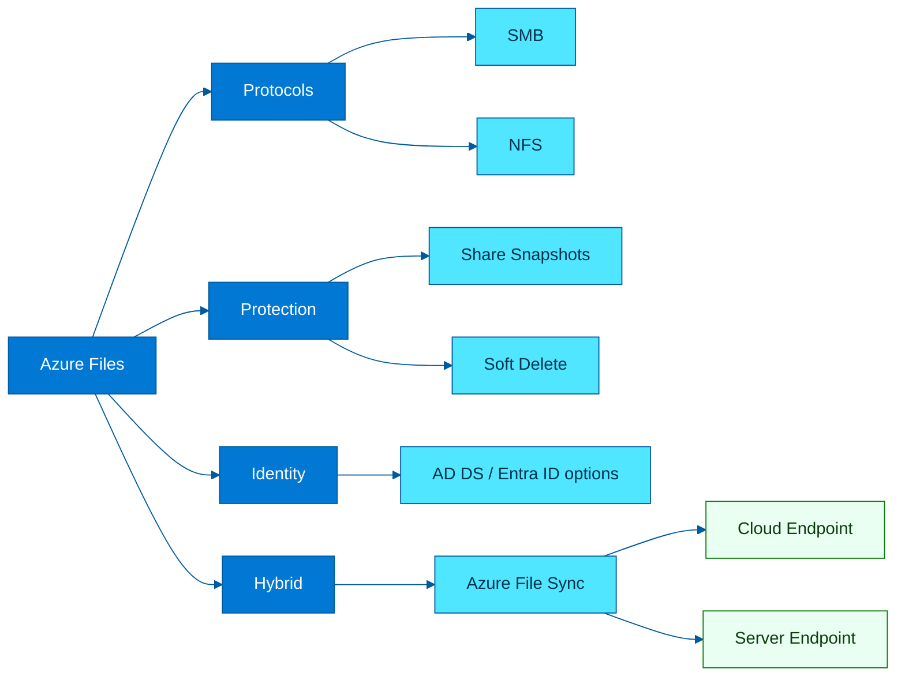

### Explanation

Azure Files provides fully managed cloud file shares that can be mounted concurrently by many clients over SMB or NFS. It is suited for lift-and-shift file shares, user profiles, shared app content, and hybrid file consolidation. Premium Azure Files is SSD-backed, while standard shares are cost-optimized for broader capacity use cases.

#### 4.1 Detail

Azure Files is a platform file service, not a block disk. This means multiple clients can mount the same share, which differs fundamentally from managed disks attached to VMs.

#### 4.2 Detail

Soft delete protects at the share level, while snapshots capture share contents at a point in time. Together they help with human error and ransomware recovery patterns.

#### 4.3 Detail

Authentication choices affect user experience, security posture, and operational complexity; AD DS or Entra-based identity models are usually better than distributing storage keys.

### Key concepts

- **SMB shares** support Windows/Linux/macOS scenarios and can integrate with directory-based authentication.

- **NFS shares** target Linux-based workloads requiring POSIX-style semantics without SMB overhead.

- **Azure File Sync** caches frequently used files on Windows Servers while the cloud share remains authoritative, enabling branch-office acceleration and multi-site sync.

- **Share snapshots** provide point-in-time recovery for accidental deletes or corruption events.

- **Soft delete** protects shares from accidental removal for a retention window.

- AD DS authentication allows identity-based access to Azure Files instead of storage account keys for SMB scenarios.

- Premium FileStorage accounts provide predictable performance for I/O-sensitive file workloads.

- Large file shares and zone-redundant options depend on region, account type, and protocol support.

### Additional notes

- AD DS authentication setup for Azure Files includes domain join configuration on the storage account and directory permissions alignment; these steps are broader than one CLI snippet.

- Azure File Sync primarily targets Windows Server environments and is managed through the Storage Sync Service resource.

- Snapshots are share-level and support browsing previous versions in many SMB workflows.

### Azure CLI commands

```bash
# Create a premium file storage account
az storage account create \
  --name $STG \
  --resource-group $RG \
  --location $LOC \
  --sku Premium_LRS \
  --kind FileStorage

# Create an SMB file share
az storage share-rm create \
  --resource-group $RG \
  --storage-account $STG \
  --name $SHARE \
  --quota 1024 \
  --enabled-protocols SMB

# Create an NFS file share (region/account support required)
az storage share-rm create \
  --resource-group $RG \
  --storage-account $STG \
  --name ${SHARE}nfs \
  --quota 1024 \
  --enabled-protocols NFS

# List shares
az storage share-rm list \
  --resource-group $RG \
  --storage-account $STG

# Enable soft delete for file shares
az storage account file-service-properties update \
  --resource-group $RG \
  --account-name $STG \
  --enable-delete-retention true \
  --delete-retention-days 14

# Create a share snapshot
az storage share snapshot \
  --account-name $STG \
  --name $SHARE \
  --auth-mode login

# Upload a file into a share
az storage file upload \
  --account-name $STG \
  --share-name $SHARE \
  --source ./app.config \
  --path app/app.config \
  --auth-mode login

# Download a file from a share
az storage file download \
  --account-name $STG \
  --share-name $SHARE \
  --path app/app.config \
  --dest ./app.config.downloaded \
  --auth-mode login
```

### Best practices

- Choose SMB for Windows compatibility and enterprise identity integration; choose NFS for Linux-native applications that require that protocol specifically.

- Use Azure File Sync when you need local cache, cloud tiering, or a gradual migration from on-prem Windows file servers.

- Enable share soft delete and use regular snapshots for business-critical shares.

- Prefer identity-based authentication over storage keys for interactive user access.

- Size premium shares for performance and validate throughput/IOPS expectations with realistic tests.

- Review firewall rules, private endpoints, and DNS resolution before rolling out hybrid mounts at scale.

---

## 5. Azure Queue Storage

### Diagram

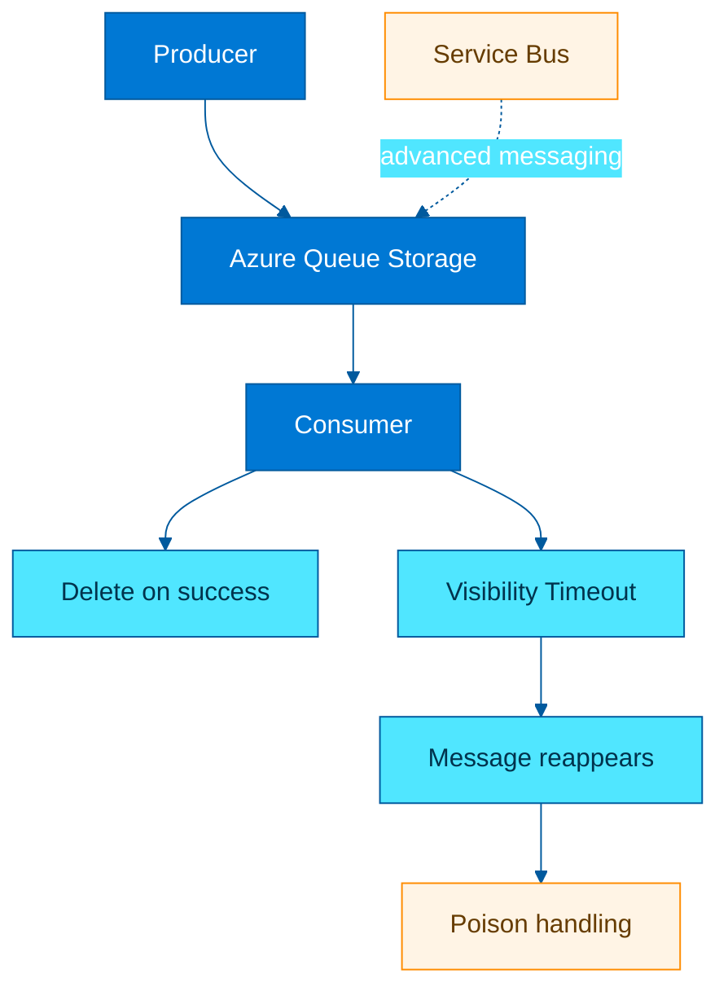

### Explanation

Azure Queue Storage is a simple, cost-effective message queue for decoupling components through asynchronous work processing. It fits lightweight background jobs, buffering bursts, and simple distributed workflows where advanced broker features are unnecessary.

#### 5.1 Detail

Queue Storage is part of the storage account billing and operational model, making it attractive for lightweight solutions already using Azure Storage.

#### 5.2 Detail

Service Bus becomes the better choice when workflows need FIFO with sessions, pub/sub topics, duplicate detection, transactions, scheduled delivery, or automatic dead-lettering.

#### 5.3 Detail

A common cloud pattern is blob-plus-queue: upload the data file to a container, then enqueue a message that contains the blob URL, tenant context, and correlation ID.

### Key concepts

- Producers insert messages, consumers retrieve them, process work, and delete on success.

- A **visibility timeout** hides a dequeued message temporarily so other consumers do not process it at the same time.

- If processing fails and the message is not deleted, it becomes visible again after the timeout.

- **Poison messages** are repeatedly failing messages; applications usually move them to a dead-letter or poison queue pattern after a dequeue count threshold.

- Queue Storage is simple and cheap, but does not provide the richer routing, ordering, sessions, dead-letter queues, transactions, or protocol features of Azure Service Bus.

- Message size and semantics are best for small units of work; large payloads are often stored in blobs with only a reference placed on the queue.

- Queue Storage integrates well with Azure Functions queue triggers for serverless consumers.

- Visibility timeout must exceed normal processing time but stay short enough to avoid excessive retry delays during failures.

### Additional notes

- Queue Storage provides at-least-once delivery, so duplicate processing must be tolerated.

- Unlike Service Bus, Queue Storage does not have built-in dead-letter queues; poison handling is application-driven.

- The dequeue count property is useful for retry thresholds.

### Azure CLI commands

```bash
# Create a queue
az storage queue create \
  --account-name $STG \
  --name $QUEUE \
  --auth-mode login

# Put a message on the queue
az storage message put \
  --account-name $STG \
  --queue-name $QUEUE \
  --content '{"jobId":101,"blob":"input/file1.csv"}' \
  --auth-mode login

# Peek messages without changing visibility
az storage message peek \
  --account-name $STG \
  --queue-name $QUEUE \
  --num-messages 5 \
  --auth-mode login

# Get a message with visibility timeout
az storage message get \
  --account-name $STG \
  --queue-name $QUEUE \
  --num-messages 1 \
  --visibility-timeout 120 \
  --auth-mode login

# Clear a queue
az storage message clear \
  --account-name $STG \
  --queue-name $QUEUE \
  --auth-mode login

# List queues
az storage queue list \
  --account-name $STG \
  --auth-mode login
```

### Best practices

- Use Queue Storage for simple asynchronous processing and Service Bus when you need enterprise messaging capabilities.

- Keep messages small and idempotent; store large payloads in Blob Storage and pass references.

- Implement poison-message handling explicitly in the consumer application.

- Tune visibility timeout based on realistic job duration and retry policy.

- Use monitoring on queue depth and oldest message age to detect backlog before SLAs are breached.

- Design consumers to be idempotent because messages can be delivered more than once.

---

## 6. Azure Table Storage

### Diagram

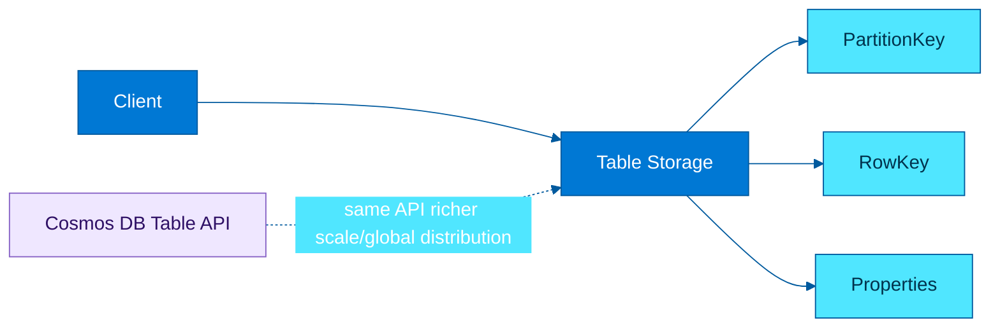

### Explanation

Azure Table Storage is a schemaless NoSQL key-value store for large amounts of structured non-relational data. Each entity is identified by a combination of PartitionKey and RowKey, and properties can differ across entities. It is good for simple metadata, device state, inventory, or application lookup data when query patterns are known in advance.

#### 6.1 Detail

PartitionKey/RowKey design is the main success factor. A strong design avoids hotspots, supports range scans where needed, and keeps entities logically grouped for batch operations.

#### 6.2 Detail

Azure Table Storage is deliberately simple. If application requirements start resembling a multi-region operational database, it is usually time to evaluate Cosmos DB or another purpose-built service.

#### 6.3 Detail

Because the service is schemaless, governance should define required fields at the application layer to avoid inconsistent entities.

### Key concepts

- **PartitionKey** determines the scalability boundary and strongly influences throughput distribution.

- **RowKey** uniquely identifies an entity within a partition and supports efficient point lookups.

- Entities are sparse and schemaless, so different rows can have different properties.

- Table Storage is cost-effective for basic key-value access patterns, but query capabilities are more limited than document databases.

- Cosmos DB Table API uses the same table programming model while adding global distribution, automatic indexing, lower-latency SLAs, and richer scale characteristics.

- Hot partitions can become bottlenecks, so partition design is a first-class architecture choice.

- There are no foreign keys or joins; denormalization is expected.

- Table workloads often pair well with queues or blobs, where blobs store large content and table entities store metadata or indexing fields.

### Additional notes

- The Azure CLI has limited day-to-day entity management compared with SDKs; architecture and account setup are the main CLI-driven tasks here.

- Cosmos DB Table API is not the same pricing or behavior as Azure Table Storage even though the programming model is similar.

- Batch transactions are partition-scoped.

### Azure CLI commands

```bash
# Create a table
az storage table create \
  --account-name $STG \
  --name $TABLE \
  --auth-mode login

# List tables
az storage table list \
  --account-name $STG \
  --auth-mode login

# Create SAS for a table service scope
EXPIRY=$(date -u -v+1d '+%Y-%m-%dT%H:%MZ')
az storage account generate-sas \
  --account-name $STG \
  --services t \
  --resource-types sco \
  --permissions rlacup \
  --expiry $EXPIRY \
  --https-only

# Show storage account endpoints including table
az storage account show \
  --name $STG \
  --resource-group $RG \
  --query "primaryEndpoints.table"

# Note: entity CRUD is commonly handled with SDKs/REST because CLI table entity support is limited by extension/version.
```

### Best practices

- Design PartitionKey to spread load evenly while preserving efficient query boundaries.

- Use RowKey values that support deterministic lookup and optional sort semantics.

- If you need global distribution, automatic indexing, or richer performance SLAs, consider Cosmos DB Table API instead.

- Model entities around application query patterns, not around relational normalization rules.

- Avoid unbounded growth in a single hot partition such as `PartitionKey='all'`.

- Pair Table Storage with monitoring to detect skewed partitions and rising latency.

---

## 7. Azure Managed Disks

### Diagram

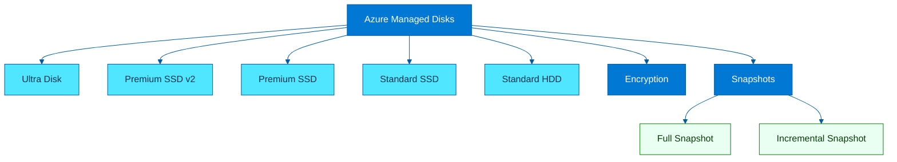

### Explanation

Azure Managed Disks are block-level storage volumes for Azure VMs. Microsoft manages the underlying storage account complexity, placement, and durability. Disk selection should be driven by IOPS, throughput, latency sensitivity, bursting behavior, availability zone needs, and cost.

#### 7.1 Detail

Ultra Disk and Premium SSD v2 offer more granular performance tuning than legacy fixed-size performance mappings, which can reduce overprovisioning in certain designs.

#### 7.2 Detail

Premium SSD remains the most common enterprise default because it balances simplicity, performance, and compatibility across many VM and region combinations.

#### 7.3 Detail

Snapshots are separate resources billed independently; retention planning matters or storage costs can silently grow over time.

### Key concepts

- **Ultra Disk** offers the highest performance and configurable IOPS/throughput for mission-critical data-intensive workloads.

- **Premium SSD v2** provides flexible performance tuning with lower cost than Ultra for many enterprise applications.

- **Premium SSD** is the mainstream choice for production workloads requiring low latency and predictable performance.

- **Standard SSD** is good for lightly used production, web servers, dev/test, and cost-sensitive workloads needing better consistency than HDD.

- **Standard HDD** is the lowest-cost option for infrequent access, backups, or less performance-sensitive environments.

- Managed disks support server-side encryption, disk encryption sets, snapshots, images, and shared disk scenarios depending on SKU.

- Incremental snapshots capture only changed blocks since the previous snapshot, reducing cost and creation time for repeated protection points.

- Disk choice also interacts with VM size limits because the VM determines how many disks, IOPS, and throughput can be consumed.

### Additional notes

- Managed disks are not shared file storage; they attach to VMs as block devices.

- Azure Backup can orchestrate VM-consistent backup around managed disks without requiring you to script every snapshot directly.

- Disk redundancy SKUs such as ZRS snapshot options vary by resource type and region.

### Azure CLI commands

```bash
# Create a premium SSD managed disk
az disk create \
  --resource-group $RG \
  --name $DISK \
  --location $LOC \
  --sku Premium_LRS \
  --size-gb 128

# Create a Premium SSD v2 disk
az disk create \
  --resource-group $RG \
  --name ${DISK}v2 \
  --location $LOC \
  --sku PremiumV2_LRS \
  --size-gb 256

# Create an Ultra disk (supported VM/zone/region required)
az disk create \
  --resource-group $RG \
  --name ${DISK}ultra \
  --location $LOC \
  --sku UltraSSD_LRS \
  --size-gb 1024 \
  --disk-iops-read-write 5000 \
  --disk-mbps-read-write 200

# Enable encryption with a disk encryption set
az disk update \
  --resource-group $RG \
  --name $DISK \
  --disk-encryption-set /subscriptions/<sub>/resourceGroups/$RG/providers/Microsoft.Compute/diskEncryptionSets/<des-name>

# Create a snapshot from a managed disk
az snapshot create \
  --resource-group $RG \
  --name ${DISK}-snap01 \
  --source $DISK \
  --location $LOC

# Create an incremental snapshot
az snapshot create \
  --resource-group $RG \
  --name ${DISK}-isnap01 \
  --source $DISK \
  --location $LOC \
  --incremental true

# Show disk details
az disk show \
  --resource-group $RG \
  --name $DISK
```

### Best practices

- Start disk sizing from application latency, IOPS, and throughput measurements rather than disk brand preference.

- Validate VM SKU limits because a powerful disk attached to an undersized VM will not deliver expected performance.

- Use Premium SSD or Premium SSD v2 for most production transactional workloads.

- Reserve Ultra disks for workloads that genuinely need the higher configurable performance and justify the cost.

- Use incremental snapshots for frequent protection points to reduce storage consumption.

- Encrypt disks with customer-managed keys when compliance requires key ownership separation.

---

## 8. Storage Security

### Diagram

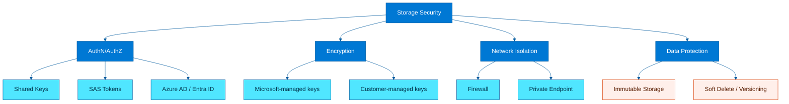

### Explanation

Storage security combines identity, encryption, network controls, and immutability. The strongest design minimizes shared secrets, restricts public network exposure, enforces encryption with modern key management, and adds recovery/immutability controls for ransomware or insider-risk scenarios.

#### 8.1 Detail

Shared keys are operationally convenient but often violate zero-trust principles because they bypass user-level accountability and are hard to scope narrowly.

#### 8.2 Detail

Private endpoints are preferred over service endpoints when the requirement is private IP-based access and tighter exfiltration control. They do, however, require proper private DNS setup to avoid confusing connectivity failures.

#### 8.3 Detail

Security posture should be measured continuously with Azure Policy, Defender for Cloud, activity logs, diagnostic logs, and storage-specific alerting.

### Key concepts

- **Shared keys** authenticate with storage account access keys; they are powerful but broad and harder to govern safely.

- **SAS tokens** delegate time-bound access. Types include **account SAS**, **service SAS**, and **user delegation SAS**.

- **User delegation SAS** is generally preferred for blob and Data Lake scenarios because it is derived from Azure AD credentials instead of account keys.

- **Azure AD / Microsoft Entra ID** enables RBAC-based access to data and management plane operations.

- Encryption at rest is enabled by default with Microsoft-managed keys, and customer-managed keys can be supplied through Key Vault for regulated workloads.

- Immutable storage via time-based retention or legal hold helps protect WORM datasets such as compliance archives or audit evidence.

- Private endpoints keep traffic on private IPs inside a virtual network and are preferred over public endpoints for high-security environments.

- Defense-in-depth also includes minimum TLS version, firewall rules, trusted Microsoft services exceptions, Defender for Storage, and logging.

### Additional notes

- Account SAS and service SAS can be signed with account keys, which increases blast radius if keys leak.

- Customer-managed keys require Key Vault availability and lifecycle planning; lost key access can make data unreadable.

- Immutable storage is powerful but must be tested with governance processes because retention locks are intentionally restrictive.

### Azure CLI commands

```bash
# Disable shared key access when possible
az storage account update \
  --name $STG \
  --resource-group $RG \
  --allow-shared-key-access false

# Assign a data access role to a user or service principal
az role assignment create \
  --assignee <principal-id> \
  --role "Storage Blob Data Contributor" \
  --scope /subscriptions/<sub>/resourceGroups/$RG/providers/Microsoft.Storage/storageAccounts/$STG

# Generate an account SAS (broad scope; use carefully)
EXPIRY=$(date -u -v+1d '+%Y-%m-%dT%H:%MZ')
az storage account generate-sas \
  --account-name $STG \
  --services bqtf \
  --resource-types sco \
  --permissions racwdlup \
  --expiry $EXPIRY \
  --https-only

# Generate a user delegation SAS for a blob container
az storage container generate-sas \
  --account-name $STG \
  --name $CONTAINER \
  --permissions rl \
  --expiry $EXPIRY \
  --auth-mode login \
  --as-user

# Enable customer-managed keys for the storage account
az storage account update \
  --name $STG \
  --resource-group $RG \
  --encryption-key-source Microsoft.Keyvault \
  --encryption-key-vault $KEYVAULT_ID \
  --encryption-key-name <key-name> \
  --encryption-key-version <key-version>

# Restrict public network access
az storage account update \
  --name $STG \
  --resource-group $RG \
  --default-action Deny

# Create a private endpoint for blob access
az network private-endpoint create \
  --name ${STG}-pe-blob \
  --resource-group $RG \
  --location $LOC \
  --subnet $SUBNET_ID \
  --private-connection-resource-id /subscriptions/<sub>/resourceGroups/$RG/providers/Microsoft.Storage/storageAccounts/$STG \
  --group-id blob \
  --connection-name ${STG}-blob-conn

# Enable immutable storage with versioning on a new container where supported
az storage container-rm create \
  --storage-account $STG \
  --resource-group $RG \
  --name locked-data \
  --enable-immutability-policy true \
  --enable-version-level-worm true
```

### Best practices

- Prefer Azure AD data-plane authorization and user delegation SAS over account keys wherever tooling permits.

- Disable shared key access on sensitive accounts after validating workloads no longer depend on it.

- Use private endpoints plus DNS integration for production environments that should avoid public internet exposure.

- Rotate keys and CMK versions with documented procedures and monitoring.

- Enable soft delete, versioning, and immutable storage according to ransomware and compliance requirements.

- Grant least privilege RBAC roles at the smallest practical scope.

---

## 9. Storage Replication & Redundancy

### Diagram

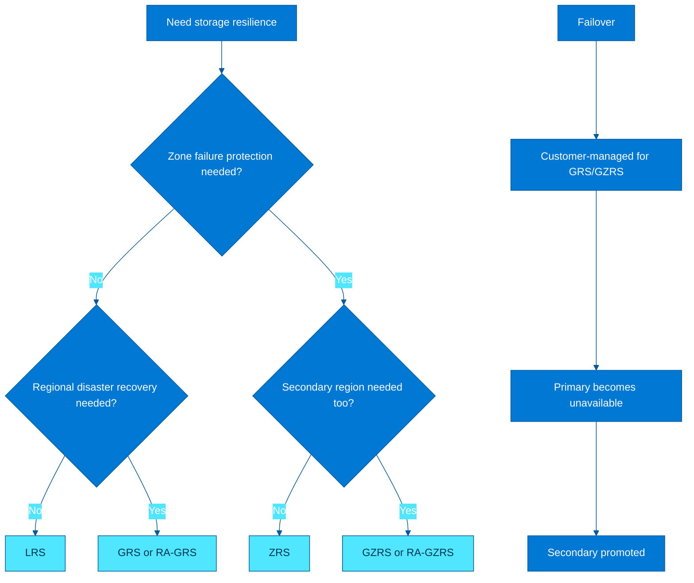

### Explanation

Redundancy options determine how Azure stores copies of your data across datacenters, zones, and paired regions. The right model depends on whether you are protecting against device/server failure, zone outage, or complete regional disaster, and whether read access to the secondary matters before failover.

#### 9.1 Detail

LRS is often sufficient for non-critical or easily reproducible data. ZRS is a strong default for many production apps that want intra-region resiliency without cross-region complexity.

#### 9.2 Detail

GRS/GZRS protect against full regional loss but do not magically fail over your application stack. Compute, DNS, secrets, network paths, and operational procedures must also be ready.

#### 9.3 Detail

The decision tree is simple: start with zone resilience, then ask whether regional DR is required, then decide whether secondary read access is valuable.

### Key concepts

- **LRS** keeps three synchronous copies in one datacenter and protects against local hardware failures only.

- **ZRS** synchronously stores data across availability zones in the same region and is ideal when zone-level resilience is required.

- **GRS** combines LRS in the primary with asynchronous replication to a paired secondary region.

- **RA-GRS** adds read access to the secondary region endpoint before any failover event.

- **GZRS** combines ZRS in the primary region with asynchronous secondary-region replication.

- **RA-GZRS** adds readable secondary-region access to GZRS.

- Regional failover for geo-redundant storage is customer-initiated for many scenarios and should be treated as a major event.

- Applications still need their own failover strategy, DNS design, and testing because storage redundancy alone does not make the whole application resilient.

### Additional notes

- Geo-replication lag is asynchronous, so recent writes may not exist in the secondary during a catastrophic event.

- Failover is a significant operation and changes the account's primary region role.

- Region pair behavior and service support should be verified for each workload.

### Azure CLI commands

```bash
# Create accounts with different redundancy models
az storage account create \
  --name ${STG}lrs \
  --resource-group $RG \
  --location $LOC \
  --sku Standard_LRS \
  --kind StorageV2

az storage account create \
  --name ${STG}zrs \
  --resource-group $RG \
  --location $LOC \
  --sku Standard_ZRS \
  --kind StorageV2

az storage account create \
  --name ${STG}grs \
  --resource-group $RG \
  --location $LOC \
  --sku Standard_GRS \
  --kind StorageV2

az storage account create \
  --name ${STG}gzrs \
  --resource-group $RG \
  --location $LOC \
  --sku Standard_GZRS \
  --kind StorageV2

# Check geo-replication stats
az storage account show \
  --name $STG \
  --resource-group $RG \
  --query "geoReplicationStats"

# Trigger account failover for RA-GRS/GRS or RA-GZRS/GZRS where appropriate
az storage account failover \
  --name $STG \
  --resource-group $RG

# Query secondary endpoints for read-access configurations
az storage account show \
  --name $STG \
  --resource-group $RG \
  --query "secondaryEndpoints"
```

### Best practices

- Use ZRS when zone outage tolerance matters and the region supports it.

- Use GRS or GZRS only if the application has a documented regional disaster recovery plan.

- Prefer RA-* variants when read-only access to the secondary benefits reporting or validation scenarios.

- Test failover runbooks and downstream DNS/application behavior; storage redundancy is only one layer.

- Do not assume asynchronous geo-replication equals zero data loss; understand the RPO implications.

- Choose the simplest redundancy tier that satisfies business continuity needs and budget.

---

## 10. Azure Backup

### Diagram

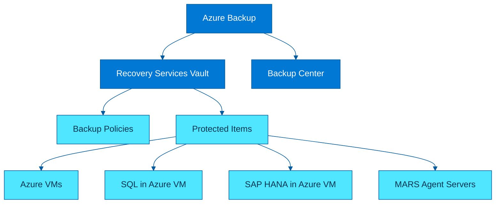

### Explanation

Azure Backup is a policy-driven backup service centered around the Recovery Services vault. It protects Azure VMs, SQL Server in Azure VMs, SAP HANA in Azure VMs, Azure Files, and hybrid/on-prem servers with workload-aware recovery options. Backup Center gives a single pane of glass across vaults and subscriptions.

#### 10.1 Detail

Backup Center does not replace vaults; it provides a centralized management and reporting layer across them.

#### 10.2 Detail

Recovery Services vaults also underpin Azure Site Recovery in many designs, though backup and replication are separate capabilities with different policies and objectives.

#### 10.3 Detail

For cyber resilience, protecting the backup control plane is as important as capturing backup data itself.

### Key concepts

- The **Recovery Services vault** is the management boundary for backup policies, recovery points, protected items, and restore operations.

- Backup policies define retention such as daily, weekly, monthly, and yearly recovery points.

- **MARS agent** protects files, folders, and system state from physical servers or unsupported VM patterns directly to a vault.

- Azure VM backup captures application-consistent or crash-consistent recovery points depending on agent/workload state.

- SQL and SAP HANA backups inside Azure VMs are workload-aware and support log backup chains, point-in-time restore, and long retention.

- Backup Center centralizes monitoring, compliance, and operations across backup estates.

- Soft delete and multi-user authorization features reduce risk from accidental or malicious deletion of backups.

- Vault choice, region placement, and redundancy affect recovery strategy and compliance posture.

### Additional notes

- MARS is useful for file/folder backup on servers, but Azure Backup Server or workload-aware backup may be better for broader enterprise backup cases.

- Some advanced restore actions, policy authoring, and workload discovery steps can require portal or PowerShell in addition to CLI.

- Geo-redundant backup storage improves durability but should still align with enterprise recovery design.

### Azure CLI commands

```bash
# Create a Recovery Services vault
az backup vault create \
  --name $VAULT \
  --resource-group $RG \
  --location $LOC

# Set vault storage redundancy
az backup vault backup-properties set \
  --name $VAULT \
  --resource-group $RG \
  --backup-storage-redundancy GeoRedundant

# Register a VM container in the vault
az backup container register \
  --resource-group $RG \
  --vault-name $VAULT \
  --container-name $VM \
  --workload-type VM

# Enable backup for a VM using a policy
az backup protection enable-for-vm \
  --resource-group $RG \
  --vault-name $VAULT \
  --vm $VM \
  --policy-name DefaultPolicy

# Trigger an on-demand backup
az backup protection backup-now \
  --resource-group $RG \
  --vault-name $VAULT \
  --container-name IaasVMContainer;iaasvmcontainerv2;$RG;$VM \
  --item-name $VM \
  --retain-until 2025-12-31

# List backup jobs
az backup job list \
  --resource-group $RG \
  --vault-name $VAULT \
  --output table

# List recovery points for a VM
az backup recoverypoint list \
  --resource-group $RG \
  --vault-name $VAULT \
  --container-name IaasVMContainer;iaasvmcontainerv2;$RG;$VM \
  --item-name $VM
```

### Best practices

- Use separate vaults or policy domains for production and non-production where governance differs.

- Map retention to legal, operational, and cyber-recovery needs rather than copying default policies blindly.

- Test restores regularly; backup success without restore validation is incomplete protection.

- Use workload-aware backups for SQL and SAP HANA when application-level recovery objectives matter.

- Secure backup administration with RBAC, soft delete, and approval-based controls where available.

- Monitor failed jobs, aging recovery points, and vault redundancy settings in Backup Center.

---

## 11. Azure Site Recovery

### Diagram

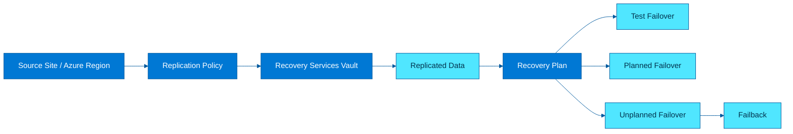

### Explanation

Azure Site Recovery (ASR) is a disaster recovery service that continuously replicates workloads and orchestrates failover, failback, and recovery sequencing. It is designed for business continuity of applications, not just storage durability. ASR supports Azure-to-Azure, VMware, Hyper-V, and some physical server scenarios depending on architecture and tooling.

#### 11.1 Detail

Test failover should be treated as a regular operational exercise, not a one-time project milestone. It validates both platform replication and application runbook maturity.

#### 11.2 Detail

Recovery plans are where infrastructure recovery becomes business service recovery: tiers can start in sequence, scripts can run, and operator tasks can be embedded.

#### 11.3 Detail

Compared with simple backup, ASR aims to keep workloads warm and ready to start quickly in another location.

### Key concepts

- **Replication policies** define retention of recovery points, app-consistent snapshot frequency, and replication cadence.

- **Recovery plans** orchestrate groups of machines, sequencing, scripts, and dependencies during failover.

- **Test failover** validates DR readiness without impacting production.

- **Planned failover** is a controlled migration or maintenance event with minimal data loss.

- **Unplanned failover** is used during an actual disaster when the primary site is unavailable.

- **Failback** returns protected workloads to the original location after the primary site is healthy again.

- Capacity planning must include target region quotas, VM sizes, networking, storage accounts/disks, and boot diagnostics dependencies.

- ASR complements storage redundancy by protecting whole workload topology and recovery order.

### Additional notes

- ASR CLI workflows are broad because setup depends on source environment type; discovery and mobility/service agents may be required.

- Failback is not an afterthought; it needs connectivity, capacity, and change management planning.

- Capacity planning should include not just compute, but also storage performance and network security rules in the target region.

### Azure CLI commands

```bash
# Create a Recovery Services vault for ASR scenarios
az backup vault create \
  --name $VAULT \
  --resource-group $RG \
  --location $LOC

# List available fabric resources after discovery/setup
az site-recovery fabric list \
  --resource-group $RG \
  --vault-name $VAULT

# List protection containers
az site-recovery protection-container list \
  --resource-group $RG \
  --vault-name $VAULT

# List replication policies
az site-recovery policy list \
  --resource-group $RG \
  --vault-name $VAULT

# Create a recovery plan
az site-recovery recovery-plan create \
  --resource-group $RG \
  --vault-name $VAULT \
  --name app-dr-plan \
  --primary-fabric-name <primary-fabric> \
  --recovery-fabric-name <recovery-fabric>

# List recovery plans
az site-recovery recovery-plan list \
  --resource-group $RG \
  --vault-name $VAULT

# Start a test failover for a recovery plan
az site-recovery recovery-plan test-failover \
  --resource-group $RG \
  --vault-name $VAULT \
  --name app-dr-plan \
  --failover-direction PrimaryToRecovery \
  --network-id /subscriptions/<sub>/resourceGroups/$RG/providers/Microsoft.Network/virtualNetworks/<test-vnet>

# Planned failover example
az site-recovery recovery-plan planned-failover \
  --resource-group $RG \
  --vault-name $VAULT \
  --name app-dr-plan \
  --failover-direction PrimaryToRecovery
```

### Best practices

- Define RPO/RTO before configuring ASR so replication policy and recovery plan design are objective-driven.

- Run regular test failovers and document actual timings, manual steps, and application validation checks.

- Model multi-tier applications in recovery plans rather than treating each VM independently.

- Pre-stage network, identity, DNS, and target capacity in the recovery region.

- Use ASR for workload-level DR and storage redundancy for data durability; they solve related but different problems.

- Review region quotas and supported VM/disk combinations to avoid failover surprises.

---

## 12. Azure Data Box

### Diagram

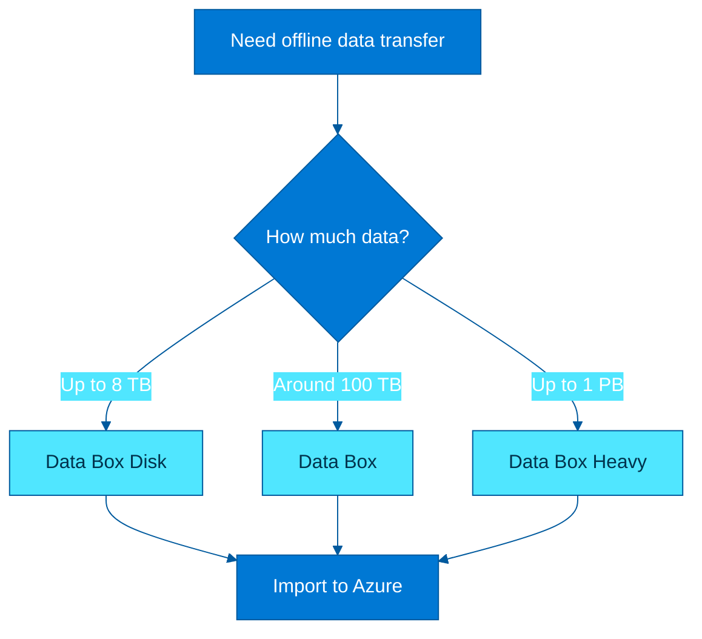

### Explanation

Azure Data Box is an offline data transfer family used when network upload is too slow, expensive, or operationally risky. Microsoft ships secure hardware or disks to your site, you load the data locally, and Microsoft ingests it into Azure. This is common for migrations, media archives, backup seeding, and remote locations with constrained bandwidth.

#### 12.1 Detail

A simple rule of thumb: if the dataset is small enough and the network can move it inside the required window, use online transfer. If not, Data Box becomes attractive.

#### 12.2 Detail

Data Box Disk is easier operationally for smaller datasets, while appliance models reduce handling complexity for very large transfers.

#### 12.3 Detail

Landing-zone readiness matters because the physical import is only one phase of a migration program.

### Key concepts

- **Data Box Disk** is intended for smaller transfers up to about **8 TB** using SSD disks.

- **Data Box** appliance is for approximately **100 TB** class transfers.

- **Data Box Heavy** is the largest appliance, designed for up to **1 PB** transfers.

- Decision factors include total data volume, available WAN bandwidth, site handling capability, shipping constraints, and project timeline.

- Data is encrypted in transit and at rest on the device, and import is tracked through the Azure order workflow.

- Data Box is primarily for bulk ingest or export-style migration, not daily synchronization.

- You choose target storage such as Blob Storage or Data Lake Storage depending on the landing architecture.

- Operational planning must include chain of custody, rack/power/network requirements, and scheduling for the device lifecycle.

### Additional notes

- Data Box is typically requested through an order process with logistics steps outside pure CLI automation.

- Import/export workflow details vary by country, SKU availability, and compliance constraints.

- The decision tree is mostly about data volume and transfer urgency.

### Azure CLI commands

```bash
# Create a Data Box order (illustrative command; exact options depend on SKU and scenario)
az databox job create \
  --resource-group $RG \
  --name databox-order-01 \
  --location $LOC \
  --sku DataBox \
  --contact-name "Storage Admin" \
  --phone 1234567890 \
  --email-list admin@example.com \
  --street-address1 "1 Main Street" \
  --city "Seattle" \
  --state-or-province "WA" \
  --country "US" \
  --postal-code "98101"

# Show a Data Box order
az databox job show \
  --resource-group $RG \
  --name databox-order-01

# List Data Box orders
az databox job list \
  --resource-group $RG \
  --output table

# List available Data Box SKUs in a region
az databox catalog sku list \
  --location $LOC
```

### Best practices

- Use Data Box when WAN transfer time is unacceptable for the migration schedule.

- Match the device SKU to actual measured data volume with growth/headroom, not rough guesses.

- Prepare receiving and loading procedures, including physical security and local network throughput testing.

- Plan target storage layout and validation before the device arrives so the ingest window is not wasted.

- Track chain of custody and use the platform-provided encryption and tamper handling processes.

- After ingestion, switch to online methods such as AzCopy or Data Factory for ongoing incremental movement.

---

## 13. AzCopy & Storage Explorer

### Diagram

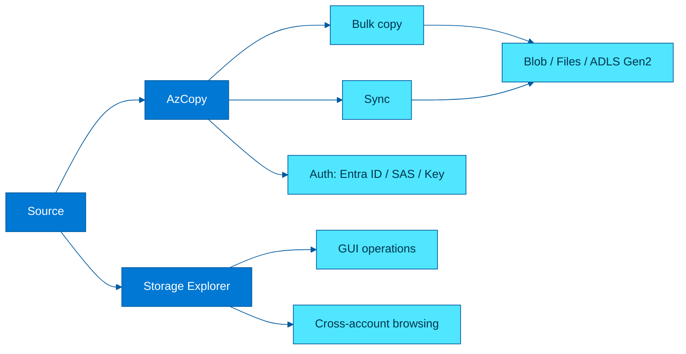

### Explanation

AzCopy is the high-performance command-line utility for bulk transfer into and out of Azure Storage. Storage Explorer is the GUI companion for browsing, uploading, downloading, and managing storage resources interactively. Together they cover scripted at-scale movement and administrator-friendly exploration.

#### 13.1 Detail

`copy` is best for initial bulk seeding, while `sync` is best for maintaining alignment over time. The latter compares source and destination state, so operational teams must understand exactly what constitutes a change.

#### 13.2 Detail

AzCopy can often saturate available bandwidth when network and destination limits allow, which is why it is the default recommendation for Azure Storage bulk movement.

#### 13.3 Detail

Storage Explorer reduces friction for support teams that need to inspect containers or shares without building one-off scripts.

### Key concepts

- AzCopy supports copy and sync for Blob Storage, Azure Files, and ADLS Gen2 scenarios.

- Authentication can use Azure AD login, SAS tokens, or account keys depending on workflow and least-privilege requirements.

- `azcopy copy` is ideal for one-time bulk movement, while `azcopy sync` compares source and destination and applies differences.

- Storage Explorer is useful for ad hoc validation, browsing snapshots/versions, and managing containers/shares without custom scripts.

- AzCopy preserves scale by using concurrency and chunking internally, making it better than naive upload loops.

- For large enterprise migrations, AzCopy often works alongside lifecycle rules, private endpoints, and identity-based authorization.

- Storage Explorer supports local files, Azure subscriptions, and SAS-based connections.

- Sync operations need careful testing around delete behavior and timestamp/content-change assumptions.

### Additional notes

- AzCopy is not just for uploads; it can do service-to-service transfers efficiently as well.

- Storage Explorer is excellent for troubleshooting permissions, inspecting metadata, and browsing historical objects.

- Authentication method should align with the storage account's policy on shared key access.

### Azure CLI commands

```bash
# Log in to AzCopy with Azure AD
azcopy login

# Copy local directory to blob container
azcopy copy './data' 'https://'$STG'.blob.core.windows.net/'$CONTAINER'?<sas-token>' --recursive

# Copy blob container contents to local directory
azcopy copy 'https://'$STG'.blob.core.windows.net/'$CONTAINER'?<sas-token>' './download' --recursive

# Sync local directory to blob container
azcopy sync './data' 'https://'$STG'.blob.core.windows.net/'$CONTAINER'?<sas-token>' --recursive=true

# Sync one blob container to another
azcopy sync 'https://srcacct.blob.core.windows.net/src?<sas-token>' \
            'https://dstacct.blob.core.windows.net/dst?<sas-token>' --recursive=true

# Example using Azure CLI to generate a container SAS for AzCopy
EXPIRY=$(date -u -v+1d '+%Y-%m-%dT%H:%MZ')
az storage container generate-sas \
  --account-name $STG \
  --name $CONTAINER \
  --permissions racwdl \
  --expiry $EXPIRY \
  --auth-mode login \
  --as-user

# Launch Storage Explorer manually after install
open -a "Storage Explorer"
```

### Best practices

- Use AzCopy for bulk and repeatable transfers; use Storage Explorer for interactive administration and verification.

- Prefer Azure AD or user delegation SAS instead of long-lived account keys for transfer workflows.

- Test sync carefully because destination deletions can occur depending on command flags and source state.

- Run large transfers close to the destination region or from high-bandwidth hosts when possible.

- Keep logs and job plans secured because they may contain sensitive URLs or metadata.

- For huge datasets, benchmark a pilot transfer before committing migration timelines.

---

## 14. Storage Decision Guide

### Diagram

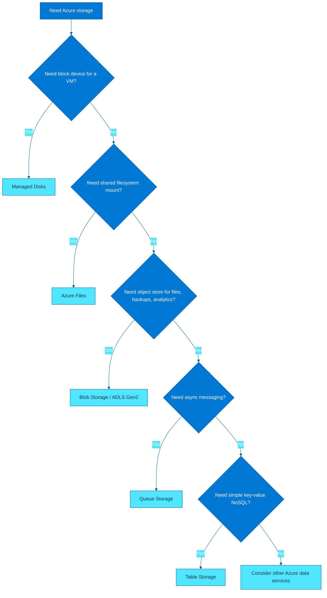

### Explanation

Choosing the right Azure storage service starts with access pattern, protocol, consistency expectations, and operational model. The most expensive design mistake is using the wrong abstraction: block when you needed files, files when you needed objects, or a simple queue when you needed enterprise messaging.

#### 14.1 Detail

The easiest selection framework is to ask, in order: do I need a disk, a shared folder, an object store, a queue, or a key-value table? That single question eliminates most confusion quickly.

#### 14.2 Detail

Many real solutions use multiple services together: blobs for payloads, queues for events, tables for metadata, managed disks for app servers, and backup/ASR for protection.

#### 14.3 Detail

Do not optimize for familiarity alone. A Windows admin may default to file shares, but an analytics platform usually wants blob or ADLS Gen2 instead.

### Key concepts

- Choose **Blob Storage** for object data such as documents, images, backups, logs, data lake content, and static assets.

- Choose **ADLS Gen2** when blob-based storage must also behave like an analytics filesystem with directories, ACLs, and ABFS support.

- Choose **Azure Files** when applications or users need SMB/NFS shared file access across multiple clients.

- Choose **Managed Disks** when an Azure VM needs an attached persistent block device for an operating system or database/application data volume.

- Choose **Queue Storage** for simple asynchronous messaging and background work dispatch.

- Choose **Table Storage** for simple low-cost schemaless key-value data with known partition/query patterns.

- Choose **Service Bus** instead of Queue Storage when you need enterprise broker features like sessions, dead-letter queues, transactions, or topics.

- Choose **Cosmos DB** instead of Table Storage when you need global distribution, richer SLAs, indexing, or more advanced data access patterns.

### Additional notes

- Blob vs Files is the most common decision point: objects are internet-native and massively scalable, while files are mountable shared folders.

- Managed disks are for VM attachment and do not replace shared or object storage.

- Table and Queue are intentionally simple; if requirements grow, adjacent Azure services may be a better long-term fit.

### Azure CLI commands

```bash
# Create a general-purpose storage account for blobs, files, queues, and tables
az storage account create \
  --name $STG \
  --resource-group $RG \
  --location $LOC \
  --sku Standard_ZRS \
  --kind StorageV2 \
  --https-only true

# Create resources for each service type
az storage container create --account-name $STG --name data --auth-mode login
az storage share-rm create --resource-group $RG --storage-account $STG --name shared --quota 512 --enabled-protocols SMB
az storage queue create --account-name $STG --name jobs --auth-mode login
az storage table create --account-name $STG --name metadata --auth-mode login
az disk create --resource-group $RG --name appdisk01 --location $LOC --sku Premium_LRS --size-gb 256

# Enable ADLS Gen2 on a dedicated account created with HNS
az storage account create \
  --name ${STG}datalake \
  --resource-group $RG \
  --location $LOC \
  --sku Standard_GZRS \
  --kind StorageV2 \
  --hierarchical-namespace true
```

### Best practices

- Start with the access pattern: object, file, block, message, or key-value.

- Avoid forcing one service to behave like another; that usually increases complexity and cost.

- Use separate accounts for distinct security, lifecycle, or performance domains.

- Document redundancy, backup, and DR decisions together with service choice.

- Select the simplest service that meets requirements, then add premium tiers or advanced controls only where justified.

- Revisit storage decisions as workloads evolve; analytics, compliance, and scale often change the best fit over time.

---

## Appendix A. Quick comparison tables

### Storage account types

| Type | Typical use | Notes |
|---|---|---|
| StorageV2 | Default for most workloads | Supports blobs, files, queues, tables, lifecycle, HNS |
| BlobStorage | Legacy blob-focused account | Mostly superseded by StorageV2 |
| FileStorage | Premium Azure Files | SSD-backed file shares |
| BlockBlobStorage | Premium block blobs | High transaction and low-latency blob workloads |

### Blob access tiers

| Tier | Access pattern | Cost pattern | Notes |
|---|---|---|---|
| Hot | Frequent | Higher storage, lower access | Active datasets |
| Cool | Infrequent | Lower storage, higher access | Backup or monthly access |
| Cold | Rare | Lower storage, higher access | Long-lived seldom-used data |
| Archive | Very rare | Lowest storage, highest retrieval overhead | Rehydration required |

### Managed disk summary

| Disk type | Best for | Performance profile |
|---|---|---|
| Ultra Disk | Mission-critical IO-intensive apps | Highest configurable IOPS/throughput |
| Premium SSD v2 | Flexible enterprise workloads | Tunable performance |
| Premium SSD | Default production disk | Low latency, predictable |
| Standard SSD | Cost-sensitive production/dev-test | Moderate performance |
| Standard HDD | Low-cost infrequent access | Lowest cost, lowest performance |

### Redundancy summary

| Redundancy | Zone resilient | Secondary region | Secondary readable |
|---|---:|---:|---:|
| LRS | No | No | No |
| ZRS | Yes | No | No |
| GRS | No | Yes | No |
| RA-GRS | No | Yes | Yes |
| GZRS | Yes | Yes | No |
| RA-GZRS | Yes | Yes | Yes |

## Appendix B. Sample lifecycle management policy

```json
{
  "rules": [
    {
      "enabled": true,
      "name": "tier-and-delete-sample",
      "type": "Lifecycle",
      "definition": {
        "actions": {
          "baseBlob": {
            "tierToCool": { "daysAfterModificationGreaterThan": 30 },
            "tierToCold": { "daysAfterModificationGreaterThan": 90 },
            "tierToArchive": { "daysAfterModificationGreaterThan": 180 },
            "delete": { "daysAfterModificationGreaterThan": 365 }
          },
          "snapshot": {
            "delete": { "daysAfterCreationGreaterThan": 30 }
          },
          "version": {
            "delete": { "daysAfterCreationGreaterThan": 90 }
          }
        },
        "filters": {
          "blobTypes": ["blockBlob"],
          "prefixMatch": ["archive/"]
        }
      }
    }
  ]
}
```

## Appendix C. Operational checklist

- Confirm naming, tags, locks, RBAC, and Azure Policy before provisioning.
- Decide whether the account should allow public network access.
- Enable diagnostics and route logs to Log Analytics, Event Hub, or Storage as needed.
- Review redundancy, backup, and DR together instead of as isolated choices.
- Test restore, failover, and recovery steps at least once before production cutover.
- Prefer automation for provisioning and configuration drift control.
- Document data classification, retention, and deletion responsibilities.
- Keep secrets out of scripts; prefer managed identity and Azure AD-based access.
- Review cost drivers quarterly: capacity, transactions, replication, snapshots, and data transfer.
- Pilot new workloads with realistic performance tests before committing to a tier.

## Appendix D. Reference CLI patterns

```bash
# Login and set subscription
az login
az account set --subscription <subscription-id>

# Create a resource group
az group create --name $RG --location $LOC

# Common account inspection
az storage account show --name $STG --resource-group $RG --output jsonc
az storage account keys list --resource-group $RG --account-name $STG --output table
az storage account show-connection-string --name $STG --resource-group $RG

# Enable static website where supported on blob service
az storage blob service-properties update \
  --account-name $STG \
  --static-website \
  --index-document index.html \
  --404-document 404.html

# Create a lock to protect a storage account
az lock create \
  --name cant-delete-storage \
  --lock-type CanNotDelete \
  --resource-group $RG \
  --resource-name $STG \
  --resource-type Microsoft.Storage/storageAccounts
```

## Closing notes

Azure Storage is not one service but a portfolio of storage abstractions. The best design comes from matching the access model, durability target, security posture, and operational workflow to the right service: blobs for objects, files for shared mounts, disks for VM-attached block storage, queues for decoupled work, tables for simple key-value data, and backup/ASR for protection and recovery.

---

## 📚 Official Documentation
- [Azure Storage](https://learn.microsoft.com/en-us/azure/storage/)
- [Azure Blob Storage](https://learn.microsoft.com/en-us/azure/storage/blobs/)
- [Azure Files](https://learn.microsoft.com/en-us/azure/storage/files/)
- [Azure Backup](https://learn.microsoft.com/en-us/azure/backup/)
- [Azure Site Recovery](https://learn.microsoft.com/en-us/azure/site-recovery/)
