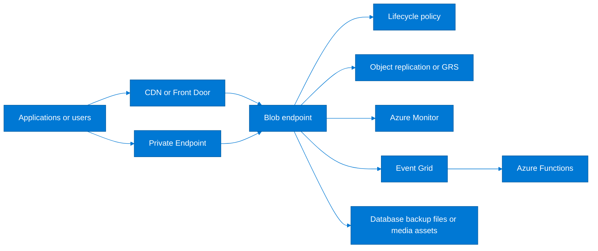
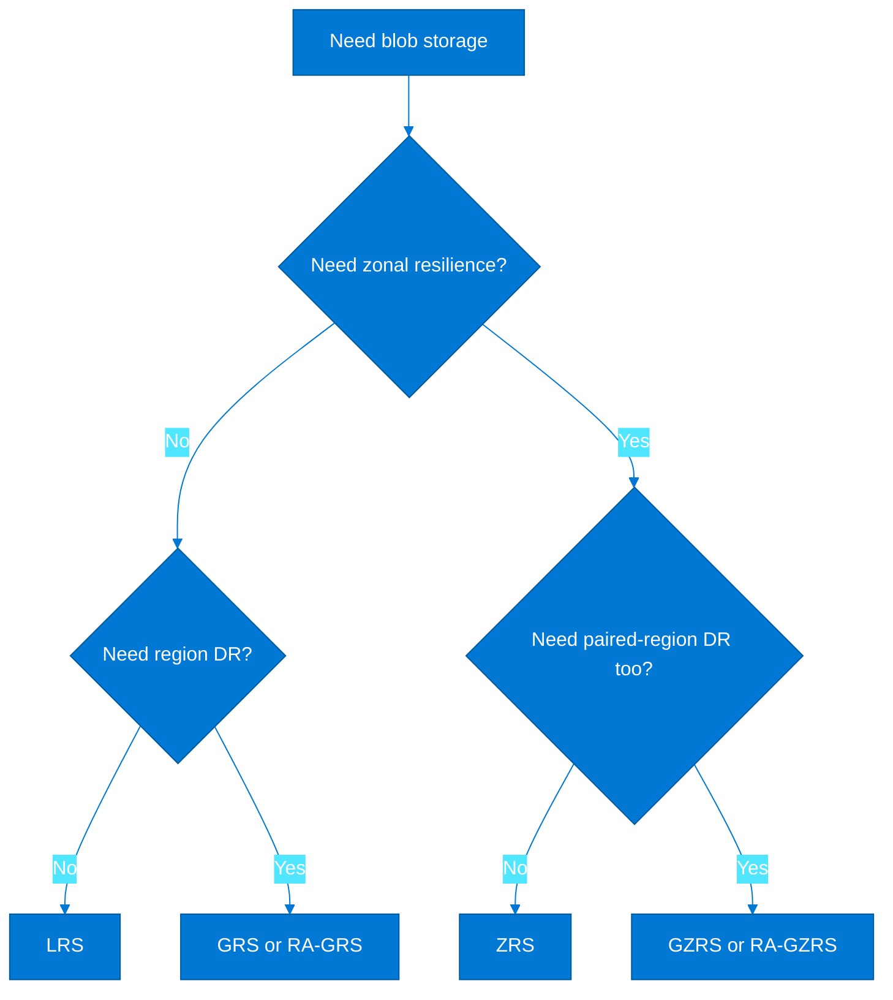
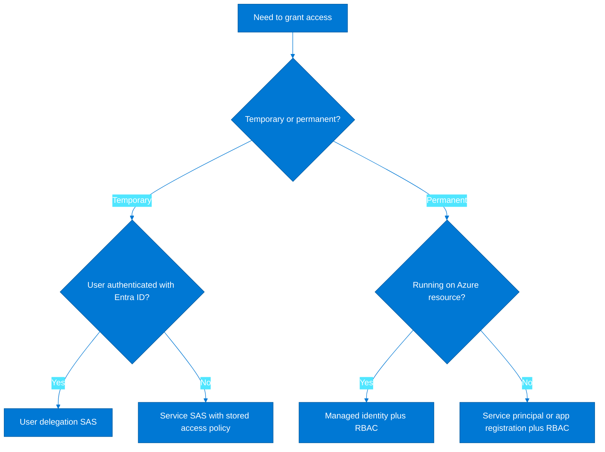
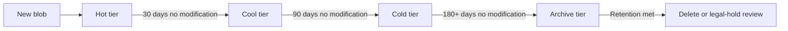
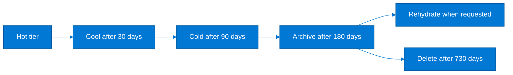
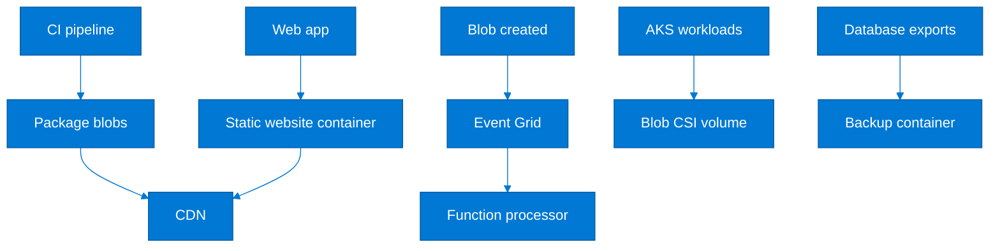

# Azure Blob Storage Complete Setup & Configuration Guide

> **Screenshot Disclaimer:** Portal screenshots referenced in this guide are sourced from [Microsoft Learn](https://learn.microsoft.com/en-us/azure/) documentation. © Microsoft Corporation. All rights reserved. Used for educational reference only.

> Detailed hands-on guide for creating, securing, protecting, monitoring, and integrating Azure Blob Storage in production environments.
>
> Pair this guide with [Storage/README.md](./README.md) for broader storage coverage and with [Architecture/storage-classes-and-data-strategy.md](../Architecture/storage-classes-and-data-strategy.md) when mapping blob use cases to enterprise data patterns.

## How to use this guide

- Follow the account setup and access control sections first if you are provisioning a new production storage account.
- Use the lifecycle, data protection, and monitoring sections to operationalize an existing account.
- Prefer private endpoints, RBAC, and managed identity over shared keys for most production workloads.
- Treat container public access, SAS expiry, and replication settings as explicit design decisions, not defaults.

## Table of contents

1. [Reference architecture](#1-reference-architecture)
2. [Account setup](#2-account-setup)
3. [Container and blob management](#3-container-and-blob-management)
4. [Access control](#4-access-control)
5. [Data protection](#5-data-protection)
6. [Lifecycle management](#6-lifecycle-management)
7. [Integration patterns](#7-integration-patterns)
8. [Monitoring and diagnostics](#8-monitoring-and-diagnostics)
9. [Migration to Blob](#9-migration-to-blob)
10. [Production template and checklist](#10-production-template-and-checklist)

## 1. Reference architecture



## 2. Account setup

### 2.1 Baseline variables

```bash
export LOCATION=eastus
export RG=rg-storage-prod
export STG=stgblobprod001
export CONTAINER=app-data
export VNET=vnet-prod-eastus-01
export SUBNET=snet-private-endpoints
export KV=kv-prod-platform
az group create --name $RG --location $LOCATION
```

### 2.2 Create a storage account with Azure CLI

```bash
az storage account create   --resource-group $RG   --name $STG   --location $LOCATION   --sku Standard_ZRS   --kind StorageV2   --access-tier Hot   --min-tls-version TLS1_2   --https-only true   --allow-blob-public-access false   --default-action Deny   --allow-shared-key-access false   --public-network-access Disabled
```

### 2.3 Portal steps for operators

> 
>
> *Screenshot source: [Microsoft Learn — Create an Azure Storage Account - Azure Storage](https://learn.microsoft.com/en-us/azure/storage/common/storage-account-create). © Microsoft Corporation. Used for educational reference only.*

> **Portal View:** Navigate to `Azure Portal` → `Storage accounts` → `Networking` or `Data protection`. The blades show public network access, private endpoints, versioning, soft delete, and change feed settings required for production blob workloads.
>
> *For the latest portal screenshots, see [Microsoft Learn — Create an Azure Storage Account - Azure Storage](https://learn.microsoft.com/en-us/azure/storage/common/storage-account-create).*

1. Open the Azure portal and navigate to **Storage accounts**.
2. Select **Create**, choose the correct subscription and resource group, and enter a globally unique storage account name.
3. Choose the performance tier, redundancy model, and secure transfer settings aligned to your workload.
4. On the **Networking** tab, disable public access unless the workload explicitly requires internet endpoints.
5. On **Data protection**, enable soft delete, versioning, and change feed if your recovery objectives require them.
6. On **Advanced**, confirm shared key access, SFTP, NFS, and hierarchical namespace choices based on workload design.

### 2.3.1 Storage account approval checklist

- Confirm the naming standard, owner tag, environment tag, and data-classification tag before creation.
- Document whether the account will support only blob workloads or a wider mix of blob, queue, table, and file services.
- Decide whether **shared key access** will remain disabled for production and whether Microsoft Entra auth is sufficient for operators and apps.
- Validate the chosen redundancy option against both cost and recovery design, not just default preference.

### 2.4 Account types

| Account type | Use for | Strengths | Notes |
|---|---|---|---|
| General-purpose v2 | Most blob workloads | Full feature set, lifecycle management, tiers, Event Grid, private endpoints | Default choice for production blob storage |
| Premium block blob | High transaction rate and low-latency object access | Premium SSD-backed performance | Higher cost and fewer tiering options |
| Hierarchical namespace enabled | Analytics and data lake workloads | Directory semantics, ACLs, and Data Lake Storage Gen2 capability | Consider namespace-aware tooling and analytics patterns |

### 2.5 Redundancy options comparison

| Option | Copies | Regional scope | Best fit | Watch-outs |
|---|---|---|---|---|
| LRS | 3 | Single datacenter | Dev, test, or low-criticality workloads | No zone or region protection |
| ZRS | 3 | Across availability zones in one region | Production workloads needing zone resilience | Higher cost than LRS but strong regional durability |
| GRS | 6 | Primary plus paired region | Disaster recovery without read access to secondary | Secondary is not readable unless failover occurs |
| RA-GRS | 6 | Primary plus readable paired region | Reporting or DR drills needing secondary reads | Eventual consistency on secondary |
| GZRS | 6 | Zonal primary plus region replication | Mission-critical production workloads | Premium of cost and design complexity |

### 2.6 Redundancy decision tree



### 2.7 Performance tiers

| Tier | Best fit | Strengths | Trade-offs |
|---|---|---|---|
| Standard | Most general-purpose object storage | Lower cost, supports hot/cool/cold/archive lifecycle | Higher latency than premium |
| Premium | Latency-sensitive block blob or page blob workloads | Predictable throughput and lower latency | More expensive and narrower feature set |

## 3. Container and blob management

### 3.1 Create containers and set access levels

```bash
az storage container create   --account-name $STG   --name $CONTAINER   --auth-mode login   --public-access off

az storage container create   --account-name $STG   --name public-assets   --auth-mode login   --public-access blob
```

| Access level | Meaning | Use when | Risk |
|---|---|---|---|
| private | No anonymous read access | Default for production data | Requires proper identity and network setup |
| blob | Anonymous read for blob objects only | Public static assets where listing should remain hidden | Still public internet exposure |
| container | Anonymous read and list on whole container | Rarely justified in production | High accidental data exposure risk |

### 3.2 Upload and download with Azure CLI

```bash
az storage blob upload   --account-name $STG   --container-name $CONTAINER   --name docs/architecture.pdf   --file ./docs/architecture.pdf   --auth-mode login

az storage blob download   --account-name $STG   --container-name $CONTAINER   --name docs/architecture.pdf   --file ./downloads/architecture.pdf   --auth-mode login
```

### 3.3 AzCopy and Storage Explorer

> **Portal View:** Navigate to `Azure Portal` → `Storage accounts` → `Lifecycle management` or `Containers`. Operators usually compare policy coverage with actual container layout before large AzCopy migrations.
>
> *For the latest portal screenshots, see [Microsoft Learn — Optimize costs by automatically managing the data lifecycle](https://learn.microsoft.com/en-us/azure/storage/blobs/lifecycle-management-overview).*

```bash
azcopy login --tenant-id <tenant-id>
azcopy copy './media/*' 'https://stgblobprod001.blob.core.windows.net/media' --recursive=true
azcopy sync './archive/' 'https://stgblobprod001.blob.core.windows.net/archive' --delete-destination=false
azcopy jobs list
azcopy jobs show <job-id>
```

- Use AzCopy for large transfers because it parallelizes operations, resumes failed copies, and produces detailed job logs.
- Use Azure Storage Explorer for ad-hoc operator workflows like browsing, metadata inspection, and limited content moves.
- Prefer Microsoft Entra authentication over long-lived SAS tokens for operator-led migrations where possible.
- Capture AzCopy job IDs in the migration record so failed objects can be replayed without guessing which run performed the upload.

Expected success output normally includes job state, completed transfers, and bytes moved:

```text
Final Job Status: Completed
Elapsed Time (Minutes): 3.41
Number of File Transfers: 420
Transfers Failed: 0
```

### 3.4 Blob types and when to use them

| Blob type | Use for | Behavior | Examples |
|---|---|---|---|
| Block blob | General files, media, backups, app content | Optimized for streaming uploads and object storage | Images, logs, application packages |
| Append blob | Sequential append scenarios | New blocks added only to the end | Audit logs, append-only telemetry |
| Page blob | Random read/write workloads | Optimized for frequent range updates | VHDs and some database-related patterns |

### 3.5 Hot, Cool, Cold, and Archive tiers

| Tier | Access pattern | Storage cost | Retrieval cost | Notes |
|---|---|---|---|---|
| Hot | Frequent | Highest | Lowest | Default for active application data |
| Cool | Infrequent but online | Lower | Higher | Good for 30-day or 90-day retention |
| Cold | Rare access with lower cost than cool | Lower than cool | Higher than cool | Newer tier for long retention while staying online |
| Archive | Very rare access | Lowest | Highest plus rehydration delay | Great for compliance archives and historical backups |

### 3.6 Lifecycle management JSON example

```json
{
  "rules": [
    {
      "enabled": true,
      "name": "hot-to-cool-cold-archive",
      "type": "Lifecycle",
      "definition": {
        "actions": {
          "baseBlob": {
            "tierToCool": {
              "daysAfterModificationGreaterThan": 30
            },
            "tierToCold": {
              "daysAfterModificationGreaterThan": 90
            },
            "tierToArchive": {
              "daysAfterModificationGreaterThan": 180
            },
            "delete": {
              "daysAfterModificationGreaterThan": 730
            }
          }
        },
        "filters": {
          "blobTypes": ["blockBlob"],
          "prefixMatch": ["archive/"]
        }
      }
    }
  ]
}
```

### 3.7 Immutable storage for compliance

```bash
az storage container immutability-policy create   --account-name $STG   --container-name legal-hold   --period 30   --allow-protected-append-writes true   --auth-mode login

az storage container legal-hold set   --account-name $STG   --container-name legal-hold   --tags case-2025-q1 finance-audit   --auth-mode login
```

## 4. Access control

### 4.1 SAS models

| SAS type | Best fit | Issued by | Recommendation |
|---|---|---|---|
| Account SAS | Broad service-level operations across blobs/files/queues/tables | Storage account key | Avoid in production when you can use more scoped options |
| Service SAS | Scoped access to one container or blob path | Storage account key or stored access policy | Useful for tightly bounded app integration |
| User delegation SAS | Time-bound blob access from Entra-authenticated workflow | Azure AD via user delegation key | Preferred for human and service workflows needing temporary access |

### 4.2 Step-by-step SAS generation with Azure CLI

```bash
EXPIRY=$(date -u -v+2H '+%Y-%m-%dT%H:%MZ')
USER_DELEGATION_SAS=$(az storage blob generate-sas   --account-name $STG   --container-name $CONTAINER   --name docs/architecture.pdf   --permissions r   --expiry $EXPIRY   --https-only   --auth-mode login   --as-user   -o tsv)

echo "https://${STG}.blob.core.windows.net/${CONTAINER}/docs/architecture.pdf?${USER_DELEGATION_SAS}"
```

### 4.3 Stored access policies

```bash
az storage container policy create   --account-name $STG   --container-name $CONTAINER   --name read-policy   --permissions rl   --start 2025-01-01T00:00Z   --expiry 2025-12-31T23:59Z   --auth-mode login
```

### 4.4 Azure AD RBAC roles

| Role | Use for | Typical assignee |
|---|---|---|
| Storage Blob Data Reader | Read blobs and metadata | Analysts, read-only apps, support engineers |
| Storage Blob Data Contributor | Read, write, delete blobs | Application managed identities and operators |
| Storage Blob Data Owner | Manage data plus ACLs on ADLS Gen2 | Platform or storage administrators |

```bash
STG_ID=$(az storage account show --resource-group $RG --name $STG --query id -o tsv)
APP_MI_PRINCIPAL=<managed-identity-principal-id>

az role assignment create   --assignee-object-id $APP_MI_PRINCIPAL   --assignee-principal-type ServicePrincipal   --role "Storage Blob Data Contributor"   --scope $STG_ID
```

### 4.5 Managed identity access from VMs and AKS

```bash
VM_MI=<vm-managed-identity-principal-id>
az role assignment create   --assignee-object-id $VM_MI   --assignee-principal-type ServicePrincipal   --role "Storage Blob Data Reader"   --scope $STG_ID
```

```yaml
apiVersion: v1
kind: ServiceAccount
metadata:
  name: blob-reader
  namespace: apps
  annotations:
    azure.workload.identity/client-id: <aks-workload-identity-client-id>
```

### 4.6 Anonymous access and firewall rules

- Disable account-level anonymous access by default and enable container public access only for explicitly approved static content.
- Use storage firewall rules with selected networks plus private endpoints to keep data paths private.
- If a public endpoint must remain enabled, combine it with Trusted Microsoft Services settings, narrow IP allowlists, and no shared key access where possible.

```bash
az storage account network-rule add   --resource-group $RG   --account-name $STG   --subnet $(az network vnet subnet show -g rg-network-prod --vnet-name $VNET --name app-subnet --query id -o tsv)
```

### 4.7 Private endpoint setup for Blob Storage

```bash
az network private-endpoint create   --resource-group $RG   --name pe-${STG}-blob   --vnet-name $VNET   --subnet $SUBNET   --private-connection-resource-id $STG_ID   --group-id blob   --connection-name peconn-${STG}-blob

az network private-dns zone create   --resource-group $RG   --name privatelink.blob.core.windows.net

az network private-dns link vnet create   --resource-group $RG   --zone-name privatelink.blob.core.windows.net   --name link-${VNET}-blob   --virtual-network $(az network vnet show -g rg-network-prod -n $VNET --query id -o tsv)   --registration-enabled false
```

### 4.8 Access control decision tree



## 5. Data protection

### 5.1 Soft delete and versioning

```bash
az storage account blob-service-properties update   --account-name $STG   --resource-group $RG   --enable-delete-retention true   --delete-retention-days 14   --enable-container-delete-retention true   --container-delete-retention-days 14   --enable-versioning true   --enable-change-feed true
```

### 5.2 Point-in-time restore

```bash
az storage account blob-service-properties update   --account-name $STG   --resource-group $RG   --enable-restore-policy true   --restore-days 7
```

### 5.3 Object replication

```bash
az storage account or-policy create   --resource-group $RG   --account-name $STG   --destination-account dstblobprod001   --rules source-container=app-data destination-container=app-data copy-blob-metadata=true
```

### 5.4 Change feed and recovery notes

- Use change feed for near-chronological record of creates, updates, and deletes when downstream systems need replayable object events.
- Combine versioning with point-in-time restore for operational recovery and immutable policies for compliance retention.
- Remember that archive blobs have rehydration time; do not design near-real-time recovery objectives on top of archived-only content.

## 6. Lifecycle management

### 6.1 Cost optimization strategy

- Tag blobs or segregate prefixes by data class so lifecycle policies can move only the right content to cooler tiers.
- Use access metrics to confirm the policy before archiving, especially for analytics jobs that unexpectedly re-read old data.
- Keep a small hot working set and move inactive backups quickly to cold or archive to reduce cost.

### 6.1.1 Lifecycle policy design rules

| Data pattern | Recommended tier path | Why |
| --- | --- | --- |
| Application uploads accessed daily for 30 days | Hot → Cool | Balances active serving with lower month-two cost |
| Compliance records retained for years | Hot/Cool → Archive | Minimizes long-term storage cost when read access is rare |
| Backup files with monthly restore testing | Hot → Cool → Cold | Keeps restores practical without archive rehydration delay |
| Versioned content with frequent updates | Hot + separate version cleanup rules | Prevents versions from silently growing total spend |



### 6.2 Apply lifecycle policy

```bash
az storage account management-policy create   --account-name $STG   --resource-group $RG   --policy @lifecycle-policy.json
```

### 6.3 Lifecycle flow



## 7. Integration patterns

### 7.1 Static website hosting with Blob and CDN

```bash
az storage blob service-properties update   --account-name $STG   --static-website   --index-document index.html   --404-document 404.html

az cdn profile create --resource-group $RG --name cdn-static-prod --sku Standard_Microsoft
az cdn endpoint create   --resource-group $RG   --profile-name cdn-static-prod   --name static-prod-endpoint   --origin ${STG}.z13.web.core.windows.net
```

### 7.2 Blob trigger with Azure Functions

```json
{
  "scriptFile": "../dist/BlobProcessor/index.js",
  "bindings": [
    {
      "name": "inputBlob",
      "type": "blobTrigger",
      "direction": "in",
      "path": "incoming/{name}",
      "connection": "AzureWebJobsStorage"
    }
  ]
}
```

### 7.3 Event Grid integration

```bash
az eventgrid event-subscription create   --name blob-created-to-function   --source-resource-id $STG_ID   --included-event-types Microsoft.Storage.BlobCreated   --endpoint-type azurefunction   --endpoint /subscriptions/<sub>/resourceGroups/$RG/providers/Microsoft.Web/sites/func-blob-events/functions/HandleBlobCreated
```

### 7.4 AKS persistent volumes with Blob CSI driver

```yaml
apiVersion: storage.k8s.io/v1
kind: StorageClass
metadata:
  name: blob-nfs-premium
provisioner: blob.csi.azure.com
parameters:
  skuName: Premium_LRS
  protocol: nfs
reclaimPolicy: Delete
volumeBindingMode: Immediate
---
apiVersion: v1
kind: PersistentVolumeClaim
metadata:
  name: media-blob-pvc
  namespace: media
spec:
  accessModes:
    - ReadWriteMany
  storageClassName: blob-nfs-premium
  resources:
    requests:
      storage: 500Gi
```

### 7.5 Backup target for databases and media streaming

- Use block blobs in a dedicated backup container for SQL exports, PostgreSQL dumps, and long-term retention snapshots.
- Pair static media with CDN, optimized cache-control headers, and lifecycle rules that move older renditions to cooler tiers.

### 7.6 Integration architecture



## 8. Monitoring and diagnostics

### 8.1 Metrics and alerts

```bash
az monitor metrics alert create   --name storage-availability   --resource-group $RG   --scopes $STG_ID   --condition "avg Availability < 99.9"   --description "Blob availability dropped below target"   --window-size 5m   --evaluation-frequency 5m
```

### 8.2 Azure Monitor logs

```kusto
StorageBlobLogs
| where AccountName == "stgblobprod001"
| summarize Requests=count() by AuthenticationType, StatusCode, bin(TimeGenerated, 15m)
| render timechart
```

### 8.3 Capacity planning

- Monitor used capacity, ingress, egress, transaction count, and success E2E latency for the hottest containers.
- Forecast capacity growth from application usage, retention periods, and backup expansion rather than raw monthly average only.
- Watch rehydration demand and lifecycle transitions because retrieval costs can erase savings if policies are too aggressive.

### 8.4 Diagnostic settings and workbook baseline

```bash
az monitor diagnostic-settings create \
  --name blob-to-log-analytics \
  --resource $STG_ID \
  --workspace $LOG_WS_ID \
  --logs '[{"category":"StorageRead","enabled":true},{"category":"StorageWrite","enabled":true},{"category":"StorageDelete","enabled":true}]' \
  --metrics '[{"category":"Transaction","enabled":true}]'
```

Use a workbook or Grafana dashboard that answers these operating questions:

- Which containers are driving the highest transaction count?
- Are requests authenticated with managed identity, SAS, or anonymous access?
- Did latency increase after lifecycle tier transitions or CDN changes?
- Are any callers still using shared keys after the security baseline disabled them?

## 9. Migration to Blob

### 9.1 AzCopy for large-scale migration

```bash
azcopy copy 'https://oldaccount.blob.core.windows.net/archive?<sas>' 'https://stgblobprod001.blob.core.windows.net/archive?<sas>' --recursive=true
azcopy jobs show <job-id>
```

### 9.2 Azure Data Box for offline migration

- Use Data Box when network transfer windows are too small for initial bulk migration.
- Seed historical data offline, then use AzCopy delta synchronization to catch up before cutover.

### 9.3 Storage Migration Service note

Storage Migration Service is most often used in Windows Server and SMB migration scenarios. If your source data lives in file shares or NAS appliances, use it to stage file movement into Azure-compatible targets, then land the final objects in Blob or Azure Files based on the application access pattern.

### 9.4 Migration runbook phases

| Phase | Goal | Recommended tooling | Validation |
|---|---|---|---|
| Discover | Inventory source data, owners, and retention | File inventory, AzCopy dry runs, data profiling | Inventory signed off by application owner |
| Seed | Move baseline data set | AzCopy, Data Box, partner appliance | Initial checksum and object count comparison |
| Delta sync | Catch up on changes before cutover | AzCopy sync or application-level replication | Delta window reduced to acceptable cutover size |
| Cutover | Redirect applications to Blob endpoint | DNS, config change, app deployment | Synthetic tests and user validation succeed |
| Stabilize | Monitor errors, latency, and missed objects | Azure Monitor, Event Grid dead-letter review | 24 to 72 hour soak with no major defects |

### 9.5 Migration cutover checklist

- Freeze writes or introduce queue-based buffering before the final synchronization run.
- Capture source and target object counts for every migrated prefix.
- Validate metadata, cache-control headers, content types, and access tiers after copy.
- Repoint applications, CDN origins, and event subscriptions only after data integrity checks pass.
- Keep rollback instructions ready until business validation completes.

## 10. Production template and checklist

### 10.1 Bicep template for a production storage account

```bicep
@description('Name of the storage account')
param storageAccountName string
param location string = resourceGroup().location
param virtualNetworkId string
param privateEndpointSubnetId string

resource stg 'Microsoft.Storage/storageAccounts@2023-05-01' = {
  name: storageAccountName
  location: location
  sku: {
    name: 'Standard_GZRS'
  }
  kind: 'StorageV2'
  properties: {
    accessTier: 'Hot'
    minimumTlsVersion: 'TLS1_2'
    allowBlobPublicAccess: false
    allowSharedKeyAccess: false
    publicNetworkAccess: 'Disabled'
    supportsHttpsTrafficOnly: true
    encryption: {
      keySource: 'Microsoft.Storage'
      services: {
        blob: {
          enabled: true
          keyType: 'Account'
        }
        file: {
          enabled: true
          keyType: 'Account'
        }
      }
    }
    networkAcls: {
      bypass: 'AzureServices'
      defaultAction: 'Deny'
      virtualNetworkRules: []
      ipRules: []
    }
    isVersioningEnabled: true
    deleteRetentionPolicy: {
      enabled: true
      days: 14
    }
    containerDeleteRetentionPolicy: {
      enabled: true
      days: 14
    }
    restorePolicy: {
      enabled: true
      days: 7
    }
    changeFeed: {
      enabled: true
    }
  }
}

resource privateDns 'Microsoft.Network/privateDnsZones@2020-06-01' = {
  name: 'privatelink.blob.core.windows.net'
  location: 'global'
}

resource privateEndpoint 'Microsoft.Network/privateEndpoints@2023-04-01' = {
  name: 'pe-${storageAccountName}-blob'
  location: location
  properties: {
    subnet: {
      id: privateEndpointSubnetId
    }
    privateLinkServiceConnections: [
      {
        name: 'blobConnection'
        properties: {
          privateLinkServiceId: stg.id
          groupIds: [
            'blob'
          ]
        }
      }
    ]
  }
}
```

### 10.2 Equivalent ARM JSON template excerpt

```json
{
  "$schema": "https://schema.management.azure.com/schemas/2019-04-01/deploymentTemplate.json#",
  "contentVersion": "1.0.0.0",
  "parameters": {
    "storageAccountName": {
      "type": "string"
    },
    "location": {
      "type": "string"
    }
  },
  "resources": [
    {
      "type": "Microsoft.Storage/storageAccounts",
      "apiVersion": "2023-05-01",
      "name": "[parameters('storageAccountName')]",
      "location": "[parameters('location')]",
      "sku": {
        "name": "Standard_GZRS"
      },
      "kind": "StorageV2",
      "properties": {
        "supportsHttpsTrafficOnly": true,
        "minimumTlsVersion": "TLS1_2",
        "allowBlobPublicAccess": false,
        "allowSharedKeyAccess": false,
        "publicNetworkAccess": "Disabled",
        "accessTier": "Hot",
        "deleteRetentionPolicy": {
          "enabled": true,
          "days": 14
        },
        "containerDeleteRetentionPolicy": {
          "enabled": true,
          "days": 14
        },
        "restorePolicy": {
          "enabled": true,
          "days": 7
        },
        "isVersioningEnabled": true,
        "changeFeed": {
          "enabled": true
        }
      }
    }
  ]
}
```

### 10.3 Media streaming and content delivery baseline

| Setting | Recommended value | Why |
|---|---|---|
| Content type metadata | Set explicitly per object upload | Browsers and media players depend on correct MIME types |
| Cache-Control | `public,max-age=31536000,immutable` for versioned assets | Lets CDN and browser caches absorb traffic |
| CDN compression | Enabled for text manifests and captions | Lowers egress and startup latency |
| Tokenized access | Use SAS or signed CDN tokens for premium content | Prevents direct anonymous blob scraping |
| Lifecycle on renditions | Cool or archive older video variants | Controls storage cost without deleting masters |

### 10.4 Example metadata and headers upload flow

```bash
az storage blob upload \
  --account-name $STG \
  --container-name media \
  --name trailers/app-launch-v1.mp4 \
  --file ./media/app-launch-v1.mp4 \
  --content-type video/mp4 \
  --content-cache-control 'public,max-age=604800' \
  --auth-mode login
```

### Production blob checklist

| Control | Why it matters | How to verify |
|---|---|---|
| Public network access disabled | Reduces internet attack surface | Storage account networking page shows Disabled |
| Private endpoint deployed | Keeps data plane private | Blob DNS resolves to private IP inside VNet |
| Shared key access disabled | Forces RBAC or SAS based on Entra where possible | `allowSharedKeyAccess` is false |
| Soft delete and versioning enabled | Improves recovery posture | Blob service properties show retention and versioning |
| Lifecycle policy applied | Controls cost over time | Management policy exists and matches retention strategy |
| Monitoring and alerts configured | Storage issues must surface before users notice | Metric alert and diagnostic settings exist |
| Replication model documented | DR behavior affects recovery expectations | Runbook identifies redundancy choice and failover process |

### Cross-reference map

- Use [Storage/README.md](./README.md) for broader Azure storage services such as Files, Queues, Tables, managed disks, backup, and Site Recovery.
- Use [Containers/aks-production-setup.md](../Containers/aks-production-setup.md) when Blob CSI, private endpoints, or AKS-hosted apps need coordinated platform setup.
- Use [CICD/azure-devops-complete-guide.md](../CICD/azure-devops-complete-guide.md) when Azure DevOps pipelines need to publish static assets, backups, or deployment packages to Blob.

