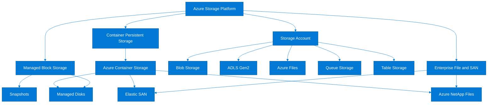
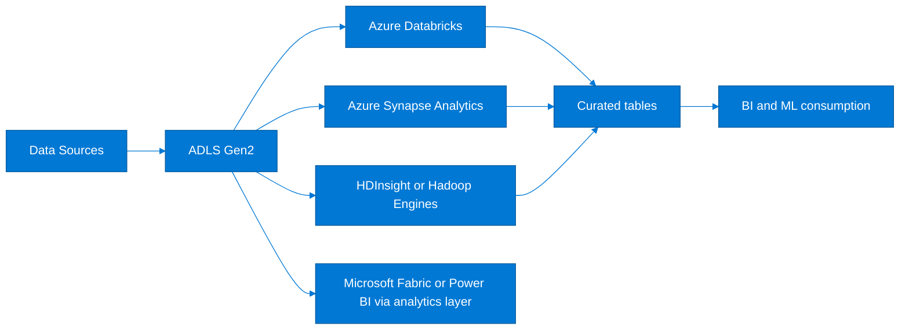
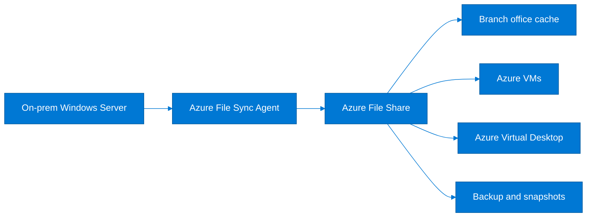
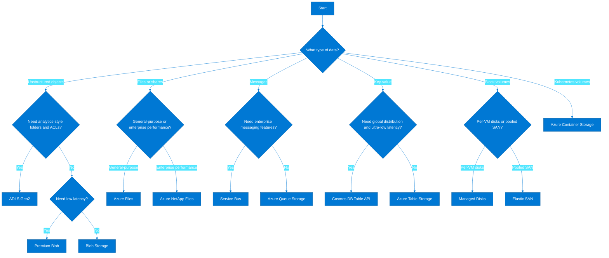
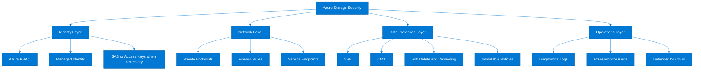

# Azure Storage Types — Complete Comparison Guide
> **Screenshot Disclaimer:** Portal screenshots referenced in this guide are sourced from [Microsoft Learn](https://learn.microsoft.com/en-us/azure/) documentation. © Microsoft Corporation. All rights reserved. Used for educational reference only.
> Use this guide alongside [Storage/README.md](./README.md) for the broad platform view and [Storage/blob-storage-complete-guide.md](./blob-storage-complete-guide.md) for a deep dive into Blob-specific implementation details.

## Table of contents

1. [Introduction](#1-introduction)
2. [Azure Storage Platform Overview](#2-azure-storage-platform-overview)
3. [Blob Storage (Object Storage)](#3-blob-storage-object-storage)
4. [Azure Data Lake Storage Gen2](#4-azure-data-lake-storage-gen2)
5. [Azure Files (Managed File Shares)](#5-azure-files-managed-file-shares)
6. [Azure Queue Storage](#6-azure-queue-storage)
7. [Azure Table Storage](#7-azure-table-storage)
8. [Azure Managed Disks](#8-azure-managed-disks)
9. [Azure Elastic SAN](#9-azure-elastic-san)
10. [Azure NetApp Files](#10-azure-netapp-files)
11. [Azure Container Storage](#11-azure-container-storage)
12. [Master Comparison Table](#12-master-comparison-table)
13. [Decision Flowchart](#13-decision-flowchart)
14. [Storage Security Overview](#14-storage-security-overview)
15. [Pricing Comparison](#15-pricing-comparison)
16. [Azure CLI Quick Reference](#16-azure-cli-quick-reference)
17. [Official Microsoft References](#17-official-microsoft-references)

## 1. Introduction

Azure Storage is Microsoft’s durable, massively scalable storage platform for cloud-native and hybrid workloads. It provides a shared foundation for storing unstructured objects, analytics datasets, managed file shares, queue-based messages, NoSQL key-value data, and VM disks. Instead of offering a single one-size-fits-all service, Azure exposes multiple storage services because application data comes in very different shapes, access patterns, latency requirements, and security models.
A media archive, a Spark lakehouse, a legacy SMB-based application, a message-driven worker pipeline, and a transactional VM all need storage—but not the same storage. Azure separates these needs into purpose-built services so architects can optimize cost, performance, durability, and operational simplicity without forcing every workload into the same interface.
In cloud architecture, Azure Storage usually sits behind applications, analytics platforms, containers, and virtual machines. It is the persistence layer for business data, backup data, telemetry, AI/ML training files, application state, and disaster recovery replicas. Choosing the right storage type is therefore both an infrastructure decision and an application design decision.
### Why multiple storage types exist
- **Object storage** is best for large-scale unstructured data and internet-scale access.
- **Hierarchical analytics storage** is best for big data tools that need folder semantics and fine-grained ACLs.
- **Managed file shares** are best for SMB/NFS application compatibility.
- **Queue-based storage** is best for decoupling producers and consumers.
- **NoSQL key-value storage** is best for simple lookups and metadata.
- **Block storage** is best for virtual machines and databases that need mounted volumes.
- **Specialized enterprise storage** exists for SAN, NAS, and Kubernetes-native persistent storage patterns.
### How to use this guide
- Start with the platform overview if you are new to Azure Storage.
- Use the master comparison table when you already know your workload type and need a short list.
- Use the decision flowchart for architecture workshops and design reviews.
- Use the CLI quick reference when you need implementation examples after the service choice is made.

## 2. Azure Storage Platform Overview

Azure Storage starts with the **storage account**, which is the foundational management boundary for core storage services such as Blob, Files, Queue, and Table. The account defines the namespace, region, redundancy model, security baseline, and service endpoints. Newer services such as Azure Managed Disks, Azure Elastic SAN, Azure NetApp Files, and Azure Container Storage integrate with the broader Azure storage platform but are provisioned through their own resource models.

### Storage account as the foundational resource
A storage account provides:
- A globally unique name and DNS namespace.
- Authentication and authorization boundaries.
- Redundancy and durability settings.
- Networking controls such as private endpoints, service endpoints, and firewalls.
- Shared configuration for Blob, Files, Queue, and Table services.
### Standard (GPv2) vs Premium at a glance
| Characteristic | Standard (General-purpose v2) | Premium |
|---|---|---|
| Primary use | Most workloads | Low-latency or high-throughput workloads |
| Backing media | HDD-backed platform | SSD-backed platform |
| Best services | Blob, ADLS Gen2, Files, Queue, Table | Premium Files, Premium block blobs, Premium page blob scenarios |
| Cost profile | Lower storage cost | Higher storage cost |
| Tiering support | Hot, Cool, Cold, Archive for blob data | Usually performance-focused, limited tiering |
| Typical decision | Default starting point | Choose only when workload proves latency/IOPS need |
### Redundancy options comparison
| Option | Copies | Scope | Use Case |
|---|---|---|---|
| LRS | 3 | Single datacenter | Dev/test, non-critical |
| ZRS | 3 | 3 availability zones | Production, high availability |
| GRS | 6 | Primary + secondary region | DR, compliance |
| RA-GRS | 6 | Read access to secondary | Read-heavy DR |
| GZRS | 6 | 3 AZs + secondary region | Mission-critical |
| RA-GZRS | 6 | Read access + zones + region | Highest availability |
### Redundancy selection guidance
- Choose **LRS** when cost matters more than zonal or regional resilience.
- Choose **ZRS** when the application is regional but must survive zone failure.
- Choose **GRS** or **RA-GRS** when you need paired-region recovery.
- Choose **GZRS** or **RA-GZRS** when both zone resilience and region DR matter.
- Validate region support because not all combinations are available everywhere.
- Align replication choice with application failover design, not only storage durability goals.

> 
>
> *Screenshot source: [Microsoft Learn — Create a storage account](https://learn.microsoft.com/en-us/azure/storage/common/storage-account-create). © Microsoft Corporation. Used for educational reference only.*

> 
>
> *Screenshot source: [Microsoft Learn — Create a storage account](https://learn.microsoft.com/en-us/azure/storage/common/storage-account-create). © Microsoft Corporation. Used for educational reference only.*
### Example account creation baseline
```bash
az storage account create --name mystorageacct001 --resource-group rg-storage-demo --location eastus --kind StorageV2 --sku Standard_ZRS --https-only true --min-tls-version TLS1_2
# Expected output: JSON showing the new storage account, provisioningState Succeeded, and primaryEndpoints for blob, file, queue, and table.
```

## 3. Blob Storage (Object Storage)

Azure Blob Storage is Azure’s object storage service for unstructured data such as images, backups, media, logs, datasets, software packages, and website content. It is the default answer when the workload needs HTTP/HTTPS access, massive scale, low operational overhead, and lifecycle-driven cost optimization.
Blob Storage is usually the right choice when:
- Data is unstructured and does not need SMB/NFS semantics by default.
- Applications access data over REST APIs, SDKs, AzCopy, or SFTP/NFS features.
- Large-scale retention, archive, backup, or content distribution is required.
- You need object versioning, immutability, lifecycle management, and replication features.
### Blob types comparison
| Blob type | Best for | Access pattern | Notes |
|---|---|---|---|
| Block blob | Documents, media, backups, application files | Upload/download and streaming | Most common blob type |
| Append blob | Log aggregation, append-only event files | Sequential append writes | Good for audit and logging patterns |
| Page blob | VHDs and random read/write blocks | Random I/O | Backing format for Azure VM disks |
### Access tiers comparison
| Tier | Access Cost | Storage Cost | Min Duration | Use Case |
|---|---|---|---|---|
| Premium | Lowest | Highest | None | IoT, AI/ML, low-latency |
| Hot | Low | High | None | Active data, websites |
| Cool | Medium | Medium | 30 days | Infrequent access, backups |
| Cold | Higher | Lower | 90 days | Rarely accessed, compliance |
| Archive | Highest | Lowest | 180 days | Long-term retention, legal |
### Tier selection guidance
- Use **Premium** for latency-sensitive object access or high transaction rates.
- Use **Hot** for active application content and frequent reads.
- Use **Cool** for backup files, monthly reports, and data accessed less often.
- Use **Cold** when the data must remain online but is accessed rarely.
- Use **Archive** when retention cost is more important than immediate retrieval.
### Lifecycle management
Blob lifecycle management lets you move data between Hot, Cool, Cold, and Archive automatically based on last modified time, last access time, blob index tags, or prefix. This is one of the biggest advantages of Blob Storage over traditional file or block storage because it turns cost optimization into policy rather than a manual cleanup project.
### Data protection features
- Blob versioning for overwrite protection.
- Soft delete for blob and container recovery.
- Change feed for auditing and downstream processing.
- Immutable policies and legal hold for compliance workloads.
- Object replication for cross-account replication patterns.

> 
>
> *Screenshot source: [Microsoft Learn — Introduction to Blob Storage](https://learn.microsoft.com/en-us/azure/storage/blobs/storage-blobs-introduction). © Microsoft Corporation. Used for educational reference only.*
### Real-world scenario
A media company stores raw video, edited assets, thumbnails, subtitle files, and transcoded renditions in Blob Storage. Active files remain in the **Hot** tier during the editing cycle, completed assets move to **Cool** after 30 days, and regulatory copies move to **Archive** after 180 days. Azure CDN or Front Door serves content globally, while versioning and immutable retention protect the legal master copy.
### Blob Storage decision matrix
| Requirement | Best Blob choice |
|---|---|
| Public or internet-facing asset delivery | Standard GPv2 Blob, Hot tier |
| High transaction rate with low latency | Premium block blob |
| Long-term retention with minimal access | Archive tier |
| Backup repository | Cool or Cold tier |
| Append-only log pattern | Append blobs |
| VM disk VHD pattern | Page blobs |
### Azure CLI examples
```bash
az storage container create --account-name mystorageacct001 --name media-assets --auth-mode login
# Expected output: JSON with created true and the container name media-assets.
az storage blob upload --account-name mystorageacct001 --container-name media-assets --name raw/video1.mp4 --file ./sample-data/video1.mp4 --auth-mode login
# Expected output: JSON containing etag, lastModified, and requestId for the uploaded blob.
az storage blob set-tier --account-name mystorageacct001 --container-name media-assets --name raw/video1.mp4 --tier Cool --auth-mode login
# Expected output: No content or a success response indicating the tier change request was accepted.
```
### Sample lifecycle policy
```json
{
  "rules": [
    {
      "enabled": true,
      "name": "move-media-by-age",
      "type": "Lifecycle",
      "definition": {
        "filters": {
          "blobTypes": ["blockBlob"],
          "prefixMatch": ["raw/"]
        },
        "actions": {
          "baseBlob": {
            "tierToCool": {
              "daysAfterModificationGreaterThan": 30
            },
            "tierToCold": {
              "daysAfterModificationGreaterThan": 90
            },
            "tierToArchive": {
              "daysAfterModificationGreaterThan": 180
            }
          }
        }
      }
    }
  ]
}
```
```bash
az storage account management-policy create --account-name mystorageacct001 --resource-group rg-storage-demo --policy @lifecycle-policy.json
# Expected output: JSON containing the management policy name, lastModifiedTime, and rules array.
```
### When not to choose Blob Storage
- The application requires SMB or NFS-style mounted shares for legacy compatibility.
- The workload is primarily queue-based messaging with message-level semantics.
- The application needs mounted block volumes for a VM or database.
- The workload needs HDFS-compatible directory operations and POSIX ACLs, where ADLS Gen2 is a better fit.

## 4. Azure Data Lake Storage Gen2

Azure Data Lake Storage Gen2 is not a separate storage engine; it is Blob Storage with **hierarchical namespace** enabled. That single feature changes the access model so analytics services can work with directories, paths, and file-level operations more efficiently.
ADLS Gen2 is the right choice when:
- You are building a data lake or lakehouse.
- Analytics engines such as Spark, Databricks, Synapse, or Hadoop need filesystem semantics.
- You need POSIX-like ACLs in addition to Azure RBAC.
- Directory rename and directory delete operations must be metadata-efficient rather than object-by-object.
### ADLS Gen2 vs regular Blob Storage
| Capability | Blob Storage | ADLS Gen2 |
|---|---|---|
| Namespace style | Flat object namespace | Hierarchical namespace |
| Analytics friendliness | Good | Excellent |
| Directory operations | Simulated by prefix | Native directory semantics |
| ACL model | RBAC, SAS, keys | RBAC plus POSIX-like ACLs |
| Best for | App data, backups, media | Data lakes, analytics, ETL |
| Endpoint | `blob.core.windows.net` | `blob.core.windows.net` and `dfs.core.windows.net` |
### POSIX-like ACLs vs RBAC
- **Azure RBAC** controls who can manage or access data at account, container, or broader Azure scope.
- **POSIX-like ACLs** control access at the directory and file level inside the hierarchical namespace.
- Use RBAC for platform governance and ACLs for analytics workspace isolation.
- Most enterprise deployments use both together.

### Real-world scenario
A retail company ingests POS transactions, website clickstream, inventory feeds, and supplier files into an ADLS Gen2 account. Raw data lands in `/raw`, validated data moves into `/bronze` and `/silver`, and curated business-ready data is written into `/gold`. Data engineers use Databricks notebooks, analysts query Synapse serverless SQL, and security teams enforce per-folder ACLs so finance, merchandising, and supply-chain teams only see the data they are allowed to read.
### Azure CLI examples
```bash
az storage account create --name mydatalake001 --resource-group rg-data-platform --location eastus2 --kind StorageV2 --sku Standard_GZRS --hierarchical-namespace true
# Expected output: JSON showing isHnsEnabled true and provisioningState Succeeded.
az storage fs create --account-name mydatalake001 --name analytics --auth-mode login
# Expected output: JSON with created true and the filesystem name analytics.
az storage fs directory create --account-name mydatalake001 --file-system analytics --name raw/2026/01/01 --auth-mode login
# Expected output: JSON confirming the directory path was created.
az storage fs access set --account-name mydatalake001 --file-system analytics --path raw --acl "user::rwx,group::r-x,other::---" --auth-mode login
# Expected output: Success response with ACL metadata updated on the specified path.
```
### Design notes
- Enabling hierarchical namespace is a creation-time design decision in most real deployments.
- ADLS Gen2 keeps Blob economics and resilience while adding analytics-friendly semantics.
- Use folder naming standards early because data lake sprawl becomes expensive to clean up later.
- Pair ADLS Gen2 with lifecycle policies for colder zones and retention paths.

## 5. Azure Files (Managed File Shares)

Azure Files delivers fully managed file shares in Azure using **SMB** or **NFS** protocols. It is the natural fit when applications expect a mounted file share instead of object APIs. This makes Azure Files especially valuable in lift-and-shift, profile storage, shared application configuration, and hybrid file server modernization scenarios.
### When to use Azure Files
- Legacy applications expect a UNC path or network-mounted share.
- Multiple VMs, containers, or users need shared file access.
- You need managed SMB or NFS without operating your own NAS cluster.
- You want hybrid caching with Azure File Sync.
### SMB vs NFS protocol comparison
| Feature | SMB | NFS |
|---|---|---|
| Best fit | Windows and mixed enterprise clients | Linux and HPC-style workloads |
| Authentication | Entra ID, AD DS, or key-based options | Network and export-based model |
| ACL style | NTFS-style permissions | POSIX-style patterns |
| Typical use | User shares, profiles, app shares | Linux applications, rendering, batch processing |
| Client support | Windows, Linux, macOS | Linux |
### Standard vs Premium tiers
| Tier | Backing | Best for | Notes |
|---|---|---|---|
| Standard | HDD-backed | General file shares, lower cost | Good default for many lift-and-shift workloads |
| Premium | SSD-backed | IO-sensitive file shares | Lower latency and better throughput predictability |

### Azure File Sync in hybrid architecture
Azure File Sync lets you keep a working set cached on Windows Servers while Azure Files becomes the authoritative cloud endpoint. This is ideal when branch offices still need local performance or when an organization wants to phase out on-prem file servers gradually instead of doing a big-bang migration.

> 
>
> *Screenshot source: [Microsoft Learn — Introduction to Azure Files](https://learn.microsoft.com/en-us/azure/storage/files/storage-files-introduction). © Microsoft Corporation. Used for educational reference only.*
### Real-world scenario
An enterprise migrating on-prem file servers uses Azure Files for departmental shares, Azure File Sync for branch office caching, and Microsoft Entra or AD DS-based authentication for user access. Finance shares stay on Premium for low-latency Excel and reporting workloads, while archive shares stay on Standard. Snapshot schedules and Azure Backup protect file shares without maintaining physical NAS appliances.
### Azure CLI examples
```bash
az storage share-rm create --storage-account mystorageacct001 --resource-group rg-storage-demo --name dept-share --quota 1024 --enabled-protocols SMB
# Expected output: JSON with the share name, quota, and provisioning state.
az storage file upload --account-name mystorageacct001 --share-name dept-share --source ./sample-data/appsettings.json --path config/appsettings.json --auth-mode login
# Expected output: JSON with content-md5, etag, and lastModified for the uploaded file.
```
### Mounting examples
#### Windows PowerShell
```powershell
$connectTestResult = Test-NetConnection -ComputerName mystorageacct001.file.core.windows.net -Port 445
# Expected output: TcpTestSucceeded : True
net use Z: \\mystorageacct001.file.core.windows.net\dept-share /user:Azure\mystorageacct001 <storage-account-key>
# Expected output: The command completed successfully.
```
#### Linux SMB mount
```bash
sudo mkdir -p /mnt/dept-share
# Expected output: No output; the mount point directory is created.
sudo mount -t cifs //mystorageacct001.file.core.windows.net/dept-share /mnt/dept-share -o vers=3.0,username=mystorageacct001,password=<storage-account-key>,serverino
# Expected output: No output on success; running mount shows the Azure Files share mounted at /mnt/dept-share.
```
#### Linux NFS mount
```bash
sudo mkdir -p /mnt/nfs-share
# Expected output: No output; the mount point directory is created.
sudo mount -t nfs mystorageacct001.file.core.windows.net:/mystorageacct001/nfs-share /mnt/nfs-share -o vers=4,minorversion=1,sec=sys
# Expected output: No output on success; df -h shows the mounted NFS share.
```
#### macOS SMB mount
```bash
mkdir -p /Volumes/dept-share
# Expected output: No output; the mount point directory is created.
mount_smbfs //Azure:mystorageacct001@mystorageacct001.file.core.windows.net/dept-share /Volumes/dept-share
# Expected output: No output on success; the share becomes visible under /Volumes/dept-share.
```
### When not to choose Azure Files
- The workload is internet-scale object storage with lifecycle tiering requirements.
- The application is analytics-heavy and needs ADLS Gen2 semantics.
- The workload needs extremely high-end enterprise NAS performance where Azure NetApp Files is more appropriate.
- The need is message-based decoupling rather than shared file access.

## 6. Azure Queue Storage

Azure Queue Storage is a simple, cost-effective message queue service inside a storage account. It is designed for decoupling application components, smoothing traffic spikes, and allowing background workers to process tasks asynchronously.
### Good use cases
- Web apps offloading image processing or report generation.
- Batch jobs that poll for work items.
- Lightweight workflow steps between application components.
- Low-cost task buffering when enterprise messaging features are not required.
### Queue Storage vs Service Bus
| Feature | Queue Storage | Service Bus |
|---|---|---|
| Max message size | 64 KB | 256 KB (Standard) / 100 MB (Premium) |
| Ordering | No guarantee | FIFO (sessions) |
| Dead-lettering | No | Yes |
| Transactions | No | Yes |
| Best for | Simple decoupling | Enterprise messaging |
### Real-world scenario
A web app receives customer-uploaded images and writes a message to Queue Storage for each upload. Worker instances poll the queue, generate thumbnails, run antivirus scans, and update a status record in Table Storage or Cosmos DB. The user upload flow stays fast because the web tier does not do image processing inline.
### Azure CLI examples
```bash
az storage queue create --account-name mystorageacct001 --name image-jobs --auth-mode login
# Expected output: JSON with created true and the queue name image-jobs.
az storage message put --account-name mystorageacct001 --queue-name image-jobs --content '{"blob":"raw/image1.jpg","operation":"thumbnail"}' --auth-mode login
# Expected output: JSON containing messageId, insertionTime, and expirationTime.
az storage message get --account-name mystorageacct001 --queue-name image-jobs --num-messages 1 --auth-mode login
# Expected output: JSON array containing a dequeued message, popReceipt, and nextVisibleTime.
```
### Design notes
- Use Queue Storage when simplicity and cost matter more than advanced messaging semantics.
- Use visibility timeout carefully so failed workers do not lose jobs permanently.
- Pair Queue Storage with idempotent workers because messages can be processed more than once.
- Move to Service Bus when FIFO, duplicate detection, sessions, transactions, or dead-lettering are mandatory.

## 7. Azure Table Storage

Azure Table Storage is Azure Storage’s schemaless NoSQL key-value service. It is optimized for large-scale, low-cost lookup workloads where entities are retrieved by partition key and row key rather than relational joins.
### Good use cases
- Device metadata and IoT registration data.
- User preferences or profile records.
- Lightweight application configuration data.
- Lookup-heavy services where a full relational database is unnecessary.
### Table Storage vs Cosmos DB Table API
| Feature | Table Storage | Cosmos DB Table API |
|---|---|---|
| Latency | Variable | <10ms guaranteed |
| Throughput | Limited | Elastic, configurable |
| Global distribution | No | Yes |
| SLA | 99.9% | 99.999% |
| Cost | Lower | Higher |
### Partitioning guidance
- Keep entities with similar access patterns in the same partition key.
- Avoid hot partitions caused by too many writes to one key.
- Design row keys for point lookup efficiency.
- Treat Table Storage as a simple key-value/document store, not a relational substitute.
### Real-world scenario
A field device platform stores each device record as a table entity. The partition key is the customer or region, and the row key is the device ID. The service can quickly retrieve device registration, last heartbeat time, firmware channel, and feature flags without paying for a more expensive globally distributed database tier.
### Azure CLI examples
```bash
az storage table create --account-name mystorageacct001 --name devicecatalog --auth-mode login
# Expected output: JSON with created true and the table name devicecatalog.
az storage entity insert --account-name mystorageacct001 --table-name devicecatalog --entity PartitionKey=region-east RowKey=device-1001 Status=Active Firmware=1.0.4 --auth-mode login
# Expected output: JSON with etag and stored properties for the new entity.
az storage entity query --account-name mystorageacct001 --table-name devicecatalog --filter "PartitionKey eq 'region-east'" --auth-mode login
# Expected output: JSON array of matching entities in the region-east partition.
```
### When not to choose Table Storage
- You need guaranteed low-latency SLAs at global scale.
- You need automatic indexing beyond partition/row key access patterns.
- The workload requires relational joins, stored procedures, or complex transactions.
- Multi-region active-active writes are required.

## 8. Azure Managed Disks

Azure Managed Disks are block storage volumes for Azure virtual machines. They are the preferred way to provide persistent OS and data disks to VMs because Azure manages the storage account complexity, scaling, availability integration, and disk lifecycle.
### Disk types comparison
| Type | IOPS | Throughput | Use Case |
|---|---|---|---|
| Ultra Disk | Up to 160,000 | Up to 4,000 MB/s | SAP HANA, databases |
| Premium SSD v2 | Up to 80,000 | Up to 1,200 MB/s | Production workloads |
| Premium SSD | Up to 20,000 | Up to 900 MB/s | Production VMs |
| Standard SSD | Up to 6,000 | Up to 750 MB/s | Web servers, dev/test |
| Standard HDD | Up to 2,000 | Up to 500 MB/s | Backup, non-critical |
### Encryption options
- **Server-side encryption (SSE)** with platform-managed keys is the default.
- **Customer-managed keys (CMK)** integrate with Azure Key Vault for stronger governance.
- **Azure Disk Encryption (ADE)** adds guest OS encryption scenarios where required.
### Backup and protection
- Snapshots provide point-in-time copies of disks.
- Azure Backup supports policy-driven VM protection.
- Availability sets and zones protect compute placement, while disk redundancy helps data durability.
### Real-world scenario
A line-of-business SQL Server VM uses Premium SSD v2 data disks for database files, a separate Premium SSD for logs, and daily snapshots before maintenance windows. A business-critical SAP environment uses Ultra Disk for extremely high IOPS and throughput while Azure Backup handles restore points for the full VM.
### Azure CLI examples
```bash
az disk create --resource-group rg-compute-prod --name sql-data-disk01 --size-gb 1024 --sku PremiumV2_LRS
# Expected output: JSON with diskState Unattached, diskSizeGb 1024, and provisioningState Succeeded.
az vm disk attach --resource-group rg-compute-prod --vm-name vm-sql-01 --name sql-data-disk01
# Expected output: JSON or success output showing the disk is now attached to vm-sql-01.
az snapshot create --resource-group rg-compute-prod --name sql-data-disk01-snap01 --source sql-data-disk01
# Expected output: JSON with provisioningState Succeeded and the source resource ID.
```
### When Managed Disks are the right choice
- The workload runs on Azure VMs.
- The application expects mounted block devices.
- You need disk-level performance selection by SKU.
- Simplicity and native Azure VM integration matter more than SAN pooling.

## 9. Azure Elastic SAN

Azure Elastic SAN is a cloud-native storage area network service that provides pooled block storage over iSCSI. It is built for enterprises that want SAN-like consolidation without building or maintaining traditional on-prem SAN arrays.
### Key characteristics
- Centralized pool-based block storage.
- iSCSI-based access.
- Better consolidation for large fleets than managing each disk individually.
- Useful when many workloads need shared storage management and predictable scale.
### When to use Elastic SAN
- Lift-and-shift of applications designed around SAN patterns.
- Consolidated storage management across many application servers.
- Workloads that benefit from pooled performance and capacity.
- Migration from on-prem SAN operating models.
### Elastic SAN vs Managed Disks
| Characteristic | Managed Disks | Elastic SAN |
|---|---|---|
| Provisioning model | Per-disk | Shared storage pool |
| Access model | Native VM disk attachment | iSCSI volumes |
| Best fit | Standard Azure VM workloads | SAN modernization |
| Operational style | Simpler per-VM | Centralized storage administration |
| Multi-workload pooling | Limited | Strong |
### Real-world scenario
A manufacturing company migrates an ERP estate from an on-prem SAN to Azure. Instead of mapping dozens of application volumes to separate managed disk sets, the storage team provisions Elastic SAN pools and presents iSCSI volumes to multiple servers, preserving the operational model the team already understands while reducing datacenter dependencies.

## 10. Azure NetApp Files

Azure NetApp Files is Microsoft’s enterprise-grade, NetApp-powered NAS service. It targets high-performance, file-based workloads that exceed the typical requirements of standard managed file shares.
### Best-fit workloads
- SAP applications and shared file workloads.
- High-performance databases requiring shared file semantics.
- HPC, EDA, and rendering pipelines.
- Large enterprise applications with strict latency and throughput requirements.
### Performance tiers
| Service level | Positioning | Typical fit |
|---|---|---|
| Standard | Cost-efficient enterprise NAS | General enterprise file workloads |
| Premium | Higher throughput | Performance-sensitive line-of-business apps |
| Ultra | Highest throughput | SAP HANA, HPC, heavy analytics |
### Azure NetApp Files vs Azure Files
| Characteristic | Azure Files | Azure NetApp Files |
|---|---|---|
| Primary goal | Managed cloud file shares | Enterprise-grade high-performance NAS |
| Protocols | SMB and NFS | SMB, NFS, dual-protocol scenarios |
| Performance envelope | Broad general-purpose | Higher-end enterprise performance |
| Typical buyer | General platform team | Enterprise storage and SAP teams |
| Cost | Lower | Higher |
### Real-world scenario
A global SAP landscape uses Azure NetApp Files because the workload needs predictable low-latency NFS storage, enterprise snapshot patterns, and performance service levels aligned to business-critical transaction volumes. Standard Azure Files would be operationally simpler, but not the right fit for the required performance and throughput profile.

## 11. Azure Container Storage

Azure Container Storage is a Kubernetes-native storage management service for stateful AKS workloads. It simplifies how persistent volumes are provisioned and managed for containers while using Azure Disks, Azure Elastic SAN, or Azure NetApp Files as the underlying storage substrate.
### What it is backed by
- Azure Managed Disks for common block-backed persistent volumes.
- Azure Elastic SAN for shared, pool-oriented block storage needs.
- Azure NetApp Files for enterprise-grade file and high-performance scenarios.
### When to use it
- AKS clusters running databases, queues, stateful APIs, or analytics services.
- Platform teams that want standardized StorageClass-based provisioning.
- Multi-tenant Kubernetes environments where storage abstraction matters.
- Applications that need persistent storage but should not manage cloud storage details directly.
### Design notes
- Container Storage is not a separate raw storage medium; it is an orchestration and management layer.
- The backend you choose still determines performance, latency, cost, and access semantics.
- StorageClass design becomes the contract between platform engineering and application teams.
### StorageClass example
```yaml
apiVersion: storage.k8s.io/v1
kind: StorageClass
metadata:
  name: managed-disk-premium
provisioner: disk.csi.azure.com
parameters:
  skuname: PremiumV2_LRS
reclaimPolicy: Delete
volumeBindingMode: WaitForFirstConsumer
allowVolumeExpansion: true
```
### PersistentVolumeClaim example
```yaml
apiVersion: v1
kind: PersistentVolumeClaim
metadata:
  name: orders-db-pvc
spec:
  accessModes:
    - ReadWriteOnce
  storageClassName: managed-disk-premium
  resources:
    requests:
      storage: 256Gi
```
### Stateful workload example
```yaml
apiVersion: apps/v1
kind: StatefulSet
metadata:
  name: orders-db
spec:
  serviceName: orders-db
  replicas: 1
  selector:
    matchLabels:
      app: orders-db
  template:
    metadata:
      labels:
        app: orders-db
    spec:
      containers:
        - name: postgres
          image: postgres:16
          volumeMounts:
            - name: data
              mountPath: /var/lib/postgresql/data
  volumeClaimTemplates:
    - metadata:
        name: data
      spec:
        accessModes: ["ReadWriteOnce"]
        storageClassName: managed-disk-premium
        resources:
          requests:
            storage: 256Gi
```
### Real-world scenario
A platform team runs AKS for multiple product squads. Stateless services use ephemeral storage, but PostgreSQL, Redis, and event-processing components need persistent volumes. Azure Container Storage standardizes approved backends and StorageClasses so developers can request storage with YAML while the platform team controls whether the actual backing medium is Managed Disks, Elastic SAN, or NetApp Files.

## 12. Master Comparison Table

| Feature | Blob | Files | Queue | Table | Disk | ADLS Gen2 | Elastic SAN | NetApp Files | Container Storage |
|---|---|---|---|---|---|---|---|---|---|
| Data model | Object | File share | Message queue | NoSQL key-value | Block volume | Hierarchical object/file | Block SAN volume | Enterprise NAS | Kubernetes-managed volumes |
| Protocol / interface | REST, SDK, SFTP, NFS | SMB, NFS, REST | REST, SDK | REST, SDK | VM attachment | REST, ABFS, HDFS-style access patterns | iSCSI | SMB, NFS | CSI / Kubernetes APIs |
| Max size | Massive object scale; block blobs up to ~190.7 TiB | Large managed shares; workload and tier limits apply | 64 KB per message | 1 MiB per entity | Up to 64 TiB per disk | Petabyte-scale data lake on Blob limits | Large pooled block storage | Enterprise-scale file volumes | Depends on backend |
| Latency | Low to moderate, tier dependent | Moderate to low, tier dependent | Low | Low for key lookups | Low and predictable by SKU | Low to moderate for analytics I/O | Low and predictable for pooled block storage | Low, enterprise-grade | Depends on backend and class |
| Redundancy | LRS, ZRS, GRS, RA-GRS, GZRS, RA-GZRS | LRS, ZRS, GRS options by tier and region | Inherits storage account | Inherits storage account | SKU and zone options | Inherits Blob/account redundancy | Pool-level resilience model | Service-level resilience | Inherits backend |
| Access pattern | Store and retrieve objects | Mount shared paths | Enqueue/dequeue messages | Partition/row key lookups | Mount to VM | Filesystem-like analytics paths | Present SAN volumes | Mount high-performance shares | Mount persistent volumes in AKS |
| Best for | Media, backups, archives, app content | Lift-and-shift shares, profiles, config | Background jobs, decoupling | Metadata, profiles, IoT registry | VM OS/data disks | Data lakes, Spark, Synapse | SAN modernization | SAP, HPC, enterprise NAS | Stateful Kubernetes apps |
| Pricing model | Capacity + transactions + data transfer + tier | Provisioned or used capacity + transactions | Capacity + transactions | Capacity + transactions | Per disk size and performance tier | Capacity + transactions | Pool capacity + performance | Provisioned capacity/service level | Backend pricing + AKS operations |
### Quick service selection summary
| If you need... | Choose... |
|---|---|
| Cheap and scalable object storage | Blob Storage |
| Analytics-friendly data lake | ADLS Gen2 |
| Shared SMB/NFS access | Azure Files |
| Low-cost async messaging | Queue Storage |
| Simple NoSQL lookups | Table Storage |
| VM-attached storage | Managed Disks |
| Cloud SAN model | Elastic SAN |
| High-performance enterprise NAS | Azure NetApp Files |
| AKS persistent volume abstraction | Azure Container Storage |

## 13. Decision Flowchart


### Practical interpretation of the flowchart
- If the application speaks in **objects**, start with Blob Storage and promote to ADLS Gen2 if analytics semantics matter.
- If the application speaks in **folders and shares**, start with Azure Files and promote to NetApp Files if performance or enterprise NAS features justify it.
- If the system speaks in **messages**, choose Queue Storage for simple buffering and Service Bus for richer messaging contracts.
- If the workload needs **mounted block devices**, choose Managed Disks first and Elastic SAN when storage pooling becomes part of the architecture.
- If the platform is **AKS**, let Azure Container Storage abstract the underlying medium through Kubernetes classes.

## 14. Storage Security Overview

All Azure storage services should be designed with a layered security model. Security is not just about encryption; it is the combination of identity, network isolation, key management, monitoring, and recovery settings.
### Core controls
- **Encryption at rest:** Server-side encryption with Microsoft-managed keys is default; customer-managed keys are available for stronger control.
- **Encryption in transit:** Require HTTPS and TLS 1.2+ for service endpoints.
- **Network security:** Use private endpoints, storage firewalls, service endpoints where appropriate, and public network restrictions.
- **Access control:** Prefer Azure RBAC, managed identities, and short-lived SAS over storage account keys.
- **Operational protection:** Enable soft delete, versioning, snapshots, immutable policies, and diagnostic logging where applicable.

### Security comparison by service
| Service | Identity focus | Network focus | Data protection focus |
|---|---|---|---|
| Blob | RBAC, SAS, managed identity | Private endpoints, firewall | Versioning, soft delete, immutability |
| ADLS Gen2 | RBAC + POSIX ACLs | Private endpoints | ACL governance, lifecycle, immutability |
| Files | Entra ID / AD DS / keys | Private endpoints, port 445/NFS access | Snapshots, backup, share-level controls |
| Queue | RBAC or key-based access | Private endpoints | Retention and app-level retry handling |
| Table | RBAC or keys | Private endpoints | App-level backup/export strategy |
| Disks | RBAC on compute/storage operations | VM boundary and private Azure network | SSE, ADE, snapshots, backup |
### Recommended production baseline
- Disable public network access unless the service explicitly requires it.
- Disable shared key access where supported and practical.
- Prefer private endpoints for production storage accounts.
- Enforce naming, tagging, and diagnostic settings with policy.
- Rotate keys and review SAS issuance patterns regularly.
- Separate admin roles from application identities.

## 15. Pricing Comparison

Azure storage pricing varies because each service optimizes a different dimension: capacity, transactions, redundancy, performance, or provisioned throughput.
### How pricing works by service
| Service | Primary pricing driver |
|---|---|
| Blob Storage | Stored GB/TB, access tier, transactions, retrieval, egress |
| ADLS Gen2 | Blob pricing plus hierarchical namespace transaction considerations |
| Azure Files | Provisioned share capacity, transactions, snapshots, backup |
| Queue Storage | Stored data and transactions |
| Table Storage | Stored entities and transactions |
| Managed Disks | Disk size, SKU, provisioned performance tier, snapshots |
| Elastic SAN | Provisioned pool capacity and performance |
| NetApp Files | Provisioned capacity and service level |
| Container Storage | Backend storage cost plus AKS operational footprint |
### Cost optimization tips
- Use **lifecycle policies** aggressively for Blob and ADLS data.
- Match **redundancy** to business need; do not default every workload to cross-region DR.
- Use **Premium** only for proven performance requirements.
- Prefer **Queue Storage** over heavier messaging services when simple buffering is enough.
- Archive stale shares and disks through governance reviews.
- Right-size AKS persistent volumes and reclaim unused PVCs.
### Reserved capacity and commitments
- Blob Storage and some disk services support reserved capacity or commitment-based savings.
- Long-running steady workloads often benefit from reservations more than bursty project environments.
- Premium services should be reviewed quarterly because performance overprovisioning is a common source of waste.
### Pricing calculator
Use the Azure Pricing Calculator to estimate costs before provisioning:
- https://azure.microsoft.com/en-us/pricing/calculator/

## 16. Azure CLI Quick Reference

The following commands are designed as quick reminders. Replace names, resource groups, and file paths with your environment values before running them.
### 16.1 Storage account commands
```bash
az storage account create --name mystorageacct001 --resource-group rg-storage-demo --location eastus --kind StorageV2 --sku Standard_LRS
# Expected output: JSON showing the account details and provisioningState Succeeded.
az storage account list --resource-group rg-storage-demo --output table
# Expected output: A table listing storage accounts in rg-storage-demo.
az storage account show --name mystorageacct001 --resource-group rg-storage-demo
# Expected output: JSON with account properties, endpoints, access tier, and replication settings.
az storage account delete --name mystorageacct001 --resource-group rg-storage-demo --yes
# Expected output: No output on success; the storage account is deleted.
```
### 16.2 Blob commands
```bash
az storage container create --account-name mystorageacct001 --name app-data --auth-mode login
# Expected output: JSON with created true.
az storage blob upload --account-name mystorageacct001 --container-name app-data --name docs/report.pdf --file ./sample-data/report.pdf --auth-mode login
# Expected output: JSON with etag and lastModified.
az storage blob download --account-name mystorageacct001 --container-name app-data --name docs/report.pdf --file ./downloads/report.pdf --auth-mode login
# Expected output: No output or a success response; the file appears at ./downloads/report.pdf.
az storage blob copy start --account-name mystorageacct001 --destination-container archive --destination-blob docs/report.pdf --source-uri https://mystorageacct001.blob.core.windows.net/app-data/docs/report.pdf
# Expected output: JSON containing copyId and copyStatus pending or success.
az storage blob set-tier --account-name mystorageacct001 --container-name archive --name docs/report.pdf --tier Cool --auth-mode login
# Expected output: Success response or empty output indicating the tier change was accepted.
az storage account management-policy create --account-name mystorageacct001 --resource-group rg-storage-demo --policy @lifecycle-policy.json
# Expected output: JSON with the lifecycle management policy configuration.
```
### 16.3 Azure Files commands
```bash
az storage share-rm create --storage-account mystorageacct001 --resource-group rg-storage-demo --name shared-tools --quota 512 --enabled-protocols SMB
# Expected output: JSON with the file share properties and quota.
az storage file upload --account-name mystorageacct001 --share-name shared-tools --source ./tools/setup.ps1 --path scripts/setup.ps1 --auth-mode login
# Expected output: JSON with etag and file metadata.
az storage share-rm snapshot create --storage-account mystorageacct001 --resource-group rg-storage-demo --name shared-tools
# Expected output: JSON with snapshotTime and share properties.
```
### 16.4 Queue commands
```bash
az storage queue create --account-name mystorageacct001 --name work-items --auth-mode login
# Expected output: JSON with created true.
az storage message put --account-name mystorageacct001 --queue-name work-items --content '{"job":"resize-image","id":42}' --auth-mode login
# Expected output: JSON with messageId and expirationTime.
az storage message peek --account-name mystorageacct001 --queue-name work-items --num-messages 1 --auth-mode login
# Expected output: JSON array of visible messages without dequeuing them.
az storage message get --account-name mystorageacct001 --queue-name work-items --num-messages 1 --auth-mode login
# Expected output: JSON array with a message body and popReceipt for delete processing.
```
### 16.5 Table commands
```bash
az storage table create --account-name mystorageacct001 --name appstate --auth-mode login
# Expected output: JSON with created true and table name appstate.
az storage entity insert --account-name mystorageacct001 --table-name appstate --entity PartitionKey=tenant-a RowKey=user-100 Theme=dark Region=eastus --auth-mode login
# Expected output: JSON with the inserted entity and etag.
az storage entity query --account-name mystorageacct001 --table-name appstate --filter "PartitionKey eq 'tenant-a'" --auth-mode login
# Expected output: JSON array of appstate entities for tenant-a.
```
### 16.6 Disk commands
```bash
az disk create --resource-group rg-compute-prod --name web-data-disk01 --size-gb 256 --sku Premium_LRS
# Expected output: JSON with diskSizeGb 256 and provisioningState Succeeded.
az vm disk attach --resource-group rg-compute-prod --vm-name vm-web-01 --name web-data-disk01
# Expected output: Success response showing web-data-disk01 attached to vm-web-01.
az snapshot create --resource-group rg-compute-prod --name web-data-disk01-snap01 --source web-data-disk01
# Expected output: JSON with the snapshot ID and provisioningState Succeeded.
```
### 16.7 Useful account inspection commands
```bash
az storage account keys list --resource-group rg-storage-demo --account-name mystorageacct001
# Expected output: JSON array with keyName, value, and permissions.
az storage account show --name mystorageacct001 --resource-group rg-storage-demo --query primaryEndpoints
# Expected output: JSON object with blob, file, queue, and table endpoint URLs.
az storage blob list --account-name mystorageacct001 --container-name app-data --auth-mode login --output table
# Expected output: A table listing blob names, content lengths, and last modified timestamps.
```
### CLI usage reminders
- Prefer `--auth-mode login` over embedding account keys in commands where supported.
- Use managed identities in automation instead of long-lived secrets.
- Remember that some operations differ slightly between classic data-plane commands and ARM-based `*-rm` commands.
- For large transfers, prefer **AzCopy** even if Azure CLI also supports the operation.

## 17. Official Microsoft References

### Core platform
- [Azure Storage documentation landing page](https://learn.microsoft.com/en-us/azure/storage/)
- [Create an Azure storage account](https://learn.microsoft.com/en-us/azure/storage/common/storage-account-create)
- [Azure storage account overview](https://learn.microsoft.com/en-us/azure/storage/common/storage-account-overview)
- [Azure Storage redundancy](https://learn.microsoft.com/en-us/azure/storage/common/storage-redundancy)
### Blob and ADLS Gen2
- [Introduction to Blob Storage](https://learn.microsoft.com/en-us/azure/storage/blobs/storage-blobs-introduction)
- [Azure Blob Storage access tiers](https://learn.microsoft.com/en-us/azure/storage/blobs/access-tiers-overview)
- [Lifecycle management overview](https://learn.microsoft.com/en-us/azure/storage/blobs/lifecycle-management-overview)
- [Azure Data Lake Storage introduction](https://learn.microsoft.com/en-us/azure/storage/blobs/data-lake-storage-introduction)
- [Access control lists in Azure Data Lake Storage](https://learn.microsoft.com/en-us/azure/storage/blobs/data-lake-storage-access-control)
### Azure Files
- [Introduction to Azure Files](https://learn.microsoft.com/en-us/azure/storage/files/storage-files-introduction)
- [Azure File Sync documentation](https://learn.microsoft.com/en-us/azure/storage/file-sync/)
- [Plan for an Azure Files deployment](https://learn.microsoft.com/en-us/azure/storage/files/storage-files-planning)
### Queue and Table
- [Azure Queue Storage overview](https://learn.microsoft.com/en-us/azure/storage/queues/storage-queues-introduction)
- [Azure Table Storage overview](https://learn.microsoft.com/en-us/azure/storage/tables/table-storage-overview)
- [Service Bus messaging documentation](https://learn.microsoft.com/en-us/azure/service-bus-messaging/)
- [Azure Cosmos DB Table API](https://learn.microsoft.com/en-us/azure/cosmos-db/table/)
### Block, SAN, NAS, and Kubernetes storage
- [Azure Managed Disks overview](https://learn.microsoft.com/en-us/azure/virtual-machines/managed-disks-overview)
- [Azure Elastic SAN overview](https://learn.microsoft.com/en-us/azure/storage/elastic-san/elastic-san-introduction)
- [Azure NetApp Files documentation](https://learn.microsoft.com/en-us/azure/azure-netapp-files/)
- [Azure Container Storage overview](https://learn.microsoft.com/en-us/azure/storage/container-storage/overview)
### Final recommendation
If you need a default starting point, choose **Blob Storage** for unstructured application data, **ADLS Gen2** for analytics, **Azure Files** for shared file semantics, **Queue/Table** for lightweight platform primitives, and **Managed Disks** for VM-attached storage. Move to **Elastic SAN**, **NetApp Files**, or **Container Storage** only when workload architecture clearly justifies the added specialization.
